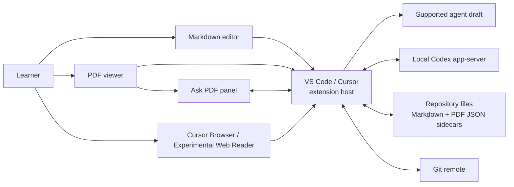

# Human Learning

Human Learning is a desktop learning workspace for VS Code and Cursor. Open a
normal Git repository, read Markdown, PDFs, and selected web passages, attach
source context to a supported agent draft, and keep durable PDF discussions
connected to their source.

The combined VS Code extension is the product. It is local-first,
filesystem-first, and intentionally has no web or mobile app.

For the complete design and integration guide, see
[Architecture and VS Code Integration](docs/architecture-and-vscode-integration.md).

## Learning loop

1. Open a Markdown file or PDF in VS Code or Cursor.
2. Select the passage you want to understand.
3. Use the selection prompt, context menu, or `Cmd+L` / `Ctrl+L` to add the
   passage to the active supported agent draft without submitting it.
4. For a PDF, optionally use the separate Ask PDF panel for a durable,
   multi-turn discussion.
5. Reopen a source annotation later to review its Markdown learning note.
6. Use the daily note and concept graph to decide what to revisit next.

Codex powers the built-in Ask PDF flow and its durable note creation.
**Send Selection to Agent…** exports exact Markdown text or the canonical PDF
extracted quote and attaches it to an installed Codex, Claude Code, Cursor
Agent, or CodeBuddy sidebar. Those
external sidebars own their own conversation; Human Learning does not scrape
their answers into a learning note.

**Add to Chat** is the compact action in the Markdown and PDF selection UI;
`Cmd+L` on macOS or `Ctrl+L` elsewhere invokes the same shared handoff. It
prefers an active Codex or Claude editor chat through stable VS Code APIs, then
uses a selected Cursor composer when Cursor exposes that capability. Ambiguous
sidebar-only cases show a provider picker instead of guessing. The command
refreshes `.hl/agent/selection.{md,json,png}` and attaches immutable files from
`.hl/agent/exports/<id>/`; optional visual evidence falls back to text context
if it cannot be saved or attached. Human Learning only updates the draft and
never submits it.

Cursor Browser selections can also be captured with bounded surrounding text
and a real selection crop. Stock VS Code cannot inspect Simple Browser, so the
separate **Experimental Web Reader** safely fetches and sanitizes public pages
and can attach a synthetic selection-context image; it does not support page
scripts, authentication, cookies, forms, or remote media.

## Current desktop features

- A CodeMirror-based Markdown editor with rendered headings, links, math,
  Mermaid, tables, code, images, callouts, tasks, footnotes, and optional Vim
  mode.
- An EmbedPDF/PDFium viewer with local rendering, page navigation, selection,
  highlights, and multi-turn passage discussions.
- **Add to Chat** for exact Markdown selections and canonical PDF
  extracted quotes through an
  automatic selection prompt, context menu, or `Cmd+L` / `Ctrl+L`; PDF also
  has a selection-toolbar action and optional crop attachment.
- Selection context export to available Codex, Claude Code, Cursor Agent, and
  CodeBuddy sidebars.
- Durable learning notes containing a portable source link, selected quote,
  concise summary, full transcript, and fixed review dates.
- Source annotations: Markdown displays a **✦ Note** link and PDF restores
  page-aligned highlights. Hovering the Markdown annotation, focusing its
  marker, or moving the caret into its exact range shows the previous question
  and concise answer; the marker opens the full durable note. PDF discussions
  can be reopened and continued in Ask PDF.
- Backlinks and forward links in the Human Learning activity view, contextual
  **Markdown Outline** and **PDF Outline** panels in the main Explorer sidebar,
  broken-link detection, and a concept graph parsed directly from repository
  Markdown.
- Explicit graph concepts and entities through YAML frontmatter.
- Daily notes with manual sections, unchecked TODO carry-forward, and review
  dates at 1, 3, 7, 14, 30, 60, and 90 days.
- Conservative Git updates: fetch, fast-forward when safe, and ask before a
  true merge. Dirty worktrees are left untouched.

## Files and Git are the source of truth

The active extension does not require SQLite or a generated database. A
repository is usable immediately after opening or cloning it.

```text
my-learning-repo/
├── notes/                         # authored Markdown, anywhere in the repo
├── papers/                        # source PDFs, anywhere in the repo
├── wiki/
│   ├── learning/                  # human-readable discussion records
│   └── daily/                     # daily plans and review checklists
├── .hl/
│   └── annotations/
│       └── pdf/
│           ├── <pdf-sha256>.json  # runtime discussion state
│           ├── <pdf-sha256>/      # portable annotation JSON-LD
│           └── assets/            # padded selection screenshots
└── .git/
```

Markdown learning notes are the readable study record: source quote, summary,
and complete Q&A. PDF highlight rectangles and the state needed to reopen the
PDF discussion are stored in a content-addressed JSON sidecar under
`.hl/annotations/pdf/` when the PDF is inside the repository. Each asked
annotation also gets a W3C-shaped JSON-LD mirror containing the exact text,
page, rectangles, PDF hash, learning-note link, and available screenshot metadata.
Markdown alone does not reconstruct page geometry. All forms are ordinary
files and can be reviewed, merged, and recovered with Git.

Markdown annotations use the exact quote plus line and character offsets
stored in the learning note; no separate annotation database is needed.

## Architecture



Webviews render and collect interaction. The extension host owns filesystem,
Git, VS Code API, and agent-process access. Codex threads are read-only; the
extension performs the explicit, atomic learning-note write after an answer
finishes.

## Focused product surface

The repository contains only the combined desktop extension and the shared
libraries it executes. The retired `hl` CLI, MCP server, SQLite index,
database-backed services, and standalone editor packages have been removed.
If a future headless or MCP integration has a concrete consumer, it should be
built on the same filesystem-first APIs instead of reviving a parallel
persistence layer.

## Repository packages

```text
packages/
├── vscode-extension/          # active combined VS Code/Cursor extension
├── pdf-editor/                # PDF webview shared by the combined extension
└── core/                      # portable references and PDF discussion storage
```

The combined extension ships `extension.js`, the Markdown, PDF, and
experimental web-reader bundles, plus `pdfium.wasm`. It does not ship
`sql.js`, `sql-wasm.wasm`, or require `.hl/index.sqlite`.

## Development

Requirements: Node.js 20.19 or newer, pnpm 10, and VS Code or Cursor.

```bash
pnpm install

# Type-check and test the repository
pnpm check

# Run browser-level webview tests
pnpm exec playwright test --config playwright.config.ts
```

In VS Code, open this repository and run the **Launch Human Learning
Extension** debug configuration (`F5`). It builds the combined package and
opens `demo-vault` in an Extension Development Host. The same extension entry
point can be launched in Cursor.

The root `pnpm build`, `pnpm test`, and `pnpm check` commands cover the complete
repository.

## Documentation

- [Architecture and VS Code Integration](docs/architecture-and-vscode-integration.md)
- [Current Feature List](docs/feature%20list.md)
- [Current Implementation Detail](docs/implementation%20detail.md)

The remaining proposals, assessments, timelines, reference notes, and files
under `docs/superpowers/` are historical design records. They may describe
database-backed, mobile, or split-package designs that are not part of the
current combined release.

## License

MIT
