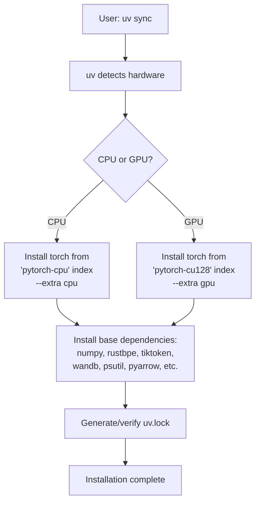
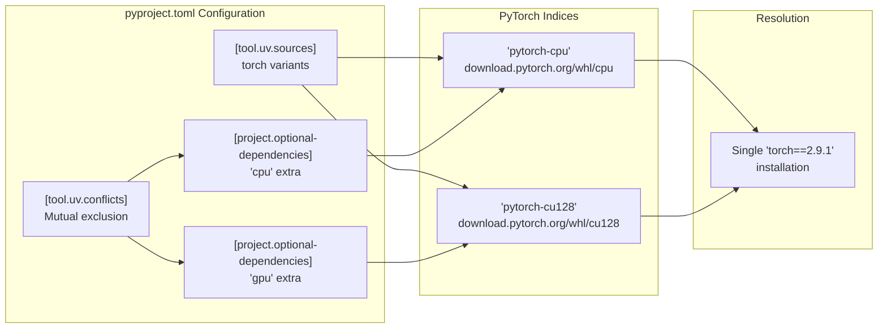
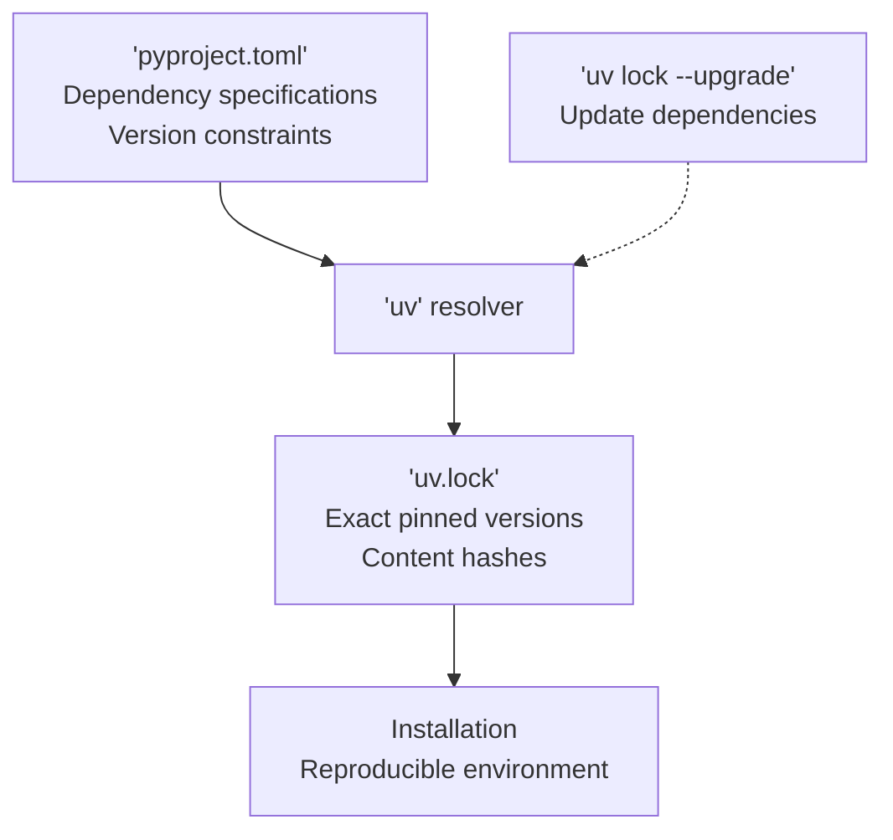

> [!WARNING]
> Imported from DeepWiki as generated, unverified repository documentation. Verify code-behavior claims against the revision below before stabilization.

# Installation and Setup

<details>
<summary>Relevant source files</summary>

The following files were used as context for generating this wiki page:

- [pyproject.toml](https://github.com/karpathy/nanochat/blob/92d63d4e8bb4df75c3b71618f31ddde2378b2bcd/pyproject.toml)
- [uv.lock](https://github.com/karpathy/nanochat/blob/92d63d4e8bb4df75c3b71618f31ddde2378b2bcd/uv.lock)

</details>


This page provides detailed instructions for installing nanochat and its dependencies. It covers the use of the `uv` package manager, handling CPU vs GPU PyTorch variants, and configuring the environment for training or inference. For running the complete training pipeline after installation, see [Quick Start: Running the Speedrun](deepwiki-02-02-quick-start-running-the-speedrun.md).

## Prerequisites

Nanochat requires Python 3.10 or higher [pyproject.toml:6](https://github.com/karpathy/nanochat/blob/92d63d4e8bb4df75c3b71618f31ddde2378b2bcd/pyproject.toml#L6). The system is designed to work on three hardware configurations:

| Hardware Type | Precision | Use Case |
|---------------|-----------|----------|
| NVIDIA GPU (SM80+) | BF16 | Training and inference |
| NVIDIA GPU (pre-Ampere) | FP32 | Inference only (limited training support) |
| CPU / Apple MPS | FP32 | Inference and lightweight testing |

**Sources:** [pyproject.toml:6](https://github.com/karpathy/nanochat/blob/92d63d4e8bb4df75c3b71618f31ddde2378b2bcd/pyproject.toml#L6)

## Installing the uv Package Manager

Nanochat uses `uv` as its package manager for fast, reliable dependency resolution. If you don't have `uv` installed:

```bash
# On macOS and Linux
curl -LsSf https://astral.sh/uv/install.sh | sh

# On Windows
powershell -c "irm https://astral.sh/uv/install.ps1 | iex"

# Verify installation
uv --version
```

**Sources:** [pyproject.toml:37-70](https://github.com/karpathy/nanochat/blob/92d63d4e8bb4df75c3b71618f31ddde2378b2bcd/pyproject.toml#L37-L70)

## Installing Dependencies

### Basic Installation Flow

The following diagram illustrates how `uv` resolves the environment based on the requested hardware extras defined in the configuration [pyproject.toml:53-60](https://github.com/karpathy/nanochat/blob/92d63d4e8bb4df75c3b71618f31ddde2378b2bcd/pyproject.toml#L53-L60).

**Dependency Resolution Flow**


**Sources:** [pyproject.toml:37-70](https://github.com/karpathy/nanochat/blob/92d63d4e8bb4df75c3b71618f31ddde2378b2bcd/pyproject.toml#L37-L70)

### Installing for GPU Training

For NVIDIA GPUs with CUDA 12.8 support:

```bash
# Clone the repository
git clone https://github.com/karpathy/nanochat.git
cd nanochat

# Install with GPU support
uv sync --extra gpu
```

This installs PyTorch 2.9.1 [pyproject.toml:15](https://github.com/karpathy/nanochat/blob/92d63d4e8bb4df75c3b71618f31ddde2378b2bcd/pyproject.toml#L15) with CUDA 12.8 binaries from the custom index `pytorch-cu128` located at `https://download.pytorch.org/whl/cu128` [pyproject.toml:48-51](https://github.com/karpathy/nanochat/blob/92d63d4e8bb4df75c3b71618f31ddde2378b2bcd/pyproject.toml#L48-L51).

**Sources:** [pyproject.toml:15](https://github.com/karpathy/nanochat/blob/92d63d4e8bb4df75c3b71618f31ddde2378b2bcd/pyproject.toml#L15), [pyproject.toml:48-51](https://github.com/karpathy/nanochat/blob/92d63d4e8bb4df75c3b71618f31ddde2378b2bcd/pyproject.toml#L48-L51), [pyproject.toml:58-60](https://github.com/karpathy/nanochat/blob/92d63d4e8bb4df75c3b71618f31ddde2378b2bcd/pyproject.toml#L58-L60)

### Installing for CPU-Only Usage

For CPU-only environments (development, testing, or lightweight inference):

```bash
# Install with CPU support
uv sync --extra cpu
```

This installs PyTorch 2.9.1 [pyproject.toml:15](https://github.com/karpathy/nanochat/blob/92d63d4e8bb4df75c3b71618f31ddde2378b2bcd/pyproject.toml#L15) with CPU-only binaries from the `pytorch-cpu` index at `https://download.pytorch.org/whl/cpu` [pyproject.toml:43-46](https://github.com/karpathy/nanochat/blob/92d63d4e8bb4df75c3b71618f31ddde2378b2bcd/pyproject.toml#L43-L46).

**Sources:** [pyproject.toml:15](https://github.com/karpathy/nanochat/blob/92d63d4e8bb4df75c3b71618f31ddde2378b2bcd/pyproject.toml#L15), [pyproject.toml:43-46](https://github.com/karpathy/nanochat/blob/92d63d4e8bb4df75c3b71618f31ddde2378b2bcd/pyproject.toml#L43-L46), [pyproject.toml:54-57](https://github.com/karpathy/nanochat/blob/92d63d4e8bb4df75c3b71618f31ddde2378b2bcd/pyproject.toml#L54-L57)

### Understanding the CPU/GPU Conflict Resolution System

The `pyproject.toml` defines a conflict between `cpu` and `gpu` extras to prevent installing both PyTorch variants simultaneously [pyproject.toml:64-69](https://github.com/karpathy/nanochat/blob/92d63d4e8bb4df75c3b71618f31ddde2378b2bcd/pyproject.toml#L64-L69). This is enforced in the `uv.lock` file through resolution markers that ensure only one set of hardware-specific dependencies is active [uv.lock:27-30](https://github.com/karpathy/nanochat/blob/92d63d4e8bb4df75c3b71618f31ddde2378b2bcd/uv.lock#L27-L30).

**Hardware Variant Conflict Logic**


The conflict mechanism ensures that `uv sync --extra cpu` and `uv sync --extra gpu` cannot both be active, preventing version conflicts and disk space waste [pyproject.toml:64-69](https://github.com/karpathy/nanochat/blob/92d63d4e8bb4df75c3b71618f31ddde2378b2bcd/pyproject.toml#L64-L69).

**Sources:** [pyproject.toml:37-70](https://github.com/karpathy/nanochat/blob/92d63d4e8bb4df75c3b71618f31ddde2378b2bcd/pyproject.toml#L37-L70), [uv.lock:27-30](https://github.com/karpathy/nanochat/blob/92d63d4e8bb4df75c3b71618f31ddde2378b2bcd/uv.lock#L27-L30)

## Core Dependencies

Nanochat's core dependencies are managed in `pyproject.toml` [pyproject.toml:7-17](https://github.com/karpathy/nanochat/blob/92d63d4e8bb4df75c3b71618f31ddde2378b2bcd/pyproject.toml#L7-L17):

| Category | Packages | Purpose |
|----------|----------|---------|
| Data Processing | `pyarrow`, `numpy` | Data loading and shard handling |
| Tokenization | `rustbpe`, `tiktoken` | BPE tokenizer training and inference |
| Deep Learning | `torch==2.9.1` | Core PyTorch framework |
| Optimization | `kernels` | Specialized CUDA kernels |
| Utilities | `psutil`, `filelock` | System monitoring and multi-process locks |
| Experiment Tracking | `wandb` | Optional training metrics logging |
| Development | `pytest`, `ipykernel`, `matplotlib`, `python-dotenv` | Testing and notebook support |

**Sources:** [pyproject.toml:7-17](https://github.com/karpathy/nanochat/blob/92d63d4e8bb4df75c3b71618f31ddde2378b2bcd/pyproject.toml#L7-L17), [pyproject.toml:19-25](https://github.com/karpathy/nanochat/blob/92d63d4e8bb4df75c3b71618f31ddde2378b2bcd/pyproject.toml#L19-L25)

## Environment Configuration

### Precision Control

The system supports explicit precision control. While not explicitly defined in the provided `pyproject.toml`, the project uses `COMPUTE_DTYPE` systems to handle hardware-specific precision selection.

### Optional: Weights & Biases Integration

For experiment tracking with Weights & Biases, the `wandb` package is included in dependencies [pyproject.toml:16](https://github.com/karpathy/nanochat/blob/92d63d4e8bb4df75c3b71618f31ddde2378b2bcd/pyproject.toml#L16):

```bash
# Set your API key
export WANDB_API_KEY=your_key_here

# Or disable wandb entirely
export WANDB_MODE=disabled
```

**Sources:** [pyproject.toml:16](https://github.com/karpathy/nanochat/blob/92d63d4e8bb4df75c3b71618f31ddde2378b2bcd/pyproject.toml#L16)

## Verifying Installation

After installation, verify that all components are working:

```bash
# Activate the uv virtual environment
source .venv/bin/activate  # Linux/macOS
# or
.venv\Scripts\activate  # Windows

# Check Python version
python --version  # Should be 3.10+ [pyproject.toml:6]

# Check PyTorch installation and CUDA availability
python -c "import torch; print(f'PyTorch: {torch.__version__}'); print(f'CUDA available: {torch.cuda.is_available()}')"

# Check core dependencies
python -c "import numpy, rustbpe, tiktoken; print('Core dependencies OK')"
```

Expected output for GPU installation:
```
Python 3.10.x (or higher)
PyTorch: 2.9.1
CUDA available: True
Core dependencies OK
```

**Sources:** [pyproject.toml:6](https://github.com/karpathy/nanochat/blob/92d63d4e8bb4df75c3b71618f31ddde2378b2bcd/pyproject.toml#L6), [pyproject.toml:15](https://github.com/karpathy/nanochat/blob/92d63d4e8bb4df75c3b71618f31ddde2378b2bcd/pyproject.toml#L15)

## Development Installation

For contributors who need testing capabilities, `pytest` is provided in the `dev` dependency group [pyproject.toml:23](https://github.com/karpathy/nanochat/blob/92d63d4e8bb4df75c3b71618f31ddde2378b2bcd/pyproject.toml#L23). The test suite is configured to look in the `tests` directory [pyproject.toml:31](https://github.com/karpathy/nanochat/blob/92d63d4e8bb4df75c3b71618f31ddde2378b2bcd/pyproject.toml#L31).

```bash
# Install with dev dependencies
uv sync --extra gpu --group dev  # or --extra cpu --group dev

# Run tests to verify
pytest
```

The test configuration in `pyproject.toml` defines markers such as `slow` for long-running tests [pyproject.toml:28-30](https://github.com/karpathy/nanochat/blob/92d63d4e8bb4df75c3b71618f31ddde2378b2bcd/pyproject.toml#L28-L30) and specifies patterns for test discovery [pyproject.toml:32-34](https://github.com/karpathy/nanochat/blob/92d63d4e8bb4df75c3b71618f31ddde2378b2bcd/pyproject.toml#L32-L34).

**Sources:** [pyproject.toml:19-25](https://github.com/karpathy/nanochat/blob/92d63d4e8bb4df75c3b71618f31ddde2378b2bcd/pyproject.toml#L19-L25), [pyproject.toml:27-34](https://github.com/karpathy/nanochat/blob/92d63d4e8bb4df75c3b71618f31ddde2378b2bcd/pyproject.toml#L27-L34)

## Dependency Resolution and Lock File

The `uv.lock` file provides cryptographic hashes and pinned versions for every dependency in the tree [uv.lock:1-26](https://github.com/karpathy/nanochat/blob/92d63d4e8bb4df75c3b71618f31ddde2378b2bcd/uv.lock#L1-L26). It handles complex resolution markers to ensure that specific extras (like `gpu` vs `cpu`) result in the correct wheel selection for the target platform [uv.lock:4-26](https://github.com/karpathy/nanochat/blob/92d63d4e8bb4df75c3b71618f31ddde2378b2bcd/uv.lock#L4-L26).

**Lockfile and Sync Architecture**


The `uv.lock` file ensures reproducible installations across different machines by resolving specific platform markers and extras [uv.lock:4-26](https://github.com/karpathy/nanochat/blob/92d63d4e8bb4df75c3b71618f31ddde2378b2bcd/uv.lock#L4-L26). To update dependencies:

```bash
# Update all dependencies to latest compatible versions
uv lock --upgrade

# Then sync to install updated versions
uv sync --extra gpu  # or --extra cpu
```

**Sources:** [pyproject.toml:1-70](https://github.com/karpathy/nanochat/blob/92d63d4e8bb4df75c3b71618f31ddde2378b2bcd/pyproject.toml#L1-L70), [uv.lock:1-30](https://github.com/karpathy/nanochat/blob/92d63d4e8bb4df75c3b71618f31ddde2378b2bcd/uv.lock#L1-L30)
