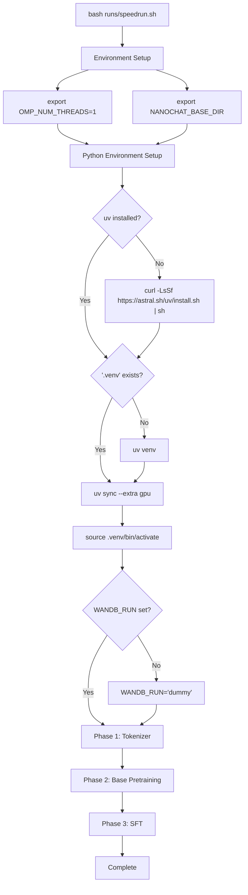
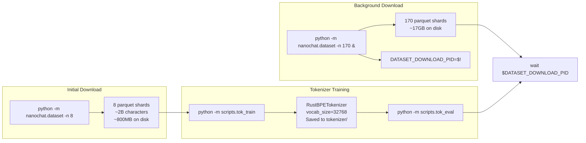

> [!WARNING]
> Imported from DeepWiki as generated, unverified repository documentation. Verify code-behavior claims against the revision below before stabilization.

# Quick Start: Running the Speedrun

<details>
<summary>Relevant source files</summary>

The following files were used as context for generating this wiki page:

- [runs/runcpu.sh](https://github.com/karpathy/nanochat/blob/92d63d4e8bb4df75c3b71618f31ddde2378b2bcd/runs/runcpu.sh)
- [runs/speedrun.sh](https://github.com/karpathy/nanochat/blob/92d63d4e8bb4df75c3b71618f31ddde2378b2bcd/runs/speedrun.sh)

</details>


## Purpose and Scope

This page walks through executing [runs/speedrun.sh:1-80](https://github.com/karpathy/nanochat/blob/92d63d4e8bb4df75c3b71618f31ddde2378b2bcd/runs/speedrun.sh#L1-L80), the complete end-to-end pipeline that trains a GPT-2 grade language model from scratch in approximately 1.5 hours on an 8xH100 GPU node. The speedrun encompasses data download, tokenizer training, base model pretraining, and supervised fine-tuning (SFT).

For detailed explanations of each training phase, see **2.3 Training Pipeline Overview**. For installation instructions and hardware requirements, see **2.1 Installation and Setup**. For information about the evaluation metrics and leaderboard criteria, see **9.2 Time-to-GPT-2 Leaderboard**.

**Sources**: [runs/speedrun.sh:1-80](https://github.com/karpathy/nanochat/blob/92d63d4e8bb4df75c3b71618f31ddde2378b2bcd/runs/speedrun.sh#L1-L80)

---

## Prerequisites

Before running the speedrun, ensure the environment meets these specifications:

| Requirement | Specification | Notes |
|------------|---------------|-------|
| **Hardware** | 8xH100 GPUs (80GB each) | Optimized for Hopper [runs/speedrun.sh:4](https://github.com/karpathy/nanochat/blob/92d63d4e8bb4df75c3b71618f31ddde2378b2bcd/runs/speedrun.sh#L4). |
| **Disk Space** | ~20GB free | For data shards (~17GB) + checkpoints [runs/speedrun.sh:53-54](https://github.com/karpathy/nanochat/blob/92d63d4e8bb4df75c3b71618f31ddde2378b2bcd/runs/speedrun.sh#L53-L54). |
| **Memory** | Sufficient RAM | For data loading and preprocessing [runs/speedrun.sh:50](https://github.com/karpathy/nanochat/blob/92d63d4e8bb4df75c3b71618f31ddde2378b2bcd/runs/speedrun.sh#L50). |
| **Network** | Stable connection | To download ClimbMix dataset shards [runs/speedrun.sh:50-54](https://github.com/karpathy/nanochat/blob/92d63d4e8bb4df75c3b71618f31ddde2378b2bcd/runs/speedrun.sh#L50-L54). |
| **Optional** | wandb account | For experiment tracking and visualization [runs/speedrun.sh:31-40](https://github.com/karpathy/nanochat/blob/92d63d4e8bb4df75c3b71618f31ddde2378b2bcd/runs/speedrun.sh#L31-L40). |

**Sources**: [runs/speedrun.sh:1-60](https://github.com/karpathy/nanochat/blob/92d63d4e8bb4df75c3b71618f31ddde2378b2bcd/runs/speedrun.sh#L1-L60)

---

## Launching the Speedrun

### Basic Launch

The simplest way to start the speedrun:

```bash
bash runs/speedrun.sh
```
[runs/speedrun.sh:6-7](https://github.com/karpathy/nanochat/blob/92d63d4e8bb4df75c3b71618f31ddde2378b2bcd/runs/speedrun.sh#L6-L7)

### Recommended: Screen Session Launch

Since the run takes ~1.5 hours, it is recommended to use a screen session with logging to prevent interruption:

```bash
screen -L -Logfile runs/speedrun.log -S speedrun bash runs/speedrun.sh
```
[runs/speedrun.sh:8-9](https://github.com/karpathy/nanochat/blob/92d63d4e8bb4df75c3b71618f31ddde2378b2bcd/runs/speedrun.sh#L8-L9)

### With wandb Logging

To enable Weights & Biases logging for experiment tracking, set the `WANDB_RUN` environment variable:

```bash
# First, ensure you're logged in
wandb login

# Then launch
WANDB_RUN=speedrun_v1 bash runs/speedrun.sh
```
If `WANDB_RUN` is not set, the script defaults to `"dummy"`, which disables wandb logging [runs/speedrun.sh:37-40](https://github.com/karpathy/nanochat/blob/92d63d4e8bb4df75c3b71618f31ddde2378b2bcd/runs/speedrun.sh#L37-L40).

**Sources**: [runs/speedrun.sh:6-40](https://github.com/karpathy/nanochat/blob/92d63d4e8bb4df75c3b71618f31ddde2378b2bcd/runs/speedrun.sh#L6-L40)

---

## Environment Configuration

### Speedrun Execution Flow



The speedrun sets critical environment variables at [runs/speedrun.sh:14-16](https://github.com/karpathy/nanochat/blob/92d63d4e8bb4df75c3b71618f31ddde2378b2bcd/runs/speedrun.sh#L14-L16):
- **`OMP_NUM_THREADS=1`**: Prevents OpenMP from spawning excessive threads that interfere with PyTorch's parallelism.
- **`NANOCHAT_BASE_DIR`**: Defaults to `~/.cache/nanochat`, where all intermediate artifacts (data shards, checkpoints, tokenizer) are stored.

### Python Virtual Environment Setup

The speedrun handles dependency installation via `uv` at [runs/speedrun.sh:21-28](https://github.com/karpathy/nanochat/blob/92d63d4e8bb4df75c3b71618f31ddde2378b2bcd/runs/speedrun.sh#L21-L28):
1. **Install uv**: Downloads and installs the `uv` package manager if missing.
2. **Create `.venv`**: Creates a local virtual environment.
3. **Install dependencies**: Runs `uv sync --extra gpu` to install PyTorch with CUDA support and all project dependencies.
4. **Activate environment**: Sources `.venv/bin/activate` so subsequent Python commands use the correct environment.

**Sources**: [runs/speedrun.sh:14-28](https://github.com/karpathy/nanochat/blob/92d63d4e8bb4df75c3b71618f31ddde2378b2bcd/runs/speedrun.sh#L14-L28)

---

## The Three-Phase Pipeline

### Phase 1: Tokenizer Training

#### Data Download and Tokenizer Training Flow



Phase 1 executes the following at [runs/speedrun.sh:50-64](https://github.com/karpathy/nanochat/blob/92d63d4e8bb4df75c3b71618f31ddde2378b2bcd/runs/speedrun.sh#L50-L64):
1. **Initial Download**: Downloads 8 shards (~2B characters) for tokenizer training using `nanochat.dataset` [runs/speedrun.sh:50](https://github.com/karpathy/nanochat/blob/92d63d4e8bb4df75c3b71618f31ddde2378b2bcd/runs/speedrun.sh#L50).
2. **Background Download**: Immediately kicks off a background process to download 170 shards required for the full pretraining [runs/speedrun.sh:54](https://github.com/karpathy/nanochat/blob/92d63d4e8bb4df75c3b71618f31ddde2378b2bcd/runs/speedrun.sh#L54).
3. **`scripts.tok_train`**: Trains a `RustBPETokenizer` with `vocab_size=32768` on the initial 8 shards [runs/speedrun.sh:57](https://github.com/karpathy/nanochat/blob/92d63d4e8bb4df75c3b71618f31ddde2378b2bcd/runs/speedrun.sh#L57).
4. **`scripts.tok_eval`**: Evaluates tokenizer compression ratio on news, code, and math samples [runs/speedrun.sh:59](https://github.com/karpathy/nanochat/blob/92d63d4e8bb4df75c3b71618f31ddde2378b2bcd/runs/speedrun.sh#L59).

**Sources**: [runs/speedrun.sh:50-64](https://github.com/karpathy/nanochat/blob/92d63d4e8bb4df75c3b71618f31ddde2378b2bcd/runs/speedrun.sh#L50-L64)

---

### Phase 2: Base Model Pretraining

#### Pretraining Command Breakdown

The base pretraining is executed via `torchrun` at [runs/speedrun.sh:67](https://github.com/karpathy/nanochat/blob/92d63d4e8bb4df75c3b71618f31ddde2378b2bcd/runs/speedrun.sh#L67):

```bash
torchrun --standalone --nproc_per_node=8 -m scripts.base_train -- \
    --depth=24 \
    --target-param-data-ratio=8 \
    --device-batch-size=16 \
    --fp8 \
    --run=$WANDB_RUN
```

**Command Component Analysis**:

| Component | Purpose | Notes |
|-----------|---------|-------|
| `--nproc_per_node=8` | Spawns 8 processes | One per GPU in the node [runs/speedrun.sh:67](https://github.com/karpathy/nanochat/blob/92d63d4e8bb4df75c3b71618f31ddde2378b2bcd/runs/speedrun.sh#L67). |
| `--depth=24` | Model size | Controls hyperparameters via scaling laws [runs/speedrun.sh:67](https://github.com/karpathy/nanochat/blob/92d63d4e8bb4df75c3b71618f31ddde2378b2bcd/runs/speedrun.sh#L67). |
| `--target-param-data-ratio=8` | Training horizon | Ratio of tokens to parameters; 8 is slightly undertrained to beat GPT-2 [runs/speedrun.sh:66-67](https://github.com/karpathy/nanochat/blob/92d63d4e8bb4df75c3b71618f31ddde2378b2bcd/runs/speedrun.sh#L66-L67). |
| `--device-batch-size=16` | Sequences per GPU | Local batch size before accumulation [runs/speedrun.sh:67](https://github.com/karpathy/nanochat/blob/92d63d4e8bb4df75c3b71618f31ddde2378b2bcd/runs/speedrun.sh#L67). |
| `--fp8` | Enable FP8 training | Uses `torchao` for hardware acceleration on H100 [runs/speedrun.sh:67](https://github.com/karpathy/nanochat/blob/92d63d4e8bb4df75c3b71618f31ddde2378b2bcd/runs/speedrun.sh#L67). |

#### Base Model Evaluation

After training, the model is evaluated at [runs/speedrun.sh:69](https://github.com/karpathy/nanochat/blob/92d63d4e8bb4df75c3b71618f31ddde2378b2bcd/runs/speedrun.sh#L69):
- **CORE metric**: Accuracy on a suite of benchmarks.
- **BPB**: Bits-per-byte on train/val splits.
- **Sampling**: Generates example completions to verify text quality.

**Sources**: [runs/speedrun.sh:66-70](https://github.com/karpathy/nanochat/blob/92d63d4e8bb4df75c3b71618f31ddde2378b2bcd/runs/speedrun.sh#L66-L70)

---

### Phase 3: Supervised Fine-Tuning (SFT)

The SFT phase executes at [runs/speedrun.sh:75-76](https://github.com/karpathy/nanochat/blob/92d63d4e8bb4df75c3b71618f31ddde2378b2bcd/runs/speedrun.sh#L75-L76):
1. **`scripts.chat_sft`**: Loads the base model checkpoint and fine-tunes it to teach the model conversation special tokens, tool use, and multiple-choice formatting [runs/speedrun.sh:72-75](https://github.com/karpathy/nanochat/blob/92d63d4e8bb4df75c3b71618f31ddde2378b2bcd/runs/speedrun.sh#L72-L75).
2. **`scripts.chat_eval`**: Evaluates the resulting chat model to verify instruction-following capabilities [runs/speedrun.sh:76](https://github.com/karpathy/nanochat/blob/92d63d4e8bb4df75c3b71618f31ddde2378b2bcd/runs/speedrun.sh#L76).

**Sources**: [runs/speedrun.sh:72-76](https://github.com/karpathy/nanochat/blob/92d63d4e8bb4df75c3b71618f31ddde2378b2bcd/runs/speedrun.sh#L72-L76)

---

## Interacting with Your Trained Model

### Command Line Interface

After the speedrun completes, you can chat with the model via the CLI:

```bash
python -m scripts.chat_cli -p "Why is the sky blue?"
```
[runs/speedrun.sh:79-80](https://github.com/karpathy/nanochat/blob/92d63d4e8bb4df75c3b71618f31ddde2378b2bcd/runs/speedrun.sh#L79-L80)

### CPU/Macbook Alternative

For local testing on hardware without 8xH100 GPUs, `runs/runcpu.sh` provides a scaled-down version that trains a 6-layer model in approximately 40 minutes on an M3 Max [runs/runcpu.sh:1-58](https://github.com/karpathy/nanochat/blob/92d63d4e8bb4df75c3b71618f31ddde2378b2bcd/runs/runcpu.sh#L1-L58).

Key differences in `runs/runcpu.sh`:
- Uses `uv sync --extra cpu` [runs/runcpu.sh:18](https://github.com/karpathy/nanochat/blob/92d63d4e8bb4df75c3b71618f31ddde2378b2bcd/runs/runcpu.sh#L18).
- Smaller model architecture (`--depth=6`, `--head-dim=64`) [runs/runcpu.sh:33-34](https://github.com/karpathy/nanochat/blob/92d63d4e8bb4df75c3b71618f31ddde2378b2bcd/runs/runcpu.sh#L33-L34).
- Shorter training horizon (`--num-iterations=5000`) [runs/runcpu.sh:43](https://github.com/karpathy/nanochat/blob/92d63d4e8bb4df75c3b71618f31ddde2378b2bcd/runs/runcpu.sh#L43).
- Skips distributed `torchrun` in favor of single-process `python` calls [runs/runcpu.sh:32](https://github.com/karpathy/nanochat/blob/92d63d4e8bb4df75c3b71618f31ddde2378b2bcd/runs/runcpu.sh#L32).

**Sources**: [runs/speedrun.sh:79-80](https://github.com/karpathy/nanochat/blob/92d63d4e8bb4df75c3b71618f31ddde2378b2bcd/runs/speedrun.sh#L79-L80), [runs/runcpu.sh:1-58](https://github.com/karpathy/nanochat/blob/92d63d4e8bb4df75c3b71618f31ddde2378b2bcd/runs/runcpu.sh#L1-L58)
