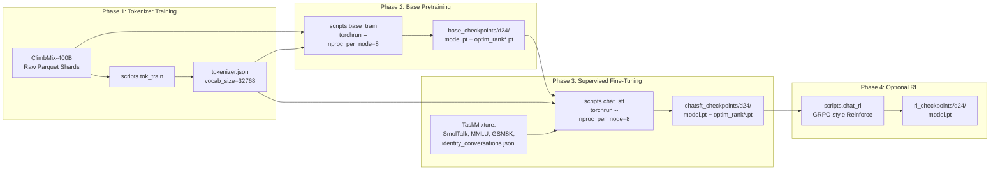
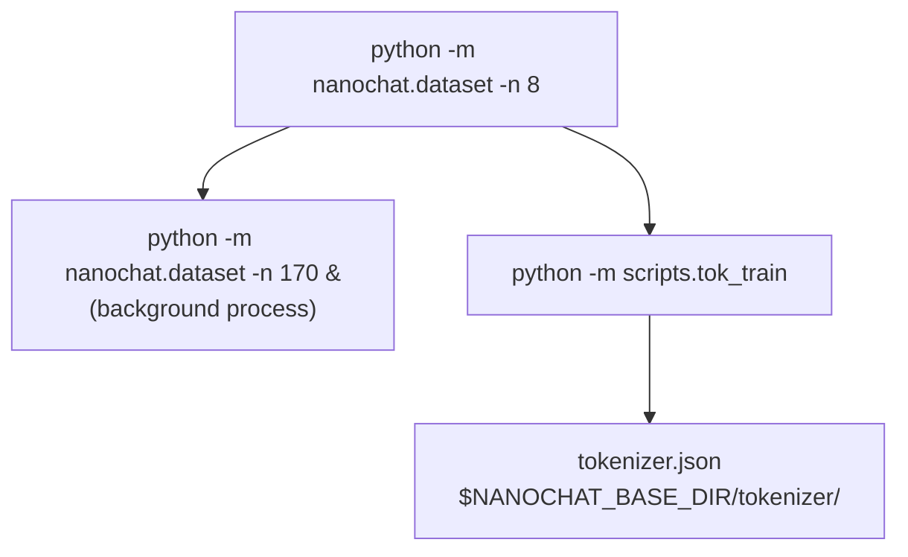
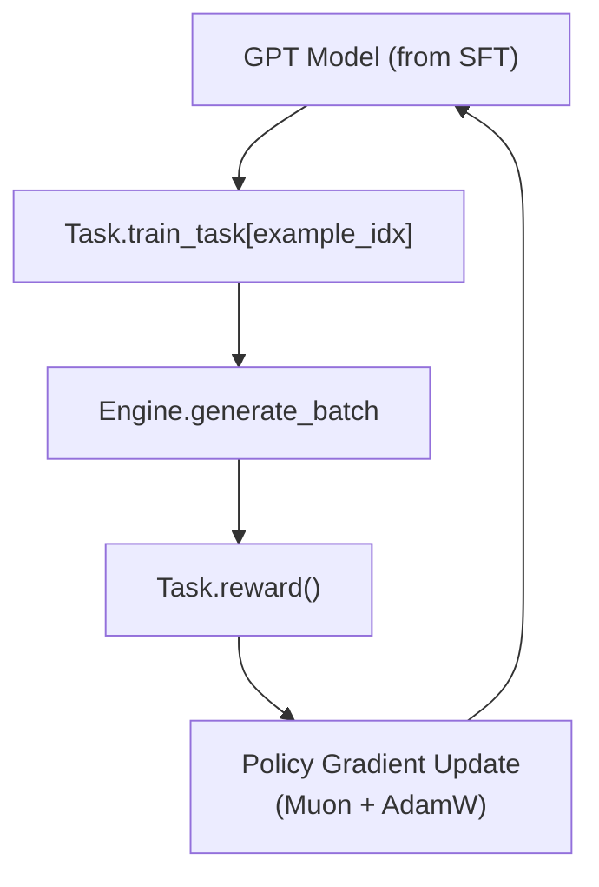

> [!WARNING]
> Imported from DeepWiki as generated, unverified repository documentation. Verify code-behavior claims against the revision below before stabilization.

# Training Pipeline Overview

Relevant source files

The following files were used as context for generating this wiki page:

- [README.md](https://github.com/karpathy/nanochat/blob/92d63d4e8bb4df75c3b71618f31ddde2378b2bcd/README.md)
- [runs/runcpu.sh](https://github.com/karpathy/nanochat/blob/92d63d4e8bb4df75c3b71618f31ddde2378b2bcd/runs/runcpu.sh)
- [runs/speedrun.sh](https://github.com/karpathy/nanochat/blob/92d63d4e8bb4df75c3b71618f31ddde2378b2bcd/runs/speedrun.sh)

**Purpose and Scope**: This page provides a high-level overview of nanochat's training pipeline that transforms raw text data into a deployable chat model. The pipeline is designed for speed and efficiency, capable of reaching GPT-2 grade performance in approximately 2 hours on an 8xH100 GPU node [README.md:12-24](https://github.com/karpathy/nanochat/blob/92d63d4e8bb4df75c3b71618f31ddde2378b2bcd/README.md#L12-L24). For detailed configuration and training mechanics of base pretraining, see **3. Base Model Pretraining**. For supervised fine-tuning implementation details, see **7. Supervised Fine-Tuning (SFT)**.

## Pipeline Architecture

The nanochat training pipeline consists of three primary sequential phases, with an optional reinforcement learning stage. These are orchestrated by `runs/speedrun.sh` [runs/speedrun.sh:1-80](https://github.com/karpathy/nanochat/blob/92d63d4e8bb4df75c3b71618f31ddde2378b2bcd/runs/speedrun.sh#L1-L80). Each phase produces artifacts consumed by the next:

### Data Flow and Code Entity Mapping
The following diagram bridges the conceptual training stages with the specific scripts and data structures used in the codebase.

**Sources**: [runs/speedrun.sh:1-80](https://github.com/karpathy/nanochat/blob/92d63d4e8bb4df75c3b71618f31ddde2378b2bcd/runs/speedrun.sh#L1-L80), [README.md:12-24](https://github.com/karpathy/nanochat/blob/92d63d4e8bb4df75c3b71618f31ddde2378b2bcd/README.md#L12-L24), [scripts/chat_cli.py:1-101](https://github.com/karpathy/nanochat/blob/92d63d4e8bb4df75c3b71618f31ddde2378b2bcd/scripts/chat_cli.py#L1-L101)

---

## Phase 1: Tokenizer Training

### Inputs and Execution

Phase 1 trains a Byte-Pair Encoding (BPE) tokenizer. It operates on a subset of the pretraining corpus to allow training to begin while the full dataset is still downloading [runs/speedrun.sh:45-57](https://github.com/karpathy/nanochat/blob/92d63d4e8bb4df75c3b71618f31ddde2378b2bcd/runs/speedrun.sh#L45-L57).

| Component | Details |
|-----------|---------|
| **Script** | `scripts.tok_train` [runs/speedrun.sh:57](https://github.com/karpathy/nanochat/blob/92d63d4e8bb4df75c3b71618f31ddde2378b2bcd/runs/speedrun.sh#L57) |
| **Input Data** | First 2B characters of ClimbMix-400B [runs/speedrun.sh:45-50](https://github.com/karpathy/nanochat/blob/92d63d4e8bb4df75c3b71618f31ddde2378b2bcd/runs/speedrun.sh#L45-L50) |
| **Vocabulary Size** | 32,768 tokens (2^15) [runs/speedrun.sh:56](https://github.com/karpathy/nanochat/blob/92d63d4e8bb4df75c3b71618f31ddde2378b2bcd/runs/speedrun.sh#L56) |
| **Data Fetching** | `nanochat.dataset` handles shard downloading [runs/speedrun.sh:50-54](https://github.com/karpathy/nanochat/blob/92d63d4e8bb4df75c3b71618f31ddde2378b2bcd/runs/speedrun.sh#L50-L54) |

**Sources**: [runs/speedrun.sh:43-60](https://github.com/karpathy/nanochat/blob/92d63d4e8bb4df75c3b71618f31ddde2378b2bcd/runs/speedrun.sh#L43-L60), [nanochat/dataset.py](https://github.com/karpathy/nanochat/blob/92d63d4e8bb4df75c3b71618f31ddde2378b2bcd/nanochat/dataset.py)

### Output Artifacts

- **`tokenizer.json`**: BPE vocabulary and merge rules.
- **Evaluation**: The script `scripts.tok_eval` is run immediately after training to report compression ratios and verify the vocabulary [runs/speedrun.sh:59](https://github.com/karpathy/nanochat/blob/92d63d4e8bb4df75c3b71618f31ddde2378b2bcd/runs/speedrun.sh#L59).

---

## Phase 2: Base Model Pretraining

### The Complexity Dial

The `--depth` parameter is the central "complexity dial" that auto-configures the transformer architecture and training hyperparameters [README.md:6](https://github.com/karpathy/nanochat/blob/92d63d4e8bb4df75c3b71618f31ddde2378b2bcd/README.md#L6). `scripts.base_train` uses this to calculate width, heads, batch size, and learning rates [README.md:6](https://github.com/karpathy/nanochat/blob/92d63d4e8bb4df75c3b71618f31ddde2378b2bcd/README.md#L6).

| Target | Depth | Approx Params | Purpose |
|--------|-------|---------------|---------|
| GPT-1 Size | 12 | ~125M | Quick research iterations [README.md:88-92](https://github.com/karpathy/nanochat/blob/92d63d4e8bb4df75c3b71618f31ddde2378b2bcd/README.md#L88-L92) |
| Speedrun | 24 | ~730M | Default leaderboard target [runs/speedrun.sh:67](https://github.com/karpathy/nanochat/blob/92d63d4e8bb4df75c3b71618f31ddde2378b2bcd/runs/speedrun.sh#L67) |
| GPT-2 Grade | 26 | ~850M | High-capability target [README.md:6](https://github.com/karpathy/nanochat/blob/92d63d4e8bb4df75c3b71618f31ddde2378b2bcd/README.md#L6) |

### Data Loading and Optimization

The pretraining phase utilizes the ClimbMix dataset [README.md:20](https://github.com/karpathy/nanochat/blob/92d63d4e8bb4df75c3b71618f31ddde2378b2bcd/README.md#L20). Training is optimized using a hybrid approach (Muon for matrices, AdamW for others) and can utilize `--fp8` precision for improved throughput [runs/speedrun.sh:67](https://github.com/karpathy/nanochat/blob/92d63d4e8bb4df75c3b71618f31ddde2378b2bcd/runs/speedrun.sh#L67). Periodic evaluation is performed using the CORE metric via `scripts.base_eval` [runs/speedrun.sh:69](https://github.com/karpathy/nanochat/blob/92d63d4e8bb4df75c3b71618f31ddde2378b2bcd/runs/speedrun.sh#L69).

**Sources**: [README.md:6-24](https://github.com/karpathy/nanochat/blob/92d63d4e8bb4df75c3b71618f31ddde2378b2bcd/README.md#L6-L24), [runs/speedrun.sh:62-70](https://github.com/karpathy/nanochat/blob/92d63d4e8bb4df75c3b71618f31ddde2378b2bcd/runs/speedrun.sh#L62-L70)

---

## Phase 3: Supervised Fine-Tuning (SFT)

### Transition to Chat

SFT transitions the model from next-token prediction to a conversational agent by teaching it special tokens and instruction following [runs/speedrun.sh:72-75](https://github.com/karpathy/nanochat/blob/92d63d4e8bb4df75c3b71618f31ddde2378b2bcd/runs/speedrun.sh#L72-L75).

- **Tool Use**: Models are taught to use a calculator or execute code via specific task mixtures [runs/speedrun.sh:72](https://github.com/karpathy/nanochat/blob/92d63d4e8bb4df75c3b71618f31ddde2378b2bcd/runs/speedrun.sh#L72).
- **Task Mixture**: SFT combines multiple data sources including conversation datasets (SmolTalk) and reasoning tasks [runs/speedrun.sh:75](https://github.com/karpathy/nanochat/blob/92d63d4e8bb4df75c3b71618f31ddde2378b2bcd/runs/speedrun.sh#L75).
- **Evaluation**: The `scripts.chat_eval` script measures the performance of the SFT model on conversational benchmarks [runs/speedrun.sh:76](https://github.com/karpathy/nanochat/blob/92d63d4e8bb4df75c3b71618f31ddde2378b2bcd/runs/speedrun.sh#L76).

### Chat State Machine

The model uses a specific state machine for multi-turn dialogue, wrapping user and assistant turns in start/end tokens during generation in `scripts.chat_cli` [scripts/chat_cli.py:30-32](https://github.com/karpathy/nanochat/blob/92d63d4e8bb4df75c3b71618f31ddde2378b2bcd/scripts/chat_cli.py#L30-L32).

**Sources**: [runs/speedrun.sh:72-76](https://github.com/karpathy/nanochat/blob/92d63d4e8bb4df75c3b71618f31ddde2378b2bcd/runs/speedrun.sh#L72-L76), [scripts/chat_cli.py:30-32](https://github.com/karpathy/nanochat/blob/92d63d4e8bb4df75c3b71618f31ddde2378b2bcd/scripts/chat_cli.py#L30-L32)

---

## Phase 4: Optional Reinforcement Learning (RL)

For specific reasoning tasks like GSM8K, an optional RL stage can be applied. While not in the primary `speedrun.sh` flow, it is a supported stage for advanced capability tuning.

### RL Implementation: Simplified REINFORCE

The RL implementation is a simplified on-policy algorithm that focuses on maximizing rewards (correct answers) using a policy gradient approach.

| Feature | Implementation |
|---------|----------------|
| **Task** | Typically GSM8K (math word problems) |
| **Rollouts** | Batched generation via `Engine.generate_batch` |
| **Reward** | Binary or scalar based on correct output execution/parsing |
| **Advantage** | `(reward - mean_reward)` used to scale gradients |

### RL Data Flow and Entities

**Sources**: [README.md:1-6](https://github.com/karpathy/nanochat/blob/92d63d4e8bb4df75c3b71618f31ddde2378b2bcd/README.md#L1-L6), [runs/speedrun.sh:72-76](https://github.com/karpathy/nanochat/blob/92d63d4e8bb4df75c3b71618f31ddde2378b2bcd/runs/speedrun.sh#L72-L76)

---

## Resumption and Checkpointing

All training scripts utilize a centralized checkpointing strategy to handle distributed state and loading across phases.

- **Loading**: Models are loaded via a standard utility that handles locating the correct checkpoint from previous phases (e.g., `scripts.chat_sft` loading the output of `scripts.base_train`) [runs/speedrun.sh:75](https://github.com/karpathy/nanochat/blob/92d63d4e8bb4df75c3b71618f31ddde2378b2bcd/runs/speedrun.sh#L75).
- **Inference**: The `Engine` class (in `nanochat/engine.py`) is used across SFT evaluation and CLI scripts to provide a unified interface for token generation [scripts/chat_cli.py:35](https://github.com/karpathy/nanochat/blob/92d63d4e8bb4df75c3b71618f31ddde2378b2bcd/scripts/chat_cli.py#L35).

**Sources**: [runs/speedrun.sh:1-80](https://github.com/karpathy/nanochat/blob/92d63d4e8bb4df75c3b71618f31ddde2378b2bcd/runs/speedrun.sh#L1-L80), [scripts/chat_cli.py:27-35](https://github.com/karpathy/nanochat/blob/92d63d4e8bb4df75c3b71618f31ddde2378b2bcd/scripts/chat_cli.py#L27-L35)
