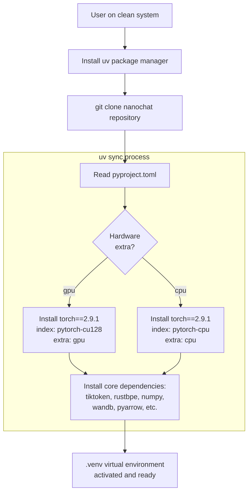
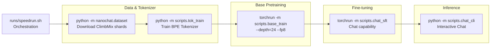

> [!WARNING]
> Imported from DeepWiki as generated, unverified repository documentation. Verify code-behavior claims against the revision below before stabilization.

# Getting Started

<details>
<summary>Relevant source files</summary>

The following files were used as context for generating this wiki page:

- [pyproject.toml](https://github.com/karpathy/nanochat/blob/92d63d4e8bb4df75c3b71618f31ddde2378b2bcd/pyproject.toml)
- [runs/runcpu.sh](https://github.com/karpathy/nanochat/blob/92d63d4e8bb4df75c3b71618f31ddde2378b2bcd/runs/runcpu.sh)
- [runs/speedrun.sh](https://github.com/karpathy/nanochat/blob/92d63d4e8bb4df75c3b71618f31ddde2378b2bcd/runs/speedrun.sh)
- [uv.lock](https://github.com/karpathy/nanochat/blob/92d63d4e8bb4df75c3b71618f31ddde2378b2bcd/uv.lock)

</details>


This page guides you through the initial setup and first run of nanochat. It covers hardware prerequisites, installation using `uv`, and executing your first training run via `runs/speedrun.sh`. For detailed installation instructions, see [Installation and Setup](deepwiki-02-01-installation-and-setup.md). For a step-by-step walkthrough of the speedrun pipeline, see [Quick Start: Running the Speedrun](deepwiki-02-02-quick-start-running-the-speedrun.md). For an architectural overview of the training stages, see [Training Pipeline Overview](deepwiki-02-03-training-pipeline-overview.md).

---

## Purpose and Scope

nanochat is designed to be the simplest path to training your own ChatGPT-like model end-to-end. This page provides:

- Hardware and software prerequisites
- Installation via the `uv` package manager
- Instructions for executing the full training pipeline
- Configuration of precision and device types
- Access to the trained model via CLI and web interfaces

After completing this guide, you will have trained a GPT-2 capability model (~1.5 hours on 8×H100) and be able to interact with it [runs/speedrun.sh:4-5](https://github.com/karpathy/nanochat/blob/92d63d4e8bb4df75c3b71618f31ddde2378b2bcd/runs/speedrun.sh#L4-L5).

---

## Hardware and Software Prerequisites

### Supported Hardware Configurations

nanochat supports various hardware configurations with different performance characteristics:

| Configuration | Training Time (GPT-2 grade) | Primary Use Case |
|---------------|----------------------------|------------------|
| 8×H100 (80GB) | ~1.5 hours | Production speedrun [runs/speedrun.sh:4-5](https://github.com/karpathy/nanochat/blob/92d63d4e8bb4df75c3b71618f31ddde2378b2bcd/runs/speedrun.sh#L4-L5) |
| Single GPU | ~12-20 hours | Budget training |
| CPU / Apple Silicon | ~30-40 minutes (tiny models) | Educational/Demo [runs/runcpu.sh:30-32](https://github.com/karpathy/nanochat/blob/92d63d4e8bb4df75c3b71618f31ddde2378b2bcd/runs/runcpu.sh#L30-L32) |

**VRAM Requirements**: The speedrun assumes 80GB VRAM per GPU. For lower memory, reduce `--device-batch-size` (e.g., to 16 or 8) [runs/speedrun.sh:67](https://github.com/karpathy/nanochat/blob/92d63d4e8bb4df75c3b71618f31ddde2378b2bcd/runs/speedrun.sh#L67).

### Software Requirements

- **Operating System**: Linux (primary), macOS (CPU/MPS).
- **Python**: ≥3.10 [pyproject.toml:6](https://github.com/karpathy/nanochat/blob/92d63d4e8bb4df75c3b71618f31ddde2378b2bcd/pyproject.toml#L6).
- **PyTorch**: 2.9.1 [pyproject.toml:15](https://github.com/karpathy/nanochat/blob/92d63d4e8bb4df75c3b71618f31ddde2378b2bcd/pyproject.toml#L15).
- **CUDA**: 12.8 (recommended for GPU training) [pyproject.toml:40](https://github.com/karpathy/nanochat/blob/92d63d4e8bb4df75c3b71618f31ddde2378b2bcd/pyproject.toml#L40).
- **uv**: Package manager for dependency management [runs/speedrun.sh:22](https://github.com/karpathy/nanochat/blob/92d63d4e8bb4df75c3b71618f31ddde2378b2bcd/runs/speedrun.sh#L22).

**Sources**: [pyproject.toml:6-17](https://github.com/karpathy/nanochat/blob/92d63d4e8bb4df75c3b71618f31ddde2378b2bcd/pyproject.toml#L6-L17), [runs/speedrun.sh:1-10](https://github.com/karpathy/nanochat/blob/92d63d4e8bb4df75c3b71618f31ddde2378b2bcd/runs/speedrun.sh#L1-L10), [runs/runcpu.sh:1-10](https://github.com/karpathy/nanochat/blob/92d63d4e8bb4df75c3b71618f31ddde2378b2bcd/runs/runcpu.sh#L1-L10)

---

## Installation

nanochat uses [`uv`](https://github.com/astral-sh/uv) for dependency management, providing fast, reproducible installs via hardware-specific indices [pyproject.toml:37-52](https://github.com/karpathy/nanochat/blob/92d63d4e8bb4df75c3b71618f31ddde2378b2bcd/pyproject.toml#L37-L52).

### Installation Flow


**Sources**: [pyproject.toml:7-17](https://github.com/karpathy/nanochat/blob/92d63d4e8bb4df75c3b71618f31ddde2378b2bcd/pyproject.toml#L7-L17), [pyproject.toml:37-60](https://github.com/karpathy/nanochat/blob/92d63d4e8bb4df75c3b71618f31ddde2378b2bcd/pyproject.toml#L37-L60), [runs/speedrun.sh:21-28](https://github.com/karpathy/nanochat/blob/92d63d4e8bb4df75c3b71618f31ddde2378b2bcd/runs/speedrun.sh#L21-L28)

### Step-by-Step Installation

**1. Install uv**

```bash
curl -LsSf https://astral.sh/uv/install.sh | sh
```

**2. Clone and Sync**

For GPU systems:
```bash
git clone https://github.com/karpathy/nanochat.git
cd nanochat
uv sync --extra gpu
source .venv/bin/activate
```

For CPU or Apple Silicon:
```bash
uv sync --extra cpu
source .venv/bin/activate
```

The `pyproject.toml` file defines mutually exclusive extras that pull PyTorch from specific indices [pyproject.toml:64-69](https://github.com/karpathy/nanochat/blob/92d63d4e8bb4df75c3b71618f31ddde2378b2bcd/pyproject.toml#L64-L69).

**Sources**: [pyproject.toml:37-69](https://github.com/karpathy/nanochat/blob/92d63d4e8bb4df75c3b71618f31ddde2378b2bcd/pyproject.toml#L37-L69), [runs/speedrun.sh:22-28](https://github.com/karpathy/nanochat/blob/92d63d4e8bb4df75c3b71618f31ddde2378b2bcd/runs/speedrun.sh#L22-L28)

---

## Configuration Options

### Precision and Performance

nanochat explicitly manages precision to optimize for modern hardware via environment variables and CLI flags.

| Feature | Description | Requirement |
|----------|--------------|-----------|
| **FP8** | Tensorwise scaling for Linear layers | H100 GPUs [runs/speedrun.sh:67](https://github.com/karpathy/nanochat/blob/92d63d4e8bb4df75c3b71618f31ddde2378b2bcd/runs/speedrun.sh#L67) |
| **NANOCHAT_BASE_DIR** | Cache directory for datasets and checkpoints | Default: `~/.cache/nanochat` [runs/speedrun.sh:15](https://github.com/karpathy/nanochat/blob/92d63d4e8bb4df75c3b71618f31ddde2378b2bcd/runs/speedrun.sh#L15) |
| **WANDB_RUN** | Logging run name | Optional (defaults to `dummy`) [runs/speedrun.sh:37-40](https://github.com/karpathy/nanochat/blob/92d63d4e8bb4df75c3b71618f31ddde2378b2bcd/runs/speedrun.sh#L37-L40) |

### Key Training Flags

| Flag | Purpose | Default |
|------|---------|---------|
| `--depth` | Complexity dial: sets layers and scales width/LR | Required [runs/speedrun.sh:67](https://github.com/karpathy/nanochat/blob/92d63d4e8bb4df75c3b71618f31ddde2378b2bcd/runs/speedrun.sh#L67) |
| `--target-param-data-ratio` | Controls training horizon (tokens per parameter) | 10.5 |
| `--device-batch-size` | Batch size per GPU | 32 (GPU) / 16 (CPU) |
| `--fp8` | Enable FP8 training (Hopper only) | False |

**Sources**: [runs/speedrun.sh:13-17](https://github.com/karpathy/nanochat/blob/92d63d4e8bb4df75c3b71618f31ddde2378b2bcd/runs/speedrun.sh#L13-L17), [runs/speedrun.sh:67](https://github.com/karpathy/nanochat/blob/92d63d4e8bb4df75c3b71618f31ddde2378b2bcd/runs/speedrun.sh#L67), [runs/runcpu.sh:32-44](https://github.com/karpathy/nanochat/blob/92d63d4e8bb4df75c3b71618f31ddde2378b2bcd/runs/runcpu.sh#L32-L44)

---

## Running Your First Training Pipeline

### The Speedrun Script: runs/speedrun.sh

The `runs/speedrun.sh` script implements the complete end-to-end pipeline on an 8-GPU node [runs/speedrun.sh:4](https://github.com/karpathy/nanochat/blob/92d63d4e8bb4df75c3b71618f31ddde2378b2bcd/runs/speedrun.sh#L4).


**Sources**: [runs/speedrun.sh:45-79](https://github.com/karpathy/nanochat/blob/92d63d4e8bb4df75c3b71618f31ddde2378b2bcd/runs/speedrun.sh#L45-L79)

### Execution

**1. Run the speedrun**

```bash
bash runs/speedrun.sh
```

**2. Chat with the model**

```bash
python -m scripts.chat_cli -p "Why is the sky blue?"
```

**Sources**: [runs/speedrun.sh:7-11](https://github.com/karpathy/nanochat/blob/92d63d4e8bb4df75c3b71618f31ddde2378b2bcd/runs/speedrun.sh#L7-L11), [runs/speedrun.sh:79](https://github.com/karpathy/nanochat/blob/92d63d4e8bb4df75c3b71618f31ddde2378b2bcd/runs/speedrun.sh#L79)

---

## Running on CPU (Educational Demo)

For local development on laptops, `runs/runcpu.sh` provides a tuned configuration that completes in ~40 minutes on high-end Macbooks [runs/runcpu.sh:30-48](https://github.com/karpathy/nanochat/blob/92d63d4e8bb4df75c3b71618f31ddde2378b2bcd/runs/runcpu.sh#L30-L48).

```bash
bash runs/runcpu.sh
```

This script uses a smaller `--depth=6` model and a reduced sequence length to fit CPU constraints [runs/runcpu.sh:33-36](https://github.com/karpathy/nanochat/blob/92d63d4e8bb4df75c3b71618f31ddde2378b2bcd/runs/runcpu.sh#L33-L36).

**Sources**: [runs/runcpu.sh:1-58](https://github.com/karpathy/nanochat/blob/92d63d4e8bb4df75c3b71618f31ddde2378b2bcd/runs/runcpu.sh#L1-L58)

---

## Next Steps

- **[Installation and Setup](deepwiki-02-01-installation-and-setup.md)**: Detailed environment configuration and dependency management.
- **[Quick Start: Running the Speedrun](deepwiki-02-02-quick-start-running-the-speedrun.md)**: Step-by-step walkthrough of the full training pipeline.
- **[Training Pipeline Overview](deepwiki-02-03-training-pipeline-overview.md)**: High-level explanation of the stages from pretraining to chat.
