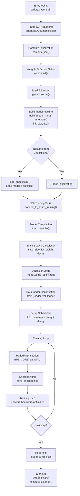
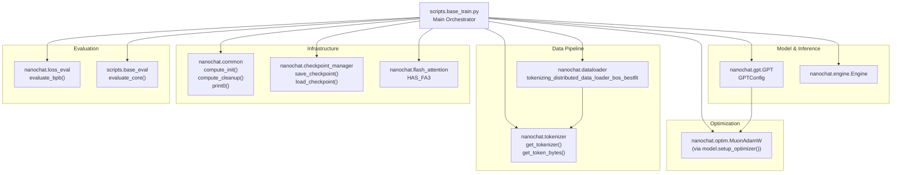
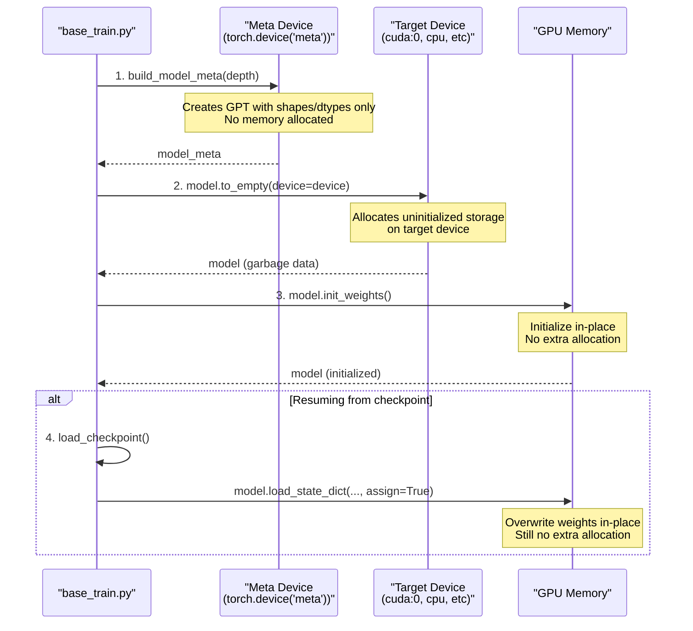
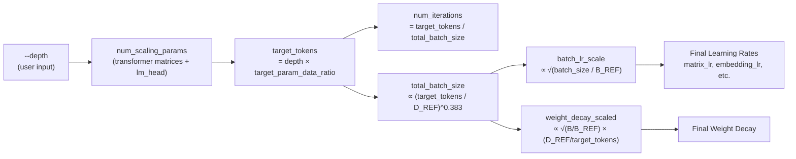

> [!WARNING]
> Imported from DeepWiki as generated, unverified repository documentation. Verify code-behavior claims against the revision below before stabilization.

# Base Training Script Architecture

<details>
<summary>Relevant source files</summary>

The following files were used as context for generating this wiki page:

- [scripts/base_train.py](https://github.com/karpathy/nanochat/blob/92d63d4e8bb4df75c3b71618f31ddde2378b2bcd/scripts/base_train.py)

</details>


## Purpose and Scope

This document describes the architecture of `scripts/base_train.py`, the central orchestrator for base model pretraining in nanochat. This script integrates the model, optimizer, data pipeline, evaluation systems, and distributed training infrastructure into a cohesive training workflow [scripts/base_train.py:1-37](https://github.com/karpathy/nanochat/blob/92d63d4e8bb4df75c3b71618f31ddde2378b2bcd/scripts/base_train.py#L1-L37).

**Scope:** This page covers the script's structure, CLI interface, initialization sequence, and main training loop. For details on specific subsystems, see:
- Scaling laws and hyperparameter auto-configuration: 3.2
- Training loop internals and gradient accumulation: 3.3
- Evaluation and checkpointing mechanisms: 3.4
- Model architecture: 4.1
- Optimizer details: 5.1
- Data loading: 6.2

**Sources:** [scripts/base_train.py:1-37](https://github.com/karpathy/nanochat/blob/92d63d4e8bb4df75c3b71618f31ddde2378b2bcd/scripts/base_train.py#L1-L37)

---

## Script Overview and Entry Point

The base training script can be executed in three modes:

**Single-Process (CPU/MPS):**
```bash
python -m scripts.base_train
```

**Distributed Multi-GPU:**
```bash
torchrun --nproc_per_node=8 -m scripts.base_train
```

**Minimal CPU Example:**
```bash
python -m scripts.base_train --depth=4 --max-seq-len=512 --device-batch-size=1 \
  --eval-tokens=512 --core-metric-every=-1 --total-batch-size=512 --num-iterations=20
```

The script is structured as a procedural execution flow that orchestrates setup, training, and cleanup phases [scripts/base_train.py:1-12](https://github.com/karpathy/nanochat/blob/92d63d4e8bb4df75c3b71618f31ddde2378b2bcd/scripts/base_train.py#L1-L12).

**Sources:** [scripts/base_train.py:1-12](https://github.com/karpathy/nanochat/blob/92d63d4e8bb4df75c3b71618f31ddde2378b2bcd/scripts/base_train.py#L1-L12)

---

## High-Level Script Structure

The following diagram illustrates the initialization flow and main loop of `base_train.py`.



**Sources:** [scripts/base_train.py:14-600](https://github.com/karpathy/nanochat/blob/92d63d4e8bb4df75c3b71618f31ddde2378b2bcd/scripts/base_train.py#L14-L600)

---

## Command-Line Interface

The script defines command-line arguments organized into categories using `argparse.ArgumentParser` [scripts/base_train.py:40-80](https://github.com/karpathy/nanochat/blob/92d63d4e8bb4df75c3b71618f31ddde2378b2bcd/scripts/base_train.py#L40-L80).

### Key Arguments by Category

| Category | Argument | Default | Purpose |
|----------|----------|---------|---------|
| **Logging** | `--run` | `"dummy"` | W&B run name (`"dummy"` disables W&B) [scripts/base_train.py:43](https://github.com/karpathy/nanochat/blob/92d63d4e8bb4df75c3b71618f31ddde2378b2bcd/scripts/base_train.py#L43) |
| **Runtime** | `--device-type` | `""` | Device: `cuda`, `cpu`, `mps` (empty = autodetect) [scripts/base_train.py:45](https://github.com/karpathy/nanochat/blob/92d63d4e8bb4df75c3b71618f31ddde2378b2bcd/scripts/base_train.py#L45) |
| **FP8** | `--fp8` | `False` | Enable FP8 training (H100+ only) [scripts/base_train.py:47](https://github.com/karpathy/nanochat/blob/92d63d4e8bb4df75c3b71618f31ddde2378b2bcd/scripts/base_train.py#L47) |
| | `--fp8-recipe` | `"tensorwise"` | FP8 scaling: `tensorwise` or `rowwise` [scripts/base_train.py:48](https://github.com/karpathy/nanochat/blob/92d63d4e8bb4df75c3b71618f31ddde2378b2bcd/scripts/base_train.py#L48) |
| **Architecture** | `--depth` | `20` | Number of transformer layers [scripts/base_train.py:50](https://github.com/karpathy/nanochat/blob/92d63d4e8bb4df75c3b71618f31ddde2378b2bcd/scripts/base_train.py#L50) |
| | `--aspect-ratio` | `64` | Model dimension = depth × aspect_ratio [scripts/base_train.py:51](https://github.com/karpathy/nanochat/blob/92d63d4e8bb4df75c3b71618f31ddde2378b2bcd/scripts/base_train.py#L51) |
| | `--head-dim` | `128` | Target attention head dimension [scripts/base_train.py:52](https://github.com/karpathy/nanochat/blob/92d63d4e8bb4df75c3b71618f31ddde2378b2bcd/scripts/base_train.py#L52) |
| | `--max-seq-len` | `2048` | Maximum context length [scripts/base_train.py:53](https://github.com/karpathy/nanochat/blob/92d63d4e8bb4df75c3b71618f31ddde2378b2bcd/scripts/base_train.py#L53) |
| | `--window-pattern` | `"SSSL"` | Sliding window pattern: `L`=full, `S`=half [scripts/base_train.py:54](https://github.com/karpathy/nanochat/blob/92d63d4e8bb4df75c3b71618f31ddde2378b2bcd/scripts/base_train.py#L54) |
| **Horizon** | `--num-iterations` | `-1` | Explicit iteration count (overrides auto-calc) [scripts/base_train.py:56](https://github.com/karpathy/nanochat/blob/92d63d4e8bb4df75c3b71618f31ddde2378b2bcd/scripts/base_train.py#L56) |
| | `--target-flops` | `-1.0` | Calculate iterations from target FLOPs [scripts/base_train.py:57](https://github.com/karpathy/nanochat/blob/92d63d4e8bb4df75c3b71618f31ddde2378b2bcd/scripts/base_train.py#L57) |
| | `--target-param-data-ratio` | `12` | Data:param ratio (Chinchilla=20) [scripts/base_train.py:58](https://github.com/karpathy/nanochat/blob/92d63d4e8bb4df75c3b71618f31ddde2378b2bcd/scripts/base_train.py#L58) |
| **Optimization** | `--device-batch-size` | `32` | Per-device batch size (reduce if OOM) [scripts/base_train.py:60](https://github.com/karpathy/nanochat/blob/92d63d4e8bb4df75c3b71618f31ddde2378b2bcd/scripts/base_train.py#L60) |
| | `--total-batch-size` | `-1` | Total batch size in tokens (-1 = auto) [scripts/base_train.py:61](https://github.com/karpathy/nanochat/blob/92d63d4e8bb4df75c3b71618f31ddde2378b2bcd/scripts/base_train.py#L61) |
| | `--matrix-lr` | `0.02` | Muon learning rate for matrices [scripts/base_train.py:65](https://github.com/karpathy/nanochat/blob/92d63d4e8bb4df75c3b71618f31ddde2378b2bcd/scripts/base_train.py#L65) |
| | `--embedding-lr` | `0.3` | AdamW learning rate for embeddings [scripts/base_train.py:62](https://github.com/karpathy/nanochat/blob/92d63d4e8bb4df75c3b71618f31ddde2378b2bcd/scripts/base_train.py#L62) |
| | `--weight-decay` | `0.28` | Cautious weight decay for Muon [scripts/base_train.py:64](https://github.com/karpathy/nanochat/blob/92d63d4e8bb4df75c3b71618f31ddde2378b2bcd/scripts/base_train.py#L64) |
| **Evaluation** | `--eval-every` | `250` | Validation BPB every N steps [scripts/base_train.py:72](https://github.com/karpathy/nanochat/blob/92d63d4e8bb4df75c3b71618f31ddde2378b2bcd/scripts/base_train.py#L72) |
| | `--eval-tokens` | `41943040` | Tokens for validation (80*524288) [scripts/base_train.py:73](https://github.com/karpathy/nanochat/blob/92d63d4e8bb4df75c3b71618f31ddde2378b2bcd/scripts/base_train.py#L73) |
| | `--core-metric-every` | `2000` | CORE metric every N steps [scripts/base_train.py:74](https://github.com/karpathy/nanochat/blob/92d63d4e8bb4df75c3b71618f31ddde2378b2bcd/scripts/base_train.py#L74) |
| | `--sample-every` | `2000` | Text sampling every N steps [scripts/base_train.py:76](https://github.com/karpathy/nanochat/blob/92d63d4e8bb4df75c3b71618f31ddde2378b2bcd/scripts/base_train.py#L76) |
| | `--save-every` | `-1` | Checkpoint every N steps (-1 = only end) [scripts/base_train.py:77](https://github.com/karpathy/nanochat/blob/92d63d4e8bb4df75c3b71618f31ddde2378b2bcd/scripts/base_train.py#L77) |

**Sources:** [scripts/base_train.py:40-80](https://github.com/karpathy/nanochat/blob/92d63d4e8bb4df75c3b71618f31ddde2378b2bcd/scripts/base_train.py#L40-L80)

---

## Module Dependencies and Integration

The script integrates major subsystems from the `nanochat` package plus external evaluation logic [scripts/base_train.py:14-36](https://github.com/karpathy/nanochat/blob/92d63d4e8bb4df75c3b71618f31ddde2378b2bcd/scripts/base_train.py#L14-L36).

### Core Module Integration Diagram



**Sources:** [scripts/base_train.py:14-36](https://github.com/karpathy/nanochat/blob/92d63d4e8bb4df75c3b71618f31ddde2378b2bcd/scripts/base_train.py#L14-L36)

---

## Initialization Sequence

### Compute and Device Setup

The script begins by setting environment variables and initializing distributed training infrastructure [scripts/base_train.py:15-86](https://github.com/karpathy/nanochat/blob/92d63d4e8bb4df75c3b71618f31ddde2378b2bcd/scripts/base_train.py#L15-L86):

```python
# Line 15: Memory optimization
os.environ["PYTORCH_ALLOC_CONF"] = "expandable_segments:True"

# Lines 86-91: Device detection and DDP setup
device_type = autodetect_device_type() if args.device_type == "" else args.device_type
ddp, ddp_rank, ddp_local_rank, ddp_world_size, device = compute_init(device_type)
master_process = ddp_rank == 0
```

The `compute_init()` function [scripts/base_train.py:86](https://github.com/karpathy/nanochat/blob/92d63d4e8bb4df75c3b71618f31ddde2378b2bcd/scripts/base_train.py#L86) returns distributed training parameters and the target device.

**Sources:** [scripts/base_train.py:15-86](https://github.com/karpathy/nanochat/blob/92d63d4e8bb4df75c3b71618f31ddde2378b2bcd/scripts/base_train.py#L15-L86)

### Weights & Biases and Flash Attention Detection

```python
# Lines 100-101: W&B initialization (disabled if run="dummy" or non-master)
use_dummy_wandb = args.run == "dummy" or not master_process
wandb_run = DummyWandb() if use_dummy_wandb else wandb.init(project="nanochat", name=args.run, config=user_config)

# Lines 104-113: Flash Attention 3 availability check
if USE_FA3:
    print0("✓ Using Flash Attention 3 (Hopper GPU detected)")
else:
    print0("WARNING: Flash Attention 3 not available, using PyTorch SDPA fallback")
```

The script warns extensively if Flash Attention 3 is unavailable, especially when using sliding window patterns (`window_pattern != "L"`), as SDPA does not support sliding windows efficiently [scripts/base_train.py:108-116](https://github.com/karpathy/nanochat/blob/92d63d4e8bb4df75c3b71618f31ddde2378b2bcd/scripts/base_train.py#L108-L116).

**Sources:** [scripts/base_train.py:100-116](https://github.com/karpathy/nanochat/blob/92d63d4e8bb4df75c3b71618f31ddde2378b2bcd/scripts/base_train.py#L100-L116)

### Tokenizer Loading

```python
# Lines 117-120: Load tokenizer and compute vocabulary size
tokenizer = get_tokenizer()
token_bytes = get_token_bytes(device=device)
vocab_size = tokenizer.get_vocab_size()
```

The `token_bytes` tensor maps each token ID to its UTF-8 byte length, used for bits-per-byte evaluation [scripts/base_train.py:118](https://github.com/karpathy/nanochat/blob/92d63d4e8bb4df75c3b71618f31ddde2378b2bcd/scripts/base_train.py#L118).

**Sources:** [scripts/base_train.py:117-120](https://github.com/karpathy/nanochat/blob/92d63d4e8bb4df75c3b71618f31ddde2378b2bcd/scripts/base_train.py#L117-L120)

---

## Model Construction Pipeline

### Three-Phase Meta Device Pattern

The script uses a memory-efficient construction pattern to avoid duplicate model weight allocation [scripts/base_train.py:125-148](https://github.com/karpathy/nanochat/blob/92d63d4e8bb4df75c3b71618f31ddde2378b2bcd/scripts/base_train.py#L125-L148):



**Implementation:**

```python
# Lines 125-148: Model construction
def build_model_meta(depth):
    """Build a model on meta device for a given depth (shapes/dtypes only, no data)."""
    # ... configuration calculation ...
    with torch.device("meta"):
        model_meta = GPT(config)
    return model_meta

model = build_model_meta(args.depth)  # 1) Meta device
model.to_empty(device=device)          # 2) Allocate storage
model.init_weights()                   # 3) Initialize
```

**Sources:** [scripts/base_train.py:125-148](https://github.com/karpathy/nanochat/blob/92d63d4e8bb4df75c3b71618f31ddde2378b2bcd/scripts/base_train.py#L125-L148)

### Checkpoint Resumption

```python
# Lines 150-158: Resume from checkpoint if requested
resuming = args.resume_from_step != -1
if resuming:
    model_data, optimizer_data, meta_data = load_checkpoint(
        checkpoint_dir, args.resume_from_step, device, 
        load_optimizer=True, rank=ddp_rank
    )
    model.load_state_dict(model_data, strict=True, assign=True)
    del model_data  # free up memory
```

The `assign=True` parameter [scripts/base_train.py:157](https://github.com/karpathy/nanochat/blob/92d63d4e8bb4df75c3b71618f31ddde2378b2bcd/scripts/base_train.py#L157) allows in-place assignment without creating temporary copies.

**Sources:** [scripts/base_train.py:150-158](https://github.com/karpathy/nanochat/blob/92d63d4e8bb4df75c3b71618f31ddde2378b2bcd/scripts/base_train.py#L150-L158)

---

## FP8 Training Support

### Float8Linear Conversion

When `--fp8` is enabled, the script converts eligible `nn.Linear` layers to `Float8Linear` [scripts/base_train.py:164-188](https://github.com/karpathy/nanochat/blob/92d63d4e8bb4df75c3b71618f31ddde2378b2bcd/scripts/base_train.py#L164-L188):

```python
# Lines 164-188: FP8 conversion with filtering
if args.fp8:
    from nanochat.fp8 import Float8LinearConfig, convert_to_float8_training
    # ... filter logic ...
    fp8_config = Float8LinearConfig.from_recipe_name(args.fp8_recipe)
    convert_to_float8_training(model, config=fp8_config, module_filter_fn=fp8_module_filter)
```

**Sources:** [scripts/base_train.py:164-188](https://github.com/karpathy/nanochat/blob/92d63d4e8bb4df75c3b71618f31ddde2378b2bcd/scripts/base_train.py#L164-L188)

### disable_fp8 Context Manager

Evaluation uses BF16 for consistency, so the script provides a context manager to temporarily disable FP8 [scripts/base_train.py:191-235](https://github.com/karpathy/nanochat/blob/92d63d4e8bb4df75c3b71618f31ddde2378b2bcd/scripts/base_train.py#L191-L235):

```python
# Lines 191-235: Context manager to swap Float8Linear → nn.Linear
@contextmanager
def disable_fp8(model):
    """Temporarily swap Float8Linear modules with nn.Linear for BF16 evaluation."""
    # ... swap logic ...
    try:
        yield
    finally:
        # Restore Float8Linear modules
```

**Sources:** [scripts/base_train.py:191-235](https://github.com/karpathy/nanochat/blob/92d63d4e8bb4df75c3b71618f31ddde2378b2bcd/scripts/base_train.py#L191-L235)

---

## Model Compilation

The script compiles the model using PyTorch 2's `torch.compile` for performance [scripts/base_train.py:239-241](https://github.com/karpathy/nanochat/blob/92d63d4e8bb4df75c3b71618f31ddde2378b2bcd/scripts/base_train.py#L239-L241):

```python
# Lines 239-241: Compile with dynamic=False
orig_model = model  # Keep reference to uncompiled model
model = torch.compile(model, dynamic=False)
```

The `orig_model` reference is retained for evaluation and sampling, which use dynamic input shapes [scripts/base_train.py:240](https://github.com/karpathy/nanochat/blob/92d63d4e8bb4df75c3b71618f31ddde2378b2bcd/scripts/base_train.py#L240).

**Sources:** [scripts/base_train.py:239-241](https://github.com/karpathy/nanochat/blob/92d63d4e8bb4df75c3b71618f31ddde2378b2bcd/scripts/base_train.py#L239-L241)

---

## Scaling Laws and Auto-Configuration

The script implements auto-configuration based on empirical scaling laws, calculating the training horizon, batch size, learning rates, and weight decay from the `--depth` parameter [scripts/base_train.py:258-299](https://github.com/karpathy/nanochat/blob/92d63d4e8bb4df75c3b71618f31ddde2378b2bcd/scripts/base_train.py#L258-L299).

### Parameter Hierarchy



**Sources:** [scripts/base_train.py:258-299](https://github.com/karpathy/nanochat/blob/92d63d4e8bb4df75c3b71618f31ddde2378b2bcd/scripts/base_train.py#L258-L299)

---

## Optimizer and DataLoader Setup

### Optimizer Initialization

```python
# Lines 303-312: MuonAdamW via model.setup_optimizer()
optimizer = model.setup_optimizer(
    unembedding_lr=args.unembedding_lr * batch_lr_scale,
    embedding_lr=args.embedding_lr * batch_lr_scale,
    scalar_lr=args.scalar_lr * batch_lr_scale,
    matrix_lr=args.matrix_lr * batch_lr_scale,
    weight_decay=weight_decay_scaled,
)
```

The `model.setup_optimizer()` method creates a hybrid optimizer with Muon for matrices and AdamW for other parameters [scripts/base_train.py:303-312](https://github.com/karpathy/nanochat/blob/92d63d4e8bb4df75c3b71618f31ddde2378b2bcd/scripts/base_train.py#L303-L312).

**Sources:** [scripts/base_train.py:303-316](https://github.com/karpathy/nanochat/blob/92d63d4e8bb4df75c3b71618f31ddde2378b2bcd/scripts/base_train.py#L303-L316)

### DataLoader Construction

```python
# Lines 320-323: DataLoader setup with resumption support
dataloader_resume_state_dict = None if not resuming else meta_data["dataloader_state_dict"]
train_loader = tokenizing_distributed_data_loader_with_state_bos_bestfit(
    tokenizer, args.device_batch_size, args.max_seq_len, split="train", 
    device=device, resume_state_dict=dataloader_resume_state_dict
)
```

**Sources:** [scripts/base_train.py:320-323](https://github.com/karpathy/nanochat/blob/92d63d4e8bb4df75c3b71618f31ddde2378b2bcd/scripts/base_train.py#L320-L323)

---

## Training Loop Architecture

### Gradient Accumulation and Step

```python
# Lines 489-515: Single training step with gradient accumulation
synchronize()
t0 = time.time()

for micro_step in range(grad_accum_steps):
    with autocast_ctx:
        loss = model(x, y)
    loss = loss / grad_accum_steps
    loss.backward()
    x, y, dataloader_state_dict = next(train_loader)

# ... update schedulers ...
optimizer.step()
model.zero_grad(set_to_none=True)
synchronize()
t1 = time.time()
```

The training step implements gradient accumulation to achieve the desired `total_batch_size` [scripts/base_train.py:489-515](https://github.com/karpathy/nanochat/blob/92d63d4e8bb4df75c3b71618f31ddde2378b2bcd/scripts/base_train.py#L489-L515).

**Sources:** [scripts/base_train.py:489-515](https://github.com/karpathy/nanochat/blob/92d63d4e8bb4df75c3b71618f31ddde2378b2bcd/scripts/base_train.py#L489-L515)

### Learning Rate and Momentum Schedules

- **LR Schedule**: Piecewise linear (Warmup-Constant-Warmdown) [scripts/base_train.py:350-359](https://github.com/karpathy/nanochat/blob/92d63d4e8bb4df75c3b71618f31ddde2378b2bcd/scripts/base_train.py#L350-L359).
- **Muon Momentum**: Ramps from 0.85 to 0.95 over 300 steps [scripts/base_train.py:362-365](https://github.com/karpathy/nanochat/blob/92d63d4e8bb4df75c3b71618f31ddde2378b2bcd/scripts/base_train.py#L362-L365).
- **Weight Decay**: Linearly decays to 0 over the training duration [scripts/base_train.py:368-369](https://github.com/karpathy/nanochat/blob/92d63d4e8bb4df75c3b71618f31ddde2378b2bcd/scripts/base_train.py#L368-L369).

**Sources:** [scripts/base_train.py:350-369](https://github.com/karpathy/nanochat/blob/92d63d4e8bb4df75c3b71618f31ddde2378b2bcd/scripts/base_train.py#L350-L369)

---

## Evaluation and Checkpointing

### Periodic Tasks

- **Validation BPB**: Evaluates bits-per-byte on the validation set every `eval_every` steps [scripts/base_train.py:404-419](https://github.com/karpathy/nanochat/blob/92d63d4e8bb4df75c3b71618f31ddde2378b2bcd/scripts/base_train.py#L404-L419).
- **CORE Metric**: Evaluates base model capabilities every `core_metric_every` steps [scripts/base_train.py:421-436](https://github.com/karpathy/nanochat/blob/92d63d4e8bb4df75c3b71618f31ddde2378b2bcd/scripts/base_train.py#L421-L436).
- **Sampling**: Generates text samples for qualitative analysis every `sample_every` steps [scripts/base_train.py:438-457](https://github.com/karpathy/nanochat/blob/92d63d4e8bb4df75c3b71618f31ddde2378b2bcd/scripts/base_train.py#L438-L457).
- **Checkpointing**: Saves model, optimizer, and dataloader state every `save_every` steps [scripts/base_train.py:460-482](https://github.com/karpathy/nanochat/blob/92d63d4e8bb4df75c3b71618f31ddde2378b2bcd/scripts/base_train.py#L460-L482).

**Sources:** [scripts/base_train.py:404-482](https://github.com/karpathy/nanochat/blob/92d63d4e8bb4df75c3b71618f31ddde2378b2bcd/scripts/base_train.py#L404-L482)

### Garbage Collection Management

To optimize performance, the script manually manages garbage collection [scripts/base_train.py:559-564](https://github.com/karpathy/nanochat/blob/92d63d4e8bb4df75c3b71618f31ddde2378b2bcd/scripts/base_train.py#L559-L564):

```python
# Lines 559-564: Manual GC management
if first_step_of_run:
    gc.collect()
    gc.freeze()
    gc.disable()
elif step % 5000 == 0:
    gc.collect()
```

**Sources:** [scripts/base_train.py:559-564](https://github.com/karpathy/nanochat/blob/92d63d4e8bb4df75c3b71618f31ddde2378b2bcd/scripts/base_train.py#L559-L564)

---

## Reporting and Cleanup

The script concludes by logging final statistics to a structured report and cleaning up distributed resources [scripts/base_train.py:573-600](https://github.com/karpathy/nanochat/blob/92d63d4e8bb4df75c3b71618f31ddde2378b2bcd/scripts/base_train.py#L573-L600).

**Sources:** [scripts/base_train.py:573-600](https://github.com/karpathy/nanochat/blob/92d63d4e8bb4df75c3b71618f31ddde2378b2bcd/scripts/base_train.py#L573-L600)
