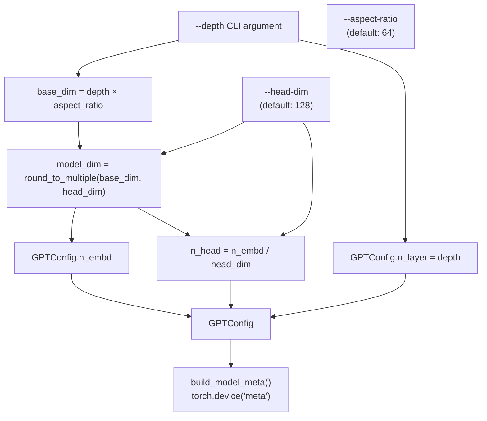
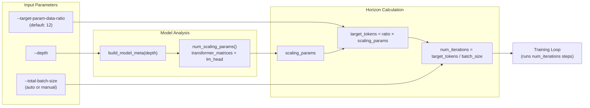
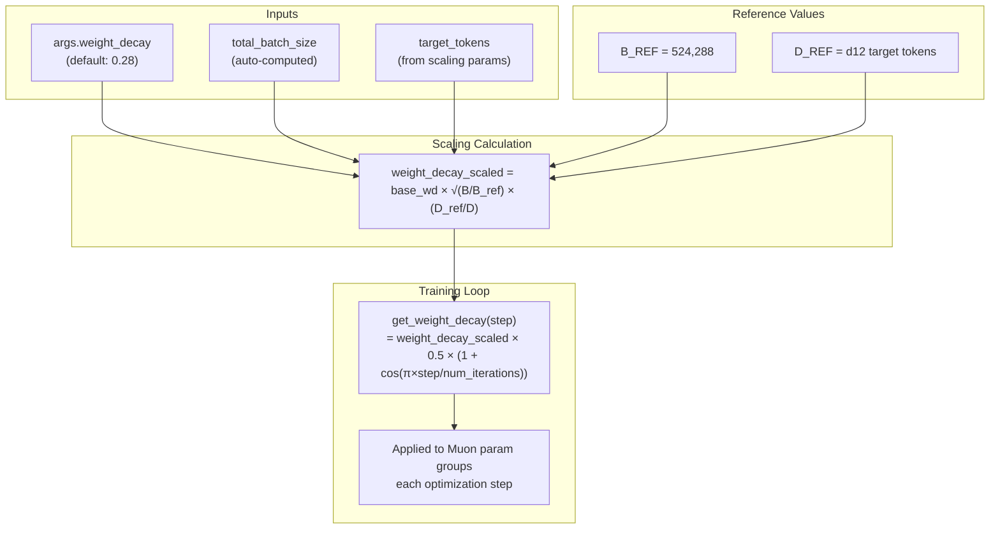
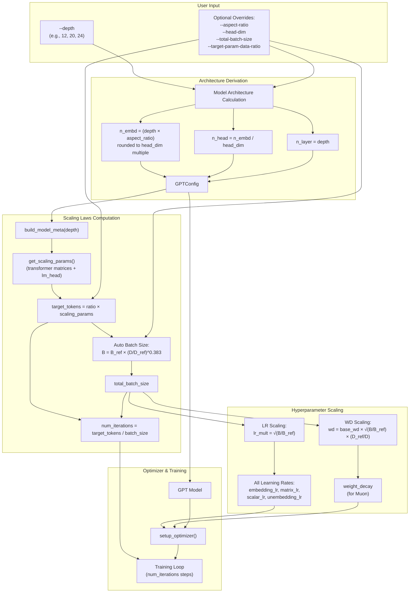

> [!WARNING]
> Imported from DeepWiki as generated, unverified repository documentation. Verify code-behavior claims against the revision below before stabilization.

# The Complexity Dial: Auto-Configuration System

<details>
<summary>Relevant source files</summary>

The following files were used as context for generating this wiki page:

- [README.md](https://github.com/karpathy/nanochat/blob/92d63d4e8bb4df75c3b71618f31ddde2378b2bcd/README.md)
- [scripts/base_train.py](https://github.com/karpathy/nanochat/blob/92d63d4e8bb4df75c3b71618f31ddde2378b2bcd/scripts/base_train.py)

</details>


## Purpose and Scope

This document describes nanochat's auto-configuration system, which allows users to specify model complexity via a single parameter (`--depth`) while all other hyperparameters are automatically calculated to produce compute-optimal models. This eliminates manual hyperparameter tuning across model scales and ensures that architectural changes, learning rates, batch sizes, weight decay, and training horizons are all properly coordinated.

For details on how the training loop uses these computed hyperparameters, see [scripts/base_train.py:465-570](https://github.com/karpathy/nanochat/blob/92d63d4e8bb4df75c3b71618f31ddde2378b2bcd/scripts/base_train.py#L465-L570). For the overall structure of the base training script, see [scripts/base_train.py:40-80](https://github.com/karpathy/nanochat/blob/92d63d4e8bb4df75c3b71618f31ddde2378b2bcd/scripts/base_train.py#L40-L80).

---

## The Single-Dial Philosophy

nanochat's design centers on a single complexity dial: the `--depth` parameter, which specifies the number of Transformer layers in the model [scripts/base_train.py:50-50](https://github.com/karpathy/nanochat/blob/92d63d4e8bb4df75c3b71618f31ddde2378b2bcd/scripts/base_train.py#L50-L50). From this single integer, the system automatically derives:

| Hyperparameter | Auto-Computed From |
|----------------|-------------------|
| Model width (`n_embd`) | `depth * aspect_ratio`, rounded to `head_dim` alignment [scripts/base_train.py:138-140](https://github.com/karpathy/nanochat/blob/92d63d4e8bb4df75c3b71618f31ddde2378b2bcd/scripts/base_train.py#L138-L140) |
| Number of attention heads | `n_embd / head_dim` [scripts/base_train.py:141-141](https://github.com/karpathy/nanochat/blob/92d63d4e8bb4df75c3b71618f31ddde2378b2bcd/scripts/base_train.py#L141-L141) |
| Total batch size | Power law scaling from reference model (`B_opt ∝ D^0.383`) [scripts/base_train.py:272-285](https://github.com/karpathy/nanochat/blob/92d63d4e8bb4df75c3b71618f31ddde2378b2bcd/scripts/base_train.py#L272-L285) |
| Training horizon (iterations) | Target tokens-to-parameters ratio (default 12) [scripts/base_train.py:340-360](https://github.com/karpathy/nanochat/blob/92d63d4e8bb4df75c3b71618f31ddde2378b2bcd/scripts/base_train.py#L340-L360) |
| Learning rates | Batch size scaling with √(B/B_ref) [scripts/base_train.py:287-295](https://github.com/karpathy/nanochat/blob/92d63d4e8bb4df75c3b71618f31ddde2378b2bcd/scripts/base_train.py#L287-L295) |
| Weight decay | T_epoch framework scaling [scripts/base_train.py:297-306](https://github.com/karpathy/nanochat/blob/92d63d4e8bb4df75c3b71618f31ddde2378b2bcd/scripts/base_train.py#L297-L306) |

Users specify only `--depth` (e.g., 12, 20, 24) and the system ensures the resulting model is trained in a compute-optimal way for that scale [scripts/base_train.py:50-80](https://github.com/karpathy/nanochat/blob/92d63d4e8bb4df75c3b71618f31ddde2378b2bcd/scripts/base_train.py#L50-L80). GPT-2 capability corresponds to approximately depth 26 with the current ClimbMix-400B dataset [README.md:6-6](https://github.com/karpathy/nanochat/blob/92d63d4e8bb4df75c3b71618f31ddde2378b2bcd/README.md#L6-L6), [README.md:24-24](https://github.com/karpathy/nanochat/blob/92d63d4e8bb4df75c3b71618f31ddde2378b2bcd/README.md#L24-L24).

**Sources:** [scripts/base_train.py:50-82](https://github.com/karpathy/nanochat/blob/92d63d4e8bb4df75c3b71618f31ddde2378b2bcd/scripts/base_train.py#L50-L82), [README.md:6-24](https://github.com/karpathy/nanochat/blob/92d63d4e8bb4df75c3b71618f31ddde2378b2bcd/README.md#L6-L24)

---

## Architecture Auto-Scaling

### Model Dimension Calculation

The model dimension is computed from depth using the aspect ratio and head dimension constraints in `build_model_meta` [scripts/base_train.py:131-145](https://github.com/karpathy/nanochat/blob/92d63d4e8bb4df75c3b71618f31ddde2378b2bcd/scripts/base_train.py#L131-L145):

```python
base_dim = depth * aspect_ratio
model_dim = math.ceil(base_dim / head_dim) * head_dim
num_heads = model_dim // head_dim
```

This ensures that `n_embd` is always a multiple of `head_dim` (default 128), which is required by Flash Attention 3 and produces clean head dimensions [scripts/base_train.py:51-53](https://github.com/karpathy/nanochat/blob/92d63d4e8bb4df75c3b71618f31ddde2378b2bcd/scripts/base_train.py#L51-L53).

**Example:** For `--depth=24` with `--aspect-ratio=64` and `--head-dim=128`:
- `base_dim = 24 * 64 = 1536`
- `model_dim = ceil(1536/128) * 128 = 1536`
- `num_heads = 1536 / 128 = 12`

### Architecture to Code Mapping



**Sources:** [scripts/base_train.py:50-53](https://github.com/karpathy/nanochat/blob/92d63d4e8bb4df75c3b71618f31ddde2378b2bcd/scripts/base_train.py#L50-L53), [scripts/base_train.py:131-145](https://github.com/karpathy/nanochat/blob/92d63d4e8bb4df75c3b71618f31ddde2378b2bcd/scripts/base_train.py#L131-L145)

---

## Scaling Parameters and Training Horizon

### Effective Parameter Count

The system uses a specific subset of parameters for scaling law calculations, determined by `get_scaling_params()` [scripts/base_train.py:264-270](https://github.com/karpathy/nanochat/blob/92d63d4e8bb4df75c3b71618f31ddde2378b2bcd/scripts/base_train.py#L264-L270). 

By default, the training script uses:
```python
scaling_params = transformer_matrices + lm_head
```
This excludes embeddings (`wte`), value embeddings (`value_embeds`), and scalar parameters. The rationale is that transformer weight matrices plus the output projection provide the most stable scaling relationships for compute budgets [scripts/base_train.py:264-270](https://github.com/karpathy/nanochat/blob/92d63d4e8bb4df75c3b71618f31ddde2378b2bcd/scripts/base_train.py#L264-L270).

### Training Horizon Calculation

The number of training iterations is determined by the target tokens-to-parameters ratio [scripts/base_train.py:340-360](https://github.com/karpathy/nanochat/blob/92d63d4e8bb4df75c3b71618f31ddde2378b2bcd/scripts/base_train.py#L340-L360):

```python
target_tokens = target_param_data_ratio * num_scaling_params
num_iterations = target_tokens // total_batch_size
```

The default `--target-param-data-ratio=12` is the baseline [scripts/base_train.py:58-58](https://github.com/karpathy/nanochat/blob/92d63d4e8bb4df75c3b71618f31ddde2378b2bcd/scripts/base_train.py#L58-L58).

### Training Horizon Data Flow



**Sources:** [scripts/base_train.py:58-58](https://github.com/karpathy/nanochat/blob/92d63d4e8bb4df75c3b71618f31ddde2378b2bcd/scripts/base_train.py#L58-L58), [scripts/base_train.py:264-270](https://github.com/karpathy/nanochat/blob/92d63d4e8bb4df75c3b71618f31ddde2378b2bcd/scripts/base_train.py#L264-L270), [scripts/base_train.py:340-360](https://github.com/karpathy/nanochat/blob/92d63d4e8bb4df75c3b71618f31ddde2378b2bcd/scripts/base_train.py#L340-L360)

---

## Batch Size Auto-Scaling

### The Power Lines Law

nanochat implements automatic batch size scaling based on empirical findings that optimal batch size scales as a power function of the total training tokens [scripts/base_train.py:272-285](https://github.com/karpathy/nanochat/blob/92d63d4e8bb4df75c3b71618f31ddde2378b2bcd/scripts/base_train.py#L272-L285):

```
B_opt ∝ D^0.383
```

### Reference Model Approach

The system uses `d12` as a reference point with empirically validated hyperparameters [scripts/base_train.py:273-275](https://github.com/karpathy/nanochat/blob/92d63d4e8bb4df75c3b71618f31ddde2378b2bcd/scripts/base_train.py#L273-L275):

```python
d12_ref = build_model_meta(12)
D_REF = target_param_data_ratio * get_scaling_params(d12_ref)
B_REF = 524288  # 2^19 tokens
```

For any target depth, the optimal batch size is calculated and "snapped" to the nearest power of 2 [scripts/base_train.py:280-285](https://github.com/karpathy/nanochat/blob/92d63d4e8bb4df75c3b71618f31ddde2378b2bcd/scripts/base_train.py#L280-L285):

```python
batch_size_ratio = target_tokens / D_REF
predicted_batch_size = B_REF * batch_ratio ** 0.383
total_batch_size = 2 ** round(math.log2(predicted_batch_size))
```

**Sources:** [scripts/base_train.py:272-285](https://github.com/karpathy/nanochat/blob/92d63d4e8bb4df75c3b71618f31ddde2378b2bcd/scripts/base_train.py#L272-L285)

---

## Learning Rate Scaling

### Batch Size Scaling

When batch size differs from the reference, learning rates are adjusted using square-root scaling [scripts/base_train.py:287-295](https://github.com/karpathy/nanochat/blob/92d63d4e8bb4df75c3b71618f31ddde2378b2bcd/scripts/base_train.py#L287-L295):

```python
batch_ratio = total_batch_size / B_REF
batch_lr_scale = batch_ratio ** 0.5
```

This scaling applies to all parameter groups. The √(B/B_ref) scaling is standard for AdamW and is applied to Muon in this codebase to allow larger batches to use higher learning rates stably [scripts/base_train.py:287-295](https://github.com/karpathy/nanochat/blob/92d63d4e8bb4df75c3b71618f31ddde2378b2bcd/scripts/base_train.py#L287-L295).

### Per-Component Learning Rates

The system maintains distinct base learning rates, each scaled by the batch size correction and, for transformer matrices, model dimension [scripts/base_train.py:309-318](https://github.com/karpathy/nanochat/blob/92d63d4e8bb4df75c3b71618f31ddde2378b2bcd/scripts/base_train.py#L309-L318):

| Parameter Group | Base LR | Optimizer | Scaling |
|----------------|---------|-----------|---------|
| `lm_head` | 0.008 | AdamW | × `batch_lr_scale` |
| `wte` / `value_embeds` | 0.3 | AdamW | × `batch_lr_scale` |
| Scalars (`resid_lambdas`) | 0.5 | AdamW | × `batch_lr_scale` |
| Transformer matrices | 0.02 | Muon | × `batch_lr_scale` × √(768/n_embd) |

**Sources:** [scripts/base_train.py:62-66](https://github.com/karpathy/nanochat/blob/92d63d4e8bb4df75c3b71618f31ddde2378b2bcd/scripts/base_train.py#L62-L66), [scripts/base_train.py:287-295](https://github.com/karpathy/nanochat/blob/92d63d4e8bb4df75c3b71618f31ddde2378b2bcd/scripts/base_train.py#L287-L295), [scripts/base_train.py:309-318](https://github.com/karpathy/nanochat/blob/92d63d4e8bb4df75c3b71618f31ddde2378b2bcd/scripts/base_train.py#L309-L318)

---

## Weight Decay Scaling

### The T_epoch Framework

Weight decay scaling follows the T_epoch framework, ensuring effective regularization remains constant across scales [scripts/base_train.py:297-306](https://github.com/karpathy/nanochat/blob/92d63d4e8bb4df75c3b71618f31ddde2378b2bcd/scripts/base_train.py#L297-L306):

```python
weight_decay_scaled = weight_decay * math.sqrt(batch_ratio) * (D_REF / target_tokens)
```

### Dynamic Decay Schedule

Weight decay is scheduled during training using a cosine decay in `get_weight_decay` [scripts/base_train.py:379-381](https://github.com/karpathy/nanochat/blob/92d63d4e8bb4df75c3b71618f31ddde2378b2bcd/scripts/base_train.py#L379-L381):

```python
def get_weight_decay(it):
    return weight_decay_scaled * 0.5 * (1 + math.cos(math.pi * it / num_iterations))
```

### Weight Decay Data Flow



**Sources:** [scripts/base_train.py:297-306](https://github.com/karpathy/nanochat/blob/92d63d4e8bb4df75c3b71618f31ddde2378b2bcd/scripts/base_train.py#L297-L306), [scripts/base_train.py:379-381](https://github.com/karpathy/nanochat/blob/92d63d4e8bb4df75c3b71618f31ddde2378b2bcd/scripts/base_train.py#L379-L381), [scripts/base_train.py:516-522](https://github.com/karpathy/nanochat/blob/92d63d4e8bb4df75c3b71618f31ddde2378b2bcd/scripts/base_train.py#L516-L522)

---

## Complete Auto-Configuration Flow

The following diagram shows the complete data flow from the single `--depth` parameter to all derived training hyperparameters:



**Sources:** [scripts/base_train.py:131-360](https://github.com/karpathy/nanochat/blob/92d63d4e8bb4df75c3b71618f31ddde2378b2bcd/scripts/base_train.py#L131-L360), [scripts/base_train.py:50-82](https://github.com/karpathy/nanochat/blob/92d63d4e8bb4df75c3b71618f31ddde2378b2bcd/scripts/base_train.py#L50-L82)

---

## Overriding Auto-Configuration

While the system is designed to work with defaults, all auto-computed values can be overridden for experimentation [scripts/base_train.py:55-61](https://github.com/karpathy/nanochat/blob/92d63d4e8bb4df75c3b71618f31ddde2378b2bcd/scripts/base_train.py#L55-L61):

### Common Overrides

```bash
# Use explicit batch size instead of auto-computed
--total-batch-size=524288

# Target specific FLOPs budget (for scaling law experiments)
--target-flops=1e19

# Change data:param ratio (default 12)
--target-param-data-ratio=20
```

### Priority Order

When multiple training horizon specifications are given, the precedence is [scripts/base_train.py:340-356](https://github.com/karpathy/nanochat/blob/92d63d4e8bb4df75c3b71618f31ddde2378b2bcd/scripts/base_train.py#L340-L356):

1. `--num-iterations` (explicit step count)
2. `--target-flops` (calculate iterations to reach FLOPs budget)
3. `--target-param-data-ratio` (default scaling law calculation)

**Sources:** [scripts/base_train.py:55-58](https://github.com/karpathy/nanochat/blob/92d63d4e8bb4df75c3b71618f31ddde2378b2bcd/scripts/base_train.py#L55-L58), [scripts/base_train.py:340-356](https://github.com/karpathy/nanochat/blob/92d63d4e8bb4df75c3b71618f31ddde2378b2bcd/scripts/base_train.py#L340-L356)
