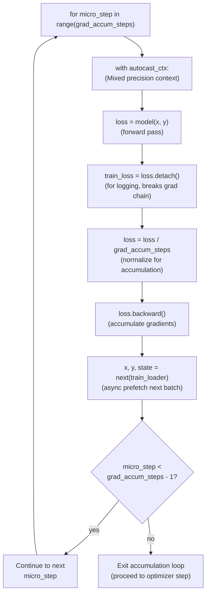
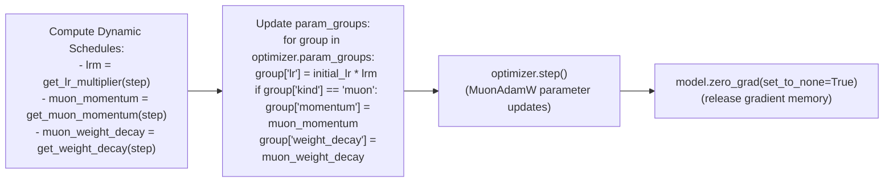
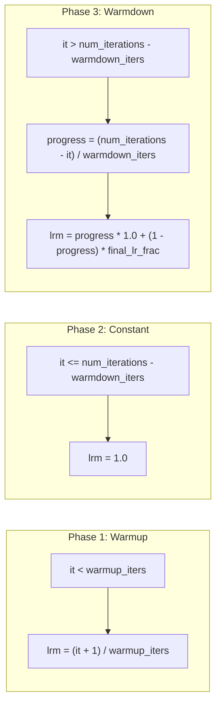

> [!WARNING]
> Imported from DeepWiki as generated, unverified repository documentation. Verify code-behavior claims against the revision below before stabilization.

# Training Loop and Optimization Steps

<details>
<summary>Relevant source files</summary>

The following files were used as context for generating this wiki page:

- [scripts/base_train.py](https://github.com/karpathy/nanochat/blob/92d63d4e8bb4df75c3b71618f31ddde2378b2bcd/scripts/base_train.py)

</details>


## Purpose and Scope

This page documents the core training loop in [scripts/base_train.py](https://github.com/karpathy/nanochat/blob/92d63d4e8bb4df75c3b71618f31ddde2378b2bcd/scripts/base_train.py), focusing on the gradient accumulation mechanism, optimizer stepping, and dynamic hyperparameter scheduling that occurs during each training iteration. This covers the innermost loop of training execution—how gradients are computed, accumulated, and applied to update model parameters.

For information about overall script architecture and initialization, see [Base Training Script Architecture](deepwiki-03-01-base-training-script-architecture.md). For details on how hyperparameters are initially computed from scaling laws, see [The Complexity Dial: Auto-Configuration System](deepwiki-03-02-the-complexity-dial-auto-configuration-system.md). For periodic evaluation and checkpointing logic, see [Evaluation and Checkpointing During Training](deepwiki-03-04-evaluation-and-checkpointing-during-training.md). For the optimizer implementation itself, see [MuonAdamW Hybrid Optimizer](deepwiki-05-01-muonadamw-hybrid-optimizer.md) and [Learning Rate and Weight Decay Schedules](deepwiki-05-04-learning-rate-and-weight-decay-schedules.md).

---

## Training Loop Architecture

The main training loop [scripts/base_train.py:399-564](https://github.com/karpathy/nanochat/blob/92d63d4e8bb4df75c3b71618f31ddde2378b2bcd/scripts/base_train.py#L399-L564) executes `num_iterations + 1` times, performing training steps followed by periodic evaluation, sampling, and checkpointing. The loop maintains several state variables across iterations and coordinates distributed training across all DDP ranks.

### Main Loop Flow

The loop structure prioritizes evaluation and checkpointing before the training step to ensure that step 0 (initial state) and the final step are always captured.

Title: Training Loop Iteration Flow

```mermaid
flowchart TD
    START["while True (step 0 to num_iterations)"]
    
    CHECK_LAST{"last_step = <br/>(step == num_iterations)"}
    
    EVAL_VAL{"eval_every > 0 and<br/>(last_step or <br/>step % eval_every == 0)"}
    EVAL_CORE{"core_metric_every > 0 and<br/>(last_step or <br/>step % core_metric_every == 0)"}
    SAMPLE{"sample_every > 0 and<br/>master_process and<br/>(last_step or <br/>step % sample_every == 0)"}
    SAVE{"last_step or<br/>(save_every > 0 and<br/>step % save_every == 0)"}
    
    DO_EVAL_VAL["evaluate_bpb()<br/>log val/bpb to wandb"]
    DO_EVAL_CORE["evaluate_core()<br/>log core_metric to wandb"]
    DO_SAMPLE["Engine.generate_batch()<br/>print samples"]
    DO_SAVE["save_checkpoint()"]
    
    BREAK{"last_step?"}
    
    TRAIN_STEP["Single Training Step:<br/>1. Gradient Accumulation<br/>2. Optimizer Step<br/>3. Zero Gradients"]
    
    LOG["Log metrics:<br/>- loss, lrm, dt<br/>- tok/sec, mfu<br/>- epoch, eta"]
    
    GC{"first_step_of_run or<br/>step % 5000 == 0"}
    GC_MANAGE["gc.collect()<br/>gc.freeze()<br/>gc.disable()"]
    
    INCREMENT["step += 1"]
    
    START --> CHECK_LAST
    CHECK_LAST --> EVAL_VAL
    EVAL_VAL -->|yes| DO_EVAL_VAL
    EVAL_VAL -->|no| EVAL_CORE
    DO_EVAL_VAL --> EVAL_CORE
    
    EVAL_CORE -->|yes| DO_EVAL_CORE
    EVAL_CORE -->|no| SAMPLE
    DO_EVAL_CORE --> SAMPLE
    
    SAMPLE -->|yes| DO_SAMPLE
    SAMPLE -->|no| SAVE
    DO_SAMPLE --> SAVE
    
    SAVE -->|yes| DO_SAVE
    SAVE -->|no| BREAK
    DO_SAVE --> BREAK
    
    BREAK -->|yes| END["break<br/>(exit loop)"]
    BREAK -->|no| TRAIN_STEP
    
    TRAIN_STEP --> LOG
    LOG --> GC
    GC -->|yes| GC_MANAGE
    GC -->|no| INCREMENT
    GC_MANAGE --> INCREMENT
    INCREMENT --> START
```

Sources: [scripts/base_train.py:399-564](https://github.com/karpathy/nanochat/blob/92d63d4e8bb4df75c3b71618f31ddde2378b2bcd/scripts/base_train.py#L399-L564)

### Loop State Variables

The loop maintains several state variables that are checkpointed for resumption:

| Variable | Type | Purpose | Initial Value | Checkpointed |
|----------|------|---------|---------------|--------------|
| `step` | `int` | Current iteration number | `0` | Yes |
| `val_bpb` | `float` | Last validation BPB | `None` | Yes |
| `min_val_bpb` | `float` | Best validation BPB seen | `float("inf")` | Yes (in `loop_state`) |
| `smooth_train_loss` | `float` | EMA of training loss | `0` | Yes (in `loop_state`) |
| `total_training_time` | `float` | Cumulative wall-clock time | `0` | Yes (in `loop_state`) |
| `dataloader_state_dict` | `dict` | DataLoader resumption state | `None` | Yes |

Sources: [scripts/base_train.py:374-387](https://github.com/karpathy/nanochat/blob/92d63d4e8bb4df75c3b71618f31ddde2378b2bcd/scripts/base_train.py#L374-L387)

---

## Gradient Accumulation Mechanism

To achieve large batch sizes (e.g., 524K tokens) that exceed GPU memory capacity, the training loop uses gradient accumulation [scripts/base_train.py:493-499](https://github.com/karpathy/nanochat/blob/92d63d4e8bb4df75c3b71618f31ddde2378b2bcd/scripts/base_train.py#L493-L499). This splits the total batch size into `grad_accum_steps` micro-batches, accumulating gradients before performing a single optimizer step.

### Accumulation Calculation

```python
tokens_per_fwdbwd = args.device_batch_size * args.max_seq_len
world_tokens_per_fwdbwd = tokens_per_fwdbwd * ddp_world_size
grad_accum_steps = total_batch_size // world_tokens_per_fwdbwd
```
Sources: [scripts/base_train.py:390-396](https://github.com/karpathy/nanochat/blob/92d63d4e8bb4df75c3b71618f31ddde2378b2bcd/scripts/base_train.py#L390-L396)

### Gradient Accumulation Loop

Title: Micro-batch Accumulation Logic


**Key implementation details:**

1. **Loss Normalization**: Each `.backward()` call accumulates gradients additively. To maintain correct gradient magnitudes, the loss is divided by `grad_accum_steps` before backward [scripts/base_train.py:497](https://github.com/karpathy/nanochat/blob/92d63d4e8bb4df75c3b71618f31ddde2378b2bcd/scripts/base_train.py#L497).
2. **Detached Loss**: The `train_loss` variable stores a detached copy for logging, preventing the logging operation from affecting the computation graph [scripts/base_train.py:496](https://github.com/karpathy/nanochat/blob/92d63d4e8bb4df75c3b71618f31ddde2378b2bcd/scripts/base_train.py#L496).
3. **Async Prefetch**: While the GPU computes forward/backward passes, the next batch is prefetched from the DataLoader, overlapping CPU and GPU work [scripts/base_train.py:499](https://github.com/karpathy/nanochat/blob/92d63d4e8bb4df75c3b71618f31ddde2378b2bcd/scripts/base_train.py#L499).
4. **Autocast Context**: All forward passes occur within `autocast_ctx`, which uses `COMPUTE_DTYPE` (typically `bfloat16`) for mixed precision training [scripts/base_train.py:494](https://github.com/karpathy/nanochat/blob/92d63d4e8bb4df75c3b71618f31ddde2378b2bcd/scripts/base_train.py#L494), [nanochat/common.py:22-26](https://github.com/karpathy/nanochat/blob/92d63d4e8bb4df75c3b71618f31ddde2378b2bcd/nanochat/common.py#L22-L26).

Sources: [scripts/base_train.py:493-499](https://github.com/karpathy/nanochat/blob/92d63d4e8bb4df75c3b71618f31ddde2378b2bcd/scripts/base_train.py#L493-L499), [nanochat/common.py:22-26](https://github.com/karpathy/nanochat/blob/92d63d4e8bb4df75c3b71618f31ddde2378b2bcd/nanochat/common.py#L22-L26)

---

## Optimizer Step and Parameter Updates

After gradient accumulation completes, the optimizer updates model parameters based on accumulated gradients and dynamically scheduled hyperparameters.

### Optimizer Step Sequence

Title: Optimization Phase

Sources: [scripts/base_train.py:501-510](https://github.com/karpathy/nanochat/blob/92d63d4e8bb4df75c3b71618f31ddde2378b2bcd/scripts/base_train.py#L501-L510)

### Parameter Group Updates

The optimizer contains multiple parameter groups with different optimization strategies. Each group has an `initial_lr` set during initialization, which is then multiplied by the learning rate schedule multiplier:

```python
for group in optimizer.param_groups:
    group["lr"] = group["initial_lr"] * lrm
    if group['kind'] == 'muon':
        group["momentum"] = muon_momentum
        group["weight_decay"] = muon_weight_decay
```

**Key points:**
- **AdamW groups** (embeddings, unembedding, scalars): Only learning rate is updated via `adamw_step_fused` [nanochat/optim.py:21-50](https://github.com/karpathy/nanochat/blob/92d63d4e8bb4df75c3b71618f31ddde2378b2bcd/nanochat/optim.py#L21-L50).
- **Muon groups** (matrices): Learning rate, momentum, and weight decay are all scheduled dynamically and updated via `muon_step_fused` [nanochat/optim.py:112-149](https://github.com/karpathy/nanochat/blob/92d63d4e8bb4df75c3b71618f31ddde2378b2bcd/nanochat/optim.py#L112-L149).
- **Initial LR preservation**: The `initial_lr` field preserves the base learning rate, allowing the schedule to multiply it without accumulating errors [scripts/base_train.py:505](https://github.com/karpathy/nanochat/blob/92d63d4e8bb4df75c3b71618f31ddde2378b2bcd/scripts/base_train.py#L505).

Sources: [scripts/base_train.py:501-510](https://github.com/karpathy/nanochat/blob/92d63d4e8bb4df75c3b71618f31ddde2378b2bcd/scripts/base_train.py#L501-L510), [nanochat/optim.py:21-149](https://github.com/karpathy/nanochat/blob/92d63d4e8bb4df75c3b71618f31ddde2378b2bcd/nanochat/optim.py#L21-L149)

---

## Learning Rate Schedules

The learning rate follows a three-phase schedule: linear warmup, constant plateau, and linear warmdown [scripts/base_train.py:350-359](https://github.com/karpathy/nanochat/blob/92d63d4e8bb4df75c3b71618f31ddde2378b2bcd/scripts/base_train.py#L350-L359).

### Schedule Function: `get_lr_multiplier(it)`

Title: LR Multiplier Phases


**Schedule parameters:**

| Parameter | CLI Argument | Default | Purpose |
|-----------|--------------|---------|---------|
| `warmup_iters` | `--warmup-steps` | 40 | Linear increase to initial LR |
| `warmdown_iters` | `--warmdown-ratio` | 0.65 | `warmdown_ratio * num_iterations` |
| `final_lr_frac` | `--final-lr-frac` | 0.05 | Final LR as fraction of initial LR |

Sources: [scripts/base_train.py:67-69](https://github.com/karpathy/nanochat/blob/92d63d4e8bb4df75c3b71618f31ddde2378b2bcd/scripts/base_train.py#L67-L69), [scripts/base_train.py:350-359](https://github.com/karpathy/nanochat/blob/92d63d4e8bb4df75c3b71618f31ddde2378b2bcd/scripts/base_train.py#L350-L359)

---

## Momentum and Weight Decay Schedules

In addition to learning rate scheduling, the Muon optimizer uses dynamic momentum and weight decay schedules.

### Momentum Schedule: `get_muon_momentum(it)`

The Muon momentum parameter warms up from 0.85 to 0.95 over the first 300 steps [scripts/base_train.py:362-365](https://github.com/karpathy/nanochat/blob/92d63d4e8bb4df75c3b71618f31ddde2378b2bcd/scripts/base_train.py#L362-L365):

```python
def get_muon_momentum(it):
    frac = min(it / 300, 1)
    momentum = (1 - frac) * 0.85 + frac * 0.95
    return momentum
```

Starting with lower momentum (0.85) provides more exploratory behavior early in training, while ramping to higher momentum (0.95) adds stability as training progresses.

Sources: [scripts/base_train.py:362-365](https://github.com/karpathy/nanochat/blob/92d63d4e8bb4df75c3b71618f31ddde2378b2bcd/scripts/base_train.py#L362-L365)

### Weight Decay Schedule: `get_weight_decay(it)`

Weight decay linearly decays from its initial value to zero over the course of training [scripts/base_train.py:368-369](https://github.com/karpathy/nanochat/blob/92d63d4e8bb4df75c3b71618f31ddde2378b2bcd/scripts/base_train.py#L368-L369):

```python
def get_weight_decay(it):
    return weight_decay_scaled * (1 - it / num_iterations)
```

Decaying weight decay to zero prevents excessive regularization near the end of training, allowing the model to fit the data more precisely.

Sources: [scripts/base_train.py:368-369](https://github.com/karpathy/nanochat/blob/92d63d4e8bb4df75c3b71618f31ddde2378b2bcd/scripts/base_train.py#L368-L369)

---

## Timing and Synchronization

The training loop uses explicit synchronization points to measure accurate wall-clock time for each training step.

### Synchronization Points

```python
synchronize()  # Ensure all GPU work from previous step is complete
t0 = time.time()

# Gradient accumulation loop (forward/backward passes)
for micro_step in range(grad_accum_steps):
    ...

# Optimizer step
optimizer.step()
model.zero_grad(set_to_none=True)
train_loss_f = train_loss.item()  # CPU-GPU sync point

synchronize()  # Ensure all GPU work from this step is complete
t1 = time.time()
dt = t1 - t0
```

**Key synchronization mechanisms:**
1. **`synchronize()`**: Wrapper around `torch.cuda.synchronize()` that blocks until all CUDA kernels complete [scripts/base_train.py:88-90](https://github.com/karpathy/nanochat/blob/92d63d4e8bb4df75c3b71618f31ddde2378b2bcd/scripts/base_train.py#L88-L90).
2. **`.item()`**: Converts a GPU tensor to Python scalar, which implicitly synchronizes [scripts/base_train.py:511](https://github.com/karpathy/nanochat/blob/92d63d4e8bb4df75c3b71618f31ddde2378b2bcd/scripts/base_train.py#L511).

Sources: [scripts/base_train.py:88-514](https://github.com/karpathy/nanochat/blob/92d63d4e8bb4df75c3b71618f31ddde2378b2bcd/scripts/base_train.py#L88-L514)

### Throughput Metrics

After each training step, several throughput metrics are computed:

| Metric | Formula | Purpose |
|--------|---------|---------|
| `tok_per_sec` | `total_batch_size / dt` | Tokens processed per second |
| `flops_per_sec` | `num_flops_per_token * total_batch_size / dt` | Floating point operations per second |
| `mfu` | `100 * flops_per_sec / (gpu_peak_flops * ddp_world_size)` | Model FLOPs Utilization percentage |

Sources: [scripts/base_train.py:522-524](https://github.com/karpathy/nanochat/blob/92d63d4e8bb4df75c3b71618f31ddde2378b2bcd/scripts/base_train.py#L522-L524)

---

## Memory Management

The training loop employs several memory optimization techniques to maximize batch sizes and minimize memory fragmentation.

### Garbage Collection Control

Python's garbage collector can cause unexpected latency spikes during training. The loop disables automatic GC after the first step [scripts/base_train.py:559-564](https://github.com/karpathy/nanochat/blob/92d63d4e8bb4df75c3b71618f31ddde2378b2bcd/scripts/base_train.py#L559-L564):

```python
if first_step_of_run:
    gc.collect()  # Manually collect garbage from initialization
    gc.freeze()   # Freeze all surviving objects (exclude from future GC)
    gc.disable()  # Disable automatic GC
elif step % 5000 == 0:
    gc.collect()  # Periodic manual collection for very long runs
```

Sources: [scripts/base_train.py:556-564](https://github.com/karpathy/nanochat/blob/92d63d4e8bb4df75c3b71618f31ddde2378b2bcd/scripts/base_train.py#L556-L564)

### FP8 Context Management

When FP8 training is enabled via `--fp8`, evaluation and sampling must temporarily disable FP8 to maintain precision. The `disable_fp8()` context manager [scripts/base_train.py:191-235](https://github.com/karpathy/nanochat/blob/92d63d4e8bb4df75c3b71618f31ddde2378b2bcd/scripts/base_train.py#L191-L235) temporarily swaps `Float8Linear` modules with standard `Linear` modules:

```python
with disable_fp8(model), autocast_ctx:
    val_bpb = evaluate_bpb(model, val_loader, eval_steps, token_bytes)
```

This ensures validation metrics are computed in consistent precision regardless of the training precision mode.

Sources: [scripts/base_train.py:47-48](https://github.com/karpathy/nanochat/blob/92d63d4e8bb4df75c3b71618f31ddde2378b2bcd/scripts/base_train.py#L47-L48), [scripts/base_train.py:191-235](https://github.com/karpathy/nanochat/blob/92d63d4e8bb4df75c3b71618f31ddde2378b2bcd/scripts/base_train.py#L191-L235), [scripts/base_train.py:408](https://github.com/karpathy/nanochat/blob/92d63d4e8bb4df75c3b71618f31ddde2378b2bcd/scripts/base_train.py#L408)

### Memory Configuration

The script sets `PYTORCH_ALLOC_CONF` at the top of the file [scripts/base_train.py:15](https://github.com/karpathy/nanochat/blob/92d63d4e8bb4df75c3b71618f31ddde2378b2bcd/scripts/base_train.py#L15):

```python
os.environ["PYTORCH_ALLOC_CONF"] = "expandable_segments:True"
```

This enables PyTorch's expandable segments allocator, which reduces memory fragmentation by allowing the CUDA caching allocator to expand existing memory segments rather than allocating new ones.

Sources: [scripts/base_train.py:15](https://github.com/karpathy/nanochat/blob/92d63d4e8bb4df75c3b71618f31ddde2378b2bcd/scripts/base_train.py#L15)

---

## Training Step Code Map

Title: Code Entity Association Map
| Code Entity | File Reference | Role in Loop |
| :--- | :--- | :--- |
| `grad_accum_steps` | [scripts/base_train.py:396](https://github.com/karpathy/nanochat/blob/92d63d4e8bb4df75c3b71618f31ddde2378b2bcd/scripts/base_train.py#L396) | Number of micro-batches per optimization step |
| `autocast_ctx` | [scripts/base_train.py:308](https://github.com/karpathy/nanochat/blob/92d63d4e8bb4df75c3b71618f31ddde2378b2bcd/scripts/base_train.py#L308) | Context for mixed-precision forward passes |
| `muon_step_fused` | [nanochat/optim.py:112](https://github.com/karpathy/nanochat/blob/92d63d4e8bb4df75c3b71618f31ddde2378b2bcd/nanochat/optim.py#L112) | Low-level kernel for matrix parameter updates |
| `adamw_step_fused` | [nanochat/optim.py:24](https://github.com/karpathy/nanochat/blob/92d63d4e8bb4df75c3b71618f31ddde2378b2bcd/nanochat/optim.py#L24) | Low-level kernel for embedding/scalar updates |
| `get_lr_multiplier` | [scripts/base_train.py:350](https://github.com/karpathy/nanochat/blob/92d63d4e8bb4df75c3b71618f31ddde2378b2bcd/scripts/base_train.py#L350) | Implements the 3-phase learning rate schedule |
| `smooth_train_loss` | [scripts/base_train.py:519](https://github.com/karpathy/nanochat/blob/92d63d4e8bb4df75c3b71618f31ddde2378b2bcd/scripts/base_train.py#L519) | EMA of training loss for logging |

Sources: [scripts/base_train.py:308-519](https://github.com/karpathy/nanochat/blob/92d63d4e8bb4df75c3b71618f31ddde2378b2bcd/scripts/base_train.py#L308-L519), [nanochat/optim.py:24-112](https://github.com/karpathy/nanochat/blob/92d63d4e8bb4df75c3b71618f31ddde2378b2bcd/nanochat/optim.py#L24-L112)
