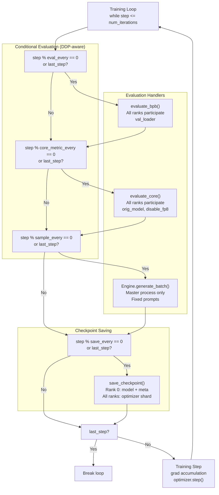
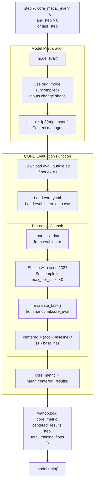
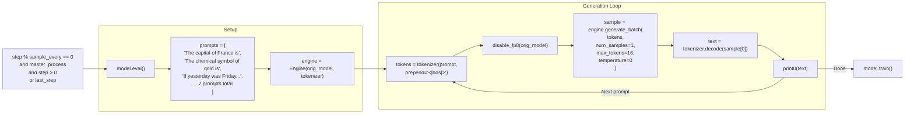
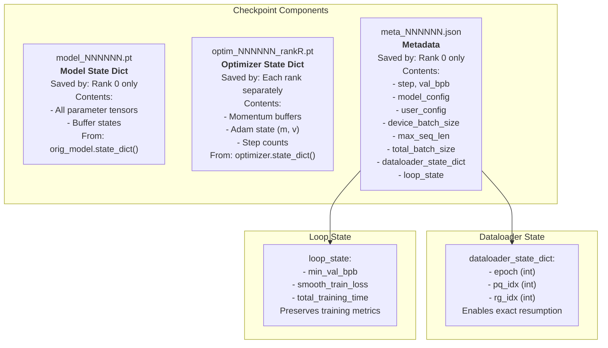
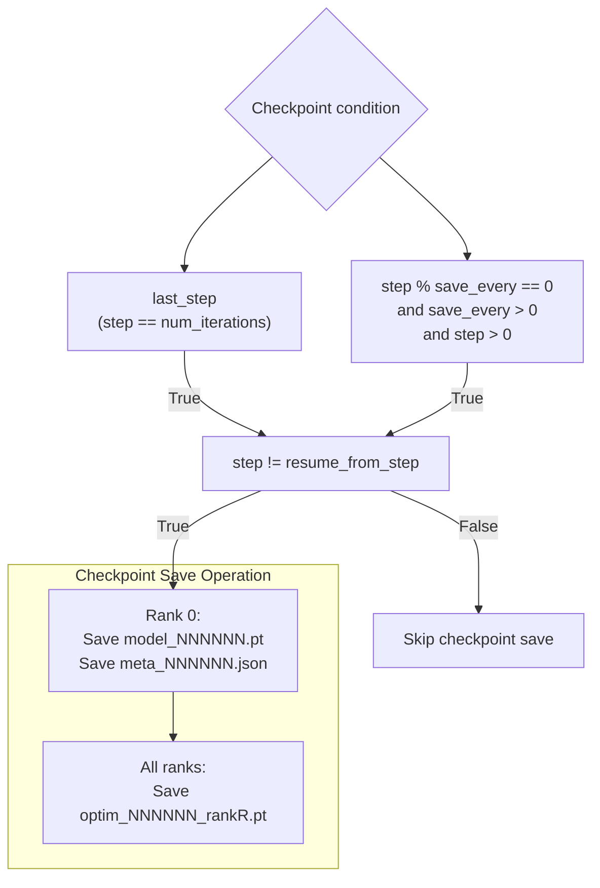
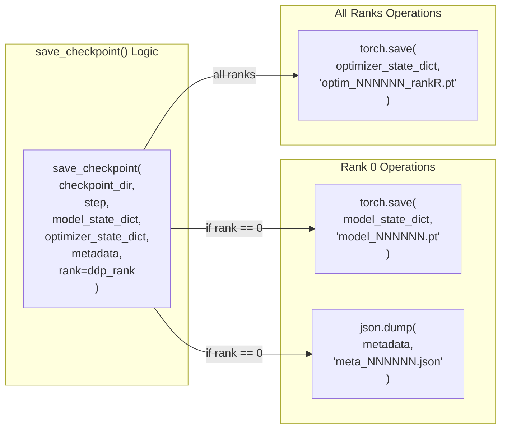
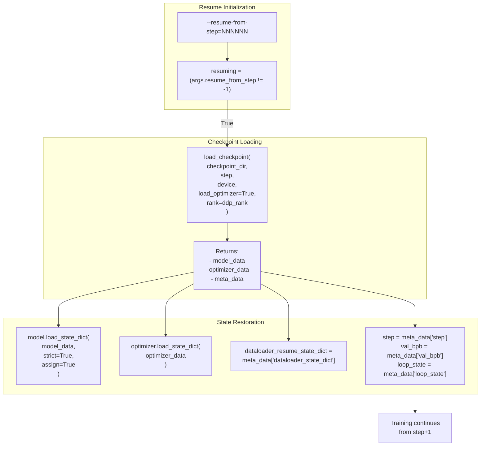
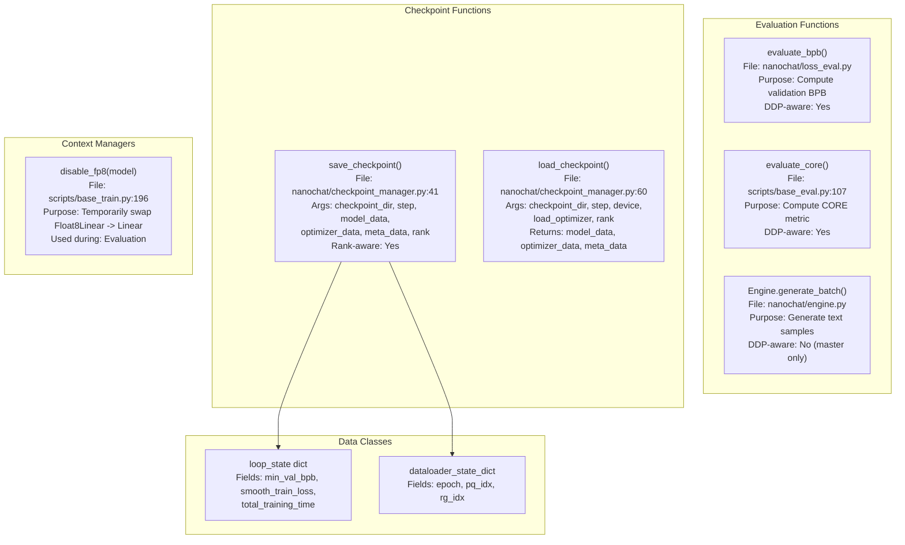

> [!WARNING]
> Imported from DeepWiki as generated, unverified repository documentation. Verify code-behavior claims against the revision below before stabilization.

# Evaluation and Checkpointing During Training

Relevant source files

The following files were used as context for generating this wiki page:

- [nanochat/checkpoint_manager.py](https://github.com/karpathy/nanochat/blob/92d63d4e8bb4df75c3b71618f31ddde2378b2bcd/nanochat/checkpoint_manager.py)
- [scripts/base_train.py](https://github.com/karpathy/nanochat/blob/92d63d4e8bb4df75c3b71618f31ddde2378b2bcd/scripts/base_train.py)

## Purpose and Scope

This page documents how the base training script performs periodic evaluation and saves checkpoints during the training loop. It covers the three types of evaluation (validation BPB, CORE metric, and sampling), checkpoint saving strategies, and the state management that enables exact training resumption.

For information about the overall training loop structure, see [Base Training Script Architecture](deepwiki-03-01-base-training-script-architecture.md). For checkpoint loading and warm-start strategies used in SFT, see [Checkpoint Management](deepwiki-11-01-checkpoint-management.md). For details about the CORE metric itself, see [CORE Score and Validation Metrics](deepwiki-09-01-core-score-and-validation-metrics.md).

---

## Overview: Evaluation and Checkpoint Integration

The training loop in `base_train.py` interleaves training steps with periodic evaluation and checkpoint saving. All operations occur at configurable intervals controlled by CLI arguments.

Title: Training Loop Evaluation and Checkpointing Flow

**Default Evaluation Schedule**

| Evaluation Type | Default Frequency | CLI Argument | All Ranks? |
|----------------|-------------------|--------------|------------|
| Validation BPB | Every 250 steps | `--eval-every` | Yes |
| CORE Metric | Every 2000 steps | `--core-metric-every` | Yes |
| Sampling | Every 2000 steps | `--sample-every` | Master only |
| Checkpoint Save | End of run only | `--save-every` | Rank-aware |

Sources: [scripts/base_train.py:72-77](https://github.com/karpathy/nanochat/blob/92d63d4e8bb4df75c3b71618f31ddde2378b2bcd/scripts/base_train.py#L72-L77), [scripts/base_train.py:408-495](https://github.com/karpathy/nanochat/blob/92d63d4e8bb4df75c3b71618f31ddde2378b2bcd/scripts/base_train.py#L408-L495)

---

## Validation BPB Evaluation

### Purpose and Execution

Validation BPB (bits per byte) measures the model's loss on held-out validation data, normalized to be vocabulary-invariant. This is the primary metric for tracking training progress.

Title: Validation BPB Evaluation Data Flow

```mermaid
graph LR
    TRIGGER["step % eval_every == 0<br/>or last_step"]

    subgraph "Evaluation Setup"
        SET_EVAL["model.eval()<br/>Switch to eval mode"]
        BUILD_LOADER["build_val_loader()<br/>tokenizing_distributed_data_loader_bos_bestfit"]
        CALC_STEPS["eval_steps = eval_tokens /<br/>(device_batch_size * max_seq_len * ddp_world_size)"]
    end

    subgraph "FP8 Handling"
        DISABLE["disable_fp8(model)<br/>Context manager<br/>Swaps Float8Linear -> Linear"]
    end

    subgraph "Evaluation"
        EVAL["evaluate_bpb(model, val_loader,<br/>eval_steps, token_bytes)"]
        REDUCE["DDP all_reduce<br/>Average loss across ranks"]
    end

    subgraph "Logging"
        TRACK["min_val_bpb = min(val_bpb, min_val_bpb)"]
        LOG["wandb.log({<br/>val/bpb,<br/>step,<br/>total_training_flops,<br/>total_training_time<br/>})"]
    end

    RESTORE["model.train()<br/>Return to training mode"]

    TRIGGER --> SET_EVAL
    SET_EVAL --> BUILD_LOADER
    BUILD_LOADER --> CALC_STEPS
    CALC_STEPS --> DISABLE
    DISABLE --> EVAL
    EVAL --> REDUCE
    REDUCE --> TRACK
    TRACK --> LOG
    LOG --> RESTORE
```

### Implementation Details

The validation evaluation happens at [scripts/base_train.py:413-428](https://github.com/karpathy/nanochat/blob/92d63d4e8bb4df75c3b71618f31ddde2378b2bcd/scripts/base_train.py#L413-L428). Key aspects:

**Token Budget**: The `--eval-tokens` argument (default: `80*524288` = 41,943,040 tokens) controls how many validation tokens to evaluate [scripts/base_train.py:73](https://github.com/karpathy/nanochat/blob/92d63d4e8bb4df75c3b71618f31ddde2378b2bcd/scripts/base_train.py#L73). This is divided equally across all DDP ranks.

**FP8 Disabling**: When FP8 training is enabled, the `disable_fp8` context manager [scripts/base_train.py:196-239](https://github.com/karpathy/nanochat/blob/92d63d4e8bb4df75c3b71618f31ddde2378b2bcd/scripts/base_train.py#L196-L239) temporarily swaps `Float8Linear` modules with standard `Linear` modules to ensure consistent BF16 evaluation.

**All-Ranks Participation**: Unlike sampling, all DDP ranks participate in validation evaluation. The `evaluate_bpb` function [nanochat/loss_eval.py:9-65](https://github.com/karpathy/nanochat/blob/92d63d4e8bb4df75c3b71618f31ddde2378b2bcd/nanochat/loss_eval.py#L9-L65) performs internal all-reduce operations to aggregate losses across ranks [nanochat/loss_eval.py:55-58](https://github.com/karpathy/nanochat/blob/92d63d4e8bb4df75c3b71618f31ddde2378b2bcd/nanochat/loss_eval.py#L55-L58).

**Bits Per Byte Calculation**: Instead of a naive mean loss, `evaluate_bpb` calculates the sum of negative log-likelihoods (nats) and divides by the sum of bytes represented by those tokens, then converts to bits [nanochat/loss_eval.py:11-16](https://github.com/karpathy/nanochat/blob/92d63d4e8bb4df75c3b71618f31ddde2378b2bcd/nanochat/loss_eval.py#L11-L16). It uses `token_bytes` to mask special tokens or ignore indices [nanochat/loss_eval.py:23-25](https://github.com/karpathy/nanochat/blob/92d63d4e8bb4df75c3b71618f31ddde2378b2bcd/nanochat/loss_eval.py#L23-L25).

Sources: [scripts/base_train.py:413-428](https://github.com/karpathy/nanochat/blob/92d63d4e8bb4df75c3b71618f31ddde2378b2bcd/scripts/base_train.py#L413-L428), [scripts/base_train.py:196-239](https://github.com/karpathy/nanochat/blob/92d63d4e8bb4df75c3b71618f31ddde2378b2bcd/scripts/base_train.py#L196-L239), [scripts/base_train.py:73](https://github.com/karpathy/nanochat/blob/92d63d4e8bb4df75c3b71618f31ddde2378b2bcd/scripts/base_train.py#L73), [nanochat/loss_eval.py:9-65](https://github.com/karpathy/nanochat/blob/92d63d4e8bb4df75c3b71618f31ddde2378b2bcd/nanochat/loss_eval.py#L9-L65)

---

## CORE Metric Evaluation

### Purpose and Execution

CORE (Centered-over-Random Evaluation) measures zero-shot and few-shot performance on in-context learning tasks. This metric correlates with general model capability and is the primary target for the Time-to-GPT-2 Leaderboard.

Title: CORE Metric Evaluation Pipeline

### Implementation Details

CORE evaluation happens at [scripts/base_train.py:434-445](https://github.com/karpathy/nanochat/blob/92d63d4e8bb4df75c3b71618f31ddde2378b2bcd/scripts/base_train.py#L434-L445) and delegates to `evaluate_core` from [scripts/base_eval.py:107-173](https://github.com/karpathy/nanochat/blob/92d63d4e8bb4df75c3b71618f31ddde2378b2bcd/scripts/base_eval.py#L107-L173).

**Uncompiled Model**: The evaluation uses `orig_model` instead of the compiled model because task inputs have varying sequence lengths, which would cause recompilation overhead [scripts/base_train.py:436](https://github.com/karpathy/nanochat/blob/92d63d4e8bb4df75c3b71618f31ddde2378b2bcd/scripts/base_train.py#L436).

**Task Subsampling**: The `--core-metric-max-per-task` argument (default: 500) limits the number of examples per task for faster evaluation during training [scripts/base_train.py:75](https://github.com/karpathy/nanochat/blob/92d63d4e8bb4df75c3b71618f31ddde2378b2bcd/scripts/base_train.py#L75). Full evaluation uses all examples.

**DDP Participation**: All ranks evaluate CORE tasks. The `evaluate_task` function handles DDP-aware batching and reduction internally.

**Eval Bundle**: The evaluation bundle contains:
- `core.yaml`: Task configuration (task types, num_fewshot, dataset URIs) [scripts/base_eval.py:124](https://github.com/karpathy/nanochat/blob/92d63d4e8bb4df75c3b71618f31ddde2378b2bcd/scripts/base_eval.py#L124)
- `eval_data/`: JSON lines files for each task [scripts/base_eval.py:149](https://github.com/karpathy/nanochat/blob/92d63d4e8bb4df75c3b71618f31ddde2378b2bcd/scripts/base_eval.py#L149)
- `eval_meta_data.csv`: Random baseline values for centered scoring [scripts/base_eval.py:120](https://github.com/karpathy/nanochat/blob/92d63d4e8bb4df75c3b71618f31ddde2378b2bcd/scripts/base_eval.py#L120)

The bundle is downloaded once and cached at `<base_dir>/eval_bundle/` [scripts/base_eval.py:95-105](https://github.com/karpathy/nanochat/blob/92d63d4e8bb4df75c3b71618f31ddde2378b2bcd/scripts/base_eval.py#L95-L105).

**Centered Scoring**: Each task's raw accuracy is centered using the formula:
`centered = (accuracy - 0.01 * random_baseline) / (1.0 - 0.01 * random_baseline)` [scripts/base_eval.py:162](https://github.com/karpathy/nanochat/blob/92d63d4e8bb4df75c3b71618f31ddde2378b2bcd/scripts/base_eval.py#L162).
The CORE metric is the average of all centered scores [scripts/base_eval.py:167](https://github.com/karpathy/nanochat/blob/92d63d4e8bb4df75c3b71618f31ddde2378b2bcd/scripts/base_eval.py#L167).

Sources: [scripts/base_train.py:434-445](https://github.com/karpathy/nanochat/blob/92d63d4e8bb4df75c3b71618f31ddde2378b2bcd/scripts/base_train.py#L434-L445), [scripts/base_eval.py:107-173](https://github.com/karpathy/nanochat/blob/92d63d4e8bb4df75c3b71618f31ddde2378b2bcd/scripts/base_eval.py#L107-L173), [scripts/base_eval.py:92-105](https://github.com/karpathy/nanochat/blob/92d63d4e8bb4df75c3b71618f31ddde2378b2bcd/scripts/base_eval.py#L92-L105), [scripts/base_eval.py:162-167](https://github.com/karpathy/nanochat/blob/92d63d4e8bb4df75c3b71618f31ddde2378b2bcd/scripts/base_eval.py#L162-L167)

---

## Sampling from the Model

### Purpose and Execution

Periodic sampling generates text from fixed prompts to qualitatively track the model's generation quality over training. This provides human-readable progress indicators.

Title: Model Sampling and Generation Flow

### Implementation Details

Sampling occurs at [scripts/base_train.py:449-466](https://github.com/karpathy/nanochat/blob/92d63d4e8bb4df75c3b71618f31ddde2378b2bcd/scripts/base_train.py#L449-L466) with several key characteristics:

**Master Process Only**: Unlike BPB and CORE evaluation, sampling runs only on rank 0 to avoid redundant output [scripts/base_train.py:449](https://github.com/karpathy/nanochat/blob/92d63d4e8bb4df75c3b71618f31ddde2378b2bcd/scripts/base_train.py#L449).

**Deterministic Generation**: Temperature is set to 0 for greedy decoding, ensuring deterministic outputs that can be compared across training steps [scripts/base_train.py:464](https://github.com/karpathy/nanochat/blob/92d63d4e8bb4df75c3b71618f31ddde2378b2bcd/scripts/base_train.py#L464).

**Fixed Prompts**: Seven prompts cover factual knowledge, logic, and general text generation [scripts/base_train.py:450-458](https://github.com/karpathy/nanochat/blob/92d63d4e8bb4df75c3b71618f31ddde2378b2bcd/scripts/base_train.py#L450-L458).

**Short Generations**: `max_tokens=16` keeps outputs concise while still demonstrating the model's understanding [scripts/base_train.py:464](https://github.com/karpathy/nanochat/blob/92d63d4e8bb4df75c3b71618f31ddde2378b2bcd/scripts/base_train.py#L464).

**Uncompiled Model**: Uses `orig_model` to avoid recompilation overhead from varying input lengths [scripts/base_train.py:460](https://github.com/karpathy/nanochat/blob/92d63d4e8bb4df75c3b71618f31ddde2378b2bcd/scripts/base_train.py#L460).

Sources: [scripts/base_train.py:449-466](https://github.com/karpathy/nanochat/blob/92d63d4e8bb4df75c3b71618f31ddde2378b2bcd/scripts/base_train.py#L449-L466)

---

## Checkpoint Saving

### What Gets Saved

Checkpoints consist of three components, saved as separate files:

Title: Checkpoint Component Architecture

### Checkpoint Metadata Structure

The metadata JSON file contains comprehensive training state [scripts/base_train.py:475-489](https://github.com/karpathy/nanochat/blob/92d63d4e8bb4df75c3b71618f31ddde2378b2bcd/scripts/base_train.py#L475-L489):

| Field | Type | Purpose |
|-------|------|---------|
| `step` | int | Training step number |
| `val_bpb` | float | Validation BPB at this step |
| `model_config` | dict | Full `GPTConfig` as dict |
| `user_config` | dict | All CLI arguments (`args`) |
| `device_batch_size` | int | Per-device batch size |
| `max_seq_len` | int | Sequence length |
| `total_batch_size` | int | Total batch size in tokens |
| `dataloader_state_dict` | dict | Dataloader position (epoch, pq_idx, rg_idx) |
| `loop_state` | dict | Training metrics (min_val_bpb, smooth_train_loss, total_training_time) |

Sources: [scripts/base_train.py:475-489](https://github.com/karpathy/nanochat/blob/92d63d4e8bb4df75c3b71618f31ddde2378b2bcd/scripts/base_train.py#L475-L489)

---

## Checkpoint Saving Logic

### When Checkpoints Are Saved

Title: Checkpoint Saving Decision Logic

**Default Behavior**: By default (`--save-every=-1`), checkpoints are saved only at the end of training [scripts/base_train.py:77](https://github.com/karpathy/nanochat/blob/92d63d4e8bb4df75c3b71618f31ddde2378b2bcd/scripts/base_train.py#L77).

**Periodic Saving**: Setting `--save-every=N` saves checkpoints every N steps [scripts/base_train.py:469](https://github.com/karpathy/nanochat/blob/92d63d4e8bb4df75c3b71618f31ddde2378b2bcd/scripts/base_train.py#L469).

**Resume Skip**: When resuming from a checkpoint, the first step after resumption does not save to avoid duplicate checkpoints [scripts/base_train.py:469](https://github.com/karpathy/nanochat/blob/92d63d4e8bb4df75c3b71618f31ddde2378b2bcd/scripts/base_train.py#L469).

### Directory Structure

Checkpoints are saved to `<base_dir>/base_checkpoints/<model_tag>/` [scripts/base_train.py:154-156](https://github.com/karpathy/nanochat/blob/92d63d4e8bb4df75c3b71618f31ddde2378b2bcd/scripts/base_train.py#L154-L156). The `model_tag` can be overridden with `--model-tag=custom_name` [scripts/base_train.py:79](https://github.com/karpathy/nanochat/blob/92d63d4e8bb4df75c3b71618f31ddde2378b2bcd/scripts/base_train.py#L79).

Sources: [scripts/base_train.py:469-491](https://github.com/karpathy/nanochat/blob/92d63d4e8bb4df75c3b71618f31ddde2378b2bcd/scripts/base_train.py#L469-L491), [scripts/base_train.py:154-156](https://github.com/karpathy/nanochat/blob/92d63d4e8bb4df75c3b71618f31ddde2378b2bcd/scripts/base_train.py#L154-L156), [scripts/base_train.py:77-79](https://github.com/karpathy/nanochat/blob/92d63d4e8bb4df75c3b71618f31ddde2378b2bcd/scripts/base_train.py#L77-L79)

---

## Rank-Aware Saving

The checkpoint saving process is DDP-aware:

Title: Distributed Checkpoint Saving Implementation

**Model Redundancy Avoidance**: Only rank 0 saves the model state dict to avoid writing identical copies across ranks [nanochat/checkpoint_manager.py:42-48](https://github.com/karpathy/nanochat/blob/92d63d4e8bb4df75c3b71618f31ddde2378b2bcd/nanochat/checkpoint_manager.py#L42-L48).

**Optimizer Sharding**: Each rank saves its own optimizer state because distributed optimizers maintain separate states for parameter shards [nanochat/checkpoint_manager.py:54-58](https://github.com/karpathy/nanochat/blob/92d63d4e8bb4df75c3b71618f31ddde2378b2bcd/nanochat/checkpoint_manager.py#L54-L58).

Sources: [nanochat/checkpoint_manager.py:41-59](https://github.com/karpathy/nanochat/blob/92d63d4e8bb4df75c3b71618f31ddde2378b2bcd/nanochat/checkpoint_manager.py#L41-L59), [scripts/base_train.py:32](https://github.com/karpathy/nanochat/blob/92d63d4e8bb4df75c3b71618f31ddde2378b2bcd/scripts/base_train.py#L32)

---

## Training Resumption

### Resume Mechanism

Training can be resumed from any saved checkpoint using `--resume-from-step=NNNNNN` [scripts/base_train.py:70](https://github.com/karpathy/nanochat/blob/92d63d4e8bb4df75c3b71618f31ddde2378b2bcd/scripts/base_train.py#L70).

Title: Training Resumption Data Flow

### State Components Restored

| Component | Restoration Point | Purpose |
|-----------|------------------|---------|
| Model Parameters | [scripts/base_train.py:161](https://github.com/karpathy/nanochat/blob/92d63d4e8bb4df75c3b71618f31ddde2378b2bcd/scripts/base_train.py#L161) | Exact model weights |
| Optimizer State | [scripts/base_train.py:318](https://github.com/karpathy/nanochat/blob/92d63d4e8bb4df75c3b71618f31ddde2378b2bcd/scripts/base_train.py#L318) | Momentum, Adam m/v buffers |
| Training Step | [scripts/base_train.py:391](https://github.com/karpathy/nanochat/blob/92d63d4e8bb4df75c3b71618f31ddde2378b2bcd/scripts/base_train.py#L391) | Iteration counter |
| Validation BPB | [scripts/base_train.py:393](https://github.com/karpathy/nanochat/blob/92d63d4e8bb4df75c3b71618f31ddde2378b2bcd/scripts/base_train.py#L393) | Last measured val loss |
| Loop State | [scripts/base_train.py:392-396](https://github.com/karpathy/nanochat/blob/92d63d4e8bb4df75c3b71618f31ddde2378b2bcd/scripts/base_train.py#L392-L396) | min_val_bpb, smooth_train_loss, total_training_time |
| Dataloader State | [scripts/base_train.py:329-330](https://github.com/karpathy/nanochat/blob/92d63d4e8bb4df75c3b71618f31ddde2378b2bcd/scripts/base_train.py#L329-L330) | Exact position: epoch, pq_idx, rg_idx |

### Exact Resumption Guarantees

The resume mechanism ensures **bit-exact** continuation of training:

**Data Position**: The dataloader state dict captures the exact position in the dataset (parquet index, row group index, epoch) [scripts/base_train.py:329-330](https://github.com/karpathy/nanochat/blob/92d63d4e8bb4df75c3b71618f31ddde2378b2bcd/scripts/base_train.py#L329-L330). This ensures no data is skipped or repeated.

**Optimizer Momentum**: Loading the optimizer state dict restores all momentum buffers and Adam statistics, ensuring identical gradient updates [scripts/base_train.py:318](https://github.com/karpathy/nanochat/blob/92d63d4e8bb4df75c3b71618f31ddde2378b2bcd/scripts/base_train.py#L318).

**Learning Rate Schedule**: The step counter is restored, so learning rate schedules (warmup, warmdown) continue from the correct phase [scripts/base_train.py:391](https://github.com/karpathy/nanochat/blob/92d63d4e8bb4df75c3b71618f31ddde2378b2bcd/scripts/base_train.py#L391).

Sources: [scripts/base_train.py:157-163](https://github.com/karpathy/nanochat/blob/92d63d4e8bb4df75c3b71618f31ddde2378b2bcd/scripts/base_train.py#L157-L163), [scripts/base_train.py:329-330](https://github.com/karpathy/nanochat/blob/92d63d4e8bb4df75c3b71618f31ddde2378b2bcd/scripts/base_train.py#L329-L330), [scripts/base_train.py:384-396](https://github.com/karpathy/nanochat/blob/92d63d4e8bb4df75c3b71618f31ddde2378b2bcd/scripts/base_train.py#L384-L396), [scripts/base_train.py:318](https://github.com/karpathy/nanochat/blob/92d63d4e8bb4df75c3b71618f31ddde2378b2bcd/scripts/base_train.py#L318)

---

## Evaluation and Checkpoint Code Entities

### Key Functions and Classes

Title: Evaluation and Checkpointing Entity Relationship

### Training Loop Integration Points

| Code Location | Purpose | Frequency |
|--------------|---------|-----------|
| [scripts/base_train.py:413-428](https://github.com/karpathy/nanochat/blob/92d63d4e8bb4df75c3b71618f31ddde2378b2bcd/scripts/base_train.py#L413-L428) | Validation BPB evaluation | Every `eval_every` steps |
| [scripts/base_train.py:434-445](https://github.com/karpathy/nanochat/blob/92d63d4e8bb4df75c3b71618f31ddde2378b2bcd/scripts/base_train.py#L434-L445) | CORE metric evaluation | Every `core_metric_every` steps |
| [scripts/base_train.py:449-466](https://github.com/karpathy/nanochat/blob/92d63d4e8bb4df75c3b71618f31ddde2378b2bcd/scripts/base_train.py#L449-L466) | Model sampling | Every `sample_every` steps |
| [scripts/base_train.py:469-491](https://github.com/karpathy/nanochat/blob/92d63d4e8bb4df75c3b71618f31ddde2378b2bcd/scripts/base_train.py#L469-L491) | Checkpoint saving | Every `save_every` steps or at end |
| [scripts/base_train.py:157-163](https://github.com/karpathy/nanochat/blob/92d63d4e8bb4df75c3b71618f31ddde2378b2bcd/scripts/base_train.py#L157-L163) | Resume checkpoint loading | Once if `resume_from_step != -1` |
| [scripts/base_train.py:329-330](https://github.com/karpathy/nanochat/blob/92d63d4e8bb4df75c3b71618f31ddde2378b2bcd/scripts/base_train.py#L329-L330) | Resume dataloader state | Once if resuming |

Sources: [scripts/base_train.py:413-491](https://github.com/karpathy/nanochat/blob/92d63d4e8bb4df75c3b71618f31ddde2378b2bcd/scripts/base_train.py#L413-L491), [scripts/base_train.py:157-163](https://github.com/karpathy/nanochat/blob/92d63d4e8bb4df75c3b71618f31ddde2378b2bcd/scripts/base_train.py#L157-L163), [scripts/base_train.py:329-330](https://github.com/karpathy/nanochat/blob/92d63d4e8bb4df75c3b71618f31ddde2378b2bcd/scripts/base_train.py#L329-L330), [nanochat/checkpoint_manager.py:41-73](https://github.com/karpathy/nanochat/blob/92d63d4e8bb4df75c3b71618f31ddde2378b2bcd/nanochat/checkpoint_manager.py#L41-L73)

---

## CLI Arguments Reference

### Evaluation Control

| Argument | Type | Default | Description |
|----------|------|---------|-------------|
| `--eval-every` | int | 250 | Evaluate validation BPB every N steps (-1 = disable) |
| `--eval-tokens` | int | 80*524288 | Number of tokens for validation evaluation |
| `--core-metric-every` | int | 2000 | Evaluate CORE metric every N steps (-1 = disable) |
| `--core-metric-max-per-task` | int | 500 | Examples per task for CORE (for faster eval) |
| `--sample-every` | int | 2000 | Sample from model every N steps (-1 = disable) |

### Checkpoint Control

| Argument | Type | Default | Description |
|----------|------|---------|-------------|
| `--save-every` | int | -1 | Save checkpoints every N steps (-1 = only at end) |
| `--resume-from-step` | int | -1 | Resume training from this step (-1 = disable) |
| `--model-tag` | str | None | Override model tag for checkpoint directory (default: `d{depth}`) |

Sources: [scripts/base_train.py:72-77](https://github.com/karpathy/nanochat/blob/92d63d4e8bb4df75c3b71618f31ddde2378b2bcd/scripts/base_train.py#L72-L77), [scripts/base_train.py:70](https://github.com/karpathy/nanochat/blob/92d63d4e8bb4df75c3b71618f31ddde2378b2bcd/scripts/base_train.py#L70), [scripts/base_train.py:79](https://github.com/karpathy/nanochat/blob/92d63d4e8bb4df75c3b71618f31ddde2378b2bcd/scripts/base_train.py#L79)
