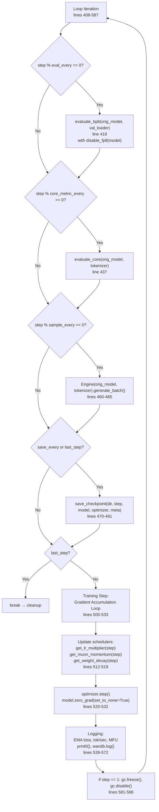
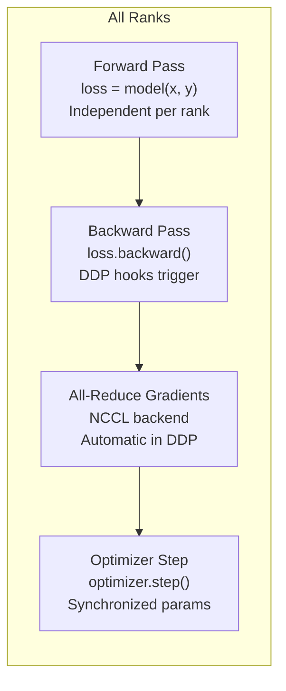

> [!WARNING]
> Imported from DeepWiki as generated, unverified repository documentation. Verify code-behavior claims against the revision below before stabilization.

# Base Model Pretraining

<details>
<summary>Relevant source files</summary>

The following files were used as context for generating this wiki page:

- [scripts/base_train.py](https://github.com/karpathy/nanochat/blob/92d63d4e8bb4df75c3b71618f31ddde2378b2bcd/scripts/base_train.py)

</details>


## Purpose and Scope

Base model pretraining is the core training phase that produces GPT-2-level language modeling capability. This stage trains a transformer model on the **ClimbMix-400B** dataset [scripts/base_train.py:20](https://github.com/karpathy/nanochat/blob/92d63d4e8bb4df75c3b71618f31ddde2378b2bcd/scripts/base_train.py#L20) to predict next tokens, establishing general language understanding before conversational fine-tuning.

The primary entry point is `scripts/base_train.py`, which orchestrates all aspects of pretraining: model initialization, data loading, optimization, distributed training, evaluation, and checkpointing. This page provides a comprehensive overview of the base pretraining system. For detailed implementation coverage, see the subsections:

- **[Base Training Script Architecture](deepwiki-03-01-base-training-script-architecture.md)**: Deep dive into `base_train.py` structure, CLI arguments, initialization flow, and main training loop.
- **[The Complexity Dial: Auto-Configuration System](deepwiki-03-02-the-complexity-dial-auto-configuration-system.md)**: How the `--depth` parameter controls all hyperparameters via empirical scaling laws [scripts/base_train.py:248-355](https://github.com/karpathy/nanochat/blob/92d63d4e8bb4df75c3b71618f31ddde2378b2bcd/scripts/base_train.py#L248-L355).
- **[Training Loop and Optimization Steps](deepwiki-03-03-training-loop-and-optimization-steps.md)**: Detailed walkthrough of gradient accumulation, forward/backward passes, and optimizer stepping [scripts/base_train.py:500-533](https://github.com/karpathy/nanochat/blob/92d63d4e8bb4df75c3b71618f31ddde2378b2bcd/scripts/base_train.py#L500-L533).
- **[Evaluation and Checkpointing During Training](deepwiki-03-04-evaluation-and-checkpointing-during-training.md)**: Periodic validation, CORE metric evaluation, sampling, and checkpoint management [scripts/base_train.py:417-491](https://github.com/karpathy/nanochat/blob/92d63d4e8bb4df75c3b71618f31ddde2378b2bcd/scripts/base_train.py#L417-L491).

For related systems, see:
- Model architecture: [GPT Transformer Architecture](deepwiki-04-01-gpt-transformer-architecture.md)
- Optimizer details: [MuonAdamW Hybrid Optimizer](deepwiki-05-01-muonadamw-hybrid-optimizer.md)
- Data pipeline: [BOS-Aligned Best-Fit DataLoader](deepwiki-06-02-bos-aligned-best-fit-dataloader.md)
- Next pipeline stage: [SFT Training Script](deepwiki-07-01-sft-training-script.md)

---

## System Architecture Overview

The `base_train.py` script integrates eight major subsystems into a unified training pipeline. The architecture emphasizes explicit control over precision, distributed training, and scaling law-based auto-configuration.

**Component Integration and Data Flow**

```mermaid
graph TB
    subgraph "scripts/base_train.py"
        MAIN["Main Training Loop<br/>lines 408-587"]
    end
    
    subgraph "Model (nanochat/gpt.py)"
        GPT["GPT(GPTConfig)<br/>Transformer model"]
        SETUP_OPT["setup_optimizer()<br/>→ MuonAdamW"]
        NUM_PARAMS["num_scaling_params()<br/>transformer_matrices + lm_head"]
        ESTIMATE_FLOPS["estimate_flops()<br/>FLOPs per token"]
    end
    
    subgraph "Data (nanochat/dataloader.py)"
        TRAIN_LOADER["tokenizing_distributed_data_loader_with_state_bos_bestfit<br/>resume_state_dict support"]
        VAL_LOADER["tokenizing_distributed_data_loader_bos_bestfit<br/>validation split"]
        GET_TOK["get_tokenizer()<br/>nanochat/tokenizer.py"]
    end
    
    subgraph "Optimization (nanochat/optim.py)"
        MUONADAMW["MuonAdamW<br/>Muon for matrices<br/>AdamW for embeddings"]
    end
    
    subgraph "Evaluation (scripts/base_eval.py, nanochat/loss_eval.py)"
        EVAL_BPB["evaluate_bpb(model, val_loader)<br/>bits per byte"]
        EVAL_CORE["evaluate_core(model, tokenizer)<br/>22-task metric"]
        ENGINE_GEN["Engine(model, tokenizer)<br/>generate_batch()"]
    end
    
    subgraph "Infrastructure (nanochat/)"
        COMPUTE_INIT["compute_init(device_type)<br/>common.py: DDP setup"]
        SAVE_CKPT["save_checkpoint()<br/>checkpoint_manager.py"]
        LOAD_CKPT["load_checkpoint()<br/>checkpoint_manager.py"]
        FP8_CONV["convert_to_float8_training<br/>fp8.py or torchao"]
    end
    
    MAIN --> COMPUTE_INIT
    MAIN --> GPT
    MAIN --> SETUP_OPT
    MAIN --> TRAIN_LOADER
    MAIN --> VAL_LOADER
    MAIN --> EVAL_BPB
    MAIN --> EVAL_CORE
    MAIN --> ENGINE_GEN
    MAIN --> SAVE_CKPT
    MAIN --> LOAD_CKPT
    MAIN --> FP8_CONV
    
    GPT --> SETUP_OPT
    GPT --> NUM_PARAMS
    GPT --> ESTIMATE_FLOPS
    SETUP_OPT --> MUONADAMW
    
    GET_TOK --> TRAIN_LOADER
    GET_TOK --> VAL_LOADER
    GET_TOK --> EVAL_CORE
    GET_TOK --> ENGINE_GEN
```



**Sources:** [scripts/base_train.py:1-623](https://github.com/karpathy/nanochat/blob/92d63d4e8bb4df75c3b71618f31ddde2378b2bcd/scripts/base_train.py#L1-L623), [nanochat/dataloader.py:74-162](https://github.com/karpathy/nanochat/blob/92d63d4e8bb4df75c3b71618f31ddde2378b2bcd/nanochat/dataloader.py#L74-L162)

**Script Execution Phases:**

1. **Initialization [scripts/base_train.py:84-324](https://github.com/karpathy/nanochat/blob/92d63d4e8bb4df75c3b71618f31ddde2378b2bcd/scripts/base_train.py#L84-L324)**: 
   - DDP setup via `compute_init()` [scripts/base_train.py:86](https://github.com/karpathy/nanochat/blob/92d63d4e8bb4df75c3b71618f31ddde2378b2bcd/scripts/base_train.py#L86).
   - Model construction: `build_model_meta(depth)` → `GPT(config)` [scripts/base_train.py:129-143](https://github.com/karpathy/nanochat/blob/92d63d4e8bb4df75c3b71618f31ddde2378b2bcd/scripts/base_train.py#L129-L143).
   - Scaling laws: compute `target_tokens`, `total_batch_size`, LR scaling [scripts/base_train.py:248-303](https://github.com/karpathy/nanochat/blob/92d63d4e8bb4df75c3b71618f31ddde2378b2bcd/scripts/base_train.py#L248-L303).
   - Optimizer setup: `model.setup_optimizer()` → `MuonAdamW` [scripts/base_train.py:307-315](https://github.com/karpathy/nanochat/blob/92d63d4e8bb4df75c3b71618f31ddde2378b2bcd/scripts/base_train.py#L307-L315).
   - Optional FP8 conversion: `convert_to_float8_training(model)` [scripts/base_train.py:173-192](https://github.com/karpathy/nanochat/blob/92d63d4e8bb4df75c3b71618f31ddde2378b2bcd/scripts/base_train.py#L173-L192).
   - Data loaders: `tokenizing_distributed_data_loader_with_state_bos_bestfit()` [scripts/base_train.py:329-332](https://github.com/karpathy/nanochat/blob/92d63d4e8bb4df75c3b71618f31ddde2378b2bcd/scripts/base_train.py#L329-L332).

2. **Training Loop [scripts/base_train.py:408-587](https://github.com/karpathy/nanochat/blob/92d63d4e8bb4df75c3b71618f31ddde2378b2bcd/scripts/base_train.py#L408-L587)**: 
   - Gradient accumulation over micro-batches [scripts/base_train.py:502-510](https://github.com/karpathy/nanochat/blob/92d63d4e8bb4df75c3b71618f31ddde2378b2bcd/scripts/base_train.py#L502-L510).
   - Periodic evaluation: `evaluate_bpb()`, `evaluate_core()`, `Engine.generate_batch()`.
   - Dynamic scheduling: LR warmup/warmdown, momentum ramp, weight decay cosine.
   - Checkpoint saving: `save_checkpoint()` at intervals or end.

3. **Cleanup [scripts/base_train.py:620-622](https://github.com/karpathy/nanochat/blob/92d63d4e8bb4df75c3b71618f31ddde2378b2bcd/scripts/base_train.py#L620-L622)**: 
   - Wandb logging finalization and `compute_cleanup()` for distributed teardown.

Detailed breakdowns of each phase are in subsection [Base Training Script Architecture](deepwiki-03-01-base-training-script-architecture.md).

---

## Command-Line Interface

The script exposes 30+ CLI arguments [scripts/base_train.py:41](https://github.com/karpathy/nanochat/blob/92d63d4e8bb4df75c3b71618f31ddde2378b2bcd/scripts/base_train.py#L41), organized into seven categories. The `--depth` parameter serves as the "complexity dial" that auto-configures batch size, learning rates, and training duration via scaling laws.

**Key Configuration Parameters**

| Category | Critical Parameters | Default | Auto-Configured By `--depth` |
|----------|---------------------|---------|------------------------------|
| **Model** | `--depth` | 20 | ❌ (user must set) |
| | `--max-seq-len` | 2048 | ❌ |
| | `--window-pattern` | "SSSL" | ❌ |
| **Training Horizon** | `--target-param-data-ratio` | 12 | Used in computation |
| | `--num-iterations` | -1 | ✅ (from ratio × params) |
| **Optimization** | `--total-batch-size` | -1 | ✅ (B ∝ D^0.383) |
| | `--matrix-lr` | 0.02 | ✅ (scaled by √(B/B_ref)) |
| | `--weight-decay` | 0.28 | ✅ (T_epoch framework) |
| **Evaluation** | `--eval-every` | 250 | ❌ |
| | `--core-metric-every` | 2000 | ❌ |
| **FP8** | `--fp8` | False | ❌ |
| **Checkpointing** | `--save-every` | -1 | ❌ |
| **Resumption** | `--resume-from-step` | -1 | ❌ |

**Sources:** [scripts/base_train.py:40-81](https://github.com/karpathy/nanochat/blob/92d63d4e8bb4df75c3b71618f31ddde2378b2bcd/scripts/base_train.py#L40-L81)

The auto-configuration system is detailed in subsection [The Complexity Dial: Auto-Configuration System](deepwiki-03-02-the-complexity-dial-auto-configuration-system.md).

---

## High-Level Execution Flow

The script follows a standard initialization → training loop → cleanup pattern, with key decision points for resumption, FP8 conversion, and auto-configuration.

**Initialization and Training Lifecycle**

```mermaid
flowchart TD
    START["torchrun or python -m scripts.base_train"]
    
    START --> PARSE["argparse.ArgumentParser<br/>Parse CLI args"]
    
    PARSE --> INIT_DDP["compute_init(device_type)<br/>line 86<br/>→ ddp, rank, world_size, device"]
    
    INIT_DDP --> TOKENIZER["get_tokenizer()<br/>line 121<br/>→ tiktoken BPE"]
    
    TOKENIZER --> BUILD["build_model_meta(args.depth)<br/>lines 129-143<br/>GPTConfig → GPT on meta device"]
    
    BUILD --> MATERIALIZE["model.to_empty(device)<br/>model.init_weights()<br/>lines 150-151"]
    
    MATERIALIZE --> RESUME{args.resume_from_step<br/>!= -1?}
    
    RESUME -->|Yes| LOAD["load_checkpoint(step, rank)<br/>lines 160-162<br/>model + optimizer + metadata"]
    
    RESUME -->|No| FP8_CHECK
    LOAD --> FP8_CHECK
    
    FP8_CHECK{args.fp8?}
    
    FP8_CHECK -->|Yes| FP8["convert_to_float8_training<br/>lines 173-192<br/>nn.Linear → Float8Linear"]
    
    FP8_CHECK -->|No| COMPILE
    FP8 --> COMPILE
    
    COMPILE["torch.compile(model)<br/>line 245<br/>dynamic=False"]
    
    COMPILE --> SCALING["Scaling Laws<br/>lines 248-378<br/>batch_size, lr_scale, wd_scale"]
    
    SCALING --> OPT["model.setup_optimizer()<br/>lines 307-315<br/>→ MuonAdamW"]
    
    OPT --> DATA["train_loader, build_val_loader<br/>lines 329-332"]
    
    DATA --> LOOP["while True loop<br/>lines 408-587"]
    
    LOOP --> PERIODIC["if eval_every/core_metric_every/sample_every:<br/>evaluate_bpb(), evaluate_core(), generate_batch()"]
    
    PERIODIC --> SAVE{save_every or<br/>last_step?}
    
    SAVE -->|Yes| CKPT["save_checkpoint()<br/>lines 470-491"]
    SAVE -->|No| DONE_CHECK
    CKPT --> DONE_CHECK
    
    DONE_CHECK{last_step?}
    
    DONE_CHECK -->|Yes| CLEANUP["compute_cleanup()<br/>wandb_run.finish()<br/>lines 621-622"]
    
    DONE_CHECK -->|No| TRAIN_STEP["Gradient Accumulation<br/>Forward/Backward<br/>Optimizer Step<br/>lines 500-575"]
    
    TRAIN_STEP --> LOOP
    
    CLEANUP --> END["End"]
```



**Sources:** [scripts/base_train.py:84-622](https://github.com/karpathy/nanochat/blob/92d63d4e8bb4df75c3b71618f31ddde2378b2bcd/scripts/base_train.py#L84-L622)

---

## The Complexity Dial: Overview

The `--depth` parameter controls model size (number of transformer layers), which triggers automatic configuration of all training hyperparameters via empirical scaling laws. This "single-dial" design eliminates manual tuning for different model sizes.

**Scaling Law Chain of Derivations**

```mermaid
graph LR
    DEPTH["args.depth<br/>(e.g., 12, 26, 50)"]
    
    DEPTH --> DIM["model_dim =<br/>((depth × 64) / 128) × 128<br/>line 134"]
    
    DIM --> CONFIG["GPTConfig(n_layer=depth,<br/>n_embd=model_dim)<br/>lines 136-140"]
    
    CONFIG --> COUNT["num_scaling_params =<br/>transformer_matrices + lm_head<br/>get_scaling_params(model)<br/>lines 262-266"]
    
    COUNT --> TOKENS["target_tokens =<br/>12.0 × num_scaling_params<br/>line 268"]
    
    TOKENS --> BATCH["total_batch_size =<br/>B_REF × (D/D_REF)^0.383<br/>lines 275-282<br/>(Power Lines paper)"]
    
    BATCH --> LR["lr_scale =<br/>√(B/B_REF)<br/>lines 286-293"]
    
    LR --> WD["weight_decay_scaled =<br/>wd × √(B/B_REF) × (D_REF/D)<br/>lines 296-303<br/>(T_epoch framework)"]
    
    WD --> ITERS["num_iterations =<br/>target_tokens / total_batch_size<br/>lines 347-350"]
```



**Sources:** [scripts/base_train.py:248-355](https://github.com/karpathy/nanochat/blob/92d63d4e8bb4df75c3b71618f31ddde2378b2bcd/scripts/base_train.py#L248-L355)

The complete scaling law implementation, including reference model construction and edge case handling, is documented in [The Complexity Dial: Auto-Configuration System](deepwiki-03-02-the-complexity-dial-auto-configuration-system.md).

---

## Training Loop Overview

Each training iteration processes `total_batch_size` tokens via gradient accumulation over multiple micro-batches [scripts/base_train.py:502-510](https://github.com/karpathy/nanochat/blob/92d63d4e8bb4df75c3b71618f31ddde2378b2bcd/scripts/base_train.py#L502-L510). The loop interleaves training steps with periodic evaluation and checkpointing.

**Single Training Iteration Structure**



**Sources:** [scripts/base_train.py:408-587](https://github.com/karpathy/nanochat/blob/92d63d4e8bb4df75c3b71618f31ddde2378b2bcd/scripts/base_train.py#L408-L587)

The detailed mechanics of gradient accumulation, scheduler updates, and optimizer stepping are in [Training Loop and Optimization Steps](deepwiki-03-03-training-loop-and-optimization-steps.md).

---

## Distributed Training Integration

Multi-GPU training uses PyTorch DDP (DistributedDataParallel) with automatic gradient synchronization. The script is launched via `torchrun` for distributed mode or `python -m` for single-device mode.

**DDP Setup and Data Sharding**

```python
# Line 86: Initialize DDP environment
ddp, ddp_rank, ddp_local_rank, ddp_world_size, device = compute_init(device_type)

# Lines 329-332: Data loaders automatically shard by rank
train_loader = tokenizing_distributed_data_loader_with_state_bos_bestfit(
    tokenizer, args.device_batch_size, args.max_seq_len, split="train", device=device,
    resume_state_dict=dataloader_resume_state_dict
)
```

**Communication During Training Step**



**Sources:** [scripts/base_train.py:86](https://github.com/karpathy/nanochat/blob/92d63d4e8bb4df75c3b71618f31ddde2378b2bcd/scripts/base_train.py#L86), [scripts/base_train.py:329-332](https://github.com/karpathy/nanochat/blob/92d63d4e8bb4df75c3b71618f31ddde2378b2bcd/scripts/base_train.py#L329-L332)

For implementation details, see [Base Training Script Architecture](deepwiki-03-01-base-training-script-architecture.md) and [Distributed Training with DDP](deepwiki-08-02-distributed-training-with-ddp.md).

---

## FP8 Training (Optional)

When the `--fp8` flag is set [scripts/base_train.py:47](https://github.com/karpathy/nanochat/blob/92d63d4e8bb4df75c3b71618f31ddde2378b2bcd/scripts/base_train.py#L47), the script converts eligible `nn.Linear` layers to `Float8Linear` for performance gains on H100+ GPUs. Evaluation always runs in BF16 for consistency via the `disable_fp8()` context manager [scripts/base_train.py:195-239](https://github.com/karpathy/nanochat/blob/92d63d4e8bb4df75c3b71618f31ddde2378b2bcd/scripts/base_train.py#L195-L239).

**FP8 Layer Conversion lines 168-192:**

```python
from nanochat.fp8 import Float8LinearConfig, convert_to_float8_training

# Filter: dimensions must be divisible by 16, size ≥ 128
def fp8_module_filter(mod: nn.Module, fqn: str) -> bool:
    if not isinstance(mod, nn.Linear): return False
    if mod.in_features % 16 != 0 or mod.out_features % 16 != 0: return False
    if min(mod.in_features, mod.out_features) < 128: return False
    return True

fp8_config = Float8LinearConfig.from_recipe_name(args.fp8_recipe)  # tensorwise or rowwise
convert_to_float8_training(model, config=fp8_config, module_filter_fn=fp8_module_filter)
```

**Sources:** [scripts/base_train.py:168-239](https://github.com/karpathy/nanochat/blob/92d63d4e8bb4df75c3b71618f31ddde2378b2bcd/scripts/base_train.py#L168-L239), [scripts/base_train.py:417-464](https://github.com/karpathy/nanochat/blob/92d63d4e8bb4df75c3b71618f31ddde2378b2bcd/scripts/base_train.py#L417-L464)

FP8 training details are in [FP8 Training with torchao](deepwiki-08-01-fp8-training-with-torchao.md).

---

## Checkpointing and Resumption

Checkpoints are saved to `base_checkpoints/<model_tag>/` with three file types per step: `model_<step>.pt`, `optim_<step>_rank<N>.pt`, and `meta_<step>.json` [scripts/base_train.py:470-491](https://github.com/karpathy/nanochat/blob/92d63d4e8bb4df75c3b71618f31ddde2378b2bcd/scripts/base_train.py#L470-L491).

**Metadata Structure lines 475-489:**

```python
{
    "step": step,
    "val_bpb": val_bpb,
    "model_config": model_config_kwargs,  # GPTConfig as dict
    "user_config": user_config,           # CLI args
    "dataloader_state_dict": {"epoch": ..., "pq_idx": ..., "rg_idx": ...},
    "loop_state": {
        "min_val_bpb": min_val_bpb,
        "smooth_train_loss": smooth_train_loss,
        "total_training_time": total_training_time,
    }
}
```

**Resumption Flow lines 157-162:**

If `--resume-from-step` is specified, the script calls `load_checkpoint()` to restore the model, optimizer, and dataloader state [scripts/base_train.py:160-162](https://github.com/karpathy/nanochat/blob/92d63d4e8bb4df75c3b71618f31ddde2378b2bcd/scripts/base_train.py#L160-L162).

**Sources:** [scripts/base_train.py:157-162](https://github.com/karpathy/nanochat/blob/92d63d4e8bb4df75c3b71618f31ddde2378b2bcd/scripts/base_train.py#L157-L162), [scripts/base_train.py:470-491](https://github.com/karpathy/nanochat/blob/92d63d4e8bb4df75c3b71618f31ddde2378b2bcd/scripts/base_train.py#L470-L491)

---

## Performance Monitoring

Training metrics are logged to Weights & Biases (or stdout if `--run=dummy`) at regular intervals [scripts/base_train.py:539-572](https://github.com/karpathy/nanochat/blob/92d63d4e8bb4df75c3b71618f31ddde2378b2bcd/scripts/base_train.py#L539-L572). Key performance indicators include throughput (tokens/sec), hardware utilization (MFU), and convergence (loss, validation BPB).

**Logged Metrics and Logging Frequency**

| Metric | Formula | Frequency | Purpose |
|--------|---------|-----------|---------|
| `train/loss` | EMA: `0.9 × prev + 0.1 × current` | Every 100 steps | Convergence tracking |
| `train/tok_per_sec` | `total_batch_size / dt` | Every 100 steps | Throughput |
| `train/mfu` | `(FLOPs/sec) / (peak_flops × world_size) × 100` | Every 100 steps | GPU utilization % |
| `val/bpb` | `evaluate_bpb()` | Every `eval_every` steps | Generalization |
| `core_metric` | `evaluate_core()` | Every `core_metric_every` steps | GPT-2 capability |

**Sources:** [scripts/base_train.py:539-572](https://github.com/karpathy/nanochat/blob/92d63d4e8bb4df75c3b71618f31ddde2378b2bcd/scripts/base_train.py#L539-L572)

Model FLOPs Utilization (MFU) quantifies the percentage of theoretical hardware peak achieved. Performance optimization details are in [Performance Metrics: MFU and Throughput](deepwiki-09-03-performance-metrics-mfu-and-throughput.md).

---

## Relationship to Other Pipeline Stages

Base pretraining is the second of four stages in the complete nanochat pipeline:

1. **Tokenizer Training** ([scripts/tok_train.py](https://github.com/karpathy/nanochat/blob/92d63d4e8bb4df75c3b71618f31ddde2378b2bcd/scripts/tok_train.py)): Produces the 32,768-token BPE vocabulary.
2. **Base Pretraining** (this stage): Trains language modeling capability on ClimbMix-400B dataset.
3. **Supervised Fine-Tuning** ([scripts/chat_sft.py](https://github.com/karpathy/nanochat/blob/92d63d4e8bb4df75c3b71618f31ddde2378b2bcd/scripts/chat_sft.py)): Adapts the base model to conversational format.
4. **Reinforcement Learning** ([scripts/chat_rl.py](https://github.com/karpathy/nanochat/blob/92d63d4e8bb4df75c3b71618f31ddde2378b2bcd/scripts/chat_rl.py)): Further optimizes conversational quality.

The base model checkpoint serves as the initialization for SFT training. The model architecture and vocabulary remain unchanged across stages; only the training objective and data change.
