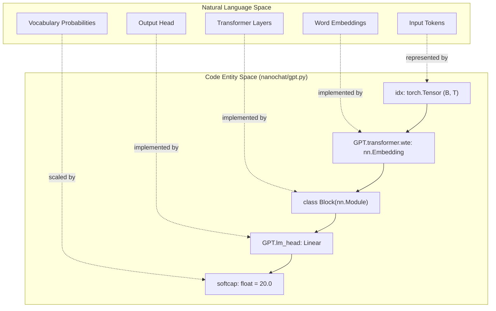
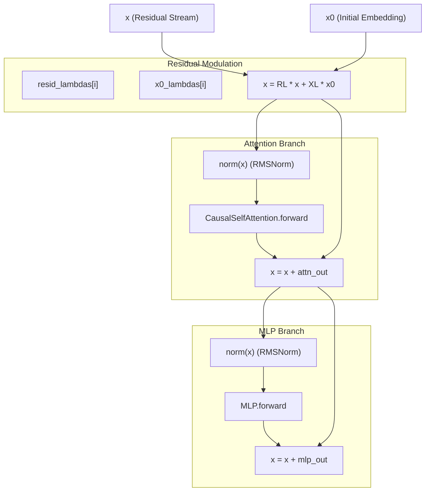

> [!WARNING]
> Imported from DeepWiki as generated, unverified repository documentation. Verify code-behavior claims against the revision below before stabilization.

# GPT Transformer Architecture

<details>
<summary>Relevant source files</summary>

The following files were used as context for generating this wiki page:

- [nanochat/gpt.py](https://github.com/karpathy/nanochat/blob/92d63d4e8bb4df75c3b71618f31ddde2378b2bcd/nanochat/gpt.py)

</details>


This page documents the core GPT model implementation in `nanochat/gpt.py`, which defines the neural network architecture used for both base pretraining and fine-tuned chat models. The architecture is a decoder-only Transformer with several modern enhancements: rotary embeddings, untied weights, ReLU² activations, QK normalization, value embeddings, learnable per-layer scalars, and Flash Attention 3 integration.

---

## Architecture Overview

The GPT model follows a standard decoder-only Transformer design with modern modifications optimized for training efficiency and inference speed. It explicitly manages precision via a custom `Linear` layer rather than relying on `torch.amp.autocast`. [dev/LOG.md:72-83](https://github.com/karpathy/nanochat/blob/92d63d4e8bb4df75c3b71618f31ddde2378b2bcd/dev/LOG.md#L72-L83)

### Natural Language to Code Entity Mapping

This diagram bridges the conceptual model components to the specific class and variable names used in the implementation.



**Sources:** [nanochat/gpt.py:156-212](https://github.com/karpathy/nanochat/blob/92d63d4e8bb4df75c3b71618f31ddde2378b2bcd/nanochat/gpt.py#L156-L212), [nanochat/gpt.py:419-423](https://github.com/karpathy/nanochat/blob/92d63d4e8bb4df75c3b71618f31ddde2378b2bcd/nanochat/gpt.py#L419-L423)

### GPTConfig Dataclass

The `GPTConfig` dataclass defines all architectural hyperparameters:

| Parameter | Type | Default | Description |
|-----------|------|---------|-------------|
| `sequence_len` | int | 2048 | Maximum sequence length for training/inference |
| `vocab_size` | int | 32768 | Vocabulary size (tokenizer dependent) |
| `n_layer` | int | 12 | Number of transformer blocks |
| `n_head` | int | 6 | Number of query attention heads |
| `n_kv_head` | int | 6 | Number of key/value heads (enables GQA when < n_head) |
| `n_embd` | int | 768 | Model dimension (embedding size) |
| `window_pattern` | str | "SSSL" | Sliding window pattern (S=short, L=long) |

**Sources:** [nanochat/gpt.py:28-39](https://github.com/karpathy/nanochat/blob/92d63d4e8bb4df75c3b71618f31ddde2378b2bcd/nanochat/gpt.py#L28-L39)

---

## Block Architecture

Each `Block` consists of a `CausalSelfAttention` layer followed by an `MLP` layer, both with pre-normalization and residual connections. [nanochat/gpt.py:144-153](https://github.com/karpathy/nanochat/blob/92d63d4e8bb4df75c3b71618f31ddde2378b2bcd/nanochat/gpt.py#L144-L153)

### Detailed Data Flow

The following diagram tracks the data flow through a single block, highlighting the specific tensor operations and normalization points.



**Sources:** [nanochat/gpt.py:144-153](https://github.com/karpathy/nanochat/blob/92d63d4e8bb4df75c3b71618f31ddde2378b2bcd/nanochat/gpt.py#L144-L153), [nanochat/gpt.py:406-417](https://github.com/karpathy/nanochat/blob/92d63d4e8bb4df75c3b71618f31ddde2378b2bcd/nanochat/gpt.py#L406-L417)

### MLP Implementation

The MLP uses a two-layer feedforward network with ReLU² activation. This activation was chosen over standard ReLU or GeLU for improved training stability and performance in this architecture. [nanochat/gpt.py:7-7](https://github.com/karpathy/nanochat/blob/92d63d4e8bb4df75c3b71618f31ddde2378b2bcd/nanochat/gpt.py#L7-L7)

```python
# From nanochat/gpt.py:131-141
class MLP(nn.Module):
    def __init__(self, config):
        super().__init__()
        self.c_fc = Linear(config.n_embd, 4 * config.n_embd, bias=False)
        self.c_proj = Linear(4 * config.n_embd, config.n_embd, bias=False)

    def forward(self, x):
        x = self.c_fc(x)
        x = F.relu(x).square() # ReLU² activation
        x = self.c_proj(x)
        return x
```

**Sources:** [nanochat/gpt.py:131-141](https://github.com/karpathy/nanochat/blob/92d63d4e8bb4df75c3b71618f31ddde2378b2bcd/nanochat/gpt.py#L131-L141)

---

## Special Architectural Features

### Learnable Per-Layer Scalars

The model includes two types of learnable per-layer scalar parameters that modulate the residual stream. These scalars allow the network to learn the optimal depth and contribution of each block:

1.  **`resid_lambdas`**: Shape `(n_layer,)`, initialized to 1.0. Scales the incoming residual stream at the start of each block. [nanochat/gpt.py:174-179](https://github.com/karpathy/nanochat/blob/92d63d4e8bb4df75c3b71618f31ddde2378b2bcd/nanochat/gpt.py#L174-L179), [nanochat/gpt.py:226-227](https://github.com/karpathy/nanochat/blob/92d63d4e8bb4df75c3b71618f31ddde2378b2bcd/nanochat/gpt.py#L226-L227)
2.  **`x0_lambdas`**: Shape `(n_layer,)`, initialized to 0.1. Blends the initial normalized embedding (`x0`) back into every layer, acting as a "highway" for low-level features. [nanochat/gpt.py:174-179](https://github.com/karpathy/nanochat/blob/92d63d4e8bb4df75c3b71618f31ddde2378b2bcd/nanochat/gpt.py#L174-L179), [nanochat/gpt.py:413](https://github.com/karpathy/nanochat/blob/92d63d4e8bb4df75c3b71618f31ddde2378b2bcd/nanochat/gpt.py#L413)

**Sources:** [nanochat/gpt.py:174-179](https://github.com/karpathy/nanochat/blob/92d63d4e8bb4df75c3b71618f31ddde2378b2bcd/nanochat/gpt.py#L174-L179), [nanochat/gpt.py:226-227](https://github.com/karpathy/nanochat/blob/92d63d4e8bb4df75c3b71618f31ddde2378b2bcd/nanochat/gpt.py#L226-L227), [nanochat/gpt.py:413](https://github.com/karpathy/nanochat/blob/92d63d4e8bb4df75c3b71618f31ddde2378b2bcd/nanochat/gpt.py#L413)

### Value Embeddings (ResFormer-style)

Value embeddings provide additional capacity by adding learned embeddings directly to the value vectors in attention, allowing the model to attend to fixed global features. [nanochat/gpt.py:93-97](https://github.com/karpathy/nanochat/blob/92d63d4e8bb4df75c3b71618f31ddde2378b2bcd/nanochat/gpt.py#L93-L97)

*   **Placement**: Alternating layers, determined by `has_ve(layer_idx, n_layer)`. The last layer is always included to ensure high-level semantic features are available for prediction. [nanochat/gpt.py:53-55](https://github.com/karpathy/nanochat/blob/92d63d4e8bb4df75c3b71618f31ddde2378b2bcd/nanochat/gpt.py#L53-L55)
*   **Gating**: An input-dependent gate is learned per head using the first 12 channels of the residual stream. [nanochat/gpt.py:81-82](https://github.com/karpathy/nanochat/blob/92d63d4e8bb4df75c3b71618f31ddde2378b2bcd/nanochat/gpt.py#L81-L82)
*   **Formula**: `v = v + gate * value_embedding`, where `gate` is `3 * sigmoid(ve_gate(x))`. [nanochat/gpt.py:94-97](https://github.com/karpathy/nanochat/blob/92d63d4e8bb4df75c3b71618f31ddde2378b2bcd/nanochat/gpt.py#L94-L97)

**Sources:** [nanochat/gpt.py:53-55](https://github.com/karpathy/nanochat/blob/92d63d4e8bb4df75c3b71618f31ddde2378b2bcd/nanochat/gpt.py#L53-L55), [nanochat/gpt.py:81-82](https://github.com/karpathy/nanochat/blob/92d63d4e8bb4df75c3b71618f31ddde2378b2bcd/nanochat/gpt.py#L81-L82), [nanochat/gpt.py:94-97](https://github.com/karpathy/nanochat/blob/92d63d4e8bb4df75c3b71618f31ddde2378b2bcd/nanochat/gpt.py#L94-L97), [nanochat/gpt.py:181-183](https://github.com/karpathy/nanochat/blob/92d63d4e8bb4df75c3b71618f31ddde2378b2bcd/nanochat/gpt.py#L181-L183)

### Untied Embeddings and Logit Softcapping

Unlike standard GPT-2, nanochat uses **untied weights** for the token embedding (`wte`) and the language model head (`lm_head`). [nanochat/gpt.py:6-9](https://github.com/karpathy/nanochat/blob/92d63d4e8bb4df75c3b71618f31ddde2378b2bcd/nanochat/gpt.py#L6-L9) This allows for independent optimization and initialization of these layers, which is particularly important when using the Muon optimizer. [nanochat/gpt.py:169-173](https://github.com/karpathy/nanochat/blob/92d63d4e8bb4df75c3b71618f31ddde2378b2bcd/nanochat/gpt.py#L169-L173)

The output logits are processed through a **softcap** of 20.0 to prevent training instability and logit drift:
`logits = 20.0 * torch.tanh(logits / 20.0)` [nanochat/gpt.py:419-423](https://github.com/karpathy/nanochat/blob/92d63d4e8bb4df75c3b71618f31ddde2378b2bcd/nanochat/gpt.py#L419-L423)

**Sources:** [nanochat/gpt.py:6-9](https://github.com/karpathy/nanochat/blob/92d63d4e8bb4df75c3b71618f31ddde2378b2bcd/nanochat/gpt.py#L6-L9), [nanochat/gpt.py:169-173](https://github.com/karpathy/nanochat/blob/92d63d4e8bb4df75c3b71618f31ddde2378b2bcd/nanochat/gpt.py#L169-L173), [nanochat/gpt.py:419-423](https://github.com/karpathy/nanochat/blob/92d63d4e8bb4df75c3b71618f31ddde2378b2bcd/nanochat/gpt.py#L419-L423)

### Custom Linear Layer and Explicit Dtype

To replace the "magic" of `torch.amp.autocast`, nanochat uses a custom `Linear` class. It ensures that matmuls occur in the activation's dtype (e.g., `bf16`) while keeping master weights in `fp32` for precision. [nanochat/gpt.py:45-50](https://github.com/karpathy/nanochat/blob/92d63d4e8bb4df75c3b71618f31ddde2378b2bcd/nanochat/gpt.py#L45-L50), [dev/LOG.md:77-83](https://github.com/karpathy/nanochat/blob/92d63d4e8bb4df75c3b71618f31ddde2378b2bcd/dev/LOG.md#L77-L83)

```python
# From nanochat/gpt.py:45-50
class Linear(nn.Linear):
    """nn.Linear that casts weights to match input dtype in forward.
    Replaces autocast: master weights stay fp32 for optimizer precision,
    but matmuls run in the activation dtype (typically bf16 from embeddings)."""
    def forward(self, x):
        return F.linear(x, self.weight.to(dtype=x.dtype))
```

**Sources:** [nanochat/gpt.py:45-50](https://github.com/karpathy/nanochat/blob/92d63d4e8bb4df75c3b71618f31ddde2378b2bcd/nanochat/gpt.py#L45-L50), [dev/LOG.md:77-83](https://github.com/karpathy/nanochat/blob/92d63d4e8bb4df75c3b71618f31ddde2378b2bcd/dev/LOG.md#L77-L83)

---

## Model Initialization

### Initialization Pattern: Meta Device

The `GPT` model utilizes a two-phase initialization to support large-scale distributed training and memory efficiency. This prevents OOM (Out Of Memory) errors during the setup phase on high-rank nodes.

1.  **`__init__`**: Executed in a `torch.device("meta")` context. It defines the module structure and parameter shapes without allocating real memory. [nanochat/gpt.py:157-162](https://github.com/karpathy/nanochat/blob/92d63d4e8bb4df75c3b71618f31ddde2378b2bcd/nanochat/gpt.py#L157-L162)
2.  **`init_weights()`**: Materializes parameters on the actual device and performs initialization (e.g., normal distribution for weights, zeros for projections). [nanochat/gpt.py:194-250](https://github.com/karpathy/nanochat/blob/92d63d4e8bb4df75c3b71618f31ddde2378b2bcd/nanochat/gpt.py#L194-L250)

**Sources:** [nanochat/gpt.py:157-162](https://github.com/karpathy/nanochat/blob/92d63d4e8bb4df75c3b71618f31ddde2378b2bcd/nanochat/gpt.py#L157-L162), [nanochat/gpt.py:194-250](https://github.com/karpathy/nanochat/blob/92d63d4e8bb4df75c3b71618f31ddde2378b2bcd/nanochat/gpt.py#L194-L250)

### Parameter Counting and FLOPs

The model provides methods to estimate its computational footprint, which is critical for scaling laws and performance benchmarking:

*   **`num_scaling_params()`**: Categorizes parameters into groups (e.g., `wte`, `value_embeds`, `transformer_matrices`). This is used for scaling law calculations in the complexity dial. [nanochat/gpt.py:300-354](https://github.com/karpathy/nanochat/blob/92d63d4e8bb4df75c3b71618f31ddde2378b2bcd/nanochat/gpt.py#L300-L354)
*   **`estimate_flops()`**: Calculates FLOPs per token for forward and backward passes, accounting for the `window_pattern` which reduces attention compute in layers with short windows. [nanochat/gpt.py:356-383](https://github.com/karpathy/nanochat/blob/92d63d4e8bb4df75c3b71618f31ddde2378b2bcd/nanochat/gpt.py#L356-L383)

**Sources:** [nanochat/gpt.py:300-354](https://github.com/karpathy/nanochat/blob/92d63d4e8bb4df75c3b71618f31ddde2378b2bcd/nanochat/gpt.py#L300-L354), [nanochat/gpt.py:356-383](https://github.com/karpathy/nanochat/blob/92d63d4e8bb4df75c3b71618f31ddde2378b2bcd/nanochat/gpt.py#L356-L383)
