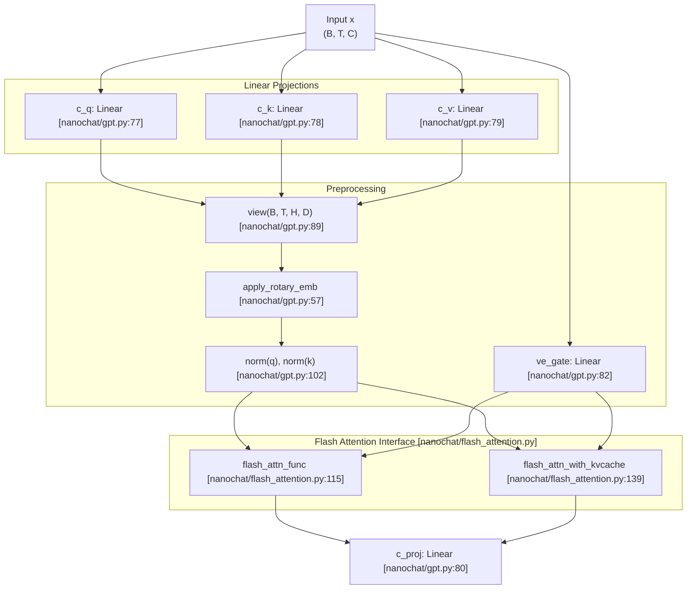
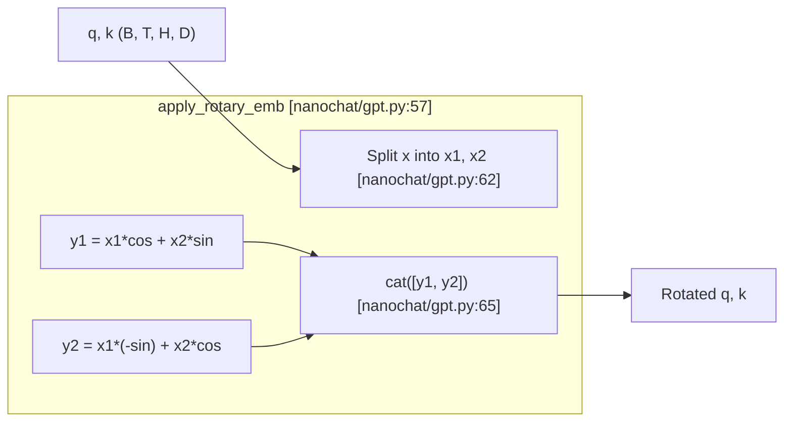

> [!WARNING]
> Imported from DeepWiki as generated, unverified repository documentation. Verify code-behavior claims against the revision below before stabilization.

# Attention Mechanisms and Flash Attention

Relevant source files

The following files were used as context for generating this wiki page:

- [nanochat/flash_attention.py](https://github.com/karpathy/nanochat/blob/92d63d4e8bb4df75c3b71618f31ddde2378b2bcd/nanochat/flash_attention.py)
- [nanochat/fp8.py](https://github.com/karpathy/nanochat/blob/92d63d4e8bb4df75c3b71618f31ddde2378b2bcd/nanochat/fp8.py)
- [nanochat/gpt.py](https://github.com/karpathy/nanochat/blob/92d63d4e8bb4df75c3b71618f31ddde2378b2bcd/nanochat/gpt.py)
- [tests/test_attention_fallback.py](https://github.com/karpathy/nanochat/blob/92d63d4e8bb4df75c3b71618f31ddde2378b2bcd/tests/test_attention_fallback.py)

## Purpose and Scope

This document details the attention mechanism implementation in nanochat's GPT model. It covers the unified Flash Attention interface (supporting Flash Attention 3 and SDPA fallback), Rotary Positional Embeddings (RoPE), QK Normalization, sliding window patterns, and the integration of Value Embeddings (ResFormer). For the broader transformer architecture, see [GPT Transformer Architecture](https://github.com/karpathy/nanochat/blob/92d63d4e8bb4df75c3b71618f31ddde2378b2bcd/nanochat/gpt.py).

---

## Attention Architecture Overview

The nanochat model implements causal self-attention with several modern enhancements:

- **Flash Attention 3** on Hopper GPUs (H100) with automatic fallback to PyTorch SDPA on other hardware.
- **Sliding window attention** with configurable per-layer patterns.
- **Group-Query Attention (GQA)** for memory-efficient inference.
- **Rotary Positional Embeddings (RoPE)** for relative position encoding.
- **QK Normalization** for training stability.
- **Value Embeddings** (ResFormer-style) for increased capacity at low FLOP cost.

### CausalSelfAttention Module Structure

**Sources:** [nanochat/gpt.py:67-128](https://github.com/karpathy/nanochat/blob/92d63d4e8bb4df75c3b71618f31ddde2378b2bcd/nanochat/gpt.py#L67-L128), [nanochat/flash_attention.py:115-185](https://github.com/karpathy/nanochat/blob/92d63d4e8bb4df75c3b71618f31ddde2378b2bcd/nanochat/flash_attention.py#L115-L185)

---

## Flash Attention 3 and SDPA Fallback

The codebase uses a unified interface in `nanochat/flash_attention.py` that automatically detects hardware capabilities and selects the most efficient kernel.

### Hardware Detection and Dispatch
The system attempts to load Flash Attention 3 (FA3) if a compatible GPU (Hopper sm90, Ada sm89, or Ampere sm80/86) is detected and the compute dtype is `bfloat16` [nanochat/flash_attention.py:23-68](https://github.com/karpathy/nanochat/blob/92d63d4e8bb4df75c3b71618f31ddde2378b2bcd/nanochat/flash_attention.py#L23-L68). Specifically, for H100/Hopper, it uses the `varunneal/flash-attention-3` kernel [nanochat/flash_attention.py:35-37](https://github.com/karpathy/nanochat/blob/92d63d4e8bb4df75c3b71618f31ddde2378b2bcd/nanochat/flash_attention.py#L35-L37). If these conditions are not met (e.g., on Blackwell sm100 or CPU/MPS), it falls back to PyTorch's `scaled_dot_product_attention` (SDPA) [nanochat/flash_attention.py:71-110](https://github.com/karpathy/nanochat/blob/92d63d4e8bb4df75c3b71618f31ddde2378b2bcd/nanochat/flash_attention.py#L71-L110).

### Unified Interface Methods
The `flash_attn` object is a `SimpleNamespace` [nanochat/flash_attention.py:191-193](https://github.com/karpathy/nanochat/blob/92d63d4e8bb4df75c3b71618f31ddde2378b2bcd/nanochat/flash_attention.py#L191-L193) providing two primary methods:
1.  `flash_attn_func`: Used during training. It handles causal masking and sliding windows [nanochat/flash_attention.py:115-136](https://github.com/karpathy/nanochat/blob/92d63d4e8bb4df75c3b71618f31ddde2378b2bcd/nanochat/flash_attention.py#L115-L136).
2.  `flash_attn_with_kvcache`: Used during inference. It manages the `k_cache` and `v_cache` tensors in-place, matching the FA3 API [nanochat/flash_attention.py:139-185](https://github.com/karpathy/nanochat/blob/92d63d4e8bb4df75c3b71618f31ddde2378b2bcd/nanochat/flash_attention.py#L139-L185).

### Layout Optimization
FA3 uses a native `(B, T, H, D)` layout [nanochat/gpt.py:89](https://github.com/karpathy/nanochat/blob/92d63d4e8bb4df75c3b71618f31ddde2378b2bcd/nanochat/gpt.py#L89). When falling back to SDPA, the implementation automatically transposes tensors to `(B, H, T, D)` and back to maintain consistency with the model's expectations [nanochat/flash_attention.py:131-136](https://github.com/karpathy/nanochat/blob/92d63d4e8bb4df75c3b71618f31ddde2378b2bcd/nanochat/flash_attention.py#L131-L136).

**Sources:** [nanochat/flash_attention.py:1-193](https://github.com/karpathy/nanochat/blob/92d63d4e8bb4df75c3b71618f31ddde2378b2bcd/nanochat/flash_attention.py#L1-L193), [nanochat/gpt.py:25-26](https://github.com/karpathy/nanochat/blob/92d63d4e8bb4df75c3b71618f31ddde2378b2bcd/nanochat/gpt.py#L25-L26), [nanochat/gpt.py:88-91](https://github.com/karpathy/nanochat/blob/92d63d4e8bb4df75c3b71618f31ddde2378b2bcd/nanochat/gpt.py#L88-L91), [tests/test_attention_fallback.py:1-46](https://github.com/karpathy/nanochat/blob/92d63d4e8bb4df75c3b71618f31ddde2378b2bcd/tests/test_attention_fallback.py#L1-L46)

---

## Sliding Window Attention

Sliding window attention limits the context a token can attend to, reducing the quadratic complexity of the attention matrix.

### Window Pattern Configuration
The `GPTConfig.window_pattern` string (e.g., `"SSSL"`) defines the pattern of "Short" (quarter context) and "Long" (full context) windows tiled across layers [nanochat/gpt.py:36-39](https://github.com/karpathy/nanochat/blob/92d63d4e8bb4df75c3b71618f31ddde2378b2bcd/nanochat/gpt.py#L36-L39). The final layer is always forced to a "Long" window to ensure global context aggregation [nanochat/gpt.py:269-270](https://github.com/karpathy/nanochat/blob/92d63d4e8bb4df75c3b71618f31ddde2378b2bcd/nanochat/gpt.py#L269-L270).

| Window Type | Logical Size | Implementation Tuple |
| :--- | :--- | :--- |
| **Short (S)** | `sequence_len // 4` | `(seq // 4, 0)` |
| **Long (L)** | `sequence_len` | `(-1, 0)` |

### Implementation in Attention
The window size is passed as a `(left, right)` tuple to the attention functions nanochat/gpt.py:110, 119. In the SDPA fallback, a boolean mask is explicitly constructed to enforce the window [nanochat/flash_attention.py:99-110](https://github.com/karpathy/nanochat/blob/92d63d4e8bb4df75c3b71618f31ddde2378b2bcd/nanochat/flash_attention.py#L99-L110).

**Sources:** [nanochat/gpt.py:36-39](https://github.com/karpathy/nanochat/blob/92d63d4e8bb4df75c3b71618f31ddde2378b2bcd/nanochat/gpt.py#L36-L39), [nanochat/gpt.py:260-287](https://github.com/karpathy/nanochat/blob/92d63d4e8bb4df75c3b71618f31ddde2378b2bcd/nanochat/gpt.py#L260-L287), [nanochat/flash_attention.py:99-110](https://github.com/karpathy/nanochat/blob/92d63d4e8bb4df75c3b71618f31ddde2378b2bcd/nanochat/flash_attention.py#L99-L110)

---

## Group-Query Attention (GQA)

GQA shares Key and Value heads across multiple Query heads to reduce memory bandwidth and KV cache size during inference.

- **Configuration**: Controlled by `n_head` (queries) and `n_kv_head` (keys/values) [nanochat/gpt.py:33-34](https://github.com/karpathy/nanochat/blob/92d63d4e8bb4df75c3b71618f31ddde2378b2bcd/nanochat/gpt.py#L33-L34).
- **Projections**: `c_q` projects to `n_head * head_dim`, while `c_k` and `c_v` project to `n_kv_head * head_dim` [nanochat/gpt.py:77-79](https://github.com/karpathy/nanochat/blob/92d63d4e8bb4df75c3b71618f31ddde2378b2bcd/nanochat/gpt.py#L77-L79).
- **SDPA Support**: The fallback explicitly sets `enable_gqa=True` when head counts differ nanochat/flash_attention.py:134, 182.

**Sources:** [nanochat/gpt.py:33-34](https://github.com/karpathy/nanochat/blob/92d63d4e8bb4df75c3b71618f31ddde2378b2bcd/nanochat/gpt.py#L33-L34), [nanochat/gpt.py:77-79](https://github.com/karpathy/nanochat/blob/92d63d4e8bb4df75c3b71618f31ddde2378b2bcd/nanochat/gpt.py#L77-L79), nanochat/flash_attention.py:134, 182

---

## Rotary Positional Embeddings (RoPE)

RoPE encodes relative position by rotating pairs of dimensions in the Query and Key vectors.

### Precomputation and Application
Rotation frequencies are precomputed during `GPT` initialization [nanochat/gpt.py:243-258](https://github.com/karpathy/nanochat/blob/92d63d4e8bb4df75c3b71618f31ddde2378b2bcd/nanochat/gpt.py#L243-L258). The `apply_rotary_emb` function splits the head dimension into two halves and applies the rotation [nanochat/gpt.py:57-65](https://github.com/karpathy/nanochat/blob/92d63d4e8bb4df75c3b71618f31ddde2378b2bcd/nanochat/gpt.py#L57-L65). Note that the implementation rotates by `-theta` (transpose of textbook convention) for checkpoint compatibility [nanochat/gpt.py:58-59](https://github.com/karpathy/nanochat/blob/92d63d4e8bb4df75c3b71618f31ddde2378b2bcd/nanochat/gpt.py#L58-L59).

**Sources:** [nanochat/gpt.py:57-65](https://github.com/karpathy/nanochat/blob/92d63d4e8bb4df75c3b71618f31ddde2378b2bcd/nanochat/gpt.py#L57-L65), [nanochat/gpt.py:243-258](https://github.com/karpathy/nanochat/blob/92d63d4e8bb4df75c3b71618f31ddde2378b2bcd/nanochat/gpt.py#L243-L258)

---

## QK Normalization and Scaling

To improve training stability, nanochat applies `rms_norm` to both Queries and Keys after the RoPE application [nanochat/gpt.py:102](https://github.com/karpathy/nanochat/blob/92d63d4e8bb4df75c3b71618f31ddde2378b2bcd/nanochat/gpt.py#L102).

- **Normalization**: Uses a functional `rms_norm` without learnable parameters [nanochat/gpt.py:42-43](https://github.com/karpathy/nanochat/blob/92d63d4e8bb4df75c3b71618f31ddde2378b2bcd/nanochat/gpt.py#L42-L43).
- **Sharpening**: After normalization, `q` and `k` are scaled by `1.2` to sharpen the attention distribution [nanochat/gpt.py:103-104](https://github.com/karpathy/nanochat/blob/92d63d4e8bb4df75c3b71618f31ddde2378b2bcd/nanochat/gpt.py#L103-L104).

**Sources:** [nanochat/gpt.py:42-43](https://github.com/karpathy/nanochat/blob/92d63d4e8bb4df75c3b71618f31ddde2378b2bcd/nanochat/gpt.py#L42-L43), [nanochat/gpt.py:102-104](https://github.com/karpathy/nanochat/blob/92d63d4e8bb4df75c3b71618f31ddde2378b2bcd/nanochat/gpt.py#L102-L104)

---

## Value Embeddings (ResFormer)

Value Embeddings (VE) provide a direct path for token-specific information to enter the attention output, bypassing the standard projection for a subset of the signal.

### Implementation
- **Presence**: VEs are present on alternating layers, determined by `has_ve(layer_idx, n_layer)` [nanochat/gpt.py:53-55](https://github.com/karpathy/nanochat/blob/92d63d4e8bb4df75c3b71618f31ddde2378b2bcd/nanochat/gpt.py#L53-L55).
- **Gating**: A small linear layer `ve_gate` (12 channels) produces an input-dependent scalar per KV head [nanochat/gpt.py:81-82](https://github.com/karpathy/nanochat/blob/92d63d4e8bb4df75c3b71618f31ddde2378b2bcd/nanochat/gpt.py#L81-L82).
- **Mixing**: The gate (scaled to range `0-3` via `3 * sigmoid`) multiplies the retrieved value embedding before adding it to the projected value `v` [nanochat/gpt.py:96-97](https://github.com/karpathy/nanochat/blob/92d63d4e8bb4df75c3b71618f31ddde2378b2bcd/nanochat/gpt.py#L96-L97).

**Sources:** [nanochat/gpt.py:53-55](https://github.com/karpathy/nanochat/blob/92d63d4e8bb4df75c3b71618f31ddde2378b2bcd/nanochat/gpt.py#L53-L55), [nanochat/gpt.py:81-82](https://github.com/karpathy/nanochat/blob/92d63d4e8bb4df75c3b71618f31ddde2378b2bcd/nanochat/gpt.py#L81-L82), [nanochat/gpt.py:94-97](https://github.com/karpathy/nanochat/blob/92d63d4e8bb4df75c3b71618f31ddde2378b2bcd/nanochat/gpt.py#L94-L97)

---

## KV Cache Management

During inference, the `KVCache` class (from `nanochat/engine.py`) manages the memory buffers for keys and values across layers.

- **Structure**: Pre-allocated tensors of shape `(B, T_max, H_kv, D)` per layer [nanochat/gpt.py:113-114](https://github.com/karpathy/nanochat/blob/92d63d4e8bb4df75c3b71618f31ddde2378b2bcd/nanochat/gpt.py#L113-L114).
- **In-place Updates**: The `flash_attn_with_kvcache` interface allows the attention kernel to write new keys and values directly into the pre-allocated cache [nanochat/flash_attention.py:168-170](https://github.com/karpathy/nanochat/blob/92d63d4e8bb4df75c3b71618f31ddde2378b2bcd/nanochat/flash_attention.py#L168-L170).
- **Position Tracking**: `kv_cache.cache_seqlens` tracks the current write head for each sequence in the batch [nanochat/flash_attention.py:117](https://github.com/karpathy/nanochat/blob/92d63d4e8bb4df75c3b71618f31ddde2378b2bcd/nanochat/flash_attention.py#L117). The position is advanced after the last layer processes [nanochat/gpt.py:122-123](https://github.com/karpathy/nanochat/blob/92d63d4e8bb4df75c3b71618f31ddde2378b2bcd/nanochat/gpt.py#L122-L123).

**Sources:** [nanochat/gpt.py:113-123](https://github.com/karpathy/nanochat/blob/92d63d4e8bb4df75c3b71618f31ddde2378b2bcd/nanochat/gpt.py#L113-L123), [nanochat/flash_attention.py:139-185](https://github.com/karpathy/nanochat/blob/92d63d4e8bb4df75c3b71618f31ddde2378b2bcd/nanochat/flash_attention.py#L139-L185), [nanochat/flash_attention.py:168-170](https://github.com/karpathy/nanochat/blob/92d63d4e8bb4df75c3b71618f31ddde2378b2bcd/nanochat/flash_attention.py#L168-L170)
