> [!WARNING]
> Imported from DeepWiki as generated, unverified repository documentation. Verify code-behavior claims against the revision below before stabilization.

# Model Configuration and Weight Initialization

<details>
<summary>Relevant source files</summary>

The following files were used as context for generating this wiki page:

- [nanochat/gpt.py](https://github.com/karpathy/nanochat/blob/92d63d4e8bb4df75c3b71618f31ddde2378b2bcd/nanochat/gpt.py)

</details>


This page documents the configuration and weight initialization system for the GPT model. It covers the `GPTConfig` dataclass, the meta-device initialization pattern used in `GPT.__init__()`, and the detailed weight initialization schemes in `GPT.init_weights()`. For the overall transformer architecture and forward pass, see [GPT Transformer Architecture](deepwiki-04-01-gpt-transformer-architecture.md). For optimizer parameter grouping that depends on these initialization choices, see [MuonAdamW Hybrid Optimizer](deepwiki-05-01-muonadamw-hybrid-optimizer.md).

---

## GPTConfig Dataclass

The `GPTConfig` dataclass [nanochat/gpt.py:28-40](https://github.com/karpathy/nanochat/blob/92d63d4e8bb4df75c3b71618f31ddde2378b2bcd/nanochat/gpt.py#L28-L40) defines all architectural hyperparameters for the model. It uses Python's `@dataclass` decorator for clean, typed configuration.

```python
@dataclass
class GPTConfig:
    sequence_len: int = 2048
    vocab_size: int = 32768
    n_layer: int = 12
    n_head: int = 6          # number of query heads
    n_kv_head: int = 6       # number of key/value heads (GQA)
    n_embd: int = 768
    # Sliding window attention pattern string, tiled across layers. Final layer always L.
    # Characters: L=long (full context), S=short (quarter context)
    window_pattern: str = "SSSL"
```

**Key Configuration Parameters:**

| Parameter | Purpose | Default | Notes |
|-----------|---------|---------|-------|
| `sequence_len` | Maximum context length | 2048 | Used for sliding window sizing and rotary embedding precomputation [nanochat/gpt.py:30](https://github.com/karpathy/nanochat/blob/92d63d4e8bb4df75c3b71618f31ddde2378b2bcd/nanochat/gpt.py#L30) |
| `vocab_size` | Tokenizer vocabulary size | 32768 | Actual vocab size before padding [nanochat/gpt.py:31](https://github.com/karpathy/nanochat/blob/92d63d4e8bb4df75c3b71618f31ddde2378b2bcd/nanochat/gpt.py#L31) |
| `n_layer` | Number of transformer blocks | 12 | Depth of the model [nanochat/gpt.py:32](https://github.com/karpathy/nanochat/blob/92d63d4e8bb4df75c3b71618f31ddde2378b2bcd/nanochat/gpt.py#L32) |
| `n_head` | Number of query heads | 6 | For multi-head attention [nanochat/gpt.py:33](https://github.com/karpathy/nanochat/blob/92d63d4e8bb4df75c3b71618f31ddde2378b2bcd/nanochat/gpt.py#L33) |
| `n_kv_head` | Number of key/value heads | 6 | Enables Group-Query Attention (GQA) when `n_kv_head < n_head` [nanochat/gpt.py:34](https://github.com/karpathy/nanochat/blob/92d63d4e8bb4df75c3b71618f31ddde2378b2bcd/nanochat/gpt.py#L34) |
| `n_embd` | Model dimension | 768 | Width of the residual stream [nanochat/gpt.py:35](https://github.com/karpathy/nanochat/blob/92d63d4e8bb4df75c3b71618f31ddde2378b2bcd/nanochat/gpt.py#L35) |
| `window_pattern` | Sliding window pattern | "SSSL" | String of 'S' (short) and 'L' (long) tiled across layers [nanochat/gpt.py:39](https://github.com/karpathy/nanochat/blob/92d63d4e8bb4df75c3b71618f31ddde2378b2bcd/nanochat/gpt.py#L39) |

The configuration is passed to `GPT.__init__()` to construct the model. The "complexity dial" auto-configuration system (see [The Complexity Dial: Auto-Configuration System](deepwiki-03-02-the-complexity-dial-auto-configuration-system.md)) automatically derives these values from a single `--depth` parameter.

**Sources:** [nanochat/gpt.py:28-40](https://github.com/karpathy/nanochat/blob/92d63d4e8bb4df75c3b71618f31ddde2378b2bcd/nanochat/gpt.py#L28-L40)

---

## Meta-Device Initialization Pattern

The `GPT.__init__()` method [nanochat/gpt.py:157-193](https://github.com/karpathy/nanochat/blob/92d63d4e8bb4df75c3b71618f31ddde2378b2bcd/nanochat/gpt.py#L157-L193) uses a critical design pattern: **it runs on the meta device**. This means the entire `__init__` performs shape and dtype calculations only, without allocating actual memory.

### Code-to-System Mapping: Initialization Flow
This diagram associates the conceptual initialization stages with the specific code entities in `nanochat/gpt.py`.

```mermaid
graph TB
    subgraph "nanochat/gpt.py: Initialization Flow"
        MetaContext["torch.device('meta') context<br/>(no actual memory allocation)"]
        Init["GPT.__init__(config)"]
        ShapeCalc["Shape calculations:<br/>- padded_vocab_size [170]<br/>- _compute_window_sizes() [167]"]
        ModuleTree["Build module tree:<br/>- nn.Embedding (wte) [172]<br/>- nn.ModuleList (h) [176]<br/>- nn.Parameter (resid_lambdas) [184]"]
        BufferReg["Register buffers:<br/>- cos, sin (meta tensors)<br/>persistent=False [191-192]"]

        MetaContext --> Init
        Init --> ShapeCalc
        ShapeCalc --> ModuleTree
        ModuleTree --> BufferReg

        InitWeights["GPT.init_weights() [194]"]
        RealData["Allocate real memory:<br/>- torch.nn.init.normal_()<br/>- torch.nn.init.uniform_()<br/>- torch.nn.init.zeros_()"]
        DtypeCast["Cast to COMPUTE_DTYPE:<br/>- wte/value_embeds → bf16/fp16 [244-246]<br/>- matrices stay fp32"]

        BufferReg --> InitWeights
        InitWeights --> RealData
        RealData --> DtypeCast
    end
```



**Why Meta-Device?**

The docstring at [nanochat/gpt.py:159-162](https://github.com/karpathy/nanochat/blob/92d63d4e8bb4df75c3b71618f31ddde2378b2bcd/nanochat/gpt.py#L159-L162) explains:
```
NOTE a major footgun: this __init__ function runs in meta device context (!!)
Therefore, any calculations inside here are shapes and dtypes only, no actual data.
=> We actually initialize all data (parameters, buffers, etc.) in init_weights() instead.
```

This pattern enables:
1. **Lazy initialization**: Model structure is defined without memory allocation.
2. **Flexibility**: Weights can be initialized to real devices later (CPU, CUDA, distributed).
3. **Checkpoint loading**: Model can be built using `to_empty(device=device)` [nanochat/checkpoint_manager.py:103](https://github.com/karpathy/nanochat/blob/92d63d4e8bb4df75c3b71618f31ddde2378b2bcd/nanochat/checkpoint_manager.py#L103), then weights loaded from disk without redundant initialization.

**Operations in `__init__`:**

- **Vocab padding** [nanochat/gpt.py:168-170](https://github.com/karpathy/nanochat/blob/92d63d4e8bb4df75c3b71618f31ddde2378b2bcd/nanochat/gpt.py#L168-L170): Rounds `vocab_size` up to multiples of 64 for tensor core efficiency.
- **Window size computation** [nanochat/gpt.py:167](https://github.com/karpathy/nanochat/blob/92d63d4e8bb4df75c3b71618f31ddde2378b2bcd/nanochat/gpt.py#L167): Calls `_compute_window_sizes()` to generate per-layer sliding window tuples.
- **Module construction** [nanochat/gpt.py:171-185](https://github.com/karpathy/nanochat/blob/92d63d4e8bb4df75c3b71618f31ddde2378b2bcd/nanochat/gpt.py#L171-L185): Builds the full module tree on meta device.
- **Buffer registration** [nanochat/gpt.py:191-192](https://github.com/karpathy/nanochat/blob/92d63d4e8bb4df75c3b71618f31ddde2378b2bcd/nanochat/gpt.py#L191-L192): Registers `cos` and `sin` buffers with `persistent=False` (not saved to checkpoints).

**Sources:** [nanochat/gpt.py:157-193](https://github.com/karpathy/nanochat/blob/92d63d4e8bb4df75c3b71618f31ddde2378b2bcd/nanochat/gpt.py#L157-L193), [nanochat/checkpoint_manager.py:100-105](https://github.com/karpathy/nanochat/blob/92d63d4e8bb4df75c3b71618f31ddde2378b2bcd/nanochat/checkpoint_manager.py#L100-L105)

---

## Weight Initialization Schemes

The `init_weights()` method [nanochat/gpt.py:194-250](https://github.com/karpathy/nanochat/blob/92d63d4e8bb4df75c3b71618f31ddde2378b2bcd/nanochat/gpt.py#L194-L250) performs the actual parameter initialization. It uses specific schemes for each parameter type, carefully chosen for training stability.

### Code-to-System Mapping: Parameter Distributions
This diagram maps specific `GPT` class parameters to their initialization strategies defined in `init_weights()`.

```mermaid
graph LR
    subgraph "GPT.init_weights() [194-250]"
        WTE["GPT.transformer.wte<br/>Normal(0, 1.0) [211]"]
        LMHead["GPT.lm_head<br/>Normal(0, 0.001) [212]"]

        AttnQ["CausalSelfAttention.c_q<br/>Uniform(-s, s) [218]"]
        AttnK["CausalSelfAttention.c_k<br/>Uniform(-s, s) [219]"]
        AttnV["CausalSelfAttention.c_v<br/>Uniform(-s, s) [220]"]
        AttnProj["CausalSelfAttention.c_proj<br/>Zeros [221]"]

        MLPFC["MLP.c_fc<br/>Uniform(-s, s) [222]"]
        MLPProj["MLP.c_proj<br/>Zeros [223]"]

        ResidLambda["GPT.resid_lambdas<br/>Fill(1.0) [226]"]
        X0Lambda["GPT.x0_lambdas<br/>Fill(0.1) [227]"]

        VE["GPT.value_embeds<br/>Uniform(-s, s) [231]"]
        VEGate["CausalSelfAttention.ve_gate<br/>Zeros [236]"]
    end
```



### Embeddings and Output Head

**Token Embedding (`wte`)** [nanochat/gpt.py:211](https://github.com/karpathy/nanochat/blob/92d63d4e8bb4df75c3b71618f31ddde2378b2bcd/nanochat/gpt.py#L211):
```python
torch.nn.init.normal_(self.transformer.wte.weight, mean=0.0, std=1.0)
```
- **Standard deviation: 1.0** - Standard practice for embeddings.
- **Distribution: Normal** - Gaussian initialization.

**Language Model Head (`lm_head`)** [nanochat/gpt.py:212](https://github.com/karpathy/nanochat/blob/92d63d4e8bb4df75c3b71618f31ddde2378b2bcd/nanochat/gpt.py#L212):
```python
torch.nn.init.normal_(self.lm_head.weight, mean=0.0, std=0.001)
```
- **Standard deviation: 0.001** - Very small to prevent large initial logits.
- **Purpose**: Untied embedding output layer that projects residual stream to vocabulary logits.

**Sources:** [nanochat/gpt.py:210-212](https://github.com/karpathy/nanochat/blob/92d63d4e8bb4df75c3b71618f31ddde2378b2bcd/nanochat/gpt.py#L210-L212)

### Transformer Block Parameters

All transformer block weights use a **uniform distribution** with carefully chosen bounds [nanochat/gpt.py:214-223](https://github.com/karpathy/nanochat/blob/92d63d4e8bb4df75c3b71618f31ddde2378b2bcd/nanochat/gpt.py#L214-L223).

**Standard Deviation Calculation** [nanochat/gpt.py:216](https://github.com/karpathy/nanochat/blob/92d63d4e8bb4df75c3b71618f31ddde2378b2bcd/nanochat/gpt.py#L216):
```python
n_embd = self.config.n_embd
s = 3**0.5 * n_embd**-0.5  # sqrt(3) multiplier for Uniform to match Normal std
```

The multiplier `√3` ensures the uniform distribution `U(-s, s)` has the same standard deviation as `Normal(0, std)`.

**Attention Weights:**
- `c_q`, `c_k`, `c_v`: Uniform `U(-s, s)` [nanochat/gpt.py:218-220](https://github.com/karpathy/nanochat/blob/92d63d4e8bb4df75c3b71618f31ddde2378b2bcd/nanochat/gpt.py#L218-L220).
- `c_proj`: Zero-initialized [nanochat/gpt.py:221](https://github.com/karpathy/nanochat/blob/92d63d4e8bb4df75c3b71618f31ddde2378b2bcd/nanochat/gpt.py#L221).

**MLP Weights:**
- `c_fc`: Uniform `U(-s, s)` [nanochat/gpt.py:222](https://github.com/karpathy/nanochat/blob/92d63d4e8bb4df75c3b71618f31ddde2378b2bcd/nanochat/gpt.py#L222).
- `c_proj`: Zero-initialized [nanochat/gpt.py:223](https://github.com/karpathy/nanochat/blob/92d63d4e8bb4df75c3b71618f31ddde2378b2bcd/nanochat/gpt.py#L223).

**Why Uniform Instead of Normal?**
The comment at [nanochat/gpt.py:218](https://github.com/karpathy/nanochat/blob/92d63d4e8bb4df75c3b71618f31ddde2378b2bcd/nanochat/gpt.py#L218) explains: *"weights use Uniform to avoid outliers"*. Uniform distributions have bounded support, preventing extreme initializations that can destabilize early training.

**Why Zero Projections?**
Zero-initializing `c_proj` weights nanochat/gpt.py:221, 223 makes each transformer block behave as the identity function at initialization. This follows the residual network principle: start with skip connections, then gradually learn transformations.

**Sources:** [nanochat/gpt.py:214-223](https://github.com/karpathy/nanochat/blob/92d63d4e8bb4df75c3b71618f31ddde2378b2bcd/nanochat/gpt.py#L214-L223)

### Per-Layer Learnable Scalars

The model includes per-layer scalar parameters that modulate the residual stream [nanochat/gpt.py:225-227](https://github.com/karpathy/nanochat/blob/92d63d4e8bb4df75c3b71618f31ddde2378b2bcd/nanochat/gpt.py#L225-L227).

**Residual Lambdas** (`resid_lambdas`):
- **Shape**: `(n_layer,)` [nanochat/gpt.py:184](https://github.com/karpathy/nanochat/blob/92d63d4e8bb4df75c3b71618f31ddde2378b2bcd/nanochat/gpt.py#L184).
- **Initial value**: 1.0 (neutral, preserves standard residual behavior) [nanochat/gpt.py:226](https://github.com/karpathy/nanochat/blob/92d63d4e8bb4df75c3b71618f31ddde2378b2bcd/nanochat/gpt.py#L226).

**x0 Lambdas** (`x0_lambdas`):
- **Shape**: `(n_layer,)` [nanochat/gpt.py:185](https://github.com/karpathy/nanochat/blob/92d63d4e8bb4df75c3b71618f31ddde2378b2bcd/nanochat/gpt.py#L185).
- **Initial value**: 0.1 (small contribution) [nanochat/gpt.py:227](https://github.com/karpathy/nanochat/blob/92d63d4e8bb4df75c3b71618f31ddde2378b2bcd/nanochat/gpt.py#L227).

These scalars are used in the forward pass to blend the initial embedding `x0` and scale the residual stream [nanochat/gpt.py:413](https://github.com/karpathy/nanochat/blob/92d63d4e8bb4df75c3b71618f31ddde2378b2bcd/nanochat/gpt.py#L413).

**Sources:** [nanochat/gpt.py:225-227](https://github.com/karpathy/nanochat/blob/92d63d4e8bb4df75c3b71618f31ddde2378b2bcd/nanochat/gpt.py#L225-L227), [nanochat/gpt.py:413](https://github.com/karpathy/nanochat/blob/92d63d4e8bb4df75c3b71618f31ddde2378b2bcd/nanochat/gpt.py#L413)

### Value Embeddings and Gates

**Value Embeddings** [nanochat/gpt.py:229-231](https://github.com/karpathy/nanochat/blob/92d63d4e8bb4df75c3b71618f31ddde2378b2bcd/nanochat/gpt.py#L229-L231):
- **Distribution**: Uniform with same `std = 1/√n_embd` as attention weights.
- **Alternating pattern**: Only layers where `has_ve(layer_idx, n_layer)` [nanochat/gpt.py:53-55](https://github.com/karpathy/nanochat/blob/92d63d4e8bb4df75c3b71618f31ddde2378b2bcd/nanochat/gpt.py#L53-L55) returns `True`.

**Gate Weights** [nanochat/gpt.py:234-236](https://github.com/karpathy/nanochat/blob/92d63d4e8bb4df75c3b71618f31ddde2378b2bcd/nanochat/gpt.py#L234-L236):
- **Zero initialization**: Gates start at `sigmoid(0) = 0.5`, scaled by 3 → 1.5 [nanochat/gpt.py:96](https://github.com/karpathy/nanochat/blob/92d63d4e8bb4df75c3b71618f31ddde2378b2bcd/nanochat/gpt.py#L96).
- **Purpose**: Input-dependent gating for ResFormer-style value residuals [nanochat/gpt.py:93-97](https://github.com/karpathy/nanochat/blob/92d63d4e8bb4df75c3b71618f31ddde2378b2bcd/nanochat/gpt.py#L93-L97).

**Sources:** [nanochat/gpt.py:229-236](https://github.com/karpathy/nanochat/blob/92d63d4e8bb4df75c3b71618f31ddde2378b2bcd/nanochat/gpt.py#L229-L236), [nanochat/gpt.py:53-55](https://github.com/karpathy/nanochat/blob/92d63d4e8bb4df75c3b71618f31ddde2378b2bcd/nanochat/gpt.py#L53-L55), [nanochat/gpt.py:93-97](https://github.com/karpathy/nanochat/blob/92d63d4e8bb4df75c3b71618f31ddde2378b2bcd/nanochat/gpt.py#L93-L97)

---

## COMPUTE_DTYPE and Precision Management

After initialization, the model selectively casts embeddings to the compute dtype for memory efficiency [nanochat/gpt.py:243-249](https://github.com/karpathy/nanochat/blob/92d63d4e8bb4df75c3b71618f31ddde2378b2bcd/nanochat/gpt.py#L243-L249).

```mermaid
graph TB
    subgraph "Precision Casting Strategy"
        Init["init_weights()<br/>All params in fp32"]
        Check{"COMPUTE_DTYPE<br/>!= fp16?"}
        Cast["Cast embeddings:<br/>wte → COMPUTE_DTYPE<br/>value_embeds → COMPUTE_DTYPE [244-246]"]
        Skip["Keep fp32:<br/>fp16 requires GradScaler<br/>for unscaling gradients"]

        Init --> Check
        Check -->|Yes<br/>(bf16 or fp32)| Cast
        Check -->|No<br/>(fp16)| Skip

        Forward["Forward Pass"]
        CustomLinear["Custom Linear.forward() [49-50]:<br/>Casts weights to input dtype"]

        Cast --> Forward
        Skip --> Forward
        Forward --> CustomLinear
    end
```

**COMPUTE_DTYPE Detection** [nanochat/common.py:17-31](https://github.com/karpathy/nanochat/blob/92d63d4e8bb4df75c3b71618f31ddde2378b2bcd/nanochat/common.py#L17-L31):
The `COMPUTE_DTYPE` global is auto-detected at import time based on hardware capabilities (bfloat16 for Ampere+, float32 otherwise).

**Selective Casting Logic** [nanochat/gpt.py:243-249](https://github.com/karpathy/nanochat/blob/92d63d4e8bb4df75c3b71618f31ddde2378b2bcd/nanochat/gpt.py#L243-L249):
If not using `float16` (which requires a `GradScaler`), embeddings are cast to `COMPUTE_DTYPE` immediately to save memory.

**Custom Linear Layer** [nanochat/gpt.py:45-50](https://github.com/karpathy/nanochat/blob/92d63d4e8bb4df75c3b71618f31ddde2378b2bcd/nanochat/gpt.py#L45-L50):
The `Linear` class overrides `forward` to cast its weights to the activation dtype on-the-fly. This ensures matmuls run in reduced precision while the master weights remain in fp32 for the optimizer.

**Sources:** [nanochat/gpt.py:243-249](https://github.com/karpathy/nanochat/blob/92d63d4e8bb4df75c3b71618f31ddde2378b2bcd/nanochat/gpt.py#L243-L249), [nanochat/gpt.py:45-50](https://github.com/karpathy/nanochat/blob/92d63d4e8bb4df75c3b71618f31ddde2378b2bcd/nanochat/gpt.py#L45-L50), [nanochat/common.py:17-31](https://github.com/karpathy/nanochat/blob/92d63d4e8bb4df75c3b71618f31ddde2378b2bcd/nanochat/common.py#L17-L31)

---

## Rotary Embeddings Initialization

Rotary embeddings (RoPE) are precomputed once in `init_weights()` and cached as buffers.

**Precomputation** [nanochat/gpt.py:238-241](https://github.com/karpathy/nanochat/blob/92d63d4e8bb4df75c3b71618f31ddde2378b2bcd/nanochat/gpt.py#L238-L241):
The model calculates `cos` and `sin` tables for a length defined by `self.rotary_seq_len`.

**Cache Size** [nanochat/gpt.py:188](https://github.com/karpathy/nanochat/blob/92d63d4e8bb4df75c3b71618f31ddde2378b2bcd/nanochat/gpt.py#L188):
```python
self.rotary_seq_len = config.sequence_len * 10  # 10X over-compute for inference
```

**Computation Details** [nanochat/gpt.py:251-266](https://github.com/karpathy/nanochat/blob/92d63d4e8bb4df75c3b71618f31ddde2378b2bcd/nanochat/gpt.py#L251-L266):
The `_precompute_rotary_embeddings` method generates the frequency tables using an inverse frequency scale based on the `head_dim`.

**Usage in Forward Pass** [nanochat/gpt.py:399-405](https://github.com/karpathy/nanochat/blob/92d63d4e8bb4df75c3b71618f31ddde2378b2bcd/nanochat/gpt.py#L399-L405):
The cache is sliced to the current sequence length `T`, with offset `T0` for KV cache continuation during inference.

**Sources:** [nanochat/gpt.py:238-241](https://github.com/karpathy/nanochat/blob/92d63d4e8bb4df75c3b71618f31ddde2378b2bcd/nanochat/gpt.py#L238-L241), [nanochat/gpt.py:251-266](https://github.com/karpathy/nanochat/blob/92d63d4e8bb4df75c3b71618f31ddde2378b2bcd/nanochat/gpt.py#L251-L266), [nanochat/gpt.py:399-405](https://github.com/karpathy/nanochat/blob/92d63d4e8bb4df75c3b71618f31ddde2378b2bcd/nanochat/gpt.py#L399-L405)

---

## Initialization Summary Table

| Parameter Group | Method | Distribution | Std/Value | Lines |
|----------------|--------|--------------|-----------|-------|
| `wte` | `torch.nn.init.normal_` | Normal | 1.0 | [nanochat/gpt.py:211](https://github.com/karpathy/nanochat/blob/92d63d4e8bb4df75c3b71618f31ddde2378b2bcd/nanochat/gpt.py#L211) |
| `lm_head` | `torch.nn.init.normal_` | Normal | 0.001 | [nanochat/gpt.py:212](https://github.com/karpathy/nanochat/blob/92d63d4e8bb4df75c3b71618f31ddde2378b2bcd/nanochat/gpt.py#L212) |
| `attn.c_q/c_k/c_v` | `torch.nn.init.uniform_` | Uniform | `√3/√n_embd` | [nanochat/gpt.py:218-220](https://github.com/karpathy/nanochat/blob/92d63d4e8bb4df75c3b71618f31ddde2378b2bcd/nanochat/gpt.py#L218-L220) |
| `attn.c_proj` | `torch.nn.init.zeros_` | Zeros | 0 | [nanochat/gpt.py:221](https://github.com/karpathy/nanochat/blob/92d63d4e8bb4df75c3b71618f31ddde2378b2bcd/nanochat/gpt.py#L221) |
| `mlp.c_fc` | `torch.nn.init.uniform_` | Uniform | `√3/√n_embd` | [nanochat/gpt.py:222](https://github.com/karpathy/nanochat/blob/92d63d4e8bb4df75c3b71618f31ddde2378b2bcd/nanochat/gpt.py#L222) |
| `mlp.c_proj` | `torch.nn.init.zeros_` | Zeros | 0 | [nanochat/gpt.py:223](https://github.com/karpathy/nanochat/blob/92d63d4e8bb4df75c3b71618f31ddde2378b2bcd/nanochat/gpt.py#L223) |
| `resid_lambdas` | `.fill_()` | Constant | 1.0 | [nanochat/gpt.py:226](https://github.com/karpathy/nanochat/blob/92d63d4e8bb4df75c3b71618f31ddde2378b2bcd/nanochat/gpt.py#L226) |
| `x0_lambdas` | `.fill_()` | Constant | 0.1 | [nanochat/gpt.py:227](https://github.com/karpathy/nanochat/blob/92d63d4e8bb4df75c3b71618f31ddde2378b2bcd/nanochat/gpt.py#L227) |
| `value_embeds` | `torch.nn.init.uniform_` | Uniform | `√3/√n_embd` | [nanochat/gpt.py:230-231](https://github.com/karpathy/nanochat/blob/92d63d4e8bb4df75c3b71618f31ddde2378b2bcd/nanochat/gpt.py#L230-L231) |
| `ve_gate` | `torch.nn.init.zeros_` | Zeros | 0 | [nanochat/gpt.py:236](https://github.com/karpathy/nanochat/blob/92d63d4e8bb4df75c3b71618f31ddde2378b2bcd/nanochat/gpt.py#L236) |

**Sources:** [nanochat/gpt.py:194-250](https://github.com/karpathy/nanochat/blob/92d63d4e8bb4df75c3b71618f31ddde2378b2bcd/nanochat/gpt.py#L194-L250)
