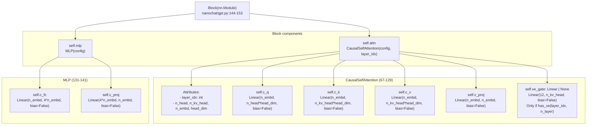

> [!WARNING]
> Imported from DeepWiki as generated, unverified repository documentation. Verify code-behavior claims against the revision below before stabilization.

# Model Architecture

<details>
<summary>Relevant source files</summary>

The following files were used as context for generating this wiki page:

- [nanochat/gpt.py](https://github.com/karpathy/nanochat/blob/92d63d4e8bb4df75c3b71618f31ddde2378b2bcd/nanochat/gpt.py)

</details>


The nanochat model is a decoder-only transformer implemented in the `GPT` class at [nanochat/gpt.py:156-425](https://github.com/karpathy/nanochat/blob/92d63d4e8bb4df75c3b71618f31ddde2378b2bcd/nanochat/gpt.py#L156-L425). The architecture includes several modern improvements: rotary embeddings, QK normalization, untied embeddings, value embeddings, per-layer residual scalars, and sliding window attention via Flash Attention 3.

This page provides a structural overview of the model architecture. For implementation details, see the child pages:
- **GPT Transformer Architecture** ([GPT Transformer Architecture](deepwiki-04-01-gpt-transformer-architecture.md)): Core `GPT` class, `Block` module, untied weights, and per-layer scalars.
- **Attention Mechanisms and Flash Attention** ([Attention Mechanisms and Flash Attention](deepwiki-04-02-attention-mechanisms-and-flash-attention.md)): `CausalSelfAttention` implementation, Flash Attention 3 integration, sliding windows, rotary embeddings, QK normalization, and KV cache.
- **Model Configuration and Weight Initialization** ([Model Configuration and Weight Initialization](deepwiki-04-03-model-configuration-and-weight-initialization.md)): `GPTConfig` dataclass, parameter initialization strategies, and the `init_weights` method.

## GPT Class Structure

The `GPT` class inherits from `nn.Module` and contains the following components defined in `__init__()`:

```mermaid
graph TB
    GPT["GPT(nn.Module)"]
    
    subgraph "self.transformer (nn.ModuleDict)"
        WTE["wte: nn.Embedding<br/>(padded_vocab_size, n_embd)"]
        H["h: nn.ModuleList<br/>[Block_0, Block_1, ..., Block_n_layer-1]"]
    end
    
    subgraph "Top-level modules"
        LMHead["self.lm_head<br/>nn.Linear(n_embd, padded_vocab_size, bias=False)"]
        ValueEmbeds["self.value_embeds<br/>nn.ModuleDict<br/>{str(i): nn.Embedding for alternating i}"]
    end
    
    subgraph "Learnable scalars"
        ResidLambdas["self.resid_lambdas<br/>nn.Parameter(shape=(n_layer,))"]
        X0Lambdas["self.x0_lambdas<br/>nn.Parameter(shape=(n_layer,))"]
    end
    
    subgraph "Buffers (non-persistent)"
        Cos["self.cos<br/>Precomputed rotary embeddings<br/>shape: (1, rotary_seq_len, 1, head_dim/2)"]
        Sin["self.sin<br/>Precomputed rotary embeddings<br/>shape: (1, rotary_seq_len, 1, head_dim/2)"]
    end
    
    subgraph "Configuration"
        Config["self.config: GPTConfig<br/>- sequence_len: int<br/>- vocab_size: int<br/>- n_layer: int<br/>- n_head: int<br/>- n_kv_head: int<br/>- n_embd: int<br/>- window_pattern: str"]
        WindowSizes["self.window_sizes: List[Tuple[int, int]]<br/>Per-layer (left, right) window sizes"]
    end
    
    GPT --> WTE
    GPT --> H
    GPT --> LMHead
    GPT --> ValueEmbeds
    GPT --> ResidLambdas
    GPT --> X0Lambdas
    GPT --> Cos
    GPT --> Sin
    GPT --> Config
    GPT --> WindowSizes
```



**GPT Class Structure Diagram**: The `GPT` class contains `self.transformer` (a `ModuleDict` with `wte` embedding and `h` list of blocks), `self.lm_head` for unembedding, `self.value_embeds` for alternating layers, per-layer scalar parameters (`resid_lambdas`, `x0_lambdas`), precomputed rotary embeddings as buffers, and configuration objects.

Sources: [nanochat/gpt.py:163-195](https://github.com/karpathy/nanochat/blob/92d63d4e8bb4df75c3b71618f31ddde2378b2bcd/nanochat/gpt.py#L163-L195)

## Block and Module Hierarchy

Each `Block` in `self.transformer.h` contains an attention layer and MLP:



**Block and Module Hierarchy Diagram**: Each `Block` contains `self.attn` (`CausalSelfAttention`) and `self.mlp` (`MLP`). The attention layer has Q/K/V projections (supporting GQA when `n_kv_head < n_head`), output projection `c_proj`, and optional `ve_gate` for value embeddings. The MLP has expansion layer `c_fc` (4× hidden dim) and projection `c_proj`. Note that `Linear` is a custom subclass that handles weight casting [nanochat/gpt.py:45-51](https://github.com/karpathy/nanochat/blob/92d63d4e8bb4df75c3b71618f31ddde2378b2bcd/nanochat/gpt.py#L45-L51).

Sources: [nanochat/gpt.py:144-153](https://github.com/karpathy/nanochat/blob/92d63d4e8bb4df75c3b71618f31ddde2378b2bcd/nanochat/gpt.py#L144-L153), [nanochat/gpt.py:67-129](https://github.com/karpathy/nanochat/blob/92d63d4e8bb4df75c3b71618f31ddde2378b2bcd/nanochat/gpt.py#L67-L129), [nanochat/gpt.py:131-141](https://github.com/karpathy/nanochat/blob/92d63d4e8bb4df75c3b71618f31ddde2378b2bcd/nanochat/gpt.py#L131-L141)

## Configuration

The `GPTConfig` dataclass at [nanochat/gpt.py:28-40](https://github.com/karpathy/nanochat/blob/92d63d4e8bb4df75c3b71618f31ddde2378b2bcd/nanochat/gpt.py#L28-L40) defines model hyperparameters:

| Field | Type | Default | Description |
|-------|------|---------|-------------|
| `sequence_len` | `int` | 2048 | Maximum sequence length for context window |
| `vocab_size` | `int` | 32768 | Vocabulary size (padded to multiple of 64 in `__init__`) |
| `n_layer` | `int` | 12 | Number of transformer blocks in `self.transformer.h` |
| `n_head` | `int` | 6 | Number of query heads |
| `n_kv_head` | `int` | 6 | Number of key/value heads (for Group-Query Attention) |
| `n_embd` | `int` | 768 | Embedding dimension |
| `window_pattern` | `str` | `"SSSL"` | Sliding window pattern: S=short (quarter context), L=long (full) |

**Group-Query Attention (GQA)**: When `n_kv_head < n_head`, multiple query heads share key/value projections [nanochat/gpt.py:76-79](https://github.com/karpathy/nanochat/blob/92d63d4e8bb4df75c3b71618f31ddde2378b2bcd/nanochat/gpt.py#L76-L79). This reduces KV cache memory during inference.

**Sliding Window Pattern**: The `window_pattern` string is tiled across layers. `"SSSL"` creates layers with windows `[Short, Short, Short, Long, ...]`. The final layer always uses full context [nanochat/gpt.py:36-39](https://github.com/karpathy/nanochat/blob/92d63d4e8bb4df75c3b71618f31ddde2378b2bcd/nanochat/gpt.py#L36-L39). The `_compute_window_sizes()` method at [nanochat/gpt.py:262-289](https://github.com/karpathy/nanochat/blob/92d63d4e8bb4df75c3b71618f31ddde2378b2bcd/nanochat/gpt.py#L262-L289) converts the pattern to `(left, right)` tuples for Flash Attention 3.

For details, see [Model Configuration and Weight Initialization](deepwiki-04-03-model-configuration-and-weight-initialization.md).

Sources: [nanochat/gpt.py:28-40](https://github.com/karpathy/nanochat/blob/92d63d4e8bb4df75c3b71618f31ddde2378b2bcd/nanochat/gpt.py#L28-L40), [nanochat/gpt.py:262-289](https://github.com/karpathy/nanochat/blob/92d63d4e8bb4df75c3b71618f31ddde2378b2bcd/nanochat/gpt.py#L262-L289)

## Forward Pass Flow

The `forward()` method at [nanochat/gpt.py:390-425](https://github.com/karpathy/nanochat/blob/92d63d4e8bb4df75c3b71618f31ddde2378b2bcd/nanochat/gpt.py#L390-L425) implements the forward pass:

```mermaid
graph TB
    Input["Input: idx (B, T)<br/>Optional: targets, kv_cache"]
    
    Embed["x = self.transformer.wte(idx)<br/>(B, T, n_embd)"]
    NormEmbed["x = norm(x)<br/>norm() calls F.rms_norm(x, (x.size(-1),))"]
    SaveX0["x0 = x<br/>Store initial embedding"]
    
    RotarySlice["T0 = kv_cache.get_pos() if kv_cache else 0<br/>cos_sin = (self.cos[:, T0:T0+T], self.sin[:, T0:T0+T])"]
    
    LoopStart["for i, block in enumerate(self.transformer.h):"]
    
    ResidMix["x = self.resid_lambdas[i] * x + self.x0_lambdas[i] * x0"]
    
    GetVE"ve = self.value_embeds[str(i) if str(i) in self.value_embeds else None"]
    
    BlockCall["x = block(x, ve, cos_sin, self.window_sizes[i], kv_cache)"]
    
    LoopEnd{{"Loop continues"}}
    
    NormFinal["x = norm(x)"]
    
    LMHeadProj["logits = self.lm_head(x)<br/>(B, T, padded_vocab_size)"]
    SliceVocab["logits = logits[..., :self.config.vocab_size]"]
    ToFloat["logits = logits.float()"]
    Softcap["softcap = 15<br/>logits = softcap * torch.tanh(logits / softcap)"]
    
    CheckTargets{"targets is not None?"}
    ComputeLoss["loss = F.cross_entropy(logits.view(-1, vocab_size),<br/>targets.view(-1), ignore_index=-1, reduction=loss_reduction)<br/>return loss"]
    ReturnLogits["return logits"]
    
    Input --> Embed
    Embed --> NormEmbed
    NormEmbed --> SaveX0
    SaveX0 --> RotarySlice
    RotarySlice --> LoopStart
    LoopStart --> ResidMix
    ResidMix --> GetVE
    GetVE --> BlockCall
    BlockCall --> LoopEnd
    LoopEnd -->|"i+1 < n_layer"| LoopStart
    LoopEnd -->|"Done"| NormFinal
    NormFinal --> LMHeadProj
    LMHeadProj --> SliceVocab
    SliceVocab --> ToFloat
    ToFloat --> Softcap
    Softcap --> CheckTargets
    CheckTargets -->|"Yes"| ComputeLoss
    CheckTargets -->|"No"| ReturnLogits
```

**Forward Pass Flow Diagram**: The `GPT.forward()` method performs token embedding, RMSNorm, saves `x0`, extracts rotary embeddings slice, loops through blocks with residual scaling, final norm, LM head projection, vocabulary slicing (removes padding), float conversion, softcap via `tanh`, and either returns loss (training) or logits (inference).

Each `Block.forward()` at [nanochat/gpt.py:150-153](https://github.com/karpathy/nanochat/blob/92d63d4e8bb4df75c3b71618f31ddde2378b2bcd/nanochat/gpt.py#L150-L153) applies pre-norm residual:
```python
x = x + self.attn(norm(x), ve, cos_sin, window_size, kv_cache)
x = x + self.mlp(norm(x))
```

Sources: [nanochat/gpt.py:390-425](https://github.com/karpathy/nanochat/blob/92d63d4e8bb4df75c3b71618f31ddde2378b2bcd/nanochat/gpt.py#L390-L425), [nanochat/gpt.py:150-153](https://github.com/karpathy/nanochat/blob/92d63d4e8bb4df75c3b71618f31ddde2378b2bcd/nanochat/gpt.py#L150-L153), [nanochat/gpt.py:42-44](https://github.com/karpathy/nanochat/blob/92d63d4e8bb4df75c3b71618f31ddde2378b2bcd/nanochat/gpt.py#L42-L44)

## Key Architectural Features

The model includes several modern architectural choices:

| Feature | Implementation | Purpose |
|---------|---------------|---------|
| **Positional Encoding** | Rotary embeddings (RoPE) via `apply_rotary_emb()` at [nanochat/gpt.py:57-65](https://github.com/karpathy/nanochat/blob/92d63d4e8bb4df75c3b71618f31ddde2378b2bcd/nanochat/gpt.py#L57-L65) | Relative position encoding, no learned parameters |
| **Attention Normalization** | QK normalization via `norm()` at [nanochat/gpt.py:102](https://github.com/karpathy/nanochat/blob/92d63d4e8bb4df75c3b71618f31ddde2378b2bcd/nanochat/gpt.py#L102) | Stabilizes training, prevents attention entropy collapse |
| **Attention Backend** | `flash_attn` module routes to FA3 or SDPA | Hardware-adaptive performance optimization |
| **Sliding Windows** | `window_pattern` in config, computed by `_compute_window_sizes()` | Reduces computational cost for long contexts |
| **Untied Embeddings** | Separate `wte` and `lm_head` weights | Independent optimization of input/output embeddings |
| **Activation** | ReLU² (`F.relu(x).square()`) at [nanochat/gpt.py:139](https://github.com/karpathy/nanochat/blob/92d63d4e8bb4df75c3b71618f31ddde2378b2bcd/nanochat/gpt.py#L139) | Squared ReLU in MLP feedforward |
| **Normalization** | RMSNorm via `norm()` function, no learnable params | Simplified normalization using `F.rms_norm()` [nanochat/gpt.py:42-43](https://github.com/karpathy/nanochat/blob/92d63d4e8bb4df75c3b71618f31ddde2378b2bcd/nanochat/gpt.py#L42-L43) |
| **Bias Terms** | All `Linear(..., bias=False)` | Reduces parameter count |
| **Value Embeddings** | Alternating layers via `has_ve()` at [nanochat/gpt.py:53-55](https://github.com/karpathy/nanochat/blob/92d63d4e8bb4df75c3b71618f31ddde2378b2bcd/nanochat/gpt.py#L53-L55) | Adds model capacity with minimal FLOPs |
| **Per-Layer Scalars** | `resid_lambdas` and `x0_lambdas` parameters | Learnable residual stream routing [nanochat/gpt.py:403](https://github.com/karpathy/nanochat/blob/92d63d4e8bb4df75c3b71618f31ddde2378b2bcd/nanochat/gpt.py#L403) |
| **Logit Softcapping** | `15 * tanh(logits / 15)` at [nanochat/gpt.py:416](https://github.com/karpathy/nanochat/blob/92d63d4e8bb4df75c3b71618f31ddde2378b2bcd/nanochat/gpt.py#L416) | Bounds logits to prevent training instability |

For details, see [GPT Transformer Architecture](deepwiki-04-01-gpt-transformer-architecture.md) and [Attention Mechanisms and Flash Attention](deepwiki-04-02-attention-mechanisms-and-flash-attention.md).

Sources: [nanochat/gpt.py:1-13](https://github.com/karpathy/nanochat/blob/92d63d4e8bb4df75c3b71618f31ddde2378b2bcd/nanochat/gpt.py#L1-L13), [nanochat/gpt.py:42-65](https://github.com/karpathy/nanochat/blob/92d63d4e8bb4df75c3b71618f31ddde2378b2bcd/nanochat/gpt.py#L42-L65), [nanochat/gpt.py:102](https://github.com/karpathy/nanochat/blob/92d63d4e8bb4df75c3b71618f31ddde2378b2bcd/nanochat/gpt.py#L102), [nanochat/gpt.py:139](https://github.com/karpathy/nanochat/blob/92d63d4e8bb4df75c3b71618f31ddde2378b2bcd/nanochat/gpt.py#L139), [nanochat/gpt.py:416](https://github.com/karpathy/nanochat/blob/92d63d4e8bb4df75c3b71618f31ddde2378b2bcd/nanochat/gpt.py#L416)

## Parameter Counting and FLOPs Estimation

The model provides methods for analyzing computational cost and parameter distribution:

**Parameter Counting**: The `num_scaling_params()` method at [nanochat/gpt.py:321-348](https://github.com/karpathy/nanochat/blob/92d63d4e8bb4df75c3b71618f31ddde2378b2bcd/nanochat/gpt.py#L321-L348) returns a dictionary with parameter counts for different groups, enabling scaling law analysis using different parameter counting conventions.

**FLOPs Estimation**: The `estimate_flops()` method at [nanochat/gpt.py:294-319](https://github.com/karpathy/nanochat/blob/92d63d4e8bb4df75c3b71618f31ddde2378b2bcd/nanochat/gpt.py#L294-L319) computes FLOPs per token for forward + backward pass, accounting for both matmuls and attention (with sliding window adjustments).

Sources: [nanochat/gpt.py:294-319](https://github.com/karpathy/nanochat/blob/92d63d4e8bb4df75c3b71618f31ddde2378b2bcd/nanochat/gpt.py#L294-L319), [nanochat/gpt.py:321-348](https://github.com/karpathy/nanochat/blob/92d63d4e8bb4df75c3b71618f31ddde2378b2bcd/nanochat/gpt.py#L321-L348)

## Optimizer Setup

The `setup_optimizer()` method at [nanochat/gpt.py:350-388](https://github.com/karpathy/nanochat/blob/92d63d4e8bb4df75c3b71618f31ddde2378b2bcd/nanochat/gpt.py#L350-L388) implements a hybrid optimization strategy that groups parameters by type, using Muon for 2D matrices and AdamW for embeddings and scalars.

For details on the optimizer implementation and parameter grouping, see [Model Configuration and Weight Initialization](deepwiki-04-03-model-configuration-and-weight-initialization.md).

Sources: [nanochat/gpt.py:350-388](https://github.com/karpathy/nanochat/blob/92d63d4e8bb4df75c3b71618f31ddde2378b2bcd/nanochat/gpt.py#L350-L388)
