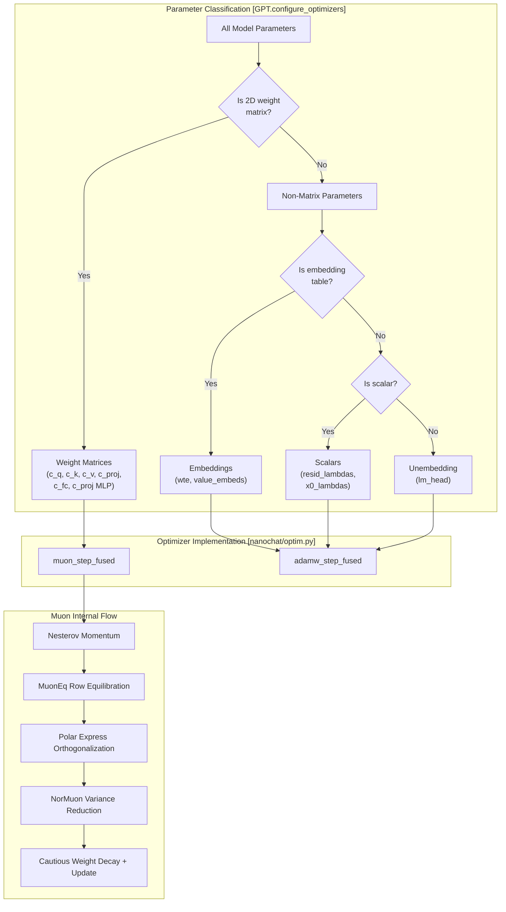
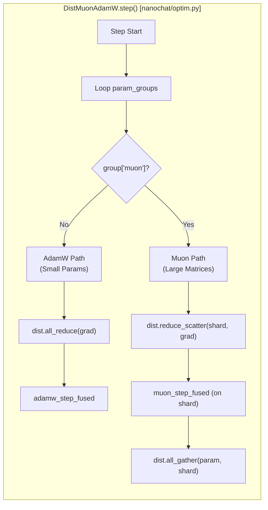

> [!WARNING]
> Imported from DeepWiki as generated, unverified repository documentation. Verify code-behavior claims against the revision below before stabilization.

# MuonAdamW Hybrid Optimizer

Relevant source files

The following files were used as context for generating this wiki page:

- [nanochat/gpt.py](https://github.com/karpathy/nanochat/blob/92d63d4e8bb4df75c3b71618f31ddde2378b2bcd/nanochat/gpt.py)
- [nanochat/optim.py](https://github.com/karpathy/nanochat/blob/92d63d4e8bb4df75c3b71618f31ddde2378b2bcd/nanochat/optim.py)

## Purpose and Scope

This page documents the `MuonAdamW` optimizer, nanochat's hybrid optimization strategy that applies different algorithms to different parameter types. The optimizer uses preconditioned momentum with orthogonalization for weight matrices and standard AdamW for embeddings and scalar parameters. This page focuses on the core architectural design, the fused kernel implementations, and the key algorithmic components.

**Sources:** [nanochat/optim.py:1-10](https://github.com/karpathy/nanochat/blob/92d63d4e8bb4df75c3b71618f31ddde2378b2bcd/nanochat/optim.py#L1-L10), [nanochat/gpt.py:356-394](https://github.com/karpathy/nanochat/blob/92d63d4e8bb4df75c3b71618f31ddde2378b2bcd/nanochat/gpt.py#L356-L394), [dev/LOG.md:951-1007](https://github.com/karpathy/nanochat/blob/92d63d4e8bb4df75c3b71618f31ddde2378b2bcd/dev/LOG.md#L951-L1007)

## Hybrid Optimizer Design

The `MuonAdamW` optimizer implements a two-path strategy based on parameter geometry. The classification happens in `GPT.configure_optimizers()` which separates all parameters into distinct groups before passing them to the optimizer factory.

| Parameter Type | Algorithm | Rationale |
|---------------|-----------|-----------|
| **Weight matrices** (Attention, MLP) | Muon with Polar Express | Matrices benefit from preconditioned momentum that respects the manifold structure. |
| **Embeddings** (token, value) | AdamW | Large embedding tables lack geometric structure; standard adaptive methods work well. |
| **Scalars** (lambdas) | AdamW | Few parameters, simple optimization is sufficient. |
| **lm_head** | AdamW | Classification layer behaves differently from internal weights. |

**Diagram: MuonAdamW Parameter Classification and Code Entry Points**

**Sources:** [nanochat/optim.py:152-160](https://github.com/karpathy/nanochat/blob/92d63d4e8bb4df75c3b71618f31ddde2378b2bcd/nanochat/optim.py#L152-L160), [nanochat/gpt.py:356-394](https://github.com/karpathy/nanochat/blob/92d63d4e8bb4df75c3b71618f31ddde2378b2bcd/nanochat/gpt.py#L356-L394), [dev/LOG.md:951-1007](https://github.com/karpathy/nanochat/blob/92d63d4e8bb4df75c3b71618f31ddde2378b2bcd/dev/LOG.md#L951-L1007)

## Muon Path: Matrix Parameters

The Muon path applies to all 2D weight matrices. It uses a single fused kernel, `muon_step_fused`, which is decorated with `@torch.compile` to eliminate Python overhead between operations [nanochat/optim.py:111-112](https://github.com/karpathy/nanochat/blob/92d63d4e8bb4df75c3b71618f31ddde2378b2bcd/nanochat/optim.py#L111-L112).

### Nesterov Momentum
Muon uses Nesterov momentum where the gradient `g` is updated using a look-ahead step:
- `momentum_buffer.lerp_(stacked_grads, 1 - momentum)` [nanochat/optim.py:132](https://github.com/karpathy/nanochat/blob/92d63d4e8bb4df75c3b71618f31ddde2378b2bcd/nanochat/optim.py#L132)
- `g = stacked_grads.lerp_(momentum_buffer, momentum)` [nanochat/optim.py:133](https://github.com/karpathy/nanochat/blob/92d63d4e8bb4df75c3b71618f31ddde2378b2bcd/nanochat/optim.py#L133)

### MuonEq Row Equilibration
Before orthogonalization, the optimizer performs **MuonEq row equilibration**. This rescales each row to the mean row norm so the spectrum entering orthogonalization is better conditioned [nanochat/optim.py:89-90](https://github.com/karpathy/nanochat/blob/92d63d4e8bb4df75c3b71618f31ddde2378b2bcd/nanochat/optim.py#L89-L90).
- `target = X.float().norm(dim=(-2, -1), keepdim=True) / (X.size(-2) ** 0.5)` [nanochat/optim.py:139](https://github.com/karpathy/nanochat/blob/92d63d4e8bb4df75c3b71618f31ddde2378b2bcd/nanochat/optim.py#L139)
- `row_norm = X.float().norm(dim=-1, keepdim=True).clamp_min(1e-6)` [nanochat/optim.py:140](https://github.com/karpathy/nanochat/blob/92d63d4e8bb4df75c3b71618f31ddde2378b2bcd/nanochat/optim.py#L140)
- `X = X * (target / row_norm).to(X.dtype)` [nanochat/optim.py:141](https://github.com/karpathy/nanochat/blob/92d63d4e8bb4df75c3b71618f31ddde2378b2bcd/nanochat/optim.py#L141)

### Polar Express Orthogonalization
**Polar Express** is the core preconditioning mechanism that projects gradient updates onto the orthogonal group. It replaces the Newton-Schulz iteration used in earlier versions [nanochat/optim.py:79-82](https://github.com/karpathy/nanochat/blob/92d63d4e8bb4df75c3b71618f31ddde2378b2bcd/nanochat/optim.py#L79-L82). The algorithm computes the orthogonal polar factor through iterative sign matrix computation using five pre-computed coefficient tuples `polar_express_coeffs` [nanochat/optim.py:102-108](https://github.com/karpathy/nanochat/blob/92d63d4e8bb4df75c3b71618f31ddde2378b2bcd/nanochat/optim.py#L102-L108).

The implementation handles both "Tall" and "Wide" matrices by checking the dimension size:
- **Tall Matrix:** `X.mT @ X` [nanochat/optim.py:154-158](https://github.com/karpathy/nanochat/blob/92d63d4e8bb4df75c3b71618f31ddde2378b2bcd/nanochat/optim.py#L154-L158)
- **Wide Matrix:** `X @ X.mT` [nanochat/optim.py:159-163](https://github.com/karpathy/nanochat/blob/92d63d4e8bb4df75c3b71618f31ddde2378b2bcd/nanochat/optim.py#L159-L163)

### NorMuon Variance Reduction
**NorMuon** adds per-neuron/column adaptive learning rate scaling. It maintains a `second_momentum_buffer` tracking the squared gradients along the reduction dimension `red_dim` [nanochat/optim.py:84-86](https://github.com/karpathy/nanochat/blob/92d63d4e8bb4df75c3b71618f31ddde2378b2bcd/nanochat/optim.py#L84-L86).
- It updates the buffer with `beta2_t` using `lerp_` [nanochat/optim.py:172](https://github.com/karpathy/nanochat/blob/92d63d4e8bb4df75c3b71618f31ddde2378b2bcd/nanochat/optim.py#L172).
- It computes a `final_scale` to normalize update scales after orthogonalization [nanochat/optim.py:173-176](https://github.com/karpathy/nanochat/blob/92d63d4e8bb4df75c3b71618f31ddde2378b2bcd/nanochat/optim.py#L173-L176).

### Cautious Weight Decay
**Cautious weight decay** modifies standard L2 regularization to only decay weights when the gradient and weight have the same sign:
- `mask = (g * stacked_params) >= 0` [nanochat/optim.py:182](https://github.com/karpathy/nanochat/blob/92d63d4e8bb4df75c3b71618f31ddde2378b2bcd/nanochat/optim.py#L182)
- The update then applies: `stacked_params.sub_(lr * g + lr * wd * stacked_params * mask)` [nanochat/optim.py:183](https://github.com/karpathy/nanochat/blob/92d63d4e8bb4df75c3b71618f31ddde2378b2bcd/nanochat/optim.py#L183).

**Sources:** [nanochat/optim.py:111-184](https://github.com/karpathy/nanochat/blob/92d63d4e8bb4df75c3b71618f31ddde2378b2bcd/nanochat/optim.py#L111-L184), [dev/LOG.md:957-983](https://github.com/karpathy/nanochat/blob/92d63d4e8bb4df75c3b71618f31ddde2378b2bcd/dev/LOG.md#L957-L983)

## AdamW Path: Embeddings and Scalars

The AdamW path handles parameters without geometric structure using `adamw_step_fused`. This kernel implements the standard AdamW algorithm with a decoupled weight decay applied before the momentum update [nanochat/optim.py:19-21](https://github.com/karpathy/nanochat/blob/92d63d4e8bb4df75c3b71618f31ddde2378b2bcd/nanochat/optim.py#L19-L21).

| Step | Operation | Code Reference |
|------|-----------|----------------|
| 1 | Weight Decay | `p32.mul_(1 - lr_t * wd_t)` [nanochat/optim.py:49](https://github.com/karpathy/nanochat/blob/92d63d4e8bb4df75c3b71618f31ddde2378b2bcd/nanochat/optim.py#L49) |
| 2 | Momentum Update | `exp_avg32.lerp_(grad32, 1 - beta1_t)` [nanochat/optim.py:51](https://github.com/karpathy/nanochat/blob/92d63d4e8bb4df75c3b71618f31ddde2378b2bcd/nanochat/optim.py#L51) |
| 3 | Variance Update | `exp_avg_sq32.lerp_(grad32.square(), 1 - beta2_t)` [nanochat/optim.py:52](https://github.com/karpathy/nanochat/blob/92d63d4e8bb4df75c3b71618f31ddde2378b2bcd/nanochat/optim.py#L52) |
| 4 | Bias Correction | `bias1 = 1 - beta1_t ** step_t` [nanochat/optim.py:54-55](https://github.com/karpathy/nanochat/blob/92d63d4e8bb4df75c3b71618f31ddde2378b2bcd/nanochat/optim.py#L54-L55) |
| 5 | Param Update | `p32.add_(exp_avg32 / denom, alpha=-step_size)` [nanochat/optim.py:59](https://github.com/karpathy/nanochat/blob/92d63d4e8bb4df75c3b71618f31ddde2378b2bcd/nanochat/optim.py#L59) |

**Sources:** [nanochat/optim.py:24-64](https://github.com/karpathy/nanochat/blob/92d63d4e8bb4df75c3b71618f31ddde2378b2bcd/nanochat/optim.py#L24-L64)

## Implementation Classes

### MuonAdamW (Single GPU)
The `MuonAdamW` class manages the state for both AdamW and Muon parameters.
- It initializes state buffers (momentum, exp_avg, etc.) for each parameter [nanochat/optim.py:215-245](https://github.com/karpathy/nanochat/blob/92d63d4e8bb4df75c3b71618f31ddde2378b2bcd/nanochat/optim.py#L215-L245).
- The `step()` function iterates through `param_groups`. If a group has `muon=True`, it calls `muon_step_fused`; otherwise, it calls `adamw_step_fused` [nanochat/optim.py:263-297](https://github.com/karpathy/nanochat/blob/92d63d4e8bb4df75c3b71618f31ddde2378b2bcd/nanochat/optim.py#L263-L297).

### DistMuonAdamW (Distributed)
The `DistMuonAdamW` class is optimized for Multi-GPU training using `torch.distributed`.
- **Large Parameters (Muon):** It uses `dist.reduce_scatter` to sum gradients across ranks into a shard, performs the update on the shard, and then `dist.all_gather` to synchronize the updated parameters [nanochat/optim.py:473-485](https://github.com/karpathy/nanochat/blob/92d63d4e8bb4df75c3b71618f31ddde2378b2bcd/nanochat/optim.py#L473-L485).
- **Small Parameters (AdamW):** It uses `dist.all_reduce` to synchronize gradients across all ranks before performing the local update [nanochat/optim.py:458-466](https://github.com/karpathy/nanochat/blob/92d63d4e8bb4df75c3b71618f31ddde2378b2bcd/nanochat/optim.py#L458-L466).

**Diagram: Distributed Step Logic in DistMuonAdamW**

**Sources:** [nanochat/optim.py:187-299](https://github.com/karpathy/nanochat/blob/92d63d4e8bb4df75c3b71618f31ddde2378b2bcd/nanochat/optim.py#L187-L299), [nanochat/optim.py:302-498](https://github.com/karpathy/nanochat/blob/92d63d4e8bb4df75c3b71618f31ddde2378b2bcd/nanochat/optim.py#L302-L498)

## Evolution and Design History

The MuonAdamW optimizer is the result of extensive experimentation documented in `dev/LOG.md`:

*   **Polar Express Adoption:** Replaced Newton-Schulz iteration with the Polar Express Sign Method to improve convergence properties [dev/LOG.md:957-961](https://github.com/karpathy/nanochat/blob/92d63d4e8bb4df75c3b71618f31ddde2378b2bcd/dev/LOG.md#L957-L961).
*   **NorMuon Integration:** Added per-neuron/column adaptive learning rate to normalize update scales after orthogonalization [dev/LOG.md:963-968](https://github.com/karpathy/nanochat/blob/92d63d4e8bb4df75c3b71618f31ddde2378b2bcd/dev/LOG.md#L963-L968).
*   **Cautious Weight Decay:** Implemented selective decay that only applies when update and weight have the same sign, improving stability [dev/LOG.md:970-983](https://github.com/karpathy/nanochat/blob/92d63d4e8bb4df75c3b71618f31ddde2378b2bcd/dev/LOG.md#L970-L983).
*   **MuonEq & Muon+:** Integrated row equilibration and Frobenius norm snapping to correct for under-convergence [nanochat/optim.py:88-92](https://github.com/karpathy/nanochat/blob/92d63d4e8bb4df75c3b71618f31ddde2378b2bcd/nanochat/optim.py#L88-L92).
*   **Weight Decay Scaling Law:** Found that weight decay should scale as **WD ∝ 1/width²** for optimal transfer across scales [dev/LOG.md:320-338](https://github.com/karpathy/nanochat/blob/92d63d4e8bb4df75c3b71618f31ddde2378b2bcd/dev/LOG.md#L320-L338).

**Sources:** [dev/LOG.md:951-1007](https://github.com/karpathy/nanochat/blob/92d63d4e8bb4df75c3b71618f31ddde2378b2bcd/dev/LOG.md#L951-L1007), [dev/LOG.md:320-338](https://github.com/karpathy/nanochat/blob/92d63d4e8bb4df75c3b71618f31ddde2378b2bcd/dev/LOG.md#L320-L338), [nanochat/optim.py:88-92](https://github.com/karpathy/nanochat/blob/92d63d4e8bb4df75c3b71618f31ddde2378b2bcd/nanochat/optim.py#L88-L92)
