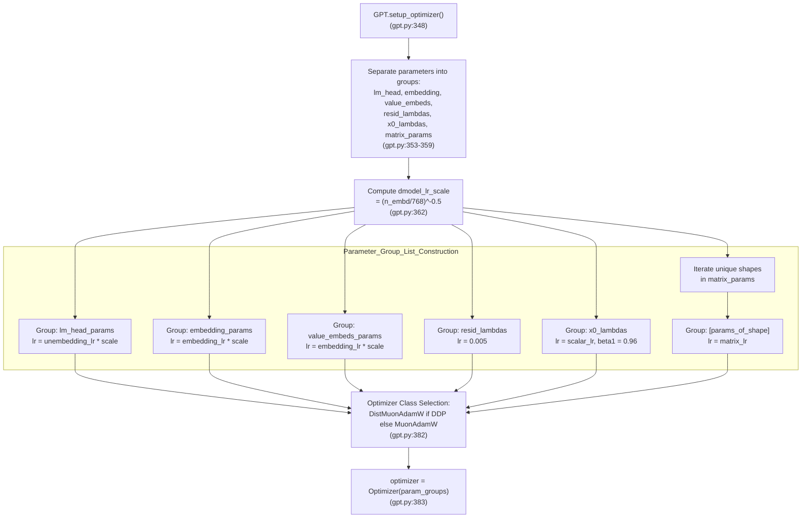

> [!WARNING]
> Imported from DeepWiki as generated, unverified repository documentation. Verify code-behavior claims against the revision below before stabilization.

# Parameter Groups and Learning Rate Scaling

<details>
<summary>Relevant source files</summary>

The following files were used as context for generating this wiki page:

- [nanochat/optim.py](https://github.com/karpathy/nanochat/blob/92d63d4e8bb4df75c3b71618f31ddde2378b2bcd/nanochat/optim.py)
- [scripts/base_train.py](https://github.com/karpathy/nanochat/blob/92d63d4e8bb4df75c3b71618f31ddde2378b2bcd/scripts/base_train.py)

</details>


This page documents how nanochat divides model parameters into groups and applies differentiated learning rates to each group. The hybrid optimizer strategy uses AdamW for embeddings and scalars, and Muon for matrix parameters, with each group receiving carefully tuned learning rate scaling factors.

For information about the optimizer algorithms themselves (Muon vs AdamW), see 5.1 MuonAdamW Hybrid Optimizer. For learning rate schedules over time, see 5.4 Learning Rate and Weight Decay Schedules.

## Parameter Grouping Strategy

The model parameters are separated into six distinct groups based on their role and shape characteristics. This logic is implemented in `GPT.setup_optimizer` [nanochat/gpt.py:348-386](https://github.com/karpathy/nanochat/blob/92d63d4e8bb4df75c3b71618f31ddde2378b2bcd/nanochat/gpt.py#L348-L386).

| Parameter Group | Description | Optimizer | Base LR | Notes |
|----------------|-------------|-----------|---------|-------|
| `lm_head_params` | Output projection to vocabulary | AdamW | 0.008 | Untied from input embedding [nanochat/gpt.py:175-177](https://github.com/karpathy/nanochat/blob/92d63d4e8bb4df75c3b71618f31ddde2378b2bcd/nanochat/gpt.py#L175-L177), [scripts/base_train.py:63](https://github.com/karpathy/nanochat/blob/92d63d4e8bb4df75c3b71618f31ddde2378b2bcd/scripts/base_train.py#L63) |
| `embedding_params` | Token embedding (`wte`) | AdamW | 0.3 | High LR for rapid adaptation [nanochat/gpt.py:365](https://github.com/karpathy/nanochat/blob/92d63d4e8bb4df75c3b71618f31ddde2378b2bcd/nanochat/gpt.py#L365), [scripts/base_train.py:62](https://github.com/karpathy/nanochat/blob/92d63d4e8bb4df75c3b71618f31ddde2378b2bcd/scripts/base_train.py#L62) |
| `value_embeds_params` | Value embeddings (ResFormer) | AdamW | 0.3 | Same as token embeddings [nanochat/gpt.py:367](https://github.com/karpathy/nanochat/blob/92d63d4e8bb4df75c3b71618f31ddde2378b2bcd/nanochat/gpt.py#L367) |
| `resid_lambdas` | Per-layer residual scalars | AdamW | 0.005 | Multiplicative: needs low LR [nanochat/gpt.py:371](https://github.com/karpathy/nanochat/blob/92d63d4e8bb4df75c3b71618f31ddde2378b2bcd/nanochat/gpt.py#L371) |
| `x0_lambdas` | Per-layer x0 skip scalars | AdamW | 0.5 | Additive: can tolerate higher LR [nanochat/gpt.py:372](https://github.com/karpathy/nanochat/blob/92d63d4e8bb4df75c3b71618f31ddde2378b2bcd/nanochat/gpt.py#L372) |
| `matrix_params` | All transformer weights | Muon | 0.02 | Grouped by shape for efficiency [nanochat/gpt.py:375-380](https://github.com/karpathy/nanochat/blob/92d63d4e8bb4df75c3b71618f31ddde2378b2bcd/nanochat/gpt.py#L375-L380), [scripts/base_train.py:65](https://github.com/karpathy/nanochat/blob/92d63d4e8bb4df75c3b71618f31ddde2378b2bcd/scripts/base_train.py#L65) |

Matrix parameters are further subdivided by shape to enable efficient stacking in the optimizer.

**Diagram: Parameter Groups and Optimizer Assignment**

```mermaid
graph TB
    subgraph "GPT_Model_Parameters"
        WTE["wte: (vocab_size, n_embd)"]
        LMHEAD["lm_head: (vocab_size, n_embd)"]
        VE["value_embeds: (vocab_size, kv_dim)"]
        RESID["resid_lambdas: (n_layer,)"]
        X0["x0_lambdas: (n_layer,)"]

        subgraph "Transformer_Matrix_Params"
            CQ["c_q: (n_embd, n_head*head_dim)"]
            CK["c_k: (n_embd, n_kv_head*head_dim)"]
            CV["c_v: (n_embd, n_kv_head*head_dim)"]
            CPROJ_A["c_proj (attn): (n_embd, n_embd)"]
            CFC["c_fc: (n_embd, 4*n_embd)"]
            CPROJ_M["c_proj (mlp): (4*n_embd, n_embd)"]
        end
    end

    subgraph "MuonAdamW_Groups"
        ADAMW1["AdamW Group 1<br/>lr=0.008*scale<br/>lm_head_params"]
        ADAMW2["AdamW Group 2<br/>lr=0.3*scale<br/>embedding_params"]
        ADAMW3["AdamW Group 3<br/>lr=0.3*scale<br/>value_embeds_params"]
        ADAMW4["AdamW Group 4<br/>lr=0.005<br/>resid_params"]
        ADAMW5["AdamW Group 5<br/>lr=0.5, beta1=0.96<br/>x0_params"]

        subgraph "Muon_Groups_by_Shape"
            MUON1["Muon Group<br/>shape=(768,768)<br/>lr=0.02*shape_scale"]
            MUON2["Muon Group<br/>shape=(768,3072)<br/>lr=0.02*shape_scale"]
            MUON3["Muon Group<br/>shape=(3072,768)<br/>lr=0.02*shape_scale"]
        end
    end

    LMHEAD --> ADAMW1
    WTE --> ADAMW2
    VE --> ADAMW3
    RESID --> ADAMW4
    X0 --> ADAMW5

    CQ --> MUON1
    CK --> MUON1
    CV --> MUON1
    CPROJ_A --> MUON1

    CFC --> MUON2
    CPROJ_M --> MUON3
```


Sources: [nanochat/gpt.py:348-386](https://github.com/karpathy/nanochat/blob/92d63d4e8bb4df75c3b71618f31ddde2378b2bcd/nanochat/gpt.py#L348-L386), [nanochat/gpt.py:65-80](https://github.com/karpathy/nanochat/blob/92d63d4e8bb4df75c3b71618f31ddde2378b2bcd/nanochat/gpt.py#L65-L80), [nanochat/gpt.py:129-133](https://github.com/karpathy/nanochat/blob/92d63d4e8bb4df75c3b71618f31ddde2378b2bcd/nanochat/gpt.py#L129-L133), [scripts/base_train.py:62-66](https://github.com/karpathy/nanochat/blob/92d63d4e8bb4df75c3b71618f31ddde2378b2bcd/scripts/base_train.py#L62-L66)

## Model Dimension Scaling

All AdamW groups (embeddings, lm_head, scalars) apply a learning rate scaling factor inversely proportional to the square root of the model dimension:

```python
dmodel_lr_scale = (model_dim / 768) ** -0.5
```

This scaling ensures that as models grow wider, the effective learning rate decreases proportionally. The reference point is 768 dimensions (the d12 model width) [nanochat/gpt.py:361-363](https://github.com/karpathy/nanochat/blob/92d63d4e8bb4df75c3b71618f31ddde2378b2bcd/nanochat/gpt.py#L361-L363).

| Model | Width (`n_embd`) | Scale Factor | Effect |
|-------|------------------|--------------|--------|
| d8 | 512 | 1.22 | +22% LR |
| d12 | 768 | 1.00 | baseline |
| d16 | 1024 | 0.86 | -14% LR |
| d20 | 1280 | 0.77 | -23% LR |

The scaling is applied in `GPT.setup_optimizer` [nanochat/gpt.py:361-363](https://github.com/karpathy/nanochat/blob/92d63d4e8bb4df75c3b71618f31ddde2378b2bcd/nanochat/gpt.py#L361-L363). Matrix parameters (Muon groups) do **not** use this scaling; they utilize a shape-based scaling mechanism instead.

Sources: [nanochat/gpt.py:361-363](https://github.com/karpathy/nanochat/blob/92d63d4e8bb4df75c3b71618f31ddde2378b2bcd/nanochat/gpt.py#L361-L363)

## Shape-Based Learning Rate for Matrix Parameters

Matrix parameters in Muon groups receive an additional learning rate multiplier based on their shape. The multiplier boosts the learning rate for "tall" matrices (more rows than columns):

```python
lr_multiplier = max(1.0, rows / cols) ** 0.5
```

**Rationale**: Tall matrices like `c_fc` (e.g., 768 → 3072) project from a smaller space to a larger space. The square root of the aspect ratio provides a geometric mean scaling that balances update magnitudes across different projection directions [nanochat/optim.py:263](https://github.com/karpathy/nanochat/blob/92d63d4e8bb4df75c3b71618f31ddde2378b2bcd/nanochat/optim.py#L263).

**Examples for d12 model (768-dim)**:

| Layer | Shape | Aspect Ratio | LR Multiplier | Effective LR |
|-------|-------|--------------|---------------|--------------|
| `c_q`, `c_k`, `c_v` | (768, 768) | 1.0 | 1.0 | 0.02 |
| `c_proj` (attn) | (768, 768) | 1.0 | 1.0 | 0.02 |
| `c_fc` | (768, 3072) | 4.0 | 2.0 | 0.04 |
| `c_proj` (mlp) | (3072, 768) | 0.25 | 1.0 | 0.02 |

The tall matrix `c_fc` gets 2× higher learning rate, while the wide matrix `c_proj` (mlp) gets no boost (clamped to 1.0). This scaling is applied inside the `MuonAdamW` and `DistMuonAdamW` optimizers during the step update [nanochat/optim.py:263](https://github.com/karpathy/nanochat/blob/92d63d4e8bb4df75c3b71618f31ddde2378b2bcd/nanochat/optim.py#L263), [nanochat/optim.py:488](https://github.com/karpathy/nanochat/blob/92d63d4e8bb4df75c3b71618f31ddde2378b2bcd/nanochat/optim.py#L488).

Sources: [nanochat/optim.py:263](https://github.com/karpathy/nanochat/blob/92d63d4e8bb4df75c3b71618f31ddde2378b2bcd/nanochat/optim.py#L263), [nanochat/optim.py:488](https://github.com/karpathy/nanochat/blob/92d63d4e8bb4df75c3b71618f31ddde2378b2bcd/nanochat/optim.py#L488)

## Complete Parameter Group Setup

The `setup_optimizer` method in [nanochat/gpt.py:348-386](https://github.com/karpathy/nanochat/blob/92d63d4e8bb4df75c3b71618f31ddde2378b2bcd/nanochat/gpt.py#L348-L386) assembles all parameter groups with their learning rates and optimizer assignments:

**Diagram: setup_optimizer Data Flow**


Sources: [nanochat/gpt.py:348-386](https://github.com/karpathy/nanochat/blob/92d63d4e8bb4df75c3b71618f31ddde2378b2bcd/nanochat/gpt.py#L348-L386), [scripts/base_train.py:62-66](https://github.com/karpathy/nanochat/blob/92d63d4e8bb4df75c3b71618f31ddde2378b2bcd/scripts/base_train.py#L62-L66)

## Special Cases and Design Decisions

### Why Different LRs for Scalars?

The two scalar parameter groups have very different learning rates:

- **`resid_lambdas` (0.005)**: These are multiplicative scalars that scale the residual stream [nanochat/gpt.py:228-229](https://github.com/karpathy/nanochat/blob/92d63d4e8bb4df75c3b71618f31ddde2378b2bcd/nanochat/gpt.py#L228-L229). Small changes compound through layers, so a low learning rate prevents instability [nanochat/gpt.py:371](https://github.com/karpathy/nanochat/blob/92d63d4e8bb4df75c3b71618f31ddde2378b2bcd/nanochat/gpt.py#L371).
- **`x0_lambdas` (0.5)**: These are additive scalars that blend in the initial embedding [nanochat/gpt.py:230](https://github.com/karpathy/nanochat/blob/92d63d4e8bb4df75c3b71618f31ddde2378b2bcd/nanochat/gpt.py#L230). Adding a fraction of `x0` is more forgiving, allowing a higher learning rate. Additionally, they use `beta1=0.96` (higher than the default 0.8) for smoother momentum [nanochat/gpt.py:372](https://github.com/karpathy/nanochat/blob/92d63d4e8bb4df75c3b71618f31ddde2378b2bcd/nanochat/gpt.py#L372).

### Why Group Muon Params by Shape?

Muon's optimization algorithm operates on stacked tensors for efficiency [nanochat/optim.py:112-123](https://github.com/karpathy/nanochat/blob/92d63d4e8bb4df75c3b71618f31ddde2378b2bcd/nanochat/optim.py#L112-L123). All parameters in a Muon group must have identical shapes so they can be stacked into a single 3D tensor [nanochat/gpt.py:375-380](https://github.com/karpathy/nanochat/blob/92d63d4e8bb4df75c3b71618f31ddde2378b2bcd/nanochat/gpt.py#L375-L380). This enables the optimizer to process all parameters of a given shape in a single batched kernel call, significantly improving throughput on modern GPUs.

Sources: [nanochat/gpt.py:371-372](https://github.com/karpathy/nanochat/blob/92d63d4e8bb4df75c3b71618f31ddde2378b2bcd/nanochat/gpt.py#L371-L372), [nanochat/gpt.py:375-380](https://github.com/karpathy/nanochat/blob/92d63d4e8bb4df75c3b71618f31ddde2378b2bcd/nanochat/gpt.py#L375-L380), [nanochat/optim.py:112-123](https://github.com/karpathy/nanochat/blob/92d63d4e8bb4df75c3b71618f31ddde2378b2bcd/nanochat/optim.py#L112-L123)
