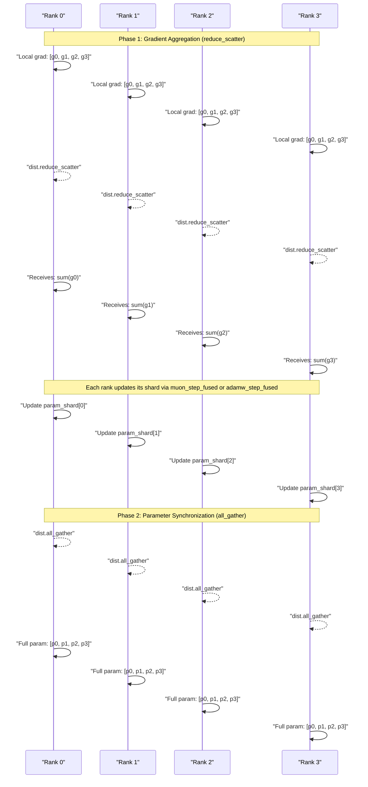
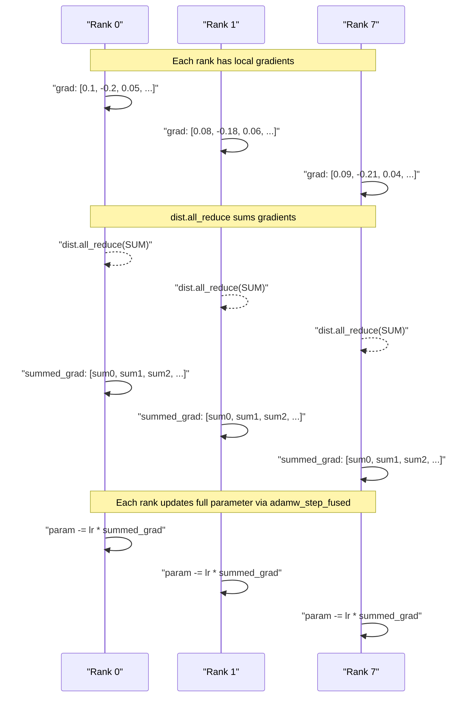
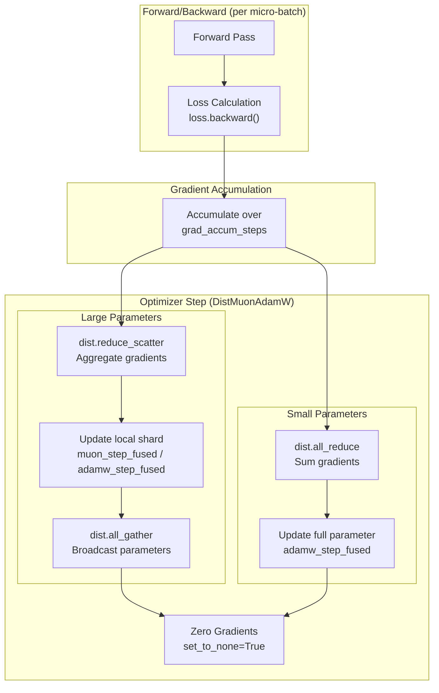

> [!WARNING]
> Imported from DeepWiki as generated, unverified repository documentation. Verify code-behavior claims against the revision below before stabilization.

# Distributed Optimizer (DistMuonAdamW)

Relevant source files

The following files were used as context for generating this wiki page:

- [nanochat/optim.py](https://github.com/karpathy/nanochat/blob/92d63d4e8bb4df75c3b71618f31ddde2378b2bcd/nanochat/optim.py)

The `DistMuonAdamW` optimizer implements a distributed version of the hybrid MuonAdamW optimizer for data-parallel training across multiple GPUs. It employs a two-tier communication strategy: large parameters (weight matrices) use `reduce_scatter`/`all_gather` for memory-efficient gradient aggregation and parameter synchronization, while small parameters (scalars, small embeddings) use `all_reduce` to avoid the `world_size` divisibility requirement.

For details on the hybrid MuonAdamW optimizer structure and parameter grouping, see 5.1 and 5.2. For learning rate schedules, see 5.4.

---

## Overview: Two-Tier Communication Strategy

The distributed optimizer handles two distinct classes of parameters with different communication patterns to balance memory efficiency and implementation simplicity. The classification is typically handled during the optimizer initialization in the training scripts.

| Parameter Type | Examples | Communication Pattern | Rationale |
|----------------|----------|----------------------|-----------|
| **Large params** | Attention/MLP weight matrices, `lm_head` | `reduce_scatter` + `all_gather` | Memory-efficient sharding; each rank stores 1/world_size of optimizer state |
| **Small params** | `resid_lambdas`, `x0_lambdas`, small embeddings | `all_reduce` | Shape not divisible by world_size; full replica on each rank |

The implementation classifies parameters based on element count: parameters with `numel() < 1024` are typically handled via `all_reduce` to avoid crashes from indivisible tensor shapes during sharding.

**Sources:** [nanochat/optim.py:2-10](https://github.com/karpathy/nanochat/blob/92d63d4e8bb4df75c3b71618f31ddde2378b2bcd/nanochat/optim.py#L2-L10), [nanochat/common.py:82-87](https://github.com/karpathy/nanochat/blob/92d63d4e8bb4df75c3b71618f31ddde2378b2bcd/nanochat/common.py#L82-L87)

---

## Large Parameter Communication: reduce_scatter + all_gather

### Communication Pattern

For weight matrices and other large parameters, the optimizer uses a two-phase communication strategy that shards the optimizer states (like momentum buffers) across the available GPUs.

Title: "Distributed Communication for Large Parameters"

### Memory Efficiency

The `reduce_scatter`/`all_gather` pattern provides significant memory efficiency by sharding the optimizer state:

- **AdamW state:** `exp_avg` and `exp_avg_sq` are sharded across ranks [nanochat/optim.py:27-28](https://github.com/karpathy/nanochat/blob/92d63d4e8bb4df75c3b71618f31ddde2378b2bcd/nanochat/optim.py#L27-L28).
- **Muon state:** `momentum_buffer` and `second_momentum_buffer` are sharded [nanochat/optim.py:115-116](https://github.com/karpathy/nanochat/blob/92d63d4e8bb4df75c3b71618f31ddde2378b2bcd/nanochat/optim.py#L115-L116).

In a standard DDP setup, without this sharding, every rank would store a full copy of all momentum buffers. With `DistMuonAdamW`, each rank only stores `1/world_size` of the optimizer state for these large parameters.

**Sources:** [nanochat/optim.py:24-35](https://github.com/karpathy/nanochat/blob/92d63d4e8bb4df75c3b71618f31ddde2378b2bcd/nanochat/optim.py#L24-L35), [nanochat/optim.py:112-123](https://github.com/karpathy/nanochat/blob/92d63d4e8bb4df75c3b71618f31ddde2378b2bcd/nanochat/optim.py#L112-L123)

---

## Small Parameter Communication: all_reduce

### The Divisibility Problem

Parameters with small element counts (like per-layer scalars or small embeddings) often cannot be evenly divided across the `WORLD_SIZE`. For example, if training on a cluster where the number of GPUs doesn't divide the parameter count, sharding via `reduce_scatter` would fail due to shape mismatches.

### Solution: Full Replication with all_reduce

Small parameters bypass sharding and use `dist.all_reduce` to sum gradients across all ranks. Every rank then performs the full optimizer update locally.

Title: "Small Parameter Synchronization via all_reduce"

The memory overhead is negligible since these parameters constitute a tiny fraction of the total model size.

**Sources:** [nanochat/optim.py:24-35](https://github.com/karpathy/nanochat/blob/92d63d4e8bb4df75c3b71618f31ddde2378b2bcd/nanochat/optim.py#L24-L35), [nanochat/common.py:82-87](https://github.com/karpathy/nanochat/blob/92d63d4e8bb4df75c3b71618f31ddde2378b2bcd/nanochat/common.py#L82-L87)

---

## Integration with DDP Training

### Gradient Synchronization Flow

The optimizer step occurs after gradient accumulation is complete. The training loop manages the micro-batching and then calls the optimizer step.

Title: "DistMuonAdamW Step Logic"

### Synchronization of Training State

When training in distributed mode, `nanochat` uses `dist.init_process_group` to retrieve the rank and world size to configure the optimizer correctly.

The `print0` utility is used throughout the training process to ensure that logging only occurs on the master rank (Rank 0), preventing interleaved log output from multiple processes [nanochat/common.py:117-120](https://github.com/karpathy/nanochat/blob/92d63d4e8bb4df75c3b71618f31ddde2378b2bcd/nanochat/common.py#L117-L120).

**Sources:** [nanochat/common.py:117-120](https://github.com/karpathy/nanochat/blob/92d63d4e8bb4df75c3b71618f31ddde2378b2bcd/nanochat/common.py#L117-L120), [nanochat/optim.py:4-10](https://github.com/karpathy/nanochat/blob/92d63d4e8bb4df75c3b71618f31ddde2378b2bcd/nanochat/optim.py#L4-L10), [nanochat/optim.py:24-35](https://github.com/karpathy/nanochat/blob/92d63d4e8bb4df75c3b71618f31ddde2378b2bcd/nanochat/optim.py#L24-L35)

---

## Code Flow: Fused Optimizer Kernels

Both `adamw_step_fused` and `muon_step_fused` are decorated with `@torch.compile` to eliminate Python overhead and enable kernel fusion.

### AdamW Fused Step
The `adamw_step_fused` function performs weight decay, momentum updates, bias correction, and parameter updates in a single compiled graph [nanochat/optim.py:24-63](https://github.com/karpathy/nanochat/blob/92d63d4e8bb4df75c3b71618f31ddde2378b2bcd/nanochat/optim.py#L24-L63). It handles parameters like `wte` and `value_embeds` which may be stored in `bf16` by performing internal math in `fp32` [nanochat/optim.py:41-47](https://github.com/karpathy/nanochat/blob/92d63d4e8bb4df75c3b71618f31ddde2378b2bcd/nanochat/optim.py#L41-L47).

### Muon Fused Step
The `muon_step_fused` function handles Nesterov momentum [nanochat/optim.py:130-133](https://github.com/karpathy/nanochat/blob/92d63d4e8bb4df75c3b71618f31ddde2378b2bcd/nanochat/optim.py#L130-L133), Polar Express orthogonalization [nanochat/optim.py:143-149](https://github.com/karpathy/nanochat/blob/92d63d4e8bb4df75c3b71618f31ddde2378b2bcd/nanochat/optim.py#L143-L149), NorMuon variance reduction [nanochat/optim.py:151-155](https://github.com/karpathy/nanochat/blob/92d63d4e8bb4df75c3b71618f31ddde2378b2bcd/nanochat/optim.py#L151-L155), and cautious weight decay updates [nanochat/optim.py:157-160](https://github.com/karpathy/nanochat/blob/92d63d4e8bb4df75c3b71618f31ddde2378b2bcd/nanochat/optim.py#L157-L160).

To avoid recompilation when hyperparameters change (e.g., during learning rate decay), values like `lr_t`, `momentum_t`, and `wd_t` are passed as 0-D CPU tensors [nanochat/optim.py:29-34](https://github.com/karpathy/nanochat/blob/92d63d4e8bb4df75c3b71618f31ddde2378b2bcd/nanochat/optim.py#L29-L34), [nanochat/optim.py:117-120](https://github.com/karpathy/nanochat/blob/92d63d4e8bb4df75c3b71618f31ddde2378b2bcd/nanochat/optim.py#L117-L120).

**Sources:** [nanochat/optim.py:24-63](https://github.com/karpathy/nanochat/blob/92d63d4e8bb4df75c3b71618f31ddde2378b2bcd/nanochat/optim.py#L24-L63), [nanochat/optim.py:112-160](https://github.com/karpathy/nanochat/blob/92d63d4e8bb4df75c3b71618f31ddde2378b2bcd/nanochat/optim.py#L112-L160)

---

## Summary: Key Design Decisions

1.  **Two-tier communication:** Large parameters use memory-efficient `reduce_scatter`/`all_gather` sharding; small parameters use simpler `all_reduce` to avoid divisibility issues.
2.  **Fused Kernels:** `muon_step_fused` and `adamw_step_fused` eliminate Python overhead and enable `torch.compile` optimizations across the entire update step [nanochat/optim.py:23](https://github.com/karpathy/nanochat/blob/92d63d4e8bb4df75c3b71618f31ddde2378b2bcd/nanochat/optim.py#L23), [nanochat/optim.py:111](https://github.com/karpathy/nanochat/blob/92d63d4e8bb4df75c3b71618f31ddde2378b2bcd/nanochat/optim.py#L111).
3.  **0-D CPU Tensors:** Hyperparameters are passed as tensors to avoid graph breaks or recompilations during LR schedules [nanochat/optim.py:29-34](https://github.com/karpathy/nanochat/blob/92d63d4e8bb4df75c3b71618f31ddde2378b2bcd/nanochat/optim.py#L29-L34), [nanochat/optim.py:117-120](https://github.com/karpathy/nanochat/blob/92d63d4e8bb4df75c3b71618f31ddde2378b2bcd/nanochat/optim.py#L117-L120).
4.  **Mixed Precision Awareness:** The Muon step specifically casts to `bfloat16` for speed when `COMPUTE_DTYPE` allows, ensuring high-performance orthogonalization [nanochat/optim.py:136](https://github.com/karpathy/nanochat/blob/92d63d4e8bb4df75c3b71618f31ddde2378b2bcd/nanochat/optim.py#L136).
5.  **Muon Improvements:** The implementation includes modern Muon enhancements like `MuonEq` row equilibration [nanochat/optim.py:138-141](https://github.com/karpathy/nanochat/blob/92d63d4e8bb4df75c3b71618f31ddde2378b2bcd/nanochat/optim.py#L138-L141) and `Muon+` renormalization [nanochat/optim.py:91-92](https://github.com/karpathy/nanochat/blob/92d63d4e8bb4df75c3b71618f31ddde2378b2bcd/nanochat/optim.py#L91-L92).

**Sources:** [nanochat/optim.py:1-10](https://github.com/karpathy/nanochat/blob/92d63d4e8bb4df75c3b71618f31ddde2378b2bcd/nanochat/optim.py#L1-L10), [nanochat/optim.py:24-63](https://github.com/karpathy/nanochat/blob/92d63d4e8bb4df75c3b71618f31ddde2378b2bcd/nanochat/optim.py#L24-L63), [nanochat/optim.py:112-160](https://github.com/karpathy/nanochat/blob/92d63d4e8bb4df75c3b71618f31ddde2378b2bcd/nanochat/optim.py#L112-L160)
