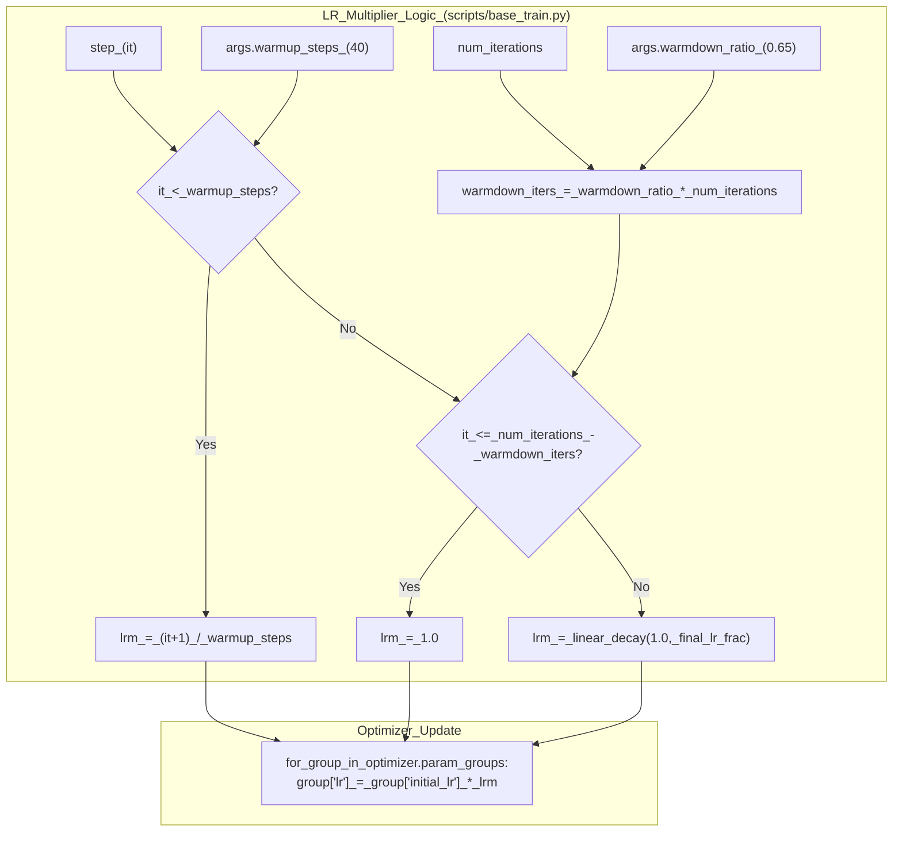
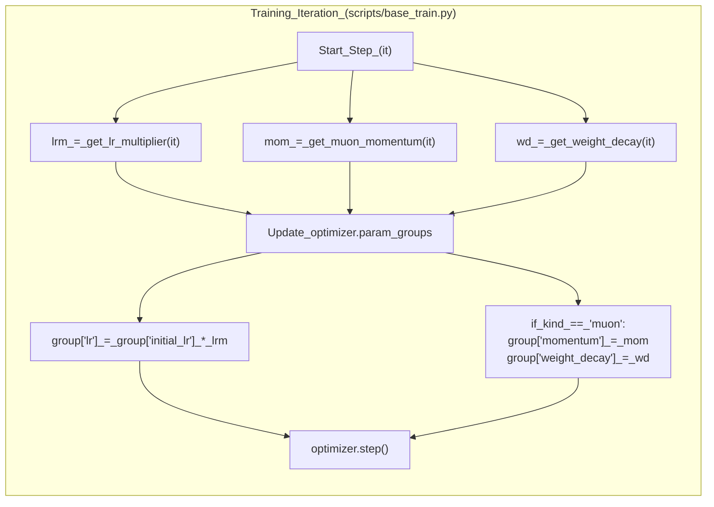

> [!WARNING]
> Imported from DeepWiki as generated, unverified repository documentation. Verify code-behavior claims against the revision below before stabilization.

# Learning Rate and Weight Decay Schedules

<details>
<summary>Relevant source files</summary>

The following files were used as context for generating this wiki page:

- [scripts/base_train.py](https://github.com/karpathy/nanochat/blob/92d63d4e8bb4df75c3b71618f31ddde2378b2bcd/scripts/base_train.py)
- [scripts/chat_sft.py](https://github.com/karpathy/nanochat/blob/92d63d4e8bb4df75c3b71618f31ddde2378b2bcd/scripts/chat_sft.py)

</details>


## Purpose and Scope

This page documents the learning rate, momentum, and weight decay schedules used during training in `nanochat`. These schedules dynamically adjust optimizer hyperparameters throughout the training duration to improve convergence speed and final model quality. The system supports a 3-phase LR schedule (warmup, constant, warmdown), a ramped momentum schedule for the Muon optimizer, and a linear decay for weight decay in base pretraining.

For details on the MuonAdamW optimizer architecture itself, see 5.1. For parameter grouping and base learning rate values, see 5.2.

## Learning Rate Schedule Overview

Nanochat uses a **warmup-constant-warmdown** learning rate schedule. This schedule produces a **learning rate multiplier** (`lrm`) that scales the base learning rates of all parameter groups (Muon matrices, AdamW embeddings, and scalars) uniformly.

| Phase | Duration | Behavior |
|-------|----------|----------|
| **Warmup** | `warmup_steps` (Base) or `warmup_ratio` (SFT) | Linear ramp from 0 to 1.0 |
| **Constant** | Middle phase | Maintains 1.0 (full learning rate) |
| **Warmdown** | `warmdown_ratio × num_iterations` | Linear decay from 1.0 to `final_lr_frac` |

### Base Training Implementation

In `base_train.py`, the schedule uses absolute iteration counts. The default `warmup_steps` is 40 [scripts/base_train.py:67](https://github.com/karpathy/nanochat/blob/92d63d4e8bb4df75c3b71618f31ddde2378b2bcd/scripts/base_train.py#L67), and `warmdown_ratio` is 0.65 [scripts/base_train.py:68](https://github.com/karpathy/nanochat/blob/92d63d4e8bb4df75c3b71618f31ddde2378b2bcd/scripts/base_train.py#L68).

```python
def get_lr_multiplier(it):
    warmdown_iters = round(args.warmdown_ratio * num_iterations)
    if it < args.warmup_steps:
        return (it + 1) / args.warmup_steps
    elif it <= num_iterations - warmdown_iters:
        return 1.0
    else:
        # linear warmdown from 1.0 to final_lr_frac
        progress = (num_iterations - it) / warmdown_iters
        return progress * 1.0 + (1 - progress) * args.final_lr_frac
```

**Application in training loop:**
The multiplier is calculated at every step and applied to each parameter group's `initial_lr`.
Sources: [scripts/base_train.py:349-359](https://github.com/karpathy/nanochat/blob/92d63d4e8bb4df75c3b71618f31ddde2378b2bcd/scripts/base_train.py#L349-L359), [scripts/base_train.py:501-505](https://github.com/karpathy/nanochat/blob/92d63d4e8bb4df75c3b71618f31ddde2378b2bcd/scripts/base_train.py#L501-L505)

### SFT Implementation

The supervised fine-tuning script `chat_sft.py` uses a **progress-based** schedule (0.0 to 1.0) because SFT is driven by epochs over a task mixture where the exact iteration count is derived from the dataset size.

```python
def get_lr_multiplier(progress):
    if progress < args.warmup_ratio:
        return (progress + 1e-8) / args.warmup_ratio
    elif progress <= 1.0 - args.warmdown_ratio:
        return 1.0
    else:
        # linear warmdown from 1.0 to final_lr_frac
        decay = (progress - (1.0 - args.warmdown_ratio)) / args.warmdown_ratio
        return (1 - decay) * 1.0 + decay * args.final_lr_frac
```

Sources: [scripts/chat_sft.py:298-305](https://github.com/karpathy/nanochat/blob/92d63d4e8bb4df75c3b71618f31ddde2378b2bcd/scripts/chat_sft.py#L298-L305), [scripts/chat_sft.py:427-430](https://github.com/karpathy/nanochat/blob/92d63d4e8bb4df75c3b71618f31ddde2378b2bcd/scripts/chat_sft.py#L427-L430)

### Default Hyperparameters

| Parameter | Base Training Default | SFT Default | Description |
|-----------|----------------------|-------------|-------------|
| `warmup_steps` / `ratio` | 40 | 0.0 | Steps (Base) or Fraction (SFT) for warmup [scripts/base_train.py:67](https://github.com/karpathy/nanochat/blob/92d63d4e8bb4df75c3b71618f31ddde2378b2bcd/scripts/base_train.py#L67), [scripts/chat_sft.py:55](https://github.com/karpathy/nanochat/blob/92d63d4e8bb4df75c3b71618f31ddde2378b2bcd/scripts/chat_sft.py#L55) |
| `warmdown_ratio` | 0.65 | 0.5 | Fraction of training for warmdown [scripts/base_train.py:68](https://github.com/karpathy/nanochat/blob/92d63d4e8bb4df75c3b71618f31ddde2378b2bcd/scripts/base_train.py#L68), [scripts/chat_sft.py:56](https://github.com/karpathy/nanochat/blob/92d63d4e8bb4df75c3b71618f31ddde2378b2bcd/scripts/chat_sft.py#L56) |
| `final_lr_frac` | 0.05 | 0.0 | Final LR as fraction of initial [scripts/base_train.py:69](https://github.com/karpathy/nanochat/blob/92d63d4e8bb4df75c3b71618f31ddde2378b2bcd/scripts/base_train.py#L69), [scripts/chat_sft.py:57](https://github.com/karpathy/nanochat/blob/92d63d4e8bb4df75c3b71618f31ddde2378b2bcd/scripts/chat_sft.py#L57) |
| `init_lr_frac` | 1.0 | 0.8 | Initial LR multiplier (SFT starts at 80% of base LR) [scripts/chat_sft.py:54](https://github.com/karpathy/nanochat/blob/92d63d4e8bb4df75c3b71618f31ddde2378b2bcd/scripts/chat_sft.py#L54) |

Sources: [scripts/base_train.py:67-69](https://github.com/karpathy/nanochat/blob/92d63d4e8bb4df75c3b71618f31ddde2378b2bcd/scripts/base_train.py#L67-L69), [scripts/chat_sft.py:54-57](https://github.com/karpathy/nanochat/blob/92d63d4e8bb4df75c3b71618f31ddde2378b2bcd/scripts/chat_sft.py#L54-L57)

## Learning Rate Schedule Diagram

This diagram illustrates how the `get_lr_multiplier` function maps training progress to the actual learning rate applied to the `optimizer`.



Sources: [scripts/base_train.py:349-359](https://github.com/karpathy/nanochat/blob/92d63d4e8bb4df75c3b71618f31ddde2378b2bcd/scripts/base_train.py#L349-L359), [scripts/base_train.py:501-508](https://github.com/karpathy/nanochat/blob/92d63d4e8bb4df75c3b71618f31ddde2378b2bcd/scripts/base_train.py#L501-L508)

## Momentum Schedule for Muon

The Muon optimizer uses **Nesterov momentum** that ramps up during the first 300 steps of training to stabilize early gradients.

```python
def get_muon_momentum(it):
    frac = min(it / 300, 1)
    momentum = (1 - frac) * 0.85 + frac * 0.95
    return momentum
```

**Timeline:**
- **Step 0:** momentum = 0.85 (more responsive to immediate gradients)
- **Step 300+:** momentum = 0.95 (maximum stability)

This schedule is applied only to parameter groups where `group['kind'] == 'muon'`.

Sources: [scripts/base_train.py:362-365](https://github.com/karpathy/nanochat/blob/92d63d4e8bb4df75c3b71618f31ddde2378b2bcd/scripts/base_train.py#L362-L365), [scripts/base_train.py:502-507](https://github.com/karpathy/nanochat/blob/92d63d4e8bb4df75c3b71618f31ddde2378b2bcd/scripts/base_train.py#L502-L507), [scripts/chat_sft.py:308-311](https://github.com/karpathy/nanochat/blob/92d63d4e8bb4df75c3b71618f31ddde2378b2bcd/scripts/chat_sft.py#L308-L311), [scripts/chat_sft.py:428-432](https://github.com/karpathy/nanochat/blob/92d63d4e8bb4df75c3b71618f31ddde2378b2bcd/scripts/chat_sft.py#L428-L432)

## Weight Decay Schedule

In base pretraining, weight decay for Muon parameters **linearly decays to zero** over the course of training. This allows for strong regularization during the initial fitting phase and fine-grained optimization near the end.

```python
def get_weight_decay(it):
    # linear decay of weight decay to 0
    return weight_decay_scaled * (1 - it / num_iterations)
```

### Initial Weight Decay Scaling

The `weight_decay_scaled` value is derived from the CLI argument `--weight-decay` (default 0.28) [scripts/base_train.py:64](https://github.com/karpathy/nanochat/blob/92d63d4e8bb4df75c3b71618f31ddde2378b2bcd/scripts/base_train.py#L64) and adjusted based on the training horizon and batch size to maintain consistent regularization strength.

```python
# Scale weight decay based on batch size and data horizon (T_epoch framework)
weight_decay_scaled = args.weight_decay * math.sqrt(total_batch_size / B_REF) * (D_REF / target_tokens)
```
Where `B_REF` is 524,288 and `D_REF` is the optimal token count for a depth-12 model [scripts/base_train.py:291-299](https://github.com/karpathy/nanochat/blob/92d63d4e8bb4df75c3b71618f31ddde2378b2bcd/scripts/base_train.py#L291-L299).

Sources: [scripts/base_train.py:291-299](https://github.com/karpathy/nanochat/blob/92d63d4e8bb4df75c3b71618f31ddde2378b2bcd/scripts/base_train.py#L291-L299), [scripts/base_train.py:368-369](https://github.com/karpathy/nanochat/blob/92d63d4e8bb4df75c3b71618f31ddde2378b2bcd/scripts/base_train.py#L368-L369), [scripts/base_train.py:503-508](https://github.com/karpathy/nanochat/blob/92d63d4e8bb4df75c3b71618f31ddde2378b2bcd/scripts/base_train.py#L503-L508)

### SFT Weight Decay

In Supervised Fine-Tuning (`chat_sft.py`), weight decay is typically set to **zero**. The optimizer is initialized with `weight_decay=0.0` in the `model.setup_optimizer` call [scripts/chat_sft.py:135](https://github.com/karpathy/nanochat/blob/92d63d4e8bb4df75c3b71618f31ddde2378b2bcd/scripts/chat_sft.py#L135).

Sources: [scripts/chat_sft.py:135](https://github.com/karpathy/nanochat/blob/92d63d4e8bb4df75c3b71618f31ddde2378b2bcd/scripts/chat_sft.py#L135)

## Schedule Application in Training Loop

The training loop coordinates the application of these schedules at the start of every optimization step.



Sources: [scripts/base_train.py:501-510](https://github.com/karpathy/nanochat/blob/92d63d4e8bb4df75c3b71618f31ddde2378b2bcd/scripts/base_train.py#L501-L510), [scripts/chat_sft.py:427-433](https://github.com/karpathy/nanochat/blob/92d63d4e8bb4df75c3b71618f31ddde2378b2bcd/scripts/chat_sft.py#L427-L433)

## Per-Parameter-Group Learning Rates

The learning rate multiplier (`lrm`) scales the base learning rates defined for different parameter groups. In `nanochat`, different components of the model use different learning rates:

| Parameter Group | CLI Argument | Default Base LR | Optimizer |
|-----------------|--------------|-----------------|-----------|
| Embeddings (`wte`) | `--embedding-lr` | 0.3 | AdamW |
| Unembedding (`lm_head`) | `--unembedding-lr` | 0.008 | AdamW |
| Matrices (Linear layers) | `--matrix-lr` | 0.02 | Muon |
| Scalars (Lambdas) | `--scalar-lr` | 0.5 | AdamW |

The `initial_lr` for each group is further scaled by `batch_lr_scale` (derived from the total batch size) before training begins [scripts/base_train.py:311-322](https://github.com/karpathy/nanochat/blob/92d63d4e8bb4df75c3b71618f31ddde2378b2bcd/scripts/base_train.py#L311-L322).

Sources: [scripts/base_train.py:62-66](https://github.com/karpathy/nanochat/blob/92d63d4e8bb4df75c3b71618f31ddde2378b2bcd/scripts/base_train.py#L62-L66), [scripts/base_train.py:311-322](https://github.com/karpathy/nanochat/blob/92d63d4e8bb4df75c3b71618f31ddde2378b2bcd/scripts/base_train.py#L311-L322)

## Code Entity Reference

### Schedule Functions

| Function | File | Role |
|----------|------|------|
| `get_lr_multiplier` | [scripts/base_train.py:350-359](https://github.com/karpathy/nanochat/blob/92d63d4e8bb4df75c3b71618f31ddde2378b2bcd/scripts/base_train.py#L350-L359) | Computes LR multiplier for pretraining |
| `get_muon_momentum` | [scripts/base_train.py:362-365](https://github.com/karpathy/nanochat/blob/92d63d4e8bb4df75c3b71618f31ddde2378b2bcd/scripts/base_train.py#L362-L365) | Computes Nesterov momentum ramp |
| `get_weight_decay` | [scripts/base_train.py:368-369](https://github.com/karpathy/nanochat/blob/92d63d4e8bb4df75c3b71618f31ddde2378b2bcd/scripts/base_train.py#L368-L369) | Computes decaying weight decay |
| `get_lr_multiplier` | [scripts/chat_sft.py:298-305](https://github.com/karpathy/nanochat/blob/92d63d4e8bb4df75c3b71618f31ddde2378b2bcd/scripts/chat_sft.py#L298-L305) | Computes progress-based LR multiplier for SFT |

### Application Sites

| Site | File | Logic |
|------|------|-------|
| Base Training Loop | [scripts/base_train.py:501-510](https://github.com/karpathy/nanochat/blob/92d63d4e8bb4df75c3b71618f31ddde2378b2bcd/scripts/base_train.py#L501-L510) | Updates `lr`, `momentum`, and `weight_decay` per group |
| SFT Training Loop | [scripts/chat_sft.py:427-433](https://github.com/karpathy/nanochat/blob/92d63d4e8bb4df75c3b71618f31ddde2378b2bcd/scripts/chat_sft.py#L427-L433) | Updates `lr` and `momentum` (WD is 0) |

Sources: [scripts/base_train.py:350-369](https://github.com/karpathy/nanochat/blob/92d63d4e8bb4df75c3b71618f31ddde2378b2bcd/scripts/base_train.py#L350-L369), [scripts/chat_sft.py:298-311](https://github.com/karpathy/nanochat/blob/92d63d4e8bb4df75c3b71618f31ddde2378b2bcd/scripts/chat_sft.py#L298-L311)
