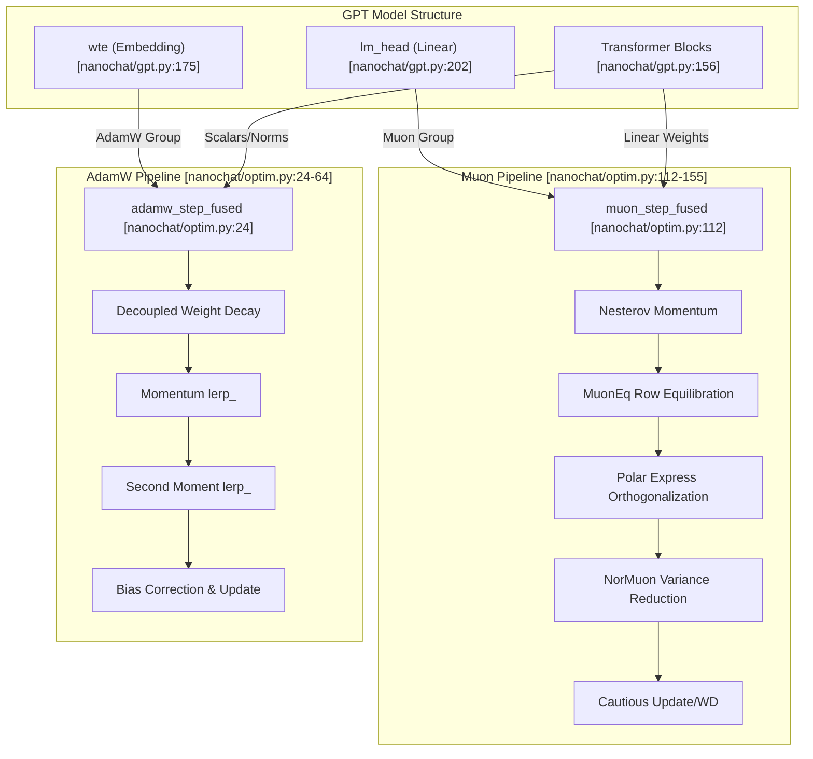
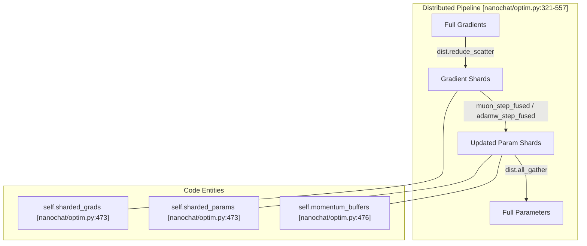

> [!WARNING]
> Imported from DeepWiki as generated, unverified repository documentation. Verify code-behavior claims against the revision below before stabilization.

# Optimization System

Relevant source files

The following files were used as context for generating this wiki page:

- [nanochat/optim.py](https://github.com/karpathy/nanochat/blob/92d63d4e8bb4df75c3b71618f31ddde2378b2bcd/nanochat/optim.py)

**Purpose**: This document covers the hybrid optimization system in `nanochat`, which combines the **Muon** optimizer for matrix parameters with **AdamW** for embeddings and scalars. It details the core algorithms (Polar Express orthogonalization, NorMuon variance reduction, cautious weight decay), parameter grouping strategies, and the distributed implementation using ZeRO-2-style optimizer state sharding.

The system is implemented in `nanochat/optim.py`, providing both single-GPU (`MuonAdamW`) and distributed (`DistMuonAdamW`) versions [nanochat/optim.py:1-10](https://github.com/karpathy/nanochat/blob/92d63d4e8bb4df75c3b71618f31ddde2378b2bcd/nanochat/optim.py#L1-L10).

---

## Hybrid Optimizer Architecture

The optimization system splits parameters into groups based on their shape and role, applying different algorithms to each to maximize training efficiency.

### Optimizer Selection Logic

**Sources**: [nanochat/optim.py:1-10](https://github.com/karpathy/nanochat/blob/92d63d4e8bb4df75c3b71618f31ddde2378b2bcd/nanochat/optim.py#L1-L10), [nanochat/optim.py:24-64](https://github.com/karpathy/nanochat/blob/92d63d4e8bb4df75c3b71618f31ddde2378b2bcd/nanochat/optim.py#L24-L64), [nanochat/optim.py:112-155](https://github.com/karpathy/nanochat/blob/92d63d4e8bb4df75c3b71618f31ddde2378b2bcd/nanochat/optim.py#L112-L155), [nanochat/gpt.py:175-202](https://github.com/karpathy/nanochat/blob/92d63d4e8bb4df75c3b71618f31ddde2378b2bcd/nanochat/gpt.py#L175-L202)

### Parameter Groups

The grouping is typically performed by examining `param.ndim` and the parameter name. Matrix parameters (2D) are optimized via Muon, while embeddings and 1D/0D parameters use AdamW.

| Parameter Type | Group | Implementation Details |
|---|---|---|
| **Linear Weights** | Muon | `c_q`, `c_k`, `c_v`, `c_proj`, `c_fc`, `lm_head`. Uses orthogonalization. |
| **Embeddings** | AdamW | `wte`, `value_embeds`. Typically high learning rate. |
| **Scalars/Biases** | AdamW | `ve_gate`, `resid_scale`, `norm` scales. No weight decay usually. |

For details, see [Parameter Groups and Learning Rate Scaling](deepwiki-05-02-parameter-groups-and-learning-rate-scaling.md).

**Sources**: [nanochat/optim.py:158-183](https://github.com/karpathy/nanochat/blob/92d63d4e8bb4df75c3b71618f31ddde2378b2bcd/nanochat/optim.py#L158-L183), [nanochat/gpt.py:77-82](https://github.com/karpathy/nanochat/blob/92d63d4e8bb4df75c3b71618f31ddde2378b2bcd/nanochat/gpt.py#L77-L82), [nanochat/gpt.py:134-135](https://github.com/karpathy/nanochat/blob/92d63d4e8bb4df75c3b71618f31ddde2378b2bcd/nanochat/gpt.py#L134-L135), [scripts/base_train.py:145-163](https://github.com/karpathy/nanochat/blob/92d63d4e8bb4df75c3b71618f31ddde2378b2bcd/scripts/base_train.py#L145-L163)

---

## Core Optimization Algorithms

### 1. Muon: Orthogonalized SGD
Muon replaces standard updates with the nearest orthogonal matrix. This prevents feature collapse and ensures that updates across different dimensions remain uncorrelated.

*   **Nesterov Momentum**: Applied before orthogonalization to maintain directional consistency [nanochat/optim.py:130-133](https://github.com/karpathy/nanochat/blob/92d63d4e8bb4df75c3b71618f31ddde2378b2bcd/nanochat/optim.py#L130-L133).
*   **MuonEq Row Equilibration**: Rescales each row to the mean row norm to improve the conditioning of the spectrum entering orthogonalization [nanochat/optim.py:138-141](https://github.com/karpathy/nanochat/blob/92d63d4e8bb4df75c3b71618f31ddde2378b2bcd/nanochat/optim.py#L138-L141).
*   **Polar Express**: An iterative method (5 iterations) using precomputed `polar_express_coeffs` to compute the orthogonal update [nanochat/optim.py:102-108](https://github.com/karpathy/nanochat/blob/92d63d4e8bb4df75c3b71618f31ddde2378b2bcd/nanochat/optim.py#L102-L108), [nanochat/optim.py:143-147](https://github.com/karpathy/nanochat/blob/92d63d4e8bb4df75c3b71618f31ddde2378b2bcd/nanochat/optim.py#L143-L147).
*   **NorMuon**: A variance reduction technique that normalizes update scales per-neuron (row or column) based on historical variance [nanochat/optim.py:84-87](https://github.com/karpathy/nanochat/blob/92d63d4e8bb4df75c3b71618f31ddde2378b2bcd/nanochat/optim.py#L84-L87), [nanochat/optim.py:149-152](https://github.com/karpathy/nanochat/blob/92d63d4e8bb4df75c3b71618f31ddde2378b2bcd/nanochat/optim.py#L149-L152).
*   **Cautious Update**: Only applies the update if the update and the gradient have the same sign (cautious optimizer logic) [nanochat/optim.py:154-155](https://github.com/karpathy/nanochat/blob/92d63d4e8bb4df75c3b71618f31ddde2378b2bcd/nanochat/optim.py#L154-L155).

### 2. AdamW: Fused Adaptive Optimizer
For non-matrix parameters, a standard AdamW implementation is used. It features:
*   **Fused Kernel**: The entire update (weight decay, momentum, bias correction) is wrapped in a `@torch.compile` block (`adamw_step_fused`) to eliminate Python overhead [nanochat/optim.py:23-64](https://github.com/karpathy/nanochat/blob/92d63d4e8bb4df75c3b71618f31ddde2378b2bcd/nanochat/optim.py#L23-L64).
*   **0-D CPU Tensors**: Hyperparameters (LR, betas, eps) are passed as 0-D tensors to avoid frequent `torch.compile` recompilations when values change during scheduling [nanochat/optim.py:29-34](https://github.com/karpathy/nanochat/blob/92d63d4e8bb4df75c3b71618f31ddde2378b2bcd/nanochat/optim.py#L29-L34).

For details, see [MuonAdamW Hybrid Optimizer](deepwiki-05-01-muonadamw-hybrid-optimizer.md).

**Sources**: [nanochat/optim.py:24-155](https://github.com/karpathy/nanochat/blob/92d63d4e8bb4df75c3b71618f31ddde2378b2bcd/nanochat/optim.py#L24-L155)

---

## Distributed Optimizer (DistMuonAdamW)

The `DistMuonAdamW` class implements a memory-efficient distributed optimizer that shards optimizer states across available GPUs (ZeRO-2 style).

### Communication and Sharding Flow

**Key Features**:
*   **Async Overlap**: Uses a three-phase execution (Launch Reduces → Wait/Compute/Launch Gathers → Wait Gathers) to overlap communication with computation [nanochat/optim.py:531-557](https://github.com/karpathy/nanochat/blob/92d63d4e8bb4df75c3b71618f31ddde2378b2bcd/nanochat/optim.py#L531-L557).
*   **Small Param Optimization**: Parameters with fewer than 1024 elements (like scalars) use `dist.all_reduce` and replicated states to avoid the overhead of sharding [nanochat/optim.py:393-409](https://github.com/karpathy/nanochat/blob/92d63d4e8bb4df75c3b71618f31ddde2378b2bcd/nanochat/optim.py#L393-L409).
*   **Buffer Reuse**: In Muon groups, gradients and parameters are stacked into contiguous buffers to perform collective communications efficiently [nanochat/optim.py:473-489](https://github.com/karpathy/nanochat/blob/92d63d4e8bb4df75c3b71618f31ddde2378b2bcd/nanochat/optim.py#L473-L489).

For details, see [Distributed Optimizer (DistMuonAdamW)](deepwiki-05-03-distributed-optimizer-distmuonadamw.md).

**Sources**: [nanochat/optim.py:321-557](https://github.com/karpathy/nanochat/blob/92d63d4e8bb4df75c3b71618f31ddde2378b2bcd/nanochat/optim.py#L321-L557)

---

## Learning Rate and Schedules

The optimization system employs a 3-phase schedule and heterogeneous learning rates based on the parameter group.

### LR Scaling and Schedules
*   **3-Phase Schedule**: Training follows a linear warmup, a constant LR phase, and a linear warmdown (decay) to a fraction of the peak LR [scripts/base_train.py:165-175](https://github.com/karpathy/nanochat/blob/92d63d4e8bb4df75c3b71618f31ddde2378b2bcd/scripts/base_train.py#L165-L175).
*   **Matrix LR**: The base learning rate for Muon, controlled by `--matrix-lr` [scripts/base_train.py:68](https://github.com/karpathy/nanochat/blob/92d63d4e8bb4df75c3b71618f31ddde2378b2bcd/scripts/base_train.py#L68).
*   **Embedding/Scalar Scaling**: Embeddings and scalars often use a different LR scale, defined by `dmodel_lr_scale` or specific CLI flags [scripts/base_train.py:65-69](https://github.com/karpathy/nanochat/blob/92d63d4e8bb4df75c3b71618f31ddde2378b2bcd/scripts/base_train.py#L65-L69).
*   **Muon Momentum Ramping**: Muon momentum (`muon_beta1`) is often ramped during training to stabilize the early stages of orthogonalization [scripts/base_train.py:177-181](https://github.com/karpathy/nanochat/blob/92d63d4e8bb4df75c3b71618f31ddde2378b2bcd/scripts/base_train.py#L177-L181).

For details, see [Learning Rate and Weight Decay Schedules](deepwiki-05-04-learning-rate-and-weight-decay-schedules.md).

**Sources**: [scripts/base_train.py:65-181](https://github.com/karpathy/nanochat/blob/92d63d4e8bb4df75c3b71618f31ddde2378b2bcd/scripts/base_train.py#L65-L181), [nanochat/optim.py:117-122](https://github.com/karpathy/nanochat/blob/92d63d4e8bb4df75c3b71618f31ddde2378b2bcd/nanochat/optim.py#L117-L122)

---

## Child Pages

- [MuonAdamW Hybrid Optimizer](deepwiki-05-01-muonadamw-hybrid-optimizer.md) — Deep dive into the mathematical components (Polar Express, NorMuon, Cautious WD).
- [Parameter Groups and Learning Rate Scaling](deepwiki-05-02-parameter-groups-and-learning-rate-scaling.md) — Rationale and implementation of heterogeneous optimization.
- [Distributed Optimizer (DistMuonAdamW)](deepwiki-05-03-distributed-optimizer-distmuonadamw.md) — Implementation details of ZeRO-2 sharding and async communication.
- [Learning Rate and Weight Decay Schedules](deepwiki-05-04-learning-rate-and-weight-decay-schedules.md) — Documentation of the 3-phase training schedule and momentum ramping.
