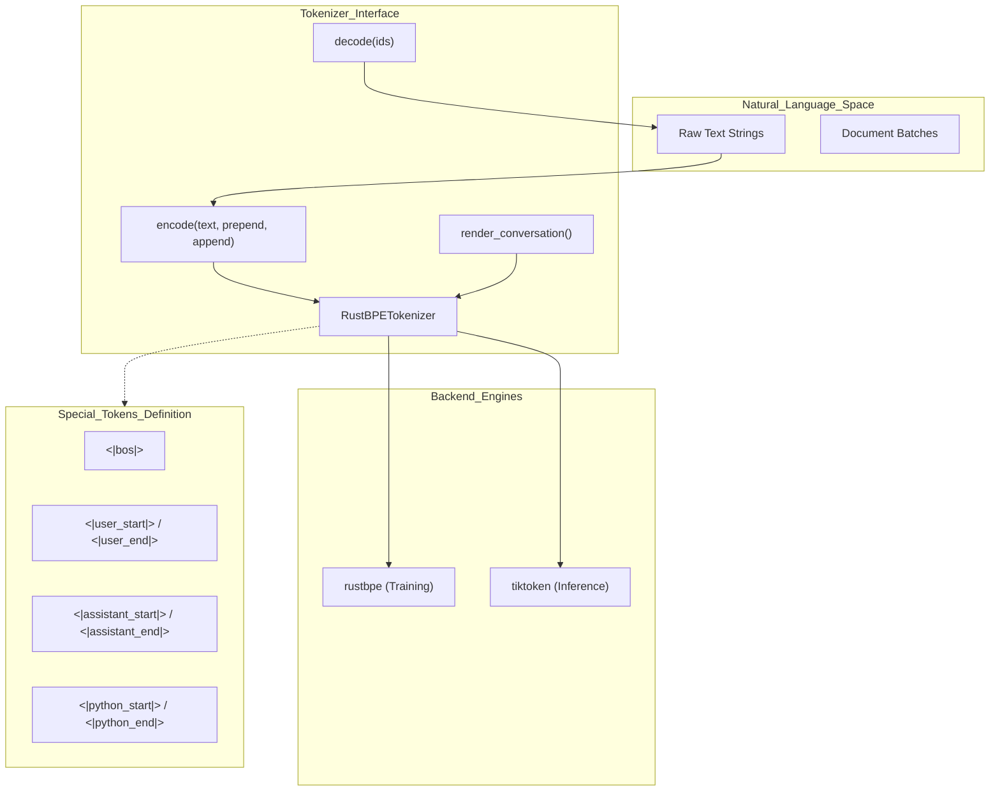
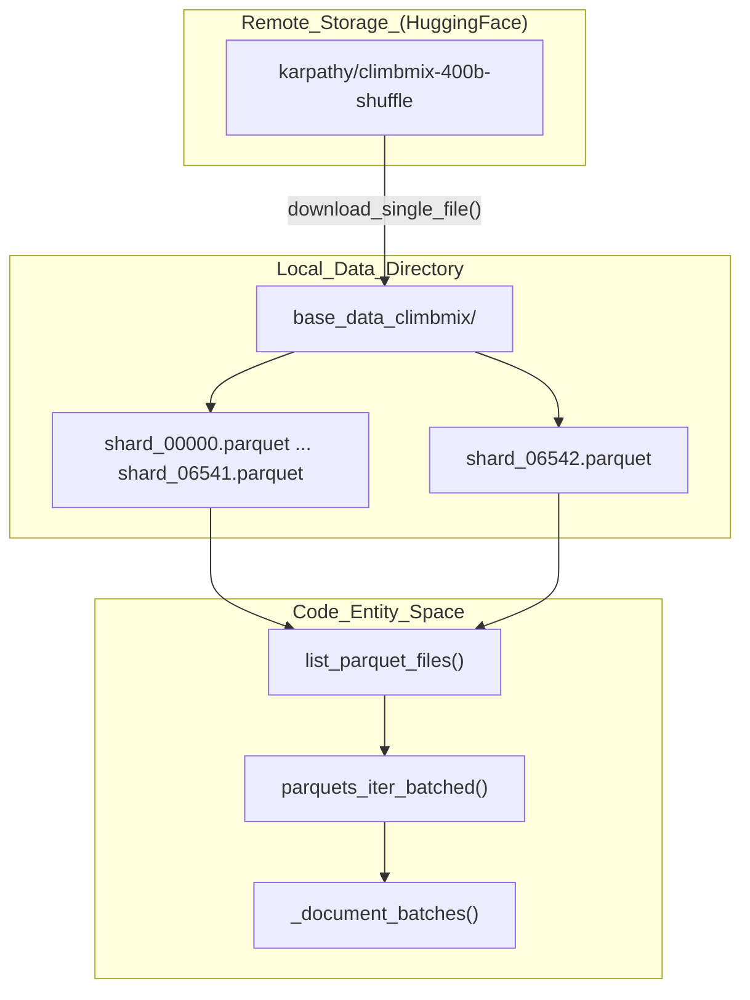

> [!WARNING]
> Imported from DeepWiki as generated, unverified repository documentation. Verify code-behavior claims against the revision below before stabilization.

# Dataset and Tokenizer

<details>
<summary>Relevant source files</summary>

The following files were used as context for generating this wiki page:

- [dev/LEADERBOARD.md](https://github.com/karpathy/nanochat/blob/92d63d4e8bb4df75c3b71618f31ddde2378b2bcd/dev/LEADERBOARD.md)
- [nanochat/dataloader.py](https://github.com/karpathy/nanochat/blob/92d63d4e8bb4df75c3b71618f31ddde2378b2bcd/nanochat/dataloader.py)
- [nanochat/dataset.py](https://github.com/karpathy/nanochat/blob/92d63d4e8bb4df75c3b71618f31ddde2378b2bcd/nanochat/dataset.py)
- [nanochat/tokenizer.py](https://github.com/karpathy/nanochat/blob/92d63d4e8bb4df75c3b71618f31ddde2378b2bcd/nanochat/tokenizer.py)
- [scripts/tok_eval.py](https://github.com/karpathy/nanochat/blob/92d63d4e8bb4df75c3b71618f31ddde2378b2bcd/scripts/tok_eval.py)
- [scripts/tok_train.py](https://github.com/karpathy/nanochat/blob/92d63d4e8bb4df75c3b71618f31ddde2378b2bcd/scripts/tok_train.py)

</details>


## Purpose and Scope

This page documents nanochat's tokenization system and pretraining dataset. It covers the BPE tokenizer implementations, the **ClimbMix-400B** dataset, and the infrastructure for training tokenizers and downloading data shards. For information about how tokenized data is loaded into training batches, see 6.2 BOS-Aligned Best-Fit DataLoader. For the SFT conversation rendering system, see 6.4 SFT Data Loader and Task Mixture.

---

## BPE Tokenizer Overview

nanochat uses a high-performance `RustBPETokenizer` that leverages the `rustbpe` library for training and `tiktoken` for efficient inference [nanochat/tokenizer.py:2-3](https://github.com/karpathy/nanochat/blob/92d63d4e8bb4df75c3b71618f31ddde2378b2bcd/nanochat/tokenizer.py#L2-L3). The system defaults to a vocabulary size of **32,768 tokens** ($2^{15}$) [scripts/tok_train.py:19](https://github.com/karpathy/nanochat/blob/92d63d4e8bb4df75c3b71618f31ddde2378b2bcd/scripts/tok_train.py#L19).

### Tokenizer Component Diagram



**Sources:** [nanochat/tokenizer.py:2-3](https://github.com/karpathy/nanochat/blob/92d63d4e8bb4df75c3b71618f31ddde2378b2bcd/nanochat/tokenizer.py#L2-L3), [nanochat/tokenizer.py:34-40](https://github.com/karpathy/nanochat/blob/92d63d4e8bb4df75c3b71618f31ddde2378b2bcd/nanochat/tokenizer.py#L34-L40), [nanochat/tokenizer.py:140-146](https://github.com/karpathy/nanochat/blob/92d63d4e8bb4df75c3b71618f31ddde2378b2bcd/nanochat/tokenizer.py#L140-L146)

---

## Tokenizer Configuration

### Vocabulary and Special Tokens

The tokenizer uses a **32,768 token vocabulary**. This size is optimized for smaller models to avoid wasting parameter budget on the embedding table while maintaining a high compression rate [scripts/tok_train.py:19-23](https://github.com/karpathy/nanochat/blob/92d63d4e8bb4df75c3b71618f31ddde2378b2bcd/scripts/tok_train.py#L19-L23).

| Token | Purpose |
|-------|---------|
| `<|bos|>` | Beginning of Sequence (delimits documents) |
| `<|user_start|>` / `<|user_end|>` | Chat turns for user messages |
| `<|assistant_start|>` / `<|assistant_end|>` | Chat turns for model responses |
| `<|python_start|>` / `<|python_end|>` | Assistant invoking the Python REPL tool |
| `<|python_end|>` | End of tool invocation |
| `<|output_start|>` / `<|output_end|>` | Tool execution results returned to assistant |

**Sources:** [nanochat/tokenizer.py:9-21](https://github.com/karpathy/nanochat/blob/92d63d4e8bb4df75c3b71618f31ddde2378b2bcd/nanochat/tokenizer.py#L9-L21), [scripts/tok_train.py:19-23](https://github.com/karpathy/nanochat/blob/92d63d4e8bb4df75c3b71618f31ddde2378b2bcd/scripts/tok_train.py#L19-L23)

### Number Token Splitting Pattern

nanochat uses a specialized regex pattern for pre-tokenization that deviates from GPT-4 by limiting number chunks to 1-2 digits (`\p{N}{1,2}`) instead of 1-3 [nanochat/tokenizer.py:23-26](https://github.com/karpathy/nanochat/blob/92d63d4e8bb4df75c3b71618f31ddde2378b2bcd/nanochat/tokenizer.py#L23-L26). This was determined to be the "sweet spot" for a 32K vocabulary size to prevent wasting tokens on numbers [nanochat/tokenizer.py:25](https://github.com/karpathy/nanochat/blob/92d63d4e8bb4df75c3b71618f31ddde2378b2bcd/nanochat/tokenizer.py#L25).

```python
SPLIT_PATTERN = r"""'(?i:[sdmt]|ll|ve|re)|[^\r\n\p{L}\p{N}]?+\p{L}+|\p{N}{1,2}| ?[^\s\p{L}\p{N}]++[\r\n]*|\s*[\r\n]|\s+(?!\S)|\s+"""
```

**Sources:** [nanochat/tokenizer.py:23-26](https://github.com/karpathy/nanochat/blob/92d63d4e8bb4df75c3b71618f31ddde2378b2bcd/nanochat/tokenizer.py#L23-L26)

---

## ClimbMix-400B Dataset

### Dataset Composition

**ClimbMix-400B** is the default pretraining mixture, replacing the legacy FinewebEdu-100B [nanochat/dataset.py:47-52](https://github.com/karpathy/nanochat/blob/92d63d4e8bb4df75c3b71618f31ddde2378b2bcd/nanochat/dataset.py#L47-L52). It is hosted on HuggingFace as a series of **6,543 parquet shards** [nanochat/dataset.py:23-24](https://github.com/karpathy/nanochat/blob/92d63d4e8bb4df75c3b71618f31ddde2378b2bcd/nanochat/dataset.py#L23-L24).

- **Total Shards:** 6,543 (0 to 6542) [nanochat/dataset.py:24](https://github.com/karpathy/nanochat/blob/92d63d4e8bb4df75c3b71618f31ddde2378b2bcd/nanochat/dataset.py#L24)
- **Validation Shard:** The last shard (`shard_06542.parquet`) is reserved exclusively for validation [nanochat/dataset.py:38](https://github.com/karpathy/nanochat/blob/92d63d4e8bb4df75c3b71618f31ddde2378b2bcd/nanochat/dataset.py#L38), [nanochat/dataset.py:149](https://github.com/karpathy/nanochat/blob/92d63d4e8bb4df75c3b71618f31ddde2378b2bcd/nanochat/dataset.py#L149)
- **Format:** Parquet files containing a `text` column [nanochat/dataset.py:80](https://github.com/karpathy/nanochat/blob/92d63d4e8bb4df75c3b71618f31ddde2378b2bcd/nanochat/dataset.py#L80), [nanochat/dataloader.py:65](https://github.com/karpathy/nanochat/blob/92d63d4e8bb4df75c3b71618f31ddde2378b2bcd/nanochat/dataloader.py#L65)

### Dataset Structure Diagram



**Sources:** [nanochat/dataset.py:23-27](https://github.com/karpathy/nanochat/blob/92d63d4e8bb4df75c3b71618f31ddde2378b2bcd/nanochat/dataset.py#L23-L27), [nanochat/dataset.py:32-34](https://github.com/karpathy/nanochat/blob/92d63d4e8bb4df75c3b71618f31ddde2378b2bcd/nanochat/dataset.py#L32-L34), [nanochat/dataset.py:67-72](https://github.com/karpathy/nanochat/blob/92d63d4e8bb4df75c3b71618f31ddde2378b2bcd/nanochat/dataset.py#L67-L72), [nanochat/dataloader.py:25-32](https://github.com/karpathy/nanochat/blob/92d63d4e8bb4df75c3b71618f31ddde2378b2bcd/nanochat/dataloader.py#L25-L32)

---

## Tokenizer Training

Tokenizers are trained using `scripts/tok_train.py`. The script iterates through the training split of the parquet shards using `parquets_iter_batched`, extracting text until a character limit (`--max-chars`, default 2B) is reached [scripts/tok_train.py:17-44](https://github.com/karpathy/nanochat/blob/92d63d4e8bb4df75c3b71618f31ddde2378b2bcd/scripts/tok_train.py#L17-L44). Training is performed using `RustBPETokenizer.train_from_iterator`, which internally calls `rustbpe` [scripts/tok_train.py:49](https://github.com/karpathy/nanochat/blob/92d63d4e8bb4df75c3b71618f31ddde2378b2bcd/scripts/tok_train.py#L49), [nanochat/tokenizer.py:44-48](https://github.com/karpathy/nanochat/blob/92d63d4e8bb4df75c3b71618f31ddde2378b2bcd/nanochat/tokenizer.py#L44-L48).

### Token Bits-Per-Byte (BPB) Mapping

A critical part of the tokenizer training is the generation of `token_bytes.pt`. This file maps every token ID to the number of UTF-8 bytes it represents [scripts/tok_train.py:72-75](https://github.com/karpathy/nanochat/blob/92d63d4e8bb4df75c3b71618f31ddde2378b2bcd/scripts/tok_train.py#L72-L75).

- **Special tokens:** Counted as 0 bytes [scripts/tok_train.py:80-81](https://github.com/karpathy/nanochat/blob/92d63d4e8bb4df75c3b71618f31ddde2378b2bcd/scripts/tok_train.py#L80-L81)
- **Standard tokens:** Counted by their UTF-8 encoded length using `decode_single_token_bytes` [scripts/tok_train.py:85-86](https://github.com/karpathy/nanochat/blob/92d63d4e8bb4df75c3b71618f31ddde2378b2bcd/scripts/tok_train.py#L85-L86)

This mapping allows the training loop to calculate **Bits-Per-Byte (BPB)**, a primary metric for model quality that is invariant to vocabulary size [scripts/tok_train.py:73-75](https://github.com/karpathy/nanochat/blob/92d63d4e8bb4df75c3b71618f31ddde2378b2bcd/scripts/tok_train.py#L73-L75).

**Sources:** [scripts/tok_train.py:72-91](https://github.com/karpathy/nanochat/blob/92d63d4e8bb4df75c3b71618f31ddde2378b2bcd/scripts/tok_train.py#L72-L91), [nanochat/tokenizer.py:129-130](https://github.com/karpathy/nanochat/blob/92d63d4e8bb4df75c3b71618f31ddde2378b2bcd/nanochat/tokenizer.py#L129-L130)

---

## Dataset Download and Management

The `nanochat.dataset` module handles parallelized downloads using `multiprocessing.Pool` [nanochat/dataset.py:15-156](https://github.com/karpathy/nanochat/blob/92d63d4e8bb4df75c3b71618f31ddde2378b2bcd/nanochat/dataset.py#L15-L156).

### Download Process

1. **Targeting:** Users specify the number of training shards (`-n`). The validation shard is always included by appending `MAX_SHARD` to the download list [nanochat/dataset.py:147-149](https://github.com/karpathy/nanochat/blob/92d63d4e8bb4df75c3b71618f31ddde2378b2bcd/nanochat/dataset.py#L147-L149).
2. **Persistence:** Files are downloaded to `.tmp` first and renamed upon completion to prevent corruption [nanochat/dataset.py:105-111](https://github.com/karpathy/nanochat/blob/92d63d4e8bb4df75c3b71618f31ddde2378b2bcd/nanochat/dataset.py#L105-L111).
3. **Robustness:** Includes 5 retry attempts with exponential backoff [nanochat/dataset.py:99-128](https://github.com/karpathy/nanochat/blob/92d63d4e8bb4df75c3b71618f31ddde2378b2bcd/nanochat/dataset.py#L99-L128).

### Data Loading Flow

The pretraining data flow moves from Parquet files to GPU tensors via the following chain:

1. `list_parquet_files()`: Scans the directory for valid shards [nanochat/dataset.py:32](https://github.com/karpathy/nanochat/blob/92d63d4e8bb4df75c3b71618f31ddde2378b2bcd/nanochat/dataset.py#L32).
2. `_document_batches()`: An infinite iterator that handles DDP sharding by offsetting row group indices by `ddp_rank` and stepping by `ddp_world_size` [nanochat/dataloader.py:25-68](https://github.com/karpathy/nanochat/blob/92d63d4e8bb4df75c3b71618f31ddde2378b2bcd/nanochat/dataloader.py#L25-L68).
3. `tokenizing_distributed_data_loader_with_state_bos_bestfit()`: Consumes the batches, tokenizes them using `tokenizer.encode` with the `bos_token`, and performs the Best-Fit packing into `(B, T)` tensors [nanochat/dataloader.py:74-161](https://github.com/karpathy/nanochat/blob/92d63d4e8bb4df75c3b71618f31ddde2378b2bcd/nanochat/dataloader.py#L74-L161).

**Sources:** [nanochat/dataset.py:32-82](https://github.com/karpathy/nanochat/blob/92d63d4e8bb4df75c3b71618f31ddde2378b2bcd/nanochat/dataset.py#L32-L82), [nanochat/dataloader.py:25-161](https://github.com/karpathy/nanochat/blob/92d63d4e8bb4df75c3b71618f31ddde2378b2bcd/nanochat/dataloader.py#L25-L161)
