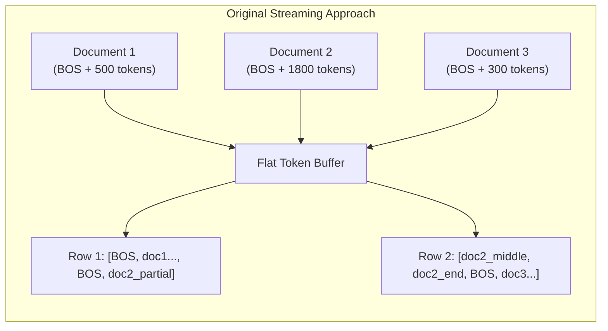
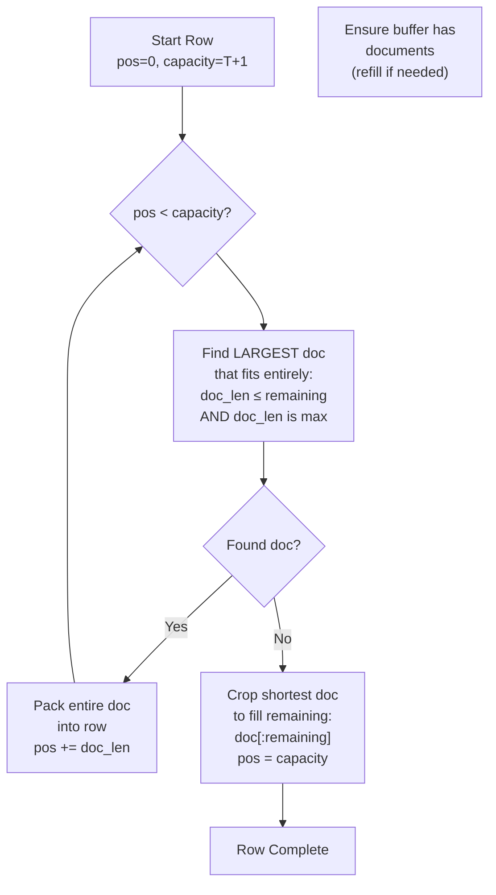
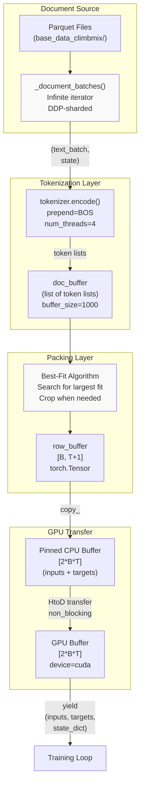
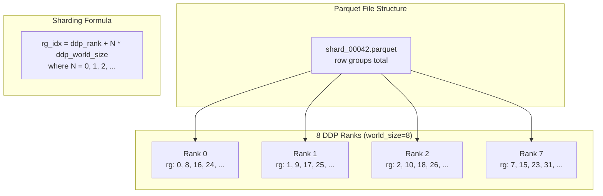
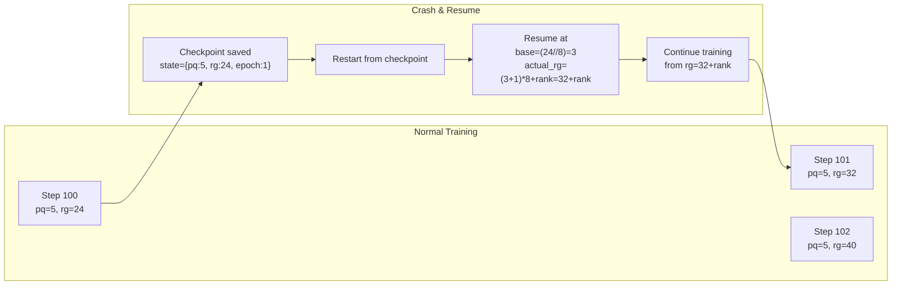
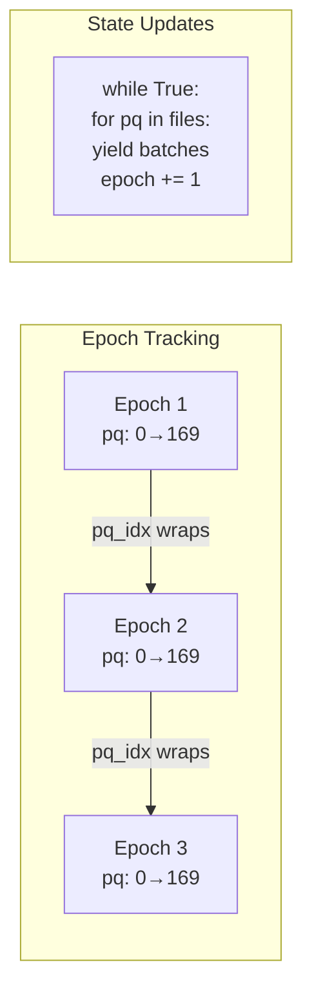

> [!WARNING]
> Imported from DeepWiki as generated, unverified repository documentation. Verify code-behavior claims against the revision below before stabilization.

# BOS-Aligned Best-Fit DataLoader

<details>
<summary>Relevant source files</summary>

The following files were used as context for generating this wiki page:

- [nanochat/dataloader.py](https://github.com/karpathy/nanochat/blob/92d63d4e8bb4df75c3b71618f31ddde2378b2bcd/nanochat/dataloader.py)
- [nanochat/dataset.py](https://github.com/karpathy/nanochat/blob/92d63d4e8bb4df75c3b71618f31ddde2378b2bcd/nanochat/dataset.py)

</details>


## Purpose and Scope

This document covers the BOS-aligned dataloader implementation in [nanochat/dataloader.py:1-166](https://github.com/karpathy/nanochat/blob/92d63d4e8bb4df75c3b71618f31ddde2378b2bcd/nanochat/dataloader.py#L1-L166). This dataloader ensures that every training sequence begins with a BOS (Beginning of Sequence) token, allowing the model to always have full document context during training. It uses a best-fit bin packing algorithm to minimize token waste while maintaining 100% batch utilization.

For the overall data pipeline context, see [Data Pipeline](deepwiki-06-data-pipeline.md). For tokenizer details, see [Dataset and Tokenizer](deepwiki-06-01-dataset-and-tokenizer.md). For conversation rendering during fine-tuning, see [SFT Data Loader and Task Mixture](deepwiki-06-04-sft-data-loader-and-task-mixture.md).

Sources: [nanochat/dataloader.py:1-17](https://github.com/karpathy/nanochat/blob/92d63d4e8bb4df75c3b71618f31ddde2378b2bcd/nanochat/dataloader.py#L1-L17), [nanochat/dataloader.py:74-95](https://github.com/karpathy/nanochat/blob/92d63d4e8bb4df75c3b71618f31ddde2378b2bcd/nanochat/dataloader.py#L74-L95)

## Overview

The BOS-aligned dataloader solves a fundamental problem with naive token streaming: sequences that start mid-document provide incomplete context to the model. The standard approach of streaming tokens into a flat buffer and reshaping into batches can result in rows like `[...doc1_end, doc2_middle, doc3_start...]` where the model must predict tokens without seeing document boundaries.

**Key Properties:**
- Every row starts with a BOS token [nanochat/dataloader.py:5](https://github.com/karpathy/nanochat/blob/92d63d4e8bb4df75c3b71618f31ddde2378b2bcd/nanochat/dataloader.py#L5)
- 100% batch utilization (no padding tokens) [nanochat/dataloader.py:8](https://github.com/karpathy/nanochat/blob/92d63d4e8bb4df75c3b71618f31ddde2378b2bcd/nanochat/dataloader.py#L8)
- Approximately 35% of tokens discarded due to cropping (at T=2048) [nanochat/dataloader.py:11](https://github.com/karpathy/nanochat/blob/92d63d4e8bb4df75c3b71618f31ddde2378b2bcd/nanochat/dataloader.py#L11)
- Distributed data sharding at the row group level [nanochat/dataloader.py:62-68](https://github.com/karpathy/nanochat/blob/92d63d4e8bb4df75c3b71618f31ddde2378b2bcd/nanochat/dataloader.py#L62-L68)
- Resumption support via `(pq_idx, rg_idx, epoch)` state tracking [nanochat/dataloader.py:40-42](https://github.com/karpathy/nanochat/blob/92d63d4e8bb4df75c3b71618f31ddde2378b2bcd/nanochat/dataloader.py#L40-L42)

**Function Signature:**
[nanochat/dataloader.py:74-79](https://github.com/karpathy/nanochat/blob/92d63d4e8bb4df75c3b71618f31ddde2378b2bcd/nanochat/dataloader.py#L74-L79)
```python
def tokenizing_distributed_data_loader_with_state_bos_bestfit(
    tokenizer, B, T, split,
    tokenizer_threads=4, tokenizer_batch_size=128,
    device="cuda", resume_state_dict=None,
    buffer_size=1000
):
```

Sources: [nanochat/dataloader.py:1-17](https://github.com/karpathy/nanochat/blob/92d63d4e8bb4df75c3b71618f31ddde2378b2bcd/nanochat/dataloader.py#L1-L17), [nanochat/dataloader.py:74-95](https://github.com/karpathy/nanochat/blob/92d63d4e8bb4df75c3b71618f31ddde2378b2bcd/nanochat/dataloader.py#L74-L95)

## The Problem: Mid-Document Sequences

### Original Dataloader Behavior



**Problem:** Row 2 starts with `doc2_middle` - the model has no BOS token and no document context for the first ~1300 tokens of this row. This "confusing" data is eliminated by the BOS-aligned loader.

Sources: [nanochat/dataloader.py:10-13](https://github.com/karpathy/nanochat/blob/92d63d4e8bb4df75c3b71618f31ddde2378b2bcd/nanochat/dataloader.py#L10-L13)

## Best-Fit Packing Algorithm

### Algorithm Overview

The best-fit algorithm balances two competing goals:
1. Minimize wasted tokens (cropping)
2. Maintain 100% batch utilization (no padding)

**Algorithm per Row:**



Sources: [nanochat/dataloader.py:86-90](https://github.com/karpathy/nanochat/blob/92d63d4e8bb4df75c3b71618f31ddde2378b2bcd/nanochat/dataloader.py#L86-L90), [nanochat/dataloader.py:123-152](https://github.com/karpathy/nanochat/blob/92d63d4e8bb4df75c3b71618f31ddde2378b2bcd/nanochat/dataloader.py#L123-L152)

### Step-by-Step Example

Consider packing rows with `T=2048` (capacity = 2049 tokens including BOS):

| Step | Buffer Contents | Remaining Space | Action |
|------|----------------|-----------------|--------|
| 1 | [400, 1500, 200, 800] | 2049 | Pick 1500 (largest that fits) |
| 2 | [400, 200, 800] | 549 | Pick 400 (largest that fits) |
| 3 | [200, 800] | 149 | Pick none (800 > 149, 200 > 149) |
| 3b | [200, 800] | 149 | **Crop** shortest (200) → use first 149 tokens |

**Result:** One row contains 1500 + 400 + 149 = 2049 tokens, all starting from document boundaries except the final cropped segment.

Sources: [nanochat/dataloader.py:132-151](https://github.com/karpathy/nanochat/blob/92d63d4e8bb4df75c3b71618f31ddde2378b2bcd/nanochat/dataloader.py#L132-L151)

## Implementation Architecture

### Component Flow



Sources: [nanochat/dataloader.py:74-161](https://github.com/karpathy/nanochat/blob/92d63d4e8bb4df75c3b71618f31ddde2378b2bcd/nanochat/dataloader.py#L74-L161), [nanochat/dataset.py:27](https://github.com/karpathy/nanochat/blob/92d63d4e8bb4df75c3b71618f31ddde2378b2bcd/nanochat/dataset.py#L27)

### Buffer Management

The implementation uses three levels of buffering:

**1. Document Buffer** [nanochat/dataloader.py:101-109](https://github.com/karpathy/nanochat/blob/92d63d4e8bb4df75c3b71618f31ddde2378b2bcd/nanochat/dataloader.py#L101-L109)
```python
doc_buffer = []  # List of tokenized documents (List[List[int]])
buffer_size = 1000  # Target number of documents to keep buffered
```

**2. Row Buffer** [nanochat/dataloader.py:114](https://github.com/karpathy/nanochat/blob/92d63d4e8bb4df75c3b71618f31ddde2378b2bcd/nanochat/dataloader.py#L114)
```python
row_buffer = torch.empty((B, row_capacity), dtype=torch.long)
# Capacity = T+1 to hold inputs[:-1] and targets[1:]
```

**3. Transfer Buffers** [nanochat/dataloader.py:115-120](https://github.com/karpathy/nanochat/blob/92d63d4e8bb4df75c3b71618f31ddde2378b2bcd/nanochat/dataloader.py#L115-L120)
```python
# Single allocation for both inputs and targets
cpu_buffer = torch.empty(2 * B * T, dtype=torch.long, pin_memory=use_cuda)
gpu_buffer = torch.empty(2 * B * T, dtype=torch.long, device=device)

# Views into the buffers
cpu_inputs = cpu_buffer[:B * T].view(B, T)
cpu_targets = cpu_buffer[B * T:].view(B, T)
```

**Efficiency:** The pinned CPU buffer and pre-allocated GPU buffer enable a single efficient host-to-device transfer per batch via `gpu_buffer.copy_(cpu_buffer, non_blocking=use_cuda)`.

Sources: [nanochat/dataloader.py:111-121](https://github.com/karpathy/nanochat/blob/92d63d4e8bb4df75c3b71618f31ddde2378b2bcd/nanochat/dataloader.py#L111-L121), [nanochat/dataloader.py:160](https://github.com/karpathy/nanochat/blob/92d63d4e8bb4df75c3b71618f31ddde2378b2bcd/nanochat/dataloader.py#L160)

## Distributed Data Sharding

### DDP Row Group Sharding



Each DDP rank processes a non-overlapping subset of row groups. The pattern ensures no data duplication across ranks.

**Implementation:** [nanochat/dataloader.py:62-68](https://github.com/karpathy/nanochat/blob/92d63d4e8bb4df75c3b71618f31ddde2378b2bcd/nanochat/dataloader.py#L62-L68)
```python
rg_idx = ddp_rank
while rg_idx < pf.num_row_groups:
    rg = pf.read_row_group(rg_idx)
    batch = rg.column('text').to_pylist()
    # ... process batch ...
    rg_idx += ddp_world_size  # Step by world_size
```

Sources: [nanochat/dataloader.py:25-72](https://github.com/karpathy/nanochat/blob/92d63d4e8bb4df75c3b71618f31ddde2378b2bcd/nanochat/dataloader.py#L25-L72), [nanochat/dataset.py:76-81](https://github.com/karpathy/nanochat/blob/92d63d4e8bb4df75c3b71618f31ddde2378b2bcd/nanochat/dataset.py#L76-L81)

## State Management and Resumption

### Resume State Dictionary

The dataloader tracks three pieces of state for exact resumption:

```python
state_dict = {
    "pq_idx": int,    # Current parquet file index
    "rg_idx": int,    # Current row group index within file
    "epoch": int      # How many times we've cycled through dataset (starts at 1)
}
```

**Resumption Logic:** [nanochat/dataloader.py:40-60](https://github.com/karpathy/nanochat/blob/92d63d4e8bb4df75c3b71618f31ddde2378b2bcd/nanochat/dataloader.py#L40-L60)
- When resuming, start from `resume_rg_idx // ddp_world_size`
- Advance by +1 to avoid repeating the last processed batch [nanochat/dataloader.py:55](https://github.com/karpathy/nanochat/blob/92d63d4e8bb4df75c3b71618f31ddde2378b2bcd/nanochat/dataloader.py#L55)
- Resume only on first pass, then reset to normal DDP sharding [nanochat/dataloader.py:60](https://github.com/karpathy/nanochat/blob/92d63d4e8bb4df75c3b71618f31ddde2378b2bcd/nanochat/dataloader.py#L60)



**Key Insight:** Adding +1 to the base index ensures we skip the last batch seen before the checkpoint, preventing data duplication.

Sources: [nanochat/dataloader.py:40-60](https://github.com/karpathy/nanochat/blob/92d63d4e8bb4df75c3b71618f31ddde2378b2bcd/nanochat/dataloader.py#L40-L60)

### Multi-Epoch Training



The outer infinite loop [nanochat/dataloader.py:47-71](https://github.com/karpathy/nanochat/blob/92d63d4e8bb4df75c3b71618f31ddde2378b2bcd/nanochat/dataloader.py#L47-L71) increments the epoch counter each time all parquet files are exhausted. This enables:
- Training for more than one pass through the dataset
- Tracking training progress in terms of epochs
- Proper resumption even in multi-epoch scenarios [nanochat/dataloader.py:42-45](https://github.com/karpathy/nanochat/blob/92d63d4e8bb4df75c3b71618f31ddde2378b2bcd/nanochat/dataloader.py#L42-L45)

Sources: [nanochat/dataloader.py:47-71](https://github.com/karpathy/nanochat/blob/92d63d4e8bb4df75c3b71618f31ddde2378b2bcd/nanochat/dataloader.py#L47-L71)

## Performance Characteristics

### Token Waste Analysis

The implementation achieves 100% token utilization (no padding) while discarding roughly 35% of tokens to maintain BOS alignment.

| Metric | Value | Notes |
|--------|-------|-------|
| **Tokens Cropped** | ~35% | Discarded when documents don't fit [nanochat/dataloader.py:8](https://github.com/karpathy/nanochat/blob/92d63d4e8bb4df75c3b71618f31ddde2378b2bcd/nanochat/dataloader.py#L8) |
| **Batch Utilization** | 100% | No padding tokens [nanochat/dataloader.py:8](https://github.com/karpathy/nanochat/blob/92d63d4e8bb4df75c3b71618f31ddde2378b2bcd/nanochat/dataloader.py#L8) |

**Algorithm Comparison:**
The `best-fit` search (Step 1) picks the LARGEST doc that fits entirely [nanochat/dataloader.py:87](https://github.com/karpathy/nanochat/blob/92d63d4e8bb4df75c3b71618f31ddde2378b2bcd/nanochat/dataloader.py#L87). When nothing fits (Step 2), it crops the SHORTEST doc in the buffer to fill the remaining space [nanochat/dataloader.py:148-150](https://github.com/karpathy/nanochat/blob/92d63d4e8bb4df75c3b71618f31ddde2378b2bcd/nanochat/dataloader.py#L148-L150). This combination minimizes waste compared to a naive greedy approach.

Sources: [nanochat/dataloader.py:4-17](https://github.com/karpathy/nanochat/blob/92d63d4e8bb4df75c3b71618f31ddde2378b2bcd/nanochat/dataloader.py#L4-L17), [nanochat/dataloader.py:81-95](https://github.com/karpathy/nanochat/blob/92d63d4e8bb4df75c3b71618f31ddde2378b2bcd/nanochat/dataloader.py#L81-L95)

## Code Structure

### Main Entry Points

**1. With State Tracking** [nanochat/dataloader.py:74-161](https://github.com/karpathy/nanochat/blob/92d63d4e8bb4df75c3b71618f31ddde2378b2bcd/nanochat/dataloader.py#L74-L161)
```python
tokenizing_distributed_data_loader_with_state_bos_bestfit(...)
# Yields: (inputs, targets, state_dict)
```
Used by training scripts that need checkpoint resumption.

**2. Without State Tracking** [nanochat/dataloader.py:163-166](https://github.com/karpathy/nanochat/blob/92d63d4e8bb4df75c3b71618f31ddde2378b2bcd/nanochat/dataloader.py#L163-L166)
```python
tokenizing_distributed_data_loader_bos_bestfit(...)
# Yields: (inputs, targets)
```
Helper that omits state_dict from yields for simpler iteration.

### Internal Functions

**Document Iteration:** [nanochat/dataloader.py:25-72](https://github.com/karpathy/nanochat/blob/92d63d4e8bb4df75c3b71618f31ddde2378b2bcd/nanochat/dataloader.py#L25-L72)
```python
def _document_batches(split, resume_state_dict, tokenizer_batch_size):
    """
    Infinite iterator over document batches from parquet files.
    Handles DDP sharding and approximate resume.

    Yields: (text_batch, (pq_idx, rg_idx, epoch))
    """
```

This function:
- Loads parquet files via `list_parquet_files()` [nanochat/dataset.py:32-65](https://github.com/karpathy/nanochat/blob/92d63d4e8bb4df75c3b71618f31ddde2378b2bcd/nanochat/dataset.py#L32-L65)
- Splits train/val: last parquet is validation [nanochat/dataloader.py:38](https://github.com/karpathy/nanochat/blob/92d63d4e8bb4df75c3b71618f31ddde2378b2bcd/nanochat/dataloader.py#L38)
- Shards row groups across DDP ranks [nanochat/dataloader.py:62-68](https://github.com/karpathy/nanochat/blob/92d63d4e8bb4df75c3b71618f31ddde2378b2bcd/nanochat/dataloader.py#L62-L68)
- Handles multi-epoch cycling [nanochat/dataloader.py:47-71](https://github.com/karpathy/nanochat/blob/92d63d4e8bb4df75c3b71618f31ddde2378b2bcd/nanochat/dataloader.py#L47-L71)
- Manages resumption state [nanochat/dataloader.py:40-60](https://github.com/karpathy/nanochat/blob/92d63d4e8bb4df75c3b71618f31ddde2378b2bcd/nanochat/dataloader.py#L40-L60)

Sources: [nanochat/dataloader.py:25-72](https://github.com/karpathy/nanochat/blob/92d63d4e8bb4df75c3b71618f31ddde2378b2bcd/nanochat/dataloader.py#L25-L72)
