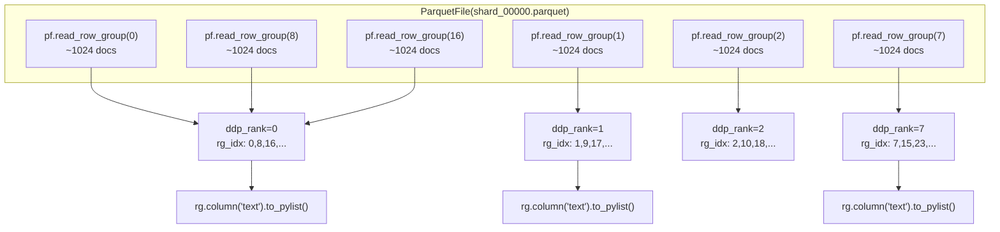
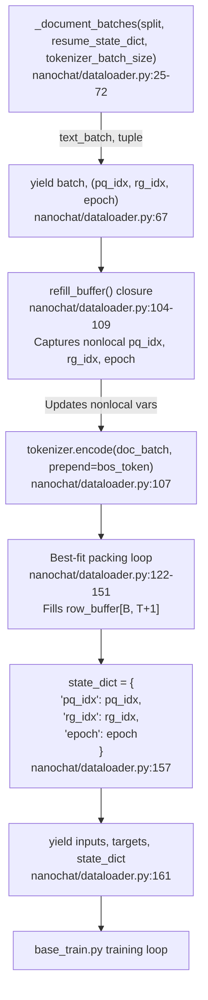
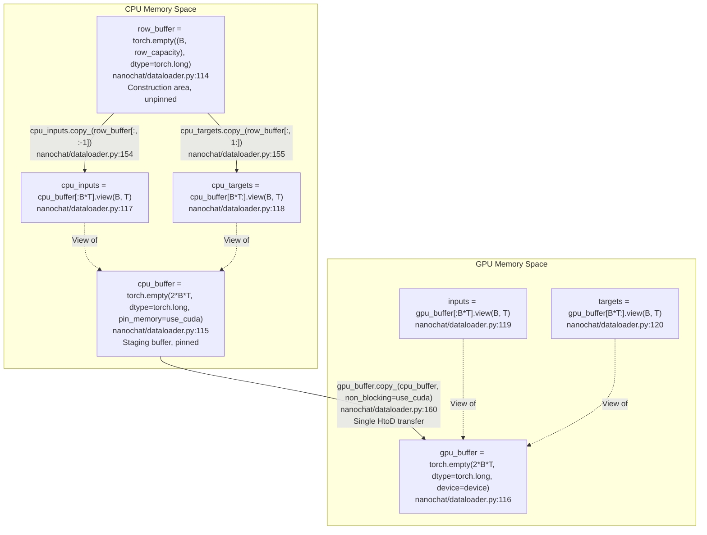
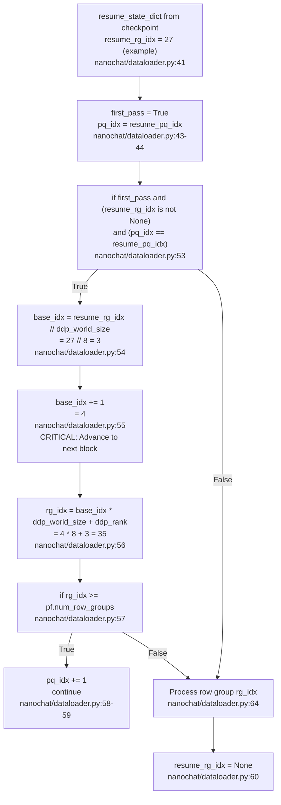

> [!WARNING]
> Imported from DeepWiki as generated, unverified repository documentation. Verify code-behavior claims against the revision below before stabilization.

# Distributed Data Loading and State Management

<details>
<summary>Relevant source files</summary>

The following files were used as context for generating this wiki page:

- [nanochat/dataloader.py](https://github.com/karpathy/nanochat/blob/92d63d4e8bb4df75c3b71618f31ddde2378b2bcd/nanochat/dataloader.py)
- [nanochat/dataset.py](https://github.com/karpathy/nanochat/blob/92d63d4e8bb4df75c3b71618f31ddde2378b2bcd/nanochat/dataset.py)

</details>


## Purpose and Scope

This page documents how nanochat distributes data across multiple GPUs during training and manages state for exact resumption. The system implements DDP (Distributed Data Parallel) sharding at the row group level, uses pinned memory buffers for efficient host-to-device transfers, and tracks `(pq_idx, rg_idx, epoch)` state to enable resumption without data repetition.

For the overall BOS-aligned best-fit packing algorithm, see 6.2. For DDP training setup and gradient synchronization, see 8.2. For checkpoint saving and loading, see 11.1.

---

## DDP Sharding Strategy

### Row Group Level Sharding

The dataloader implements row group level sharding where each rank processes a disjoint subset of row groups from the parquet files. Each rank starts at `offset=ddp_rank` and advances by `step=ddp_world_size`:

- **Rank 0**: processes row groups 0, 8, 16, 24, ...
- **Rank 1**: processes row groups 1, 9, 17, 25, ...
- **Rank 7**: processes row groups 7, 15, 23, 31, ...

This ensures that no two ranks ever see the same data, eliminating redundant computation while maintaining deterministic ordering.

**DDP Sharding via rg_idx Offset and Stride**



**Why Row Groups?** Parquet files organize data into row groups. Sharding at this level provides:
- **Efficient I/O**: Reads entire row groups without seeking via `pf.read_row_group(rg_idx)` [nanochat/dataloader.py:64](https://github.com/karpathy/nanochat/blob/92d63d4e8bb4df75c3b71618f31ddde2378b2bcd/nanochat/dataloader.py#L64).
- **Balanced Load**: Each row group has a fixed number of documents.
- **Deterministic Ordering**: Fixed mapping from `(pq_idx, rg_idx)` to data.

Sources: [nanochat/dataloader.py:33-68](https://github.com/karpathy/nanochat/blob/92d63d4e8bb4df75c3b71618f31ddde2378b2bcd/nanochat/dataloader.py#L33-L68), [nanochat/dataset.py:77-81](https://github.com/karpathy/nanochat/blob/92d63d4e8bb4df75c3b71618f31ddde2378b2bcd/nanochat/dataset.py#L77-L81)

### Implementation in `_document_batches`

The sharding logic is implemented in the `_document_batches` generator function. The function retrieves DDP configuration using `get_dist_info()` [nanochat/dataloader.py:33](https://github.com/karpathy/nanochat/blob/92d63d4e8bb4df75c3b71618f31ddde2378b2bcd/nanochat/dataloader.py#L33) and implements strided iteration:

```python
# Core sharding pattern from nanochat/dataloader.py:33-68
ddp, ddp_rank, ddp_local_rank, ddp_world_size = get_dist_info()
# ...
rg_idx = ddp_rank  # Start at rank offset
while rg_idx < pf.num_row_groups:
    rg = pf.read_row_group(rg_idx)
    batch = rg.column('text').to_pylist()
    # ... yield batches ...
    rg_idx += ddp_world_size  # Advance by world size
```

The variable `rg_idx` acts as both the row group identifier and the sharding mechanism. By initializing to `ddp_rank` and incrementing by `ddp_world_size`, each rank processes a disjoint subset.

Sources: [nanochat/dataloader.py:25-72](https://github.com/karpathy/nanochat/blob/92d63d4e8bb4df75c3b71618f31ddde2378b2bcd/nanochat/dataloader.py#L25-L72), [nanochat/common.py:150-160](https://github.com/karpathy/nanochat/blob/92d63d4e8bb4df75c3b71618f31ddde2378b2bcd/nanochat/common.py#L150-L160)

---

## State Tracking for Resumption

### The State Tuple: `(pq_idx, rg_idx, epoch)`

The dataloader tracks three indices to enable exact resumption:

| Field | Type | Description |
|-------|------|-------------|
| `pq_idx` | `int` | Index into the list of parquet files (0 to num_files-1) [nanochat/dataloader.py:44](https://github.com/karpathy/nanochat/blob/92d63d4e8bb4df75c3b71618f31ddde2378b2bcd/nanochat/dataloader.py#L44) |
| `rg_idx` | `int` | **Global** row group index within the current parquet file [nanochat/dataloader.py:63](https://github.com/karpathy/nanochat/blob/92d63d4e8bb4df75c3b71618f31ddde2378b2bcd/nanochat/dataloader.py#L63) |
| `epoch` | `int` | Number of complete passes through the dataset (starts at 1) [nanochat/dataloader.py:42](https://github.com/karpathy/nanochat/blob/92d63d4e8bb4df75c3b71618f31ddde2378b2bcd/nanochat/dataloader.py#L42) |

**Important**: `rg_idx` is the **global row group index**, not the rank-local index. For example, if Rank 3 processes row group 27, it yields `rg_idx=27` in the state dict, not the local count.

Sources: [nanochat/dataloader.py:29-31](https://github.com/karpathy/nanochat/blob/92d63d4e8bb4df75c3b71618f31ddde2378b2bcd/nanochat/dataloader.py#L29-L31), [nanochat/dataloader.py:157](https://github.com/karpathy/nanochat/blob/92d63d4e8bb4df75c3b71618f31ddde2378b2bcd/nanochat/dataloader.py#L157)

### State Propagation Through the System

**State Flow: _document_batches to Checkpoint**



The state tuple propagates through several layers:
1. **Generated** by `_document_batches` each time a new text batch is fetched from a row group [nanochat/dataloader.py:67](https://github.com/karpathy/nanochat/blob/92d63d4e8bb4df75c3b71618f31ddde2378b2bcd/nanochat/dataloader.py#L67).
2. **Captured** by the `refill_buffer` closure using `nonlocal` declarations [nanochat/dataloader.py:104-109](https://github.com/karpathy/nanochat/blob/92d63d4e8bb4df75c3b71618f31ddde2378b2bcd/nanochat/dataloader.py#L104-L109).
3. **Packaged** into `state_dict` before yielding [nanochat/dataloader.py:157](https://github.com/karpathy/nanochat/blob/92d63d4e8bb4df75c3b71618f31ddde2378b2bcd/nanochat/dataloader.py#L157).
4. **Yielded** alongside `inputs` and `targets` tensors [nanochat/dataloader.py:161](https://github.com/karpathy/nanochat/blob/92d63d4e8bb4df75c3b71618f31ddde2378b2bcd/nanochat/dataloader.py#L161).

Sources: [nanochat/dataloader.py:99-161](https://github.com/karpathy/nanochat/blob/92d63d4e8bb4df75c3b71618f31ddde2378b2bcd/nanochat/dataloader.py#L99-L161)

### Multi-Epoch Support

The dataloader supports infinite iteration across epochs. When all parquet files have been exhausted, it loops back to the beginning and increments the epoch counter:

```python
# From nanochat/dataloader.py:47-71
while True:  # iterate infinitely (multi-epoch)
    pq_idx = resume_pq_idx if first_pass else 0
    while pq_idx < len(parquet_paths):
        # ... process file ...
        pq_idx += 1
    first_pass = False
    epoch += 1
```

The epoch counter enables analysis of training dynamics across multiple passes through the data.

Sources: [nanochat/dataloader.py:47-71](https://github.com/karpathy/nanochat/blob/92d63d4e8bb4df75c3b71618f31ddde2378b2bcd/nanochat/dataloader.py#L47-L71)

---

## Memory Management and Efficient Transfer

### Pinned Memory Architecture

The dataloader uses pinned memory (page-locked CPU memory) to enable fast asynchronous GPU transfers. This optimization reduces the host-to-device transfer overhead from a bottleneck to near-negligible.

**Buffer Allocation and Transfer Pattern (Lines 111-161)**



This design implements three key optimizations:

1. **Single Allocation**: `cpu_buffer` and `gpu_buffer` are allocated once outside the `while True` loop [nanochat/dataloader.py:115-116](https://github.com/karpathy/nanochat/blob/92d63d4e8bb4df75c3b71618f31ddde2378b2bcd/nanochat/dataloader.py#L115-L116).
2. **Contiguous Layout**: Inputs and targets are packed into a single tensor `[inputs | targets]` for a single transfer [nanochat/dataloader.py:115-120](https://github.com/karpathy/nanochat/blob/92d63d4e8bb4df75c3b71618f31ddde2378b2bcd/nanochat/dataloader.py#L115-L120).
3. **Asynchronous Transfer**: `non_blocking=True` allows GPU transfer to overlap with CPU computation [nanochat/dataloader.py:160](https://github.com/karpathy/nanochat/blob/92d63d4e8bb4df75c3b71618f31ddde2378b2bcd/nanochat/dataloader.py#L160).

Sources: [nanochat/dataloader.py:111-161](https://github.com/karpathy/nanochat/blob/92d63d4e8bb4df75c3b71618f31ddde2378b2bcd/nanochat/dataloader.py#L111-L161)

---

## Exact Resumption Mechanism

### Avoiding Data Repetition

When resuming from a checkpoint, the dataloader must avoid repeating data that was already processed. The challenge: the state dict captures the global `rg_idx` of the last batch yielded, but each rank has its own local position in the strided iteration.

**Resume Logic in _document_batches (Lines 52-60)**



The critical operation is the `base_idx += 1` increment on line 55:

```python
# From nanochat/dataloader.py:52-60
if first_pass and (resume_rg_idx is not None) and (pq_idx == resume_pq_idx):
    base_idx = resume_rg_idx // ddp_world_size
    base_idx += 1  # advance by 1 so we don't repeat data after resuming
    rg_idx = base_idx * ddp_world_size + ddp_rank
    if rg_idx >= pf.num_row_groups:
        pq_idx += 1
        continue
    resume_rg_idx = None  # only do this once
```

Without the `+= 1`, each rank would reprocess the row group stored in `resume_rg_idx`. With it, each rank jumps to the next block in its stride.

Sources: [nanochat/dataloader.py:52-60](https://github.com/karpathy/nanochat/blob/92d63d4e8bb4df75c3b71618f31ddde2378b2bcd/nanochat/dataloader.py#L52-L60)

---

## Dataloader Function Signatures

### Key Functions and Signatures

**`_document_batches(split, resume_state_dict, tokenizer_batch_size)`**

Located at [nanochat/dataloader.py:25-72](https://github.com/karpathy/nanochat/blob/92d63d4e8bb4df75c3b71618f31ddde2378b2bcd/nanochat/dataloader.py#L25-L72), this generator implements the core DDP sharding and state tracking:

| Parameter | Type | Description |
|-----------|------|-------------|
| `split` | `str` | `"train"` or `"val"` - determines which parquet files to use [nanochat/dataloader.py:38](https://github.com/karpathy/nanochat/blob/92d63d4e8bb4df75c3b71618f31ddde2378b2bcd/nanochat/dataloader.py#L38) |
| `resume_state_dict` | `dict` or `None` | Dictionary with keys `{pq_idx, rg_idx, epoch}` for resumption [nanochat/dataloader.py:40-42](https://github.com/karpathy/nanochat/blob/92d63d4e8bb4df75c3b71618f31ddde2378b2bcd/nanochat/dataloader.py#L40-L42) |
| `tokenizer_batch_size` | `int` | Number of documents to batch for parallel tokenization [nanochat/dataloader.py:66-67](https://github.com/karpathy/nanochat/blob/92d63d4e8bb4df75c3b71618f31ddde2378b2bcd/nanochat/dataloader.py#L66-L67) |

**Yields**: `tuple` of `(text_batch, (pq_idx, rg_idx, epoch))` where `text_batch` is a list of document strings.

Sources: [nanochat/dataloader.py:25-32](https://github.com/karpathy/nanochat/blob/92d63d4e8bb4df75c3b71618f31ddde2378b2bcd/nanochat/dataloader.py#L25-L32)

---

**`tokenizing_distributed_data_loader_with_state_bos_bestfit(...)`**

Located at [nanochat/dataloader.py:74-161](https://github.com/karpathy/nanochat/blob/92d63d4e8bb4df75c3b71618f31ddde2378b2bcd/nanochat/dataloader.py#L74-L161), this is the main dataloader function that implements BOS-aligned best-fit packing with state tracking:

| Parameter | Type | Default | Description |
|-----------|------|---------|-------------|
| `tokenizer` | Tokenizer | - | Tokenizer instance for encoding text |
| `B` | `int` | - | Batch size |
| `T` | `int` | - | Sequence length |
| `split` | `str` | - | `"train"` or `"val"` |
| `tokenizer_threads` | `int` | `4` | Number of threads for parallel tokenization |
| `tokenizer_batch_size` | `int` | `128` | Documents per tokenization batch |
| `device` | `str` | `"cuda"` | Target device (`"cuda"` or `"cpu"`) |
| `resume_state_dict` | `dict` or `None` | `None` | State dict for resumption |
| `buffer_size` | `int` | `1000` | Number of documents to buffer for best-fit search |

**Yields**: `tuple` of `(inputs, targets, state_dict)` where:
- `inputs`: `torch.Tensor` of shape `(B, T)` on `device` [nanochat/dataloader.py:119](https://github.com/karpathy/nanochat/blob/92d63d4e8bb4df75c3b71618f31ddde2378b2bcd/nanochat/dataloader.py#L119)
- `targets`: `torch.Tensor` of shape `(B, T)` on `device` [nanochat/dataloader.py:120](https://github.com/karpathy/nanochat/blob/92d63d4e8bb4df75c3b71618f31ddde2378b2bcd/nanochat/dataloader.py#L120)
- `state_dict`: `dict` with keys `{pq_idx: int, rg_idx: int, epoch: int}` [nanochat/dataloader.py:157](https://github.com/karpathy/nanochat/blob/92d63d4e8bb4df75c3b71618f31ddde2378b2bcd/nanochat/dataloader.py#L157)

Sources: [nanochat/dataloader.py:74-95](https://github.com/karpathy/nanochat/blob/92d63d4e8bb4df75c3b71618f31ddde2378b2bcd/nanochat/dataloader.py#L74-L95)

---

## Related Utilities in `dataset.py`

### `list_parquet_files(data_dir=None, warn_on_legacy=False)`

Located at [nanochat/dataset.py:32-65](https://github.com/karpathy/nanochat/blob/92d63d4e8bb4df75c3b71618f31ddde2378b2bcd/nanochat/dataset.py#L32-L65), this utility function:
- Returns a sorted list of full paths to all `.parquet` files in the data directory [nanochat/dataset.py:60-64](https://github.com/karpathy/nanochat/blob/92d63d4e8bb4df75c3b71618f31ddde2378b2bcd/nanochat/dataset.py#L60-L64).
- Handles legacy migration (ClimbMix-400B upgrade) with fallback to old `base_data` directory [nanochat/dataset.py:38-58](https://github.com/karpathy/nanochat/blob/92d63d4e8bb4df75c3b71618f31ddde2378b2bcd/nanochat/dataset.py#L38-L58).
- Filters out incomplete downloads (files ending in `.tmp`) [nanochat/dataset.py:62](https://github.com/karpathy/nanochat/blob/92d63d4e8bb4df75c3b71618f31ddde2378b2bcd/nanochat/dataset.py#L62).

Sources: [nanochat/dataset.py:32-65](https://github.com/karpathy/nanochat/blob/92d63d4e8bb4df75c3b71618f31ddde2378b2bcd/nanochat/dataset.py#L32-L65)

### `parquets_iter_batched(split, start=0, step=1)`

Located at [nanochat/dataset.py:67-81](https://github.com/karpathy/nanochat/blob/92d63d4e8bb4df75c3b71618f31ddde2378b2bcd/nanochat/dataset.py#L67-L81), this is a simpler iterator that demonstrates the same DDP sharding pattern:

| Parameter | Description |
|-----------|-------------|
| `split` | `"train"` or `"val"` - last parquet is validation [nanochat/dataset.py:75](https://github.com/karpathy/nanochat/blob/92d63d4e8bb4df75c3b71618f31ddde2378b2bcd/nanochat/dataset.py#L75) |
| `start` | Starting row group index (typically `ddp_rank` for DDP) [nanochat/dataset.py:78](https://github.com/karpathy/nanochat/blob/92d63d4e8bb4df75c3b71618f31ddde2378b2bcd/nanochat/dataset.py#L78) |
| `step` | Stride for iteration (typically `ddp_world_size` for DDP) [nanochat/dataset.py:78](https://github.com/karpathy/nanochat/blob/92d63d4e8bb4df75c3b71618f31ddde2378b2bcd/nanochat/dataset.py#L78) |

Sources: [nanochat/dataset.py:67-81](https://github.com/karpathy/nanochat/blob/92d63d4e8bb4df75c3b71618f31ddde2378b2bcd/nanochat/dataset.py#L67-L81)

---

## Summary

The distributed data loading system achieves:

1. **Zero Overlap**: DDP sharding at row group level ensures no rank processes the same data [nanochat/dataloader.py:68](https://github.com/karpathy/nanochat/blob/92d63d4e8bb4df75c3b71618f31ddde2378b2bcd/nanochat/dataloader.py#L68).
2. **Exact Resumption**: State tracking via `(pq_idx, rg_idx, epoch)` with careful "+1 advance" logic [nanochat/dataloader.py:52-60](https://github.com/karpathy/nanochat/blob/92d63d4e8bb4df75c3b71618f31ddde2378b2bcd/nanochat/dataloader.py#L52-L60).
3. **Memory Efficiency**: Pinned memory buffers and single HtoD transfer per batch [nanochat/dataloader.py:115-160](https://github.com/karpathy/nanochat/blob/92d63d4e8bb4df75c3b71618f31ddde2378b2bcd/nanochat/dataloader.py#L115-L160).
4. **Multi-Epoch Support**: Infinite iteration with epoch counting [nanochat/dataloader.py:47-71](https://github.com/karpathy/nanochat/blob/92d63d4e8bb4df75c3b71618f31ddde2378b2bcd/nanochat/dataloader.py#L47-L71).
5. **ClimbMix Dataset Integration**: Automated downloading and shard management for the 400B token dataset [nanochat/dataset.py:20-30](https://github.com/karpathy/nanochat/blob/92d63d4e8bb4df75c3b71618f31ddde2378b2bcd/nanochat/dataset.py#L20-L30).

Sources: [nanochat/dataloader.py:1-167](https://github.com/karpathy/nanochat/blob/92d63d4e8bb4df75c3b71618f31ddde2378b2bcd/nanochat/dataloader.py#L1-L167), [nanochat/dataset.py:1-161](https://github.com/karpathy/nanochat/blob/92d63d4e8bb4df75c3b71618f31ddde2378b2bcd/nanochat/dataset.py#L1-L161)
