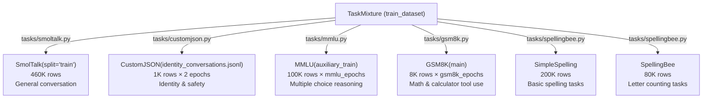
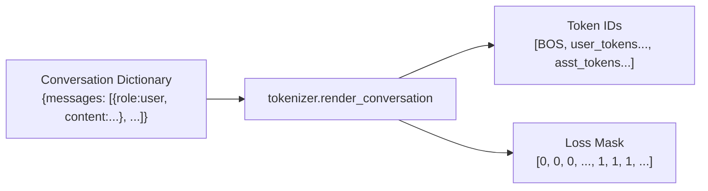
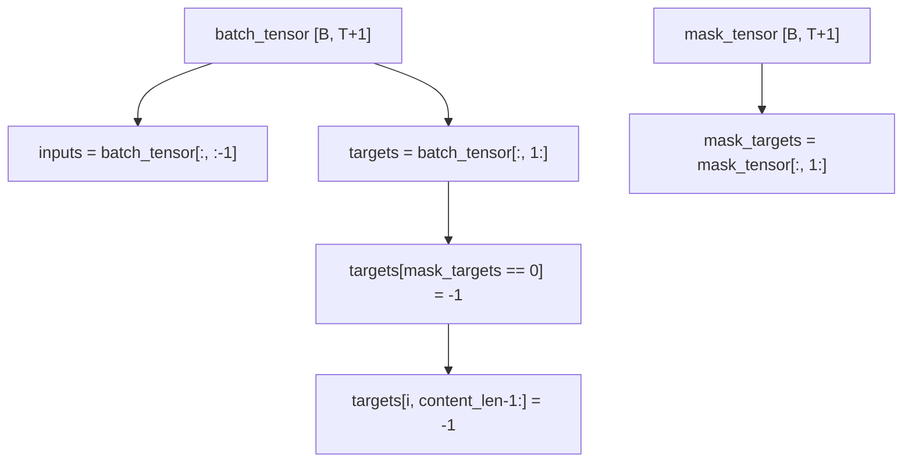
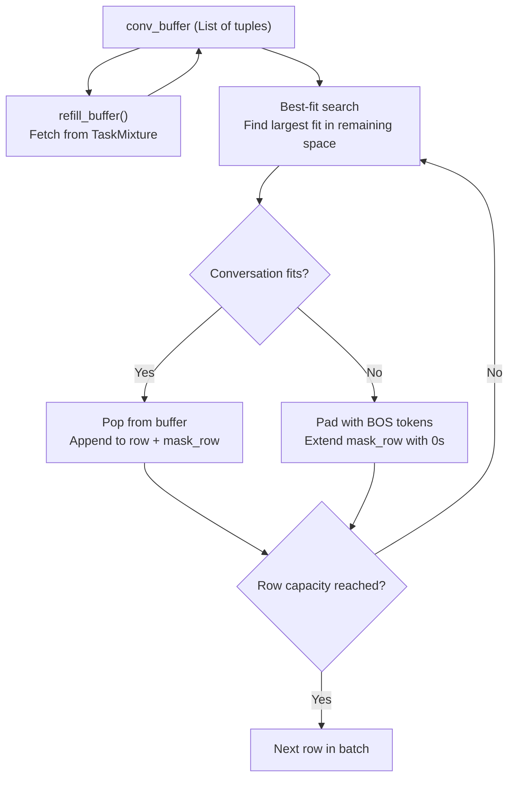
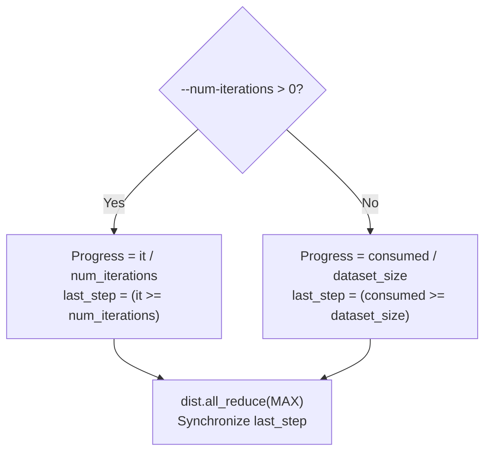

> [!WARNING]
> Imported from DeepWiki as generated, unverified repository documentation. Verify code-behavior claims against the revision below before stabilization.

# SFT Data Loader and Task Mixture

<details>
<summary>Relevant source files</summary>

The following files were used as context for generating this wiki page:

- [scripts/chat_sft.py](https://github.com/karpathy/nanochat/blob/92d63d4e8bb4df75c3b71618f31ddde2378b2bcd/scripts/chat_sft.py)
- [tasks/common.py](https://github.com/karpathy/nanochat/blob/92d63d4e8bb4df75c3b71618f31ddde2378b2bcd/tasks/common.py)

</details>


## Purpose and Scope

The SFT (Supervised Fine-Tuning) data loader is responsible for preparing conversational data for fine-tuning a pretrained base model into a chat-capable assistant. Unlike the base pretraining data loader which processes raw text documents (see 6.2), the SFT loader handles structured conversations with user-assistant turns, loss masking to train only on assistant responses, and a curated mixture of tasks designed to teach specific capabilities.

This page documents the SFT-specific dataloader implementation in `scripts/chat_sft.py`, the task mixture composition, conversation rendering, and how loss masking ensures the model learns to generate appropriate assistant responses.

Sources: [scripts/chat_sft.py:35-68](https://github.com/karpathy/nanochat/blob/92d63d4e8bb4df75c3b71618f31ddde2378b2bcd/scripts/chat_sft.py#L35-L68), [scripts/chat_sft.py:163-308](https://github.com/karpathy/nanochat/blob/92d63d4e8bb4df75c3b71618f31ddde2378b2bcd/scripts/chat_sft.py#L163-L308)

---

## Task Mixture Composition

The SFT training data consists of a carefully designed mixture of tasks, each teaching different capabilities. The mixture is controlled by `TaskMixture` which deterministically shuffles examples from multiple `Task` sources [tasks/common.py:129-148](https://github.com/karpathy/nanochat/blob/92d63d4e8bb4df75c3b71618f31ddde2378b2bcd/tasks/common.py#L129-L148).

### Training Task Mixture



**Task mixture details**

| Task | Source | Rows | Default Epochs | Purpose |
|------|--------|------|----------------|---------|
| `SmolTalk` | `HuggingFaceTB/smol-smoltalk` | 460K | 1 | General conversational ability [tasks/smoltalk.py:9-16](https://github.com/karpathy/nanochat/blob/92d63d4e8bb4df75c3b71618f31ddde2378b2bcd/tasks/smoltalk.py#L9-L16) |
| `CustomJSON` | `identity_conversations.jsonl` | 1K | 2 | Identity, safety, refusals [scripts/chat_sft.py:168](https://github.com/karpathy/nanochat/blob/92d63d4e8bb4df75c3b71618f31ddde2378b2bcd/scripts/chat_sft.py#L168) |
| `MMLU` | `cais/mmlu` (auxiliary_train) | 100K | 3 | Multiple choice format, knowledge [scripts/chat_sft.py:65](https://github.com/karpathy/nanochat/blob/92d63d4e8bb4df75c3b71618f31ddde2378b2bcd/scripts/chat_sft.py#L65), [tasks/mmlu.py:9-12](https://github.com/karpathy/nanochat/blob/92d63d4e8bb4df75c3b71618f31ddde2378b2bcd/tasks/mmlu.py#L9-L12) |
| `GSM8K` | `openai/gsm8k` (main) | 8K | 4 | Math reasoning, calculator tool [scripts/chat_sft.py:66](https://github.com/karpathy/nanochat/blob/92d63d4e8bb4df75c3b71618f31ddde2378b2bcd/scripts/chat_sft.py#L66), [tasks/gsm8k.py:37-43](https://github.com/karpathy/nanochat/blob/92d63d4e8bb4df75c3b71618f31ddde2378b2bcd/tasks/gsm8k.py#L37-L43) |
| `SimpleSpelling` | Synthetic | 200K | 1 | Basic spelling ("spell 'apple'") [scripts/chat_sft.py:171](https://github.com/karpathy/nanochat/blob/92d63d4e8bb4df75c3b71618f31ddde2378b2bcd/scripts/chat_sft.py#L171) |
| `SpellingBee` | Synthetic | 80K | 1 | Letter counting ("how many 'r' in 'strawberry'") [scripts/chat_sft.py:172](https://github.com/karpathy/nanochat/blob/92d63d4e8bb4df75c3b71618f31ddde2378b2bcd/scripts/chat_sft.py#L172) |

The total training mixture size is approximately **~1M rows** with default settings. The validation mixture mirrors this composition with smaller test splits [scripts/chat_sft.py:176-180](https://github.com/karpathy/nanochat/blob/92d63d4e8bb4df75c3b71618f31ddde2378b2bcd/scripts/chat_sft.py#L176-L180).

### Configurable Epoch Multipliers

The `--mmlu-epochs` and `--gsm8k-epochs` arguments control task emphasis by passing the task objects into the `TaskMixture` list multiple times [scripts/chat_sft.py:169-170](https://github.com/karpathy/nanochat/blob/92d63d4e8bb4df75c3b71618f31ddde2378b2bcd/scripts/chat_sft.py#L169-L170). This allows tuning the relative importance of multiple choice reasoning versus math/tool use without modifying code [scripts/chat_sft.py:65-66](https://github.com/karpathy/nanochat/blob/92d63d4e8bb4df75c3b71618f31ddde2378b2bcd/scripts/chat_sft.py#L65-L66).

Sources: [scripts/chat_sft.py:163-180](https://github.com/karpathy/nanochat/blob/92d63d4e8bb4df75c3b71618f31ddde2378b2bcd/scripts/chat_sft.py#L163-L180), [tasks/common.py:129-161](https://github.com/karpathy/nanochat/blob/92d63d4e8bb4df75c3b71618f31ddde2378b2bcd/tasks/common.py#L129-L161), [tasks/gsm8k.py:37-43](https://github.com/karpathy/nanochat/blob/92d63d4e8bb4df75c3b71618f31ddde2378b2bcd/tasks/gsm8k.py#L37-L43), [tasks/smoltalk.py:9-16](https://github.com/karpathy/nanochat/blob/92d63d4e8bb4df75c3b71618f31ddde2378b2bcd/tasks/smoltalk.py#L9-L16)

---

## Conversation Rendering and Loss Masking

### Conversation Structure

Each task provides conversations as structured data with user and assistant turns. The `tokenizer.render_conversation` method converts these into token sequences with an associated loss mask [scripts/chat_sft.py:215](https://github.com/karpathy/nanochat/blob/92d63d4e8bb4df75c3b71618f31ddde2378b2bcd/scripts/chat_sft.py#L215). For tasks like `GSM8K`, this rendering includes parsing tool-use tags (e.g., `<<expr=result>>`) into specific token types like `python` and `python_output` [tasks/gsm8k.py:59-81](https://github.com/karpathy/nanochat/blob/92d63d4e8bb4df75c3b71618f31ddde2378b2bcd/tasks/gsm8k.py#L59-L81). `MMLU` uses a specific `render_mc` function to ensure multiple-choice letters are rendered without leading whitespace to match the assistant's expected response token [tasks/mmlu.py:35-47](https://github.com/karpathy/nanochat/blob/92d63d4e8bb4df75c3b71618f31ddde2378b2bcd/tasks/mmlu.py#L35-L47).



**Loss Mask Semantics**

The loss mask determines which tokens contribute to the training loss:

| Mask Value | Meaning | Examples |
|------------|---------|----------|
| `0` | Ignore (no loss) | BOS token, user prompts, special tokens, tool outputs [scripts/chat_sft.py:296](https://github.com/karpathy/nanochat/blob/92d63d4e8bb4df75c3b71618f31ddde2378b2bcd/scripts/chat_sft.py#L296) |
| `1` | Train (compute loss) | Assistant responses [scripts/chat_sft.py:292](https://github.com/karpathy/nanochat/blob/92d63d4e8bb4df75c3b71618f31ddde2378b2bcd/scripts/chat_sft.py#L292) |

This ensures the model learns to generate only assistant content, not user prompts or system tokens [scripts/chat_sft.py:292-297](https://github.com/karpathy/nanochat/blob/92d63d4e8bb4df75c3b71618f31ddde2378b2bcd/scripts/chat_sft.py#L292-L297).

### Target Masking Implementation

The targets tensor is created by shifting the input sequence by one position (next-token prediction), then masked positions are set to `-1` (PyTorch's `ignore_index` for cross-entropy loss):



Two types of masking are applied:
1. **Conversation masking**: Positions with `mask=0` (user prompts, special tokens) are set to `-1` [scripts/chat_sft.py:296-297](https://github.com/karpathy/nanochat/blob/92d63d4e8bb4df75c3b71618f31ddde2378b2bcd/scripts/chat_sft.py#L296-L297).
2. **Padding masking**: For padded rows, positions beyond content length are set to `-1` [scripts/chat_sft.py:300-303](https://github.com/karpathy/nanochat/blob/92d63d4e8bb4df75c3b71618f31ddde2378b2bcd/scripts/chat_sft.py#L300-L303).

Sources: [scripts/chat_sft.py:215](https://github.com/karpathy/nanochat/blob/92d63d4e8bb4df75c3b71618f31ddde2378b2bcd/scripts/chat_sft.py#L215), [scripts/chat_sft.py:289-303](https://github.com/karpathy/nanochat/blob/92d63d4e8bb4df75c3b71618f31ddde2378b2bcd/scripts/chat_sft.py#L289-L303), [tasks/gsm8k.py:59-81](https://github.com/karpathy/nanochat/blob/92d63d4e8bb4df75c3b71618f31ddde2378b2bcd/tasks/gsm8k.py#L59-L81), [tasks/mmlu.py:35-47](https://github.com/karpathy/nanochat/blob/92d63d4e8bb4df75c3b71618f31ddde2378b2bcd/tasks/mmlu.py#L35-L47)

---

## BOS-Aligned Best-Fit Packing with Padding

### Packing Algorithm Overview

The SFT loader uses a BOS-aligned best-fit algorithm similar to base pretraining, but with a critical difference: **padding instead of cropping** when no conversation fits.



**Key Difference from Base Pretraining**: Base pretraining crops the shortest document when nothing fits. SFT **pads** instead of cropping because conversations are curated and discarding partial conversations would lose coherence. Padding is masked out via `targets[i, content_len-1:] = -1` [scripts/chat_sft.py:300-303](https://github.com/karpathy/nanochat/blob/92d63d4e8bb4df75c3b71618f31ddde2378b2bcd/scripts/chat_sft.py#L300-L303).

Sources: [scripts/chat_sft.py:187-306](https://github.com/karpathy/nanochat/blob/92d63d4e8bb4df75c3b71618f31ddde2378b2bcd/scripts/chat_sft.py#L187-L306), [scripts/chat_sft.py:253-260](https://github.com/karpathy/nanochat/blob/92d63d4e8bb4df75c3b71618f31ddde2378b2bcd/scripts/chat_sft.py#L253-L260)

### Packing Algorithm Details

**Conversation Buffer Management**
The buffer maintains a pool of tokenized conversations. Each rank offsets its `cursor` by `ddp_rank` and steps by `ddp_world_size` to avoid data duplication in DDP [scripts/chat_sft.py:206-220](https://github.com/karpathy/nanochat/blob/92d63d4e8bb4df75c3b71618f31ddde2378b2bcd/scripts/chat_sft.py#L206-L220).

**Best-Fit Search**
For each row, the algorithm searches `conv_buffer` for the largest conversation that fits in the `remaining` space. If `best_idx >= 0`, the conversation is popped and appended. Otherwise, the row is marked as `padded` [scripts/chat_sft.py:238-260](https://github.com/karpathy/nanochat/blob/92d63d4e8bb4df75c3b71618f31ddde2378b2bcd/scripts/chat_sft.py#L238-L260).

**Row Length Tracking**
To properly mask padding in targets, each row tracks its content length:
```python
row_lengths = []  # Track actual content length per row
if padded:
    row_lengths.append(content_len)  # Length before padding
else:
    row_lengths.append(row_capacity)  # Full row
```
This enables precise padding masking: `targets[i, content_len-1:] = -1` [scripts/chat_sft.py:262-266](https://github.com/karpathy/nanochat/blob/92d63d4e8bb4df75c3b71618f31ddde2378b2bcd/scripts/chat_sft.py#L262-L266), [scripts/chat_sft.py:300-303](https://github.com/karpathy/nanochat/blob/92d63d4e8bb4df75c3b71618f31ddde2378b2bcd/scripts/chat_sft.py#L300-L303).

Sources: [scripts/chat_sft.py:206-268](https://github.com/karpathy/nanochat/blob/92d63d4e8bb4df75c3b71618f31ddde2378b2bcd/scripts/chat_sft.py#L206-L268), [scripts/chat_sft.py:238-260](https://github.com/karpathy/nanochat/blob/92d63d4e8bb4df75c3b71618f31ddde2378b2bcd/scripts/chat_sft.py#L238-L260)

---

## Progress Tracking and Stopping Conditions

### Dataset-Driven Stopping

Unlike base pretraining which usually runs for a fixed token count, SFT can operate in two modes:

1. **Fixed iterations** (`--num-iterations > 0`): Stops after specified steps [scripts/chat_sft.py:273](https://github.com/karpathy/nanochat/blob/92d63d4e8bb4df75c3b71618f31ddde2378b2bcd/scripts/chat_sft.py#L273).
2. **Full epoch** (`--num-iterations = -1`): Stops after consuming entire dataset once [scripts/chat_sft.py:277](https://github.com/karpathy/nanochat/blob/92d63d4e8bb4df75c3b71618f31ddde2378b2bcd/scripts/chat_sft.py#L277).



The `consumed` counter tracks actual consumption (incremented when a conversation is popped from the buffer), distinct from `cursor` which tracks fetching [scripts/chat_sft.py:252](https://github.com/karpathy/nanochat/blob/92d63d4e8bb4df75c3b71618f31ddde2378b2bcd/scripts/chat_sft.py#L252), [scripts/chat_sft.py:276-284](https://github.com/karpathy/nanochat/blob/92d63d4e8bb4df75c3b71618f31ddde2378b2bcd/scripts/chat_sft.py#L276-L284).

### Distributed Synchronization

In DDP, the `last_step` flag must be synchronized across all ranks to prevent hangs if one rank finishes slightly earlier due to packing variance [scripts/chat_sft.py:341-344](https://github.com/karpathy/nanochat/blob/92d63d4e8bb4df75c3b71618f31ddde2378b2bcd/scripts/chat_sft.py#L341-L344).

Sources: [scripts/chat_sft.py:272-284](https://github.com/karpathy/nanochat/blob/92d63d4e8bb4df75c3b71618f31ddde2378b2bcd/scripts/chat_sft.py#L272-L284), [scripts/chat_sft.py:341-344](https://github.com/karpathy/nanochat/blob/92d63d4e8bb4df75c3b71618f31ddde2378b2bcd/scripts/chat_sft.py#L341-L344)

---

## Memory and Tensor Construction

The SFT loader follows a multi-stage buffer architecture for efficient memory management:

1. **Row construction** (Python lists): Build `rows` and `mask_rows` via best-fit packing [scripts/chat_sft.py:224-268](https://github.com/karpathy/nanochat/blob/92d63d4e8bb4df75c3b71618f31ddde2378b2bcd/scripts/chat_sft.py#L224-L268).
2. **CPU tensor** (pinned memory): Convert to `torch.tensor(..., pin_memory=True)` for faster H2D transfer [scripts/chat_sft.py:288](https://github.com/karpathy/nanochat/blob/92d63d4e8bb4df75c3b71618f31ddde2378b2bcd/scripts/chat_sft.py#L288).
3. **GPU transfer** (non-blocking): Single `.to(device, non_blocking=True)` call [scripts/chat_sft.py:289-290](https://github.com/karpathy/nanochat/blob/92d63d4e8bb4df75c3b71618f31ddde2378b2bcd/scripts/chat_sft.py#L289-L290).

The mask tensor is transferred separately and applied to targets on the device to zero out user-side loss [scripts/chat_sft.py:295-297](https://github.com/karpathy/nanochat/blob/92d63d4e8bb4df75c3b71618f31ddde2378b2bcd/scripts/chat_sft.py#L295-L297).

Sources: [scripts/chat_sft.py:286-303](https://github.com/karpathy/nanochat/blob/92d63d4e8bb4df75c3b71618f31ddde2378b2bcd/scripts/chat_sft.py#L286-L303)
