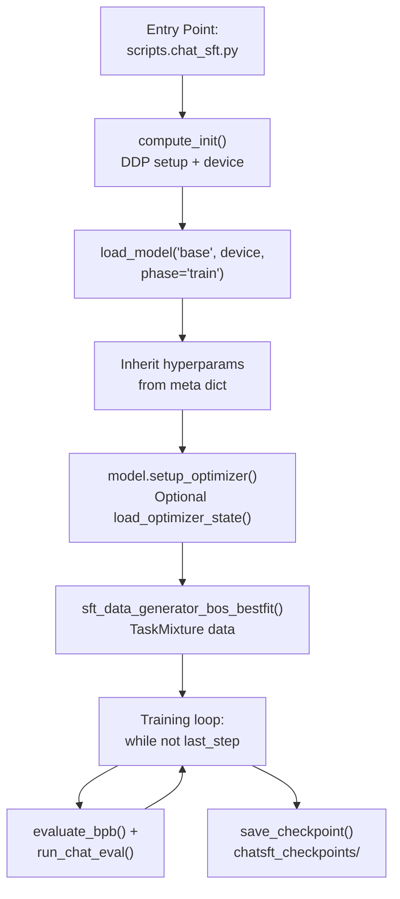
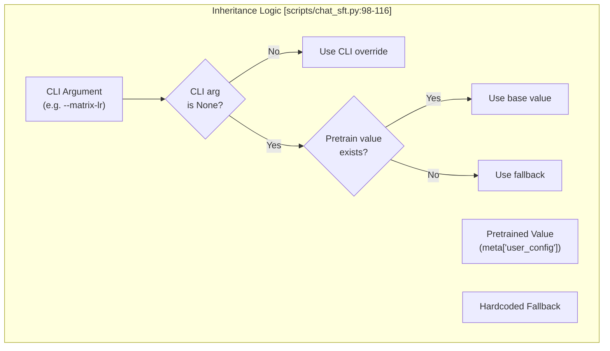
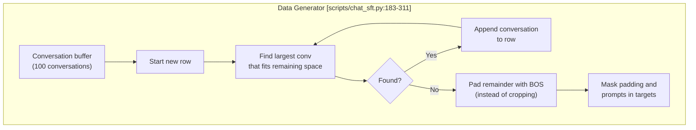

> [!WARNING]
> Imported from DeepWiki as generated, unverified repository documentation. Verify code-behavior claims against the revision below before stabilization.

# SFT Training Script

<details>
<summary>Relevant source files</summary>

The following files were used as context for generating this wiki page:

- [scripts/chat_sft.py](https://github.com/karpathy/nanochat/blob/92d63d4e8bb4df75c3b71618f31ddde2378b2bcd/scripts/chat_sft.py)

</details>


## Purpose and Scope

The `chat_sft.py` script at [scripts/chat_sft.py](https://github.com/karpathy/nanochat/blob/92d63d4e8bb4df75c3b71618f31ddde2378b2bcd/scripts/chat_sft.py) converts a pretrained base language model into a conversational chat model through supervised fine-tuning (SFT) on structured dialogue datasets. The script loads a base checkpoint, continues training on conversation data with loss masking, and produces a model capable of following chat formats with system/user/assistant roles and tool use (including calculator functionality).

The training duration is approximately 30 minutes on 8xH100 GPUs for a full epoch over the task mixture. For task composition details, see **7.2 Task Mixture and Data Sources**. For the ChatCORE evaluation metric, see **7.3 ChatCORE Evaluation**.

**Sources:** [scripts/chat_sft.py:1-10](https://github.com/karpathy/nanochat/blob/92d63d4e8bb4df75c3b71618f31ddde2378b2bcd/scripts/chat_sft.py#L1-L10), [scripts/chat_sft.py:28-34](https://github.com/karpathy/nanochat/blob/92d63d4e8bb4df75c3b71618f31ddde2378b2bcd/scripts/chat_sft.py#L28-L34)

---

## Script Architecture and Entry Point

The script can be executed in two modes:

1. **Single-process mode** (CPU/single GPU): `python -m scripts.chat_sft` [scripts/chat_sft.py:5](https://github.com/karpathy/nanochat/blob/92d63d4e8bb4df75c3b71618f31ddde2378b2bcd/scripts/chat_sft.py#L5)
2. **Distributed mode** (multi-GPU): `torchrun --standalone --nproc_per_node=8 -m scripts.chat_sft -- --device-batch-size=16` [scripts/chat_sft.py:9](https://github.com/karpathy/nanochat/blob/92d63d4e8bb4df75c3b71618f31ddde2378b2bcd/scripts/chat_sft.py#L9)

The script follows a structure designed to inherit state from base training while adapting to conversational data:

### SFT Training Flow


**Sources:** [scripts/chat_sft.py:72-94](https://github.com/karpathy/nanochat/blob/92d63d4e8bb4df75c3b71618f31ddde2378b2bcd/scripts/chat_sft.py#L72-L94), [scripts/chat_sft.py:118-151](https://github.com/karpathy/nanochat/blob/92d63d4e8bb4df75c3b71618f31ddde2378b2bcd/scripts/chat_sft.py#L118-L151), [scripts/chat_sft.py:183-200](https://github.com/karpathy/nanochat/blob/92d63d4e8bb4df75c3b71618f31ddde2378b2bcd/scripts/chat_sft.py#L183-L200), [scripts/chat_sft.py:314-422](https://github.com/karpathy/nanochat/blob/92d63d4e8bb4df75c3b71618f31ddde2378b2bcd/scripts/chat_sft.py#L314-L422)

---

## Command-Line Interface

The script accepts arguments organized into several categories:

### Logging and Runtime
| Argument | Type | Default | Description |
|----------|------|---------|-------------|
| `--run` | str | `"dummy"` | wandb run name [scripts/chat_sft.py:37](https://github.com/karpathy/nanochat/blob/92d63d4e8bb4df75c3b71618f31ddde2378b2bcd/scripts/chat_sft.py#L37) |
| `--device-type` | str | `""` | `cuda|cpu|mps` (empty = autodetect) [scripts/chat_sft.py:39](https://github.com/karpathy/nanochat/blob/92d63d4e8bb4df75c3b71618f31ddde2378b2bcd/scripts/chat_sft.py#L39) |

### Model Loading and Horizon
| Argument | Type | Default | Description |
|----------|------|---------|-------------|
| `--model-tag` | str | `None` | model tag to load from [scripts/chat_sft.py:41](https://github.com/karpathy/nanochat/blob/92d63d4e8bb4df75c3b71618f31ddde2378b2bcd/scripts/chat_sft.py#L41) |
| `--model-step` | int | `None` | model step to load from [scripts/chat_sft.py:42](https://github.com/karpathy/nanochat/blob/92d63d4e8bb4df75c3b71618f31ddde2378b2bcd/scripts/chat_sft.py#L42) |
| `--load-optimizer` | int | `1` | warm-start optimizer (0=no, 1=yes) [scripts/chat_sft.py:43](https://github.com/karpathy/nanochat/blob/92d63d4e8bb4df75c3b71618f31ddde2378b2bcd/scripts/chat_sft.py#L43) |
| `--num-iterations` | int | `-1` | steps (-1 = full epoch) [scripts/chat_sft.py:45](https://github.com/karpathy/nanochat/blob/92d63d4e8bb4df75c3b71618f31ddde2378b2bcd/scripts/chat_sft.py#L45) |

### Optimization (Defaults Inherited)
| Argument | Type | Default | Description |
|----------|------|---------|-------------|
| `--init-lr-frac` | float | `0.8` | initial LR as fraction of base LR [scripts/chat_sft.py:54](https://github.com/karpathy/nanochat/blob/92d63d4e8bb4df75c3b71618f31ddde2378b2bcd/scripts/chat_sft.py#L54) |
| `--warmup-ratio` | float | `0.0` | ratio of iterations for LR warmup [scripts/chat_sft.py:55](https://github.com/karpathy/nanochat/blob/92d63d4e8bb4df75c3b71618f31ddde2378b2bcd/scripts/chat_sft.py#L55) |
| `--warmdown-ratio` | float | `0.5` | ratio of iterations for LR warmdown [scripts/chat_sft.py:56](https://github.com/karpathy/nanochat/blob/92d63d4e8bb4df75c3b71618f31ddde2378b2bcd/scripts/chat_sft.py#L56) |

**Sources:** [scripts/chat_sft.py:35-68](https://github.com/karpathy/nanochat/blob/92d63d4e8bb4df75c3b71618f31ddde2378b2bcd/scripts/chat_sft.py#L35-L68)

---

## Model Loading and Hyperparameter Inheritance

### Loading the Pretrained Base Model
The script uses `load_model` (which wraps `load_model_from_dir` in [nanochat/checkpoint_manager.py:148-165](https://github.com/karpathy/nanochat/blob/92d63d4e8bb4df75c3b71618f31ddde2378b2bcd/nanochat/checkpoint_manager.py#L148-L165)) to retrieve the base weights and metadata.

```python
model, tokenizer, meta = load_model("base", device, phase="train", model_tag=args.model_tag, step=args.model_step)
```

**Sources:** [scripts/chat_sft.py:94](https://github.com/karpathy/nanochat/blob/92d63d4e8bb4df75c3b71618f31ddde2378b2bcd/scripts/chat_sft.py#L94), [nanochat/checkpoint_manager.py:148-165](https://github.com/karpathy/nanochat/blob/92d63d4e8bb4df75c3b71618f31ddde2378b2bcd/nanochat/checkpoint_manager.py#L148-L165)

### Hyperparameter Inheritance Logic
SFT inherits key hyperparameters from the base checkpoint when not explicitly overridden by CLI arguments.

### Inheritance Mapping


The inherited parameters include `max_seq_len`, `device_batch_size`, `total_batch_size`, `embedding_lr`, `unembedding_lr`, and `matrix_lr`.

**Sources:** [scripts/chat_sft.py:98-116](https://github.com/karpathy/nanochat/blob/92d63d4e8bb4df75c3b71618f31ddde2378b2bcd/scripts/chat_sft.py#L98-L116)

---

## Optimizer Configuration

### Optimizer Warm-Start
When `--load-optimizer=1` (default), the script loads optimizer state from the base checkpoint to warm-start momentum buffers via `load_optimizer_state` [nanochat/checkpoint_manager.py:167-168](https://github.com/karpathy/nanochat/blob/92d63d4e8bb4df75c3b71618f31ddde2378b2bcd/nanochat/checkpoint_manager.py#L167-L168).

**Critical Step:** After `optimizer.load_state_dict()`, the script restores the fresh SFT learning rates because `load_state_dict` overwrites the `lr` values with the near-zero values from the end of base training.

```python
if args.load_optimizer:
    optimizer_data = load_optimizer_state("base", device, rank=ddp_rank, model_tag=args.model_tag, step=args.model_step)
    if optimizer_data is not None:
        base_lrs = [group['lr'] for group in optimizer.param_groups]
        optimizer.load_state_dict(optimizer_data)
        for group, base_lr in zip(optimizer.param_groups, base_lrs):
            group['lr'] = base_lr
```

**Sources:** [scripts/chat_sft.py:140-151](https://github.com/karpathy/nanochat/blob/92d63d4e8bb4df75c3b71618f31ddde2378b2bcd/scripts/chat_sft.py#L140-L151), [nanochat/checkpoint_manager.py:167-168](https://github.com/karpathy/nanochat/blob/92d63d4e8bb4df75c3b71618f31ddde2378b2bcd/nanochat/checkpoint_manager.py#L167-L168)

### Learning Rate and Momentum Schedules
SFT uses a progress-based LR schedule (0.0 → 1.0) calculated by `get_lr_multiplier(progress)`.

- **LR Schedule:** Defaults to a constant phase followed by a linear warmdown over the second half of training (`warmdown_ratio=0.5`). [scripts/chat_sft.py:56](https://github.com/karpathy/nanochat/blob/92d63d4e8bb4df75c3b71618f31ddde2378b2bcd/scripts/chat_sft.py#L56), [scripts/chat_sft.py:314-321](https://github.com/karpathy/nanochat/blob/92d63d4e8bb4df75c3b71618f31ddde2378b2bcd/scripts/chat_sft.py#L314-L321)
- **Muon Momentum:** Ramped from 0.85 to 0.95 over the first 300 steps via `get_muon_momentum(step)`. [scripts/chat_sft.py:324-327](https://github.com/karpathy/nanochat/blob/92d63d4e8bb4df75c3b71618f31ddde2378b2bcd/scripts/chat_sft.py#L324-L327)

---

## Data Pipeline: BOS-Aligned Bestfit with Padding

### SFT Data Generator Architecture
The generator `sft_data_generator_bos_bestfit()` implements a packing algorithm that prioritizes conversation integrity.



**Key Difference from Base:** Unlike the base loader which crops long sequences, the SFT loader uses **padding** when no conversation in the buffer fits the remaining row capacity. This ensures conversations are never truncated. [scripts/chat_sft.py:252-260](https://github.com/karpathy/nanochat/blob/92d63d4e8bb4df75c3b71618f31ddde2378b2bcd/scripts/chat_sft.py#L252-L260)

### Target Masking
Two types of masking are applied to `targets`:
1. **Prompt Masking:** User prompts and system instructions are masked (set to -1) so the model only learns to predict assistant responses. [scripts/chat_sft.py:295-298](https://github.com/karpathy/nanochat/blob/92d63d4e8bb4df75c3b71618f31ddde2378b2bcd/scripts/chat_sft.py#L295-L298)
2. **Padding Masking:** Trailing BOS tokens used for padding are masked. [scripts/chat_sft.py:300-303](https://github.com/karpathy/nanochat/blob/92d63d4e8bb4df75c3b71618f31ddde2378b2bcd/scripts/chat_sft.py#L300-L303)

**Sources:** [scripts/chat_sft.py:183-311](https://github.com/karpathy/nanochat/blob/92d63d4e8bb4df75c3b71618f31ddde2378b2bcd/scripts/chat_sft.py#L183-L311)

---

## Training Loop and Evaluation

### Main Training Iteration
The training loop manages gradient accumulation, forward/backward passes, and periodic evaluation.

1. **Gradient Accumulation:** Calculated as `args.total_batch_size // world_tokens_per_fwdbwd`. [scripts/chat_sft.py:124](https://github.com/karpathy/nanochat/blob/92d63d4e8bb4df75c3b71618f31ddde2378b2bcd/scripts/chat_sft.py#L124)
2. **Evaluation:** Periodic validation BPB and ChatCORE metrics. [scripts/chat_sft.py:347-396](https://github.com/karpathy/nanochat/blob/92d63d4e8bb4df75c3b71618f31ddde2378b2bcd/scripts/chat_sft.py#L347-L396)
3. **Checkpointing:** Final model, optimizer state, and metadata are saved to `chatsft_checkpoints/` via `save_checkpoint` [nanochat/checkpoint_manager.py:41-58](https://github.com/karpathy/nanochat/blob/92d63d4e8bb4df75c3b71618f31ddde2378b2bcd/nanochat/checkpoint_manager.py#L41-L58).

### Evaluation Metrics
- **Validation BPB:** Bits-per-byte on the SFT task mixture validation split. [scripts/chat_sft.py:354](https://github.com/karpathy/nanochat/blob/92d63d4e8bb4df75c3b71618f31ddde2378b2bcd/scripts/chat_sft.py#L354)
- **ChatCORE:** A suite of tasks (ARC-Easy, ARC-Challenge, MMLU, GSM8K, HumanEval, SpellingBee) evaluated using `run_chat_eval`. [scripts/chat_sft.py:366-385](https://github.com/karpathy/nanochat/blob/92d63d4e8bb4df75c3b71618f31ddde2378b2bcd/scripts/chat_sft.py#L366-L385)

**Sources:** [scripts/chat_sft.py:314-474](https://github.com/karpathy/nanochat/blob/92d63d4e8bb4df75c3b71618f31ddde2378b2bcd/scripts/chat_sft.py#L314-L474), [nanochat/checkpoint_manager.py:41-58](https://github.com/karpathy/nanochat/blob/92d63d4e8bb4df75c3b71618f31ddde2378b2bcd/nanochat/checkpoint_manager.py#L41-L58)

---

## Memory Management

The script implements aggressive garbage collection to prevent stalls during the training loop:
- **Step 1:** `gc.collect()`, `gc.freeze()`, and `gc.disable()`. [scripts/chat_sft.py:492-495](https://github.com/karpathy/nanochat/blob/92d63d4e8bb4df75c3b71618f31ddde2378b2bcd/scripts/chat_sft.py#L492-L495)
- **Periodic:** Manual `gc.collect()` every 5000 steps. [scripts/chat_sft.py:496-497](https://github.com/karpathy/nanochat/blob/92d63d4e8bb4df75c3b71618f31ddde2378b2bcd/scripts/chat_sft.py#L496-L497)

**Sources:** [scripts/chat_sft.py:492-497](https://github.com/karpathy/nanochat/blob/92d63d4e8bb4df75c3b71618f31ddde2378b2bcd/scripts/chat_sft.py#L492-L497)
