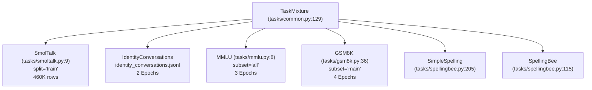
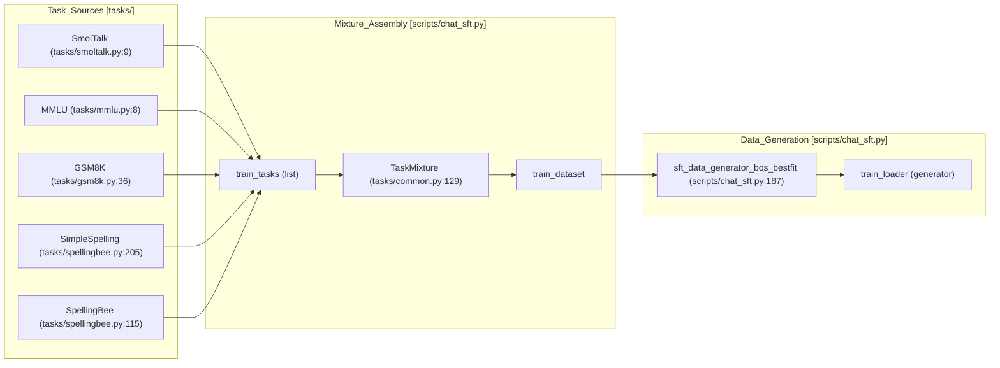
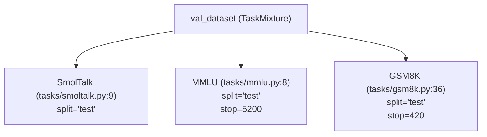
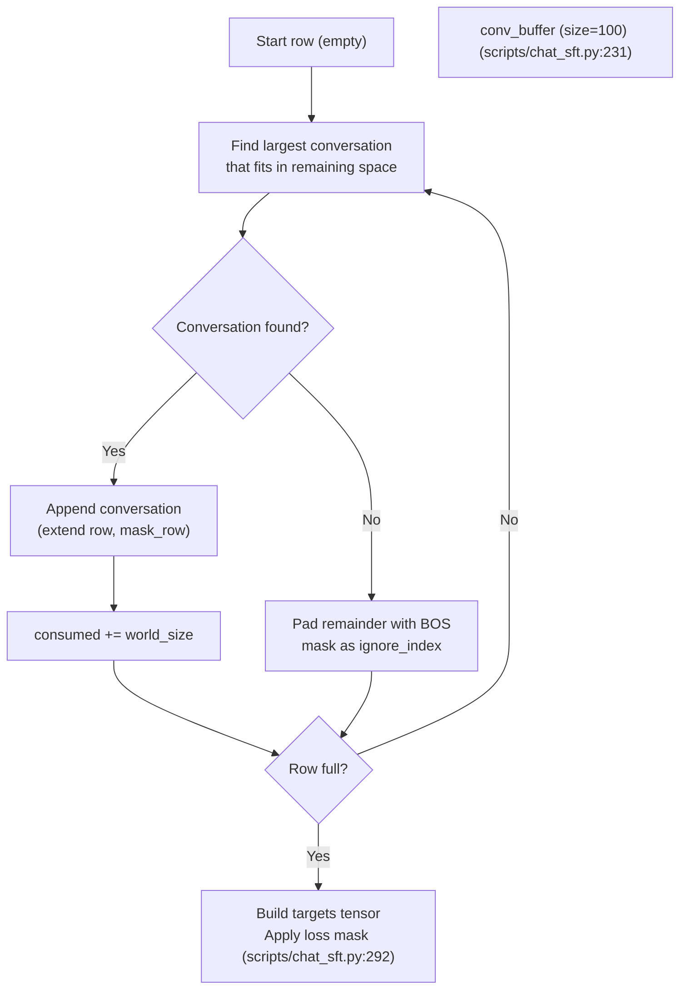

> [!WARNING]
> Imported from DeepWiki as generated, unverified repository documentation. Verify code-behavior claims against the revision below before stabilization.

# Task Mixture and Data Sources

Relevant source files

The following files were used as context for generating this wiki page:

- [scripts/chat_sft.py](https://github.com/karpathy/nanochat/blob/92d63d4e8bb4df75c3b71618f31ddde2378b2bcd/scripts/chat_sft.py)
- [tasks/common.py](https://github.com/karpathy/nanochat/blob/92d63d4e8bb4df75c3b71618f31ddde2378b2bcd/tasks/common.py)
- [tasks/gsm8k.py](https://github.com/karpathy/nanochat/blob/92d63d4e8bb4df75c3b71618f31ddde2378b2bcd/tasks/gsm8k.py)
- [tasks/mmlu.py](https://github.com/karpathy/nanochat/blob/92d63d4e8bb4df75c3b71618f31ddde2378b2bcd/tasks/mmlu.py)
- [tasks/smoltalk.py](https://github.com/karpathy/nanochat/blob/92d63d4e8bb4df75c3b71618f31ddde2378b2bcd/tasks/smoltalk.py)

This document describes the composition of training and validation datasets used during Supervised Fine-Tuning (SFT). The SFT phase trains a base pretrained model to follow conversational patterns and perform specific tasks through a carefully balanced mixture of datasets.

For information about the SFT training loop and optimizer warm-starting, see `scripts/chat_sft.py` [scripts/chat_sft.py:1-10](https://github.com/karpathy/nanochat/blob/92d63d4e8bb4df75c3b71618f31ddde2378b2bcd/scripts/chat_sft.py#L1-L10). For details about the BOS-aligned best-fit packing algorithm and loss masking, see [scripts/chat_sft.py:187-305](https://github.com/karpathy/nanochat/blob/92d63d4e8bb4df75c3b71618f31ddde2378b2bcd/scripts/chat_sft.py#L187-L305).

## Task Mixture Overview

The SFT training dataset is assembled from multiple task sources, each contributing specific capabilities to the model. The mixture is constructed using the `TaskMixture` class in `tasks/common.py`, which concatenates individual task datasets and handles multi-epoch sampling for smaller datasets via a deterministic shuffle of all `(task_idx, local_idx)` pairs [tasks/common.py:129-148](https://github.com/karpathy/nanochat/blob/92d63d4e8bb4df75c3b71618f31ddde2378b2bcd/tasks/common.py#L129-L148).

### Task Mixture Composition (Training)

The total training mixture is defined in `scripts/chat_sft.py` and contains approximately **1.16M rows** with default settings (`--mmlu-epochs=3`, `--gsm8k-epochs=4`) [scripts/chat_sft.py:65-66](https://github.com/karpathy/nanochat/blob/92d63d4e8bb4df75c3b71618f31ddde2378b2bcd/scripts/chat_sft.py#L65-L66).

**Sources:** [scripts/chat_sft.py:164-175](https://github.com/karpathy/nanochat/blob/92d63d4e8bb4df75c3b71618f31ddde2378b2bcd/scripts/chat_sft.py#L164-L175), [tasks/common.py:129-162](https://github.com/karpathy/nanochat/blob/92d63d4e8bb4df75c3b71618f31ddde2378b2bcd/tasks/common.py#L129-L162), [scripts/chat_sft.py:65-66](https://github.com/karpathy/nanochat/blob/92d63d4e8bb4df75c3b71618f31ddde2378b2bcd/scripts/chat_sft.py#L65-L66)

The composition includes:
- **SmolTalk**: 460K rows of general conversation [tasks/smoltalk.py:10](https://github.com/karpathy/nanochat/blob/92d63d4e8bb4df75c3b71618f31ddde2378b2bcd/tasks/smoltalk.py#L10).
- **Identity conversations**: 2K rows (2 epochs) teaching model persona [scripts/chat_sft.py:167-168](https://github.com/karpathy/nanochat/blob/92d63d4e8bb4df75c3b71618f31ddde2378b2bcd/scripts/chat_sft.py#L167-L168).
- **MMLU**: ~300K rows (3 epochs) for general knowledge [scripts/chat_sft.py:169](https://github.com/karpathy/nanochat/blob/92d63d4e8bb4df75c3b71618f31ddde2378b2bcd/scripts/chat_sft.py#L169).
- **GSM8K**: ~32K rows (4 epochs) for math and tool use [scripts/chat_sft.py:170](https://github.com/karpathy/nanochat/blob/92d63d4e8bb4df75c3b71618f31ddde2378b2bcd/scripts/chat_sft.py#L170).
- **SimpleSpelling**: 200K rows for character-level awareness [scripts/chat_sft.py:171](https://github.com/karpathy/nanochat/blob/92d63d4e8bb4df75c3b71618f31ddde2378b2bcd/scripts/chat_sft.py#L171).
- **SpellingBee**: 80K rows for counting and reasoning [scripts/chat_sft.py:172](https://github.com/karpathy/nanochat/blob/92d63d4e8bb4df75c3b71618f31ddde2378b2bcd/scripts/chat_sft.py#L172).

## Individual Data Sources

### SmolTalk

`SmolTalk` provides general conversational data. It uses the "smol" version of the HuggingFace dataset, appropriate for smaller models [tasks/smoltalk.py:3-5](https://github.com/karpathy/nanochat/blob/92d63d4e8bb4df75c3b71618f31ddde2378b2bcd/tasks/smoltalk.py#L3-L5). The implementation ensures that `user` and `assistant` roles alternate correctly throughout the conversation [tasks/smoltalk.py:35-38](https://github.com/karpathy/nanochat/blob/92d63d4e8bb4df75c3b71618f31ddde2378b2bcd/tasks/smoltalk.py#L35-L38).

| Property | Value |
|----------|-------|
| Task Class | `tasks.smoltalk.SmolTalk` [tasks/smoltalk.py:9](https://github.com/karpathy/nanochat/blob/92d63d4e8bb4df75c3b71618f31ddde2378b2bcd/tasks/smoltalk.py#L9) |
| Training Split | `split="train"` [tasks/smoltalk.py:14](https://github.com/karpathy/nanochat/blob/92d63d4e8bb4df75c3b71618f31ddde2378b2bcd/tasks/smoltalk.py#L14) |
| Purpose | General conversation ability |

**Sources:** [tasks/smoltalk.py:9-45](https://github.com/karpathy/nanochat/blob/92d63d4e8bb4df75c3b71618f31ddde2378b2bcd/tasks/smoltalk.py#L9-L45), [scripts/chat_sft.py:166](https://github.com/karpathy/nanochat/blob/92d63d4e8bb4df75c3b71618f31ddde2378b2bcd/scripts/chat_sft.py#L166)

### MMLU (Massive Multitask Language Understanding)

MMLU teaches the model to answer multiple-choice questions across 57 academic subjects [tasks/mmlu.py:11](https://github.com/karpathy/nanochat/blob/92d63d4e8bb4df75c3b71618f31ddde2378b2bcd/tasks/mmlu.py#L11). The task uses `render_mc` to format questions with letters (A, B, C, D) [tasks/mmlu.py:36-37](https://github.com/karpathy/nanochat/blob/92d63d4e8bb4df75c3b71618f31ddde2378b2bcd/tasks/mmlu.py#L36-L37). It uses `load_hub_dataset` to pull data from the HuggingFace Hub [tasks/mmlu.py:19](https://github.com/karpathy/nanochat/blob/92d63d4e8bb4df75c3b71618f31ddde2378b2bcd/tasks/mmlu.py#L19).

| Property | Value |
|----------|-------|
| Task Class | `tasks.mmlu.MMLU` [tasks/mmlu.py:8](https://github.com/karpathy/nanochat/blob/92d63d4e8bb4df75c3b71618f31ddde2378b2bcd/tasks/mmlu.py#L8) |
| Training Subset | `subset="all"` [tasks/mmlu.py:15](https://github.com/karpathy/nanochat/blob/92d63d4e8bb4df75c3b71618f31ddde2378b2bcd/tasks/mmlu.py#L15) |
| Default Epochs | 3 (configurable via `--mmlu-epochs`) [scripts/chat_sft.py:65](https://github.com/karpathy/nanochat/blob/92d63d4e8bb4df75c3b71618f31ddde2378b2bcd/scripts/chat_sft.py#L65) |

**Sources:** [tasks/mmlu.py:8-55](https://github.com/karpathy/nanochat/blob/92d63d4e8bb4df75c3b71618f31ddde2378b2bcd/tasks/mmlu.py#L8-L55), [scripts/chat_sft.py:65](https://github.com/karpathy/nanochat/blob/92d63d4e8bb4df75c3b71618f31ddde2378b2bcd/scripts/chat_sft.py#L65), [tasks/common.py:45-82](https://github.com/karpathy/nanochat/blob/92d63d4e8bb4df75c3b71618f31ddde2378b2bcd/tasks/common.py#L45-L82)

### GSM8K (Grade School Math 8K)

GSM8K teaches mathematical reasoning and calculator tool use [tasks/gsm8k.py:1-15](https://github.com/karpathy/nanochat/blob/92d63d4e8bb4df75c3b71618f31ddde2378b2bcd/tasks/gsm8k.py#L1-L15). The task implementation parses tool calls inside `<< >>` tags into structured message parts containing `python` and `python_output` types [tasks/gsm8k.py:58-75](https://github.com/karpathy/nanochat/blob/92d63d4e8bb4df75c3b71618f31ddde2378b2bcd/tasks/gsm8k.py#L58-L75).

| Property | Value |
|----------|-------|
| Task Class | `tasks.gsm8k.GSM8K` [tasks/gsm8k.py:36](https://github.com/karpathy/nanochat/blob/92d63d4e8bb4df75c3b71618f31ddde2378b2bcd/tasks/gsm8k.py#L36) |
| Training Subset | `subset="main"` [tasks/gsm8k.py:40](https://github.com/karpathy/nanochat/blob/92d63d4e8bb4df75c3b71618f31ddde2378b2bcd/tasks/gsm8k.py#L40) |
| Default Epochs | 4 (configurable via `--gsm8k-epochs`) [scripts/chat_sft.py:66](https://github.com/karpathy/nanochat/blob/92d63d4e8bb4df75c3b71618f31ddde2378b2bcd/scripts/chat_sft.py#L66) |

**Sources:** [tasks/gsm8k.py:36-84](https://github.com/karpathy/nanochat/blob/92d63d4e8bb4df75c3b71618f31ddde2378b2bcd/tasks/gsm8k.py#L36-L84), [scripts/chat_sft.py:66](https://github.com/karpathy/nanochat/blob/92d63d4e8bb4df75c3b71618f31ddde2378b2bcd/scripts/chat_sft.py#L66)

### Spelling Tasks

These synthetic tasks address character-level manipulation difficulties inherent in subword tokenization.
*   **SimpleSpelling**: Basic spelling of words [tasks/spellingbee.py:205](https://github.com/karpathy/nanochat/blob/92d63d4e8bb4df75c3b71618f31ddde2378b2bcd/tasks/spellingbee.py#L205).
*   **SpellingBee**: Advanced counting and spelling that utilizes Python tool calls to model reasoning [tasks/spellingbee.py:115](https://github.com/karpathy/nanochat/blob/92d63d4e8bb4df75c3b71618f31ddde2378b2bcd/tasks/spellingbee.py#L115).

**Sources:** [tasks/spellingbee.py:115](https://github.com/karpathy/nanochat/blob/92d63d4e8bb4df75c3b71618f31ddde2378b2bcd/tasks/spellingbee.py#L115), [tasks/spellingbee.py:205](https://github.com/karpathy/nanochat/blob/92d63d4e8bb4df75c3b71618f31ddde2378b2bcd/tasks/spellingbee.py#L205), [scripts/chat_sft.py:171-172](https://github.com/karpathy/nanochat/blob/92d63d4e8bb4df75c3b71618f31ddde2378b2bcd/scripts/chat_sft.py#L171-L172)

## Task Instantiation and Code Flow

The following diagram bridges the high-level task concepts to the specific code entities that manage data flow from raw sources to the training loop.

### Data Source to DataLoader Flow

**Sources:** [scripts/chat_sft.py:28-31](https://github.com/karpathy/nanochat/blob/92d63d4e8bb4df75c3b71618f31ddde2378b2bcd/scripts/chat_sft.py#L28-L31), [scripts/chat_sft.py:164-175](https://github.com/karpathy/nanochat/blob/92d63d4e8bb4df75c3b71618f31ddde2378b2bcd/scripts/chat_sft.py#L164-L175), [scripts/chat_sft.py:187](https://github.com/karpathy/nanochat/blob/92d63d4e8bb4df75c3b71618f31ddde2378b2bcd/scripts/chat_sft.py#L187), [scripts/chat_sft.py:307](https://github.com/karpathy/nanochat/blob/92d63d4e8bb4df75c3b71618f31ddde2378b2bcd/scripts/chat_sft.py#L307)

## Validation Dataset Composition

The validation dataset mirrors the training mixture but uses test splits and applies proportional limiting to maintain balance during evaluation [scripts/chat_sft.py:176-180](https://github.com/karpathy/nanochat/blob/92d63d4e8bb4df75c3b71618f31ddde2378b2bcd/scripts/chat_sft.py#L176-L180).

**Sources:** [scripts/chat_sft.py:176-180](https://github.com/karpathy/nanochat/blob/92d63d4e8bb4df75c3b71618f31ddde2378b2bcd/scripts/chat_sft.py#L176-L180)

## BOS-Aligned Best-Fit Packing for SFT

Unlike base pretraining which uses document-level packing with cropping, the SFT dataloader uses a **BOS-aligned best-fit with padding** strategy implemented in `sft_data_generator_bos_bestfit` [scripts/chat_sft.py:187-305](https://github.com/karpathy/nanochat/blob/92d63d4e8bb4df75c3b71618f31ddde2378b2bcd/scripts/chat_sft.py#L187-L305). This ensures that every sequence in a batch starts with the `<|begin_of_text|>` token.

### SFT Packing Algorithm

**Sources:** [scripts/chat_sft.py:187-305](https://github.com/karpathy/nanochat/blob/92d63d4e8bb4df75c3b71618f31ddde2378b2bcd/scripts/chat_sft.py#L187-L305), [scripts/chat_sft.py:231](https://github.com/karpathy/nanochat/blob/92d63d4e8bb4df75c3b71618f31ddde2378b2bcd/scripts/chat_sft.py#L231), [scripts/chat_sft.py:292](https://github.com/karpathy/nanochat/blob/92d63d4e8bb4df75c3b71618f31ddde2378b2bcd/scripts/chat_sft.py#L292)

### Loss Masking Strategy

The SFT dataloader applies a loss masking strategy to ensure the model only learns to predict the assistant's responses and not the user's prompts or padding tokens [scripts/chat_sft.py:292-303](https://github.com/karpathy/nanochat/blob/92d63d4e8bb4df75c3b71618f31ddde2378b2bcd/scripts/chat_sft.py#L292-L303).

1.  **Assistant Masking**: Tokens corresponding to user messages or system prompts are masked out of the loss calculation.
2.  **Padding Masking**: Any positions beyond the packed content length are set to `-1` (the `ignore_index` for cross-entropy loss) [scripts/chat_sft.py:295](https://github.com/karpathy/nanochat/blob/92d63d4e8bb4df75c3b71618f31ddde2378b2bcd/scripts/chat_sft.py#L295).

**Sources:** [scripts/chat_sft.py:292-303](https://github.com/karpathy/nanochat/blob/92d63d4e8bb4df75c3b71618f31ddde2378b2bcd/scripts/chat_sft.py#L292-L303)

## Configuration and CLI Arguments

The task mixture can be customized via command-line arguments in `scripts/chat_sft.py`:

| Argument | Default | Description |
|----------|---------|-------------|
| `--mmlu-epochs` | 3 | Number of MMLU epochs in mixture [scripts/chat_sft.py:65](https://github.com/karpathy/nanochat/blob/92d63d4e8bb4df75c3b71618f31ddde2378b2bcd/scripts/chat_sft.py#L65) |
| `--gsm8k-epochs` | 4 | Number of GSM8K epochs in mixture [scripts/chat_sft.py:66](https://github.com/karpathy/nanochat/blob/92d63d4e8bb4df75c3b71618f31ddde2378b2bcd/scripts/chat_sft.py#L66) |
| `--num-iterations` | -1 | Number of optimization steps (-1 = full epoch) [scripts/chat_sft.py:45](https://github.com/karpathy/nanochat/blob/92d63d4e8bb4df75c3b71618f31ddde2378b2bcd/scripts/chat_sft.py#L45) |

**Sources:** [scripts/chat_sft.py:45-68](https://github.com/karpathy/nanochat/blob/92d63d4e8bb4df75c3b71618f31ddde2378b2bcd/scripts/chat_sft.py#L45-L68)
