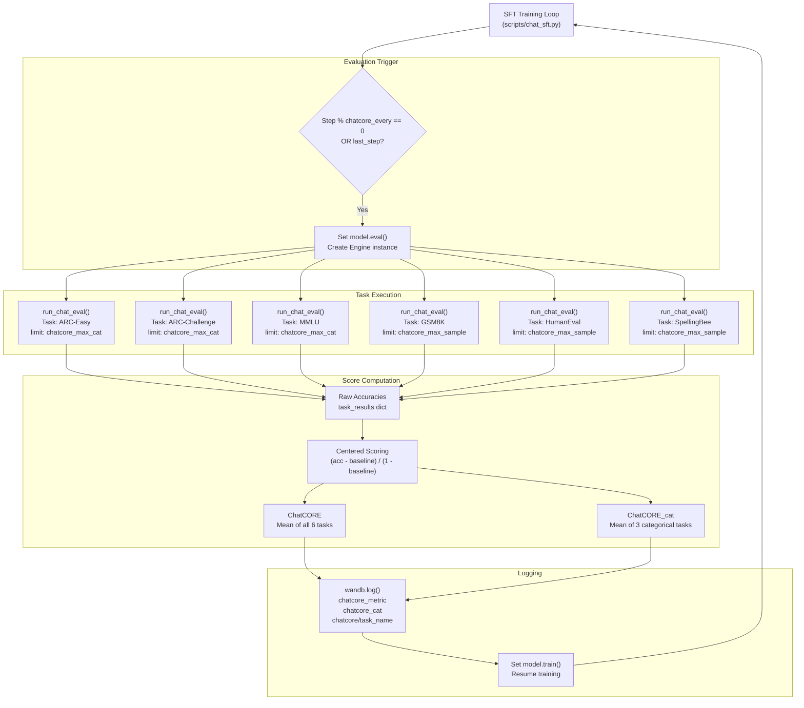
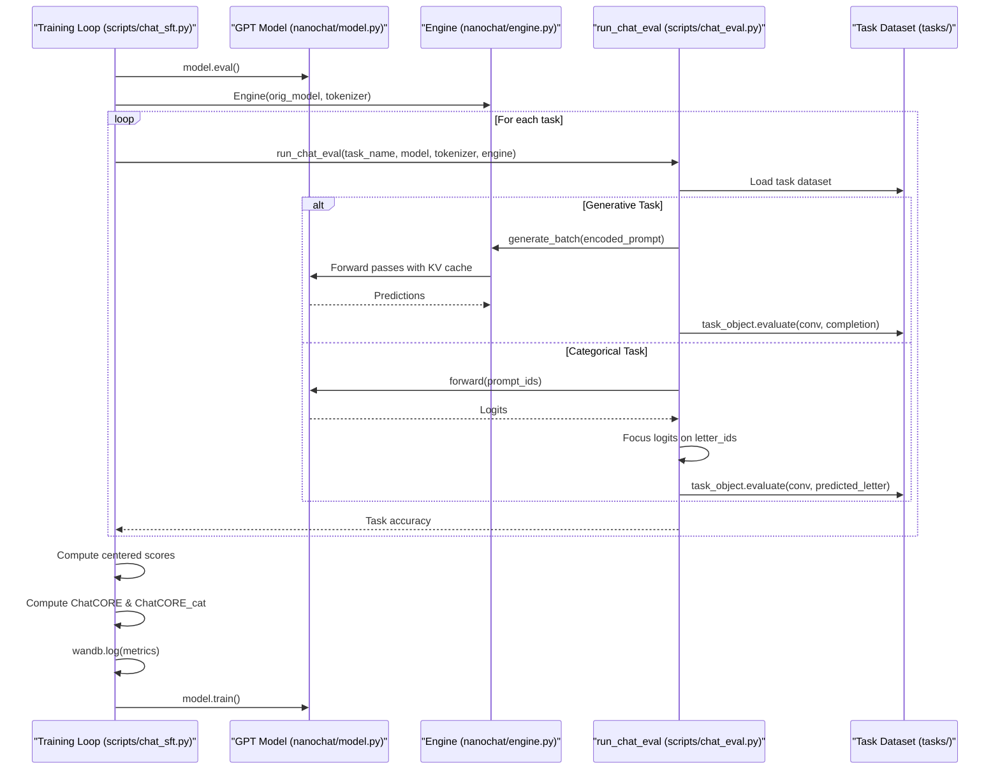

> [!WARNING]
> Imported from DeepWiki as generated, unverified repository documentation. Verify code-behavior claims against the revision below before stabilization.

# ChatCORE Evaluation

<details>
<summary>Relevant source files</summary>

The following files were used as context for generating this wiki page:

- [scripts/chat_eval.py](https://github.com/karpathy/nanochat/blob/92d63d4e8bb4df75c3b71618f31ddde2378b2bcd/scripts/chat_eval.py)
- [scripts/chat_sft.py](https://github.com/karpathy/nanochat/blob/92d63d4e8bb4df75c3b71618f31ddde2378b2bcd/scripts/chat_sft.py)

</details>


## Purpose and Scope

This document describes the **ChatCORE evaluation metric**, a 6-task benchmark used to assess chat model capabilities after supervised fine-tuning (SFT). ChatCORE measures performance across diverse domains including reasoning, math, coding, and spelling through a centered scoring approach that normalizes against random baseline performance.

For evaluation of base (non-chat) models before SFT, see [CORE Score and Validation Metrics](deepwiki-09-01-core-score-and-validation-metrics.md). For details on the SFT training process that uses ChatCORE, see [SFT Training Script](deepwiki-07-01-sft-training-script.md).

**Sources:** [scripts/chat_sft.py:26-34](https://github.com/karpathy/nanochat/blob/92d63d4e8bb4df75c3b71618f31ddde2378b2bcd/scripts/chat_sft.py#L26-L34), [scripts/chat_sft.py:348-383](https://github.com/karpathy/nanochat/blob/92d63d4e8bb4df75c3b71618f31ddde2378b2bcd/scripts/chat_sft.py#L348-L383)

---

## Overview

ChatCORE is implemented as part of the SFT training pipeline and evaluates chat models on six distinct tasks that span multiple capability dimensions. Unlike CORE (which uses 22 tasks for base model evaluation), ChatCORE focuses on a smaller set of tasks specifically relevant to chat model performance.

The metric produces a centered score ranging from 0 (random baseline) to 1 (perfect performance) by normalizing raw accuracies against task-specific random baselines. This centering allows meaningful comparison across tasks with different difficulty levels and answer formats.

**Sources:** [scripts/chat_sft.py:348-383](https://github.com/karpathy/nanochat/blob/92d63d4e8bb4df75c3b71618f31ddde2378b2bcd/scripts/chat_sft.py#L348-L383)

---

## Task Composition

ChatCORE evaluates six tasks divided into two categories:

### Task Taxonomy

| Task | Type | Domain | Baseline | Description |
|------|------|--------|----------|-------------|
| **ARC-Easy** | Categorical | Science Reasoning | 0.25 | Elementary-level science questions with 4 choices |
| **ARC-Challenge** | Categorical | Science Reasoning | 0.25 | Challenging science questions with 4 choices |
| **MMLU** | Categorical | General Knowledge | 0.25 | Massive Multitask Language Understanding with 4 choices |
| **GSM8K** | Generative | Math Reasoning | 0.0 | Grade school math word problems |
| **HumanEval** | Generative | Code Generation | 0.0 | Python function synthesis from docstrings |
| **SpellingBee** | Generative | Spelling | 0.0 | Character counting tasks (e.g., count 'r' in "strawberry") |

**Categorical tasks** use multiple-choice format where the model selects from 4 options (random baseline = 0.25). **Generative tasks** require producing free-form text that matches an exact answer (random baseline ≈ 0.0).

**Sources:** [scripts/chat_sft.py:354-359](https://github.com/karpathy/nanochat/blob/92d63d4e8bb4df75c3b71618f31ddde2378b2bcd/scripts/chat_sft.py#L354-L359), [scripts/chat_eval.py:20-24](https://github.com/karpathy/nanochat/blob/92d63d4e8bb4df75c3b71618f31ddde2378b2bcd/scripts/chat_eval.py#L20-L24)

---

## Task Evaluation Flow

The following diagram illustrates the flow from the `scripts/chat_sft.py` training loop through the evaluation logic in `scripts/chat_eval.py`.



**Sources:** [scripts/chat_sft.py:348-383](https://github.com/karpathy/nanochat/blob/92d63d4e8bb4df75c3b71618f31ddde2378b2bcd/scripts/chat_sft.py#L348-L383), [scripts/chat_eval.py:157-200](https://github.com/karpathy/nanochat/blob/92d63d4e8bb4df75c3b71618f31ddde2378b2bcd/scripts/chat_eval.py#L157-L200)

---

## Centered Scoring Methodology

ChatCORE uses **centered scoring** to normalize task performance relative to random baseline and perfect performance. For each task, the centered score is computed as:

```
centered_score = (accuracy - baseline_accuracy) / (1.0 - baseline_accuracy)
```

Where:
- `accuracy`: Raw accuracy on the task (0 to 1)
- `baseline_accuracy`: Expected performance of random guessing
- `centered_score`: Normalized score (0 to 1)

### Interpretation

- **0.0**: Performance equivalent to random guessing
- **0.5**: Halfway between random and perfect
- **1.0**: Perfect accuracy

### Aggregation

Two aggregate metrics are computed:

1. **ChatCORE**: Mean of centered scores across all 6 tasks
2. **ChatCORE_cat**: Mean of centered scores across only the 3 categorical tasks (ARC-Easy, ARC-Challenge, MMLU)

The formula for ChatCORE is:

```python
chatcore = sum((task_results[t] - baseline_accuracies[t]) / (1.0 - baseline_accuracies[t])
               for t in all_tasks) / len(all_tasks)
```

**Sources:** [scripts/chat_sft.py:369-374](https://github.com/karpathy/nanochat/blob/92d63d4e8bb4df75c3b71618f31ddde2378b2bcd/scripts/chat_sft.py#L369-L374)

---

## Implementation in Training Loop

### Evaluation Trigger

ChatCORE evaluation is triggered periodically during SFT training based on two conditions:

1. **Periodic evaluation**: Every `chatcore_every` steps (default: 200)
2. **Final evaluation**: On the last training step (`last_step == True`)

```python
if args.chatcore_every > 0 and (last_step or (step > 0 and step % args.chatcore_every == 0)):
    # Run ChatCORE evaluation
```

**Sources:** [scripts/chat_sft.py:63](https://github.com/karpathy/nanochat/blob/92d63d4e8bb4df75c3b71618f31ddde2378b2bcd/scripts/chat_sft.py#L63), [scripts/chat_sft.py:351](https://github.com/karpathy/nanochat/blob/92d63d4e8bb4df75c3b71618f31ddde2378b2bcd/scripts/chat_sft.py#L351)

### Evaluation Execution

The sequence below details how `scripts/chat_eval.py` interacts with the model and the `Engine` class.



The evaluation uses the **original uncompiled model** (`orig_model`) because evaluation inputs vary in shape, which is incompatible with compiled models:

```python
model.eval()
engine = Engine(orig_model, tokenizer)
```

**Sources:** [scripts/chat_sft.py:352-353](https://github.com/karpathy/nanochat/blob/92d63d4e8bb4df75c3b71618f31ddde2378b2bcd/scripts/chat_sft.py#L352-L353), [scripts/chat_eval.py:44-55](https://github.com/karpathy/nanochat/blob/92d63d4e8bb4df75c3b71618f31ddde2378b2bcd/scripts/chat_eval.py#L44-L55), [scripts/chat_eval.py:115-138](https://github.com/karpathy/nanochat/blob/92d63d4e8bb4df75c3b71618f31ddde2378b2bcd/scripts/chat_eval.py#L115-L138)

### Task Execution

Each task is evaluated independently with configurable problem limits:

```python
all_tasks = ['ARC-Easy', 'ARC-Challenge', 'MMLU', 'GSM8K', 'HumanEval', 'SpellingBee']
categorical_tasks = {'ARC-Easy', 'ARC-Challenge', 'MMLU'}

for task_name in all_tasks:
    limit = args.chatcore_max_cat if task_name in categorical_tasks else args.chatcore_max_sample
    max_problems = None if limit < 0 else limit  # -1 means no limit
    with autocast_ctx:
        acc = run_chat_eval(task_name, orig_model, tokenizer, engine,
                           batch_size=args.device_batch_size, max_problems=max_problems)
    task_results[task_name] = acc
```

**Sources:** [scripts/chat_sft.py:354-368](https://github.com/karpathy/nanochat/blob/92d63d4e8bb4df75c3b71618f31ddde2378b2bcd/scripts/chat_sft.py#L354-L368)

---

## Configuration Options

ChatCORE evaluation behavior is controlled by command-line arguments:

### Evaluation Frequency

```bash
--chatcore-every N
```

Evaluate ChatCORE every N steps. Default: `200`. Set to `-1` to disable.

**Sources:** [scripts/chat_sft.py:63](https://github.com/karpathy/nanochat/blob/92d63d4e8bb4df75c3b71618f31ddde2378b2bcd/scripts/chat_sft.py#L63)

### Problem Limits

```bash
--chatcore-max-cat N
--chatcore-max-sample N
```

- `--chatcore-max-cat`: Maximum problems per **categorical** task (ARC-Easy, ARC-Challenge, MMLU). Default: `-1` (no limit)
- `--chatcore-max-sample`: Maximum problems per **generative** task (GSM8K, HumanEval, SpellingBee). Default: `24`

Setting limits reduces evaluation time at the cost of statistical precision. For fast iteration during development, use small limits (e.g., `--chatcore-max-sample=10`). For final evaluation, use `-1` for no limit.

**Sources:** [scripts/chat_sft.py:64-65](https://github.com/karpathy/nanochat/blob/92d63d4e8bb4df75c3b71618f31ddde2378b2bcd/scripts/chat_sft.py#L64-L65)

---

## Baseline Accuracies

Baseline accuracies represent expected random performance:

```python
baseline_accuracies = {
    'ARC-Easy': 0.25,       # 4-choice multiple choice
    'ARC-Challenge': 0.25,  # 4-choice multiple choice
    'MMLU': 0.25,           # 4-choice multiple choice
    'GSM8K': 0.0,           # Generative (exact match required)
    'HumanEval': 0.0,       # Generative (code execution required)
    'SpellingBee': 0.0,     # Generative (exact numerical match)
}
```

For categorical tasks, the baseline is 0.25 (1/4 chance of random guess). For generative tasks, the baseline is effectively 0.0 since random text almost never produces the correct answer.

**Sources:** [scripts/chat_sft.py:356-360](https://github.com/karpathy/nanochat/blob/92d63d4e8bb4df75c3b71618f31ddde2378b2bcd/scripts/chat_sft.py#L356-L360)

---

## Logging and Monitoring

### WandB Integration

ChatCORE results are logged to Weights & Biases with the following keys:

```python
wandb_run.log({
    "step": step,
    "total_training_flops": flops_so_far,
    "chatcore_metric": chatcore,           # Overall ChatCORE
    "chatcore_cat": chatcore_cat,          # Categorical-only ChatCORE
    **{f"chatcore/{task_name}": acc        # Individual task accuracies
       for task_name, acc in task_results.items()},
})
```

This creates the following metrics in WandB:
- `chatcore_metric`: Aggregate score (all 6 tasks)
- `chatcore_cat`: Categorical subset score (3 tasks)
- `chatcore/ARC-Easy`, `chatcore/ARC-Challenge`, etc.: Per-task raw accuracies

**Sources:** [scripts/chat_sft.py:375-381](https://github.com/karpathy/nanochat/blob/92d63d4e8bb4df75c3b71618f31ddde2378b2bcd/scripts/chat_sft.py#L375-L381)

### Console Output

Progress is printed to console for each task via `run_chat_eval` which handles rank-aware logging and result aggregation across ranks using `dist.all_reduce`.

**Sources:** [scripts/chat_eval.py:63](https://github.com/karpathy/nanochat/blob/92d63d4e8bb4df75c3b71618f31ddde2378b2bcd/scripts/chat_eval.py#L63), [scripts/chat_eval.py:72-75](https://github.com/karpathy/nanochat/blob/92d63d4e8bb4df75c3b71618f31ddde2378b2bcd/scripts/chat_eval.py#L72-L75), [scripts/chat_eval.py:147-150](https://github.com/karpathy/nanochat/blob/92d63d4e8bb4df75c3b71618f31ddde2378b2bcd/scripts/chat_eval.py#L147-L150), [scripts/chat_sft.py:374](https://github.com/karpathy/nanochat/blob/92d63d4e8bb4df75c3b71618f31ddde2378b2bcd/scripts/chat_sft.py#L374)

---

## Comparison with CORE Metric

ChatCORE differs from the base model CORE metric in several key ways:

| Aspect | CORE (Base Models) | ChatCORE (Chat Models) |
|--------|-------------------|------------------------|
| **Number of tasks** | 22 tasks | 6 tasks |
| **Purpose** | Measure base language modeling capability | Measure chat-specific capabilities |
| **Task selection** | Broad coverage from DCLM paper | Focused on reasoning, math, code, spelling |
| **Evaluation context** | During base pretraining | During/after SFT |
| **Threshold** | 0.256525 (GPT-2 level) | No specific threshold |
| **Input format** | Raw text completion | Conversational format with system/user/assistant roles |

Both metrics use centered scoring to normalize against random baseline, but CORE is used to gate progression to SFT (must exceed GPT-2 threshold), while ChatCORE tracks incremental improvements during fine-tuning.

**Sources:** [scripts/chat_sft.py:348-383](https://github.com/karpathy/nanochat/blob/92d63d4e8bb4df75c3b71618f31ddde2378b2bcd/scripts/chat_sft.py#L348-L383), [scripts/chat_eval.py:157-200](https://github.com/karpathy/nanochat/blob/92d63d4e8bb4df75c3b71618f31ddde2378b2bcd/scripts/chat_eval.py#L157-L200), [nanochat/core_eval.py:1-7](https://github.com/karpathy/nanochat/blob/92d63d4e8bb4df75c3b71618f31ddde2378b2bcd/nanochat/core_eval.py#L1-L7)

---

## Code Entity Reference

### Key Functions and Classes

- **`run_chat_eval()`**: Main evaluation function defined in `scripts/chat_eval.py`.
  - Parameters: `task_name`, `model`, `tokenizer`, `engine`, `batch_size`, `max_problems`. [scripts/chat_eval.py:156-173](https://github.com/karpathy/nanochat/blob/92d63d4e8bb4df75c3b71618f31ddde2378b2bcd/scripts/chat_eval.py#L156-L173)
  - Routes to `run_generative_eval` [scripts/chat_eval.py:28-80](https://github.com/karpathy/nanochat/blob/92d63d4e8bb4df75c3b71618f31ddde2378b2bcd/scripts/chat_eval.py#L28-L80) or `run_categorical_eval` [scripts/chat_eval.py:87-152](https://github.com/karpathy/nanochat/blob/92d63d4e8bb4df75c3b71618f31ddde2378b2bcd/scripts/chat_eval.py#L87-L152) based on task type.

- **`Engine`**: Inference engine for generating model responses, defined in `nanochat/engine.py`.
  - Provides `generate_batch` [scripts/chat_eval.py:43-49](https://github.com/karpathy/nanochat/blob/92d63d4e8bb4df75c3b71618f31ddde2378b2bcd/scripts/chat_eval.py#L43-L49) which uses the KV cache for efficiency.

- **Task definitions**: Located in `tasks/` module.
  - `tasks.gsm8k.GSM8K` [scripts/chat_eval.py:23](https://github.com/karpathy/nanochat/blob/92d63d4e8bb4df75c3b71618f31ddde2378b2bcd/scripts/chat_eval.py#L23)
  - `tasks.mmlu.MMLU` [scripts/chat_eval.py:21](https://github.com/karpathy/nanochat/blob/92d63d4e8bb4df75c3b71618f31ddde2378b2bcd/scripts/chat_eval.py#L21)
  - `tasks.arc.ARC` [scripts/chat_eval.py:22](https://github.com/karpathy/nanochat/blob/92d63d4e8bb4df75c3b71618f31ddde2378b2bcd/scripts/chat_eval.py#L22)
  - `tasks.humaneval.HumanEval` [scripts/chat_eval.py:20](https://github.com/karpathy/nanochat/blob/92d63d4e8bb4df75c3b71618f31ddde2378b2bcd/scripts/chat_eval.py#L20)

### Variables

- `task_results`: Dictionary mapping task names to raw accuracies. [scripts/chat_sft.py:354](https://github.com/karpathy/nanochat/blob/92d63d4e8bb4df75c3b71618f31ddde2378b2bcd/scripts/chat_sft.py#L354)
- `baseline_accuracies`: Dictionary of random baseline performance. [scripts/chat_sft.py:356-361](https://github.com/karpathy/nanochat/blob/92d63d4e8bb4df75c3b71618f31ddde2378b2bcd/scripts/chat_sft.py#L356-L361)
- `all_tasks`: List of 6 task names. [scripts/chat_sft.py:354](https://github.com/karpathy/nanochat/blob/92d63d4e8bb4df75c3b71618f31ddde2378b2bcd/scripts/chat_sft.py#L354)
- `categorical_tasks`: Set of 3 categorical task names. [scripts/chat_sft.py:355](https://github.com/karpathy/nanochat/blob/92d63d4e8bb4df75c3b71618f31ddde2378b2bcd/scripts/chat_sft.py#L355)
- `chatcore`: Overall ChatCORE score (0 to 1). [scripts/chat_sft.py:372](https://github.com/karpathy/nanochat/blob/92d63d4e8bb4df75c3b71618f31ddde2378b2bcd/scripts/chat_sft.py#L372)
- `chatcore_cat`: Categorical subset ChatCORE score (0 to 1). [scripts/chat_sft.py:373](https://github.com/karpathy/nanochat/blob/92d63d4e8bb4df75c3b71618f31ddde2378b2bcd/scripts/chat_sft.py#L373)

**Sources:** [scripts/chat_sft.py:354-374](https://github.com/karpathy/nanochat/blob/92d63d4e8bb4df75c3b71618f31ddde2378b2bcd/scripts/chat_sft.py#L354-L374), [scripts/chat_eval.py:1-24](https://github.com/karpathy/nanochat/blob/92d63d4e8bb4df75c3b71618f31ddde2378b2bcd/scripts/chat_eval.py#L1-L24)
