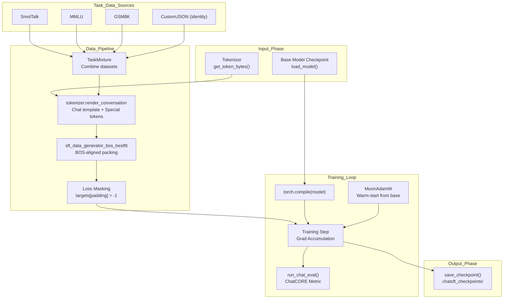
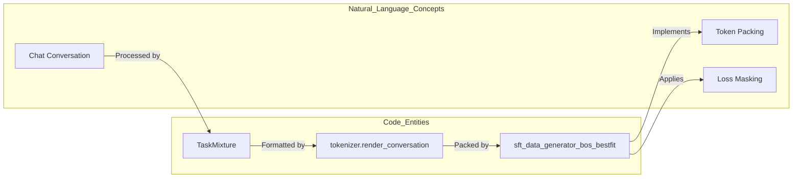

> [!WARNING]
> Imported from DeepWiki as generated, unverified repository documentation. Verify code-behavior claims against the revision below before stabilization.

# Supervised Fine-Tuning (SFT)

Relevant source files

The following files were used as context for generating this wiki page:

- [scripts/chat_sft.py](https://github.com/karpathy/nanochat/blob/92d63d4e8bb4df75c3b71618f31ddde2378b2bcd/scripts/chat_sft.py)

This document describes the supervised fine-tuning (SFT) phase of model training, which transforms a pretrained base model into a conversational assistant. SFT teaches the model to follow instructions, engage in dialogue, and use tools like calculators. For information about pretraining the base model that serves as the starting point, see [Base Training Script Architecture](deepwiki-03-01-base-training-script-architecture.md). For information about how trained chat models are deployed for inference, see [Inference Engine and KV Cache](deepwiki-10-01-inference-engine-and-kv-cache.md).

## Overview

The SFT process takes a checkpoint from base pretraining and continues training on a curated mixture of conversational and task-specific datasets. The primary script [`scripts/chat_sft.py`](https://github.com/karpathy/nanochat/blob/92d63d4e8bb4df75c3b71618f31ddde2378b2bcd/scripts/chat_sft.py)() orchestrates this training phase.

Key characteristics of SFT:

- **Input**: Base model checkpoint from pretraining, loaded via `load_model` [scripts/chat_sft.py:94](https://github.com/karpathy/nanochat/blob/92d63d4e8bb4df75c3b71618f31ddde2378b2bcd/scripts/chat_sft.py#L94).
- **Data**: Task mixture combining conversations, math, multiple choice, and tool use [scripts/chat_sft.py:28-32](https://github.com/karpathy/nanochat/blob/92d63d4e8bb4df75c3b71618f31ddde2378b2bcd/scripts/chat_sft.py#L28-L32).
- **Output**: Chat model checkpoint saved to `chatsft_checkpoints/` [scripts/chat_sft.py:381](https://github.com/karpathy/nanochat/blob/92d63d4e8bb4df75c3b71618f31ddde2378b2bcd/scripts/chat_sft.py#L381).
- **Training Duration**: Typically one epoch over the task mixture [scripts/chat_sft.py:45](https://github.com/karpathy/nanochat/blob/92d63d4e8bb4df75c3b71618f31ddde2378b2bcd/scripts/chat_sft.py#L45).
- **Objective**: Minimize cross-entropy loss on conversational data with specific masking [scripts/chat_sft.py:228-231](https://github.com/karpathy/nanochat/blob/92d63d4e8bb4df75c3b71618f31ddde2378b2bcd/scripts/chat_sft.py#L228-L231).

For architectural details of the training script, see [SFT Training Script](deepwiki-07-01-sft-training-script.md).

## SFT Pipeline Architecture

The following diagram illustrates the flow from base model loading through data processing to the final chat checkpoint.

### SFT System Flow

**Sources**: [scripts/chat_sft.py:94-120](https://github.com/karpathy/nanochat/blob/92d63d4e8bb4df75c3b71618f31ddde2378b2bcd/scripts/chat_sft.py#L94-L120), [scripts/chat_sft.py:127-234](https://github.com/karpathy/nanochat/blob/92d63d4e8bb4df75c3b71618f31ddde2378b2bcd/scripts/chat_sft.py#L127-L234), [scripts/chat_sft.py:258-365](https://github.com/karpathy/nanochat/blob/92d63d4e8bb4df75c3b71618f31ddde2378b2bcd/scripts/chat_sft.py#L258-L365)

## Task Mixture and Data Sources

The SFT training combines multiple datasets through the `TaskMixture` class [scripts/chat_sft.py:28](https://github.com/karpathy/nanochat/blob/92d63d4e8bb4df75c3b71618f31ddde2378b2bcd/scripts/chat_sft.py#L28). Each task contributes specific capabilities, such as general chat from `SmolTalk` [scripts/chat_sft.py:31](https://github.com/karpathy/nanochat/blob/92d63d4e8bb4df75c3b71618f31ddde2378b2bcd/scripts/chat_sft.py#L31), mathematical reasoning from `GSM8K` [scripts/chat_sft.py:29](https://github.com/karpathy/nanochat/blob/92d63d4e8bb4df75c3b71618f31ddde2378b2bcd/scripts/chat_sft.py#L29), and world knowledge from `MMLU` [scripts/chat_sft.py:30](https://github.com/karpathy/nanochat/blob/92d63d4e8bb4df75c3b71618f31ddde2378b2bcd/scripts/chat_sft.py#L30).

The training mixture can be configured via CLI arguments to adjust the emphasis on specific skills, such as `--mmlu-epochs` [scripts/chat_sft.py:65](https://github.com/karpathy/nanochat/blob/92d63d4e8bb4df75c3b71618f31ddde2378b2bcd/scripts/chat_sft.py#L65) or `--gsm8k-epochs` [scripts/chat_sft.py:66](https://github.com/karpathy/nanochat/blob/92d63d4e8bb4df75c3b71618f31ddde2378b2bcd/scripts/chat_sft.py#L66).

For a detailed breakdown of the data composition and epoch multipliers, see [Task Mixture and Data Sources](deepwiki-07-02-task-mixture-and-data-sources.md).

## Conversation Rendering and Tokenization

Each task returns conversations as lists of message dictionaries. The tokenizer converts these to token sequences using `render_conversation()`, which applies the chat template and adds special tokens like `<|im_start|>` and `<|im_end|>`.

The SFT data loader [`sft_data_generator_bos_bestfit`](https://github.com/karpathy/nanochat/blob/92d63d4e8bb4df75c3b71618f31ddde2378b2bcd/scripts/chat_sft.py#L127-L234)() implements a specialized packing algorithm. Unlike base pretraining which might crop documents, SFT uses **best-fit with padding** to ensure no instruction data is lost [scripts/chat_sft.py:176-187](https://github.com/karpathy/nanochat/blob/92d63d4e8bb4df75c3b71618f31ddde2378b2bcd/scripts/chat_sft.py#L176-L187). Padding positions have their targets masked with `-1` (the `ignore_index` for cross-entropy loss) [scripts/chat_sft.py:231](https://github.com/karpathy/nanochat/blob/92d63d4e8bb4df75c3b71618f31ddde2378b2bcd/scripts/chat_sft.py#L231).

### Data Loader Entity Mapping

**Sources**: [scripts/chat_sft.py:127-234](https://github.com/karpathy/nanochat/blob/92d63d4e8bb4df75c3b71618f31ddde2378b2bcd/scripts/chat_sft.py#L127-L234), [scripts/chat_sft.py:228-231](https://github.com/karpathy/nanochat/blob/92d63d4e8bb4df75c3b71618f31ddde2378b2bcd/scripts/chat_sft.py#L228-L231)

## Training and Optimization

The SFT script [`scripts/chat_sft.py`](https://github.com/karpathy/nanochat/blob/92d63d4e8bb4df75c3b71618f31ddde2378b2bcd/scripts/chat_sft.py)() inherits hyperparameters from the pretrained base model metadata [scripts/chat_sft.py:97-115](https://github.com/karpathy/nanochat/blob/92d63d4e8bb4df75c3b71618f31ddde2378b2bcd/scripts/chat_sft.py#L97-L115). It uses the hybrid `MuonAdamW` optimizer, often warm-starting the optimizer state from the base checkpoint via `load_optimizer_state` [scripts/chat_sft.py:21](https://github.com/karpathy/nanochat/blob/92d63d4e8bb4df75c3b71618f31ddde2378b2bcd/scripts/chat_sft.py#L21).

The learning rate follows a specific schedule for SFT, typically involving a constant phase followed by a linear warmdown to zero [scripts/chat_sft.py:240-242](https://github.com/karpathy/nanochat/blob/92d63d4e8bb4df75c3b71618f31ddde2378b2bcd/scripts/chat_sft.py#L240-L242).

For details on the script architecture and hyperparameter inheritance, see [SFT Training Script](deepwiki-07-01-sft-training-script.md).

## ChatCORE Evaluation

During SFT, the model is evaluated using the `ChatCORE` metric via `run_chat_eval` [scripts/chat_sft.py:26](https://github.com/karpathy/nanochat/blob/92d63d4e8bb4df75c3b71618f31ddde2378b2bcd/scripts/chat_sft.py#L26). This differs from the base `CORE` metric by evaluating the model's performance in a conversational context across categorical and generative tasks.

Evaluation occurs periodically as defined by `--chatcore-every` [scripts/chat_sft.py:61](https://github.com/karpathy/nanochat/blob/92d63d4e8bb4df75c3b71618f31ddde2378b2bcd/scripts/chat_sft.py#L61). For details on how ChatCORE scores are calculated and centered, see [ChatCORE Evaluation](deepwiki-07-03-chatcore-evaluation.md).

## Comparison: Base Training vs SFT

| Aspect | Base Training | SFT Training |
|--------|---------------|--------------|
| **Primary Script** | `scripts/base_train.py` | `scripts/chat_sft.py` [scripts/chat_sft.py:1](https://github.com/karpathy/nanochat/blob/92d63d4e8bb4df75c3b71618f31ddde2378b2bcd/scripts/chat_sft.py#L1) |
| **Data Strategy** | Best-fit with cropping | Best-fit with padding [scripts/chat_sft.py:176-187](https://github.com/karpathy/nanochat/blob/92d63d4e8bb4df75c3b71618f31ddde2378b2bcd/scripts/chat_sft.py#L176-L187) |
| **Loss Masking** | None (predict all) | Mask padding tokens [scripts/chat_sft.py:231](https://github.com/karpathy/nanochat/blob/92d63d4e8bb4df75c3b71618f31ddde2378b2bcd/scripts/chat_sft.py#L231) |
| **Optimizer State** | Initialized from scratch | Often warm-started [scripts/chat_sft.py:43](https://github.com/karpathy/nanochat/blob/92d63d4e8bb4df75c3b71618f31ddde2378b2bcd/scripts/chat_sft.py#L43) |
| **LR Schedule** | 3-phase (Warmup/Const/Down) | 2-phase (Const/Warmdown) [scripts/chat_sft.py:240-242](https://github.com/karpathy/nanochat/blob/92d63d4e8bb4df75c3b71618f31ddde2378b2bcd/scripts/chat_sft.py#L240-L242) |
| **Evaluation** | CORE (Base) | ChatCORE [scripts/chat_sft.py:61](https://github.com/karpathy/nanochat/blob/92d63d4e8bb4df75c3b71618f31ddde2378b2bcd/scripts/chat_sft.py#L61) |

**Sources**: [scripts/chat_sft.py:1-401](https://github.com/karpathy/nanochat/blob/92d63d4e8bb4df75c3b71618f31ddde2378b2bcd/scripts/chat_sft.py#L1-L401), [scripts/chat_sft.py:127-234](https://github.com/karpathy/nanochat/blob/92d63d4e8bb4df75c3b71618f31ddde2378b2bcd/scripts/chat_sft.py#L127-L234)
