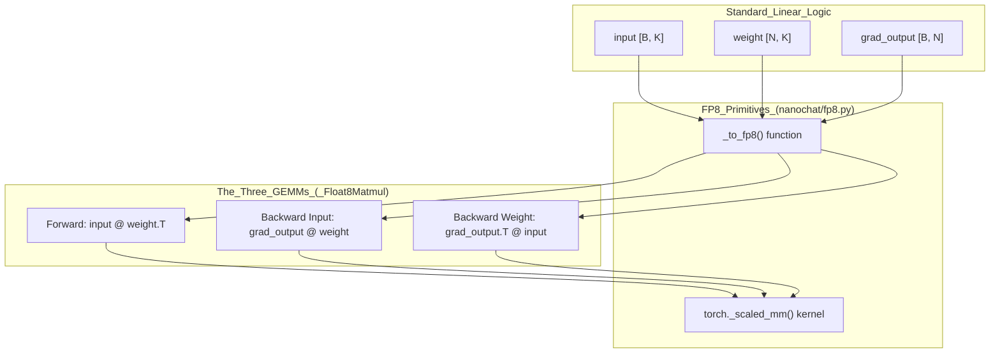
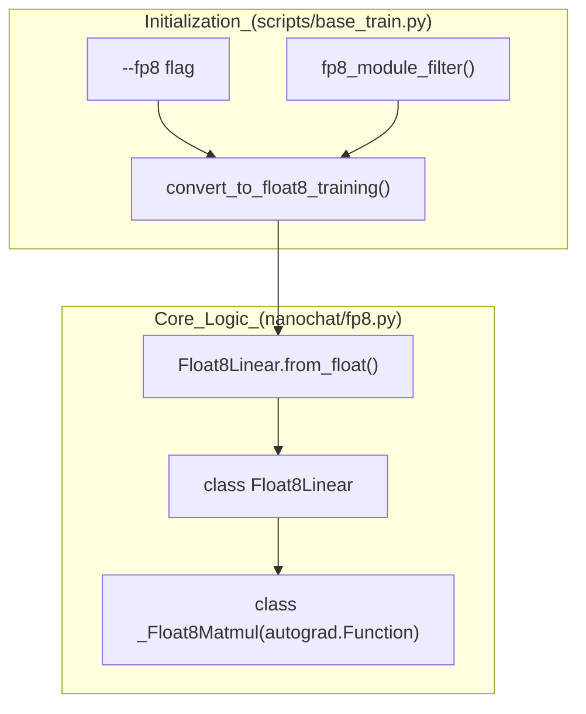

> [!WARNING]
> Imported from DeepWiki as generated, unverified repository documentation. Verify code-behavior claims against the revision below before stabilization.

# FP8 Training with torchao

Relevant source files

The following files were used as context for generating this wiki page:

- [nanochat/flash_attention.py](https://github.com/karpathy/nanochat/blob/92d63d4e8bb4df75c3b71618f31ddde2378b2bcd/nanochat/flash_attention.py)
- [nanochat/fp8.py](https://github.com/karpathy/nanochat/blob/92d63d4e8bb4df75c3b71618f31ddde2378b2bcd/nanochat/fp8.py)
- [scripts/base_train.py](https://github.com/karpathy/nanochat/blob/92d63d4e8bb4df75c3b71618f31ddde2378b2bcd/scripts/base_train.py)
- [tests/test_attention_fallback.py](https://github.com/karpathy/nanochat/blob/92d63d4e8bb4df75c3b71618f31ddde2378b2bcd/tests/test_attention_fallback.py)

FP8 training accelerates `Linear` layer matrix multiplications on H100+ GPUs by using 8-bit floating-point tensor cores. This document describes nanochat's minimal FP8 implementation, which provides significant throughput speedups and memory savings while maintaining model capability.

---

## Overview

FP8 (8-bit floating point) uses specialized tensor cores (available on NVIDIA Hopper/H100+ and some Ada/Ampere architectures) to perform matrix multiplications approximately 2× faster than BF16. The trade-off is quantization overhead: computing scaling factors and casting tensors to and from FP8. 

nanochat implements FP8 training as a drop-in replacement for `nn.Linear` layers through the `Float8Linear` class. The implementation is intentionally minimal (~150 lines) compared to torchao's full-featured implementation (~2000 lines), supporting "tensorwise" dynamic scaling (one scalar scale per tensor).

**Sources:** [nanochat/fp8.py:1-70](https://github.com/karpathy/nanochat/blob/92d63d4e8bb4df75c3b71618f31ddde2378b2bcd/nanochat/fp8.py#L1-L70), [scripts/base_train.py:46-48](https://github.com/karpathy/nanochat/blob/92d63d4e8bb4df75c3b71618f31ddde2378b2bcd/scripts/base_train.py#L46-L48)

---

## FP8 Data Types

FP8 training uses two different 8-bit floating-point formats, each optimized for different numerical characteristics:

| Format | Exponent Bits | Mantissa Bits | Range | Used For |
|--------|--------------|---------------|-------|----------|
| `float8_e4m3fn` | 4 | 3 | [-448, 448] | Forward pass (input, weight) |
| `float8_e5m2` | 5 | 2 | [-57344, 57344] | Backward pass (gradients) |

- **`float8_e4m3fn`**: Higher precision (more mantissa bits) for activations and weights where accuracy matters most. [nanochat/fp8.py:27-28](https://github.com/karpathy/nanochat/blob/92d63d4e8bb4df75c3b71618f31ddde2378b2bcd/nanochat/fp8.py#L27-L28)
- **`float8_e5m2`**: Wider range (more exponent bits) for gradients which can have large dynamic range. [nanochat/fp8.py:29-30](https://github.com/karpathy/nanochat/blob/92d63d4e8bb4df75c3b71618f31ddde2378b2bcd/nanochat/fp8.py#L29-L30)

**Sources:** [nanochat/fp8.py:24-31](https://github.com/karpathy/nanochat/blob/92d63d4e8bb4df75c3b71618f31ddde2378b2bcd/nanochat/fp8.py#L24-L31)

---

## Architecture: Three FP8 GEMMs

A standard `Linear` layer performs one matmul in forward and two in backward. FP8 training wraps each of these three matmuls with quantization logic using a custom autograd function.

### Data Flow Diagram
"Natural Language Space" to "Code Entity Space" mapping for FP8 operations.

**Float8Linear FP8 Wrapping:**
1. **Compute scale factor**: `scale = FP8_MAX / max(|tensor|)` via `_to_fp8`. [nanochat/fp8.py:91-97](https://github.com/karpathy/nanochat/blob/92d63d4e8bb4df75c3b71618f31ddde2378b2bcd/nanochat/fp8.py#L91-L97)
2. **Quantize**: `fp8_tensor = clamp(tensor * scale, -FP8_MAX, FP8_MAX).to(fp8_dtype)`. [nanochat/fp8.py:101-103](https://github.com/karpathy/nanochat/blob/92d63d4e8bb4df75c3b71618f31ddde2378b2bcd/nanochat/fp8.py#L101-L103)
3. **Matmul**: Call `torch._scaled_mm` (cuBLAS FP8 kernel). [nanochat/fp8.py:143-153](https://github.com/karpathy/nanochat/blob/92d63d4e8bb4df75c3b71618f31ddde2378b2bcd/nanochat/fp8.py#L143-L153)
4. **Dequantize**: `_scaled_mm` handles this internally using the `inverse_scale`. [nanochat/fp8.py:106](https://github.com/karpathy/nanochat/blob/92d63d4e8bb4df75c3b71618f31ddde2378b2bcd/nanochat/fp8.py#L106)

**Sources:** [nanochat/fp8.py:8-22](https://github.com/karpathy/nanochat/blob/92d63d4e8bb4df75c3b71618f31ddde2378b2bcd/nanochat/fp8.py#L8-L22), [nanochat/fp8.py:125-190](https://github.com/karpathy/nanochat/blob/92d63d4e8bb4df75c3b71618f31ddde2378b2bcd/nanochat/fp8.py#L125-L190)

---

## Implementation: Float8Linear and Conversion

The system converts standard `nn.Linear` modules into `Float8Linear` modules that use the `_Float8Matmul` custom autograd function.

### System Architecture Diagram
Mapping conversion logic to code entities.

### Key Components

**`Float8Linear` class** [nanochat/fp8.py:193-227](https://github.com/karpathy/nanochat/blob/92d63d4e8bb4df75c3b71618f31ddde2378b2bcd/nanochat/fp8.py#L193-L227):
- Inherits from `nn.Linear`, overriding only the `forward()` method to use `_Float8Matmul`. [nanochat/fp8.py:196-213](https://github.com/karpathy/nanochat/blob/92d63d4e8bb4df75c3b71618f31ddde2378b2bcd/nanochat/fp8.py#L196-L213)
- **Explicit Dtype Management**: Unlike previous versions relying on autocast, `Float8Linear.forward` now explicitly casts input to `COMPUTE_DTYPE`. [nanochat/fp8.py:99-100](https://github.com/karpathy/nanochat/blob/92d63d4e8bb4df75c3b71618f31ddde2378b2bcd/nanochat/fp8.py#L99-L100), [dev/LOG.md:98-100](https://github.com/karpathy/nanochat/blob/92d63d4e8bb4df75c3b71618f31ddde2378b2bcd/dev/LOG.md#L98-L100)
- `from_float()` class method converts existing `nn.Linear` layers by sharing weight/bias tensors. [nanochat/fp8.py:215-227](https://github.com/karpathy/nanochat/blob/92d63d4e8bb4df75c3b71618f31ddde2378b2bcd/nanochat/fp8.py#L215-L227)

**`_Float8Matmul` autograd function** [nanochat/fp8.py:125-190](https://github.com/karpathy/nanochat/blob/92d63d4e8bb4df75c3b71618f31ddde2378b2bcd/nanochat/fp8.py#L125-L190):
- Marked with `@torch._dynamo.allow_in_graph` to prevent `torch.compile` from decomposing it, treating it as an opaque node. [nanochat/fp8.py:124](https://github.com/karpathy/nanochat/blob/92d63d4e8bb4df75c3b71618f31ddde2378b2bcd/nanochat/fp8.py#L124)
- **Forward**: Quantizes input and weight to `float8_e4m3fn`. [nanochat/fp8.py:134-136](https://github.com/karpathy/nanochat/blob/92d63d4e8bb4df75c3b71618f31ddde2378b2bcd/nanochat/fp8.py#L134-L136)
- **Backward**: Quantizes `grad_output` to `float8_e5m2` for gradients. [nanochat/fp8.py:160](https://github.com/karpathy/nanochat/blob/92d63d4e8bb4df75c3b71618f31ddde2378b2bcd/nanochat/fp8.py#L160)

**`fp8_module_filter`** [scripts/base_train.py:175-184](https://github.com/karpathy/nanochat/blob/92d63d4e8bb4df75c3b71618f31ddde2378b2bcd/scripts/base_train.py#L175-L184):
- Ensures `in_features` and `out_features` are divisible by 16 (H100 hardware requirement). [scripts/base_train.py:179](https://github.com/karpathy/nanochat/blob/92d63d4e8bb4df75c3b71618f31ddde2378b2bcd/scripts/base_train.py#L179)
- Skips layers smaller than 128 to avoid quantization overhead. [scripts/base_train.py:182](https://github.com/karpathy/nanochat/blob/92d63d4e8bb4df75c3b71618f31ddde2378b2bcd/scripts/base_train.py#L182)

**Sources:** [nanochat/fp8.py:125-227](https://github.com/karpathy/nanochat/blob/92d63d4e8bb4df75c3b71618f31ddde2378b2bcd/nanochat/fp8.py#L125-L227), [scripts/base_train.py:170-194](https://github.com/karpathy/nanochat/blob/92d63d4e8bb4df75c3b71618f31ddde2378b2bcd/scripts/base_train.py#L170-L194), [dev/LOG.md:98-101](https://github.com/karpathy/nanochat/blob/92d63d4e8bb4df75c3b71618f31ddde2378b2bcd/dev/LOG.md#L98-L101)

---

## Memory Layout Requirements

The cuBLAS FP8 kernel (`torch._scaled_mm`) requires specific memory layouts to avoid expensive copies:

| Argument | Requirement | Logic in `_Float8Matmul` |
|----------|-------------|-------------------------|
| **First (A)** | Row-major (contiguous) | Satisfied by contiguous inputs. [nanochat/fp8.py:35](https://github.com/karpathy/nanochat/blob/92d63d4e8bb4df75c3b71618f31ddde2378b2bcd/nanochat/fp8.py#L35) |
| **Second (B)** | Column-major | Handled by `_to_col_major()` or `.t()`. [nanochat/fp8.py:36-38](https://github.com/karpathy/nanochat/blob/92d63d4e8bb4df75c3b71618f31ddde2378b2bcd/nanochat/fp8.py#L36-L38) |

**`_to_col_major(x)`** [nanochat/fp8.py:110-118](https://github.com/karpathy/nanochat/blob/92d63d4e8bb4df75c3b71618f31ddde2378b2bcd/nanochat/fp8.py#L110-L118):
Rearranges a 2D tensor's memory to column-major layout via `x.t().contiguous().t()`. [nanochat/fp8.py:118](https://github.com/karpathy/nanochat/blob/92d63d4e8bb4df75c3b71618f31ddde2378b2bcd/nanochat/fp8.py#L118)

**Sources:** [nanochat/fp8.py:32-38](https://github.com/karpathy/nanochat/blob/92d63d4e8bb4df75c3b71618f31ddde2378b2bcd/nanochat/fp8.py#L32-L38), [nanochat/fp8.py:110-118](https://github.com/karpathy/nanochat/blob/92d63d4e8bb4df75c3b71618f31ddde2378b2bcd/nanochat/fp8.py#L110-L118)

---

## Evaluation: disable_fp8 Context Manager

FP8 quantization introduces slight numerical differences compared to BF16. To ensure consistent evaluation metrics (BPB, CORE score), nanochat uses a context manager to temporarily swap `Float8Linear` back to standard `Linear` (specifically the custom `nanochat.gpt.Linear` which handles explicit dtypes).

**`disable_fp8(model)`** [scripts/base_train.py:196-241](https://github.com/karpathy/nanochat/blob/92d63d4e8bb4df75c3b71618f31ddde2378b2bcd/scripts/base_train.py#L196-L241):
1. Identifies all `Float8Linear` modules. [scripts/base_train.py:209](https://github.com/karpathy/nanochat/blob/92d63d4e8bb4df75c3b71618f31ddde2378b2bcd/scripts/base_train.py#L209)
2. Creates standard `Linear` replacements (from `nanochat.gpt`) sharing the same `.weight` and `.bias`. [scripts/base_train.py:215-218](https://github.com/karpathy/nanochat/blob/92d63d4e8bb4df75c3b71618f31ddde2378b2bcd/scripts/base_train.py#L215-L218), [dev/LOG.md:100-101](https://github.com/karpathy/nanochat/blob/92d63d4e8bb4df75c3b71618f31ddde2378b2bcd/dev/LOG.md#L100-L101)
3. Swaps them into the model for the duration of the context. [scripts/base_train.py:220](https://github.com/karpathy/nanochat/blob/92d63d4e8bb4df75c3b71618f31ddde2378b2bcd/scripts/base_train.py#L220)
4. Restores the original FP8 modules after the `yield`. [scripts/base_train.py:223-224](https://github.com/karpathy/nanochat/blob/92d63d4e8bb4df75c3b71618f31ddde2378b2bcd/scripts/base_train.py#L223-L224)

**Usage in Training Loop:**
- **Validation Loss**: `with disable_fp8(model): evaluate_bpb(...)` [scripts/base_train.py:420-421](https://github.com/karpathy/nanochat/blob/92d63d4e8bb4df75c3b71618f31ddde2378b2bcd/scripts/base_train.py#L420-L421)
- **CORE Metric**: `with disable_fp8(orig_model): evaluate_core(...)` [scripts/base_train.py:439-440](https://github.com/karpathy/nanochat/blob/92d63d4e8bb4df75c3b71618f31ddde2378b2bcd/scripts/base_train.py#L439-L440)
- **Sampling**: `with disable_fp8(orig_model): engine.generate_batch(...)` [scripts/base_train.py:466-467](https://github.com/karpathy/nanochat/blob/92d63d4e8bb4df75c3b71618f31ddde2378b2bcd/scripts/base_train.py#L466-L467)

**Sources:** [scripts/base_train.py:196-241](https://github.com/karpathy/nanochat/blob/92d63d4e8bb4df75c3b71618f31ddde2378b2bcd/scripts/base_train.py#L196-L241), [scripts/base_train.py:420-467](https://github.com/karpathy/nanochat/blob/92d63d4e8bb4df75c3b71618f31ddde2378b2bcd/scripts/base_train.py#L420-L467), [dev/LOG.md:100-101](https://github.com/karpathy/nanochat/blob/92d63d4e8bb4df75c3b71618f31ddde2378b2bcd/dev/LOG.md#L100-L101)

---

## Performance Characteristics

### Tensorwise vs. Rowwise Scaling
- **Tensorwise** (default): One scalar scale for the entire tensor. Faster because cuBLAS handles scaling directly. [nanochat/fp8.py:83-87](https://github.com/karpathy/nanochat/blob/92d63d4e8bb4df75c3b71618f31ddde2378b2bcd/nanochat/fp8.py#L83-L87)
- **Rowwise**: One scale per row. More accurate but slower as it requires CUTLASS/Triton kernels. The `--fp8-recipe` flag allows choosing between them. [scripts/base_train.py:48](https://github.com/karpathy/nanochat/blob/92d63d4e8bb4df75c3b71618f31ddde2378b2bcd/scripts/base_train.py#L48)

### Precision and Accuracy
The implementation uses `float64` for scale computation to ensure consistent numerics between `torch.compile` and eager mode. [nanochat/fp8.py:94-97](https://github.com/karpathy/nanochat/blob/92d63d4e8bb4df75c3b71618f31ddde2378b2bcd/nanochat/fp8.py#L94-L97) It also uses `use_fast_accum=True` in `_scaled_mm` to accumulate dot products in lower precision for maximum speed. [nanochat/fp8.py:149-151](https://github.com/karpathy/nanochat/blob/92d63d4e8bb4df75c3b71618f31ddde2378b2bcd/nanochat/fp8.py#L149-L151)

**Sources:** [nanochat/fp8.py:82-107](https://github.com/karpathy/nanochat/blob/92d63d4e8bb4df75c3b71618f31ddde2378b2bcd/nanochat/fp8.py#L82-L107), [nanochat/fp8.py:149-153](https://github.com/karpathy/nanochat/blob/92d63d4e8bb4df75c3b71618f31ddde2378b2bcd/nanochat/fp8.py#L149-L153), [scripts/base_train.py:48](https://github.com/karpathy/nanochat/blob/92d63d4e8bb4df75c3b71618f31ddde2378b2bcd/scripts/base_train.py#L48)
