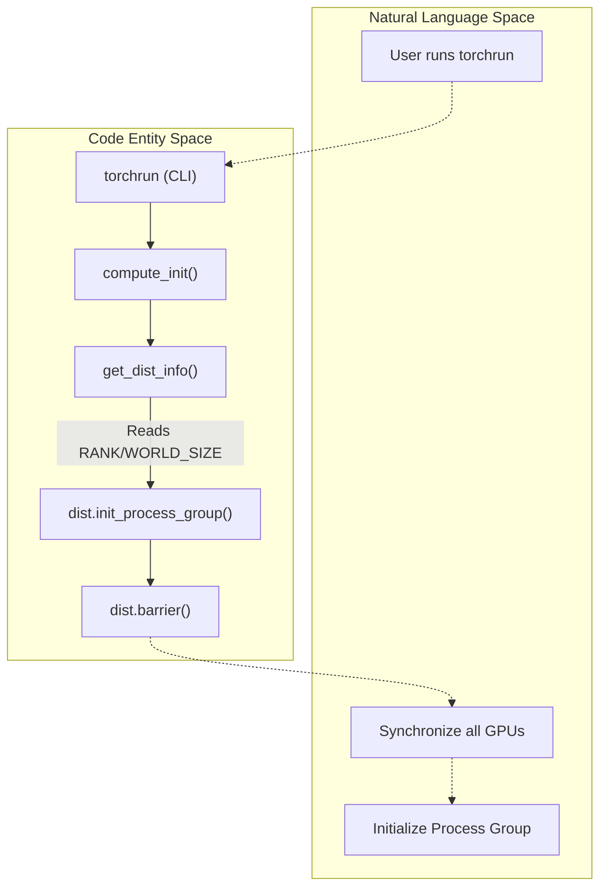
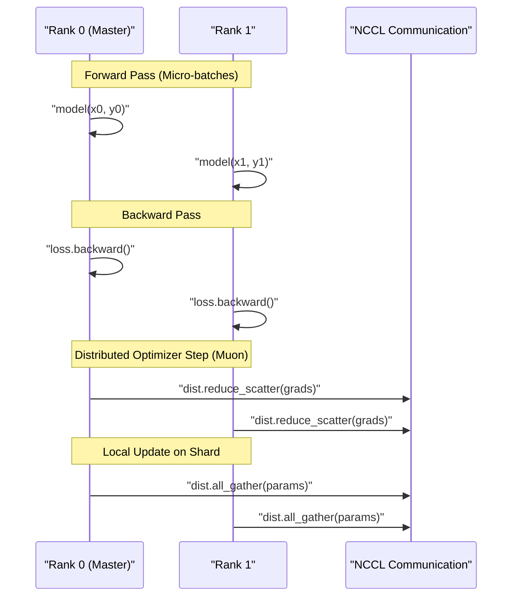

> [!WARNING]
> Imported from DeepWiki as generated, unverified repository documentation. Verify code-behavior claims against the revision below before stabilization.

# Distributed Training with DDP

Relevant source files

The following files were used as context for generating this wiki page:

- [nanochat/common.py](https://github.com/karpathy/nanochat/blob/92d63d4e8bb4df75c3b71618f31ddde2378b2bcd/nanochat/common.py)
- [scripts/base_train.py](https://github.com/karpathy/nanochat/blob/92d63d4e8bb4df75c3b71618f31ddde2378b2bcd/scripts/base_train.py)
- [scripts/infer_bench.py](https://github.com/karpathy/nanochat/blob/92d63d4e8bb4df75c3b71618f31ddde2378b2bcd/scripts/infer_bench.py)

This page documents how `nanochat` implements multi-GPU distributed training using PyTorch's DistributedDataParallel (DDP) concepts. It covers the initialization process via `compute_init`, process group management, gradient synchronization, and rank-aware logging and checkpointing.

---

## Overview of Distributed Data Parallel

Distributed Data Parallel (DDP) in `nanochat` replicates the model on each GPU and parallelizes training by:

1.  **Data Parallelism**: Each GPU processes a unique shard of the data provided by the `tokenizing_distributed_data_loader_with_state_bos_bestfit` [scripts/base_train.py:29](https://github.com/karpathy/nanochat/blob/92d63d4e8bb4df75c3b71618f31ddde2378b2bcd/scripts/base_train.py#L29).
2.  **Gradient Synchronization**: After the backward pass, gradients are synchronized across all GPUs. While standard DDP uses all-reduce, `nanochat` utilizes a distributed optimizer approach that combines `reduce_scatter` and `all_gather` for efficiency [nanochat/optim.py:383-400](https://github.com/karpathy/nanochat/blob/92d63d4e8bb4df75c3b71618f31ddde2378b2bcd/nanochat/optim.py#L383-L400).
3.  **Rank-Aware Execution**: Coordination tasks (logging, sampling, model saving) are restricted to the master process (rank 0) [scripts/base_train.py:87](https://github.com/karpathy/nanochat/blob/92d63d4e8bb4df75c3b71618f31ddde2378b2bcd/scripts/base_train.py#L87).

### DDP vs Single GPU Comparison

| Aspect | Single GPU | DDP (e.g., 8 GPUs) |
| :--- | :--- | :--- |
| **Launcher** | `python -m scripts.base_train` | `torchrun --nproc_per_node=8 ...` |
| **Process Group** | None | NCCL Backend [nanochat/common.py:200](https://github.com/karpathy/nanochat/blob/92d63d4e8bb4df75c3b71618f31ddde2378b2bcd/nanochat/common.py#L200) |
| **Effective Batch Size** | `device_batch_size` | `device_batch_size * world_size` |
| **Gradient Sync** | Local accumulation | `reduce_scatter` / `all_reduce` [nanochat/optim.py:383-400](https://github.com/karpathy/nanochat/blob/92d63d4e8bb4df75c3b71618f31ddde2378b2bcd/nanochat/optim.py#L383-L400) |
| **Logging** | Standard `print` | `print0` (Rank 0 only) [nanochat/common.py:118](https://github.com/karpathy/nanochat/blob/92d63d4e8bb4df75c3b71618f31ddde2378b2bcd/nanochat/common.py#L118) |

Sources: [scripts/base_train.py:1-12](https://github.com/karpathy/nanochat/blob/92d63d4e8bb4df75c3b71618f31ddde2378b2bcd/scripts/base_train.py#L1-L12), [nanochat/common.py:118-121](https://github.com/karpathy/nanochat/blob/92d63d4e8bb4df75c3b71618f31ddde2378b2bcd/nanochat/common.py#L118-L121), [nanochat/optim.py:383-400](https://github.com/karpathy/nanochat/blob/92d63d4e8bb4df75c3b71618f31ddde2378b2bcd/nanochat/optim.py#L383-L400)

---

## DDP Initialization and Process Group Setup

The `compute_init` function in `nanochat/common.py` handles the transition from a single-process execution to a distributed environment.

### Distributed Launch Flow

Sources: [nanochat/common.py:151-208](https://github.com/karpathy/nanochat/blob/92d63d4e8bb4df75c3b71618f31ddde2378b2bcd/nanochat/common.py#L151-L208), [scripts/base_train.py:86](https://github.com/karpathy/nanochat/blob/92d63d4e8bb4df75c3b71618f31ddde2378b2bcd/scripts/base_train.py#L86)

### The `compute_init` Logic
1.  **Detection**: It calls `get_dist_info()` to check for environment variables (`RANK`, `LOCAL_RANK`, `WORLD_SIZE`) set by `torchrun` [nanochat/common.py:151-159](https://github.com/karpathy/nanochat/blob/92d63d4e8bb4df75c3b71618f31ddde2378b2bcd/nanochat/common.py#L151-L159).
2.  **Device Assignment**: Each process is assigned a specific GPU via `torch.cuda.set_device(device)` based on its `local_rank` [nanochat/common.py:198-199](https://github.com/karpathy/nanochat/blob/92d63d4e8bb4df75c3b71618f31ddde2378b2bcd/nanochat/common.py#L198-L199).
3.  **Backend Initialization**: It initializes the NCCL backend for GPU communication [nanochat/common.py:200](https://github.com/karpathy/nanochat/blob/92d63d4e8bb4df75c3b71618f31ddde2378b2bcd/nanochat/common.py#L200).
4.  **Barrier**: A `dist.barrier()` ensures no rank proceeds to model construction until all ranks are ready [nanochat/common.py:201](https://github.com/karpathy/nanochat/blob/92d63d4e8bb4df75c3b71618f31ddde2378b2bcd/nanochat/common.py#L201).

Sources: [nanochat/common.py:174-208](https://github.com/karpathy/nanochat/blob/92d63d4e8bb4df75c3b71618f31ddde2378b2bcd/nanochat/common.py#L174-L208)

---

## Rank-Aware Logging and Operations

To prevent interleaved output and redundant file operations, `nanochat` uses rank-aware logic.

### Master Process Identification
The script defines `master_process = ddp_rank == 0` [scripts/base_train.py:87](https://github.com/karpathy/nanochat/blob/92d63d4e8bb4df75c3b71618f31ddde2378b2bcd/scripts/base_train.py#L87). This boolean controls:
*   **WandB Initialization**: Only initialized if `master_process` is true [scripts/base_train.py:100](https://github.com/karpathy/nanochat/blob/92d63d4e8bb4df75c3b71618f31ddde2378b2bcd/scripts/base_train.py#L100).
*   **Console Output**: Uses `print0(s)`, which checks the `RANK` environment variable and only prints if it is 0 [nanochat/common.py:118-121](https://github.com/karpathy/nanochat/blob/92d63d4e8bb4df75c3b71618f31ddde2378b2bcd/nanochat/common.py#L118-L121).
*   **Sampling**: Text generation during training (e.g., every 2000 steps) is only performed by the master process [scripts/base_train.py:452-453](https://github.com/karpathy/nanochat/blob/92d63d4e8bb4df75c3b71618f31ddde2378b2bcd/scripts/base_train.py#L452-L453).

### File Locking for Downloads
When downloading datasets or tokenizers, `nanochat` uses a `FileLock` to ensure that even if multiple ranks attempt to download simultaneously, only one performs the I/O while others wait [nanochat/common.py:82-116](https://github.com/karpathy/nanochat/blob/92d63d4e8bb4df75c3b71618f31ddde2378b2bcd/nanochat/common.py#L82-L116).

Sources: [nanochat/common.py:82-121](https://github.com/karpathy/nanochat/blob/92d63d4e8bb4df75c3b71618f31ddde2378b2bcd/nanochat/common.py#L82-L121), [scripts/base_train.py:87-100](https://github.com/karpathy/nanochat/blob/92d63d4e8bb4df75c3b71618f31ddde2378b2bcd/scripts/base_train.py#L87-L100), [scripts/base_train.py:452-468](https://github.com/karpathy/nanochat/blob/92d63d4e8bb4df75c3b71618f31ddde2378b2bcd/scripts/base_train.py#L452-L468)

---

## Gradient Synchronization and Accumulation

In `nanochat`, training steps involve micro-batching and gradient accumulation to reach the desired total batch size.

### Training Step Data Flow

Sources: [scripts/base_train.py:505-534](https://github.com/karpathy/nanochat/blob/92d63d4e8bb4df75c3b71618f31ddde2378b2bcd/scripts/base_train.py#L505-L534), [nanochat/optim.py:383-400](https://github.com/karpathy/nanochat/blob/92d63d4e8bb4df75c3b71618f31ddde2378b2bcd/nanochat/optim.py#L383-L400)

### Effective Batch Size Calculation
The `total_batch_size` is distributed across all ranks and accumulation steps. The system calculates `grad_accum_steps` such that:
`total_batch_size = device_batch_size * max_seq_len * world_size * grad_accum_steps` [scripts/base_train.py:402-408](https://github.com/karpathy/nanochat/blob/92d63d4e8bb4df75c3b71618f31ddde2378b2bcd/scripts/base_train.py#L402-L408).

### Distributed Optimizer Implementation
`nanochat` uses `DistMuonAdamW`, a specialized optimizer that shards parameters across ranks to save memory and optimize communication [nanochat/optim.py:284-300](https://github.com/karpathy/nanochat/blob/92d63d4e8bb4df75c3b71618f31ddde2378b2bcd/nanochat/optim.py#L284-L300). 

1.  **Large Parameters (Muon)**: Uses `reduce_scatter` to sum gradients across ranks while distributing them. Each rank updates its own shard and then uses `all_gather` to synchronize the full parameter back to all ranks [nanochat/optim.py:383-400](https://github.com/karpathy/nanochat/blob/92d63d4e8bb4df75c3b71618f31ddde2378b2bcd/nanochat/optim.py#L383-L400).
2.  **Small Parameters (AdamW)**: Uses `all_reduce` to synchronize gradients before performing a local update on every rank [nanochat/optim.py:402-408](https://github.com/karpathy/nanochat/blob/92d63d4e8bb4df75c3b71618f31ddde2378b2bcd/nanochat/optim.py#L402-L408).

Sources: [scripts/base_train.py:402-408](https://github.com/karpathy/nanochat/blob/92d63d4e8bb4df75c3b71618f31ddde2378b2bcd/scripts/base_train.py#L402-L408), [nanochat/optim.py:284-408](https://github.com/karpathy/nanochat/blob/92d63d4e8bb4df75c3b71618f31ddde2378b2bcd/nanochat/optim.py#L284-L408)

---

## Distributed Checkpointing

`nanochat` implements a "sharded" checkpointing strategy to handle the optimizer state in DDP efficiently.

### Checkpoint Components
1.  **Model State**: The model weights are saved only by `rank 0` to a central `.pt` file [scripts/base_train.py:474](https://github.com/karpathy/nanochat/blob/92d63d4e8bb4df75c3b71618f31ddde2378b2bcd/scripts/base_train.py#L474).
2.  **Metadata (JSON)**: Saved only by `rank 0`, containing training configuration and dataloader state (shards, indices) [scripts/base_train.py:476-492](https://github.com/karpathy/nanochat/blob/92d63d4e8bb4df75c3b71618f31ddde2378b2bcd/scripts/base_train.py#L476-L492).
3.  **Optimizer State**: Each rank saves its own optimizer shard (e.g., `optim_001000_rank0.pt`) [scripts/base_train.py:475](https://github.com/karpathy/nanochat/blob/92d63d4e8bb4df75c3b71618f31ddde2378b2bcd/scripts/base_train.py#L475). This is necessary because in `DistMuonAdamW`, each rank only owns a portion of the optimizer states (like Muon momentum buffers) [nanochat/optim.py:326-335](https://github.com/karpathy/nanochat/blob/92d63d4e8bb4df75c3b71618f31ddde2378b2bcd/nanochat/optim.py#L326-L335).

### Resume Logic
When resuming, the `load_checkpoint` function (referenced in [scripts/base_train.py:162](https://github.com/karpathy/nanochat/blob/92d63d4e8bb4df75c3b71618f31ddde2378b2bcd/scripts/base_train.py#L162)) identifies the correct optimizer file based on the current process's `ddp_rank`. This ensures that the internal states are restored correctly for each specific shard.

Sources: [scripts/base_train.py:160-164](https://github.com/karpathy/nanochat/blob/92d63d4e8bb4df75c3b71618f31ddde2378b2bcd/scripts/base_train.py#L160-L164), [scripts/base_train.py:472-494](https://github.com/karpathy/nanochat/blob/92d63d4e8bb4df75c3b71618f31ddde2378b2bcd/scripts/base_train.py#L472-L494), [nanochat/optim.py:326-335](https://github.com/karpathy/nanochat/blob/92d63d4e8bb4df75c3b71618f31ddde2378b2bcd/nanochat/optim.py#L326-L335)
