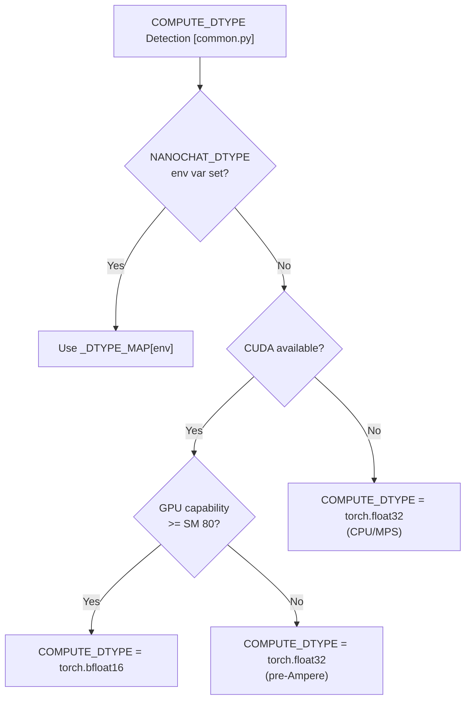
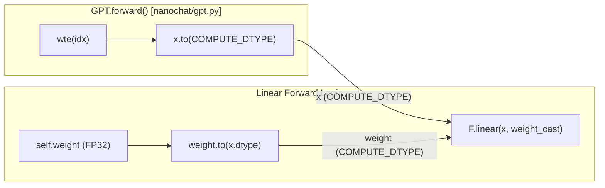
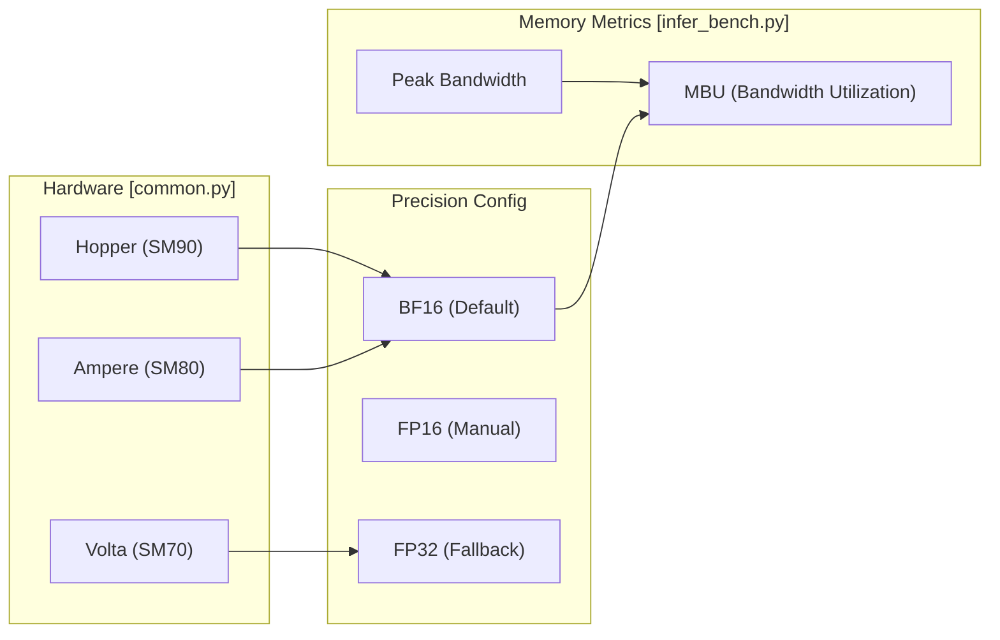

> [!WARNING]
> Imported from DeepWiki as generated, unverified repository documentation. Verify code-behavior claims against the revision below before stabilization.

# Precision and Memory Management

Relevant source files

The following files were used as context for generating this wiki page:

- [README.md](https://github.com/karpathy/nanochat/blob/92d63d4e8bb4df75c3b71618f31ddde2378b2bcd/README.md)
- [nanochat/common.py](https://github.com/karpathy/nanochat/blob/92d63d4e8bb4df75c3b71618f31ddde2378b2bcd/nanochat/common.py)
- [scripts/infer_bench.py](https://github.com/karpathy/nanochat/blob/92d63d4e8bb4df75c3b71618f31ddde2378b2bcd/scripts/infer_bench.py)

This page documents nanochat's explicit precision management system, which replaces PyTorch's `torch.amp.autocast` with a simpler, more transparent approach. The system centers on a single global `COMPUTE_DTYPE` constant that determines the precision for all compute operations (matmuls, activations), while maintaining FP32 master weights for optimizer precision.

## Design Philosophy: No Autocast Magic

nanochat explicitly manages precision instead of relying on `torch.amp.autocast`. The rationale is that autocast introduces "magic we don't control" — it silently decides which operations run in which precision via internal allowlists. For nanochat's architecture, the only thing autocast actually cast was `nn.Linear` weights from FP32 to BF16 for matmuls, while other operations (`F.rms_norm`, `F.cross_entropy`, and Flash Attention) already handle their own dtypes.

By making precision explicit, nanochat gains:
- **Fine-grained control** over which operations use which precision (e.g., experimenting with FP32 norms).
- **Transparency** — no hidden casting decisions.
- **Simplicity** — one global constant instead of context managers throughout the codebase.

**Sources:** [nanochat/common.py:13-15](https://github.com/karpathy/nanochat/blob/92d63d4e8bb4df75c3b71618f31ddde2378b2bcd/nanochat/common.py#L13-L15), [scripts/infer_bench.py:51-53](https://github.com/karpathy/nanochat/blob/92d63d4e8bb4df75c3b71618f31ddde2378b2bcd/scripts/infer_bench.py#L51-L53)

## COMPUTE_DTYPE Auto-Detection

The `COMPUTE_DTYPE` global variable is defined in `nanochat/common.py` and auto-detected based on hardware capabilities [nanochat/common.py:32](https://github.com/karpathy/nanochat/blob/92d63d4e8bb4df75c3b71618f31ddde2378b2bcd/nanochat/common.py#L32).

Title: COMPUTE_DTYPE Selection Logic

**Hardware Detection Table**

| Hardware | Default COMPUTE_DTYPE | Rationale |
|----------|----------------------|-----------|
| **CUDA SM 80+** (A100, H100, etc.) | `torch.bfloat16` | Native BF16 support [nanochat/common.py:25-26](https://github.com/karpathy/nanochat/blob/92d63d4e8bb4df75c3b71618f31ddde2378b2bcd/nanochat/common.py#L25-L26) |
| **CUDA SM < 80** (V100, T4, etc.) | `torch.float32` | BF16 not supported; falls back to FP32 by default to avoid GradScaler overhead unless forced [nanochat/common.py:27-29](https://github.com/karpathy/nanochat/blob/92d63d4e8bb4df75c3b71618f31ddde2378b2bcd/nanochat/common.py#L27-L29) |
| **CPU / MPS** | `torch.float32` | No reduced-precision tensor cores [nanochat/common.py:30-31](https://github.com/karpathy/nanochat/blob/92d63d4e8bb4df75c3b71618f31ddde2378b2bcd/nanochat/common.py#L30-L31) |

Users can override detection via the `NANOCHAT_DTYPE` environment variable using "bfloat16", "float16", or "float32" [nanochat/common.py:15-20](https://github.com/karpathy/nanochat/blob/92d63d4e8bb4df75c3b71618f31ddde2378b2bcd/nanochat/common.py#L15-L20).

**Sources:** [nanochat/common.py:13-33](https://github.com/karpathy/nanochat/blob/92d63d4e8bb4df75c3b71618f31ddde2378b2bcd/nanochat/common.py#L13-L33)

## Custom Linear Layer: Replacing Autocast

The core mechanism replacing autocast is an explicit casting strategy where weights are cast to match input dtypes in the forward pass. Model weights stay FP32 for optimizer precision [nanochat/common.py:13-14](https://github.com/karpathy/nanochat/blob/92d63d4e8bb4df75c3b71618f31ddde2378b2bcd/nanochat/common.py#L13-L14).

Title: Explicit Precision Data Flow

**Implementation Details:**
- **Master Weights:** Model weights are stored in **FP32** to maintain optimizer precision [nanochat/common.py:13](https://github.com/karpathy/nanochat/blob/92d63d4e8bb4df75c3b71618f31ddde2378b2bcd/nanochat/common.py#L13).
- **Dynamic Casting:** Linear layers cast their weights to `COMPUTE_DTYPE` in the forward pass [nanochat/common.py:14](https://github.com/karpathy/nanochat/blob/92d63d4e8bb4df75c3b71618f31ddde2378b2bcd/nanochat/common.py#L14).
- **Memory Optimization:** In benchmarking and inference, `weight_bytes` is calculated by multiplying the number of elements by the size of the stored precision [scripts/infer_bench.py:51-53](https://github.com/karpathy/nanochat/blob/92d63d4e8bb4df75c3b71618f31ddde2378b2bcd/scripts/infer_bench.py#L51-L53).

**Sources:** [nanochat/common.py:13-15](https://github.com/karpathy/nanochat/blob/92d63d4e8bb4df75c3b71618f31ddde2378b2bcd/nanochat/common.py#L13-L15), [scripts/infer_bench.py:51-53](https://github.com/karpathy/nanochat/blob/92d63d4e8bb4df75c3b71618f31ddde2378b2bcd/scripts/infer_bench.py#L51-L53)

## Memory Buffer Architecture

nanochat optimizes memory by varying storage dtypes based on the parameter type and training mode. The `weight_bytes` function in benchmarking scripts accounts for these variations to calculate memory utilization [scripts/infer_bench.py:51-53](https://github.com/karpathy/nanochat/blob/92d63d4e8bb4df75c3b71618f31ddde2378b2bcd/scripts/infer_bench.py#L51-L53).

| Component | Precision Management |
|-----------|----------------------|
| **Matmuls** | Performed in `COMPUTE_DTYPE` [nanochat/common.py:13](https://github.com/karpathy/nanochat/blob/92d63d4e8bb4df75c3b71618f31ddde2378b2bcd/nanochat/common.py#L13). |
| **Activations** | Stored/processed in `COMPUTE_DTYPE` [nanochat/common.py:13](https://github.com/karpathy/nanochat/blob/92d63d4e8bb4df75c3b71618f31ddde2378b2bcd/nanochat/common.py#L13). |
| **Master Weights** | Stored in `float32` for precision [nanochat/common.py:13](https://github.com/karpathy/nanochat/blob/92d63d4e8bb4df75c3b71618f31ddde2378b2bcd/nanochat/common.py#L13). |
| **KV Cache** | Size depends on architecture; benchmarking accounts for `kv_bytes_per_token` [scripts/infer_bench.py:48-53](https://github.com/karpathy/nanochat/blob/92d63d4e8bb4df75c3b71618f31ddde2378b2bcd/scripts/infer_bench.py#L48-L53). |

**Sources:** [nanochat/common.py:13-15](https://github.com/karpathy/nanochat/blob/92d63d4e8bb4df75c3b71618f31ddde2378b2bcd/nanochat/common.py#L13-L15), [scripts/infer_bench.py:48-53](https://github.com/karpathy/nanochat/blob/92d63d4e8bb4df75c3b71618f31ddde2378b2bcd/scripts/infer_bench.py#L48-L53)

## Hardware to Precision Mapping

The system automatically scales based on the available GPU resources, particularly focusing on CUDA capability and peak memory bandwidth.

Title: Hardware to Precision Mapping

**Sources:** [nanochat/common.py:17-31](https://github.com/karpathy/nanochat/blob/92d63d4e8bb4df75c3b71618f31ddde2378b2bcd/nanochat/common.py#L17-L31), [scripts/infer_bench.py:15-17](https://github.com/karpathy/nanochat/blob/92d63d4e8bb4df75c3b71618f31ddde2378b2bcd/scripts/infer_bench.py#L15-L17)
