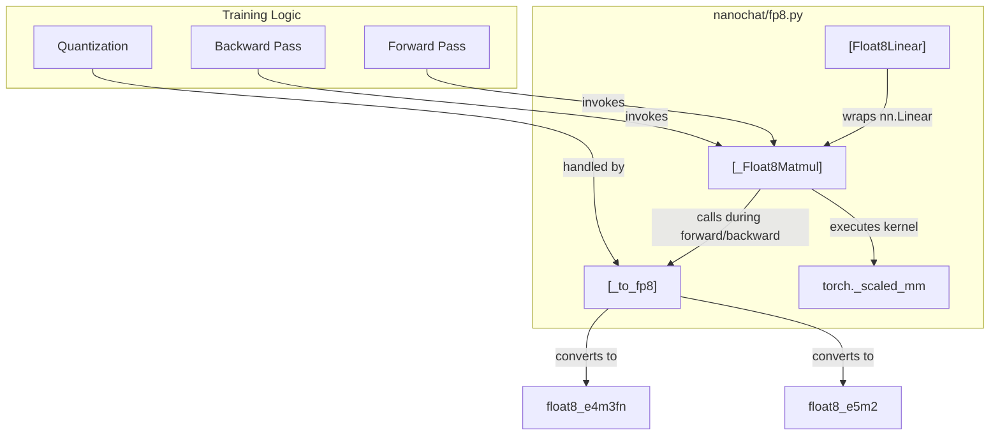
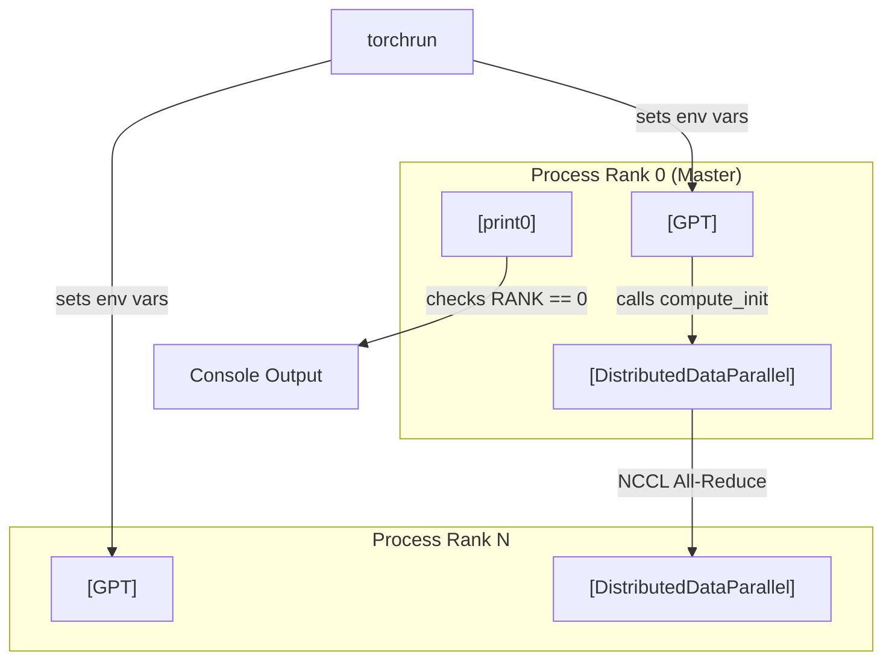

> [!WARNING]
> Imported from DeepWiki as generated, unverified repository documentation. Verify code-behavior claims against the revision below before stabilization.

# Advanced Training Features

Relevant source files

The following files were used as context for generating this wiki page:

- [nanochat/common.py](https://github.com/karpathy/nanochat/blob/92d63d4e8bb4df75c3b71618f31ddde2378b2bcd/nanochat/common.py)
- [nanochat/flash_attention.py](https://github.com/karpathy/nanochat/blob/92d63d4e8bb4df75c3b71618f31ddde2378b2bcd/nanochat/flash_attention.py)
- [nanochat/fp8.py](https://github.com/karpathy/nanochat/blob/92d63d4e8bb4df75c3b71618f31ddde2378b2bcd/nanochat/fp8.py)
- [scripts/infer_bench.py](https://github.com/karpathy/nanochat/blob/92d63d4e8bb4df75c3b71618f31ddde2378b2bcd/scripts/infer_bench.py)
- [tests/test_attention_fallback.py](https://github.com/karpathy/nanochat/blob/92d63d4e8bb4df75c3b71618f31ddde2378b2bcd/tests/test_attention_fallback.py)

This page documents specialized training techniques that enable efficient training at scale. These features are critical for the speedrun challenge: achieving GPT-2 capability in under 3 hours on 8xH100 GPUs. For the core training loop, see [Base Model Pretraining](deepwiki-03-base-model-pretraining.md). For optimizer details, see [Optimization System](deepwiki-05-optimization-system.md).

## Overview

The advanced training system has three main components:

| Component | Purpose | Key Feature |
|-----------|---------|-------------|
| FP8 Training | Quantized matmuls on H100 | ~2x faster matmuls via `torch._scaled_mm` |
| Distributed Training | Multi-GPU synchronization | Linear scaling via NCCL and `torchrun` |
| Precision Management | Hardware-aware dtypes | `COMPUTE_DTYPE` auto-detection and fallback |

All features are optional but critical for competitive speedrun times. Training works on CPU/single GPU without them, but performance degrades significantly.

---

## 8.1 FP8 Training with torchao

FP8 (8-bit floating point) training uses lower-precision arithmetic for matrix multiplications while maintaining model weights and optimizer state in BF16/FP32. The implementation in `nanochat/fp8.py` is a minimal ~150 line alternative to `torchao`, focusing on tensorwise dynamic scaling [nanochat/fp8.py:1-7](https://github.com/karpathy/nanochat/blob/92d63d4e8bb4df75c3b71618f31ddde2378b2bcd/nanochat/fp8.py#L1-L7).

### Implementation Logic
The system wraps the three matmuls of a standard `nn.Linear` layer (forward, grad_input, grad_weight) using a custom `torch.autograd.Function` named `_Float8Matmul` [nanochat/fp8.py:125-132](https://github.com/karpathy/nanochat/blob/92d63d4e8bb4df75c3b71618f31ddde2378b2bcd/nanochat/fp8.py#L125-L132). It uses `float8_e4m3fn` for inputs/weights and `float8_e5m2` for gradients to balance precision and dynamic range [nanochat/fp8.py:24-30](https://github.com/karpathy/nanochat/blob/92d63d4e8bb4df75c3b71618f31ddde2378b2bcd/nanochat/fp8.py#L24-L30).

**Code Entity Space to Natural Language Space**

**Sources:** [nanochat/fp8.py:1-70](https://github.com/karpathy/nanochat/blob/92d63d4e8bb4df75c3b71618f31ddde2378b2bcd/nanochat/fp8.py#L1-L70), [nanochat/fp8.py:125-155](https://github.com/karpathy/nanochat/blob/92d63d4e8bb4df75c3b71618f31ddde2378b2bcd/nanochat/fp8.py#L125-L155)

For implementation details on `Float8Linear` conversion and the `disable_fp8` context manager, see [FP8 Training with torchao](deepwiki-08-01-fp8-training-with-torchao.md).

---

## 8.2 Distributed Training with DDP

PyTorch Distributed Data Parallel (DDP) enables training across multiple GPUs with gradient synchronization via NCCL. The system relies on `torchrun` to provide environment variables like `RANK`, `LOCAL_RANK`, and `WORLD_SIZE` [nanochat/common.py:151-160](https://github.com/karpathy/nanochat/blob/92d63d4e8bb4df75c3b71618f31ddde2378b2bcd/nanochat/common.py#L151-L160).

### Initialization and Sync
The `compute_init` function handles the boilerplate of setting the local device and initializing the process group [nanochat/common.py:173-188](https://github.com/karpathy/nanochat/blob/92d63d4e8bb4df75c3b71618f31ddde2378b2bcd/nanochat/common.py#L173-L188). It ensures that only the master rank (rank 0) performs certain operations like downloading data or printing banners [nanochat/common.py:117-121](https://github.com/karpathy/nanochat/blob/92d63d4e8bb4df75c3b71618f31ddde2378b2bcd/nanochat/common.py#L117-L121).

**Distributed System Architecture**

**Sources:** [nanochat/common.py:117-121](https://github.com/karpathy/nanochat/blob/92d63d4e8bb4df75c3b71618f31ddde2378b2bcd/nanochat/common.py#L117-L121), [nanochat/common.py:151-188](https://github.com/karpathy/nanochat/blob/92d63d4e8bb4df75c3b71618f31ddde2378b2bcd/nanochat/common.py#L151-L188)

For details on process group setup and rank-aware logging, see [Distributed Training with DDP](deepwiki-08-02-distributed-training-with-ddp.md).

---

## 8.3 Precision and Memory Management

The codebase uses an explicit `COMPUTE_DTYPE` system instead of standard `autocast`. This allows the model to adapt to hardware capabilities automatically by checking CUDA compute capabilities [nanochat/common.py:17-31](https://github.com/karpathy/nanochat/blob/92d63d4e8bb4df75c3b71618f31ddde2378b2bcd/nanochat/common.py#L17-L31).

### Hardware-Specific Selection
- **Ampere+ (A100/H100):** Defaults to `torch.bfloat16` if capability is >= 8.0 [nanochat/common.py:25-26](https://github.com/karpathy/nanochat/blob/92d63d4e8bb4df75c3b71618f31ddde2378b2bcd/nanochat/common.py#L25-L26).
- **Pre-Ampere (V100/T4):** Defaults to `torch.float32` unless forced via `NANOCHAT_DTYPE`, as `float16` training requires a `GradScaler` which is handled separately [nanochat/common.py:27-29](https://github.com/karpathy/nanochat/blob/92d63d4e8bb4df75c3b71618f31ddde2378b2bcd/nanochat/common.py#L27-L29).

### Memory Optimizations
The system employs several low-level tricks to maximize throughput:
- **Unified Attention Interface:** The `flash_attn` module automatically switches between Flash Attention 3 (FA3) for H100/A100 and PyTorch SDPA for older hardware or CPU [nanochat/flash_attention.py:2-15](https://github.com/karpathy/nanochat/blob/92d63d4e8bb4df75c3b71618f31ddde2378b2bcd/nanochat/flash_attention.py#L2-L15). It performs detection based on `torch.cuda.get_device_capability()` [nanochat/flash_attention.py:23-46](https://github.com/karpathy/nanochat/blob/92d63d4e8bb4df75c3b71618f31ddde2378b2bcd/nanochat/flash_attention.py#L23-L46).
- **KV Cache Management:** For inference, the `Engine` class manages a pre-allocated `KVCache` to avoid repeated memory allocations during generation [scripts/infer_bench.py:44-50](https://github.com/karpathy/nanochat/blob/92d63d4e8bb4df75c3b71618f31ddde2378b2bcd/scripts/infer_bench.py#L44-L50).

**Precision Selection Logic**

| Condition | Selected Dtype | Mechanism |
|-----------|----------------|-----------|
| `NANOCHAT_DTYPE` set | User preference | `_DTYPE_MAP` lookup [nanochat/common.py:18-20](https://github.com/karpathy/nanochat/blob/92d63d4e8bb4df75c3b71618f31ddde2378b2bcd/nanochat/common.py#L18-L20) |
| CUDA Capability >= 8.0 | `torch.bfloat16` | Native BF16 support [nanochat/common.py:25-26](https://github.com/karpathy/nanochat/blob/92d63d4e8bb4df75c3b71618f31ddde2378b2bcd/nanochat/common.py#L25-L26) |
| CUDA Capability < 8.0 | `torch.float32` | Avoids underflow [nanochat/common.py:27-29](https://github.com/karpathy/nanochat/blob/92d63d4e8bb4df75c3b71618f31ddde2378b2bcd/nanochat/common.py#L27-L29) |
| CPU / MPS | `torch.float32` | Standard fallback [nanochat/common.py:30-31](https://github.com/karpathy/nanochat/blob/92d63d4e8bb4df75c3b71618f31ddde2378b2bcd/nanochat/common.py#L30-L31) |

**Sources:** [nanochat/common.py:17-31](https://github.com/karpathy/nanochat/blob/92d63d4e8bb4df75c3b71618f31ddde2378b2bcd/nanochat/common.py#L17-L31), [nanochat/flash_attention.py:2-46](https://github.com/karpathy/nanochat/blob/92d63d4e8bb4df75c3b71618f31ddde2378b2bcd/nanochat/flash_attention.py#L2-L46), [scripts/infer_bench.py:51-54](https://github.com/karpathy/nanochat/blob/92d63d4e8bb4df75c3b71618f31ddde2378b2bcd/scripts/infer_bench.py#L51-L54)

For details on the `GradScaler` for fp16 and memory buffer architecture, see [Precision and Memory Management](deepwiki-08-03-precision-and-memory-management.md).
