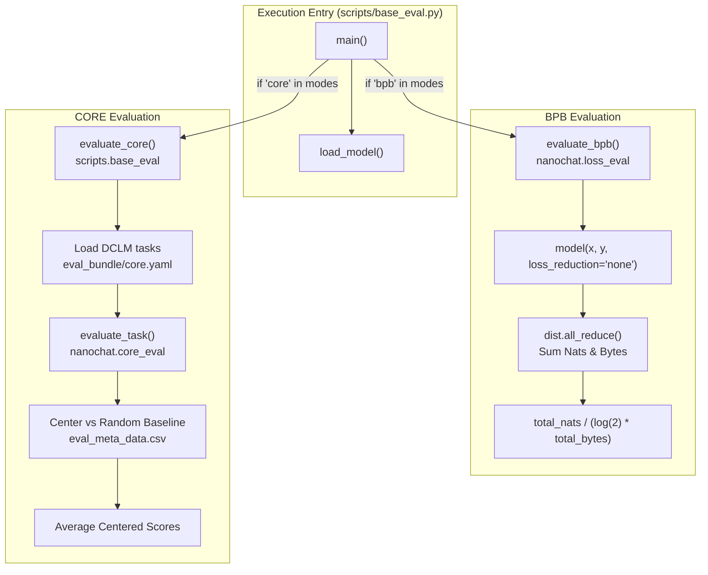
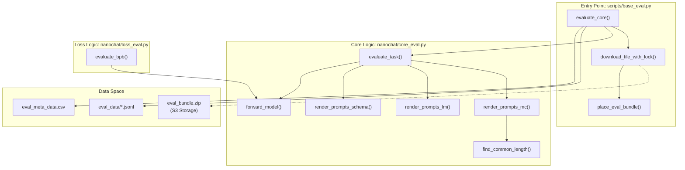

> [!WARNING]
> Imported from DeepWiki as generated, unverified repository documentation. Verify code-behavior claims against the revision below before stabilization.

# CORE Score and Validation Metrics

Relevant source files

The following files were used as context for generating this wiki page:

- .python-version
- [nanochat/__init__.py](https://github.com/karpathy/nanochat/blob/92d63d4e8bb4df75c3b71618f31ddde2378b2bcd/nanochat/__init__.py)
- [nanochat/core_eval.py](https://github.com/karpathy/nanochat/blob/92d63d4e8bb4df75c3b71618f31ddde2378b2bcd/nanochat/core_eval.py)
- [scripts/base_eval.py](https://github.com/karpathy/nanochat/blob/92d63d4e8bb4df75c3b71618f31ddde2378b2bcd/scripts/base_eval.py)

## Purpose and Scope

This page documents the two primary validation metrics used in nanochat: the **CORE score** and **bits per byte (BPB)**. These metrics measure model quality from different perspectives—CORE evaluates downstream task performance on 22 benchmarks using In-Context Learning (ICL) [nanochat/core_eval.py:1-4](https://github.com/karpathy/nanochat/blob/92d63d4e8bb4df75c3b71618f31ddde2378b2bcd/nanochat/core_eval.py#L1-L4), while BPB measures validation loss in vocabulary-size-invariant units [nanochat/loss_eval.py:11-16](https://github.com/karpathy/nanochat/blob/92d63d4e8bb4df75c3b71618f31ddde2378b2bcd/nanochat/loss_eval.py#L11-L16). Both metrics are critical for tracking training progress and determining when a model has reached GPT-2-level capability.

For information about training performance metrics like MFU and throughput, see page 9.3. For details about the specific tasks evaluated in chat models (ARC, MMLU, GSM8K), see page 7.3 on ChatCORE Evaluation.

Sources: [scripts/base_eval.py:1-10](https://github.com/karpathy/nanochat/blob/92d63d4e8bb4df75c3b71618f31ddde2378b2bcd/scripts/base_eval.py#L1-L10), [nanochat/loss_eval.py:1-4](https://github.com/karpathy/nanochat/blob/92d63d4e8bb4df75c3b71618f31ddde2378b2bcd/nanochat/loss_eval.py#L1-L4), [nanochat/core_eval.py:1-7](https://github.com/karpathy/nanochat/blob/92d63d4e8bb4df75c3b71618f31ddde2378b2bcd/nanochat/core_eval.py#L1-L7)

---

## CORE Score: The DCLM Benchmark

### What is CORE?

The CORE score is an ensemble metric introduced in the DCLM (DataComp for Language Models) paper that aggregates performance across 22 diverse evaluation tasks [nanochat/core_eval.py:1-4](https://github.com/karpathy/nanochat/blob/92d63d4e8bb4df75c3b71618f31ddde2378b2bcd/nanochat/core_eval.py#L1-L4). These tasks span multiple-choice science questions (ARC), general knowledge (MMLU), reasoning benchmarks, and other capabilities. The score is computed by centering each task's accuracy around a reference model's performance and averaging the centered results [scripts/base_eval.py:117-122](https://github.com/karpathy/nanochat/blob/92d63d4e8bb4df75c3b71618f31ddde2378b2bcd/scripts/base_eval.py#L117-L122).

**The GPT-2 Threshold**: OpenAI's GPT-2 (124M) achieves a CORE score of **0.256525**. This is the primary target for nanochat's "Time-to-GPT-2" leaderboard—models must exceed this score to be considered GPT-2-grade.

Sources: [scripts/base_eval.py:5-9](https://github.com/karpathy/nanochat/blob/92d63d4e8bb4df75c3b71618f31ddde2378b2bcd/scripts/base_eval.py#L5-L9), [scripts/base_eval.py:117-122](https://github.com/karpathy/nanochat/blob/92d63d4e8bb4df75c3b71618f31ddde2378b2bcd/scripts/base_eval.py#L117-L122)

### How CORE is Computed

The CORE metric evaluation is implemented in `scripts/base_eval.py` via the `evaluate_core()` function [scripts/base_eval.py:57-123](https://github.com/karpathy/nanochat/blob/92d63d4e8bb4df75c3b71618f31ddde2378b2bcd/scripts/base_eval.py#L57-L123). The evaluation process:

1.  **Bundle Placement**: Downloads and unzips the `eval_bundle.zip` from S3 if not present [scripts/base_eval.py:42-54](https://github.com/karpathy/nanochat/blob/92d63d4e8bb4df75c3b71618f31ddde2378b2bcd/scripts/base_eval.py#L42-L54), [scripts/base_eval.py:65-66](https://github.com/karpathy/nanochat/blob/92d63d4e8bb4df75c3b71618f31ddde2378b2bcd/scripts/base_eval.py#L65-L66).
2.  **Task Loading**: Loads 22 task definitions from `eval_bundle/core.yaml` [scripts/base_eval.py:72-74](https://github.com/karpathy/nanochat/blob/92d63d4e8bb4df75c3b71618f31ddde2378b2bcd/scripts/base_eval.py#L72-L74).
3.  **Sampling**: For each task, samples up to `max_per_task` examples (default -1 for all) and shuffles with a fixed seed (1337) for consistency [scripts/base_eval.py:104-107](https://github.com/karpathy/nanochat/blob/92d63d4e8bb4df75c3b71618f31ddde2378b2bcd/scripts/base_eval.py#L104-L107).
4.  **Accuracy**: Computes per-task accuracy using `evaluate_task()` from `nanochat.core_eval` [scripts/base_eval.py:109](https://github.com/karpathy/nanochat/blob/92d63d4e8bb4df75c3b71618f31ddde2378b2bcd/scripts/base_eval.py#L109).
5.  **Centering**: Centers each task's score around a random baseline found in `eval_meta_data.csv`: `centered_result = (accuracy - 0.01 * random_baseline) / (1.0 - 0.01 * random_baseline)` [scripts/base_eval.py:77-83](https://github.com/karpathy/nanochat/blob/92d63d4e8bb4df75c3b71618f31ddde2378b2bcd/scripts/base_eval.py#L77-L83), [scripts/base_eval.py:112-113](https://github.com/karpathy/nanochat/blob/92d63d4e8bb4df75c3b71618f31ddde2378b2bcd/scripts/base_eval.py#L112-L113).
6.  **Aggregation**: Averages the centered scores to produce the final `core_metric` [scripts/base_eval.py:117](https://github.com/karpathy/nanochat/blob/92d63d4e8bb4df75c3b71618f31ddde2378b2bcd/scripts/base_eval.py#L117).

Sources: [scripts/base_eval.py:57-123](https://github.com/karpathy/nanochat/blob/92d63d4e8bb4df75c3b71618f31ddde2378b2bcd/scripts/base_eval.py#L57-L123), [nanochat/core_eval.py:168-173](https://github.com/karpathy/nanochat/blob/92d63d4e8bb4df75c3b71618f31ddde2378b2bcd/nanochat/core_eval.py#L168-L173)

### Task Types and Prompt Rendering

The `nanochat/core_eval.py` module handles the logic for different ICL (In-Context Learning) task types using Jinja2 templates:

*   **Multiple Choice (MC)**: Renders prompts where the model chooses between several options. The context remains the same across choices [nanochat/core_eval.py:17-33](https://github.com/karpathy/nanochat/blob/92d63d4e8bb4df75c3b71618f31ddde2378b2bcd/nanochat/core_eval.py#L17-L33).
*   **Schema**: Renders prompts where contexts vary but the continuation (the "gold" answer) is the same [nanochat/core_eval.py:36-53](https://github.com/karpathy/nanochat/blob/92d63d4e8bb4df75c3b71618f31ddde2378b2bcd/nanochat/core_eval.py#L36-L53).
*   **Language Modeling (LM)**: Compares prompts with and without the continuation to calculate log-likelihood. It ensures the prompt without the continuation is a strict prefix of the prompt with it [nanochat/core_eval.py:56-83](https://github.com/karpathy/nanochat/blob/92d63d4e8bb4df75c3b71618f31ddde2378b2bcd/nanochat/core_eval.py#L56-L83).

Sources: [nanochat/core_eval.py:17-83](https://github.com/karpathy/nanochat/blob/92d63d4e8bb4df75c3b71618f31ddde2378b2bcd/nanochat/core_eval.py#L17-L83), [nanochat/core_eval.py:113-142](https://github.com/karpathy/nanochat/blob/92d63d4e8bb4df75c3b71618f31ddde2378b2bcd/nanochat/core_eval.py#L113-L142)

---

## Bits Per Byte (BPB): Vocabulary-Size-Invariant Loss

### What is BPB?

**Bits per byte (BPB)** is a vocabulary-size-invariant metric for measuring validation loss. Unlike raw cross-entropy loss, which depends on vocabulary size, BPB normalizes the loss by the number of bytes represented by each token [nanochat/loss_eval.py:11-16](https://github.com/karpathy/nanochat/blob/92d63d4e8bb4df75c3b71618f31ddde2378b2bcd/nanochat/loss_eval.py#L11-L16). This makes it possible to compare models with different vocabularies fairly (e.g., GPT-2 vs. Llama-3 tokenizers).

The relationship between cross-entropy loss (in nats) and BPB is:
`bpb = total_nats / (math.log(2) * total_bytes)` [nanochat/loss_eval.py:64](https://github.com/karpathy/nanochat/blob/92d63d4e8bb4df75c3b71618f31ddde2378b2bcd/nanochat/loss_eval.py#L64).

Sources: [nanochat/loss_eval.py:11-16](https://github.com/karpathy/nanochat/blob/92d63d4e8bb4df75c3b71618f31ddde2378b2bcd/nanochat/loss_eval.py#L11-L16), [nanochat/loss_eval.py:64](https://github.com/karpathy/nanochat/blob/92d63d4e8bb4df75c3b71618f31ddde2378b2bcd/nanochat/loss_eval.py#L64)

### Implementation Details

The BPB metric is implemented in `nanochat/loss_eval.py` via the `evaluate_bpb()` function [nanochat/loss_eval.py:9-65](https://github.com/karpathy/nanochat/blob/92d63d4e8bb4df75c3b71618f31ddde2378b2bcd/nanochat/loss_eval.py#L9-L65).

1.  **Token Bytes Mapping**: Uses a `token_bytes` tensor (1D tensor of shape `vocab_size`) indicating the number of bytes for each token ID. This is passed to the function and used to weight the loss [nanochat/loss_eval.py:23-26](https://github.com/karpathy/nanochat/blob/92d63d4e8bb4df75c3b71618f31ddde2378b2bcd/nanochat/loss_eval.py#L23-L26), [scripts/base_eval.py:152](https://github.com/karpathy/nanochat/blob/92d63d4e8bb4df75c3b71618f31ddde2378b2bcd/scripts/base_eval.py#L152).
2.  **Masking**: Special tokens or ignored targets (index < 0) are handled by checking the `valid` mask. Targets with 0 bytes are excluded from the calculation [nanochat/loss_eval.py:20-21](https://github.com/karpathy/nanochat/blob/92d63d4e8bb4df75c3b71618f31ddde2378b2bcd/nanochat/loss_eval.py#L20-L21), [nanochat/loss_eval.py:36-48](https://github.com/karpathy/nanochat/blob/92d63d4e8bb4df75c3b71618f31ddde2378b2bcd/nanochat/loss_eval.py#L36-L48).
3.  **Distributed Reduction**: Accumulates `total_nats` and `total_bytes` across all ranks using `dist.all_reduce(op=dist.ReduceOp.SUM)` to ensure the metric is calculated over the full evaluation batch [nanochat/loss_eval.py:55-58](https://github.com/karpathy/nanochat/blob/92d63d4e8bb4df75c3b71618f31ddde2378b2bcd/nanochat/loss_eval.py#L55-L58).

Sources: [nanochat/loss_eval.py:9-65](https://github.com/karpathy/nanochat/blob/92d63d4e8bb4df75c3b71618f31ddde2378b2bcd/nanochat/loss_eval.py#L9-L65), [scripts/base_eval.py:152](https://github.com/karpathy/nanochat/blob/92d63d4e8bb4df75c3b71618f31ddde2378b2bcd/scripts/base_eval.py#L152)

---

## Evaluation Pipeline Flow

**Diagram: Evaluation Pipeline Flow**

This diagram illustrates the flow of metrics during the evaluation script. BPB measures tokenization-invariant loss [nanochat/loss_eval.py:11-16](https://github.com/karpathy/nanochat/blob/92d63d4e8bb4df75c3b71618f31ddde2378b2bcd/nanochat/loss_eval.py#L11-L16), while CORE evaluates downstream capabilities using the DCLM benchmark suite [nanochat/core_eval.py:1-4](https://github.com/karpathy/nanochat/blob/92d63d4e8bb4df75c3b71618f31ddde2378b2bcd/nanochat/core_eval.py#L1-L4).

Sources: [scripts/base_eval.py:128-180](https://github.com/karpathy/nanochat/blob/92d63d4e8bb4df75c3b71618f31ddde2378b2bcd/scripts/base_eval.py#L128-L180), [nanochat/loss_eval.py:9-65](https://github.com/karpathy/nanochat/blob/92d63d4e8bb4df75c3b71618f31ddde2378b2bcd/nanochat/loss_eval.py#L9-L65), [nanochat/core_eval.py:168-173](https://github.com/karpathy/nanochat/blob/92d63d4e8bb4df75c3b71618f31ddde2378b2bcd/nanochat/core_eval.py#L168-L173)

---

## Code Entity Mapping: Evaluation Components

**Diagram: Code Entity Relationships for Evaluation**

This diagram maps the high-level evaluation functions to the underlying logic and data sources. `evaluate_core` acts as the orchestrator [scripts/base_eval.py:57](https://github.com/karpathy/nanochat/blob/92d63d4e8bb4df75c3b71618f31ddde2378b2bcd/scripts/base_eval.py#L57), while `core_eval.py` provides the prompt engineering and model forward pass logic required for different ICL task formats [nanochat/core_eval.py:17-164](https://github.com/karpathy/nanochat/blob/92d63d4e8bb4df75c3b71618f31ddde2378b2bcd/nanochat/core_eval.py#L17-L164). Utility functions like `find_common_length` help identify continuation boundaries in token space [nanochat/core_eval.py:86-101](https://github.com/karpathy/nanochat/blob/92d63d4e8bb4df75c3b71618f31ddde2378b2bcd/nanochat/core_eval.py#L86-L101).

Sources: [scripts/base_eval.py:42-123](https://github.com/karpathy/nanochat/blob/92d63d4e8bb4df75c3b71618f31ddde2378b2bcd/scripts/base_eval.py#L42-L123), [nanochat/core_eval.py:17-164](https://github.com/karpathy/nanochat/blob/92d63d4e8bb4df75c3b71618f31ddde2378b2bcd/nanochat/core_eval.py#L17-L164), [nanochat/loss_eval.py:8-33](https://github.com/karpathy/nanochat/blob/92d63d4e8bb4df75c3b71618f31ddde2378b2bcd/nanochat/loss_eval.py#L8-L33)

---

## Summary of Validation Metrics

| Metric | Code Reference | Implementation | Purpose |
| :--- | :--- | :--- | :--- |
| **CORE Score** | `scripts/base_eval.py` | `evaluate_core()` | Measure downstream ICL capability; GPT-2 parity check (0.2565) [scripts/base_eval.py:57-123](https://github.com/karpathy/nanochat/blob/92d63d4e8bb4df75c3b71618f31ddde2378b2bcd/scripts/base_eval.py#L57-L123). |
| **BPB** | `nanochat/loss_eval.py` | `evaluate_bpb()` | Vocab-invariant validation loss; convergence monitoring [nanochat/loss_eval.py:9-65](https://github.com/karpathy/nanochat/blob/92d63d4e8bb4df75c3b71618f31ddde2378b2bcd/nanochat/loss_eval.py#L9-L65). |
| **Task Accuracy** | `nanochat/core_eval.py` | `evaluate_task()` | Raw performance on specific datasets (ARC, MMLU, etc.) [nanochat/core_eval.py:168-173](https://github.com/karpathy/nanochat/blob/92d63d4e8bb4df75c3b71618f31ddde2378b2bcd/nanochat/core_eval.py#L168-L173). |

Sources: [scripts/base_eval.py:5-9](https://github.com/karpathy/nanochat/blob/92d63d4e8bb4df75c3b71618f31ddde2378b2bcd/scripts/base_eval.py#L5-L9), [scripts/base_eval.py:117-122](https://github.com/karpathy/nanochat/blob/92d63d4e8bb4df75c3b71618f31ddde2378b2bcd/scripts/base_eval.py#L117-L122), [nanochat/loss_eval.py:11-16](https://github.com/karpathy/nanochat/blob/92d63d4e8bb4df75c3b71618f31ddde2378b2bcd/nanochat/loss_eval.py#L11-L16), [nanochat/core_eval.py:168-173](https://github.com/karpathy/nanochat/blob/92d63d4e8bb4df75c3b71618f31ddde2378b2bcd/nanochat/core_eval.py#L168-L173)
