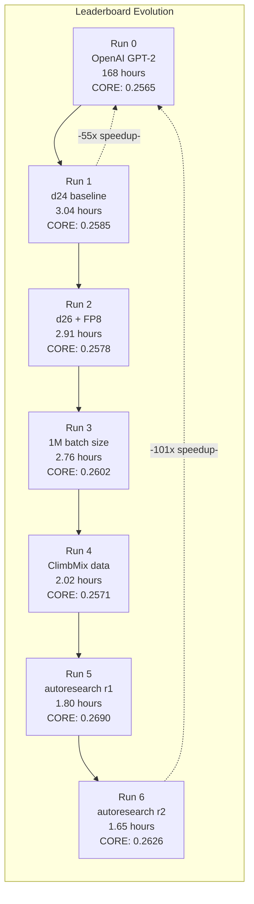
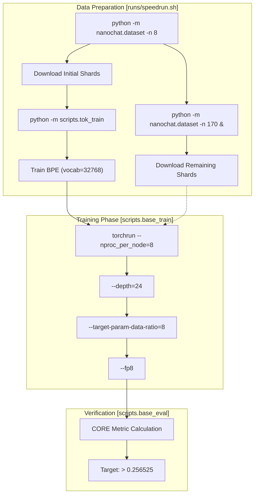
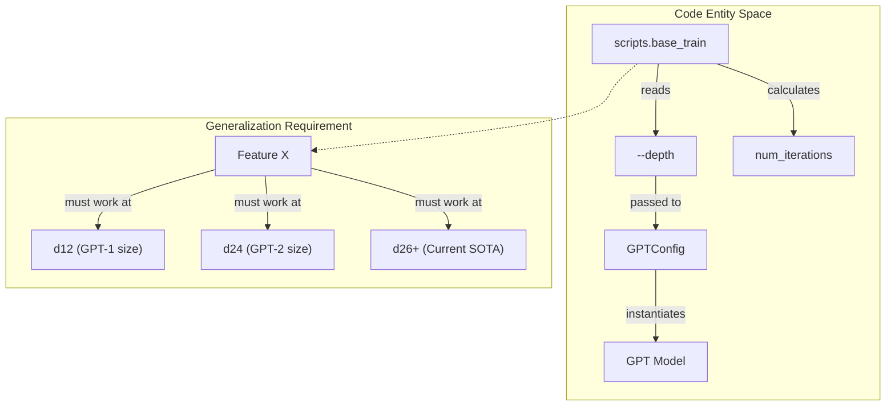

> [!WARNING]
> Imported from DeepWiki as generated, unverified repository documentation. Verify code-behavior claims against the revision below before stabilization.

# Time-to-GPT-2 Leaderboard

Relevant source files

The following files were used as context for generating this wiki page:

- [README.md](https://github.com/karpathy/nanochat/blob/92d63d4e8bb4df75c3b71618f31ddde2378b2bcd/README.md)
- [dev/LEADERBOARD.md](https://github.com/karpathy/nanochat/blob/92d63d4e8bb4df75c3b71618f31ddde2378b2bcd/dev/LEADERBOARD.md)
- [nanochat/tokenizer.py](https://github.com/karpathy/nanochat/blob/92d63d4e8bb4df75c3b71618f31ddde2378b2bcd/nanochat/tokenizer.py)

This document describes nanochat's Time-to-GPT-2 Leaderboard, which tracks the wall-clock time required to train a model to GPT-2 capability on an 8xH100 GPU node. The leaderboard incentivizes research progress and community collaboration by establishing a clear, reproducible benchmark and fostering competition to improve training efficiency.

For information about the CORE evaluation metric itself, see **9.1 CORE Score and Validation Metrics**. For details on the auto-configuration system that enables the miniseries requirement, see **3.2 The Complexity Dial: Auto-Configuration System**.

---

## The GPT-2 Benchmark Target

The leaderboard measures time to reach **GPT-2 capability**, defined as achieving a CORE score of **0.256525 or higher**. This threshold represents the performance of OpenAI's original GPT-2 (1.6B parameter) model from 2019 [README.md:16-16](https://github.com/karpathy/nanochat/blob/92d63d4e8bb4df75c3b71618f31ddde2378b2bcd/README.md#L16-L16), [README.md:24-24](https://github.com/karpathy/nanochat/blob/92d63d4e8bb4df75c3b71618f31ddde2378b2bcd/README.md#L24-L24).

**Historical Context:**
- **Original GPT-2 training (2019)**: 168 hours on 32 TPUv3 chips [dev/LEADERBOARD.md:5-5](https://github.com/karpathy/nanochat/blob/92d63d4e8bb4df75c3b71618f31ddde2378b2bcd/dev/LEADERBOARD.md#L5-L5).
- **Estimated cost**: ~$43,000 ($8/hour/TPUv3) [dev/LEADERBOARD.md:5-5](https://github.com/karpathy/nanochat/blob/92d63d4e8bb4df75c3b71618f31ddde2378b2bcd/dev/LEADERBOARD.md#L5-L5).
- **Current nanochat record**: ~1.65 hours on 8xH100 GPUs [README.md:22-22](https://github.com/karpathy/nanochat/blob/92d63d4e8bb4df75c3b71618f31ddde2378b2bcd/README.md#L22-L22).

This represents over **100x speedup** and **1000x cost reduction** due to advances across the stack, including the Muon optimizer, Flash Attention 3, and the NVIDIA ClimbMix dataset [README.md:20-24](https://github.com/karpathy/nanochat/blob/92d63d4e8bb4df75c3b71618f31ddde2378b2bcd/README.md#L20-L24).

**Sources:** [README.md:10-24](https://github.com/karpathy/nanochat/blob/92d63d4e8bb4df75c3b71618f31ddde2378b2bcd/README.md#L10-L24), [dev/LEADERBOARD.md:1-5](https://github.com/karpathy/nanochat/blob/92d63d4e8bb4df75c3b71618f31ddde2378b2bcd/dev/LEADERBOARD.md#L1-L5)

---

## Leaderboard Structure and Current Standings

The leaderboard tracks several key metrics for each submission to ensure both speed and quality:

| Metric | Description | Units |
|--------|-------------|-------|
| **time** | Wall-clock training time (excluding eval) | hours |
| **val_bpb** | Validation bits-per-byte at convergence | bits/byte |
| **CORE** | DCLM CORE ensemble score | 0-1 scale |
| **Description** | Summary of approach/changes | text |
| **Commit** | Git commit hash for reproducibility | SHA |

### Current Leaderboard Progression

**Sources:** [README.md:14-22](https://github.com/karpathy/nanochat/blob/92d63d4e8bb4df75c3b71618f31ddde2378b2bcd/README.md#L14-L22), [dev/LEADERBOARD.md:59-154](https://github.com/karpathy/nanochat/blob/92d63d4e8bb4df75c3b71618f31ddde2378b2bcd/dev/LEADERBOARD.md#L59-L154)

---

## Metrics and Requirements

### Primary Metric: total_training_time

The leaderboard ranks by `total_training_time` reported by `wandb`. This metric is calculated as the sum of wall-clock time for all training iterations alone [dev/LEADERBOARD.md:49-49](https://github.com/karpathy/nanochat/blob/92d63d4e8bb4df75c3b71618f31ddde2378b2bcd/dev/LEADERBOARD.md#L49-L49).

- **Included**: Forward passes, backward passes, and optimizer steps [dev/LEADERBOARD.md:49-49](https://github.com/karpathy/nanochat/blob/92d63d4e8bb4df75c3b71618f31ddde2378b2bcd/dev/LEADERBOARD.md#L49-L49).
- **Excluded**: Evaluations (CORE, validation bpb), sampling, logging overhead, and checkpoint saving [dev/LEADERBOARD.md:49-49](https://github.com/karpathy/nanochat/blob/92d63d4e8bb4df75c3b71618f31ddde2378b2bcd/dev/LEADERBOARD.md#L49-L49).

### Qualification Threshold

A submission qualifies if it meets the following criteria:
1. **CORE score ≥ 0.256525**: The model must outperform the original GPT-2 (1.6B) baseline [README.md:24-24](https://github.com/karpathy/nanochat/blob/92d63d4e8bb4df75c3b71618f31ddde2378b2bcd/README.md#L24-L24).
2. **Standard Hardware**: Results should be obtained on an 8xH100 GPU node for fair comparison [README.md:24-24](https://github.com/karpathy/nanochat/blob/92d63d4e8bb4df75c3b71618f31ddde2378b2bcd/README.md#L24-L24).
3. **Miniseries Generalization**: Changes must be principled enough to generalize across different model depths, not just a single point [dev/LEADERBOARD.md:51-51](https://github.com/karpathy/nanochat/blob/92d63d4e8bb4df75c3b71618f31ddde2378b2bcd/dev/LEADERBOARD.md#L51-L51).

**Sources:** [README.md:24-26](https://github.com/karpathy/nanochat/blob/92d63d4e8bb4df75c3b71618f31ddde2378b2bcd/README.md#L24-L26), [dev/LEADERBOARD.md:49-51](https://github.com/karpathy/nanochat/blob/92d63d4e8bb4df75c3b71618f31ddde2378b2bcd/dev/LEADERBOARD.md#L49-L51)

---

## The Speedrun Reference Implementation

The file `runs/speedrun.sh` implements the current state-of-the-art configuration. It handles the full pipeline from data acquisition to a functional chat interface [README.md:12-12](https://github.com/karpathy/nanochat/blob/92d63d4e8bb4df75c3b71618f31ddde2378b2bcd/README.md#L12-L12).

### Data and Training Flow

**Key Parameters in `speedrun.sh`:**
- **`--depth`**: Controls the size of the Transformer and auto-configures width and heads [dev/LEADERBOARD.md:29-29](https://github.com/karpathy/nanochat/blob/92d63d4e8bb4df75c3b71618f31ddde2378b2bcd/dev/LEADERBOARD.md#L29-L29).
- **`--target-param-data-ratio`**: Controls the training horizon (tokens per non-embedding parameter). The compute-optimal ratio is approximately 10.5, but `speedrun.sh` may use a lower ratio (e.g., 8) to target GPT-2 exactly [dev/LEADERBOARD.md:36-36](https://github.com/karpathy/nanochat/blob/92d63d4e8bb4df75c3b71618f31ddde2378b2bcd/dev/LEADERBOARD.md#L36-L36), [runs/speedrun.sh:73-73](https://github.com/karpathy/nanochat/blob/92d63d4e8bb4df75c3b71618f31ddde2378b2bcd/runs/speedrun.sh#L73-L73).
- **`--fp8`**: Enables FP8 training using `torchao` with tensorwise scaling for Linear layers [dev/LEADERBOARD.md:117-117](https://github.com/karpathy/nanochat/blob/92d63d4e8bb4df75c3b71618f31ddde2378b2bcd/dev/LEADERBOARD.md#L117-L117), [runs/speedrun.sh:73-73](https://github.com/karpathy/nanochat/blob/92d63d4e8bb4df75c3b71618f31ddde2378b2bcd/runs/speedrun.sh#L73-L73).

**Sources:** [runs/speedrun.sh:49-76](https://github.com/karpathy/nanochat/blob/92d63d4e8bb4df75c3b71618f31ddde2378b2bcd/runs/speedrun.sh#L49-L76), [dev/LEADERBOARD.md:9-37](https://github.com/karpathy/nanochat/blob/92d63d4e8bb4df75c3b71618f31ddde2378b2bcd/dev/LEADERBOARD.md#L9-L37), [README.md:32-35](https://github.com/karpathy/nanochat/blob/92d63d4e8bb4df75c3b71618f31ddde2378b2bcd/README.md#L32-L35)

---

## Submission and Contribution Guidelines

### Contribution Workflow

1. **Configure Run**: Use `scripts.base_train` with desired optimizations. To exclude evaluation time from the primary metric, set `--core-metric-every=999999` to only evaluate at the final step [dev/LEADERBOARD.md:35-35](https://github.com/karpathy/nanochat/blob/92d63d4e8bb4df75c3b71618f31ddde2378b2bcd/dev/LEADERBOARD.md#L35-L35).
2. **Verify Performance**: Ensure the `core_metric` in the `wandb` summary exceeds the threshold [dev/LEADERBOARD.md:42-43](https://github.com/karpathy/nanochat/blob/92d63d4e8bb4df75c3b71618f31ddde2378b2bcd/dev/LEADERBOARD.md#L42-L43).
3. **Check Generalization**: Verify that the improvement holds across the "miniseries" (e.g., d12, d16, d20) using `runs/miniseries.sh` [runs/miniseries.sh:30-31](https://github.com/karpathy/nanochat/blob/92d63d4e8bb4df75c3b71618f31ddde2378b2bcd/runs/miniseries.sh#L30-L31).
4. **Pull Request**: Submit a PR updating the `README.md` table and providing a detailed description in `dev/LEADERBOARD.md` [dev/LEADERBOARD.md:50-52](https://github.com/karpathy/nanochat/blob/92d63d4e8bb4df75c3b71618f31ddde2378b2bcd/dev/LEADERBOARD.md#L50-L52).

### Miniseries Requirement

Nanochat adheres to a **single complexity dial** philosophy [README.md:6-6](https://github.com/karpathy/nanochat/blob/92d63d4e8bb4df75c3b71618f31ddde2378b2bcd/README.md#L6-L6). Any architectural or optimizer change must be compatible with the auto-configuration system that scales hyperparameters based on `--depth` [README.md:6-6](https://github.com/karpathy/nanochat/blob/92d63d4e8bb4df75c3b71618f31ddde2378b2bcd/README.md#L6-L6).

**Sources:** [README.md:6-6](https://github.com/karpathy/nanochat/blob/92d63d4e8bb4df75c3b71618f31ddde2378b2bcd/README.md#L6-L6), [dev/LEADERBOARD.md:50-51](https://github.com/karpathy/nanochat/blob/92d63d4e8bb4df75c3b71618f31ddde2378b2bcd/dev/LEADERBOARD.md#L50-L51), [runs/miniseries.sh:30-31](https://github.com/karpathy/nanochat/blob/92d63d4e8bb4df75c3b71618f31ddde2378b2bcd/runs/miniseries.sh#L30-L31)

---

## Performance Analysis Tools

### Scaling Laws Analysis
The repository includes `runs/scaling_laws.sh` for analyzing how performance scales with compute. Researchers monitor `val_bpb` and `core_score` as functions of `total_training_time` and `total_training_flops` across various depths [runs/scaling_laws.sh:11-11](https://github.com/karpathy/nanochat/blob/92d63d4e8bb4df75c3b71618f31ddde2378b2bcd/runs/scaling_laws.sh#L11-L11), [runs/scaling_laws.sh:45-129](https://github.com/karpathy/nanochat/blob/92d63d4e8bb4df75c3b71618f31ddde2378b2bcd/runs/scaling_laws.sh#L45-L129).

### Miniseries Validation
The `runs/miniseries.sh` script automates the training of a range of model depths (12, 14, 16, 18, 20, 22, 24, 26) to ensure that code changes maintain scaling performance across the entire family of models [runs/miniseries.sh:31-31](https://github.com/karpathy/nanochat/blob/92d63d4e8bb4df75c3b71618f31ddde2378b2bcd/runs/miniseries.sh#L31-L31). It extracts key stats like `val_bpb`, `core_score`, and `train_time_sec` into a `results.csv` for analysis [runs/miniseries.sh:39-44](https://github.com/karpathy/nanochat/blob/92d63d4e8bb4df75c3b71618f31ddde2378b2bcd/runs/miniseries.sh#L39-L44).

**Sources:** [runs/miniseries.sh:30-111](https://github.com/karpathy/nanochat/blob/92d63d4e8bb4df75c3b71618f31ddde2378b2bcd/runs/miniseries.sh#L30-L111), [runs/scaling_laws.sh:1-138](https://github.com/karpathy/nanochat/blob/92d63d4e8bb4df75c3b71618f31ddde2378b2bcd/runs/scaling_laws.sh#L1-L138)
