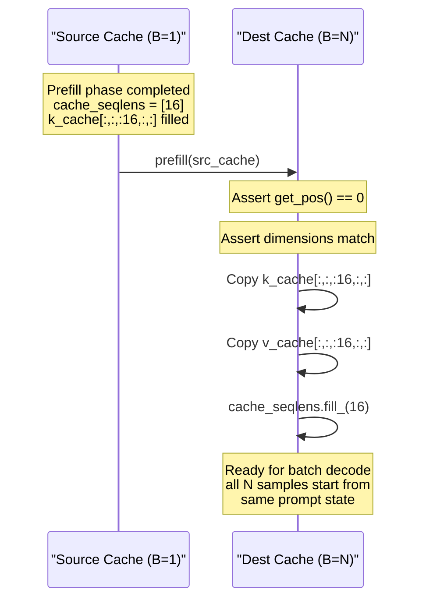
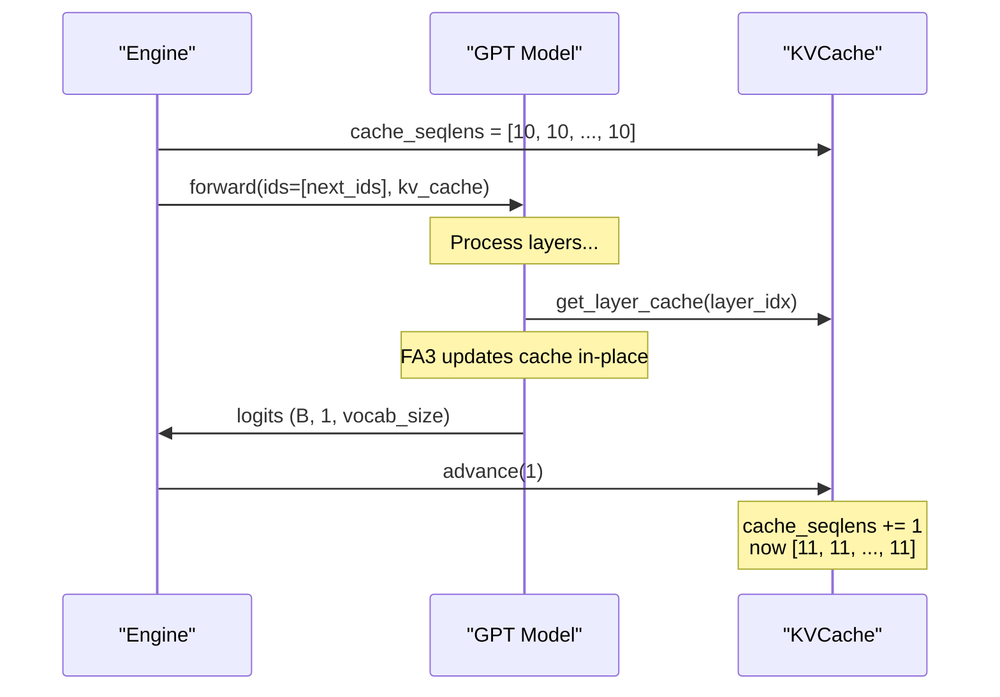

> [!WARNING]
> Imported from DeepWiki as generated, unverified repository documentation. Verify code-behavior claims against the revision below before stabilization.

# Inference Engine and KV Cache

<details>
<summary>Relevant source files</summary>

The following files were used as context for generating this wiki page:

- [nanochat/engine.py](https://github.com/karpathy/nanochat/blob/92d63d4e8bb4df75c3b71618f31ddde2378b2bcd/nanochat/engine.py)
- [tests/test_engine.py](https://github.com/karpathy/nanochat/blob/92d63d4e8bb4df75c3b71618f31ddde2378b2bcd/tests/test_engine.py)

</details>


## Purpose and Scope

This document describes the inference system used to generate text from trained nanochat models. It covers the `Engine` class architecture and the `KVCache` implementation that enables efficient batch generation through a two-phase prefill/decode strategy. The engine is designed to be purely token-based, agnostic of string tokenization, and optimized for performance.

**Sources:** [nanochat/engine.py:1-12](https://github.com/karpathy/nanochat/blob/92d63d4e8bb4df75c3b71618f31ddde2378b2bcd/nanochat/engine.py#L1-L12)

---

## System Architecture Overview

The inference system consists of three main components that work together to generate token sequences efficiently:

**Diagram: Inference System Component Relationships**

```mermaid
graph TB
    subgraph "User Code"
        [SCRIPT_ENTRY]["chat_cli.py / chat_web.py / base_eval.py"]
    end
    
    subgraph "nanochat/engine.py"
        [ENGINE_CLS]["Engine Class"]
        [KVCACHE_CLS]["KVCache Class"]
        [ROWSTATE_CLS]["RowState Class"]
        [SAMPLE_FUNC]["sample_next_token()"]
    end
    
    subgraph "nanochat/gpt.py"
        [GPT_MOD]["GPT Model"]
        [TBLOCKS]["TransformerBlock[]"]
    end
    
    subgraph "nanochat/tokenizer.py"
        [TOK_CLS]["Tokenizer"]
    end
    
    [SCRIPT_ENTRY] -->|"initialize"| [ENGINE_CLS]
    [SCRIPT_ENTRY] -->|"calls generate() or generate_batch()"| [ENGINE_CLS]
    
    [ENGINE_CLS] -->|"stores reference"| [GPT_MOD]
    [ENGINE_CLS] -->|"stores reference"| [TOK_CLS]
    [ENGINE_CLS] -->|"creates & manages"| [KVCACHE_CLS]
    [ENGINE_CLS] -->|"creates per-sample"| [ROWSTATE_CLS]
    [ENGINE_CLS] -->|"uses for sampling"| [SAMPLE_FUNC]
    
    [ENGINE_CLS] -->|"calls forward(ids, kv_cache)"| [GPT_MOD]
    [GPT_MOD] -->|"processes layers"| [TBLOCKS]
    [TBLOCKS] -->|"updates cache in-place"| [KVCACHE_CLS]
    
    [KVCACHE_CLS] -->|"stores k_cache, v_cache"| [KVCACHE_CLS]
    [KVCACHE_CLS] -->|"tracks cache_seqlens"| [KVCACHE_CLS]
```

**Sources:** [nanochat/engine.py:82-90](https://github.com/karpathy/nanochat/blob/92d63d4e8bb4df75c3b71618f31ddde2378b2bcd/nanochat/engine.py#L82-L90), [nanochat/engine.py:160-175](https://github.com/karpathy/nanochat/blob/92d63d4e8bb4df75c3b71618f31ddde2378b2bcd/nanochat/engine.py#L160-L175), [tests/test_engine.py:25-48](https://github.com/karpathy/nanochat/blob/92d63d4e8bb4df75c3b71618f31ddde2378b2bcd/tests/test_engine.py#L25-L48)

---

## KVCache: Flash Attention 3 Compatible Cache

The `KVCache` class implements a key-value cache specifically designed for Flash Attention 3's `flash_attn_with_kvcache` API. It differs significantly from FA2-style caches in tensor layout and update semantics.

### Tensor Layout and Structure

**Key design characteristics:**

| Aspect | Flash Attention 3 (nanochat) | Flash Attention 2 (legacy) |
|--------|------------------------------|----------------------------|
| Tensor shape | `(B, T, H, D)` | `(B, H, T, D)` |
| Update mechanism | In-place during `flash_attn_with_kvcache` | Manual copy after attention |
| Position tracking | Per-batch via `cache_seqlens` (int32) | Single global position |

The cache pre-allocates tensors for the maximum sequence length:

```python
# (n_layers, B, T, H, D)
self.k_cache = torch.zeros(num_layers, batch_size, seq_len, num_heads, head_dim, device=device, dtype=dtype)
self.v_cache = torch.zeros(num_layers, batch_size, seq_len, num_heads, head_dim, device=device, dtype=dtype)
# Current sequence length per batch element
self.cache_seqlens = torch.zeros(batch_size, dtype=torch.int32, device=device)
```

**Sources:** [nanochat/engine.py:82-102](https://github.com/karpathy/nanochat/blob/92d63d4e8bb4df75c3b71618f31ddde2378b2bcd/nanochat/engine.py#L82-L102)

### KVCache Methods and Lifecycle

**Diagram: KVCache Method Usage During Generation**

```mermaid
graph LR
    [INIT_METH]["__init__()"]
    [RESET_METH]["reset()"]
    [GETLAYER_METH]["get_layer_cache(layer_idx)"]
    [ADVANCE_METH]["advance(num_tokens)"]
    [GETPOS_METH]["get_pos()"]
    [PREFILL_METH]["prefill(other)"]
    
    [INIT_METH] -->|"creates cache tensors"| [RESET_METH]
    [RESET_METH] -->|"zeros cache_seqlens"| [GETPOS_METH]
    [GETPOS_METH] -->|"returns cache_seqlens[0]"| [GETPOS_METH]
    
    [INIT_METH] -->|"during generation"| [GETLAYER_METH]
    [GETLAYER_METH] -->|"returns (k_cache[layer], v_cache[layer])"| [ADVANCE_METH]
    [ADVANCE_METH] -->|"cache_seqlens += num_tokens"| [GETPOS_METH]
    
    [INIT_METH] -->|"for batch replication"| [PREFILL_METH]
    [PREFILL_METH] -->|"copies K/V from other cache"| [ADVANCE_METH]
```

**Method descriptions:**

| Method | Purpose | Usage |
|--------|---------|-------|
| `__init__` | Allocate cache tensors | Called once per generation request |
| `reset()` | Zero out `cache_seqlens` | Resets cache to empty state |
| `get_pos()` | Returns current position (assumes all batch elements at same position) | Query current cache fill level |
| `get_layer_cache(layer_idx)` | Returns `(k_cache[layer], v_cache[layer])` views | Called by each transformer layer |
| `advance(num_tokens)` | Increments `cache_seqlens` by `num_tokens` | Called after model forward pass |
| `prefill(other)` | Copies cached KV from another cache | Enables cache replication for batch generation |

**Sources:** [nanochat/engine.py:106-134](https://github.com/karpathy/nanochat/blob/92d63d4e8bb4df75c3b71618f31ddde2378b2bcd/nanochat/engine.py#L106-L134), [tests/test_engine.py:84-122](https://github.com/karpathy/nanochat/blob/92d63d4e8bb4df75c3b71618f31ddde2378b2bcd/tests/test_engine.py#L84-L122)

### Cache Prefill for Batch Generation

The `prefill()` method enables efficient batch generation by copying a batch=1 cache to a batch=N cache. This is critical for generating multiple samples from a single prompt without re-computing the prompt KV values for every sample.

**Diagram: Cache Prefill Process**



This design allows a single prefill pass for the prompt, then parallel generation of multiple samples. It also handles the "smear" state (previous token's normalized embedding) by expanding the `prev_embedding` from the source cache to the destination batch size.

**Sources:** [nanochat/engine.py:123-138](https://github.com/karpathy/nanochat/blob/92d63d4e8bb4df75c3b71618f31ddde2378b2bcd/nanochat/engine.py#L123-L138), [tests/test_engine.py:124-156](https://github.com/karpathy/nanochat/blob/92d63d4e8bb4df75c3b71618f31ddde2378b2bcd/tests/test_engine.py#L124-L156)

---

## Engine Class: Orchestrating Inference

The `Engine` class coordinates model forward passes, KV cache management, and token generation logic.

### Initialization and Dependencies

The `Engine` is initialized with a model and a tokenizer. The tokenizer is required specifically for handling tool-use logic (like the calculator), where the engine must decode and encode tokens to interact with Python evaluation.

**Sources:** [nanochat/engine.py:169-173](https://github.com/karpathy/nanochat/blob/92d63d4e8bb4df75c3b71618f31ddde2378b2bcd/nanochat/engine.py#L169-L173)

### Two-Phase Generation Architecture

The `generate()` method implements a two-phase strategy to maximize efficiency:

**Diagram: Two-Phase Generation Flow**

```mermaid
graph TB
    [START_NODE]["Input: tokens (list of int)<br/>num_samples=N"]
    
    subgraph "Phase 1: Prefill (Batch=1)"
        [CREATE1]["Create KVCache(batch_size=1,<br/>seq_len=len(tokens))"]
        [FORWARD1]["model.forward(tokens,<br/>kv_cache=prefill_cache)"]
        [LOGITS1]["Extract logits[:,-1,:]<br/>from last position"]
        [EXPAND_NODE]["Expand logits to<br/>(num_samples, vocab_size)"]
    end
    
    subgraph "Phase 2: Decode (Batch=N)"
        [CREATE2]["Create KVCache(batch_size=N,<br/>seq_len=hint)"]
        [REPLICATE_NODE]["decode_cache.prefill(<br/>prefill_cache)"]
        [INITSTATE_NODE]["Create N × RowState"]
        
        [LOOP_NODE]["Generation Loop"]
        [SAMPLE_NODE]["Sample next_ids for<br/>each batch element"]
        [PROCESS_NODE]["Process each row:<br/>forced tokens, tool logic,<br/>completion check"]
        [FORWARD2]["model.forward([next_ids],<br/>kv_cache=decode_cache)"]
        [YIELD_NODE]["Yield (token_column,<br/>token_masks)"]
    end
    
    [START_NODE] --> [CREATE1]
    [CREATE1] --> [FORWARD1]
    [FORWARD1] --> [LOGITS1]
    [LOGITS1] --> [EXPAND_NODE]
    
    [EXPAND_NODE] --> [CREATE2]
    [CREATE2] --> [REPLICATE_NODE]
    [REPLICATE_NODE] --> [INITSTATE_NODE]
    
    [INITSTATE_NODE] --> [LOOP_NODE]
    [LOOP_NODE] --> [SAMPLE_NODE]
    [SAMPLE_NODE] --> [PROCESS_NODE]
    [PROCESS_NODE] --> [FORWARD2]
    [FORWARD2] --> [YIELD_NODE]
    [YIELD_NODE] -->|"continue until<br/>max_tokens or<br/>all completed"| [LOOP_NODE]
```

**Phase 1 (Prefill):** Processes the prompt with batch=1 to fill the KV cache efficiently. The last logit is expanded to `num_samples` to allow independent sampling for each row. This ensures that when generating multiple samples, each sample gets an independently sampled first token.

**Phase 2 (Decode):** Replicates the cache to batch=N and generates tokens in parallel for all samples.

**Sources:** [nanochat/engine.py:182-275](https://github.com/karpathy/nanochat/blob/92d63d4e8bb4df75c3b71618f31ddde2378b2bcd/nanochat/engine.py#L182-L275), [tests/test_engine.py:158-199](https://github.com/karpathy/nanochat/blob/92d63d4e8bb4df75c3b71618f31ddde2378b2bcd/tests/test_engine.py#L158-L199)

---

## Generation State Management

### RowState: Per-Sample State Tracking

Each generated sample maintains its own state through the `RowState` class. This allows the engine to handle samples that finish at different times or trigger tool use independently.

**Diagram: RowState Usage in Generation Loop**

```mermaid
graph TB
    [ROWSTATES_NODE]["row_states = [RowState(tokens.copy())<br/>for _ in range(num_samples)]"]
    
    [LOOP_GEN]["For each generation step"]
    
    [SAMPLE_STEP]["Sample next_ids from logits"]
    
    [PROCESS_STEP]["For i, state in enumerate(row_states)"]
    
    [CHECKFORCED_NODE]{"state.forced_tokens<br/>not empty?"}
    [USEFORCED_NODE]["next_token = state.forced_tokens.popleft()<br/>mask = 0"]
    [USESAMPLED_NODE]["next_token = sampled_tokens[i]<br/>mask = 1"]
    
    [APPEND_NODE]["state.current_tokens.append(next_token)"]
    
    [CHECKEND_NODE]{"next_token in<br/>[assistant_end, bos]?"}
    [COMPLETE_NODE]["state.completed = True"]
    
    [ADDCOL_NODE]["token_column.append(next_token)<br/>token_masks.append(mask)"]
    
    [ROWSTATES_NODE] --> [LOOP_GEN]
    [LOOP_GEN] --> [SAMPLE_STEP]
    [SAMPLE_STEP] --> [PROCESS_STEP]
    [PROCESS_STEP] --> [CHECKFORCED_NODE]
    [CHECKFORCED_NODE] -->|"Yes"| [USEFORCED_NODE]
    [CHECKFORCED_NODE] -->|"No"| [USESAMPLED_NODE]
    [USEFORCED_NODE] --> [APPEND_NODE]
    [USESAMPLED_NODE] --> [APPEND_NODE]
    [APPEND_NODE] --> [CHECKEND_NODE]
    [CHECKEND_NODE] -->|"Yes"| [COMPLETE_NODE]
    [CHECKEND_NODE] -->|"No"| [ADDCOL_NODE]
    [COMPLETE_NODE] --> [ADDCOL_NODE]
    [ADDCOL_NODE] -->|"Next row"| [PROCESS_STEP]
    [ADDCOL_NODE] -->|"All rows done"| [LOOP_GEN]
```

The `forced_tokens` deque enables tool use by injecting calculator results or control tokens into the generation stream.

**Sources:** [nanochat/engine.py:160-168](https://github.com/karpathy/nanochat/blob/92d63d4e8bb4df75c3b71618f31ddde2378b2bcd/nanochat/engine.py#L160-L168), [nanochat/engine.py:236-267](https://github.com/karpathy/nanochat/blob/92d63d4e8bb4df75c3b71618f31ddde2378b2bcd/nanochat/engine.py#L236-L267)

### Generation Termination Conditions

Generation stops when any of these conditions is met:

1. **Max tokens reached:** The loop iterates up to `max_tokens`.
2. **All samples completed:** `all(state.completed for state in row_states)`.

A sample completes when it generates:
- `<|assistant_end|>` token (normal conversation end)
- `<|bos|>` token (beginning-of-sequence, often used as a stop signal in base models)

**Sources:** [nanochat/engine.py:224-230](https://github.com/karpathy/nanochat/blob/92d63d4e8bb4df75c3b71618f31ddde2378b2bcd/nanochat/engine.py#L224-L230), [nanochat/engine.py:247-249](https://github.com/karpathy/nanochat/blob/92d63d4e8bb4df75c3b71618f31ddde2378b2bcd/nanochat/engine.py#L247-L249)

---

## Generation Methods

### generate(): Streaming Token Generation

The `generate` method returns a generator that yields `(token_column, token_masks)` tuples. 
- `token_column`: A list of token IDs (one per sample).
- `token_masks`: A list of integers (1 if sampled, 0 if forced).

**Sources:** [nanochat/engine.py:182-275](https://github.com/karpathy/nanochat/blob/92d63d4e8bb4df75c3b71618f31ddde2378b2bcd/nanochat/engine.py#L182-L275)

### generate_batch(): Non-Streaming Wrapper

This is a convenience wrapper that collects all generated tokens into lists and returns `(results, masks)`. It automatically filters out terminal tokens (`assistant_end`, `bos`) from the final output for a cleaner API result.

**Sources:** [nanochat/engine.py:276-298](https://github.com/karpathy/nanochat/blob/92d63d4e8bb4df75c3b71618f31ddde2378b2bcd/nanochat/engine.py#L276-L298)

---

## Device and Dtype Management

The Engine handles device and dtype selection for KV cache allocation based on the model's location. If the model is on a CUDA device, it defaults to `torch.bfloat16` to leverage hardware acceleration; otherwise, it falls back to `torch.float32`.

**Sources:** [nanochat/engine.py:188-194](https://github.com/karpathy/nanochat/blob/92d63d4e8bb4df75c3b71618f31ddde2378b2bcd/nanochat/engine.py#L188-L194)

---

## Integration with Model Forward Pass

The Engine coordinates with the GPT model's forward method to update the KV cache during each step of decoding.

**Diagram: Model-Cache Interaction During Decode**



**Sources:** [nanochat/engine.py:273-274](https://github.com/karpathy/nanochat/blob/92d63d4e8bb4df75c3b71618f31ddde2378b2bcd/nanochat/engine.py#L273-L274), [tests/test_engine.py:39-47](https://github.com/karpathy/nanochat/blob/92d63d4e8bb4df75c3b71618f31ddde2378b2bcd/tests/test_engine.py#L39-L47)

---

## Testing and Validation

The test suite validates critical Engine behaviors, ensuring that the complex logic of cache replication and tool injection functions correctly.

| Test | Purpose | File |
|------|---------|------|
| `test_kv_cache_basic()` | Validates initialization, `advance`, `reset`, and layer view retrieval. | [tests/test_engine.py:84-122](https://github.com/karpathy/nanochat/blob/92d63d4e8bb4df75c3b71618f31ddde2378b2bcd/tests/test_engine.py#L84-L122) |
| `test_kv_cache_prefill()` | Ensures `prefill()` correctly copies data and updates position across different cache sizes. | [tests/test_engine.py:124-156](https://github.com/karpathy/nanochat/blob/92d63d4e8bb4df75c3b71618f31ddde2378b2bcd/tests/test_engine.py#L124-L156) |
| `test_multi_sample_first_token_diversity()` | Verifies that first tokens are independently sampled rather than broadcasted. | [tests/test_engine.py:158-199](https://github.com/karpathy/nanochat/blob/92d63d4e8bb4df75c3b71618f31ddde2378b2bcd/tests/test_engine.py#L158-L199) |
| `test_seed_reproducibility()` | Confirms that setting a seed produces deterministic results across multiple runs. | [tests/test_engine.py:201-212](https://github.com/karpathy/nanochat/blob/92d63d4e8bb4df75c3b71618f31ddde2378b2bcd/tests/test_engine.py#L201-L212) |

**Sources:** [tests/test_engine.py:1-212](https://github.com/karpathy/nanochat/blob/92d63d4e8bb4df75c3b71618f31ddde2378b2bcd/tests/test_engine.py#L1-L212)
