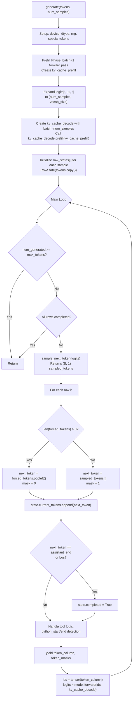
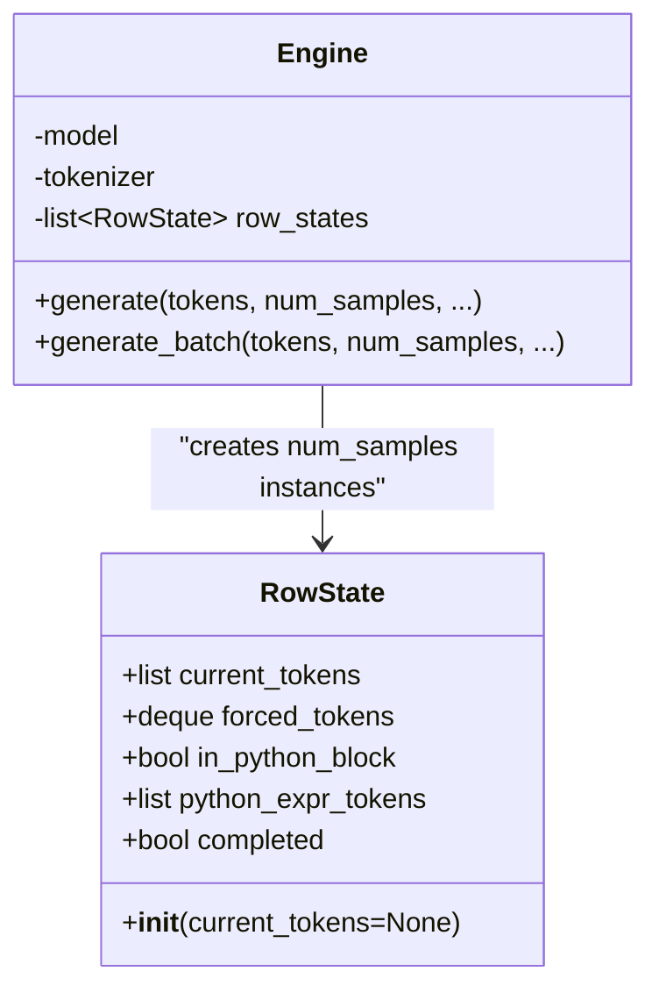
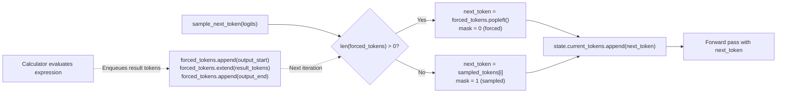
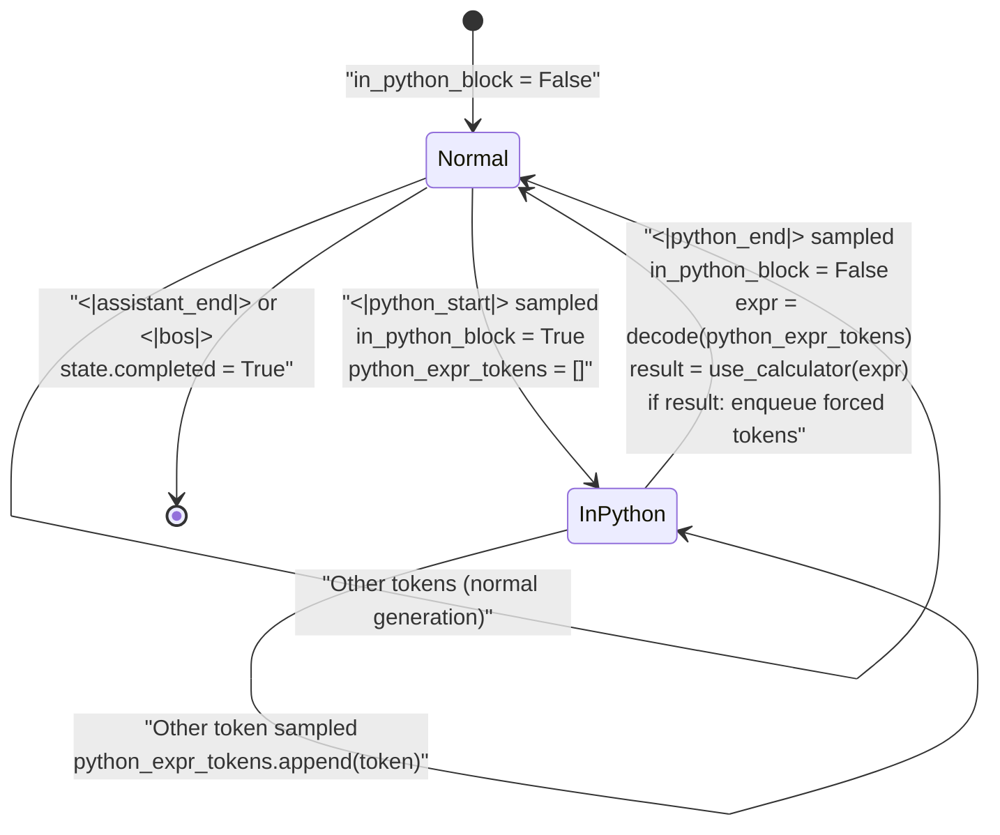
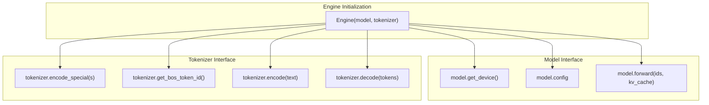

> [!WARNING]
> Imported from DeepWiki as generated, unverified repository documentation. Verify code-behavior claims against the revision below before stabilization.

# Text Generation and Sampling

<details>
<summary>Relevant source files</summary>

The following files were used as context for generating this wiki page:

- [nanochat/engine.py](https://github.com/karpathy/nanochat/blob/92d63d4e8bb4df75c3b71618f31ddde2378b2bcd/nanochat/engine.py)
- [tests/test_engine.py](https://github.com/karpathy/nanochat/blob/92d63d4e8bb4df75c3b71618f31ddde2378b2bcd/tests/test_engine.py)

</details>


This document describes the text generation and sampling system implemented in the `Engine` class. It covers the core sampling strategies (temperature, top-k), the streaming generation workflow, per-row state tracking, forced token injection, and the tool use state machine that enables calculator functionality during generation.

For information about KV cache management and the prefill-replicate-decode pattern, see 10.1 Inference Engine and KV Cache. For calculator tool implementation details, see 10.3 Calculator Tool Integration and Code Execution.

---

## Sampling Strategies

The `sample_next_token()` function implements three sampling modes: greedy decoding, temperature-scaled sampling, and top-k sampling.

**Sampling Modes:**

| Mode | Condition | Behavior |
|------|-----------|----------|
| Greedy | `temperature == 0.0` | Deterministic argmax over logits [nanochat/engine.py:144-145](https://github.com/karpathy/nanochat/blob/92d63d4e8bb4df75c3b71618f31ddde2378b2bcd/nanochat/engine.py#L144-L145) |
| Temperature-scaled | `temperature > 0.0`, `top_k == None` | Softmax over `logits / temperature`, multinomial sample [nanochat/engine.py:153-156](https://github.com/karpathy/nanochat/blob/92d63d4e8bb4df75c3b71618f31ddde2378b2bcd/nanochat/engine.py#L153-L156) |
| Top-k | `temperature > 0.0`, `top_k > 0` | Softmax over top-k logits scaled by temperature, multinomial sample [nanochat/engine.py:146-152](https://github.com/karpathy/nanochat/blob/92d63d4e8bb4df75c3b71618f31ddde2378b2bcd/nanochat/engine.py#L146-L152) |

**Implementation Details:**

```python
sample_next_token(logits, rng, temperature=1.0, top_k=None) -> (B, 1) tensor
```

The function accepts logits of shape `(B, vocab_size)` and returns a tensor of shape `(B, 1)` containing the sampled token indices [nanochat/engine.py:141-142](https://github.com/karpathy/nanochat/blob/92d63d4e8bb4df75c3b71618f31ddde2378b2bcd/nanochat/engine.py#L141-L142). Each row in the batch is sampled independently using the provided `torch.Generator` for reproducibility [nanochat/engine.py:151](https://github.com/karpathy/nanochat/blob/92d63d4e8bb4df75c3b71618f31ddde2378b2bcd/nanochat/engine.py#L151).

**Temperature Scaling:**
- `temperature = 0.0`: Deterministic, always selects the token with highest logit [nanochat/engine.py:145](https://github.com/karpathy/nanochat/blob/92d63d4e8bb4df75c3b71618f31ddde2378b2bcd/nanochat/engine.py#L145)
- `temperature < 1.0`: Sharpens distribution, favoring high-probability tokens.
- `temperature = 1.0`: Unmodified softmax distribution.
- `temperature > 1.0`: Flattens distribution, increasing diversity.

**Top-k Filtering:**
When `top_k` is specified, only the k tokens with highest logits are considered for sampling [nanochat/engine.py:147-148](https://github.com/karpathy/nanochat/blob/92d63d4e8bb4df75c3b71618f31ddde2378b2bcd/nanochat/engine.py#L147-L148). The top-k values are extracted, scaled by temperature, and normalized to form a probability distribution [nanochat/engine.py:149-150](https://github.com/karpathy/nanochat/blob/92d63d4e8bb4df75c3b71618f31ddde2378b2bcd/nanochat/engine.py#L149-L150).

**Sources:** [nanochat/engine.py:140-157](https://github.com/karpathy/nanochat/blob/92d63d4e8bb4df75c3b71618f31ddde2378b2bcd/nanochat/engine.py#L140-L157)

---

## The generate() Method Workflow

The `generate()` method implements a single-prefill, multi-sample generation pattern. It performs one forward pass to process the prompt tokens, then replicates the resulting KV cache across multiple sample rows for parallel generation.



**Diagram: generate() Method Execution Flow**

**Key Design Decisions:**

1. **Single Prefill:** The prompt is processed once with `batch_size=1` to minimize computation [nanochat/engine.py:199-204](https://github.com/karpathy/nanochat/blob/92d63d4e8bb4df75c3b71618f31ddde2378b2bcd/nanochat/engine.py#L199-L204). The resulting `kv_cache_prefill` contains the cached keys and values for all prompt tokens.
2. **KV Cache Replication:** The `kv_cache_decode.prefill(kv_cache_prefill)` call copies the cached prompt state to all sample rows [nanochat/engine.py:214](https://github.com/karpathy/nanochat/blob/92d63d4e8bb4df75c3b71618f31ddde2378b2bcd/nanochat/engine.py#L214). This enables parallel generation of multiple samples from the same prompt without recomputing attention over the prompt tokens [nanochat/engine.py:123-138](https://github.com/karpathy/nanochat/blob/92d63d4e8bb4df75c3b71618f31ddde2378b2bcd/nanochat/engine.py#L123-L138).
3. **Streaming Interface:** The method yields `(token_column, token_masks)` tuples at each generation step [nanochat/engine.py:269](https://github.com/karpathy/nanochat/blob/92d63d4e8bb4df75c3b71618f31ddde2378b2bcd/nanochat/engine.py#L269). `token_column` is a list of length `num_samples` containing the next token for each row. `token_masks` indicates whether each token was sampled (1) or forced (0).
4. **Independent Sampling:** The prefill logits are expanded to `(num_samples, vocab_size)` before the first sampling step, ensuring each row gets an independently sampled first token [nanochat/engine.py:206](https://github.com/karpathy/nanochat/blob/92d63d4e8bb4df75c3b71618f31ddde2378b2bcd/nanochat/engine.py#L206). This fixes a bug where the first token was broadcast to all rows [tests/test_engine.py:158-170](https://github.com/karpathy/nanochat/blob/92d63d4e8bb4df75c3b71618f31ddde2378b2bcd/tests/test_engine.py#L158-L170).

**Sources:** [nanochat/engine.py:170-276](https://github.com/karpathy/nanochat/blob/92d63d4e8bb4df75c3b71618f31ddde2378b2bcd/nanochat/engine.py#L170-L276), [tests/test_engine.py:158-198](https://github.com/karpathy/nanochat/blob/92d63d4e8bb4df75c3b71618f31ddde2378b2bcd/tests/test_engine.py#L158-L198)

---

## Per-Row State Management

The `RowState` class tracks the generation state for each sample row independently. This enables features like forced token injection, tool use, and per-row completion tracking.



**Diagram: RowState Class and Engine Relationship**

**State Fields:**

| Field | Type | Purpose |
|-------|------|---------|
| `current_tokens` | `list[int]` | Complete token sequence generated so far (includes prompt) [nanochat/engine.py:163](https://github.com/karpathy/nanochat/blob/92d63d4e8bb4df75c3b71618f31ddde2378b2bcd/nanochat/engine.py#L163) |
| `forced_tokens` | `deque[int]` | Queue of tokens to inject before next sampled token [nanochat/engine.py:164](https://github.com/karpathy/nanochat/blob/92d63d4e8bb4df75c3b71618f31ddde2378b2bcd/nanochat/engine.py#L164) |
| `in_python_block` | `bool` | Flag indicating whether currently inside `<|python_start|>...<|python_end|>` [nanochat/engine.py:165](https://github.com/karpathy/nanochat/blob/92d63d4e8bb4df75c3b71618f31ddde2378b2bcd/nanochat/engine.py#L165) |
| `python_expr_tokens` | `list[int]` | Accumulated tokens of Python expression for calculator [nanochat/engine.py:166](https://github.com/karpathy/nanochat/blob/92d63d4e8bb4df75c3b71618f31ddde2378b2bcd/nanochat/engine.py#L166) |
| `completed` | `bool` | Flag set when `<|assistant_end|>` or `<|bos|>` is generated [nanochat/engine.py:167](https://github.com/karpathy/nanochat/blob/92d63d4e8bb4df75c3b71618f31ddde2378b2bcd/nanochat/engine.py#L167) |

**State Transitions:**

1. **Initialization:** `RowState(tokens.copy())` creates a copy of the prompt tokens for each sample row [nanochat/engine.py:217](https://github.com/karpathy/nanochat/blob/92d63d4e8bb4df75c3b71618f31ddde2378b2bcd/nanochat/engine.py#L217).
2. **Token Addition:** After each generation step, `state.current_tokens.append(next_token)` records the generated token [nanochat/engine.py:246](https://github.com/karpathy/nanochat/blob/92d63d4e8bb4df75c3b71618f31ddde2378b2bcd/nanochat/engine.py#L246).
3. **Completion:** When `next_token == assistant_end or next_token == bos`, the row is marked `completed = True` [nanochat/engine.py:248-249](https://github.com/karpathy/nanochat/blob/92d63d4e8bb4df75c3b71618f31ddde2378b2bcd/nanochat/engine.py#L248-L249). The generation loop continues but skips completed rows [nanochat/engine.py:230-231](https://github.com/karpathy/nanochat/blob/92d63d4e8bb4df75c3b71618f31ddde2378b2bcd/nanochat/engine.py#L230-L231).
4. **Tool Use:** The `in_python_block` flag is toggled when `<|python_start|>` or `<|python_end|>` tokens are encountered [nanochat/engine.py:252-267](https://github.com/karpathy/nanochat/blob/92d63d4e8bb4df75c3b71618f31ddde2378b2bcd/nanochat/engine.py#L252-L267). While inside a Python block, tokens are accumulated in `python_expr_tokens` for later evaluation [nanochat/engine.py:255](https://github.com/karpathy/nanochat/blob/92d63d4e8bb4df75c3b71618f31ddde2378b2bcd/nanochat/engine.py#L255).

**Sources:** [nanochat/engine.py:160-168](https://github.com/karpathy/nanochat/blob/92d63d4e8bb4df75c3b71618f31ddde2378b2bcd/nanochat/engine.py#L160-L168), [nanochat/engine.py:217-268](https://github.com/karpathy/nanochat/blob/92d63d4e8bb4df75c3b71618f31ddde2378b2bcd/nanochat/engine.py#L217-L268)

---

## Forced Token Injection Mechanism

Forced token injection allows the engine to override the sampling process and insert predetermined tokens into the generation stream. This is used primarily for tool use, where the calculator's output tokens must be injected after evaluating a Python expression.



**Diagram: Forced Token Injection Flow**

**Priority Mechanism:**

The forced tokens queue has strict priority over sampling [nanochat/engine.py:238-244](https://github.com/karpathy/nanochat/blob/92d63d4e8bb4df75c3b71618f31ddde2378b2bcd/nanochat/engine.py#L238-L244). At each generation step:

1. Check if `len(state.forced_tokens) > 0` [nanochat/engine.py:238](https://github.com/karpathy/nanochat/blob/92d63d4e8bb4df75c3b71618f31ddde2378b2bcd/nanochat/engine.py#L238)
2. If yes, dequeue and use the forced token (set `mask = 0`) [nanochat/engine.py:239-240](https://github.com/karpathy/nanochat/blob/92d63d4e8bb4df75c3b71618f31ddde2378b2bcd/nanochat/engine.py#L239-L240)
3. If no, use the sampled token from `sample_next_token()` (set `mask = 1`) [nanochat/engine.py:242-243](https://github.com/karpathy/nanochat/blob/92d63d4e8bb4df75c3b71618f31ddde2378b2bcd/nanochat/engine.py#L242-L243)

The `token_masks` array indicates whether each token was sampled (1) or forced (0) [nanochat/engine.py:269](https://github.com/karpathy/nanochat/blob/92d63d4e8bb4df75c3b71618f31ddde2378b2bcd/nanochat/engine.py#L269). This is important for evaluation metrics that need to distinguish between model-generated and tool-injected tokens.

**Use Cases:**

1. **Calculator Output:** When a Python expression is evaluated, the result is tokenized and enqueued as forced tokens wrapped in `<|output_start|>...<|output_end|>` markers [nanochat/engine.py:264-267](https://github.com/karpathy/nanochat/blob/92d63d4e8bb4df75c3b71618f31ddde2378b2bcd/nanochat/engine.py#L264-L267).
2. **Future Extensions:** The mechanism supports other tool outputs, guided generation, or constrained decoding patterns.

**Sources:** [nanochat/engine.py:238-268](https://github.com/karpathy/nanochat/blob/92d63d4e8bb4df75c3b71618f31ddde2378b2bcd/nanochat/engine.py#L238-L268)

---

## Tool Use State Machine

The engine implements a state machine that detects Python code blocks, evaluates them using the calculator, and injects the results back into the generation stream.



**Diagram: Tool Use State Machine**

**Special Token Protocol:**

| Token | Purpose |
|-------|---------|
| `<|python_start|>` | Begin Python expression (enter tool mode) [nanochat/engine.py:186](https://github.com/karpathy/nanochat/blob/92d63d4e8bb4df75c3b71618f31ddde2378b2bcd/nanochat/engine.py#L186) |
| `<|python_end|>` | End Python expression (evaluate and inject result) [nanochat/engine.py:187](https://github.com/karpathy/nanochat/blob/92d63d4e8bb4df75c3b71618f31ddde2378b2bcd/nanochat/engine.py#L187) |
| `<|output_start|>` | Begin calculator output (forced token) [nanochat/engine.py:188](https://github.com/karpathy/nanochat/blob/92d63d4e8bb4df75c3b71618f31ddde2378b2bcd/nanochat/engine.py#L188) |
| `<|output_end|>` | End calculator output (forced token) [nanochat/engine.py:189](https://github.com/karpathy/nanochat/blob/92d63d4e8bb4df75c3b71618f31ddde2378b2bcd/nanochat/engine.py#L189) |
| `<|assistant_end|>` | End assistant turn (row completion) [nanochat/engine.py:190](https://github.com/karpathy/nanochat/blob/92d63d4e8bb4df75c3b71618f31ddde2378b2bcd/nanochat/engine.py#L190) |
| `<|bos|>` | Beginning of sequence (row completion) [nanochat/engine.py:191](https://github.com/karpathy/nanochat/blob/92d63d4e8bb4df75c3b71618f31ddde2378b2bcd/nanochat/engine.py#L191) |

**State Machine Logic:**

1. **Entering Python Block:** When `<|python_start|>` is sampled [nanochat/engine.py:252](https://github.com/karpathy/nanochat/blob/92d63d4e8bb4df75c3b71618f31ddde2378b2bcd/nanochat/engine.py#L252):
   - Set `state.in_python_block = True` [nanochat/engine.py:253](https://github.com/karpathy/nanochat/blob/92d63d4e8bb4df75c3b71618f31ddde2378b2bcd/nanochat/engine.py#L253)
   - Initialize `state.python_expr_tokens = []` [nanochat/engine.py:254](https://github.com/karpathy/nanochat/blob/92d63d4e8bb4df75c3b71618f31ddde2378b2bcd/nanochat/engine.py#L254)
2. **Accumulating Expression:** While `in_python_block == True`:
   - Append each sampled token to `python_expr_tokens` [nanochat/engine.py:255](https://github.com/karpathy/nanochat/blob/92d63d4e8bb4df75c3b71618f31ddde2378b2bcd/nanochat/engine.py#L255)
3. **Exiting Python Block:** When `<|python_end|>` is sampled [nanochat/engine.py:256](https://github.com/karpathy/nanochat/blob/92d63d4e8bb4df75c3b71618f31ddde2378b2bcd/nanochat/engine.py#L256):
   - Set `state.in_python_block = False` [nanochat/engine.py:257](https://github.com/karpathy/nanochat/blob/92d63d4e8bb4df75c3b71618f31ddde2378b2bcd/nanochat/engine.py#L257)
   - Decode `python_expr_tokens` to string: `expr = self.tokenizer.decode(state.python_expr_tokens)` [nanochat/engine.py:258](https://github.com/karpathy/nanochat/blob/92d63d4e8bb4df75c3b71618f31ddde2378b2bcd/nanochat/engine.py#L258)
   - Evaluate: `result = use_calculator(expr)` [nanochat/engine.py:259](https://github.com/karpathy/nanochat/blob/92d63d4e8bb4df75c3b71618f31ddde2378b2bcd/nanochat/engine.py#L259)
   - If result is not None, enqueue forced tokens [nanochat/engine.py:263-267](https://github.com/karpathy/nanochat/blob/92d63d4e8bb4df75c3b71618f31ddde2378b2bcd/nanochat/engine.py#L263-L267).

**Sources:** [nanochat/engine.py:252-267](https://github.com/karpathy/nanochat/blob/92d63d4e8bb4df75c3b71618f31ddde2378b2bcd/nanochat/engine.py#L252-L267), [nanochat/engine.py:186-192](https://github.com/karpathy/nanochat/blob/92d63d4e8bb4df75c3b71618f31ddde2378b2bcd/nanochat/engine.py#L186-L192)

---

## Batch Generation Mode

The `generate_batch()` method provides a non-streaming interface that returns complete token sequences after generation finishes. It wraps the streaming `generate()` method and filters out terminal tokens [nanochat/engine.py:277-299](https://github.com/karpathy/nanochat/blob/92d63d4e8bb4df75c3b71618f31ddde2378b2bcd/nanochat/engine.py#L277-L299).

**Key Differences from generate():**

| Aspect | `generate()` | `generate_batch()` |
|--------|-------------|-------------------|
| Interface | Streaming (yields per-token) | Batch (returns complete sequences) |
| Returns | `(token_column, token_masks)` generator | `(results, masks)` lists |
| Terminal Tokens | Included in stream | Filtered out from results [nanochat/engine.py:291](https://github.com/karpathy/nanochat/blob/92d63d4e8bb4df75c3b71618f31ddde2378b2bcd/nanochat/engine.py#L291) |
| Use Case | Interactive chat, real-time display | Evaluation, benchmarking |

**Completion Detection:**

The method tracks which rows have completed and stops accumulating tokens after `<|assistant_end|>` or `<|bos|>` is encountered [nanochat/engine.py:290-292](https://github.com/karpathy/nanochat/blob/92d63d4e8bb4df75c3b71618f31ddde2378b2bcd/nanochat/engine.py#L290-L292). The terminal tokens themselves are excluded from the results.

**Sources:** [nanochat/engine.py:277-299](https://github.com/karpathy/nanochat/blob/92d63d4e8bb4df75c3b71618f31ddde2378b2bcd/nanochat/engine.py#L277-L299)

---

## Sampling Reproducibility and Testing

The engine supports deterministic generation through seed control and `temperature=0` mode. Several test cases verify correct behavior.

**Reproducibility Guarantees:**

1. **Same Seed:** Calling `generate()` with the same seed and parameters produces identical token sequences [tests/test_engine.py:201-211](https://github.com/karpathy/nanochat/blob/92d63d4e8bb4df75c3b71618f31ddde2378b2bcd/tests/test_engine.py#L201-L211).
2. **Temperature=0:** Greedy decoding is deterministic regardless of seed [tests/test_engine.py:214-223](https://github.com/karpathy/nanochat/blob/92d63d4e8bb4df75c3b71618f31ddde2378b2bcd/tests/test_engine.py#L214-L223).
3. **Independent Samples:** Each sample row uses independent random draws from the same generator [tests/test_engine.py:158-198](https://github.com/karpathy/nanochat/blob/92d63d4e8bb4df75c3b71618f31ddde2378b2bcd/tests/test_engine.py#L158-L198).

**Test Coverage:**

| Test | File | Purpose |
|------|------|---------|
| `test_multi_sample_first_token_diversity` | tests/test_engine.py:158-198 | Verifies first token is independently sampled per row |
| `test_seed_reproducibility` | tests/test_engine.py:201-211 | Same seed produces identical output |
| `test_temperature_zero_determinism` | tests/test_engine.py:214-223 | Temperature=0 is deterministic |
| `test_max_tokens_respected` | tests/test_engine.py:226-235 | Generation stops at max_tokens |

**Sources:** [tests/test_engine.py:158-267](https://github.com/karpathy/nanochat/blob/92d63d4e8bb4df75c3b71618f31ddde2378b2bcd/tests/test_engine.py#L158-L267), [nanochat/engine.py:206](https://github.com/karpathy/nanochat/blob/92d63d4e8bb4df75c3b71618f31ddde2378b2bcd/nanochat/engine.py#L206)

---

## Integration with Model and Tokenizer

The `Engine` class requires both a model and tokenizer instance to operate [nanochat/engine.py:171-173](https://github.com/karpathy/nanochat/blob/92d63d4e8bb4df75c3b71618f31ddde2378b2bcd/nanochat/engine.py#L171-L173).



**Diagram: Engine Dependencies on Model and Tokenizer**

**Model Requirements:**

The engine expects the model to implement:
- `get_device()` → `torch.device` [nanochat/engine.py:176](https://github.com/karpathy/nanochat/blob/92d63d4e8bb4df75c3b71618f31ddde2378b2bcd/nanochat/engine.py#L176)
- `config` with fields: `n_kv_head`, `n_head`, `n_embd`, `n_layer`, `sequence_len` [nanochat/engine.py:177-178](https://github.com/karpathy/nanochat/blob/92d63d4e8bb4df75c3b71618f31ddde2378b2bcd/nanochat/engine.py#L177-L178)
- `forward(ids, kv_cache=None)` → logits tensor [nanochat/engine.py:202](https://github.com/karpathy/nanochat/blob/92d63d4e8bb4df75c3b71618f31ddde2378b2bcd/nanochat/engine.py#L202)

**Tokenizer Requirements:**

The engine expects the tokenizer to implement:
- `encode_special(token_string)` → token id [nanochat/engine.py:186-189](https://github.com/karpathy/nanochat/blob/92d63d4e8bb4df75c3b71618f31ddde2378b2bcd/nanochat/engine.py#L186-L189)
- `get_bos_token_id()` → BOS token id [nanochat/engine.py:191](https://github.com/karpathy/nanochat/blob/92d63d4e8bb4df75c3b71618f31ddde2378b2bcd/nanochat/engine.py#L191)
- `encode(text)` → list of token ids [nanochat/engine.py:265](https://github.com/karpathy/nanochat/blob/92d63d4e8bb4df75c3b71618f31ddde2378b2bcd/nanochat/engine.py#L265)
- `decode(tokens)` → string [nanochat/engine.py:258](https://github.com/karpathy/nanochat/blob/92d63d4e8bb4df75c3b71618f31ddde2378b2bcd/nanochat/engine.py#L258)

**Sources:** [nanochat/engine.py:169-193](https://github.com/karpathy/nanochat/blob/92d63d4e8bb4df75c3b71618f31ddde2378b2bcd/nanochat/engine.py#L169-L193)
