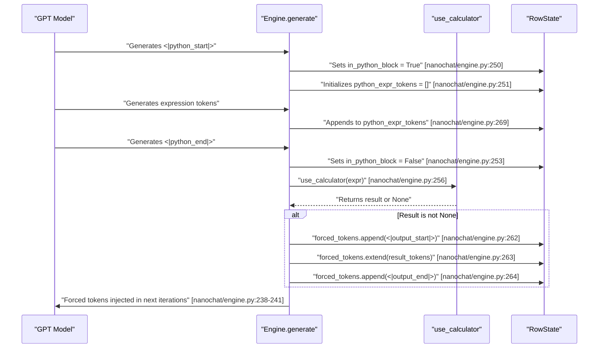
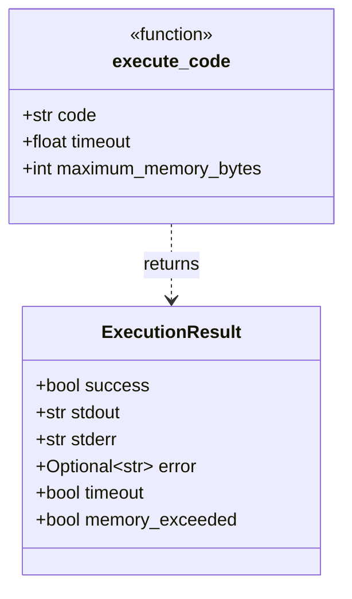

> [!WARNING]
> Imported from DeepWiki as generated, unverified repository documentation. Verify code-behavior claims against the revision below before stabilization.

# Calculator Tool Integration and Code Execution

<details>
<summary>Relevant source files</summary>

The following files were used as context for generating this wiki page:

- [nanochat/engine.py](https://github.com/karpathy/nanochat/blob/92d63d4e8bb4df75c3b71618f31ddde2378b2bcd/nanochat/engine.py)
- [nanochat/execution.py](https://github.com/karpathy/nanochat/blob/92d63d4e8bb4df75c3b71618f31ddde2378b2bcd/nanochat/execution.py)
- [tests/test_engine.py](https://github.com/karpathy/nanochat/blob/92d63d4e8bb4df75c3b71618f31ddde2378b2bcd/tests/test_engine.py)

</details>


## Purpose and Scope

This page documents the calculator tool integration in nanochat's inference engine and the broader code execution sandbox. The system enables the model to perform arithmetic and string operations during text generation by emitting specially formatted token sequences that trigger expression evaluation. 

This page covers the token protocol, safety mechanisms for simple expressions via `eval`, and the more robust `execution.py` sandbox used for evaluating complex code in benchmarks like HumanEval.

---

## Token Protocol and Tool Integration

The calculator tool uses a four-token protocol to mark Python expressions and their outputs within the generated text.

| Token | ID Retrieval | Purpose |
|-------|-------------|---------|
| `<|python_start|>` | `tokenizer.encode_special("<|python_start|>")` | Marks the beginning of a Python expression [nanochat/engine.py:250](https://github.com/karpathy/nanochat/blob/92d63d4e8bb4df75c3b71618f31ddde2378b2bcd/nanochat/engine.py#L250) |
| `<|python_end|>` | `tokenizer.encode_special("<|python_end|>")` | Marks the end of a Python expression, triggers evaluation [nanochat/engine.py:252](https://github.com/karpathy/nanochat/blob/92d63d4e8bb4df75c3b71618f31ddde2378b2bcd/nanochat/engine.py#L252) |
| `<|output_start|>` | `tokenizer.encode_special("<|output_start|>")` | Marks the beginning of the calculator's output [nanochat/engine.py:262](https://github.com/karpathy/nanochat/blob/92d63d4e8bb4df75c3b71618f31ddde2378b2bcd/nanochat/engine.py#L262) |
| `<|output_end|>` | `tokenizer.encode_special("<|output_end|>")` | Marks the end of the calculator's output [nanochat/engine.py:264](https://github.com/karpathy/nanochat/blob/92d63d4e8bb4df75c3b71618f31ddde2378b2bcd/nanochat/engine.py#L264) |

### Token Sequence Flow



**Sources:** [nanochat/engine.py:160-168](https://github.com/karpathy/nanochat/blob/92d63d4e8bb4df75c3b71618f31ddde2378b2bcd/nanochat/engine.py#L160-L168), [nanochat/engine.py:238-270](https://github.com/karpathy/nanochat/blob/92d63d4e8bb4df75c3b71618f31ddde2378b2bcd/nanochat/engine.py#L238-L270)

---

## Calculator Functions and Safety

### `use_calculator(expr)`

This function acts as a gateway for safe expression evaluation. It handles comma removal and implements a character whitelist for non-math expressions [nanochat/engine.py:46-80](https://github.com/karpathy/nanochat/blob/92d63d4e8bb4df75c3b71618f31ddde2378b2bcd/nanochat/engine.py#L46-L80).

```mermaid
flowchart TD
    A["use_calculator(expr)"] --> B["Remove commas from numbers"] [nanochat/engine.py:52]
    B --> C{"Is pure math expression?<br/>(only 0-9*+-/.() )"} [nanochat/engine.py:55]
    
    C -->|Yes| D{"Contains ** operator?"} [nanochat/engine.py:56]
    D -->|Yes| E["Return None<br/>(disallow power)"]
    D -->|No| F["eval_with_timeout(expr)"] [nanochat/engine.py:58]
    
    C -->|No| G["Check allowed_chars<br/>(letters, numbers, quotes, etc)"] [nanochat/engine.py:62]
    G --> H{"All chars allowed?"} [nanochat/engine.py:63]
    H -->|No| E
    H -->|Yes| I["Check dangerous_patterns<br/>(__,import,exec,eval,etc)"] [nanochat/engine.py:71]
    I --> J{"Any dangerous patterns?"}
    J -->|Yes| E
    J -->|No| K{"Contains .count()?"} [nanochat/engine.py:75]
    K -->|No| E
    K -->|Yes| F
    
    F --> L["Return result or None"]
```

**Safety Restrictions:**
- **Pure Math**: Only digits and standard operators. Power (`**`) is forbidden to prevent DoS via massive numbers [nanochat/engine.py:56-57](https://github.com/karpathy/nanochat/blob/92d63d4e8bb4df75c3b71618f31ddde2378b2bcd/nanochat/engine.py#L56-L57).
- **String Operations**: Only `.count()` is currently permitted [nanochat/engine.py:75](https://github.com/karpathy/nanochat/blob/92d63d4e8bb4df75c3b71618f31ddde2378b2bcd/nanochat/engine.py#L75).
- **Blacklist**: Patterns like `import`, `exec`, `eval`, `__`, and `getattr` are strictly forbidden [nanochat/engine.py:67-72](https://github.com/karpathy/nanochat/blob/92d63d4e8bb4df75c3b71618f31ddde2378b2bcd/nanochat/engine.py#L67-L72).

**Sources:** [nanochat/engine.py:46-80](https://github.com/karpathy/nanochat/blob/92d63d4e8bb4df75c3b71618f31ddde2378b2bcd/nanochat/engine.py#L46-L80)

### `eval_with_timeout(formula, max_time=3)`

Uses `signal.SIGALRM` via a `timeout` context manager to wrap the Python `eval()` call [nanochat/engine.py:25-33](https://github.com/karpathy/nanochat/blob/92d63d4e8bb4df75c3b71618f31ddde2378b2bcd/nanochat/engine.py#L25-L33). It executes with `{"__builtins__": {}}` to strip access to the standard library and built-in functions [nanochat/engine.py:35-45](https://github.com/karpathy/nanochat/blob/92d63d4e8bb4df75c3b71618f31ddde2378b2bcd/nanochat/engine.py#L35-L45).

---

## The Execution Sandbox (`execution.py`)

For complex coding tasks like HumanEval, nanochat uses a robust, process-isolated sandbox defined in `nanochat/execution.py`. This system is adapted from the OpenAI HumanEval repository [nanochat/execution.py:1-4](https://github.com/karpathy/nanochat/blob/92d63d4e8bb4df75c3b71618f31ddde2378b2bcd/nanochat/execution.py#L1-L4).

### Sandbox Features
- **Process Isolation**: Each execution runs in a fresh Python subprocess via `subprocess.run` [nanochat/execution.py:103](https://github.com/karpathy/nanochat/blob/92d63d4e8bb4df75c3b71618f31ddde2378b2bcd/nanochat/execution.py#L103).
- **Resource Limits**: Enforces memory limits (default 256MB) using `resource.setrlimit` in the subprocess [nanochat/execution.py:53-55](https://github.com/karpathy/nanochat/blob/92d63d4e8bb4df75c3b71618f31ddde2378b2bcd/nanochat/execution.py#L53-L55).
- **Environment Scrubbing**: Runs in a temporary directory with a restricted `PATH` and no `stdin` [nanochat/execution.py:101-110](https://github.com/karpathy/nanochat/blob/92d63d4e8bb4df75c3b71618f31ddde2378b2bcd/nanochat/execution.py#L101-L110).
- **Reliability Guard**: The `GUARD` string is prepended to the code to nullify dangerous `os` and `shutil` methods (e.g., `os.system`, `os.fork`, `shutil.rmtree`) and disable `builtins.exit` [nanochat/execution.py:47-71](https://github.com/karpathy/nanochat/blob/92d63d4e8bb4df75c3b71618f31ddde2378b2bcd/nanochat/execution.py#L47-L71).

### Execution Result Tracking

The result of the sandboxed execution is returned as an `ExecutionResult` dataclass, providing structured feedback on success, output, and failure reasons.



**Sources:** [nanochat/execution.py:32-41](https://github.com/karpathy/nanochat/blob/92d63d4e8bb4df75c3b71618f31ddde2378b2bcd/nanochat/execution.py#L32-L41), [nanochat/execution.py:74-78](https://github.com/karpathy/nanochat/blob/92d63d4e8bb4df75c3b71618f31ddde2378b2bcd/nanochat/execution.py#L74-L78)

---

## State Machine Integration

The calculator tool is integrated into the `Engine.generate` method via the `RowState` class, which tracks per-row generation state.

### RowState Structure

The `RowState` class maintains tool-related state for each sample being generated:

```mermaid
classDiagram
    class RowState {
        +list current_tokens
        +deque forced_tokens
        +bool in_python_block
        +list python_expr_tokens
        +bool completed
    }
    
    class Engine {
        +generate(tokens, num_samples, ...)
    }
    
    Engine --> RowState : "Creates num_samples instances" [nanochat/engine.py:224]
    
    note for RowState "forced_tokens: Queue of tokens\nto inject before sampling" [nanochat/engine.py:164]
    note for RowState "in_python_block: True between\npython_start and python_end" [nanochat/engine.py:165]
```

**Sources:** [nanochat/engine.py:160-168](https://github.com/karpathy/nanochat/blob/92d63d4e8bb4df75c3b71618f31ddde2378b2bcd/nanochat/engine.py#L160-L168), [nanochat/engine.py:224-225](https://github.com/karpathy/nanochat/blob/92d63d4e8bb4df75c3b71618f31ddde2378b2bcd/nanochat/engine.py#L224-L225)

### Forced Token Injection

During generation, the engine checks if `forced_tokens` are queued for a specific row. If so, it bypasses the standard model sampling for that step [nanochat/engine.py:238-241](https://github.com/karpathy/nanochat/blob/92d63d4e8bb4df75c3b71618f31ddde2378b2bcd/nanochat/engine.py#L238-L241). This is how the calculator's result is "injected" into the conversation.

```python
# Logic from nanochat/engine.py:238-241
is_forced = len(state.forced_tokens) > 0
if is_forced:
    token = state.forced_tokens.popleft()
else:
    # ... sample from logits ...
```

**Sources:** [nanochat/engine.py:238-241](https://github.com/karpathy/nanochat/blob/92d63d4e8bb4df75c3b71618f31ddde2378b2bcd/nanochat/engine.py#L238-L241)

---

## Testing

The tool use system is validated in `tests/test_engine.py` using mock models and tokenizers to ensure the state machine correctly transitions through `python_start`, accumulation, and injection phases.

**Sources:** [tests/test_engine.py:50-82](https://github.com/karpathy/nanochat/blob/92d63d4e8bb4df75c3b71618f31ddde2378b2bcd/tests/test_engine.py#L50-L82), [tests/test_engine.py:158-211](https://github.com/karpathy/nanochat/blob/92d63d4e8bb4df75c3b71618f31ddde2378b2bcd/tests/test_engine.py#L158-L211)
