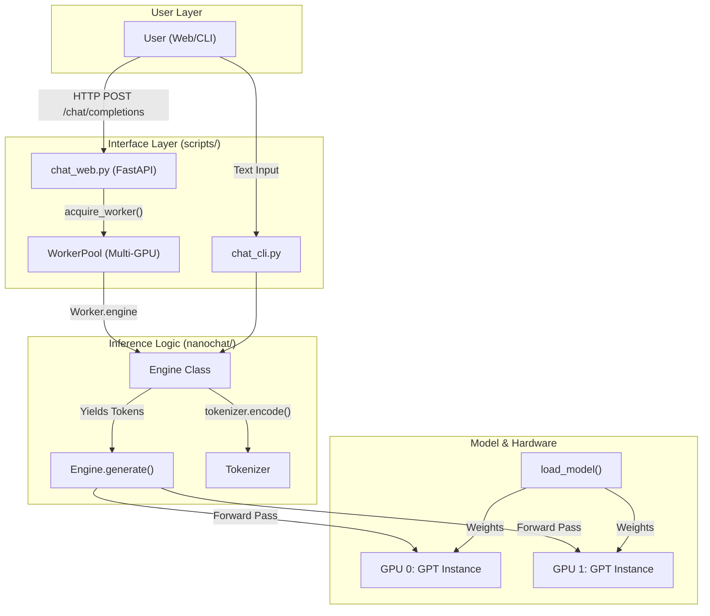
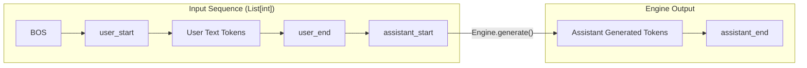

> [!WARNING]
> Imported from DeepWiki as generated, unverified repository documentation. Verify code-behavior claims against the revision below before stabilization.

# Chat Interfaces (CLI and Web)

Relevant source files

The following files were used as context for generating this wiki page:

- [scripts/chat_cli.py](https://github.com/karpathy/nanochat/blob/92d63d4e8bb4df75c3b71618f31ddde2378b2bcd/scripts/chat_cli.py)
- [scripts/chat_rl.py](https://github.com/karpathy/nanochat/blob/92d63d4e8bb4df75c3b71618f31ddde2378b2bcd/scripts/chat_rl.py)

This document describes the two user-facing interfaces for interacting with trained nanochat models: a command-line interface (CLI) for terminal-based chat and a high-performance web interface. Both interfaces provide a layer on top of the inference engine to enable conversational interactions with fine-tuned models, supporting features like streaming and role-based state management.

---

## Overview

Nanochat provides two primary scripts for model interaction. While both utilize the `Engine` class for generation, the web interface is designed for production-like scaling with multi-GPU support and a robust API.

| Interface | Script | Purpose | Key Features |
|-----------|--------|---------|--------------|
| **CLI** | `scripts/chat_cli.py` | Terminal-based interaction | Single-GPU, interactive/prompt modes, simple state machine. |
| **Web** | `scripts/chat_web.py` | Browser-based UI & API | FastAPI, Multi-GPU worker pool, Streaming API, Abuse prevention. |

**Sources:** [scripts/chat_cli.py:1-11](https://github.com/karpathy/nanochat/blob/92d63d4e8bb4df75c3b71618f31ddde2378b2bcd/scripts/chat_cli.py#L1-L11), [scripts/chat_web.py:1-31](https://github.com/karpathy/nanochat/blob/92d63d4e8bb4df75c3b71618f31ddde2378b2bcd/scripts/chat_web.py#L1-L31)

---

## Architecture and Data Flow

The following diagram illustrates how user inputs move from the interface layer through the `Engine` to the underlying model and back.

### System Entity Mapping: Interface to Engine

**Sources:** [scripts/chat_web.py:94-106](https://github.com/karpathy/nanochat/blob/92d63d4e8bb4df75c3b71618f31ddde2378b2bcd/scripts/chat_web.py#L94-L106), [scripts/chat_cli.py:34-35](https://github.com/karpathy/nanochat/blob/92d63d4e8bb4df75c3b71618f31ddde2378b2bcd/scripts/chat_cli.py#L34-L35), [scripts/chat_web.py:122-124](https://github.com/karpathy/nanochat/blob/92d63d4e8bb4df75c3b71618f31ddde2378b2bcd/scripts/chat_web.py#L122-L124), [nanochat/engine.py:169-173](https://github.com/karpathy/nanochat/blob/92d63d4e8bb4df75c3b71618f31ddde2378b2bcd/nanochat/engine.py#L169-L173)

---

## Web Interface (chat_web.py)

The web interface is a unified server that serves both a ChatGPT-style UI and an OpenAI-compatible streaming API. It is built using FastAPI [scripts/chat_web.py:41](https://github.com/karpathy/nanochat/blob/92d63d4e8bb4df75c3b71618f31ddde2378b2bcd/scripts/chat_web.py#L41) and supports data-parallel request distribution across multiple GPUs.

### Multi-GPU Worker Pool
To handle concurrent requests efficiently, `chat_web.py` implements a `WorkerPool` [scripts/chat_web.py:94-106](https://github.com/karpathy/nanochat/blob/92d63d4e8bb4df75c3b71618f31ddde2378b2bcd/scripts/chat_web.py#L94-L106). 
- **Initialization**: It detects available GPUs and creates a `Worker` for each [scripts/chat_web.py:107-133](https://github.com/karpathy/nanochat/blob/92d63d4e8bb4df75c3b71618f31ddde2378b2bcd/scripts/chat_web.py#L107-L133).
- **Concurrency**: Each worker contains its own `Engine` and model replica [scripts/chat_web.py:87-92](https://github.com/karpathy/nanochat/blob/92d63d4e8bb4df75c3b71618f31ddde2378b2bcd/scripts/chat_web.py#L87-L92).
- **Request Handling**: Incoming requests call `WorkerPool.acquire_worker()` [scripts/chat_web.py:135-137](https://github.com/karpathy/nanochat/blob/92d63d4e8bb4df75c3b71618f31ddde2378b2bcd/scripts/chat_web.py#L135-L137), which uses an `asyncio.Queue` to distribute tasks to available GPUs. This allows the server to scale linearly with the number of GPUs provided via `--num-gpus` [scripts/chat_web.py:63](https://github.com/karpathy/nanochat/blob/92d63d4e8bb4df75c3b71618f31ddde2378b2bcd/scripts/chat_web.py#L63).

### FastAPI Endpoints
| Endpoint | Method | Description |
|----------|--------|-------------|
| `/` | GET | Serves the `ui.html` frontend nanochat/ui.html:1-250. |
| `/chat/completions` | POST | Streaming API for chat [scripts/chat_web.py:20](https://github.com/karpathy/nanochat/blob/92d63d4e8bb4df75c3b71618f31ddde2378b2bcd/scripts/chat_web.py#L20). |
| `/health` | GET | Returns worker pool status and GPU health [scripts/chat_web.py:21](https://github.com/karpathy/nanochat/blob/92d63d4e8bb4df75c3b71618f31ddde2378b2bcd/scripts/chat_web.py#L21). |
| `/stats` | GET | Returns utilization statistics [scripts/chat_web.py:22](https://github.com/karpathy/nanochat/blob/92d63d4e8bb4df75c3b71618f31ddde2378b2bcd/scripts/chat_web.py#L22). |

### Abuse Prevention and Validation
The server enforces strict limits via `validate_chat_request` [scripts/chat_web.py:153-182](https://github.com/karpathy/nanochat/blob/92d63d4e8bb4df75c3b71618f31ddde2378b2bcd/scripts/chat_web.py#L153-L182):
- **Max Messages**: 500 per request [scripts/chat_web.py:52](https://github.com/karpathy/nanochat/blob/92d63d4e8bb4df75c3b71618f31ddde2378b2bcd/scripts/chat_web.py#L52).
- **Max Message Length**: 8,000 characters [scripts/chat_web.py:53](https://github.com/karpathy/nanochat/blob/92d63d4e8bb4df75c3b71618f31ddde2378b2bcd/scripts/chat_web.py#L53).
- **Max Conversation Length**: 32,000 characters [scripts/chat_web.py:54](https://github.com/karpathy/nanochat/blob/92d63d4e8bb4df75c3b71618f31ddde2378b2bcd/scripts/chat_web.py#L54).
- **Temperature Range**: 0.0 to 2.0 [scripts/chat_web.py:55-56](https://github.com/karpathy/nanochat/blob/92d63d4e8bb4df75c3b71618f31ddde2378b2bcd/scripts/chat_web.py#L55-L56).

**Sources:** [scripts/chat_web.py:41-60](https://github.com/karpathy/nanochat/blob/92d63d4e8bb4df75c3b71618f31ddde2378b2bcd/scripts/chat_web.py#L41-L60), [scripts/chat_web.py:107-142](https://github.com/karpathy/nanochat/blob/92d63d4e8bb4df75c3b71618f31ddde2378b2bcd/scripts/chat_web.py#L107-L142), [scripts/chat_web.py:153-182](https://github.com/karpathy/nanochat/blob/92d63d4e8bb4df75c3b71618f31ddde2378b2bcd/scripts/chat_web.py#L153-L182)

---

## Command-Line Interface (chat_cli.py)

The CLI is a lightweight script for rapid testing. It manages a simple state machine using special tokens to transition between User and Assistant roles.

### Conversation Loop
1. **Input**: Captures user text or a single prompt via `--prompt` [scripts/chat_cli.py:47-56](https://github.com/karpathy/nanochat/blob/92d63d4e8bb4df75c3b71618f31ddde2378b2bcd/scripts/chat_cli.py#L47-L56).
2. **Formatting**: Wraps text in `<|user_start|>` and `<|user_end|>` tokens [scripts/chat_cli.py:72-74](https://github.com/karpathy/nanochat/blob/92d63d4e8bb4df75c3b71618f31ddde2378b2bcd/scripts/chat_cli.py#L72-L74).
3. **Generation**: Appends `<|assistant_start|>` and calls `engine.generate()` [scripts/chat_cli.py:77-86](https://github.com/karpathy/nanochat/blob/92d63d4e8bb4df75c3b71618f31ddde2378b2bcd/scripts/chat_cli.py#L77-L86).
4. **Streaming**: Decodes and prints tokens to the console in real-time [scripts/chat_cli.py:89-90](https://github.com/karpathy/nanochat/blob/92d63d4e8bb4df75c3b71618f31ddde2378b2bcd/scripts/chat_cli.py#L89-L90).
5. **Finalization**: Ensures the `<|assistant_end|>` token is appended to the `conversation_tokens` list to maintain state for the next turn [scripts/chat_cli.py:94-96](https://github.com/karpathy/nanochat/blob/92d63d4e8bb4df75c3b71618f31ddde2378b2bcd/scripts/chat_cli.py#L94-L96).

### Special Commands
- `clear`: Resets the `conversation_tokens` list to just the `BOS` token [scripts/chat_cli.py:63-66](https://github.com/karpathy/nanochat/blob/92d63d4e8bb4df75c3b71618f31ddde2378b2bcd/scripts/chat_cli.py#L63-L66).
- `exit`/`quit`: Terminates the script [scripts/chat_cli.py:59-61](https://github.com/karpathy/nanochat/blob/92d63d4e8bb4df75c3b71618f31ddde2378b2bcd/scripts/chat_cli.py#L59-L61).

**Sources:** [scripts/chat_cli.py:43-96](https://github.com/karpathy/nanochat/blob/92d63d4e8bb4df75c3b71618f31ddde2378b2bcd/scripts/chat_cli.py#L43-L96)

---

## Token-Based State Management

Both interfaces rely on specific token sequences to maintain the "Chat" persona. The tokenizer provides specialized methods to retrieve these IDs.

### Token Sequence Flow

**Implementation Detail**: 
- In `chat_cli.py`, the `conversation_tokens` list grows with every turn, effectively providing the model with its full history [scripts/chat_cli.py:43-96](https://github.com/karpathy/nanochat/blob/92d63d4e8bb4df75c3b71618f31ddde2378b2bcd/scripts/chat_cli.py#L43-L96). 
- In `chat_web.py`, the history is passed via the `messages` list in the `ChatRequest` (defined as a Pydantic model) and processed similarly by the `Engine` [scripts/chat_web.py:143-152](https://github.com/karpathy/nanochat/blob/92d63d4e8bb4df75c3b71618f31ddde2378b2bcd/scripts/chat_web.py#L143-L152).

**Sources:** [scripts/chat_cli.py:30-32](https://github.com/karpathy/nanochat/blob/92d63d4e8bb4df75c3b71618f31ddde2378b2bcd/scripts/chat_cli.py#L30-L32), [scripts/chat_cli.py:72-78](https://github.com/karpathy/nanochat/blob/92d63d4e8bb4df75c3b71618f31ddde2378b2bcd/scripts/chat_cli.py#L72-L78), [scripts/chat_web.py:143-152](https://github.com/karpathy/nanochat/blob/92d63d4e8bb4df75c3b71618f31ddde2378b2bcd/scripts/chat_web.py#L143-L152)

---

## Integration with Engine

The `Engine` class in `nanochat/engine.py` is the core utility used by both scripts to manage KV caching and token generation.

### Generation Features
- **KV Caching**: The `KVCache` class manages (B, T, H, D) tensors for Flash Attention 3 compatibility [nanochat/engine.py:82-104](https://github.com/karpathy/nanochat/blob/92d63d4e8bb4df75c3b71618f31ddde2378b2bcd/nanochat/engine.py#L82-L104). It supports a `prefill` method to copy cached keys and values from a single-batch prefill to multiple parallel samples [nanochat/engine.py:123-138](https://github.com/karpathy/nanochat/blob/92d63d4e8bb4df75c3b71618f31ddde2378b2bcd/nanochat/engine.py#L123-L138).
- **Sampling**: The `sample_next_token` function handles temperature and top-k filtering [nanochat/engine.py:141-156](https://github.com/karpathy/nanochat/blob/92d63d4e8bb4df75c3b71618f31ddde2378b2bcd/nanochat/engine.py#L141-L156).
- **Tool Use**: The `Engine` includes logic to detect `<|python_start|>` and `<|python_end|>` tokens, automatically executing Python code using `eval_with_timeout` and injecting the result back into the token stream [nanochat/engine.py:46-80](https://github.com/karpathy/nanochat/blob/92d63d4e8bb4df75c3b71618f31ddde2378b2bcd/nanochat/engine.py#L46-L80), [nanochat/engine.py:214-230](https://github.com/karpathy/nanochat/blob/92d63d4e8bb4df75c3b71618f31ddde2378b2bcd/nanochat/engine.py#L214-L230).

### Script Usage
- **Loading**: Both scripts use `load_model` from `checkpoint_manager` to initialize the model and tokenizer [scripts/chat_cli.py:27](https://github.com/karpathy/nanochat/blob/92d63d4e8bb4df75c3b71618f31ddde2378b2bcd/scripts/chat_cli.py#L27), [scripts/chat_web.py:122](https://github.com/karpathy/nanochat/blob/92d63d4e8bb4df75c3b71618f31ddde2378b2bcd/scripts/chat_web.py#L122).
- **Streaming**: The `generate()` method is used as an iterator that yields tokens one by one, allowing for the "typing" effect in the UI and terminal [scripts/chat_cli.py:86-90](https://github.com/karpathy/nanochat/blob/92d63d4e8bb4df75c3b71618f31ddde2378b2bcd/scripts/chat_cli.py#L86-L90), [nanochat/engine.py:178-230](https://github.com/karpathy/nanochat/blob/92d63d4e8bb4df75c3b71618f31ddde2378b2bcd/nanochat/engine.py#L178-L230).
- **Device Management**: Scripts utilize `autodetect_device_type` and `compute_init` to handle hardware initialization across CUDA, CPU, or MPS [scripts/chat_cli.py:25-26](https://github.com/karpathy/nanochat/blob/92d63d4e8bb4df75c3b71618f31ddde2378b2bcd/scripts/chat_cli.py#L25-L26), [scripts/chat_web.py:83-84](https://github.com/karpathy/nanochat/blob/92d63d4e8bb4df75c3b71618f31ddde2378b2bcd/scripts/chat_web.py#L83-L84).

**Sources:** [nanochat/engine.py:82-230](https://github.com/karpathy/nanochat/blob/92d63d4e8bb4df75c3b71618f31ddde2378b2bcd/nanochat/engine.py#L82-L230), [scripts/chat_cli.py:25-35](https://github.com/karpathy/nanochat/blob/92d63d4e8bb4df75c3b71618f31ddde2378b2bcd/scripts/chat_cli.py#L25-L35), [scripts/chat_web.py:83-84](https://github.com/karpathy/nanochat/blob/92d63d4e8bb4df75c3b71618f31ddde2378b2bcd/scripts/chat_web.py#L83-L84), [scripts/chat_web.py:122-124](https://github.com/karpathy/nanochat/blob/92d63d4e8bb4df75c3b71618f31ddde2378b2bcd/scripts/chat_web.py#L122-L124)
