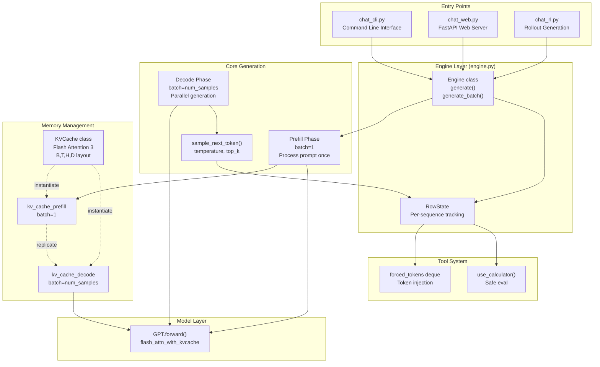
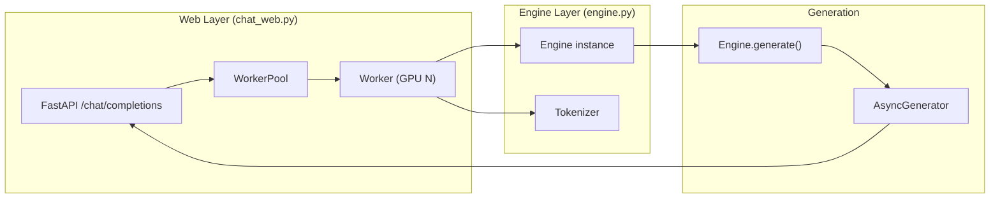

> [!WARNING]
> Imported from DeepWiki as generated, unverified repository documentation. Verify code-behavior claims against the revision below before stabilization.

# Inference and Deployment

Relevant source files

The following files were used as context for generating this wiki page:

- [nanochat/engine.py](https://github.com/karpathy/nanochat/blob/92d63d4e8bb4df75c3b71618f31ddde2378b2bcd/nanochat/engine.py)
- [tests/test_engine.py](https://github.com/karpathy/nanochat/blob/92d63d4e8bb4df75c3b71618f31ddde2378b2bcd/tests/test_engine.py)

This page documents the inference and deployment systems in nanochat. These components handle efficient text generation from trained models, including KV caching, sampling strategies, and tool integration. For information about training models, see [Base Model Pretraining](deepwiki-03-base-model-pretraining.md). For evaluation benchmarks and metrics, see [Evaluation and Benchmarking](deepwiki-09-evaluation-and-benchmarking.md).

The inference system is designed around the `Engine` class in `nanochat/engine.py`, which provides efficient generation with Flash Attention 3 compatible KV caching, batch generation support, and built-in calculator tool use.

## System Architecture Overview

The inference pipeline consists of several layers working together to transform token sequences into generated text:

**Diagram: Inference System Component Relationships**

Sources: [nanochat/engine.py:1-12](https://github.com/karpathy/nanochat/blob/92d63d4e8bb4df75c3b71618f31ddde2378b2bcd/nanochat/engine.py#L1-L12), [nanochat/engine.py:82-138](https://github.com/karpathy/nanochat/blob/92d63d4e8bb4df75c3b71618f31ddde2378b2bcd/nanochat/engine.py#L82-L138), [nanochat/engine.py:160-168](https://github.com/karpathy/nanochat/blob/92d63d4e8bb4df75c3b71618f31ddde2378b2bcd/nanochat/engine.py#L160-L168), [nanochat/engine.py:169-351](https://github.com/karpathy/nanochat/blob/92d63d4e8bb4df75c3b71618f31ddde2378b2bcd/nanochat/engine.py#L169-L351), [scripts/chat_rl.py:74-75](https://github.com/karpathy/nanochat/blob/92d63d4e8bb4df75c3b71618f31ddde2378b2bcd/scripts/chat_rl.py#L74-L75), [scripts/chat_cli.py:34-35](https://github.com/karpathy/nanochat/blob/92d63d4e8bb4df75c3b71618f31ddde2378b2bcd/scripts/chat_cli.py#L34-L35)

### Two-Phase Generation Strategy

The `Engine` implements a two-phase generation approach to maximize efficiency when generating multiple samples:

| Phase | Batch Size | Purpose | KV Cache |
|-------|------------|---------|----------|
| Prefill | 1 | Process prompt tokens once | `kv_cache_prefill` |
| Decode | `num_samples` | Generate tokens in parallel | `kv_cache_decode` |

This strategy avoids redundant computation by processing the prompt only once, then replicating the KV cache to enable parallel generation of multiple samples [nanochat/engine.py:193-217](https://github.com/karpathy/nanochat/blob/92d63d4e8bb4df75c3b71618f31ddde2378b2bcd/nanochat/engine.py#L193-L217). This is heavily utilized during RL rollouts to generate multiple candidate responses for a single prompt [scripts/chat_rl.py:106-113](https://github.com/karpathy/nanochat/blob/92d63d4e8bb4df75c3b71618f31ddde2378b2bcd/scripts/chat_rl.py#L106-L113).

Sources: [nanochat/engine.py:193-217](https://github.com/karpathy/nanochat/blob/92d63d4e8bb4df75c3b71618f31ddde2378b2bcd/nanochat/engine.py#L193-L217), [scripts/chat_rl.py:106-113](https://github.com/karpathy/nanochat/blob/92d63d4e8bb4df75c3b71618f31ddde2378b2bcd/scripts/chat_rl.py#L106-L113)

## Inference Engine and KV Cache 

### Engine Class

The `Engine` class ([nanochat/engine.py:169-351](https://github.com/karpathy/nanochat/blob/92d63d4e8bb4df75c3b71618f31ddde2378b2bcd/nanochat/engine.py#L169-L351)) is the main interface for text generation. It coordinates the model, tokenizer, KV cache, and sampling logic. It uses a `RowState` object per batch element to track sequence progression, Python block status, and tool usage status [nanochat/engine.py:160-168](https://github.com/karpathy/nanochat/blob/92d63d4e8bb4df75c3b71618f31ddde2378b2bcd/nanochat/engine.py#L160-L168).

### KVCache Architecture

The `KVCache` class ([nanochat/engine.py:82-138](https://github.com/karpathy/nanochat/blob/92d63d4e8bb4df75c3b71618f31ddde2378b2bcd/nanochat/engine.py#L82-L138)) provides Flash Attention 3 compatible caching. Unlike Flash Attention 2, FA3 requires a specific tensor layout and in-place updates.

**Key differences from FA2:**

| Aspect | FA2 Style | FA3 Style (nanochat) |
|--------|-----------|---------------------|
| Layout | `(B, H, T, D)` | `(B, T, H, D)` |
| Update | Manual slicing | In-place via `flash_attn_with_kvcache` |
| Position Tracking | Manual | `cache_seqlens` tensor (int32) |

The `prefill()` method [nanochat/engine.py:123-138](https://github.com/karpathy/nanochat/blob/92d63d4e8bb4df75c3b71618f31ddde2378b2bcd/nanochat/engine.py#L123-L138) is critical for batch generation; it copies the prompt's KV state from a `batch=1` cache into a larger multi-sample cache, ensuring each sample can then diverge independently [tests/test_engine.py:158-199](https://github.com/karpathy/nanochat/blob/92d63d4e8bb4df75c3b71618f31ddde2378b2bcd/tests/test_engine.py#L158-L199).

For details, see [Inference Engine and KV Cache](deepwiki-10-01-inference-engine-and-kv-cache.md).

Sources: [nanochat/engine.py:82-138](https://github.com/karpathy/nanochat/blob/92d63d4e8bb4df75c3b71618f31ddde2378b2bcd/nanochat/engine.py#L82-L138), [tests/test_engine.py:84-156](https://github.com/karpathy/nanochat/blob/92d63d4e8bb4df75c3b71618f31ddde2378b2bcd/tests/test_engine.py#L84-L156), [tests/test_engine.py:158-199](https://github.com/karpathy/nanochat/blob/92d63d4e8bb4df75c3b71618f31ddde2378b2bcd/tests/test_engine.py#L158-L199)

## Text Generation and Sampling 

### generate() and generate_batch()

The `Engine` provides two primary generation interfaces:
- `generate()`: A streaming generator yielding tokens and masks as they are produced [nanochat/engine.py:176-298](https://github.com/karpathy/nanochat/blob/92d63d4e8bb4df75c3b71618f31ddde2378b2bcd/nanochat/engine.py#L176-L298).
- `generate_batch()`: A wrapper that accumulates full sequences and handles terminal token stripping [nanochat/engine.py:300-351](https://github.com/karpathy/nanochat/blob/92d63d4e8bb4df75c3b71618f31ddde2378b2bcd/nanochat/engine.py#L300-L351). This is used by RL training scripts to gather rollouts [scripts/chat_rl.py:106-113](https://github.com/karpathy/nanochat/blob/92d63d4e8bb4df75c3b71618f31ddde2378b2bcd/scripts/chat_rl.py#L106-L113).

### Sampling Strategies

The `sample_next_token()` function [nanochat/engine.py:141-157](https://github.com/karpathy/nanochat/blob/92d63d4e8bb4df75c3b71618f31ddde2378b2bcd/nanochat/engine.py#L141-L157) supports:
- **Greedy Decoding**: Used when `temperature=0.0` [nanochat/engine.py:144-145](https://github.com/karpathy/nanochat/blob/92d63d4e8bb4df75c3b71618f31ddde2378b2bcd/nanochat/engine.py#L144-L145).
- **Temperature Scaling**: Adjusts probability distribution sharpness [nanochat/engine.py:149-154](https://github.com/karpathy/nanochat/blob/92d63d4e8bb4df75c3b71618f31ddde2378b2bcd/nanochat/engine.py#L149-L154).
- **Top-K Filtering**: Limits sampling to the most likely `k` tokens [nanochat/engine.py:146-152](https://github.com/karpathy/nanochat/blob/92d63d4e8bb4df75c3b71618f31ddde2378b2bcd/nanochat/engine.py#L146-L152).

Reproducibility is maintained via a `torch.Generator` initialized with a user-provided `seed` [nanochat/engine.py:183-184](https://github.com/karpathy/nanochat/blob/92d63d4e8bb4df75c3b71618f31ddde2378b2bcd/nanochat/engine.py#L183-L184). For details, see [Text Generation and Sampling](deepwiki-10-02-text-generation-and-sampling.md).

Sources: [nanochat/engine.py:141-157](https://github.com/karpathy/nanochat/blob/92d63d4e8bb4df75c3b71618f31ddde2378b2bcd/nanochat/engine.py#L141-L157), [nanochat/engine.py:176-351](https://github.com/karpathy/nanochat/blob/92d63d4e8bb4df75c3b71618f31ddde2378b2bcd/nanochat/engine.py#L176-L351), [tests/test_engine.py:201-224](https://github.com/karpathy/nanochat/blob/92d63d4e8bb4df75c3b71618f31ddde2378b2bcd/tests/test_engine.py#L201-L224), [scripts/chat_rl.py:106-113](https://github.com/karpathy/nanochat/blob/92d63d4e8bb4df75c3b71618f31ddde2378b2bcd/scripts/chat_rl.py#L106-L113)

## Calculator Tool Integration 

The model can perform calculations by emitting `<|python_start|>` and `<|python_end|>` tokens [nanochat/engine.py:252-278](https://github.com/karpathy/nanochat/blob/92d63d4e8bb4df75c3b71618f31ddde2378b2bcd/nanochat/engine.py#L252-L278).

**Safety and Execution:**
- **`use_calculator()`**: Safely evaluates math or string `.count()` expressions using a restricted environment [nanochat/engine.py:46-80](https://github.com/karpathy/nanochat/blob/92d63d4e8bb4df75c3b71618f31ddde2378b2bcd/nanochat/engine.py#L46-L80). It explicitly disallows dangerous patterns like `import` or `exec` [nanochat/engine.py:67-72](https://github.com/karpathy/nanochat/blob/92d63d4e8bb4df75c3b71618f31ddde2378b2bcd/nanochat/engine.py#L67-L72).
- **`timeout()`**: Enforces a time limit on execution via `signal.alarm` to prevent hangs [nanochat/engine.py:25-44](https://github.com/karpathy/nanochat/blob/92d63d4e8bb4df75c3b71618f31ddde2378b2bcd/nanochat/engine.py#L25-L44).
- **Forced Injection**: Once an expression is evaluated, the result is queued in `RowState.forced_tokens` and injected into the sequence, bypassing sampling [nanochat/engine.py:241-246](https://github.com/karpathy/nanochat/blob/92d63d4e8bb4df75c3b71618f31ddde2378b2bcd/nanochat/engine.py#L241-L246).

For details, see [Calculator Tool Integration and Code Execution](deepwiki-10-03-calculator-tool-integration-and-code-execution.md).

Sources: [nanochat/engine.py:25-80](https://github.com/karpathy/nanochat/blob/92d63d4e8bb4df75c3b71618f31ddde2378b2bcd/nanochat/engine.py#L25-L80), [nanochat/engine.py:160-168](https://github.com/karpathy/nanochat/blob/92d63d4e8bb4df75c3b71618f31ddde2378b2bcd/nanochat/engine.py#L160-L168), [nanochat/engine.py:241-278](https://github.com/karpathy/nanochat/blob/92d63d4e8bb4df75c3b71618f31ddde2378b2bcd/nanochat/engine.py#L241-L278)

## Chat Interfaces (CLI and Web) 

Nanochat provides high-level scripts for interacting with models:

### CLI Interface (chat_cli.py)
The `chat_cli.py` script provides an interactive terminal interface. It manages a `conversation_tokens` list that tracks the chat history, appending user and assistant special tokens to maintain the chat format [scripts/chat_cli.py:43-96](https://github.com/karpathy/nanochat/blob/92d63d4e8bb4df75c3b71618f31ddde2378b2bcd/scripts/chat_cli.py#L43-L96).

### Web-to-Engine Bridge

**Diagram: Web Server to Inference Engine Mapping**

For details, see [Chat Interfaces (CLI and Web)](deepwiki-10-04-chat-interfaces-cli-and-web.md).

Sources: [scripts/chat_cli.py:34-96](https://github.com/karpathy/nanochat/blob/92d63d4e8bb4df75c3b71618f31ddde2378b2bcd/scripts/chat_cli.py#L34-L96), [nanochat/engine.py:176-180](https://github.com/karpathy/nanochat/blob/92d63d4e8bb4df75c3b71618f31ddde2378b2bcd/nanochat/engine.py#L176-L180)
