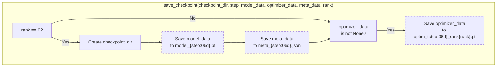
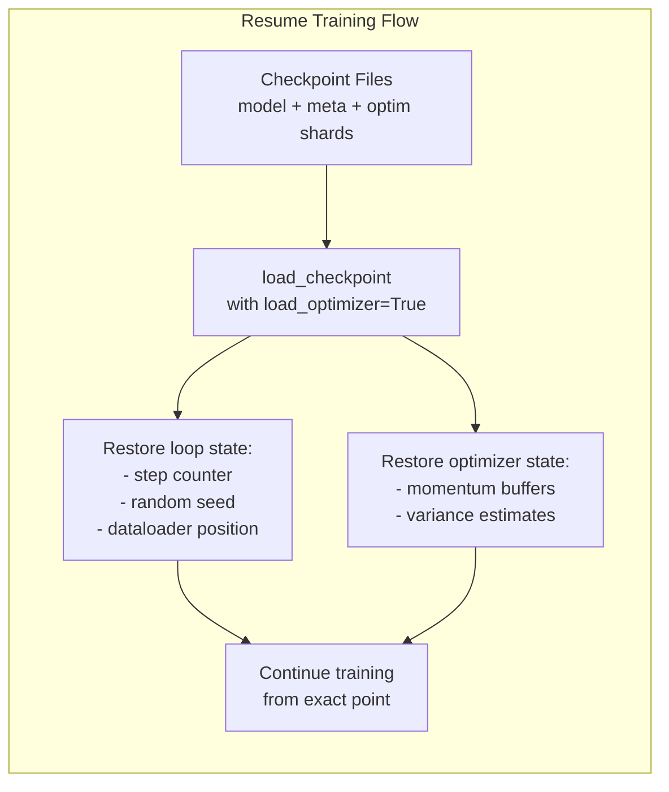
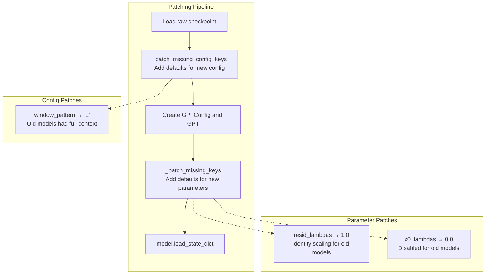

> [!WARNING]
> Imported from DeepWiki as generated, unverified repository documentation. Verify code-behavior claims against the revision below before stabilization.

# Checkpoint Management

<details>
<summary>Relevant source files</summary>

The following files were used as context for generating this wiki page:

- [nanochat/checkpoint_manager.py](https://github.com/karpathy/nanochat/blob/92d63d4e8bb4df75c3b71618f31ddde2378b2bcd/nanochat/checkpoint_manager.py)

</details>


## Purpose and Scope

The checkpoint management system provides comprehensive state persistence for distributed training in `nanochat`. It handles saving and loading of model parameters, optimizer state, and training metadata, with special consideration for Distributed Data Parallel (DDP) training where optimizer state is sharded across ranks.

This document covers the checkpoint saving/loading mechanisms and backward compatibility features. For the broader training loop context that uses these checkpoints, see [Base Training Script Architecture](deepwiki-03-01-base-training-script-architecture.md) and [SFT Training Script](deepwiki-07-01-sft-training-script.md). For the distributed training concepts, see [Distributed Training with DDP](deepwiki-08-02-distributed-training-with-ddp.md).

**Sources:** [nanochat/checkpoint_manager.py:1-21](https://github.com/karpathy/nanochat/blob/92d63d4e8bb4df75c3b71618f31ddde2378b2bcd/nanochat/checkpoint_manager.py#L1-L21)

## Checkpoint File Structure

Checkpoints are organized in a hierarchical directory structure with separate files for model weights, optimizer state, and metadata:

```
base_checkpoints/
├── d24/                          # Model tag (depth=24)
│   ├── model_000000.pt           # Model state dict
│   ├── meta_000000.json          # Training metadata
│   ├── optim_000000_rank0.pt     # Optimizer shard for rank 0
│   ├── optim_000000_rank1.pt     # Optimizer shard for rank 1
│   └── ...
└── d26/                          # Another model size
    └── ...

chatsft_checkpoints/
└── d24/
    └── ...

chatrl_checkpoints/
└── d24/
    └── ...
```

### File Naming Convention

| File Pattern | Content | Saved By |
|--------------|---------|----------|
| `model_{step:06d}.pt` | Model state dict (weights, buffers) | Rank 0 only [nanochat/checkpoint_manager.py:42-47](https://github.com/karpathy/nanochat/blob/92d63d4e8bb4df75c3b71618f31ddde2378b2bcd/nanochat/checkpoint_manager.py#L42-L47) |
| `meta_{step:06d}.json` | JSON metadata (config, hyperparameters, loop state) | Rank 0 only [nanochat/checkpoint_manager.py:49-52](https://github.com/karpathy/nanochat/blob/92d63d4e8bb4df75c3b71618f31ddde2378b2bcd/nanochat/checkpoint_manager.py#L49-L52) |
| `optim_{step:06d}_rank{rank}.pt` | Optimizer state shard for specific rank | Each rank saves its own shard [nanochat/checkpoint_manager.py:54-58](https://github.com/karpathy/nanochat/blob/92d63d4e8bb4df75c3b71618f31ddde2378b2bcd/nanochat/checkpoint_manager.py#L54-L58) |

The step number is zero-padded to 6 digits to ensure proper lexicographic sorting.

**Sources:** [nanochat/checkpoint_manager.py:41-59](https://github.com/karpathy/nanochat/blob/92d63d4e8bb4df75c3b71618f31ddde2378b2bcd/nanochat/checkpoint_manager.py#L41-L59)

## Core Checkpoint Functions

### save_checkpoint Function



**Rank-Aware Saving Strategy**

The checkpoint system uses different strategies for different state components to optimize storage and I/O:

| Component | Saved By | Rationale |
|-----------|----------|-----------|
| Model weights | Rank 0 only | Identical across all ranks in DDP, no need for redundancy [nanochat/checkpoint_manager.py:42-47](https://github.com/karpathy/nanochat/blob/92d63d4e8bb4df75c3b71618f31ddde2378b2bcd/nanochat/checkpoint_manager.py#L42-L47) |
| Metadata | Rank 0 only | Training configuration and loop state are the same for all ranks [nanochat/checkpoint_manager.py:49-52](https://github.com/karpathy/nanochat/blob/92d63d4e8bb4df75c3b71618f31ddde2378b2bcd/nanochat/checkpoint_manager.py#L49-L52) |
| Optimizer state | All ranks | Sharded across ranks in distributed optimizer, each rank must save its own shard [nanochat/checkpoint_manager.py:54-58](https://github.com/karpathy/nanochat/blob/92d63d4e8bb4df75c3b71618f31ddde2378b2bcd/nanochat/checkpoint_manager.py#L54-L58) |

This design prevents redundant writes while ensuring all distributed state is preserved.

**Sources:** [nanochat/checkpoint_manager.py:41-59](https://github.com/karpathy/nanochat/blob/92d63d4e8bb4df75c3b71618f31ddde2378b2bcd/nanochat/checkpoint_manager.py#L41-L59)

### load_checkpoint Function

The `load_checkpoint` function mirrors the saving logic, loading model and metadata from rank 0's files, and optionally loading the optimizer shard for a specific rank:

```python
# Signature
load_checkpoint(checkpoint_dir, step, device, load_optimizer=False, rank=0)
```

**Key Parameters:**
- `device`: Target device for loading (supports device mapping during load via `map_location`) [nanochat/checkpoint_manager.py:63](https://github.com/karpathy/nanochat/blob/92d63d4e8bb4df75c3b71618f31ddde2378b2bcd/nanochat/checkpoint_manager.py#L63)
- `load_optimizer`: Whether to load optimizer state (used for resume/warm-start, not for inference) [nanochat/checkpoint_manager.py:66-68](https://github.com/karpathy/nanochat/blob/92d63d4e8bb4df75c3b71618f31ddde2378b2bcd/nanochat/checkpoint_manager.py#L66-L68)
- `rank`: Which optimizer shard to load (must match the current process's DDP rank) [nanochat/checkpoint_manager.py:67](https://github.com/karpathy/nanochat/blob/92d63d4e8bb4df75c3b71618f31ddde2378b2bcd/nanochat/checkpoint_manager.py#L67)

The function uses PyTorch's `map_location` parameter to handle device mapping, enabling loading GPU checkpoints on CPU or transferring between devices.

**Sources:** [nanochat/checkpoint_manager.py:60-73](https://github.com/karpathy/nanochat/blob/92d63d4e8bb4df75c3b71618f31ddde2378b2bcd/nanochat/checkpoint_manager.py#L60-L73)

## The Three Use Cases

The checkpoint system supports three distinct usage patterns, each with different requirements:

### Use Case 1: Exact Resume

Restoring all training state to continue from an interruption:



**Metadata for Resumption:**
The `meta_data` dict contains loop state needed for exact resume:
- `step`: Current training step [nanochat/checkpoint_manager.py:41](https://github.com/karpathy/nanochat/blob/92d63d4e8bb4df75c3b71618f31ddde2378b2bcd/nanochat/checkpoint_manager.py#L41)
- `val_bpb`: Last validation BPB score
- `loop_state`: Random number generator states
- `dataloader_state`: Parquet index, row group index, epoch (see [Distributed Data Loading and State Management](deepwiki-06-03-distributed-data-loading-and-state-management.md))

**Sources:** [nanochat/checkpoint_manager.py:60-73](https://github.com/karpathy/nanochat/blob/92d63d4e8bb4df75c3b71618f31ddde2378b2bcd/nanochat/checkpoint_manager.py#L60-L73)

### Use Case 2: Warm-start Optimizer

Loading optimizer momentum from a base checkpoint to initialize SFT training:

```python
# Example logic in chat_sft.py or via load_optimizer_state helper
if args.optimizer_state_from == "base":
    # Load base model's optimizer state to warm-start SFT
    optimizer_data = load_optimizer_state("base", device, rank, 
                                         model_tag=args.model_tag, 
                                         step=args.base_step)
```

This allows SFT to benefit from the momentum accumulated during base pretraining, potentially accelerating fine-tuning convergence.

**Sources:** [nanochat/checkpoint_manager.py:174-194](https://github.com/karpathy/nanochat/blob/92d63d4e8bb4df75c3b71618f31ddde2378b2bcd/nanochat/checkpoint_manager.py#L174-L194)

### Use Case 3: Inference/Evaluation

Loading only model weights without optimizer state for generation or evaluation:

```python
# build_model always sets load_optimizer=False
model_data, _, meta_data = load_checkpoint(checkpoint_dir, step, device, 
                                           load_optimizer=False)
```

Inference and evaluation scripts use the `build_model` helper which handles additional concerns like dtype conversion for CPU devices [nanochat/checkpoint_manager.py:86-91](https://github.com/karpathy/nanochat/blob/92d63d4e8bb4df75c3b71618f31ddde2378b2bcd/nanochat/checkpoint_manager.py#L86-L91).

**Sources:** [nanochat/checkpoint_manager.py:76-114](https://github.com/karpathy/nanochat/blob/92d63d4e8bb4df75c3b71618f31ddde2378b2bcd/nanochat/checkpoint_manager.py#L76-L114)

## Backward Compatibility Patching

As `nanochat` evolves, new model parameters and configuration keys are added. The checkpoint system maintains backward compatibility with older checkpoints through automatic patching:



### _patch_missing_config_keys

This function patches the model configuration before creating the `GPTConfig` object:

| Missing Key | Default Value | Rationale |
|-------------|---------------|-----------|
| `window_pattern` | `"L"` | Old models were trained with full context (no sliding windows) [nanochat/checkpoint_manager.py:25-27](https://github.com/karpathy/nanochat/blob/92d63d4e8bb4df75c3b71618f31ddde2378b2bcd/nanochat/checkpoint_manager.py#L25-L27) |

**Sources:** [nanochat/checkpoint_manager.py:22-28](https://github.com/karpathy/nanochat/blob/92d63d4e8bb4df75c3b71618f31ddde2378b2bcd/nanochat/checkpoint_manager.py#L22-L28)

### _patch_missing_keys

This function patches the model state dict after creating the model but before loading weights:

| Missing Parameter | Default Value | Rationale |
|-------------------|---------------|-----------|
| `resid_lambdas` | `torch.ones(n_layer)` | Identity scaling (1.0) preserves original behavior [nanochat/checkpoint_manager.py:33-35](https://github.com/karpathy/nanochat/blob/92d63d4e8bb4df75c3b71618f31ddde2378b2bcd/nanochat/checkpoint_manager.py#L33-L35) |
| `x0_lambdas` | `torch.zeros(n_layer)` | Feature was disabled (0.0) in old models [nanochat/checkpoint_manager.py:37-39](https://github.com/karpathy/nanochat/blob/92d63d4e8bb4df75c3b71618f31ddde2378b2bcd/nanochat/checkpoint_manager.py#L37-L39) |

The patching is performed on-the-fly during load and logged for transparency.

**Sources:** [nanochat/checkpoint_manager.py:29-40](https://github.com/karpathy/nanochat/blob/92d63d4e8bb4df75c3b71618f31ddde2378b2bcd/nanochat/checkpoint_manager.py#L29-L40)

## Helper Functions for Checkpoint Discovery

The checkpoint manager provides utilities to automatically discover checkpoints when specific step numbers or model tags are not provided:

```mermaid
graph TB
    subgraph "Checkpoint Discovery Helpers"
        FindModel["find_largest_model(checkpoints_dir)"]
        FindStep["find_last_step(checkpoint_dir)"]
        LoadDir["load_model_from_dir(checkpoints_dir, ...)"]
        LoadSource["load_model(source, ...)"]
    end
    
    subgraph "find_largest_model Logic"
        ListDirs["List subdirectories"]
        RegexMatch{"Match d&lt;number&gt;?"}
        ParseDepth["Parse depth number"]
        SortDepth["Sort by depth DESC"]
        FallbackMtime["Fallback: sort by mtime"]
        
        ListDirs --> RegexMatch
        RegexMatch -->|Yes| ParseDepth
        ParseDepth --> SortDepth
        RegexMatch -->|No| FallbackMtime
    end
    
    subgraph "find_last_step Logic"
        GlobModels["Glob model_*.pt files"]
        ParseSteps["Parse step numbers"]
        MaxStep["Return max(steps)"]
        
        GlobModels --> ParseSteps
        ParseSteps --> MaxStep
    end
    
    LoadDir --> FindModel
    LoadDir --> FindStep
    LoadSource --> LoadDir
```



### find_largest_model

Guesses the best model tag to use when not specified:

1. **Primary strategy**: Parse directories matching `d(\d+)` pattern (e.g., `d24`, `d26`) and select the one with the largest depth number [nanochat/checkpoint_manager.py:124-131](https://github.com/karpathy/nanochat/blob/92d63d4e8bb4df75c3b71618f31ddde2378b2bcd/nanochat/checkpoint_manager.py#L124-L131).
2. **Fallback strategy**: If no `d<number>` directories exist, select the most recently modified directory [nanochat/checkpoint_manager.py:133-134](https://github.com/karpathy/nanochat/blob/92d63d4e8bb4df75c3b71618f31ddde2378b2bcd/nanochat/checkpoint_manager.py#L133-L134).

This heuristic assumes larger models are generally more interesting for evaluation.

**Sources:** [nanochat/checkpoint_manager.py:117-135](https://github.com/karpathy/nanochat/blob/92d63d4e8bb4df75c3b71618f31ddde2378b2bcd/nanochat/checkpoint_manager.py#L117-L135)

### find_last_step

Finds the latest checkpoint step in a directory by:
1. Globbing all `model_*.pt` files [nanochat/checkpoint_manager.py:139](https://github.com/karpathy/nanochat/blob/92d63d4e8bb4df75c3b71618f31ddde2378b2bcd/nanochat/checkpoint_manager.py#L139).
2. Parsing the step number from each filename [nanochat/checkpoint_manager.py:142](https://github.com/karpathy/nanochat/blob/92d63d4e8bb4df75c3b71618f31ddde2378b2bcd/nanochat/checkpoint_manager.py#L142).
3. Returning the maximum step number [nanochat/checkpoint_manager.py:142](https://github.com/karpathy/nanochat/blob/92d63d4e8bb4df75c3b71618f31ddde2378b2bcd/nanochat/checkpoint_manager.py#L142).

**Sources:** [nanochat/checkpoint_manager.py:137-143](https://github.com/karpathy/nanochat/blob/92d63d4e8bb4df75c3b71618f31ddde2378b2bcd/nanochat/checkpoint_manager.py#L137-L143)

### load_model and load_model_from_dir

These convenience functions combine checkpoint discovery with model loading:

```python
# Load from specific source directory
model, tokenizer, meta_data = load_model("base", device, "eval")
# Internally maps to: base_checkpoints/
```

The `load_model_from_dir` function automatically:
- Finds the largest model tag if not specified [nanochat/checkpoint_manager.py:151](https://github.com/karpathy/nanochat/blob/92d63d4e8bb4df75c3b71618f31ddde2378b2bcd/nanochat/checkpoint_manager.py#L151).
- Finds the last step if not specified [nanochat/checkpoint_manager.py:156](https://github.com/karpathy/nanochat/blob/92d63d4e8bb4df75c3b71618f31ddde2378b2bcd/nanochat/checkpoint_manager.py#L156).
- Calls `build_model` to construct the `GPT` instance [nanochat/checkpoint_manager.py:161](https://github.com/karpathy/nanochat/blob/92d63d4e8bb4df75c3b71618f31ddde2378b2bcd/nanochat/checkpoint_manager.py#L161).
- Returns model, tokenizer, and metadata.

**Sources:** [nanochat/checkpoint_manager.py:148-172](https://github.com/karpathy/nanochat/blob/92d63d4e8bb4df75c3b71618f31ddde2378b2bcd/nanochat/checkpoint_manager.py#L148-L172)

## build_model: Complete Model Construction

The `build_model` function handles the full pipeline from checkpoint files to a ready-to-use model:

```mermaid
graph TB
    subgraph "build_model Pipeline"
        LoadCkpt["load_checkpoint<br/>get model_data, meta_data"]
        
        CPUCheck{"device is cpu/mps?"}
        ConvertFP32["Convert bfloat16 → float32"]
        
        StripPrefix["Remove '_orig_mod.' prefix<br/>(torch.compile artifact)"]
        
        PatchConfig["_patch_missing_config_keys"]
        CreateConfig["GPTConfig(**model_config_kwargs)"]
        
        PatchParams["_patch_missing_keys"]
        
        MetaDevice["Create model on meta device"]
        ToEmpty["model.to_empty(device)"]
        InitWeights["model.init_weights()<br/>(for rotary embeddings)"]
        LoadState["model.load_state_dict"]
        
        PhaseCheck{"phase == 'eval'?"}
        SetEval["model.eval()"]
        SetTrain["model.train()"]
        
        LoadTok["Load tokenizer"]
        ValidateVocab["Validate vocab size match"]
        
        LoadCkpt --> CPUCheck
        CPUCheck -->|Yes| ConvertFP32
        CPUCheck -->|No| StripPrefix
        ConvertFP32 --> StripPrefix
        
        StripPrefix --> PatchConfig
        PatchConfig --> CreateConfig
        CreateConfig --> PatchParams
        
        PatchParams --> MetaDevice
        MetaDevice --> ToEmpty
        ToEmpty --> InitWeights
        InitWeights --> LoadState
        
        LoadState --> PhaseCheck
        PhaseCheck -->|Yes| SetEval
        PhaseCheck -->|No| SetTrain
        
        SetEval --> LoadTok
        SetTrain --> LoadTok
        LoadTok --> ValidateVocab
    end
```



### Special Handling Details

**BFloat16 → Float32 Conversion:**
CPU and MPS devices don't fully support bfloat16, so the function automatically converts checkpoint tensors to float32 when loading on these devices [nanochat/checkpoint_manager.py:86-91](https://github.com/karpathy/nanochat/blob/92d63d4e8bb4df75c3b71618f31ddde2378b2bcd/nanochat/checkpoint_manager.py#L86-L91).

**torch.compile Prefix Removal:**
Compiled models prepend `_orig_mod.` to all parameter keys. This prefix is stripped to ensure compatibility with standard `GPT` state dicts [nanochat/checkpoint_manager.py:93](https://github.com/karpathy/nanochat/blob/92d63d4e8bb4df75c3b71618f31ddde2378b2bcd/nanochat/checkpoint_manager.py#L93).

**Meta Device Pattern:**
The model is first created on the meta device (no memory allocation) [nanochat/checkpoint_manager.py:99-100](https://github.com/karpathy/nanochat/blob/92d63d4e8bb4df75c3b71618f31ddde2378b2bcd/nanochat/checkpoint_manager.py#L99-L100), then moved to the target device with `to_empty` [nanochat/checkpoint_manager.py:102](https://github.com/karpathy/nanochat/blob/92d63d4e8bb4df75c3b71618f31ddde2378b2bcd/nanochat/checkpoint_manager.py#L102), and finally weights are loaded with `load_state_dict` using `assign=True` [nanochat/checkpoint_manager.py:104](https://github.com/karpathy/nanochat/blob/92d63d4e8bb4df75c3b71618f31ddde2378b2bcd/nanochat/checkpoint_manager.py#L104). This avoids unnecessary memory allocation for default weights.

**Note:** The `init_weights()` call after `to_empty()` is acknowledged as "dumb" in the code comments—it's only needed to initialize rotary embeddings, which aren't saved in the checkpoint [nanochat/checkpoint_manager.py:103](https://github.com/karpathy/nanochat/blob/92d63d4e8bb4df75c3b71618f31ddde2378b2bcd/nanochat/checkpoint_manager.py#L103).

**Sources:** [nanochat/checkpoint_manager.py:76-114](https://github.com/karpathy/nanochat/blob/92d63d4e8bb4df75c3b71618f31ddde2378b2bcd/nanochat/checkpoint_manager.py#L76-L114)

## Integration with Training Scripts

The checkpoint system is tightly integrated into the training pipeline through periodic saves and resume logic:

### Base Training Checkpointing

During base training, checkpoints are saved at regular intervals. The metadata includes:

- `model_config`: `GPTConfig` parameters [nanochat/checkpoint_manager.py:94](https://github.com/karpathy/nanochat/blob/92d63d4e8bb4df75c3b71618f31ddde2378b2bcd/nanochat/checkpoint_manager.py#L94)
- `user_config`: All training arguments
- `step`: Current optimization step [nanochat/checkpoint_manager.py:41](https://github.com/karpathy/nanochat/blob/92d63d4e8bb4df75c3b71618f31ddde2378b2bcd/nanochat/checkpoint_manager.py#L41)
- `val_bpb`: Latest validation bits-per-byte score
- `loop_state`: Random seed and RNG state
- `dataloader_state`: Position in the dataset for exact resumption

**Sources:** [nanochat/checkpoint_manager.py:41-59](https://github.com/karpathy/nanochat/blob/92d63d4e8bb4df75c3b71618f31ddde2378b2bcd/nanochat/checkpoint_manager.py#L41-L59)

### SFT Warm-start

SFT training can optionally warm-start the optimizer from base training using `load_optimizer_state` [nanochat/checkpoint_manager.py:174-194](https://github.com/karpathy/nanochat/blob/92d63d4e8bb4df75c3b71618f31ddde2378b2bcd/nanochat/checkpoint_manager.py#L174-L194). This allows the SFT phase to benefit from the momentum and variance estimates accumulated during base pretraining.

**Sources:** [nanochat/checkpoint_manager.py:174-194](https://github.com/karpathy/nanochat/blob/92d63d4e8bb4df75c3b71618f31ddde2378b2bcd/nanochat/checkpoint_manager.py#L174-L194)

## Checkpoint Metadata Structure

The metadata JSON file contains comprehensive information about the checkpoint:

```json
{
  "model_config": {
    "depth": 24,
    "n_head": 12,
    "n_embd": 768,
    "vocab_size": 32768,
    "window_pattern": "LLLLSSSS"
  },
  "user_config": {
    "batch_size": 524288,
    "lr": 0.0001
  },
  "step": 12000,
  "val_bpb": 0.956,
  "dataloader_state": {
    "pq_idx": 1234,
    "rg_idx": 5,
    "epoch": 0
  }
}
```

This structure enables full reproducibility and provides a complete record of the training configuration.

**Sources:** [nanochat/checkpoint_manager.py:41-52](https://github.com/karpathy/nanochat/blob/92d63d4e8bb4df75c3b71618f31ddde2378b2bcd/nanochat/checkpoint_manager.py#L41-L52)
