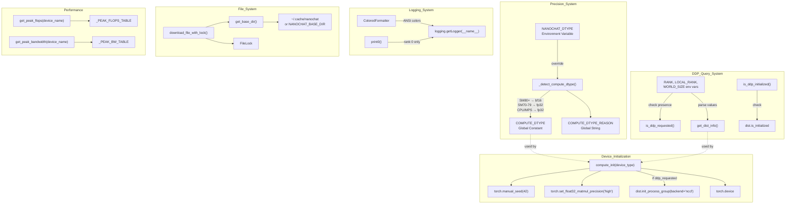
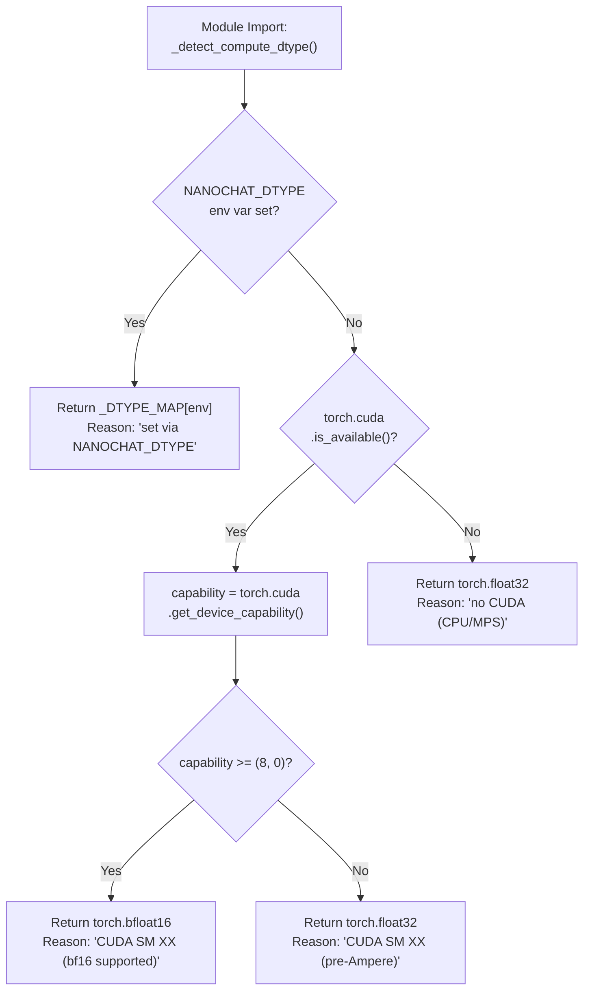
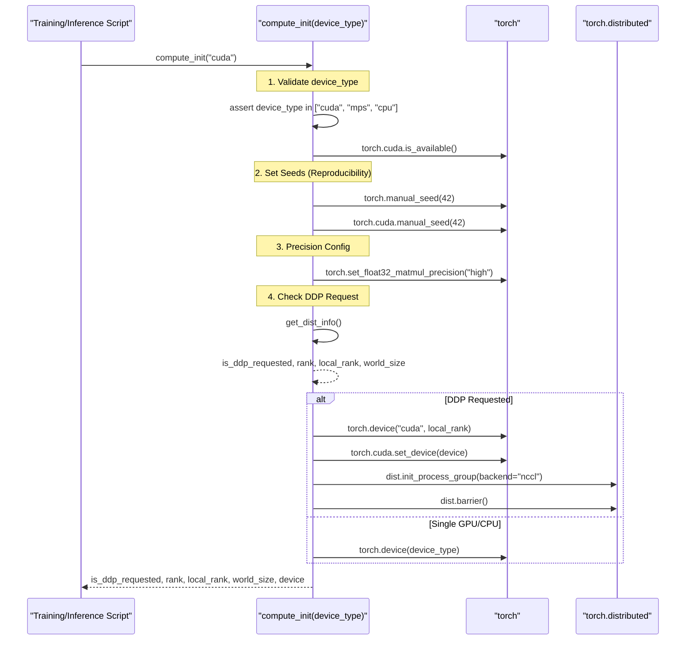
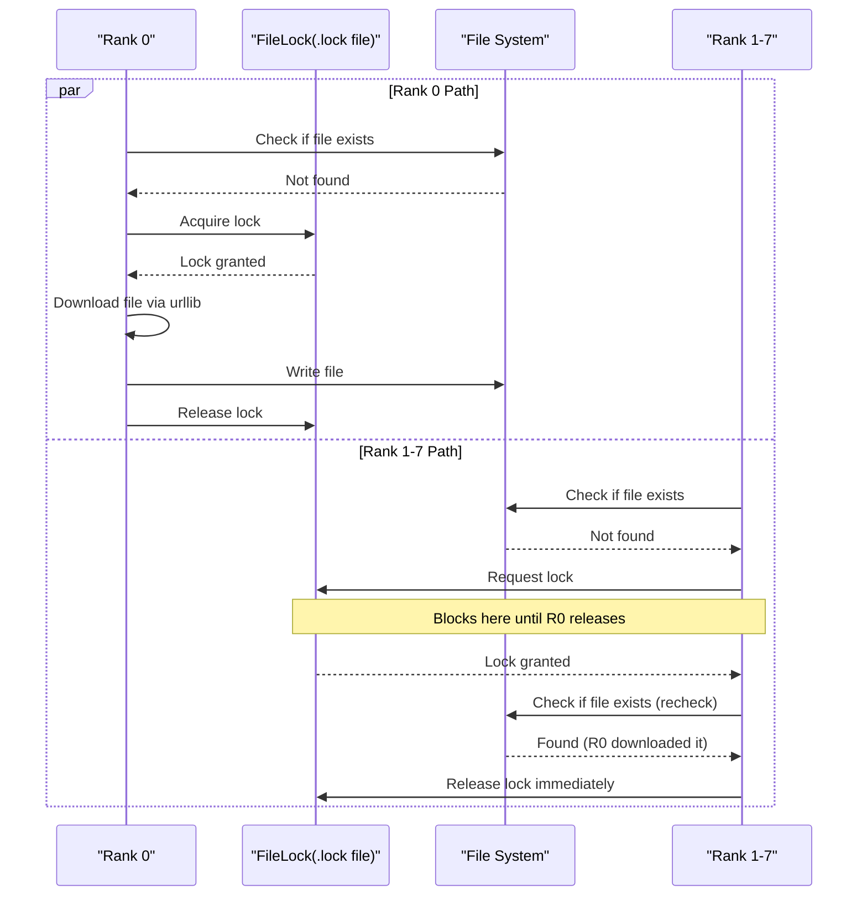

> [!WARNING]
> Imported from DeepWiki as generated, unverified repository documentation. Verify code-behavior claims against the revision below before stabilization.

# Common Utilities and Device Management

<details>
<summary>Relevant source files</summary>

The following files were used as context for generating this wiki page:

- [nanochat/common.py](https://github.com/karpathy/nanochat/blob/92d63d4e8bb4df75c3b71618f31ddde2378b2bcd/nanochat/common.py)
- [scripts/infer_bench.py](https://github.com/karpathy/nanochat/blob/92d63d4e8bb4df75c3b71618f31ddde2378b2bcd/scripts/infer_bench.py)

</details>


This document covers the `nanochat/common.py` module, which provides foundational utilities used throughout the codebase. This module handles device initialization, distributed training setup, precision management, logging, file downloads, and performance measurement. Nearly every other module depends on `common.py` for core infrastructure services.

---

## Overview: The Foundation Layer

The `common.py` module serves as the foundation layer for nanochat, providing six categories of utilities:

| Category | Key Functions/Objects | Purpose |
|----------|----------------------|---------|
| **Precision Management** | `COMPUTE_DTYPE`, `_detect_compute_dtype()` | Auto-detect and configure training precision (bf16/fp16/fp32) |
| **Device Initialization** | `compute_init()`, `compute_cleanup()` | Set up device, DDP, reproducibility, and precision |
| **Distributed Training** | `is_ddp_requested()`, `get_dist_info()`, `is_ddp_initialized()` | Query and manage distributed process group state |
| **Logging** | `ColoredFormatter`, `print0()`, `print_banner()` | Colored logging and rank-aware output |
| **File System** | `get_base_dir()`, `download_file_with_lock()` | Manage cache directory and concurrent downloads |
| **Performance** | `get_peak_flops()`, `get_peak_bandwidth()` | Hardware capability lookup for MFU/MBU calculation |

**Diagram: Common Module Architecture**


Sources: [nanochat/common.py:1-321](https://github.com/karpathy/nanochat/blob/92d63d4e8bb4df75c3b71618f31ddde2378b2bcd/nanochat/common.py#L1-L321)

---

## COMPUTE_DTYPE: Explicit Precision Management

nanochat **does not use `torch.amp.autocast`**. Instead, precision is managed explicitly through a single global constant `COMPUTE_DTYPE` [nanochat/common.py:32](https://github.com/karpathy/nanochat/blob/92d63d4e8bb4df75c3b71618f31ddde2378b2bcd/nanochat/common.py#L32), which is auto-detected at module import time.

### Detection Logic

The detection follows this priority order:

1. **Environment Override**: If `NANOCHAT_DTYPE` is set, use that value [nanochat/common.py:18-20](https://github.com/karpathy/nanochat/blob/92d63d4e8bb4df75c3b71618f31ddde2378b2bcd/nanochat/common.py#L18-L20). Supported values are `bfloat16`, `float16`, and `float32` [nanochat/common.py:16](https://github.com/karpathy/nanochat/blob/92d63d4e8bb4df75c3b71618f31ddde2378b2bcd/nanochat/common.py#L16).
2. **CUDA Capability**: Check GPU compute capability (SM version) [nanochat/common.py:24-29](https://github.com/karpathy/nanochat/blob/92d63d4e8bb4df75c3b71618f31ddde2378b2bcd/nanochat/common.py#L24-L29).
   - **SM 80+** (Ampere/Hopper: A100, H100): Use `torch.bfloat16` [nanochat/common.py:25-26](https://github.com/karpathy/nanochat/blob/92d63d4e8bb4df75c3b71618f31ddde2378b2bcd/nanochat/common.py#L25-L26).
   - **SM 70-79** (Volta/Turing: V100, T4): Use `torch.float32` as `bf16` is not supported and `fp16` training requires a `GradScaler` which is not yet implemented [nanochat/common.py:27-29](https://github.com/karpathy/nanochat/blob/92d63d4e8bb4df75c3b71618f31ddde2378b2bcd/nanochat/common.py#L27-L29).
3. **Fallback**: CPU/MPS defaults to `torch.float32` [nanochat/common.py:30-31](https://github.com/karpathy/nanochat/blob/92d63d4e8bb4df75c3b71618f31ddde2378b2bcd/nanochat/common.py#L30-L31).

**Diagram: COMPUTE_DTYPE Detection Flow**


Sources: [nanochat/common.py:17-32](https://github.com/karpathy/nanochat/blob/92d63d4e8bb4df75c3b71618f31ddde2378b2bcd/nanochat/common.py#L17-L32)

---

## Device Initialization: compute_init()

The `compute_init()` function is the centralized entry point for device setup, called at the start of training and inference scripts [nanochat/common.py:174](https://github.com/karpathy/nanochat/blob/92d63d4e8bb4df75c3b71618f31ddde2378b2bcd/nanochat/common.py#L174).

### Initialization Sequence

**Diagram: compute_init() Execution Flow**


Sources: [nanochat/common.py:174-208](https://github.com/karpathy/nanochat/blob/92d63d4e8bb4df75c3b71618f31ddde2378b2bcd/nanochat/common.py#L174-L208)

### Cleanup

Every script that calls `compute_init()` should call `compute_cleanup()` before exit [nanochat/common.py:210](https://github.com/karpathy/nanochat/blob/92d63d4e8bb4df75c3b71618f31ddde2378b2bcd/nanochat/common.py#L210):

```python
def compute_cleanup():
    if is_ddp_initialized():
        dist.destroy_process_group()
```
This function safely destroys the process group only if it was initialized nanochat/common.py:144-149, 210-213.

---

## Distributed Training Utilities

nanochat provides query functions for DDP state management:

| Function | Logic | Source |
|----------|-------|--------|
| `is_ddp_requested()` | Returns `True` if `RANK`, `LOCAL_RANK`, and `WORLD_SIZE` env vars are present. | [nanochat/common.py:137-142](https://github.com/karpathy/nanochat/blob/92d63d4e8bb4df75c3b71618f31ddde2378b2bcd/nanochat/common.py#L137-L142) |
| `get_dist_info()` | Parses env vars to return `(is_ddp, rank, local_rank, world_size)`. | [nanochat/common.py:151-161](https://github.com/karpathy/nanochat/blob/92d63d4e8bb4df75c3b71618f31ddde2378b2bcd/nanochat/common.py#L151-L161) |
| `is_ddp_initialized()` | Checks `dist.is_initialized()`. | [nanochat/common.py:144-149](https://github.com/karpathy/nanochat/blob/92d63d4e8bb4df75c3b71618f31ddde2378b2bcd/nanochat/common.py#L144-L149) |

---

## Logging Utilities

### ColoredFormatter: ANSI-Colored Logs

The `ColoredFormatter` class enhances `logging.Formatter` with ANSI color codes [nanochat/common.py:34-43](https://github.com/karpathy/nanochat/blob/92d63d4e8bb4df75c3b71618f31ddde2378b2bcd/nanochat/common.py#L34-L43). It specifically highlights numbers, percentages, and units (GB, MB, %, docs) in `INFO` messages using regex substitution [nanochat/common.py:54-58](https://github.com/karpathy/nanochat/blob/92d63d4e8bb4df75c3b71618f31ddde2378b2bcd/nanochat/common.py#L54-L58).

### print0(): Rank 0 Output

```python
def print0(s="",**kwargs):
    ddp_rank = int(os.environ.get('RANK', 0))
    if ddp_rank == 0:
        print(s, **kwargs)
```
**Purpose**: Print only from rank 0 to avoid duplicate output in DDP mode [nanochat/common.py:118-121](https://github.com/karpathy/nanochat/blob/92d63d4e8bb4df75c3b71618f31ddde2378b2bcd/nanochat/common.py#L118-L121).

---

## File System Utilities

### get_base_dir(): Cache Directory

```python
def get_base_dir():
    if os.environ.get("NANOCHAT_BASE_DIR"):
        nanochat_dir = os.environ.get("NANOCHAT_BASE_DIR")
    else:
        home_dir = os.path.expanduser("~")
        cache_dir = os.path.join(home_dir, ".cache")
        nanochat_dir = os.path.join(cache_dir, "nanochat")
    os.makedirs(nanochat_dir, exist_ok=True)
    return nanochat_dir
```
**Default Path**: `~/.cache/nanochat/`. This can be overridden via `NANOCHAT_BASE_DIR` [nanochat/common.py:71-80](https://github.com/karpathy/nanochat/blob/92d63d4e8bb4df75c3b71618f31ddde2378b2bcd/nanochat/common.py#L71-L80).

### download_file_with_lock(): Concurrent-Safe Downloads

This function uses a `.lock` file via `FileLock` to prevent race conditions when multiple ranks attempt to download the same file simultaneously [nanochat/common.py:82-116](https://github.com/karpathy/nanochat/blob/92d63d4e8bb4df75c3b71618f31ddde2378b2bcd/nanochat/common.py#L82-L116).

**Diagram: File Lock Download Flow**


Sources: [nanochat/common.py:82-116](https://github.com/karpathy/nanochat/blob/92d63d4e8bb4df75c3b71618f31ddde2378b2bcd/nanochat/common.py#L82-L116)

---

## Performance Measurement: Hardware Capability Lookup

The codebase includes lookups for peak hardware performance used in MFU (Model FLOPs Utilization) and MBU (Model Bandwidth Utilization) calculations [scripts/infer_bench.py:15-17](https://github.com/karpathy/nanochat/blob/92d63d4e8bb4df75c3b71618f31ddde2378b2bcd/scripts/infer_bench.py#L15-L17).

### get_peak_flops()

Returns the peak BF16 TFLOPS of a GPU based on its name [nanochat/common.py:225-280](https://github.com/karpathy/nanochat/blob/92d63d4e8bb4df75c3b71618f31ddde2378b2bcd/nanochat/common.py#L225-L280). It uses a pattern matching table `_PEAK_FLOPS_TABLE` [nanochat/common.py:228-272](https://github.com/karpathy/nanochat/blob/92d63d4e8bb4df75c3b71618f31ddde2378b2bcd/nanochat/common.py#L228-L272).

| GPU Family | Model Substring | Peak BF16 TFLOPS |
|------------|-----------------|------------------|
| **Blackwell** | "GB200" | 2.5e15 |
| **Hopper** | "H100" (SXM) | 989e12 |
| **Ampere** | "A100" | 312e12 |
| **Ada** | "4090" | 165.2e12 |

### get_peak_bandwidth()

Returns the theoretical peak memory bandwidth in bytes/sec [nanochat/common.py:282-321](https://github.com/karpathy/nanochat/blob/92d63d4e8bb4df75c3b71618f31ddde2378b2bcd/nanochat/common.py#L282-L321). This is critical for benchmarking the decode phase of inference, which is typically memory-bandwidth bound [scripts/infer_bench.py:10-13](https://github.com/karpathy/nanochat/blob/92d63d4e8bb4df75c3b71618f31ddde2378b2bcd/scripts/infer_bench.py#L10-L13).

| GPU Model | Peak Bandwidth |
|-----------|----------------|
| **H100 SXM** | 3.35 TB/s |
| **A100 80GB** | 2.04 TB/s |
| **RTX 4090** | 1.01 TB/s |

Sources: [nanochat/common.py:225-321](https://github.com/karpathy/nanochat/blob/92d63d4e8bb4df75c3b71618f31ddde2378b2bcd/nanochat/common.py#L225-L321), [scripts/infer_bench.py:9-17](https://github.com/karpathy/nanochat/blob/92d63d4e8bb4df75c3b71618f31ddde2378b2bcd/scripts/infer_bench.py#L9-L17)

---

## Auxiliary Utilities

### autodetect_device_type()

Detects the best available hardware in the order: CUDA > MPS > CPU [nanochat/common.py:163-172](https://github.com/karpathy/nanochat/blob/92d63d4e8bb4df75c3b71618f31ddde2378b2bcd/nanochat/common.py#L163-L172).

### DummyWandb

A no-op class that mimics the `wandb` API for environments where Weights & Biases is not configured or desired [nanochat/common.py:215-223](https://github.com/karpathy/nanochat/blob/92d63d4e8bb4df75c3b71618f31ddde2378b2bcd/nanochat/common.py#L215-L223).

```python
class DummyWandb:
    def log(self, *args, **kwargs): pass
    def finish(self): pass
```
Sources: [nanochat/common.py:215-223](https://github.com/karpathy/nanochat/blob/92d63d4e8bb4df75c3b71618f31ddde2378b2bcd/nanochat/common.py#L215-L223)
