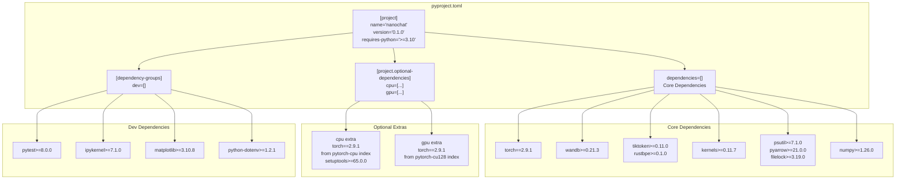
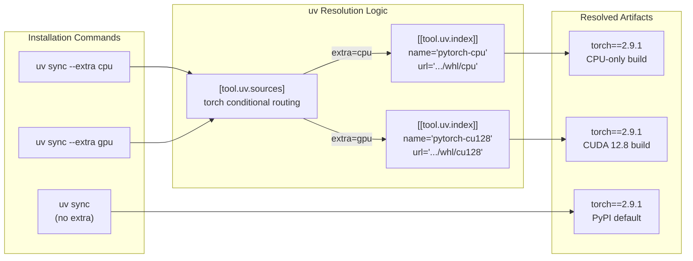

> [!WARNING]
> Imported from DeepWiki as generated, unverified repository documentation. Verify code-behavior claims against the revision below before stabilization.

# Dependency Management with uv

<details>
<summary>Relevant source files</summary>

The following files were used as context for generating this wiki page:

- [pyproject.toml](https://github.com/karpathy/nanochat/blob/92d63d4e8bb4df75c3b71618f31ddde2378b2bcd/pyproject.toml)
- [uv.lock](https://github.com/karpathy/nanochat/blob/92d63d4e8bb4df75c3b71618f31ddde2378b2bcd/uv.lock)

</details>


## Purpose and Scope

This document explains nanochat's dependency management system using `uv`, a high-performance Python package installer and resolver. It details the `pyproject.toml` configuration, the mechanism for handling specialized PyTorch builds (CPU vs. GPU), custom package indices, and the lock file system that ensures reproducible training environments. This system is designed to support the project's "single-complexity-dial" philosophy by providing a stable, high-performance foundation for both local development and large-scale GPU training.

---

## Dependency Configuration Overview

The nanochat project utilizes `pyproject.toml` to define its environment. Dependencies are stratified into core requirements, environment-specific extras (for hardware acceleration), and development tools.

**Diagram: Dependency Configuration Structure**



**Sources:** [pyproject.toml:1-17](https://github.com/karpathy/nanochat/blob/92d63d4e8bb4df75c3b71618f31ddde2378b2bcd/pyproject.toml#L1-L17), [pyproject.toml:19-25](https://github.com/karpathy/nanochat/blob/92d63d4e8bb4df75c3b71618f31ddde2378b2bcd/pyproject.toml#L19-L25), [pyproject.toml:53-60](https://github.com/karpathy/nanochat/blob/92d63d4e8bb4df75c3b71618f31ddde2378b2bcd/pyproject.toml#L53-L60)

---

## Core Dependencies

The `dependencies` list in `pyproject.toml` includes the essential packages required for the full training and inference lifecycle.

| Category | Packages | Purpose |
|:---|:---|:---|
| **Deep Learning** | `torch==2.9.1`, `kernels` | Core framework and optimized GPU kernels. |
| **Data & Serialization** | `pyarrow`, `filelock`, `numpy` | Parquet shard handling and cross-process locking for data loading. |
| **Tokenization** | `tiktoken`, `rustbpe` | Fast BPE processing and encoding. |
| **Monitoring** | `wandb`, `psutil` | Experiment tracking and system resource logging. |

The strict pin of `torch==2.9.1` is essential for compatibility with advanced features like **Flash Attention 3** and specific hardware-aligned kernels used in the training pipeline. [pyproject.toml:15-15](https://github.com/karpathy/nanochat/blob/92d63d4e8bb4df75c3b71618f31ddde2378b2bcd/pyproject.toml#L15-L15)

**Sources:** [pyproject.toml:7-17](https://github.com/karpathy/nanochat/blob/92d63d4e8bb4df75c3b71618f31ddde2378b2bcd/pyproject.toml#L7-L17)

---

## PyTorch Installation Strategy

Nanochat uses `uv`'s advanced indexing to manage the large disparity between CPU and GPU builds of PyTorch. This allows the same configuration to serve both local development (Mac/Laptop) and high-performance clusters (H100/A100).

**Diagram: PyTorch Backend Resolution with uv**



### Custom Index Declaration
The `[[tool.uv.index]]` blocks define the specific PyTorch wheel repositories. The `explicit = true` setting is crucial—it prevents `uv` from searching these indices for other packages, which speeds up resolution and prevents "dependency confusion" attacks. [pyproject.toml:43-51](https://github.com/karpathy/nanochat/blob/92d63d4e8bb4df75c3b71618f31ddde2378b2bcd/pyproject.toml#L43-L51)

```toml
[[tool.uv.index]]
name = "pytorch-cpu"
url = "https://download.pytorch.org/whl/cpu"
explicit = true

[[tool.uv.index]]
name = "pytorch-cu128"
url = "https://download.pytorch.org/whl/cu128"
explicit = true
```

### Conditional Source Routing
The `[tool.uv.sources]` section maps the `torch` package to a specific index based on which "extra" is active during the `uv sync` command. [pyproject.toml:37-41](https://github.com/karpathy/nanochat/blob/92d63d4e8bb4df75c3b71618f31ddde2378b2bcd/pyproject.toml#L37-L41)

```toml
[tool.uv.sources]
torch = [
    { index = "pytorch-cpu", extra = "cpu" },
    { index = "pytorch-cu128", extra = "gpu" },
]
```

**Sources:** [pyproject.toml:37-51](https://github.com/karpathy/nanochat/blob/92d63d4e8bb4df75c3b71618f31ddde2378b2bcd/pyproject.toml#L37-L51)

---

## Dependency Conflict Management

To prevent users from accidentally installing both CPU and GPU versions of PyTorch (which would lead to non-deterministic library loading or runtime crashes), `uv` is configured with an explicit conflict rule. [pyproject.toml:64-69](https://github.com/karpathy/nanochat/blob/92d63d4e8bb4df75c3b71618f31ddde2378b2bcd/pyproject.toml#L64-L69)

```toml
[tool.uv]
default-groups = []
conflicts = [
    [
        { extra = "cpu" },
        { extra = "gpu" },
    ],
]
```

If a user attempts `uv sync --extra cpu --extra gpu`, the resolver will throw an error immediately rather than attempting to merge the incompatible requirements.

**Sources:** [pyproject.toml:62-69](https://github.com/karpathy/nanochat/blob/92d63d4e8bb4df75c3b71618f31ddde2378b2bcd/pyproject.toml#L62-L69)

---

## Reproducible Builds with uv.lock

The `uv.lock` file provides a cryptographic snapshot of the entire dependency tree. It contains distinct resolution markers to handle the complexity of different Python versions and system platforms across both CPU and GPU variants.

### Lock File Mechanism
The lock file includes:
- **Exact Hashes:** Every package (e.g., `annotated-types` version `0.7.0`) is stored with its `sha256` hash and source URL to ensure supply chain security. [uv.lock:36-43](https://github.com/karpathy/nanochat/blob/92d63d4e8bb4df75c3b71618f31ddde2378b2bcd/uv.lock#L36-L43)
- **Transitive Resolution:** It maps out dependencies of dependencies (e.g., `cffi` requiring `pycparser`). [uv.lock:72-78](https://github.com/karpathy/nanochat/blob/92d63d4e8bb4df75c3b71618f31ddde2378b2bcd/uv.lock#L72-L78)
- **Resolution Markers:** Complex boolean logic (e.g., `python_full_version >= '3.12' and sys_platform == 'linux' and extra == 'extra-8-nanochat-gpu'`) ensures the correct wheel is selected for the specific environment and hardware extra requested. [uv.lock:4-26](https://github.com/karpathy/nanochat/blob/92d63d4e8bb4df75c3b71618f31ddde2378b2bcd/uv.lock#L4-L26)
- **Conflict Enforcement:** The lock file mirrors the `pyproject.toml` conflict rules, ensuring the `cpu` and `gpu` extras remain mutually exclusive in the locked state. [uv.lock:27-30](https://github.com/karpathy/nanochat/blob/92d63d4e8bb4df75c3b71618f31ddde2378b2bcd/uv.lock#L27-L30)

**Sources:** [uv.lock:1-83](https://github.com/karpathy/nanochat/blob/92d63d4e8bb4df75c3b71618f31ddde2378b2bcd/uv.lock#L1-L83)

---

## Development and Testing Configuration

### Dependency Groups
Non-production dependencies are isolated in the `dev` group. This includes tools for interactive development (`ipykernel`), visualization (`matplotlib`), and testing (`pytest`). [pyproject.toml:19-25](https://github.com/karpathy/nanochat/blob/92d63d4e8bb4df75c3b71618f31ddde2378b2bcd/pyproject.toml#L19-L25)

```toml
[dependency-groups]
dev = [
    "ipykernel>=7.1.0",
    "matplotlib>=3.10.8",
    "pytest>=8.0.0",
    "python-dotenv>=1.2.1",
]
```

### Pytest Options
The project uses specific markers to manage tests, particularly the "slow" markers for computationally expensive training or evaluation tests. [pyproject.toml:27-34](https://github.com/karpathy/nanochat/blob/92d63d4e8bb4df75c3b71618f31ddde2378b2bcd/pyproject.toml#L27-L34)

| Option | Value | Purpose |
|:---|:---|:---|
| `markers` | `slow` | Allows running `pytest -m "not slow"` to skip long-running tests. |
| `testpaths` | `["tests"]` | Restricts discovery to the `tests/` directory. |
| `python_files` | `test_*.py` | Standardizes test naming conventions. |

**Sources:** [pyproject.toml:20-34](https://github.com/karpathy/nanochat/blob/92d63d4e8bb4df75c3b71618f31ddde2378b2bcd/pyproject.toml#L20-L34)

---

## Summary of Installation Workflows

| Target Environment | Command | Result |
|:---|:---|:---|
| **Local Dev (No GPU)** | `uv sync --extra cpu --all-groups` | Installs CPU torch + all dev tools. |
| **GPU Cluster Training** | `uv sync --extra gpu` | Installs CUDA 12.8 torch and core training deps. |
| **Production Inference** | `uv sync` | Installs core dependencies only (minimal footprint). |

**Sources:** [pyproject.toml:1-70](https://github.com/karpathy/nanochat/blob/92d63d4e8bb4df75c3b71618f31ddde2378b2bcd/pyproject.toml#L1-L70)
