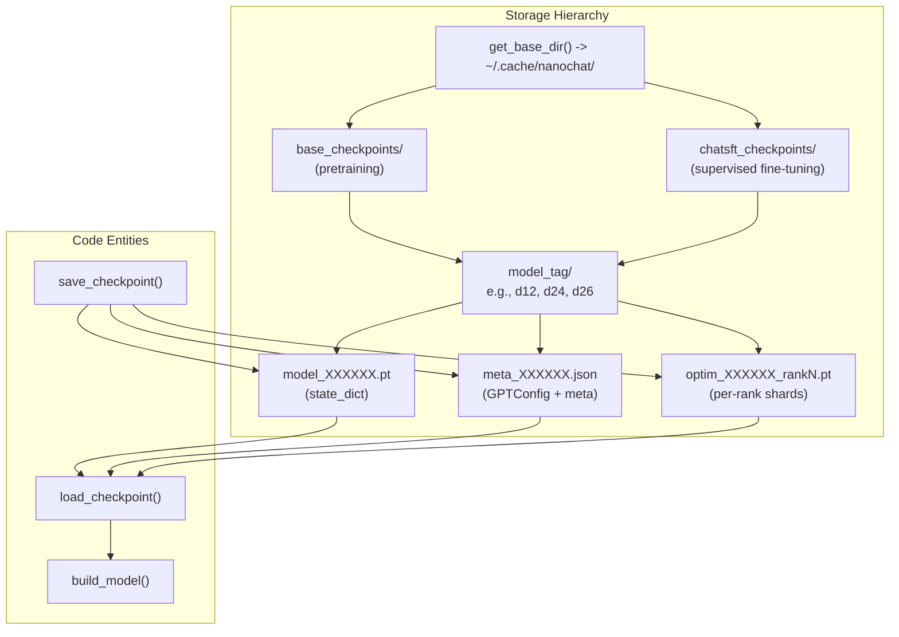
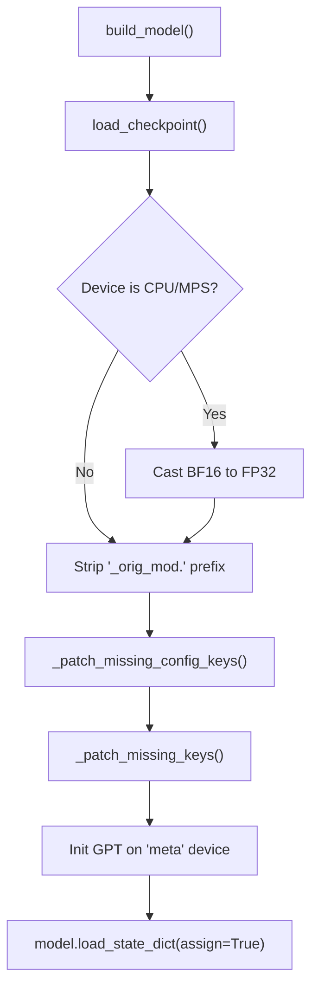
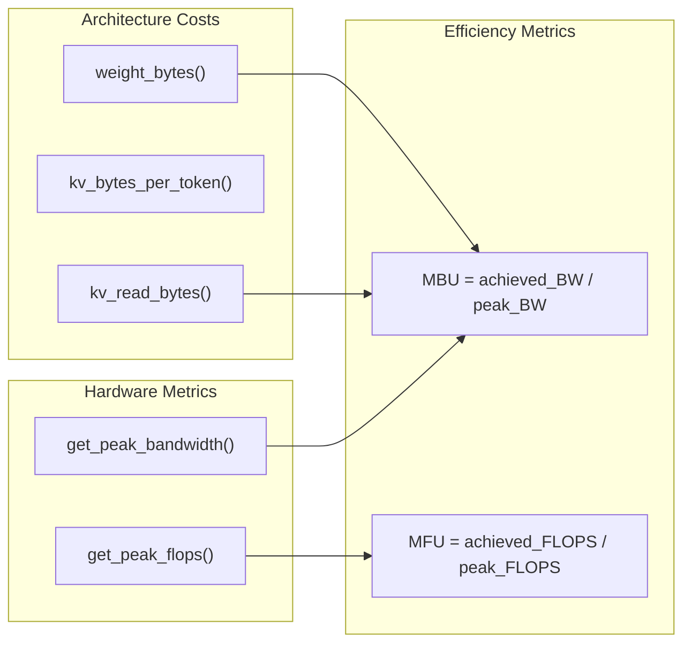
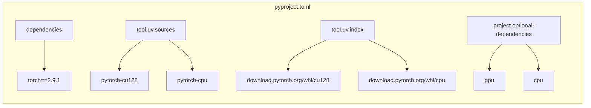

> [!WARNING]
> Imported from DeepWiki as generated, unverified repository documentation. Verify code-behavior claims against the revision below before stabilization.

# Infrastructure and Utilities

Relevant source files

The following files were used as context for generating this wiki page:

- [nanochat/checkpoint_manager.py](https://github.com/karpathy/nanochat/blob/92d63d4e8bb4df75c3b71618f31ddde2378b2bcd/nanochat/checkpoint_manager.py)
- [nanochat/common.py](https://github.com/karpathy/nanochat/blob/92d63d4e8bb4df75c3b71618f31ddde2378b2bcd/nanochat/common.py)
- [scripts/infer_bench.py](https://github.com/karpathy/nanochat/blob/92d63d4e8bb4df75c3b71618f31ddde2378b2bcd/scripts/infer_bench.py)

## Purpose and Scope

This document covers the core infrastructure components that support the nanochat training and inference pipelines. These utilities handle checkpoint persistence, distributed computing setup, device detection, logging, file downloads, and dependency management. They provide the foundation upon which the training and serving systems operate.

For details on how training utilizes these systems, see [Base Model Pretraining](deepwiki-03-base-model-pretraining.md). For model architecture details that are persisted via checkpoints, see [Model Architecture](deepwiki-04-model-architecture.md). For deployment infrastructure that consumes checkpoints, see [Inference and Deployment](deepwiki-10-inference-and-deployment.md).

---

## Checkpoint Management System

The checkpoint management system in `nanochat/checkpoint_manager.py` provides a unified interface for saving and loading model states, optimizer states, and training metadata. It handles backward compatibility, model reconstruction, and distributed checkpoint sharding across DDP ranks.

### Architecture and File Organization

The checkpoint system uses a hierarchy starting from the base directory (defaulting to `~/.cache/nanochat`) [nanochat/common.py:71-80](https://github.com/karpathy/nanochat/blob/92d63d4e8bb4df75c3b71618f31ddde2378b2bcd/nanochat/common.py#L71-L80). It separates base training from SFT [nanochat/checkpoint_manager.py:165-173](https://github.com/karpathy/nanochat/blob/92d63d4e8bb4df75c3b71618f31ddde2378b2bcd/nanochat/checkpoint_manager.py#L165-L173) and organizes by model depth (the "complexity dial") [nanochat/checkpoint_manager.py:118-135](https://github.com/karpathy/nanochat/blob/92d63d4e8bb4df75c3b71618f31ddde2378b2bcd/nanochat/checkpoint_manager.py#L118-L135).

**Checkpoint Directory Structure**

Sources: [nanochat/checkpoint_manager.py:41-180](https://github.com/karpathy/nanochat/blob/92d63d4e8bb4df75c3b71618f31ddde2378b2bcd/nanochat/checkpoint_manager.py#L41-L180), [nanochat/common.py:71-80](https://github.com/karpathy/nanochat/blob/92d63d4e8bb4df75c3b71618f31ddde2378b2bcd/nanochat/common.py#L71-L80)

### Checkpoint Components

| Component | File Pattern | Saved By | Contents |
|-----------|-------------|----------|----------|
| **Model Weights** | `model_{step:06d}.pt` | Rank 0 [nanochat/checkpoint_manager.py:42-47](https://github.com/karpathy/nanochat/blob/92d63d4e8bb4df75c3b71618f31ddde2378b2bcd/nanochat/checkpoint_manager.py#L42-L47) | Full `state_dict()` |
| **Metadata** | `meta_{step:06d}.json` | Rank 0 [nanochat/checkpoint_manager.py:49-52](https://github.com/karpathy/nanochat/blob/92d63d4e8bb4df75c3b71618f31ddde2378b2bcd/nanochat/checkpoint_manager.py#L49-L52) | `GPTConfig` kwargs and training stats |
| **Optimizer State** | `optim_{step:06d}_rank{N}.pt` | All Ranks [nanochat/checkpoint_manager.py:54-58](https://github.com/karpathy/nanochat/blob/92d63d4e8bb4df75c3b71618f31ddde2378b2bcd/nanochat/checkpoint_manager.py#L54-L58) | Sharded states (Muon/AdamW) |

**Design Rationale:**
- **Rank-Aware Saving**: Only rank 0 saves the model and metadata to avoid redundant I/O, while every rank saves its own optimizer shard because distributed optimizers shard parameters across the world size [nanochat/checkpoint_manager.py:54-58](https://github.com/karpathy/nanochat/blob/92d63d4e8bb4df75c3b71618f31ddde2378b2bcd/nanochat/checkpoint_manager.py#L54-L58).
- **JSON Metadata**: Stores `model_config` to allow model reconstruction without hardcoded parameters [nanochat/checkpoint_manager.py:94-97](https://github.com/karpathy/nanochat/blob/92d63d4e8bb4df75c3b71618f31ddde2378b2bcd/nanochat/checkpoint_manager.py#L94-L97).

Sources: [nanochat/checkpoint_manager.py:41-73](https://github.com/karpathy/nanochat/blob/92d63d4e8bb4df75c3b71618f31ddde2378b2bcd/nanochat/checkpoint_manager.py#L41-L73)

### Model Building and Compatibility

The `build_model` function reconstructs a `GPT` instance from a checkpoint, applying patches for backward compatibility [nanochat/checkpoint_manager.py:76-114](https://github.com/karpathy/nanochat/blob/92d63d4e8bb4df75c3b71618f31ddde2378b2bcd/nanochat/checkpoint_manager.py#L76-L114).

**Model Reconstruction Flow**

**Backward Compatibility Patches:**
- **Config Patches**: Adds `window_pattern="L"` if missing from older checkpoints [nanochat/checkpoint_manager.py:22-28](https://github.com/karpathy/nanochat/blob/92d63d4e8bb4df75c3b71618f31ddde2378b2bcd/nanochat/checkpoint_manager.py#L22-L28).
- **Parameter Patches**: Defaults `resid_lambdas` to 1.0 and `x0_lambdas` to 0.0 if not present in the saved state [nanochat/checkpoint_manager.py:29-40](https://github.com/karpathy/nanochat/blob/92d63d4e8bb4df75c3b71618f31ddde2378b2bcd/nanochat/checkpoint_manager.py#L29-L40).

For more details on rank-aware saving and patching, see [Checkpoint Management](deepwiki-11-01-checkpoint-management.md).

Sources: [nanochat/checkpoint_manager.py:22-40](https://github.com/karpathy/nanochat/blob/92d63d4e8bb4df75c3b71618f31ddde2378b2bcd/nanochat/checkpoint_manager.py#L22-L40), [nanochat/checkpoint_manager.py:76-114](https://github.com/karpathy/nanochat/blob/92d63d4e8bb4df75c3b71618f31ddde2378b2bcd/nanochat/checkpoint_manager.py#L76-L114)

---

## Common Utilities and Device Management

The `nanochat/common.py` module provides the foundational environment setup for both single-device and distributed (DDP) execution.

### Device and Precision Management

The system uses a `COMPUTE_DTYPE` system to manage numerical precision across different hardware [nanochat/common.py:13-32](https://github.com/karpathy/nanochat/blob/92d63d4e8bb4df75c3b71618f31ddde2378b2bcd/nanochat/common.py#L13-L32).

| Feature | Logic |
|---------|-------|
| **Device Detection** | Priority: CUDA > MPS > CPU [nanochat/common.py:163-172](https://github.com/karpathy/nanochat/blob/92d63d4e8bb4df75c3b71618f31ddde2378b2bcd/nanochat/common.py#L163-L172) |
| **Compute Dtype** | Defaults to `bfloat16` on Ampere+ (SM 80+), otherwise `float32` [nanochat/common.py:17-31](https://github.com/karpathy/nanochat/blob/92d63d4e8bb4df75c3b71618f31ddde2378b2bcd/nanochat/common.py#L17-L31) |
| **TF32** | Enabled for CUDA matmuls in `compute_init` [nanochat/common.py:182-183](https://github.com/karpathy/nanochat/blob/92d63d4e8bb4df75c3b71618f31ddde2378b2bcd/nanochat/common.py#L182-L183) |

### Distributed Initialization (`compute_init`)

`compute_init` handles the boilerplate for setting up `torch.distributed` and environment-wide settings [nanochat/common.py:174-191](https://github.com/karpathy/nanochat/blob/92d63d4e8bb4df75c3b71618f31ddde2378b2bcd/nanochat/common.py#L174-L191).

**Key Utilities:**
- **`print0`**: A wrapper that only prints on rank 0 to prevent log flooding in DDP [nanochat/common.py:118-121](https://github.com/karpathy/nanochat/blob/92d63d4e8bb4df75c3b71618f31ddde2378b2bcd/nanochat/common.py#L118-L121).
- **`get_peak_flops`**: A lookup table for various GPU architectures (H100, A100, RTX 4090, etc.) used to calculate Model FLOPs Utilization (MFU) [nanochat/common.py:204-258](https://github.com/karpathy/nanochat/blob/92d63d4e8bb4df75c3b71618f31ddde2378b2bcd/nanochat/common.py#L204-L258).
- **`download_file_with_lock`**: Uses `FileLock` to ensure only one rank downloads a file (like the tokenizer or dataset) while others wait [nanochat/common.py:82-116](https://github.com/karpathy/nanochat/blob/92d63d4e8bb4df75c3b71618f31ddde2378b2bcd/nanochat/common.py#L82-L116).
- **`DummyWandb`**: A null-object pattern implementation for logging when Weights & Biases is disabled [nanochat/common.py:263-271](https://github.com/karpathy/nanochat/blob/92d63d4e8bb4df75c3b71618f31ddde2378b2bcd/nanochat/common.py#L263-L271).

For details on `COMPUTE_DTYPE` and `get_peak_flops`, see [Common Utilities and Device Management](deepwiki-11-02-common-utilities-and-device-management.md).

Sources: [nanochat/common.py:13-32](https://github.com/karpathy/nanochat/blob/92d63d4e8bb4df75c3b71618f31ddde2378b2bcd/nanochat/common.py#L13-L32), [nanochat/common.py:82-116](https://github.com/karpathy/nanochat/blob/92d63d4e8bb4df75c3b71618f31ddde2378b2bcd/nanochat/common.py#L82-L116), [nanochat/common.py:118-121](https://github.com/karpathy/nanochat/blob/92d63d4e8bb4df75c3b71618f31ddde2378b2bcd/nanochat/common.py#L118-L121), [nanochat/common.py:174-191](https://github.com/karpathy/nanochat/blob/92d63d4e8bb4df75c3b71618f31ddde2378b2bcd/nanochat/common.py#L174-L191), [nanochat/common.py:204-258](https://github.com/karpathy/nanochat/blob/92d63d4e8bb4df75c3b71618f31ddde2378b2bcd/nanochat/common.py#L204-L258), [nanochat/common.py:263-271](https://github.com/karpathy/nanochat/blob/92d63d4e8bb4df75c3b71618f31ddde2378b2bcd/nanochat/common.py#L263-L271)

---

## Performance and Bandwidth Analysis

The infrastructure includes tools for analyzing model efficiency beyond training metrics. `scripts/infer_bench.py` measures the hardware-level performance of trained checkpoints.

### Inference Benchmarking

The benchmarking tool sweeps over batch sizes to trace the tradeoff between latency and throughput [scripts/infer_bench.py:9-17](https://github.com/karpathy/nanochat/blob/92d63d4e8bb4df75c3b71618f31ddde2378b2bcd/scripts/infer_bench.py#L9-L17). It calculates:
- **Weight Bytes**: Memory footprint of parameters [scripts/infer_bench.py:51-53](https://github.com/karpathy/nanochat/blob/92d63d4e8bb4df75c3b71618f31ddde2378b2bcd/scripts/infer_bench.py#L51-L53).
- **MBU (Model Bandwidth Utilization)**: Measures achieved bytes/sec relative to peak theoretical bandwidth [scripts/infer_bench.py:15-17](https://github.com/karpathy/nanochat/blob/92d63d4e8bb4df75c3b71618f31ddde2378b2bcd/scripts/infer_bench.py#L15-L17).
- **TTFT (Time To First Token)**: Latency for the initial prefill phase [scripts/infer_bench.py:61-69](https://github.com/karpathy/nanochat/blob/92d63d4e8bb4df75c3b71618f31ddde2378b2bcd/scripts/infer_bench.py#L61-L69).

**Hardware Analysis Entities**

Sources: [scripts/infer_bench.py:42-53](https://github.com/karpathy/nanochat/blob/92d63d4e8bb4df75c3b71618f31ddde2378b2bcd/scripts/infer_bench.py#L42-L53), [scripts/infer_bench.py:127-139](https://github.com/karpathy/nanochat/blob/92d63d4e8bb4df75c3b71618f31ddde2378b2bcd/scripts/infer_bench.py#L127-L139), [nanochat/common.py:204-258](https://github.com/karpathy/nanochat/blob/92d63d4e8bb4df75c3b71618f31ddde2378b2bcd/nanochat/common.py#L204-L258)

---

## Dependency Management with uv

Nanochat utilizes `uv` for high-performance dependency management and reproducible environments via `pyproject.toml`.

### Environment Configuration
The project defines specific dependency groups and sources to handle the complexity of PyTorch hardware variants [pyproject.toml:37-60](https://github.com/karpathy/nanochat/blob/92d63d4e8bb4df75c3b71618f31ddde2378b2bcd/pyproject.toml#L37-L60).

- **CPU vs GPU**: Handles standard PyTorch vs CUDA-optimized builds via environment-specific extras (`cpu` vs `gpu`) [pyproject.toml:53-60](https://github.com/karpathy/nanochat/blob/92d63d4e8bb4df75c3b71618f31ddde2378b2bcd/pyproject.toml#L53-L60).
- **Custom Indices**: Points to `pytorch-cpu` and `pytorch-cu128` URLs for hardware-specific wheels [pyproject.toml:43-51](https://github.com/karpathy/nanochat/blob/92d63d4e8bb4df75c3b71618f31ddde2378b2bcd/pyproject.toml#L43-L51).
- **Conflict Resolution**: Explicitly prevents concurrent installation of `cpu` and `gpu` extras [pyproject.toml:64-69](https://github.com/karpathy/nanochat/blob/92d63d4e8bb4df75c3b71618f31ddde2378b2bcd/pyproject.toml#L64-L69).

**Natural Language to Code Entity Space: uv Configuration**

For details on the `pyproject.toml` structure and conflict resolution, see [Dependency Management with uv](deepwiki-11-03-dependency-management-with-uv.md).

Sources: [pyproject.toml:7-17](https://github.com/karpathy/nanochat/blob/92d63d4e8bb4df75c3b71618f31ddde2378b2bcd/pyproject.toml#L7-L17), [pyproject.toml:37-69](https://github.com/karpathy/nanochat/blob/92d63d4e8bb4df75c3b71618f31ddde2378b2bcd/pyproject.toml#L37-L69)
