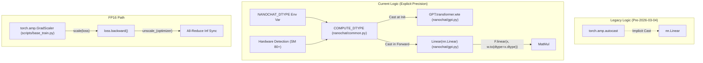
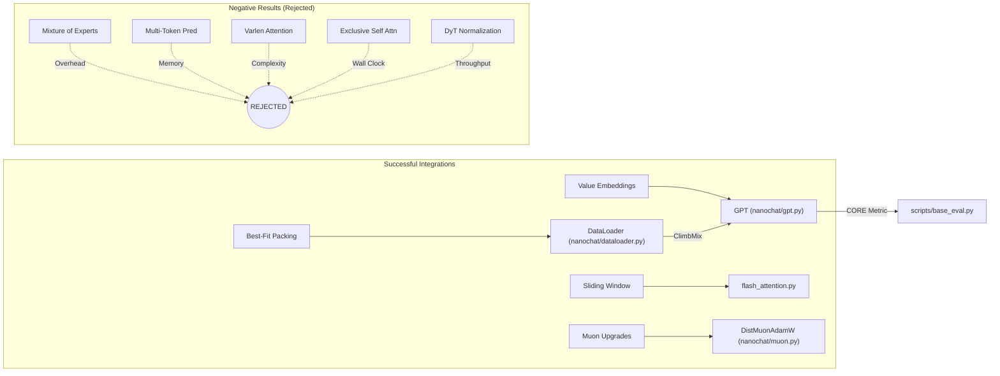

> [!WARNING]
> Imported from DeepWiki as generated, unverified repository documentation. Verify code-behavior claims against the revision below before stabilization.

# Experiment Log and Design History

Relevant source files

The following files were used as context for generating this wiki page:

- [dev/LOG.md](https://github.com/karpathy/nanochat/blob/92d63d4e8bb4df75c3b71618f31ddde2378b2bcd/dev/LOG.md)

This page documents the iterative research and development process behind nanochat. It provides a technical history of architectural evolution, optimization strategies, and the "negative results" (failed experiments) that shaped the final system. The primary record of these experiments is maintained in `dev/LOG.md`.

## Architectural Evolution and Precision Management

The codebase evolved from a "magic" abstraction layer to explicit, high-performance control over hardware resources.

### Explicit DType Management (Removing Autocast)
On March 4, 2026, `torch.amp.autocast` was removed from the entire codebase [dev/LOG.md:72-74](https://github.com/karpathy/nanochat/blob/92d63d4e8bb4df75c3b71618f31ddde2378b2bcd/dev/LOG.md#L72-L74). The motivation was that `autocast` silently manages precision via internal allowlists, which was unnecessary as core components like `F.rms_norm`, `F.cross_entropy`, and Flash Attention already handle their own dtypes [dev/LOG.md:76-79](https://github.com/karpathy/nanochat/blob/92d63d4e8bb4df75c3b71618f31ddde2378b2bcd/dev/LOG.md#L76-L79).

**Implementation Details:**
- **Global Precision Control**: A `COMPUTE_DTYPE` global is auto-detected in `nanochat/common.py`: SM 80+ (Ampere/Hopper) uses `bf16`, while older hardware or CPUs default to `fp32` [dev/LOG.md:83-84](https://github.com/karpathy/nanochat/blob/92d63d4e8bb4df75c3b71618f31ddde2378b2bcd/dev/LOG.md#L83-L84). This can be overridden via the `NANOCHAT_DTYPE` environment variable [dev/LOG.md:83-84](https://github.com/karpathy/nanochat/blob/92d63d4e8bb4df75c3b71618f31ddde2378b2bcd/dev/LOG.md#L83-L84).
- **Custom Linear Layer**: A custom `Linear(nn.Linear)` class was implemented in `nanochat/gpt.py` [nanochat/gpt.py:23-28](https://github.com/karpathy/nanochat/blob/92d63d4e8bb4df75c3b71618f31ddde2378b2bcd/nanochat/gpt.py#L23-L28) to replace `autocast`. It explicitly casts weights to the input's dtype during the forward pass: `F.linear(x, self.weight.to(dtype=x.dtype))` [dev/LOG.md:84-84](https://github.com/karpathy/nanochat/blob/92d63d4e8bb4df75c3b71618f31ddde2378b2bcd/dev/LOG.md#L84-L84).
- **Flash Attention 3 Fallback**: Since FA3 Hopper kernels do not support `fp16` or `fp32`, the system automatically falls back to SDPA when those precisions are active by setting `USE_FA3 = False` [dev/LOG.md:102-104](https://github.com/karpathy/nanochat/blob/92d63d4e8bb4df75c3b71618f31ddde2378b2bcd/dev/LOG.md#L102-L104).

### FP16 Training with GradScaler
To support pre-Ampere GPUs (like V100/T4), explicit `fp16` support was added using `torch.amp.GradScaler` [dev/LOG.md:92-97](https://github.com/karpathy/nanochat/blob/92d63d4e8bb4df75c3b71618f31ddde2378b2bcd/dev/LOG.md#L92-L97).
- **Scaling Logic**: The scaler is only initialized in `base_train.py` if `COMPUTE_DTYPE == torch.float16` [scripts/base_train.py:100-100](https://github.com/karpathy/nanochat/blob/92d63d4e8bb4df75c3b71618f31ddde2378b2bcd/scripts/base_train.py#L100-L100).
- **Sync Mechanism**: After gradient accumulation, the system performs a distributed infinity-sync via `scaler._found_inf_per_device` all-reduced with `ReduceOp.MAX` before the optimizer step [dev/LOG.md:95-95](https://github.com/karpathy/nanochat/blob/92d63d4e8bb4df75c3b71618f31ddde2378b2bcd/dev/LOG.md#L95-L95).

Sources: [dev/LOG.md:72-105](https://github.com/karpathy/nanochat/blob/92d63d4e8bb4df75c3b71618f31ddde2378b2bcd/dev/LOG.md#L72-L105), [nanochat/common.py:12-38](https://github.com/karpathy/nanochat/blob/92d63d4e8bb4df75c3b71618f31ddde2378b2bcd/nanochat/common.py#L12-L38), [nanochat/gpt.py:23-28](https://github.com/karpathy/nanochat/blob/92d63d4e8bb4df75c3b71618f31ddde2378b2bcd/nanochat/gpt.py#L23-L28), [scripts/base_train.py:90-110](https://github.com/karpathy/nanochat/blob/92d63d4e8bb4df75c3b71618f31ddde2378b2bcd/scripts/base_train.py#L90-L110)

## Dataset Evolution: The ClimbMix Upgrade

A pivotal moment in the project's history was the transition from FineWeb-EDU to ClimbMix.

| Date | Change | Impact |
| :--- | :--- | :--- |
| 2026-03-04 | FineWeb-EDU 100B → ClimbMix 400B | 27% reduction in Time-to-GPT-2 (2h 46m → 2h 1m) |
| 2026-03-04 | Model Depth d26 → d24 | Smaller model achieved GPT-2 capability due to data quality |
| 2026-03-04 | Eval Batches 40 → 80 | Doubled for more stable validation loss estimates |

ClimbMix is a curated 400B-token pretraining mixture hosted at `karpathy/climbmix-400b-shuffle` on HuggingFace [dev/LOG.md:111-114](https://github.com/karpathy/nanochat/blob/92d63d4e8bb4df75c3b71618f31ddde2378b2bcd/dev/LOG.md#L111-L114). This change allowed the project to reach the GPT-2 performance threshold (CORE score 0.256525) with significantly fewer tokens (~7B tokens across 150 shards) [dev/LOG.md:117-121](https://github.com/karpathy/nanochat/blob/92d63d4e8bb4df75c3b71618f31ddde2378b2bcd/dev/LOG.md#L117-L121).

Sources: [dev/LOG.md:107-123](https://github.com/karpathy/nanochat/blob/92d63d4e8bb4df75c3b71618f31ddde2378b2bcd/dev/LOG.md#L107-L123), [nanochat/dataloader.py:1-50](https://github.com/karpathy/nanochat/blob/92d63d4e8bb4df75c3b71618f31ddde2378b2bcd/nanochat/dataloader.py#L1-L50)

## Advanced Optimizer Research

The optimizer evolved from a standard AdamW to a hybrid `DistMuonAdamW` system incorporating several research-grade enhancements.

### Muon Enhancements
The Muon optimizer, used for large 2D internal matrices in `nanochat/muon.py`, underwent several upgrades recorded in the log:
- **Polar Express**: Replaced Newton-Schulz with the Polar Express Sign Method, using 5 iteration steps with specific coefficients [dev/LOG.md:414-419](https://github.com/karpathy/nanochat/blob/92d63d4e8bb4df75c3b71618f31ddde2378b2bcd/dev/LOG.md#L414-L419).
- **NorMuon Variance Reduction**: Added a low-rank variance estimator (beta2=0.95) to normalize updates [dev/LOG.md:421-427](https://github.com/karpathy/nanochat/blob/92d63d4e8bb4df75c3b71618f31ddde2378b2bcd/dev/LOG.md#L421-L427).
- **Cautious Weight Decay**: Implemented a mask where decay is only applied if `update * weight >= 0`, preventing the optimizer from pulling weights across zero unnecessarily [dev/LOG.md:429-434](https://github.com/karpathy/nanochat/blob/92d63d4e8bb4df75c3b71618f31ddde2378b2bcd/dev/LOG.md#L429-L434).

### Weight Decay Scaling Law
Experimental sweeps established a scaling law for weight decay: **WD ∝ 1/width²** [dev/LOG.md:441-463](https://github.com/karpathy/nanochat/blob/92d63d4e8bb4df75c3b71618f31ddde2378b2bcd/dev/LOG.md#L441-L463).
- d8 (width 512): WD ~0.40
- d20 (width 1280): WD ~0.08

Sources: [dev/LOG.md:410-467](https://github.com/karpathy/nanochat/blob/92d63d4e8bb4df75c3b71618f31ddde2378b2bcd/dev/LOG.md#L410-L467), [nanochat/muon.py:1-120](https://github.com/karpathy/nanochat/blob/92d63d4e8bb4df75c3b71618f31ddde2378b2bcd/nanochat/muon.py#L1-L120)

## Negative Results (What Didn't Work)

A significant portion of the design history involves features that were implemented but ultimately rejected because they did not improve the wall-clock Time-to-GPT-2.

### Parameter-Golf Sweep (2026-03-24)
A systematic sweep of ideas from `openai/parameter-golf` yielded mostly negative results for the nanochat scale [dev/LOG.md:19-69](https://github.com/karpathy/nanochat/blob/92d63d4e8bb4df75c3b71618f31ddde2378b2bcd/dev/LOG.md#L19-L69):
- **LeakyReLU(0.5)^2**: Slightly better per-step quality but slower wall-clock due to compute overhead [dev/LOG.md:41-43](https://github.com/karpathy/nanochat/blob/92d63d4e8bb4df75c3b71618f31ddde2378b2bcd/dev/LOG.md#L41-L43).
- **Partial RoPE**: Applying rotary embeddings to only 1/4 of dimensions was slightly worse [dev/LOG.md:46-48](https://github.com/karpathy/nanochat/blob/92d63d4e8bb4df75c3b71618f31ddde2378b2bcd/dev/LOG.md#L46-L48).
- **LN Scale**: Multiplying block inputs by `1/sqrt(layer_idx+1)` before attention and MLP did not help [dev/LOG.md:49-51](https://github.com/karpathy/nanochat/blob/92d63d4e8bb4df75c3b71618f31ddde2378b2bcd/dev/LOG.md#L49-L51).
- **Orthogonal Init**: Switched non-zero transformer matrices to orthogonal init; no improvement [dev/LOG.md:53-55](https://github.com/karpathy/nanochat/blob/92d63d4e8bb4df75c3b71618f31ddde2378b2bcd/dev/LOG.md#L53-L55).
- **Exclusive Self Attention (XSA)**: Implemented on the deepest 3 non-VE layers; better step quality but not wall-clock efficient [dev/LOG.md:57-59](https://github.com/karpathy/nanochat/blob/92d63d4e8bb4df75c3b71618f31ddde2378b2bcd/dev/LOG.md#L57-L59).

### DyT Normalization (2026-05-05)
Tried replacing standard normalization with Dynamic Tanh (DyT) [dev/LOG.md:7-16](https://github.com/karpathy/nanochat/blob/92d63d4e8bb4df75c3b71618f31ddde2378b2bcd/dev/LOG.md#L7-L16).
- **Result**: Failed to outperform the baseline d12 model even after parameter tuning. Throughput was ~10% lower [dev/LOG.md:15-15](https://github.com/karpathy/nanochat/blob/92d63d4e8bb4df75c3b71618f31ddde2378b2bcd/dev/LOG.md#L15-L15).

### Mixture of Experts (MoE)
A DeepSeekV3-style MoE was implemented as a drop-in replacement for the dense MLP [dev/LOG.md:122-124](https://github.com/karpathy/nanochat/blob/92d63d4e8bb4df75c3b71618f31ddde2378b2bcd/dev/LOG.md#L122-L124).
- **Result**: While it improved per-step validation loss, the overhead of dispatching made it slower in wall-clock time for GPT-2 scale models [dev/LOG.md:123-124](https://github.com/karpathy/nanochat/blob/92d63d4e8bb4df75c3b71618f31ddde2378b2bcd/dev/LOG.md#L123-L124).

### Multi-Token Prediction (MTP)
Predicted multiple tokens at once using an auxiliary loss [dev/LOG.md:280-285](https://github.com/karpathy/nanochat/blob/92d63d4e8bb4df75c3b71618f31ddde2378b2bcd/dev/LOG.md#L280-L285).
- **Result**: Memory usage increased significantly (34GB to 47GB) with no improvement in wall-clock convergence [dev/LOG.md:295-300](https://github.com/karpathy/nanochat/blob/92d63d4e8bb4df75c3b71618f31ddde2378b2bcd/dev/LOG.md#L295-L300).

### Varlen Attention
Used `flash_attn_varlen_func` to prevent attention leakage across document boundaries in packed sequences [dev/LOG.md:110-115](https://github.com/karpathy/nanochat/blob/92d63d4e8bb4df75c3b71618f31ddde2378b2bcd/dev/LOG.md#L110-L115).
- **Result**: Negligible improvement (~0.0002 bpb), indicating the model handles document boundaries effectively without explicit masking [dev/LOG.md:130-137](https://github.com/karpathy/nanochat/blob/92d63d4e8bb4df75c3b71618f31ddde2378b2bcd/dev/LOG.md#L130-L137).

Sources: [dev/LOG.md:7-16](https://github.com/karpathy/nanochat/blob/92d63d4e8bb4df75c3b71618f31ddde2378b2bcd/dev/LOG.md#L7-L16), [dev/LOG.md:19-69](https://github.com/karpathy/nanochat/blob/92d63d4e8bb4df75c3b71618f31ddde2378b2bcd/dev/LOG.md#L19-L69), [dev/LOG.md:122-137](https://github.com/karpathy/nanochat/blob/92d63d4e8bb4df75c3b71618f31ddde2378b2bcd/dev/LOG.md#L122-L137), [dev/LOG.md:219-303](https://github.com/karpathy/nanochat/blob/92d63d4e8bb4df75c3b71618f31ddde2378b2bcd/dev/LOG.md#L219-L303)

## Design History Diagrams

### Data and Precision Flow Evolution
This diagram illustrates how the system transitioned from `autocast` to explicit `COMPUTE_DTYPE` management.

Sources: [dev/LOG.md:72-105](https://github.com/karpathy/nanochat/blob/92d63d4e8bb4df75c3b71618f31ddde2378b2bcd/dev/LOG.md#L72-L105), [nanochat/common.py:12-35](https://github.com/karpathy/nanochat/blob/92d63d4e8bb4df75c3b71618f31ddde2378b2bcd/nanochat/common.py#L12-L35), [nanochat/gpt.py:23-50](https://github.com/karpathy/nanochat/blob/92d63d4e8bb4df75c3b71618f31ddde2378b2bcd/nanochat/gpt.py#L23-L50), [scripts/base_train.py:100-150](https://github.com/karpathy/nanochat/blob/92d63d4e8bb4df75c3b71618f31ddde2378b2bcd/scripts/base_train.py#L100-L150)

### Architectural Experimentation Landscape
This diagram maps the various components tested during the R&D phase to their implementation files.

Sources: [dev/LOG.md:7-16](https://github.com/karpathy/nanochat/blob/92d63d4e8bb4df75c3b71618f31ddde2378b2bcd/dev/LOG.md#L7-L16), [dev/LOG.md:19-69](https://github.com/karpathy/nanochat/blob/92d63d4e8bb4df75c3b71618f31ddde2378b2bcd/dev/LOG.md#L19-L69), [dev/LOG.md:107-123](https://github.com/karpathy/nanochat/blob/92d63d4e8bb4df75c3b71618f31ddde2378b2bcd/dev/LOG.md#L107-L123), [dev/LOG.md:122-137](https://github.com/karpathy/nanochat/blob/92d63d4e8bb4df75c3b71618f31ddde2378b2bcd/dev/LOG.md#L122-L137), [nanochat/gpt.py:1-250](https://github.com/karpathy/nanochat/blob/92d63d4e8bb4df75c3b71618f31ddde2378b2bcd/nanochat/gpt.py#L1-L250)
