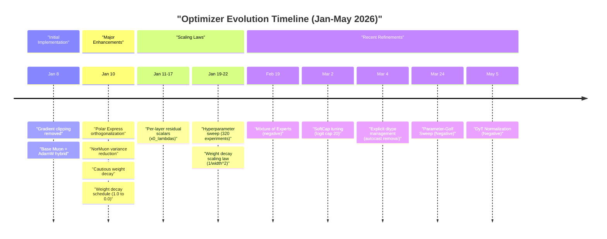
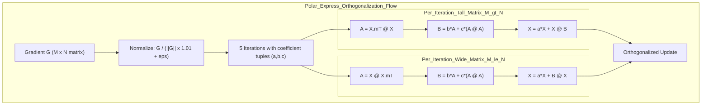
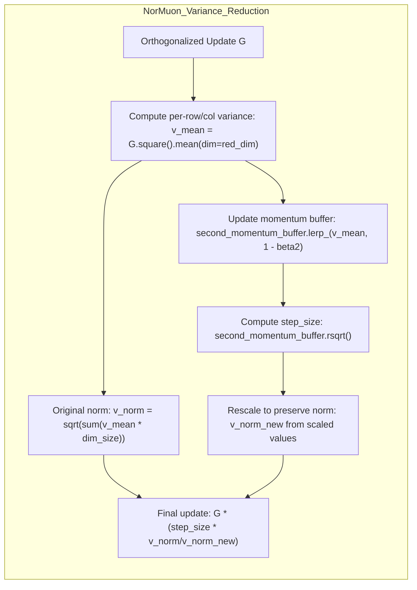
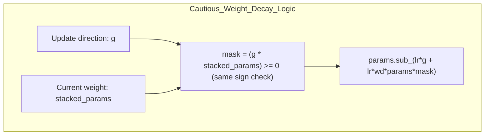
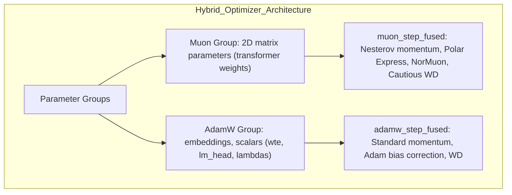

> [!WARNING]
> Imported from DeepWiki as generated, unverified repository documentation. Verify code-behavior claims against the revision below before stabilization.

# Optimizer Evolution and Ablations

Relevant source files

The following files were used as context for generating this wiki page:

- [dev/LOG.md](https://github.com/karpathy/nanochat/blob/92d63d4e8bb4df75c3b71618f31ddde2378b2bcd/dev/LOG.md)
- [nanochat/optim.py](https://github.com/karpathy/nanochat/blob/92d63d4e8bb4df75c3b71618f31ddde2378b2bcd/nanochat/optim.py)

## Purpose and Scope

This page chronicles the evolution of the `MuonAdamW` optimizer from its initial implementation to its current state, documenting major enhancements and ablation experiments. The focus is on algorithmic improvements to the Muon optimizer component (Polar Express, NorMuon, cautious weight decay) and hyperparameter tuning experiments, both successful and unsuccessful.

For the final optimizer architecture and usage in training, see [Optimization System](deepwiki-05-optimization-system.md). For hyperparameter scaling laws and auto-configuration, see [The Complexity Dial: Auto-Configuration System](deepwiki-03-02-the-complexity-dial-auto-configuration-system.md).

## Optimizer Evolution Timeline

The `MuonAdamW` optimizer evolved through several major enhancements from January to May 2026. Each enhancement was validated empirically before adoption.

**Sources:** [dev/LOG.md:1-963](https://github.com/karpathy/nanochat/blob/92d63d4e8bb4df75c3b71618f31ddde2378b2bcd/dev/LOG.md#L1-L963), [dev/LOG.md:7-17](https://github.com/karpathy/nanochat/blob/92d63d4e8bb4df75c3b71618f31ddde2378b2bcd/dev/LOG.md#L7-L17)

## Major Optimizer Enhancements

### Polar Express Orthogonalization

The original Muon implementation used Newton-Schulz iteration for orthogonalization. In January 2026, this was replaced with the "Polar Express Sign Method" from [Amsel et al., arXiv:2505.16932](https://arxiv.org/abs/2505.16932).

**Implementation Details:**

The Polar Express method uses 5 iterations with pre-computed coefficients optimized for convergence. The implementation in `muon_step_fused` [nanochat/optim.py:112-150](https://github.com/karpathy/nanochat/blob/92d63d4e8bb4df75c3b71618f31ddde2378b2bcd/nanochat/optim.py#L112-L150) handles both tall and wide matrices to ensure correct orthogonalization regardless of layer dimensions.

The coefficients are stored in `polar_express_coeffs` [nanochat/optim.py:102-108](https://github.com/karpathy/nanochat/blob/92d63d4e8bb4df75c3b71618f31ddde2378b2bcd/nanochat/optim.py#L102-L108) and computed for `num_iters=5`, `safety_factor=2e-2`, `cushion=2`.

**Sources:** [nanochat/optim.py:102-108](https://github.com/karpathy/nanochat/blob/92d63d4e8bb4df75c3b71618f31ddde2378b2bcd/nanochat/optim.py#L102-L108), [nanochat/optim.py:112-150](https://github.com/karpathy/nanochat/blob/92d63d4e8bb4df75c3b71618f31ddde2378b2bcd/nanochat/optim.py#L112-L150), [dev/LOG.md:889-900](https://github.com/karpathy/nanochat/blob/92d63d4e8bb4df75c3b71618f31ddde2378b2bcd/dev/LOG.md#L889-L900)

### NorMuon Variance Reduction

NorMuon adds per-neuron adaptive learning rates to normalize update scales after orthogonalization. The orthogonalization process produces non-uniform scales across neurons; NorMuon compensates by maintaining per-row or per-column variance estimates.

**Algorithm Flow:**

**Memory Overhead:** The `second_momentum_buffer` has shape `(12, 768, 1)` or `(12, 1, 3072)` [nanochat/optim.py:116](https://github.com/karpathy/nanochat/blob/92d63d4e8bb4df75c3b71618f31ddde2378b2bcd/nanochat/optim.py#L116), adding negligible memory per parameter compared to the full gradient buffer.

**Implementation:** The reduction dimension is chosen based on matrix shape [nanochat/optim.py:155-164](https://github.com/karpathy/nanochat/blob/92d63d4e8bb4df75c3b71618f31ddde2378b2bcd/nanochat/optim.py#L155-L164):
- **Tall matrices (rows > cols):** Reduce over columns (`red_dim = -1`), buffer shape `[..., rows, 1]` [nanochat/optim.py:159-160](https://github.com/karpathy/nanochat/blob/92d63d4e8bb4df75c3b71618f31ddde2378b2bcd/nanochat/optim.py#L159-L160)
- **Wide matrices (rows <= cols):** Reduce over rows (`red_dim = -2`), buffer shape `[..., 1, cols]` [nanochat/optim.py:163-164](https://github.com/karpathy/nanochat/blob/92d63d4e8bb4df75c3b71618f31ddde2378b2bcd/nanochat/optim.py#L163-L164)

**Sources:** [nanochat/optim.py:112-168](https://github.com/karpathy/nanochat/blob/92d63d4e8bb4df75c3b71618f31ddde2378b2bcd/nanochat/optim.py#L112-L168), [dev/LOG.md:901-907](https://github.com/karpathy/nanochat/blob/92d63d4e8bb4df75c3b71618f31ddde2378b2bcd/dev/LOG.md#L901-L907)

### Cautious Weight Decay

Standard weight decay always pulls parameters toward zero. Cautious weight decay only applies decay when the gradient and weight have the same sign (both pushing in the same direction).

**Motivation:** When a gradient is pushing a weight away from zero, standard weight decay fights against the gradient. Cautious decay only regularizes when it aligns with the optimization direction.

**Implementation Details:**

The implementation inline computes the mask during the update to avoid `torch.compile` recompilation issues [nanochat/optim.py:166-170](https://github.com/karpathy/nanochat/blob/92d63d4e8bb4df75c3b71618f31ddde2378b2bcd/nanochat/optim.py#L166-L170).

**Sources:** [nanochat/optim.py:166-170](https://github.com/karpathy/nanochat/blob/92d63d4e8bb4df75c3b71618f31ddde2378b2bcd/nanochat/optim.py#L166-L170), [dev/LOG.md:908-917](https://github.com/karpathy/nanochat/blob/92d63d4e8bb4df75c3b71618f31ddde2378b2bcd/dev/LOG.md#L908-L917)

## Negative Results and Failed Experiments

### DyT Normalization (May 5, 2026)

**Hypothesis:** Replacing standard normalization with Dynamic Transformation (DyT) could improve stability or performance.

**Implementation:**
- Used `gamma * tanh(alpha * x) + beta` with learnable scalar `alpha` [dev/LOG.md:11](https://github.com/karpathy/nanochat/blob/92d63d4e8bb4df75c3b71618f31ddde2378b2bcd/dev/LOG.md#L11).
- Added separate initializers for attention vs other sites [dev/LOG.md:12](https://github.com/karpathy/nanochat/blob/92d63d4e8bb4df75c3b71618f31ddde2378b2bcd/dev/LOG.md#L12).
- Included LLM-specific `sqrt(d_model)` embedding scale [dev/LOG.md:13](https://github.com/karpathy/nanochat/blob/92d63d4e8bb4df75c3b71618f31ddde2378b2bcd/dev/LOG.md#L13).

**Result:** Failed to outperform the baseline d12 model on master, even with extensive parameter tuning. Throughput was also ~10% lower [dev/LOG.md:15](https://github.com/karpathy/nanochat/blob/92d63d4e8bb4df75c3b71618f31ddde2378b2bcd/dev/LOG.md#L15).

**Sources:** [dev/LOG.md:7-17](https://github.com/karpathy/nanochat/blob/92d63d4e8bb4df75c3b71618f31ddde2378b2bcd/dev/LOG.md#L7-L17)

### Parameter-Golf Ideas Sweep (Mar 24, 2026)

A sweep of ideas from `openai/parameter-golf` was conducted to find cheap improvements to wall-clock time. Most were unsuccessful:

- **LeakyReLU(0.5)²**: Replaced `relu²` in MLP. Better per-step but slower wall-clock [dev/LOG.md:42-43](https://github.com/karpathy/nanochat/blob/92d63d4e8bb4df75c3b71618f31ddde2378b2bcd/dev/LOG.md#L42-L43).
- **Partial RoPE**: Applied rotary embeddings to only 1/4 of head dimension. Resulted in slightly worse performance [dev/LOG.md:47-48](https://github.com/karpathy/nanochat/blob/92d63d4e8bb4df75c3b71618f31ddde2378b2bcd/dev/LOG.md#L47-L48).
- **LN Scale**: Multiplied normalized input by `1/sqrt(layer_idx+1)`. No improvement [dev/LOG.md:49-51](https://github.com/karpathy/nanochat/blob/92d63d4e8bb4df75c3b71618f31ddde2378b2bcd/dev/LOG.md#L49-L51).
- **Orthogonal Init**: Switched non-zero matrices to orthogonal init. No improvement [dev/LOG.md:53-55](https://github.com/karpathy/nanochat/blob/92d63d4e8bb4df75c3b71618f31ddde2378b2bcd/dev/LOG.md#L53-L55).
- **Exclusive Self Attention (XSA)**: Projected against plain `v` path on deep layers. Better per-step but too slow for wall-clock [dev/LOG.md:57-59](https://github.com/karpathy/nanochat/blob/92d63d4e8bb4df75c3b71618f31ddde2378b2bcd/dev/LOG.md#L57-L59).

**Sources:** [dev/LOG.md:19-68](https://github.com/karpathy/nanochat/blob/92d63d4e8bb4df75c3b71618f31ddde2378b2bcd/dev/LOG.md#L19-L68)

### Mixture of Experts (Feb 19, 2026)

**Hypothesis:** A DeepSeekV3-style MoE layer could improve the Pareto frontier of performance vs compute.

**Implementation:**
- 8 routed experts, top-2 routing with sigmoid gating [dev/LOG.md:77-78](https://github.com/karpathy/nanochat/blob/92d63d4e8bb4df75c3b71618f31ddde2378b2bcd/dev/LOG.md#L77-L78).
- 1 shared expert processing all tokens [dev/LOG.md:78](https://github.com/karpathy/nanochat/blob/92d63d4e8bb4df75c3b71618f31ddde2378b2bcd/dev/LOG.md#L78).
- Used `torch._grouped_mm` for dispatching tokens to experts [dev/LOG.md:81](https://github.com/karpathy/nanochat/blob/92d63d4e8bb4df75c3b71618f31ddde2378b2bcd/dev/LOG.md#L81).

**Result:** While it improved per-step validation loss, it was not a net improvement on wall clock time due to MoE overhead at the GPT-2 scale [dev/LOG.md:71-72](https://github.com/karpathy/nanochat/blob/92d63d4e8bb4df75c3b71618f31ddde2378b2bcd/dev/LOG.md#L71-L72). `torch._grouped_mm` also lacked FP8 support, complicating precision management [dev/LOG.md:94-96](https://github.com/karpathy/nanochat/blob/92d63d4e8bb4df75c3b71618f31ddde2378b2bcd/dev/LOG.md#L94-L96).

**Sources:** [dev/LOG.md:69-96](https://github.com/karpathy/nanochat/blob/92d63d4e8bb4df75c3b71618f31ddde2378b2bcd/dev/LOG.md#L69-L96)

### Hyperball/MuonH Optimization (Jan 29, 2026)

**Hypothesis:** Constraining weights to a hypersphere of fixed radius might improve optimization by preventing magnitude drift.

**Method:** Implemented Hyperball optimization [dev/LOG.md:258-261](https://github.com/karpathy/nanochat/blob/92d63d4e8bb4df75c3b71618f31ddde2378b2bcd/dev/LOG.md#L258-L261).

**Result:** Abandoned. It performed worse than the baseline Muon across multiple experiments, including LR sweeps and learnable RMSNorm scales [dev/LOG.md:263-273](https://github.com/karpathy/nanochat/blob/92d63d4e8bb4df75c3b71618f31ddde2378b2bcd/dev/LOG.md#L263-L273).

**Sources:** [dev/LOG.md:258-276](https://github.com/karpathy/nanochat/blob/92d63d4e8bb4df75c3b71618f31ddde2378b2bcd/dev/LOG.md#L258-L276)

### Gradient Clipping Removal (Jan 8, 2026)

**Hypothesis:** Gradient clipping may be unnecessary overhead if gradients are naturally well-behaved.

**Results:**
- No benefit at any scale (d12, d20) [dev/LOG.md:951](https://github.com/karpathy/nanochat/blob/92d63d4e8bb4df75c3b71618f31ddde2378b2bcd/dev/LOG.md#L951).
- Gradient norm never exceeds 1.0 naturally [dev/LOG.md:954](https://github.com/karpathy/nanochat/blob/92d63d4e8bb4df75c3b71618f31ddde2378b2bcd/dev/LOG.md#L954).
- Clipping adds ~2% time overhead from all-reduce [dev/LOG.md:955](https://github.com/karpathy/nanochat/blob/92d63d4e8bb4df75c3b71618f31ddde2378b2bcd/dev/LOG.md#L955).

**Result:** All gradient clipping code deleted to improve MFU [dev/LOG.md:963](https://github.com/karpathy/nanochat/blob/92d63d4e8bb4df75c3b71618f31ddde2378b2bcd/dev/LOG.md#L963).

**Sources:** [dev/LOG.md:948-963](https://github.com/karpathy/nanochat/blob/92d63d4e8bb4df75c3b71618f31ddde2378b2bcd/dev/LOG.md#L948-L963)

## Hyperparameter Sweep Results

A comprehensive sweep of ~320 experiments across d12 → d16 → d20 explored optimal optimizer hyperparameters [dev/LOG.md:419-421](https://github.com/karpathy/nanochat/blob/92d63d4e8bb4df75c3b71618f31ddde2378b2bcd/dev/LOG.md#L419-L421).

### Weight Decay Scaling Law: WD ∝ 1/width²

Experiments revealed that optimal weight decay scales inversely with the square of model width [dev/LOG.md:919-944](https://github.com/karpathy/nanochat/blob/92d63d4e8bb4df75c3b71618f31ddde2378b2bcd/dev/LOG.md#L919-L944):

| Depth | Width (channels) | Optimal WD |
|-------|------------------|------------|
| d8    | 512              | 0.40       |
| d12   | 768              | 0.22       |
| d16   | 1024             | 0.10       |
| d20   | 1280             | 0.08       |

**Sources:** [dev/LOG.md:919-944](https://github.com/karpathy/nanochat/blob/92d63d4e8bb4df75c3b71618f31ddde2378b2bcd/dev/LOG.md#L919-L944)

### Per-Layer Scalar Tuning (x0_lambdas)

**Finding:** Adding momentum to the residual connection scalars (`x0_lambdas`) provided small but consistent gains [dev/LOG.md:424-427](https://github.com/karpathy/nanochat/blob/92d63d4e8bb4df75c3b71618f31ddde2378b2bcd/dev/LOG.md#L424-L427).

**x0_beta1 Sweep at d20:**
- **0.96** was found to be the optimal value, yielding a -0.0007 val/bpb improvement [dev/LOG.md:444](https://github.com/karpathy/nanochat/blob/92d63d4e8bb4df75c3b71618f31ddde2378b2bcd/dev/LOG.md#L444).
- Values above 0.97 led to sharp performance cliffs [dev/LOG.md:445-446](https://github.com/karpathy/nanochat/blob/92d63d4e8bb4df75c3b71618f31ddde2378b2bcd/dev/LOG.md#L445-L446).

**Sources:** [dev/LOG.md:419-474](https://github.com/karpathy/nanochat/blob/92d63d4e8bb4df75c3b71618f31ddde2378b2bcd/dev/LOG.md#L419-L474)

## Final Optimizer Architecture

The `MuonAdamW` and `DistMuonAdamW` classes implement the hybrid optimizer with all enhancements.

### Class Hierarchy

**`MuonAdamW` [nanochat/optim.py:174](https://github.com/karpathy/nanochat/blob/92d63d4e8bb4df75c3b71618f31ddde2378b2bcd/nanochat/optim.py#L174):** Single-GPU reference implementation.
**`DistMuonAdamW` [nanochat/optim.py:319](https://github.com/karpathy/nanochat/blob/92d63d4e8bb4df75c3b71618f31ddde2378b2bcd/nanochat/optim.py#L319):** Multi-GPU distributed implementation using ZeRO-2 style sharding and async communication [nanochat/optim.py:470-532](https://github.com/karpathy/nanochat/blob/92d63d4e8bb4df75c3b71618f31ddde2378b2bcd/nanochat/optim.py#L470-L532).

**Sources:** [nanochat/optim.py:174-556](https://github.com/karpathy/nanochat/blob/92d63d4e8bb4df75c3b71618f31ddde2378b2bcd/nanochat/optim.py#L174-L556)
