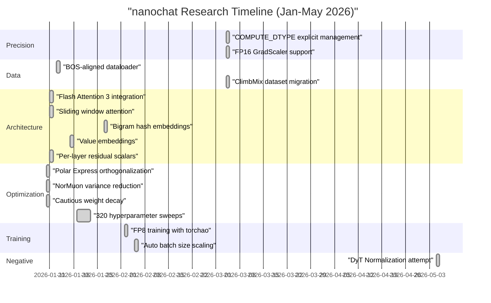
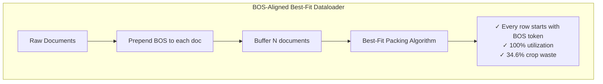
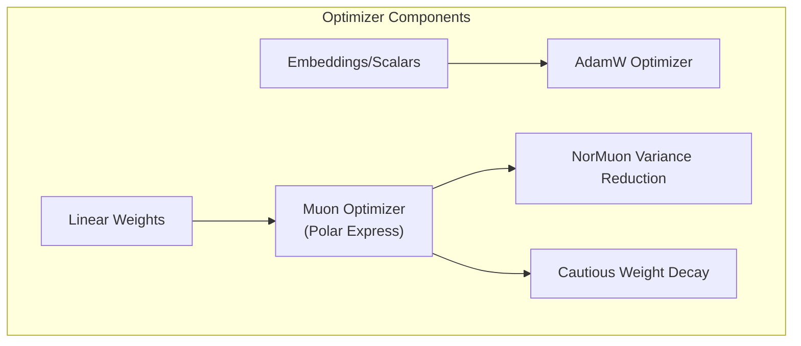

> [!WARNING]
> Imported from DeepWiki as generated, unverified repository documentation. Verify code-behavior claims against the revision below before stabilization.

# Research and Development

Relevant source files

The following files were used as context for generating this wiki page:

- [dev/LOG.md](https://github.com/karpathy/nanochat/blob/92d63d4e8bb4df75c3b71618f31ddde2378b2bcd/dev/LOG.md)

This page documents the experimental research process behind nanochat's design decisions, primarily captured in [dev/LOG.md](https://github.com/karpathy/nanochat/blob/92d63d4e8bb4df75c3b71618f31ddde2378b2bcd/dev/LOG.md). The experiment log tracks over 6 months of development (Jan-May 2026) with over 320 hyperparameter sweeps, architectural experiments, and optimization iterations that shaped the current codebase.

For information about the final training pipeline execution, see [Getting Started](deepwiki-02-getting-started.md). For details on the production model architecture, see [Model Architecture](deepwiki-04-model-architecture.md). For the optimization system implementation, see [Optimization System](deepwiki-05-optimization-system.md).

---

## 12.1 Experiment Log and Design History

The development log in [dev/LOG.md:1-1025](https://github.com/karpathy/nanochat/blob/92d63d4e8bb4df75c3b71618f31ddde2378b2bcd/dev/LOG.md#L1-L1025) chronicles the iterative research process that produced nanochat's current capabilities. Major milestones include precision management overhaul, dataset migration to ClimbMix, dataloader redesign, and Flash Attention 3 integration.

### Major System Evolution Timeline

**Sources:** [dev/LOG.md:1-1025](https://github.com/karpathy/nanochat/blob/92d63d4e8bb4df75c3b71618f31ddde2378b2bcd/dev/LOG.md#L1-L1025)

### COMPUTE_DTYPE Precision Management

One of the most significant architectural changes was replacing `torch.amp.autocast` with explicit dtype management via a single global `COMPUTE_DTYPE` [dev/LOG.md:72-74](https://github.com/karpathy/nanochat/blob/92d63d4e8bb4df75c3b71618f31ddde2378b2bcd/dev/LOG.md#L72-L74). This eliminated the "magic" of autocast's internal allowlists and provided fine-grained control over precision.

**Implementation:**
- [nanochat/common.py:18-22](https://github.com/karpathy/nanochat/blob/92d63d4e8bb4df75c3b71618f31ddde2378b2bcd/nanochat/common.py#L18-L22) defines `COMPUTE_DTYPE` with auto-detection (SM 80+ → bf16, else fp32).
- [nanochat/gpt.py:112-115](https://github.com/karpathy/nanochat/blob/92d63d4e8bb4df75c3b71618f31ddde2378b2bcd/nanochat/gpt.py#L112-L115) implements a custom `Linear` class that casts weights to match input dtype: `F.linear(x, self.weight.to(dtype=x.dtype))`.
- [scripts/base_train.py:228-232](https://github.com/karpathy/nanochat/blob/92d63d4e8bb4df75c3b71618f31ddde2378b2bcd/scripts/base_train.py#L228-L232) and [scripts/chat_sft.py:214-218](https://github.com/karpathy/nanochat/blob/92d63d4e8bb4df75c3b71618f31ddde2378b2bcd/scripts/chat_sft.py#L214-L218) add `GradScaler` support specifically for fp16 training.

**Key findings from [dev/LOG.md:72-105](https://github.com/karpathy/nanochat/blob/92d63d4e8bb4df75c3b71618f31ddde2378b2bcd/dev/LOG.md#L72-L105):**
- Autocast was redundant for most ops (RMSNorm, CrossEntropy, Flash Attention) which handle their own dtypes [dev/LOG.md:78-79](https://github.com/karpathy/nanochat/blob/92d63d4e8bb4df75c3b71618f31ddde2378b2bcd/dev/LOG.md#L78-L79).
- Custom `Linear` class provides identical functionality with explicit control [dev/LOG.md:82-84](https://github.com/karpathy/nanochat/blob/92d63d4e8bb4df75c3b71618f31ddde2378b2bcd/dev/LOG.md#L82-L84).
- FP16 training requires `GradScaler` with distributed inf-sync via `all_reduce` with `ReduceOp.MAX` [dev/LOG.md:95-95](https://github.com/karpathy/nanochat/blob/92d63d4e8bb4df75c3b71618f31ddde2378b2bcd/dev/LOG.md#L95-L95).

**Sources:** [dev/LOG.md:72-105](https://github.com/karpathy/nanochat/blob/92d63d4e8bb4df75c3b71618f31ddde2378b2bcd/dev/LOG.md#L72-L105), [nanochat/common.py:18-22](https://github.com/karpathy/nanochat/blob/92d63d4e8bb4df75c3b71618f31ddde2378b2bcd/nanochat/common.py#L18-L22), [nanochat/gpt.py:112-115](https://github.com/karpathy/nanochat/blob/92d63d4e8bb4df75c3b71618f31ddde2378b2bcd/nanochat/gpt.py#L112-L115), [scripts/base_train.py:228-232](https://github.com/karpathy/nanochat/blob/92d63d4e8bb4df75c3b71618f31ddde2378b2bcd/scripts/base_train.py#L228-L232)

### Dataset Migration: FineWeb-EDU → ClimbMix

The most impactful single change to speedrun time was migrating from FineWeb-EDU 100B to ClimbMix 400B on 2026-03-04, reducing training time from 2h 46m to 2h 1m (**27% reduction**) [dev/LOG.md:107-109](https://github.com/karpathy/nanochat/blob/92d63d4e8bb4df75c3b71618f31ddde2378b2bcd/dev/LOG.md#L107-L109).

**Changes made:**
- **Dataset:** Switched to `karpathy/climbmix-400b-shuffle` [dev/LOG.md:111-113](https://github.com/karpathy/nanochat/blob/92d63d4e8bb4df75c3b71618f31ddde2378b2bcd/dev/LOG.md#L111-L113).
- **Model depth:** Reduced from d26 to d24 as ClimbMix trains more efficiently [dev/LOG.md:119-119](https://github.com/karpathy/nanochat/blob/92d63d4e8bb4df75c3b71618f31ddde2378b2bcd/dev/LOG.md#L119-L119).
- **Validation:** Doubled evaluation tokens from 40 to 80 batches for stability [dev/LOG.md:121-121](https://github.com/karpathy/nanochat/blob/92d63d4e8bb4df75c3b71618f31ddde2378b2bcd/dev/LOG.md#L121-L121).

**Sources:** [dev/LOG.md:107-124](https://github.com/karpathy/nanochat/blob/92d63d4e8bb4df75c3b71618f31ddde2378b2bcd/dev/LOG.md#L107-L124), [nanochat/dataset.py:116-148](https://github.com/karpathy/nanochat/blob/92d63d4e8bb4df75c3b71618f31ddde2378b2bcd/nanochat/dataset.py#L116-L148)

### BOS-Aligned Dataloader with Best-Fit Packing

The dataloader redesign ensured every training sequence starts with a BOS token, preventing the model from training on confusing mid-document tokens [dev/LOG.md:680-682](https://github.com/karpathy/nanochat/blob/92d63d4e8bb4df75c3b71618f31ddde2378b2bcd/dev/LOG.md#L680-L682).

**Implementation:** [nanochat/dataloader.py:175-230](https://github.com/karpathy/nanochat/blob/92d63d4e8bb4df75c3b71618f31ddde2378b2bcd/nanochat/dataloader.py#L175-L230) implements `tokenizing_distributed_data_loader_bos_bestfit()`. It uses a "BestFit-Crop" algorithm that buffers documents and picks the largest that fits entirely before cropping a document to fill the remaining space exactly [dev/LOG.md:710-720](https://github.com/karpathy/nanochat/blob/92d63d4e8bb4df75c3b71618f31ddde2378b2bcd/dev/LOG.md#L710-L720).

**Sources:** [dev/LOG.md:680-742](https://github.com/karpathy/nanochat/blob/92d63d4e8bb4df75c3b71618f31ddde2378b2bcd/dev/LOG.md#L680-L742), [nanochat/dataloader.py:175-230](https://github.com/karpathy/nanochat/blob/92d63d4e8bb4df75c3b71618f31ddde2378b2bcd/nanochat/dataloader.py#L175-L230)

For more details on the iterative development process, negative results, and architectural evolution, see [Experiment Log and Design History](deepwiki-12-01-experiment-log-and-design-history.md).

---

## 12.2 Optimizer Evolution and Ablations

The optimizer evolved from basic implementations to a sophisticated hybrid system through systematic experimentation.

### Optimizer Architecture Evolution

**Key Improvements:**
- **Polar Express:** Replaced Newton-Schulz with a 5-coefficient sign method for orthogonalization [dev/LOG.md:957-961](https://github.com/karpathy/nanochat/blob/92d63d4e8bb4df75c3b71618f31ddde2378b2bcd/dev/LOG.md#L957-L961).
- **NorMuon:** Added per-neuron adaptive LR using a `second_momentum_buffer` [dev/LOG.md:963-967](https://github.com/karpathy/nanochat/blob/92d63d4e8bb4df75c3b71618f31ddde2378b2bcd/dev/LOG.md#L963-L967).
- **Cautious WD:** Only decays weights where the update and weight have the same sign [dev/LOG.md:970-975](https://github.com/karpathy/nanochat/blob/92d63d4e8bb4df75c3b71618f31ddde2378b2bcd/dev/LOG.md#L970-L975).

**Sources:** [dev/LOG.md:950-1007](https://github.com/karpathy/nanochat/blob/92d63d4e8bb4df75c3b71618f31ddde2378b2bcd/dev/LOG.md#L950-L1007), [nanochat/optim.py:284-350](https://github.com/karpathy/nanochat/blob/92d63d4e8bb4df75c3b71618f31ddde2378b2bcd/nanochat/optim.py#L284-L350)

For documentation on optimizer experiments including failed attempts like Hyperball and per-layer scalar tuning, see [Optimizer Evolution and Ablations](deepwiki-12-02-optimizer-evolution-and-ablations.md).

---

## 12.3 Architecture Experiments and Negative Results

Nanochat is the result of many "failed" experiments that informed the final lean architecture.

### Critical Negative Results

| Experiment | Status | Result/Reason | Log Entry |
|------------|--------|---------------|-----------|
| **DyT Normalization** | ❌ Rejected | Net worse on wall clock; 10% lower throughput vs master | [dev/LOG.md:7-15](https://github.com/karpathy/nanochat/blob/92d63d4e8bb4df75c3b71618f31ddde2378b2bcd/dev/LOG.md#L7-L15) |
| **Mixture of Experts (MoE)** | ❌ Rejected | Dispatch overhead via `torch._grouped_mm` regressed MFU from 35% to 33% | [dev/LOG.md:122-124](https://github.com/karpathy/nanochat/blob/92d63d4e8bb4df75c3b71618f31ddde2378b2bcd/dev/LOG.md#L122-L124) |
| **SwiGLU** | ❌ Rejected | Worse on step efficiency and wall clock vs ReLU² at our scale | [dev/LOG.md:208-230](https://github.com/karpathy/nanochat/blob/92d63d4e8bb4df75c3b71618f31ddde2378b2bcd/dev/LOG.md#L208-L230) |
| **Multi-token prediction** | ❌ Rejected | +13GB memory overhead with no net wall-clock gain | [dev/LOG.md:820-842](https://github.com/karpathy/nanochat/blob/92d63d4e8bb4df75c3b71618f31ddde2378b2bcd/dev/LOG.md#L820-L842) |
| **LeakyReLU(0.5)²** | ❌ Rejected | Slightly better quality but slower; net worse on wall clock | [dev/LOG.md:41-43](https://github.com/karpathy/nanochat/blob/92d63d4e8bb4df75c3b71618f31ddde2378b2bcd/dev/LOG.md#L41-L43) |
| **SoftCap tuning** | ✅ Default | Tuned logit softcap; 20 was found to be the optimal value [dev/LOG.md:118-121](https://github.com/karpathy/nanochat/blob/92d63d4e8bb4df75c3b71618f31ddde2378b2bcd/dev/LOG.md#L118-L121) |

### Scaling Laws Research

The "complexity dial" (controlled by `--depth`) was derived from extensive scaling law sweeps [runs/scaling_laws.sh:1-127](https://github.com/karpathy/nanochat/blob/92d63d4e8bb4df75c3b71618f31ddde2378b2bcd/runs/scaling_laws.sh#L1-L127). Analysis of these sweeps is performed in dev/scaling_analysis.ipynb.

- **Batch Size:** Follows `Bopt ∝ D^0.383` [dev/LOG.md:159-206](https://github.com/karpathy/nanochat/blob/92d63d4e8bb4df75c3b71618f31ddde2378b2bcd/dev/LOG.md#L159-L206).
- **Weight Decay:** Follows `WD ∝ 1/width²` [dev/LOG.md:982-1005](https://github.com/karpathy/nanochat/blob/92d63d4e8bb4df75c3b71618f31ddde2378b2bcd/dev/LOG.md#L982-L1005).
- **Tokens/Params:** Settled on a Kaplan-style ratio of ~10.5 [scripts/base_train.py:165-210](https://github.com/karpathy/nanochat/blob/92d63d4e8bb4df75c3b71618f31ddde2378b2bcd/scripts/base_train.py#L165-L210).

**Sources:** [dev/LOG.md:7-58](https://github.com/karpathy/nanochat/blob/92d63d4e8bb4df75c3b71618f31ddde2378b2bcd/dev/LOG.md#L7-L58), [runs/scaling_laws.sh:1-127](https://github.com/karpathy/nanochat/blob/92d63d4e8bb4df75c3b71618f31ddde2378b2bcd/runs/scaling_laws.sh#L1-L127), [scripts/base_train.py:165-210](https://github.com/karpathy/nanochat/blob/92d63d4e8bb4df75c3b71618f31ddde2378b2bcd/scripts/base_train.py#L165-L210), dev/scaling_analysis.ipynb:1-175

For details on what didn't work and the lessons learned from architectural experiments, see [Architecture Experiments and Negative Results](deepwiki-12-03-architecture-experiments-and-negative-results.md).
