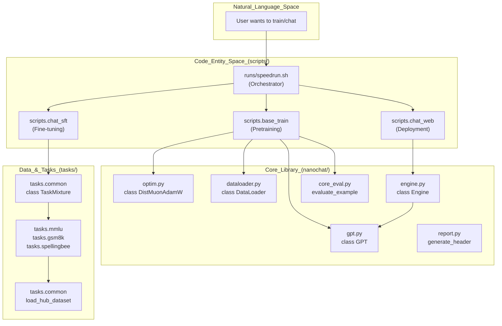
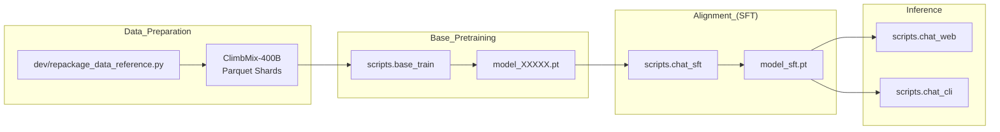

> [!WARNING]
> Imported from DeepWiki as generated, unverified repository documentation. Verify code-behavior claims against the revision below before stabilization.

# Repository Structure

Relevant source files

The following files were used as context for generating this wiki page:

- .gitignore
- [README.md](https://github.com/karpathy/nanochat/blob/92d63d4e8bb4df75c3b71618f31ddde2378b2bcd/README.md)

This document outlines the directory layout and organization of the `nanochat` codebase. It describes the purpose of each top-level directory and the key files within them, providing a map for navigating the repository.

---

## Directory Overview

The `nanochat` repository follows a clear separation between library code, executable scripts, training workflows, dataset implementations, and development artifacts.

| Directory | Purpose | Key Contents |
|:---|:---|:---|
| `nanochat/` | Core library modules | `gpt.py`, `optim.py`, `dataloader.py`, `engine.py`, `core_eval.py`, `report.py` |
| `scripts/` | Executable entry points | `base_train.py`, `chat_sft.py`, `chat_web.py`, `chat_cli.py` |
| `tasks/` | Dataset and task implementations | `mmlu.py`, `gsm8k.py`, `spellingbee.py`, `common.py` |
| `runs/` | Complete training workflows | `speedrun.sh`, `miniseries.sh`, `scaling_laws.sh` |
| `dev/` | Research artifacts and utilities | `LOG.md`, `LEADERBOARD.md`, `nanochat.png` |
| `tests/` | Test suite | `test_engine.py`, `test_dataloader.py` |

**Sources:** [README.md:12-22](https://github.com/karpathy/nanochat/blob/92d63d4e8bb4df75c3b71618f31ddde2378b2bcd/README.md#L12-L22), [README.md:32-44](https://github.com/karpathy/nanochat/blob/92d63d4e8bb4df75c3b71618f31ddde2378b2bcd/README.md#L32-L44), [README.md:48-60](https://github.com/karpathy/nanochat/blob/92d63d4e8bb4df75c3b71618f31ddde2378b2bcd/README.md#L48-L60)

---

## Repository Structure Diagram

The following diagram bridges the high-level functional stages of the LLM lifecycle to the specific code entities and scripts responsible for them.

Title: System Architecture and Entity Mapping

**Sources:** [README.md:48-52](https://github.com/karpathy/nanochat/blob/92d63d4e8bb4df75c3b71618f31ddde2378b2bcd/README.md#L48-L52), [tasks/common.py:45-51](https://github.com/karpathy/nanochat/blob/92d63d4e8bb4df75c3b71618f31ddde2378b2bcd/tasks/common.py#L45-L51), [tasks/common.py:129-135](https://github.com/karpathy/nanochat/blob/92d63d4e8bb4df75c3b71618f31ddde2378b2bcd/tasks/common.py#L129-L135)

---

## Core Library Directory (`nanochat/`)

The `nanochat/` directory contains the foundational building blocks. These modules are imported by training and inference scripts.

| Module | Purpose | Key Implementation Details |
|:---|:---|:---|
| `gpt.py` | Model Architecture | Implements `class GPT` with `class TransformerBlock`. Includes `class GPTConfig` for hyperparameter scaling. |
| `optim.py` | Optimization | Implements `class MuonAdamW` and `class DistMuonAdamW` for distributed matrix optimization. |
| `dataloader.py` | Data Ingestion | Implements `class DataLoader` using a best-fit packing algorithm for 100% token utilization. |
| `engine.py` | Inference | Implements `class Engine` with `class KVCache` for autoregressive decoding. |
| `core_eval.py` | Evaluation | Functions like `evaluate_example` and `render_prompts_mc` for DCLM CORE metrics. |
| `report.py` | Diagnostics | Utilities for generating training report cards, including git info, GPU stats, and "bloat" metrics. |
| `common.py` | Infrastructure | Shared utilities: `compute_init()`, `print0()`, and `COMPUTE_DTYPE` selection. |

**Sources:** [tasks/common.py:18-18](https://github.com/karpathy/nanochat/blob/92d63d4e8bb4df75c3b71618f31ddde2378b2bcd/tasks/common.py#L18-L18), [README.md:88-98](https://github.com/karpathy/nanochat/blob/92d63d4e8bb4df75c3b71618f31ddde2378b2bcd/README.md#L88-L98)

---

## Scripts Directory (`scripts/`)

The `scripts/` directory contains the main entry points for the different stages of the LLM pipeline. These are typically executed via `torchrun` or `python -m`.

### Training Pipeline Flow

This diagram illustrates how data flows through the different scripts during a full training run, starting from raw dataset preparation to a deployable chat interface.

Title: Data Flow from Pretraining to Inference

**Sources:** [README.md:48-58](https://github.com/karpathy/nanochat/blob/92d63d4e8bb4df75c3b71618f31ddde2378b2bcd/README.md#L48-L58), [README.md:12-22](https://github.com/karpathy/nanochat/blob/92d63d4e8bb4df75c3b71618f31ddde2378b2bcd/README.md#L12-L22)

---

## Development and Research (`dev/`)

The `dev/` directory is the research hub of the project, containing documentation of the iterative development process and assets.

*   **`LOG.md`**: A chronological record of architectural changes, hyperparameter sweeps, and "negative results" (what didn't work). [README.md:100-103](https://github.com/karpathy/nanochat/blob/92d63d4e8bb4df75c3b71618f31ddde2378b2bcd/README.md#L100-L103)
*   **`LEADERBOARD.md`**: Detailed instructions on how to participate in the "Time-to-GPT-2" challenge and reference metrics. [README.md:26-26](https://github.com/karpathy/nanochat/blob/92d63d4e8bb4df75c3b71618f31ddde2378b2bcd/README.md#L26-L26)
*   **`nanochat.png`**: The project logo. [README.md:3-3](https://github.com/karpathy/nanochat/blob/92d63d4e8bb4df75c3b71618f31ddde2378b2bcd/README.md#L3-L3)
*   **`scaling_laws_jan26.png`**: Visual representation of the scaling laws used to calculate hyperparameters based on model depth. [README.md:4-6](https://github.com/karpathy/nanochat/blob/92d63d4e8bb4df75c3b71618f31ddde2378b2bcd/README.md#L4-L6)

**Sources:** [README.md:26-26](https://github.com/karpathy/nanochat/blob/92d63d4e8bb4df75c3b71618f31ddde2378b2bcd/README.md#L26-L26), [README.md:100-103](https://github.com/karpathy/nanochat/blob/92d63d4e8bb4df75c3b71618f31ddde2378b2bcd/README.md#L100-L103)

---

## Task Implementation (`tasks/`)

The `tasks/` directory contains the logic for supervised fine-tuning and evaluation tasks.

*   **`tasks/common.py`**: Defines the base `Task` class [tasks/common.py:85-90](https://github.com/karpathy/nanochat/blob/92d63d4e8bb4df75c3b71618f31ddde2378b2bcd/tasks/common.py#L85-L90), the `TaskMixture` utility [tasks/common.py:129-135](https://github.com/karpathy/nanochat/blob/92d63d4e8bb4df75c3b71618f31ddde2378b2bcd/tasks/common.py#L129-L135) used to blend different data sources, and the `HubDataset` [tasks/common.py:21-25](https://github.com/karpathy/nanochat/blob/92d63d4e8bb4df75c3b71618f31ddde2378b2bcd/tasks/common.py#L21-L25) wrapper for HuggingFace parquet exports.
*   **`tasks/common.py` Implementation**: Includes `load_hub_dataset` [tasks/common.py:45-51](https://github.com/karpathy/nanochat/blob/92d63d4e8bb4df75c3b71618f31ddde2378b2bcd/tasks/common.py#L45-L51) which uses `FileLock` [tasks/common.py:59-59](https://github.com/karpathy/nanochat/blob/92d63d4e8bb4df75c3b71618f31ddde2378b2bcd/tasks/common.py#L59-L59) to handle multi-process downloads safely under `torchrun`.
*   **`tasks/mmlu.py`**: Implements the MMLU dataset task for categorical evaluation.
*   **`tasks/gsm8k.py`**: Implements the GSM8K math benchmark, including handling of tool calls.
*   **`tasks/spellingbee.py`**: Implements tasks designed to improve model spelling and counting.
*   **`tasks/customjson.py`**: Allows loading conversations from custom JSONL files, often used for identity conversations.

**Sources:** [tasks/common.py:21-82](https://github.com/karpathy/nanochat/blob/92d63d4e8bb4df75c3b71618f31ddde2378b2bcd/tasks/common.py#L21-L82), [tasks/common.py:129-150](https://github.com/karpathy/nanochat/blob/92d63d4e8bb4df75c3b71618f31ddde2378b2bcd/tasks/common.py#L129-L150)

---

## Key Files in Root

*   **`pyproject.toml`**: Manages dependencies via `uv`. It includes specific configurations for `torch`, `tiktoken`, and hardware-specific extras like `gpu` (for CUDA) and `cpu`. [README.md:32-44](https://github.com/karpathy/nanochat/blob/92d63d4e8bb4df75c3b71618f31ddde2378b2bcd/README.md#L32-L44)
*   **`README.md`**: The primary entry point for the project, containing the "Time-to-GPT-2" leaderboard and quick-start instructions. [README.md:1-24](https://github.com/karpathy/nanochat/blob/92d63d4e8bb4df75c3b71618f31ddde2378b2bcd/README.md#L1-L24)
*   **`uv.lock`**: The lockfile for deterministic dependency resolution.
*   **`.gitignore`**: Specifies files and directories to be ignored by version control, such as `.venv/`, `__pycache__/`, `wandb/`, and `eval_bundle/`. .gitignore:1-14

**Sources:** [README.md:1-44](https://github.com/karpathy/nanochat/blob/92d63d4e8bb4df75c3b71618f31ddde2378b2bcd/README.md#L1-L44), .gitignore:1-14
