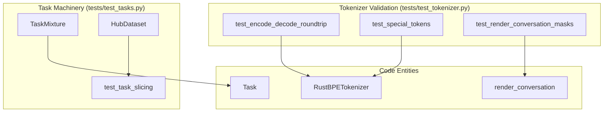
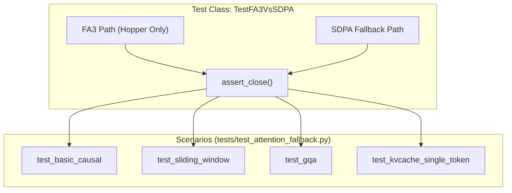

> [!WARNING]
> Imported from DeepWiki as generated, unverified repository documentation. Verify code-behavior claims against the revision below before stabilization.

# Testing and Validation

<details>
<summary>Relevant source files</summary>

The following files were used as context for generating this wiki page:

- [nanochat/engine.py](https://github.com/karpathy/nanochat/blob/92d63d4e8bb4df75c3b71618f31ddde2378b2bcd/nanochat/engine.py)
- [nanochat/flash_attention.py](https://github.com/karpathy/nanochat/blob/92d63d4e8bb4df75c3b71618f31ddde2378b2bcd/nanochat/flash_attention.py)
- [nanochat/fp8.py](https://github.com/karpathy/nanochat/blob/92d63d4e8bb4df75c3b71618f31ddde2378b2bcd/nanochat/fp8.py)
- [tests/test_attention_fallback.py](https://github.com/karpathy/nanochat/blob/92d63d4e8bb4df75c3b71618f31ddde2378b2bcd/tests/test_attention_fallback.py)
- [tests/test_engine.py](https://github.com/karpathy/nanochat/blob/92d63d4e8bb4df75c3b71618f31ddde2378b2bcd/tests/test_engine.py)
- [tests/test_execution.py](https://github.com/karpathy/nanochat/blob/92d63d4e8bb4df75c3b71618f31ddde2378b2bcd/tests/test_execution.py)
- [tests/test_optim.py](https://github.com/karpathy/nanochat/blob/92d63d4e8bb4df75c3b71618f31ddde2378b2bcd/tests/test_optim.py)
- [tests/test_tasks.py](https://github.com/karpathy/nanochat/blob/92d63d4e8bb4df75c3b71618f31ddde2378b2bcd/tests/test_tasks.py)
- [tests/test_tokenizer.py](https://github.com/karpathy/nanochat/blob/92d63d4e8bb4df75c3b71618f31ddde2378b2bcd/tests/test_tokenizer.py)

</details>


This page documents the testing infrastructure and validation workflows used in nanochat. The project employs a layered validation strategy: (1) **unit tests** for critical inference components, (2) **integration tests** for model equivalence and optimizer behavior, and (3) **evaluation-based validation** through the CORE metric and sandboxed execution tests. Testing focuses on the inference engine, attention mechanisms, and the custom optimizer, ensuring high-performance kernels and fallback paths remain numerically consistent.

## Testing Infrastructure

The project uses `pytest` as its test framework, configured through `pyproject.toml`. Tests are organized in the `tests/` directory and follow standard discovery patterns [pyproject.toml:31-34](https://github.com/karpathy/nanochat/blob/92d63d4e8bb4df75c3b71618f31ddde2378b2bcd/pyproject.toml#L31-L34).

### Pytest Configuration

The configuration defines markers and discovery rules to balance speed and coverage:

| Setting | Value | Purpose |
|---------|-------|---------|
| `testpaths` | `["tests"]` | Root directory for test discovery [pyproject.toml:31](https://github.com/karpathy/nanochat/blob/92d63d4e8bb4df75c3b71618f31ddde2378b2bcd/pyproject.toml#L31) |
| `python_files` | `test_*.py` | Pattern for test modules [pyproject.toml:32](https://github.com/karpathy/nanochat/blob/92d63d4e8bb4df75c3b71618f31ddde2378b2bcd/pyproject.toml#L32) |
| `markers` | `slow` | Mark expensive tests (e.g., long generations) [pyproject.toml:28-30](https://github.com/karpathy/nanochat/blob/92d63d4e8bb4df75c3b71618f31ddde2378b2bcd/pyproject.toml#L28-L30) |

The `slow` marker allows developers to skip time-intensive tests during rapid iteration using `pytest -m "not slow"`. This is essential when testing non-critical paths where fast feedback is prioritized.

### Running Tests

Tests are executed using standard commands:

```bash
# Run all tests
python -m pytest tests/ -v

# Skip slow tests
python -m pytest -m "not slow" -v

# Run specific test file
python -m pytest tests/test_engine.py -v
```

The test suite is included in the `dev` dependency group [pyproject.toml:20-25](https://github.com/karpathy/nanochat/blob/92d63d4e8bb4df75c3b71618f31ddde2378b2bcd/pyproject.toml#L20-L25), allowing installation via `uv sync --group dev`.

**Sources:** [pyproject.toml:20-34](https://github.com/karpathy/nanochat/blob/92d63d4e8bb4df75c3b71618f31ddde2378b2bcd/pyproject.toml#L20-L34)

## Unit Test Coverage

Unit testing focuses on the `Engine`, `flash_attention`, `optim`, and `tokenizer` modules, which handle complex state management and hardware-specific optimizations.

### Engine and KV Cache Validation

The `Engine` [nanochat/engine.py:169](https://github.com/karpathy/nanochat/blob/92d63d4e8bb4df75c3b71618f31ddde2378b2bcd/nanochat/engine.py#L169) and `KVCache` [nanochat/engine.py:82](https://github.com/karpathy/nanochat/blob/92d63d4e8bb4df75c3b71618f31ddde2378b2bcd/nanochat/engine.py#L82) are tested to ensure correctness of the two-phase generation (prefill/decode) and state management.

- **KV Cache State**: `test_kv_cache_basic` [tests/test_engine.py:84-121](https://github.com/karpathy/nanochat/blob/92d63d4e8bb4df75c3b71618f31ddde2378b2bcd/tests/test_engine.py#L84-L121) verifies that the cache correctly tracks position via `cache_seqlens` [nanochat/engine.py:102](https://github.com/karpathy/nanochat/blob/92d63d4e8bb4df75c3b71618f31ddde2378b2bcd/nanochat/engine.py#L102) and returns correct views for each layer.
- **Prefill Copying**: `test_kv_cache_prefill` [tests/test_engine.py:124-156](https://github.com/karpathy/nanochat/blob/92d63d4e8bb4df75c3b71618f31ddde2378b2bcd/tests/test_engine.py#L124-L156) ensures that `KVCache.prefill()` [nanochat/engine.py:123](https://github.com/karpathy/nanochat/blob/92d63d4e8bb4df75c3b71618f31ddde2378b2bcd/nanochat/engine.py#L123) correctly duplicates cached KV tensors and smear state from a batch-1 prefill to a multi-sample generation batch.
- **Sampling Diversity**: `test_multi_sample_first_token_diversity` [tests/test_engine.py:158-198](https://github.com/karpathy/nanochat/blob/92d63d4e8bb4df75c3b71618f31ddde2378b2bcd/tests/test_engine.py#L158-L198) validates that when generating multiple samples, the first token is independently sampled for each row rather than broadcast, preventing identical sample starts.
- **Reproducibility**: `test_seed_reproducibility` [tests/test_engine.py:201-213](https://github.com/karpathy/nanochat/blob/92d63d4e8bb4df75c3b71618f31ddde2378b2bcd/tests/test_engine.py#L201-L213) ensures that providing the same seed to `generate_batch` [nanochat/engine.py:208](https://github.com/karpathy/nanochat/blob/92d63d4e8bb4df75c3b71618f31ddde2378b2bcd/nanochat/engine.py#L208) results in bit-identical token sequences.

**Sources:** [nanochat/engine.py:82-210](https://github.com/karpathy/nanochat/blob/92d63d4e8bb4df75c3b71618f31ddde2378b2bcd/nanochat/engine.py#L82-L210), [tests/test_engine.py:84-213](https://github.com/karpathy/nanochat/blob/92d63d4e8bb4df75c3b71618f31ddde2378b2bcd/tests/test_engine.py#L84-L213)

### Tokenizer and Task Machinery

The `tokenizer` tests ensure that the custom `RustBPETokenizer` [nanochat/tokenizer.py:10](https://github.com/karpathy/nanochat/blob/92d63d4e8bb4df75c3b71618f31ddde2378b2bcd/nanochat/tokenizer.py#L10) handles BPE merges and special tokens correctly.



**Sources:** [tests/test_tokenizer.py:10-137](https://github.com/karpathy/nanochat/blob/92d63d4e8bb4df75c3b71618f31ddde2378b2bcd/tests/test_tokenizer.py#L10-L137), [tests/test_tasks.py:10-92](https://github.com/karpathy/nanochat/blob/92d63d4e8bb4df75c3b71618f31ddde2378b2bcd/tests/test_tasks.py#L10-L92)

#### Conversation Rendering
The `test_render_conversation_masks` [tests/test_tokenizer.py:61-80](https://github.com/karpathy/nanochat/blob/92d63d4e8bb4df75c3b71618f31ddde2378b2bcd/tests/test_tokenizer.py#L61-L80) is a critical test that verifies the SFT loss masking logic. It ensures that only assistant responses are supervised (mask=1), while user prompts and system messages are ignored (mask=0). It also validates that tool outputs (from the interpreter) are masked out while the tool calls themselves are supervised [tests/test_tokenizer.py:95-115](https://github.com/karpathy/nanochat/blob/92d63d4e8bb4df75c3b71618f31ddde2378b2bcd/tests/test_tokenizer.py#L95-L115).

### Optimizer Validation

The `MuonAdamW` optimizer [nanochat/optim.py:19](https://github.com/karpathy/nanochat/blob/92d63d4e8bb4df75c3b71618f31ddde2378b2bcd/nanochat/optim.py#L19) is tested for numerical parity and convergence.

- **AdamW Parity**: `test_adamw_matches_torch_reference` [tests/test_optim.py:48-61](https://github.com/karpathy/nanochat/blob/92d63d4e8bb4df75c3b71618f31ddde2378b2bcd/tests/test_optim.py#L48-L61) ensures the fused AdamW implementation matches `torch.optim.AdamW` exactly.
- **Muon Orthogonality**: `test_muon_update_is_orthogonalized` [tests/test_optim.py:99-115](https://github.com/karpathy/nanochat/blob/92d63d4e8bb4df75c3b71618f31ddde2378b2bcd/tests/test_optim.py#L99-L115) verifies that the Muon update (after Polar iteration) produces semi-orthogonal matrices by checking the spread of singular values.
- **Convergence**: `test_convergence` [tests/test_optim.py:80-97](https://github.com/karpathy/nanochat/blob/92d63d4e8bb4df75c3b71618f31ddde2378b2bcd/tests/test_optim.py#L80-L97) runs a toy optimization problem to ensure the hybrid optimizer correctly minimizes a loss surface.

**Sources:** [tests/test_optim.py:19-115](https://github.com/karpathy/nanochat/blob/92d63d4e8bb4df75c3b71618f31ddde2378b2bcd/tests/test_optim.py#L19-L115)

### Attention Fallback Tests

The `flash_attention` module provides a unified interface that switches between Flash Attention 3 (FA3) and PyTorch SDPA [nanochat/flash_attention.py:2-15](https://github.com/karpathy/nanochat/blob/92d63d4e8bb4df75c3b71618f31ddde2378b2bcd/nanochat/flash_attention.py#L2-L15).



**Sources:** [tests/test_attention_fallback.py:51-165](https://github.com/karpathy/nanochat/blob/92d63d4e8bb4df75c3b71618f31ddde2378b2bcd/tests/test_attention_fallback.py#L51-L165), [nanochat/flash_attention.py:115-185](https://github.com/karpathy/nanochat/blob/92d63d4e8bb4df75c3b71618f31ddde2378b2bcd/nanochat/flash_attention.py#L115-L185)

#### FA3 vs SDPA Equivalence
If a Hopper GPU is detected (`HAS_FA3` [nanochat/flash_attention.py:50](https://github.com/karpathy/nanochat/blob/92d63d4e8bb4df75c3b71618f31ddde2378b2bcd/nanochat/flash_attention.py#L50)), `TestFA3VsSDPA` [tests/test_attention_fallback.py:52](https://github.com/karpathy/nanochat/blob/92d63d4e8bb4df75c3b71618f31ddde2378b2bcd/tests/test_attention_fallback.py#L52) runs identical inputs through both `_fa3.flash_attn_func` and the SDPA fallback `_sdpa_attention`.
- **Sliding Window**: Validates that SDPA's explicit mask generation [nanochat/flash_attention.py:99-110](https://github.com/karpathy/nanochat/blob/92d63d4e8bb4df75c3b71618f31ddde2378b2bcd/nanochat/flash_attention.py#L99-L110) matches FA3's kernel-level windowing [tests/test_attention_fallback.py:86-99](https://github.com/karpathy/nanochat/blob/92d63d4e8bb4df75c3b71618f31ddde2378b2bcd/tests/test_attention_fallback.py#L86-L99).
- **KV Cache**: Verifies that in-place cache updates in the SDPA fallback [nanochat/flash_attention.py:168-171](https://github.com/karpathy/nanochat/blob/92d63d4e8bb4df75c3b71618f31ddde2378b2bcd/nanochat/flash_attention.py#L168-L171) produce bit-equivalent results to FA3's `flash_attn_with_kvcache` [tests/test_attention_fallback.py:155-165](https://github.com/karpathy/nanochat/blob/92d63d4e8bb4df75c3b71618f31ddde2378b2bcd/tests/test_attention_fallback.py#L155-L165).

## Sandboxed Execution Validation

A dedicated test suite `tests/test_execution.py` validates the Python sandbox used for tool use and HumanEval evaluation.

| Test Case | Purpose | Implementation |
|-----------|---------|----------------|
| `test_timeout_kills_infinite_loop` | Resource exhaustion protection | `execute_code("while True: pass", timeout=2.0)` [tests/test_execution.py:26-31](https://github.com/karpathy/nanochat/blob/92d63d4e8bb4df75c3b71618f31ddde2378b2bcd/tests/test_execution.py#L26-L31) |
| `test_memory_limit` | Memory safety | 1GB allocation vs 256MB limit [tests/test_execution.py:34-38](https://github.com/karpathy/nanochat/blob/92d63d4e8bb4df75c3b71618f31ddde2378b2bcd/tests/test_execution.py#L34-L38) |
| `test_destructive_functions_disabled` | Security | Blocks `os.system`, `shutil.rmtree`, etc. [tests/test_execution.py:41-50](https://github.com/karpathy/nanochat/blob/92d63d4e8bb4df75c3b71618f31ddde2378b2bcd/tests/test_execution.py#L41-L50) |
| `test_writes_go_to_tempdir` | Filesystem isolation | Ensures files don't leak outside sandbox [tests/test_execution.py:58-61](https://github.com/karpathy/nanochat/blob/92d63d4e8bb4df75c3b71618f31ddde2378b2bcd/tests/test_execution.py#L58-L61) |
| `test_environment_is_scrubbed` | Secret protection | Checks `os.environ` is cleared [tests/test_execution.py:64-70](https://github.com/karpathy/nanochat/blob/92d63d4e8bb4df75c3b71618f31ddde2378b2bcd/tests/test_execution.py#L64-L70) |

**Sources:** [tests/test_execution.py:8-84](https://github.com/karpathy/nanochat/blob/92d63d4e8bb4df75c3b71618f31ddde2378b2bcd/tests/test_execution.py#L8-L84), [nanochat/execution.py:11](https://github.com/karpathy/nanochat/blob/92d63d4e8bb4df75c3b71618f31ddde2378b2bcd/nanochat/execution.py#L11)

## FP8 Validation

The `fp8` module [nanochat/fp8.py:1](https://github.com/karpathy/nanochat/blob/92d63d4e8bb4df75c3b71618f31ddde2378b2bcd/nanochat/fp8.py#L1) implements a minimal tensorwise scaling strategy. While primarily validated through training stability, the implementation includes a `_Float8Matmul` autograd function [nanochat/fp8.py:125](https://github.com/karpathy/nanochat/blob/92d63d4e8bb4df75c3b71618f31ddde2378b2bcd/nanochat/fp8.py#L125) that is marked with `@torch._dynamo.allow_in_graph` to ensure compatibility with `torch.compile` [nanochat/fp8.py:124](https://github.com/karpathy/nanochat/blob/92d63d4e8bb4df75c3b71618f31ddde2378b2bcd/nanochat/fp8.py#L124). The quantization logic in `_to_fp8` [nanochat/fp8.py:82](https://github.com/karpathy/nanochat/blob/92d63d4e8bb4df75c3b71618f31ddde2378b2bcd/nanochat/fp8.py#L82) uses `double` precision for scale calculation to ensure consistent numerics between eager mode and compiled kernels [nanochat/fp8.py:95-97](https://github.com/karpathy/nanochat/blob/92d63d4e8bb4df75c3b71618f31ddde2378b2bcd/nanochat/fp8.py#L95-L97).

**Sources:** [nanochat/fp8.py:72-150](https://github.com/karpathy/nanochat/blob/92d63d4e8bb4df75c3b71618f31ddde2378b2bcd/nanochat/fp8.py#L72-L150)
