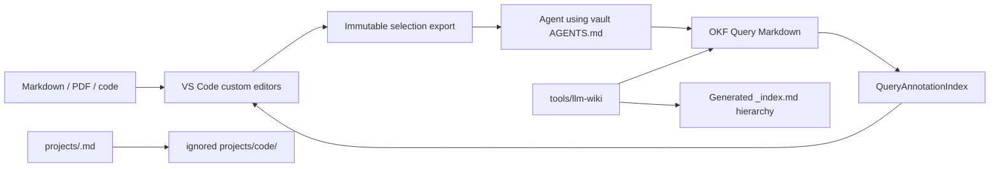

# LLM Wiki for VS Code: architecture and integration

## System boundary

The product is filesystem-first. VS Code/Cursor hosts the trusted extension and
custom Markdown/PDF editors. Git-backed Markdown is durable; `.llm_wiki/`
contains only local runtime and immutable agent-handoff artifacts. The
extension does not submit or scrape conversations. Agents follow the nearest
vault `AGENTS.md`; there is no required general LLM Wiki skill.

## Components

- `packages/vscode-extension`: activation, secure filesystem/URI routing,
  selection handoff, Query indexing, Markdown webview, and PDF host bridge.
- `packages/pdf-editor`: PDFium viewer, selection rectangles, navigation,
  Query overlays, and source-view state.
- `packages/core`: portable Markdown/PDF reference primitives.
- `tools/llm-wiki`: deterministic index production and layered validation.
- `.agents/skills/pdf`: focused PDF selection interpretation only.

## Selection handoff and Query indexing

Selections become immutable
`.llm_wiki/agent/exports/<selection-id>/selection.{md,json,png}` snapshots.
`open_uri` is the exact product link back to source; `chat_uri` is an internal
attachment bridge. Provider adapters add context to a draft and never press
Send.

`QueryAnnotationIndex` scans canonical `wiki/queries/*.md` and
`docs/llm-wiki/queries/*.md`. It retains `queries/*.md`,
`projects/*/queries/*.md`, and `wiki/learning/*.md` for one release as read-only
compatibility inputs. It parses bounded YAML, rejects traversal and symlinked
Query files, sorts deterministically, and performs no network calls.

Markdown resolution uses exact hash/offset first and unique contextual
relocation after an edit. PDF resolution requires the current byte hash before
returning page rectangles. The Markdown and PDF editors aggregate Queries and
expose accessible condensed-answer popovers.

## Vault and repository boundary

Graph-visible durable knowledge is under `wiki/`; summaries and playbooks are
outside it. `projects/<id>.md` is a portable VCS card. An optional checkout or
symlink is implied at opaque `projects/code/<id>`; no registry YAML or
submodule is involved. Code-owned knowledge stays in writable repositories at
`docs/llm-wiki/` and therefore follows their commits and branches.

Daily active recall is an AGENTS workflow generated lazily from `.md.tmpl`
templates and categorized `_log.md` entries. The extension has no daily-note
generator command.

The `relations[]` property on `wiki/**/*.md` is the only future graph-edge
source. The current graph implementation remains unchanged until a dedicated
graph-view phase.

## Trust and compatibility

The extension validates paths, URI payloads, Query metadata, PDF geometry, and
attachment sizes. Webviews receive bounded serializable data and insert
untrusted text with `textContent`. Compatibility identifiers remain unchanged:
package `llm-wiki-vscode`, publisher/commands under `llm-wiki`, `.llm_wiki`
storage, view types, and versioned open-anchor URI.
