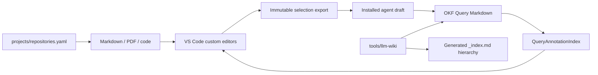

# LLM Wiki for VS Code: architecture and integration

## System boundary

LLM Wiki for VS Code is a filesystem-first extension. VS Code/Cursor hosts the
trusted extension process and custom Markdown/PDF editors. Git-backed Markdown
is the durable knowledge format; `.llm_wiki/` contains only local runtime and
immutable agent-handoff artifacts.

The extension does not submit or scrape conversations. A coding agent receives
an immutable source selection and, when the answer passes the repository skill's
quality gates, writes an ordinary OKF Query page.

## Components

- `packages/vscode-extension`: activation, secure filesystem/URI routing,
  selection handoff, Query indexing, Markdown webview, and PDF host bridge.
- `packages/pdf-editor`: shared PDFium viewer, text/area selection, exact point
  rectangles, navigation, Query overlays, and source-view state.
- `packages/core`: portable Markdown/PDF reference primitives.
- `tools/llm-wiki`: deterministic producers and layered vault validation.
- `.agents/skills/llm-wiki`: Hermes-derived authoring and maintenance policy.

## Selection handoff

Markdown and PDF selections become immutable
`.llm_wiki/agent/exports/<selection-id>/selection.{md,json,png}` snapshots.
`open_uri` is a product deep link back to the exact source; `chat_uri` is an
internal attachment bridge. Provider adapters add files or source ranges to an
existing draft and never press Send.

## Query indexing and annotations

`QueryAnnotationIndex` scans only `queries/*.md`,
`projects/*/queries/*.md`, and the one-release read-only
`wiki/learning/*.md` adapter. It parses bounded YAML, rejects traversal and
symlinked Query files, sorts lifecycle/update/path deterministically, and
performs no network calls.

Each Query anchor binds through `source_id` to a provenance source. Markdown
resolution uses exact hash/offset first and unique contextual relocation after
an edit. PDF resolution requires the current byte hash before returning page
rectangles. Providers send only resolved annotations to webviews.

The Markdown editor aggregates Queries sharing a range and exposes an
accessible `✦ Query`/`✦ N Queries` popover on hover, focus, caret, or pinned
activation. The PDF viewer renders a dedicated non-destructive overlay using
the same point coordinate system as selections and exposes the same ordered
answers. Open Query actions use the existing validated Markdown navigation.

## Vault boundary

Canonical OKF navigation uses regular `_index.md` and `_log.md` files only.
Repository-implementation material stays in
the project code vault; higher-level learning and papers stay in the outer
vault. Registered in-place code working copies and flat LFS assets are opaque.

Repository claims bind to an immutable VCS revision and verified content. An
optional in-place working copy can advance without changing historical truth;
the validator reports currentness separately. Missing or dirty evidence remains
draft.

## Trust and compatibility

The extension host validates all paths, URI payloads, Query metadata, PDF
geometry, and attachment sizes. Webviews receive bounded serializable data and
insert untrusted text only through `textContent`. No arbitrary HTML from a
Query enters a popover.

Compatibility identifiers remain unchanged: package `llm-wiki-vscode`,
publisher/commands under `llm-wiki`, `.llm_wiki` storage, view types, and the
versioned open-anchor URI. The `wiki/learning` reader remains a temporary
compatibility input; producers and new writes use `_index.md`, `_log.md`, and
OKF Queries.
