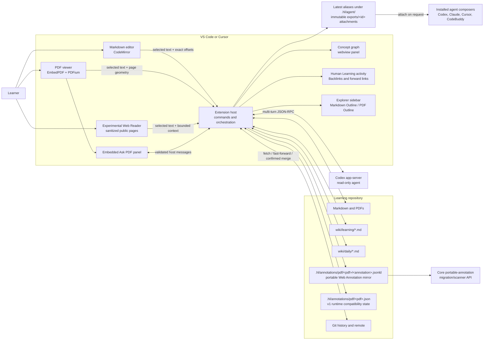

# Human Learning: Architecture and VS Code Integration

> Desktop-only product architecture, updated for the filesystem-first
> implementation on 2026-08-10.

## 1. Product in one sentence

Human Learning currently turns a normal Git repository into a personal
learning wiki: read Markdown and PDFs, capture selected web passages, attach
source context to a supported agent draft, keep PDF questions and answers as
source-linked Markdown, revisit them on a fixed schedule, and explore the
resulting concept graph.

The combined VS Code extension is the product. Cursor can host the same
extension because it implements the VS Code extension API. A web or mobile app
is intentionally out of scope; the target is a locally installed extension in
VS Code-family desktop hosts.

### Naming proposal: Threadmark

**Threadmark** is the recommended product name: “thread” describes a discussion
that continues across reading sessions, while “mark” describes the durable
annotation that connects a passage to that discussion.

This is a naming proposal, not a code rename. The extension package, command
IDs, view IDs, file markers, and current UI still use `human-learning` or
“Human Learning.” Renaming those identifiers should be a separate compatibility
change if the proposal is accepted.

## 2. The main architectural decision

The active extension uses **files and Git as the source of truth**. It does not
use or need SQLite. No database file is required to open, query, annotate,
review, graph, or sync a repository.

This is a better fit for the learning workflow because:

- every learning answer, citation, review date, and task is readable Markdown,
  while renderer-specific PDF geometry remains inspectable JSON;
- Git can diff, merge, sync, and recover the knowledge base;
- links keep working outside the extension;
- an agent can inspect and edit the same material without a database protocol;
- there is no hidden index that can disagree with the repository;
- a cloned repository is immediately usable.

The legacy database packages and adapters have been removed. The combined
extension consumes the small portable-reference and PDF-discussion surface
from [`packages/core/src/index.ts`](../packages/core/src/index.ts) and does not
ship `sql.js`, a SQLite WASM asset, or a required `.hl/index.sqlite`.

## 3. System overview



There are three clean boundaries:

1. **Repository files** are durable truth.
2. **The extension host** owns privileged work: filesystem access, Git, VS Code
   APIs, and agent processes.
3. **Webviews** own interaction and rendering. They never access the filesystem
   or launch processes directly.

## 4. What stays in the product

| Capability | Keep? | Implementation |
| --- | --- | --- |
| Markdown viewer/editor | Yes | VS Code custom text editor backed by CodeMirror |
| PDF viewer | Yes | VS Code custom readonly editor backed by EmbedPDF/PDFium |
| Ask about selected text | Yes | External supported agent for Markdown; built-in Ask PDF panel for PDF |
| Direct agent handoff | Yes | Automatic selection prompt, context menus, `Cmd+L` / `Ctrl+L`, and PDF selection toolbar |
| Web selection handoff | Experimental | Cursor Browser capture when private commands exist; extension-owned sanitized reader on stock VS Code |
| Multi-turn discussion | Yes | Ask PDF only; no Learning Chat sidebar |
| Durable answer | Yes | One Markdown learning note per Ask PDF discussion |
| Source highlight and note link | Yes | Markdown offset/quote annotation with **✦ Note** open; PDF Web Annotation JSON-LD mirror plus current v1 viewer state |
| Concept/entity graph | Yes | Markdown links plus explicit `concepts` and `entities` YAML frontmatter |
| Backlinks/forward links | Yes | Parsed directly from repository Markdown |
| Daily note and review plan | Yes | Generated Markdown with fixed review dates and TODO carry-forward |
| Remote update and merge | Yes | Safe Git fetch/fast-forward/confirmed merge |
| SQLite in the combined extension | No | Removed from its runtime and build |
| MCP server | No | Removed; future integration only if a concrete consumer exists |
| `hl` CLI | No | Removed; future automation should use filesystem-first APIs |
| Mobile app | No | Explicitly out of scope |

## 5. Repository layout

No special vault initialization is required. Opening any folder in VS Code or
Cursor is enough.

```text
my-learning-repo/
├── notes/                         # ordinary authored Markdown
├── papers/                        # PDFs or other sources
├── wiki/
│   ├── learning/
│   │   └── 2026-08-10-question-<id>.md
│   └── daily/
│       └── 2026-08-10.md
├── .hl/
│   ├── annotations/
│   │   └── pdf/
│   │       ├── <pdf-sha256>.json  # current v1 runtime compatibility state
│   │       ├── <pdf-sha256>/
│   │       │   └── <annotation-id>.jsonld
│   │       │                         # portable Web Annotation mirror
│   │       └── assets/              # attempted 24 pt padded PNG crops
│   └── agent/
│       ├── selection.md           # latest exact-selection alias
│       ├── selection.json         # latest structured-context alias
│       ├── selection.png          # optional latest validated PDF-crop alias
│       └── exports/
│           └── <id>/              # immutable handoff snapshot
│               ├── selection.md   # file attached to an agent composer
│               ├── selection.json
│               └── selection.png  # optional validated PDF crop
└── .git/
```

The active Markdown wiki scan ignores generated/build directories such as
`.git`, `.hl`, `node_modules`, `dist`, and `out`. The core package separately
exposes a deliberately narrow portable-annotation scanner API for
`.hl/annotations/pdf/<pdf-sha256>/<annotation-id>.jsonld`. That API supports
migration and interchange; `filesystemWiki`, the graph, and the current PDF
viewer do not call it yet.

### Learning-note schema

Each discussion is saved under `wiki/learning/` with stable frontmatter and
human-readable sections:

```markdown
---
id: "3d..."
type: learning-note
status: draft
source:
  kind: "markdown"
  path: "notes/attention.md"
  link: "notes/attention.md#L12-L14"
  location: "lines 12–14"
source_start_line: 12
source_end_line: 14
source_from: 120
source_to: 196
created: "2026-08-10T09:00:00.000Z"
updated: "2026-08-10T09:05:00.000Z"
review_dates:
  - "2026-08-11"
  - "2026-08-13"
  - "2026-08-17"
  - "2026-08-24"
  - "2026-09-09"
  - "2026-10-09"
  - "2026-11-08"
---

# Why does attention remove the recurrence bottleneck?

## Summary

**Question:** Why does attention remove the recurrence bottleneck?

**Answer:** The concise result of the discussion...

## Source

[Open source](<../../notes/attention.md#L12-L14>)

**Location:** lines 12–14

### Quoted passage

```text
Exact selected passage...
```

## Discussion

### Question 1

...

### Answer 1

...
```

The selected quote and the full transcript are retained. Markdown text remains
exact; a PDF quote is the canonical extracted form, with geometry and the crop
preserving the visual source. The summary is an additional retrieval and
review aid, not a replacement for the raw evidence.
Repeated questions in the same chat update the same file. A marked personal
notes region is preserved byte-for-byte during regeneration.

For a source inside the repository, both `source.path` and `source.link` are
workspace-relative POSIX paths. Markdown selections use `#L12` or
`#L12-L14`; PDFs retain their page fragment, such as `#page=3`. The visible
**Open source** link is relative to the learning note itself, so it survives a
clone or repository move. Local `file://` URIs are not persisted for these
workspace sources. Character offsets and the selected quote remain in
frontmatter and the body for annotation restoration.

### PDF persistence has three roles during migration

For a PDF inside the repository, three ordinary file-backed representations
cooperate:

| Record | Path | Current role |
| --- | --- | --- |
| Learning note | `wiki/learning/*.md` | Canonical, human-readable Q&A truth: source quote, portable link, summary, full transcript, and review schedule |
| Portable annotation mirror | `.hl/annotations/pdf/<pdf-sha256>/<annotation-id>.jsonld` | One [W3C Web Annotation](https://www.w3.org/TR/annotation-model/)-shaped JSON-LD document per asked annotation for interchange and the core migration/scanner API |
| v1 runtime sidecar | `.hl/annotations/pdf/<pdf-sha256>.json` | Current PDF viewer/controller compatibility state, including geometry, turn state, and transcript UI state |

The JSON-LD document is a **portable mirror during migration**, not yet the
sole canonical store. The PDF runtime continues to read and update the v1
sidecar, while the Markdown learning note remains the authority for what the
learner asked and what the agent answered. Retiring the v1 sidecar requires a
separate migration after the runtime can use the portable mirror directly.

Each portable mirror targets the source PDF with complementary selectors:

| Selector | Meaning |
| --- | --- |
| `TextQuoteSelector` | `exact` stores the selected passage. The core portable-annotation scanner API reads this field rather than parsing v1 transcript state. |
| RFC 8118 page selector | Identifies the one-based PDF page with the `page=N` fragment defined by [RFC 8118](https://www.rfc-editor.org/rfc/rfc8118). |
| Human Learning multi-rectangle selector | Stores every selection rectangle as `[left, top, right, bottom]` in PDF points (`pt`, 1/72 inch), measured right and down from a top-left origin. This project-specific selector extends the portable model without pretending that W3C defines PDF rectangles. |

The quote, page, and geometry are intentionally redundant. A consumer that
does not understand the custom rectangle selector can still identify the page
and exact text. The current Human Learning viewer has not migrated to these
selectors; it continues to restore highlights from the v1 sidecar.

Every newly asked PDF annotation attempts to capture and store a PNG screenshot
crop with 24 PDF points of padding around the union of the selection
rectangles, clamped to the page. When capture succeeds, snapshot metadata
records the crop as `[left, top, right, bottom]`, `padding: 24`, and
`unit: "pt"` alongside the PNG reference, hash, and pixel dimensions. The crop
is supporting visual evidence, not part of anchor identity: if rendering or
capture is unavailable, the quote/page/rectangle anchor remains valid and the
question proceeds with text-only context.

All three records are filesystem and Git truth, but they serve different
purposes. Markdown alone cannot reconstruct PDF highlight geometry, and the v1
runtime file alone is not the portable interchange format.

If a PDF is outside the repository, runtime compatibility state uses the
extension's host-controlled global storage instead of writing beside an
unrelated external document. Repository JSON-LD mirrors apply to PDFs managed
inside the opened learning repository.

## 6. VS Code and Cursor integration

The extension manifest is
[`packages/vscode-extension/package.json`](../packages/vscode-extension/package.json).
Activation in
[`packages/vscode-extension/src/extension.ts`](../packages/vscode-extension/src/extension.ts)
registers:

- Markdown and PDF custom editors;
- Backlinks and Forward Links in the Human Learning activity view;
- context-aware Markdown Outline and PDF Outline panels in the main Explorer
  sidebar;
- daily-note, graph, Git-sync, navigation, and selection commands;
- Cursor Browser capture and the extension-owned Experimental Web Reader;
- a Markdown file watcher that refreshes links and annotations.

The same entry point runs in Cursor. There is no Cursor-specific storage or
forked UI.

### Markdown path

[`MarkdownEditorProvider`](../packages/vscode-extension/src/markdownEditorProvider.ts)
keeps VS Code's `TextDocument` as the backing document. The CodeMirror webview
sends edits and raw selection offsets to the host. The host applies edits
through `WorkspaceEdit`, so save, undo, external file changes, and Git behave
like a normal VS Code document.

When text is selected, the learner can:

- use the automatic **Cmd+L Add to Chat** selection prompt;
- right-click **Add to Chat**;
- press `Cmd+L` on macOS or `Ctrl+L` elsewhere.

These surfaces all send the same exact Markdown selection through the shared
handoff described below. Human Learning uses stable editor-tab evidence first,
falls back to feature-detected provider commands, asks when ambiguous, and
does not submit the resulting draft.

When a saved learning note references the current document,
[`LearningNoteStore`](../packages/vscode-extension/src/learningNoteStore.ts)
returns its annotation. The webview highlights the original range and renders a
small **✦ Note** link beside it. If offsets became stale after editing, it falls
back to finding the exact stored quote.

The annotation payload includes the latest saved question, question count, and
concise answer. Hover, marker focus, or a collapsed caret inside the resolved
`[from, to)` range shows those fields in a VS Code-themed floating tooltip.
The overlay is clamped to the viewport and does not participate in editor
layout.

Clicking **✦ Note** sends the annotation's discussion ID and repository-relative
learning-note path to the host. The host validates and reloads that Markdown
note and opens it. It does not restore a sidebar transcript or start a new
agent thread.

### PDF path

[`PdfEditorProvider`](../packages/vscode-extension/src/pdfEditorProvider.ts)
reads PDF bytes through `vscode.workspace.fs` and sends them to the PDF webview.
PDFium renders locally; no document is uploaded by the renderer.

The learner selects a passage and opens Ask PDF. The webview attempts the
24 pt padded PNG crop before the first submission. Submitting the first
question creates the asked annotation, persists the crop and metadata when
available, and writes its portable JSON-LD mirror. A missing crop is non-fatal:
text, page, and rectangle selectors still identify the source. After a
successful answer, the provider also writes the repository learning note. The
Ask panel exposes **Open learning note**. Its source link is
repository-relative and carries the PDF page fragment.

During migration, reopening the PDF restores precise geometry and
discussion/transcript UI state from the tracked v1
`.hl/annotations/pdf/<pdf-sha256>.json` compatibility sidecar. The core
portable-annotation API can scan the per-annotation
`.hl/annotations/pdf/<pdf-sha256>/<annotation-id>.jsonld` mirror, including
`TextQuoteSelector.exact`, for migration or interchange. The active
`filesystemWiki`, graph, and PDF viewer do not consume that mirror yet. The
readable summary and full Q&A remain in `wiki/learning/*.md`.

For a direct external handoff, **Add to Chat** appears in the PDF
selection context menu, floating selection toolbar, and editor title toolbar.
`Cmd+L` on macOS or `Ctrl+L` elsewhere invokes the same action while a valid
PDF selection is active. It uses the canonical extracted quote and portable
page/text-fragment anchor. PDFium line-wrap hyphens may be normalized out of
that quote; rectangle geometry and the crop preserve the visual source. A
fresh crop is attempted for this action; capture failure leaves the text
handoff usable.

PDF rendering uses the lightweight, file-backed discussion types from
`core`; it does not open or maintain a wiki database. The JSON-LD mirror does
not become the sole canonical runtime store merely because it exists.

### Web path

Cursor-specific capture is enabled only when the host exposes the required
Browser commands. Human Learning then reads the active selection and bounded
neighbor text, checks tab and URL identity before and after capture, and
accepts a crop only after PNG and expected-dimension validation. These
undocumented commands are isolated behind capability detection and are not
assumed on stock VS Code.

VS Code's stable API cannot inspect another extension's Simple Browser webview.
The separate Experimental Web Reader is therefore an extension-owned,
script-free reader for public HTTP(S) pages. The host pins and revalidates
public network addresses across redirects and bounds time, headers, and body
size. The webview sanitizes the response and omits scripts, forms, credentials,
remote media, and active page behavior. Its selection handoff carries exact
text, bounded before/after context, URL/title metadata, and an optional
synthetic context image rather than a screenshot of the remote page.

### Shared agent handoff

**Send Selection to Agent…** writes an immutable snapshot of exact Markdown
text or the canonical PDF extracted quote under `.hl/agent/exports/<id>/`,
refreshes the convenient latest aliases
`.hl/agent/selection.md` and `.json`, discovers installed agent commands at
runtime, and attaches the snapshot's Markdown file to Codex, Claude Code,
Cursor Agent, or CodeBuddy.

**Add to Chat** calls the same export and shared agent handoff directly.
It attaches `.hl/agent/exports/<id>/selection.md` first and, for a PDF, may
attach the validated sibling `selection.png`. Crop capture, persistence, or
optional crop attachment failure is non-fatal: the Markdown attachment remains
usable and Human Learning warns before continuing text-only. The stable
`.hl/agent/selection.{md,json,png}` paths remain latest-export aliases rather
than the files attached to an agent draft. The command prefers stable active
editor-chat evidence, uses provider-specific draft commands only when
available, asks when ambiguous, and never submits. If no supported provider is
available, it retains the export and shows an availability warning. Human
Learning cannot read an external transcript, so the answer is not
automatically written to `wiki/learning/`.

## 7. Selection-to-knowledge lifecycle

```mermaid
sequenceDiagram
    actor Learner
    participant Viewer as Markdown or PDF viewer
    participant Host as Extension host
    participant Cursor as Cursor composer
    participant AskPDF as Ask PDF panel
    participant Agent as Codex app-server
    participant Note as wiki/learning note
    participant Mirror as PDF JSON-LD mirror
    participant Runtime as PDF v1 sidecar

    Learner->>Viewer: Select a passage
    alt Add to Chat
        Learner->>Viewer: Use prompt, menu, or Cmd/Ctrl+L
        Viewer->>Host: Exact quote + source anchor
        Host->>Host: Write immutable selection export
        Host->>Cursor: Attach selection.md (+ optional PDF crop)
        Note over Cursor: Composer opens; nothing is submitted
    else Ask PDF
        Learner->>AskPDF: Ask about the PDF selection
        Viewer->>Viewer: Attempt 24 pt padded PNG crop
        AskPDF->>Host: Source packet + question + crop when available
        Host->>Agent: Transcript + source + question
        Agent-->>Host: Stream answer
        Host-->>AskPDF: Stream answer
        Host->>Mirror: Write portable selectors + crop metadata when available
        Host->>Runtime: Update current viewer/discussion state
        Host->>Note: Upsert summary, source, and full Q&A
    end
    Runtime-->>Viewer: Restore current PDF geometry and UI state
    Viewer-->>Learner: Markdown ✦ Note or PDF highlight
    Learner->>Viewer: Click Markdown ✦ Note later
    Viewer->>Host: Discussion ID + relative note path
    Host->>Note: Validate and open durable note
```

This is the core invariant: **every visible annotation can be traced to a
durable Markdown explanation, and every explanation can be traced back to its
raw source passage.** External agent handoff is intentionally separate and
does not claim to create a durable answer. The JSON-LD mirror makes the PDF source
anchor portable; the v1 sidecar remains the current viewer's compatibility
state during migration.

## 8. Filesystem wiki and graph

[`filesystemWiki.ts`](../packages/vscode-extension/src/filesystemWiki.ts)
recursively parses Markdown and derives:

- Markdown links;
- `[[wikilinks]]`, aliases, and heading targets;
- backlinks and forward links;
- broken note and missing-heading diagnostics;
- note nodes and deduplicated note-to-note edges;
- typed concept/entity nodes and note-to-metadata edges;
- PDF and other asset references.

Concepts and entities are explicit, reviewable YAML rather than inferred or
stored in a hidden index. Both inline and block string lists are supported:

```yaml
---
concepts: [Spaced repetition, Retrieval practice]
entities:
  - Hermann Ebbinghaus
  - SuperMemo
---
```

Values are normalized and deduplicated case-insensitively. Scalar, object, or
unterminated metadata is ignored instead of guessed. A concept and an entity
with the same label remain different typed nodes. Ordinary Markdown links still
produce the original note graph; frontmatter only adds explicit note-to-concept
and note-to-entity relationships.

[`BacklinksProvider`](../packages/vscode-extension/src/backlinksProvider.ts)
feeds the tree views.
[`KnowledgeGraphPanel`](../packages/vscode-extension/src/knowledgeGraphPanel.ts)
renders the derived graph as CSP-safe SVG with distinct note, concept, and
entity styling, an honest legend, and an accessible text fallback. The panel
states that it uses only explicit Markdown/frontmatter relationships and does
not infer missing connections.

### Portable PDF scanner boundary

The core PDF-discussion module exposes a separate
`scanPortablePdfAnnotations()` API for migration and interoperability work. It
walks only the content-addressed JSON-LD mirror directories and reads
`TextQuoteSelector.exact` as the original selected passage, together with the
page and rectangle selectors.

This core API is not part of the current interactive read path:
`filesystemWiki` does not call it, `KnowledgeGraphPanel` does not add its
records to the graph, and `PdfEditorProvider` still reloads annotations from
the v1 sidecar. The separation keeps the mirror useful and testable without
claiming that the UI migration is already complete.

## 9. Daily learning workflow

[`generateDailyNote()`](../packages/vscode-extension/src/dailyNotes.ts) creates
or refreshes `wiki/daily/YYYY-MM-DD.md`.

It collects:

- learning notes whose `review_dates` are due;
- unchecked TODOs from the latest earlier daily note;
- a manual **Today** area for priorities and reflection.

The fixed Ebbinghaus-style schedule is 1, 3, 7, 14, 30, 60, and 90 days after a
learning note is created. Filenames and review dates use the desktop's local
calendar day, not the UTC date embedded in the ISO timestamp. This keeps
“today” aligned with the learner near UTC midnight and across normal local-day
boundaries.

Reviews due on or before the requested day appear until completed. When a
review checkbox is checked in an earlier daily note, later generation scans the
generated review regions in prior daily files and suppresses that exact
note-and-due-date pair. An unchecked overdue review remains visible. Review
checkboxes are excluded from TODO carry-forward, while ordinary unchecked tasks
come from the latest earlier daily note.

Regeneration is idempotent: generated regions update while manual text and
current-day checkbox state are preserved. This is deliberately a transparent
review plan rather than an opaque adaptive scheduler.

## 10. Remote sync and merge

[`repositorySync.ts`](../packages/vscode-extension/src/repositorySync.ts)
implements a conservative pull workflow:

1. verify the folder is a Git repository;
2. fetch and prune remote refs without touching working files;
3. verify an upstream exists and refuse any merge when the worktree is dirty;
4. report up-to-date or local-ahead state;
5. fast-forward when possible;
6. request explicit confirmation before a true merge.

The extension never pushes, commits, resets, stashes, or deletes files. This
keeps generated learning notes under the learner's normal Git review process.

## 11. Why the repository has no MCP server or CLI

MCP and CLI can be useful integration styles, but neither belongs in the
interactive frontend's critical path and neither currently has a concrete
consumer.

| Concern | MCP | CLI |
| --- | --- | --- |
| Typical caller | An external AI agent or agent host | A person, shell script, CI job, or scheduler |
| Interface | Discoverable structured tools with typed inputs and results | Commands, flags, exit codes, and standard input/output |
| Best use here | Agent interoperability with controlled wiki operations | Headless maintenance, migration, linting, and automation |
| Required by the desktop extension | No | No |

The legacy implementations were removed because they depended on a second
SQLite-backed runtime. A future integration can reuse the filesystem parsing
and note-writing functions, but it must remain an access surface rather than an
alternate persistence layer.

### MCP

The Model Context Protocol lets an external agent discover and call structured
tools. A future Human Learning MCP server could be useful when a separate agent needs
operations such as:

- search this wiki;
- list backlinks or broken links;
- retrieve a source passage with provenance;
- create or update a learning note through a controlled tool.

It would be an interoperability boundary for agents, not a UI framework or a
requirement for the VS Code extension. The extension already has direct access
to its workspace and should not start an MCP subprocess merely to read local
files.

### CLI

A future CLI would be justified only by a concrete headless workflow such as:

- CI linting of links and note schemas;
- bulk imports or migrations;
- scheduled generation outside the editor;
- repository health checks;
- debugging and administrative operations.

The learner does not need a CLI for ordinary reading, asking, annotating,
reviewing, graphing, or syncing in VS Code.

### SQLite decision

SQLite and its legacy adapters have been removed. Do not create a second
filesystem index that becomes required state; reparsing Markdown is fast enough
for the expected personal-wiki scale, and an optional in-memory cache can be
added later without changing persistence.

## 12. Security and reliability boundaries

- Webviews have a restrictive content-security policy and communicate only with
  validated host messages.
- Opening a Markdown annotation accepts a repository-relative note path,
  confines it to `wiki/learning/`, and requires the stored discussion ID to
  match.
- External URLs use `vscode.env.openExternal`.
- Agent threads are read-only and cannot silently edit the repository.
- Learning-note writes are serialized and atomic.
- A failed PDF crop never invalidates the text/page/rectangle anchor or blocks
  a text-only question.
- Git sync refuses a dirty tree and asks before merging divergent history.
- Agent text is rendered as text, not injected HTML.
- Source quotes and transcripts are preserved so summaries remain auditable.

## 13. Build and verification

The combined build emits:

| File | Runtime |
| --- | --- |
| `dist/extension.js` | Node/Electron extension host |
| `dist/markdown-editor.js` | Markdown webview |
| `dist/pdf-viewer.js` | PDF webview |
| `dist/experimental-owned-browser.js` | Sanitized experimental web reader |
| `dist/pdfium.wasm` | Local PDF renderer |

It intentionally does not emit `sql-wasm.wasm` or require
`.hl/index.sqlite`.

Useful commands:

```bash
pnpm --filter human-learning-vscode exec tsc --noEmit
pnpm --filter @human-learning/core test
pnpm --filter human-learning-vscode test
pnpm exec playwright test --config playwright.config.ts
```

The test layers cover pure filesystem behavior, learning-note persistence,
daily-note regeneration, Git decisions, graph rendering, Codex transport,
webview message safety, Markdown annotations, W3C JSON-LD mirror serialization
and scanning, PDF crop success/failure, PDF interactions, and extension
activation. The final product should also be smoke-tested in both VS Code and
Cursor because browser-only tests cannot prove host registration, the
selection prompt, shortcuts, menus, PDF crop attachment, or composer behavior.

## 14. Recommended next phases

### Phase 1: current desktop MVP

- Filesystem-first wiki and graph
- Markdown/PDF/web selection handoff to a supported agent draft without
  automatic submission
- Ask PDF multi-turn questions, durable learning notes, and source annotations
- Portable per-annotation PDF JSON-LD mirrors alongside v1 runtime
  compatibility state
- Best-effort 24 pt padded PDF selection crops
- Fixed review schedule and daily notes
- Safe Git sync
- Codex-backed Ask PDF

### Phase 2: deeper provider integration and retrieval

- Add full answer streaming and learning-note persistence for another provider
  only if it exposes a stable local API
- Add full-text in-memory search for larger repositories
- Migrate the PDF viewer/controller to read the portable JSON-LD records
  directly, then retire the v1 compatibility sidecar only after verified
  conversion
- Optionally suggest concept/entity metadata, but require review before writing
  it to the explicit YAML frontmatter
- Add an annotation repair tool for sources that changed substantially

### Phase 3: learning quality

- Record review outcomes in Markdown
- Adjust future schedules from recall quality while keeping them inspectable
- Generate weekly synthesis notes and unresolved-question lists
- Add wiki lint rules for unsupported claims, orphan concepts, and broken
  provenance

## 15. Where to change the implementation

| Goal | Start here |
| --- | --- |
| Register commands, views, or providers | [`extension.ts`](../packages/vscode-extension/src/extension.ts) |
| Change Markdown host synchronization | [`markdownEditorProvider.ts`](../packages/vscode-extension/src/markdownEditorProvider.ts) |
| Change Markdown rendering or annotations | [`webview-src/markdown-editor.ts`](../packages/vscode-extension/webview-src/markdown-editor.ts) |
| Change PDF host behavior | [`pdfEditorProvider.ts`](../packages/vscode-extension/src/pdfEditorProvider.ts) |
| Change PDF rendering or Ask UI | [`packages/pdf-editor/src/webview`](../packages/pdf-editor/src/webview) |
| Change durable discussion notes | [`learningNoteStore.ts`](../packages/vscode-extension/src/learningNoteStore.ts) |
| Change daily reviews | [`dailyNotes.ts`](../packages/vscode-extension/src/dailyNotes.ts) |
| Change links or graph extraction | [`filesystemWiki.ts`](../packages/vscode-extension/src/filesystemWiki.ts) |
| Change Git update behavior | [`repositorySync.ts`](../packages/vscode-extension/src/repositorySync.ts) |
| Change agent handoff | [`agentHandoff.ts`](../packages/vscode-extension/src/agentHandoff.ts) |
| Change Ask PDF Codex transport | [`codexAppServerClient.ts`](../packages/vscode-extension/src/codexAppServerClient.ts) |

The design rule is simple: keep durable learning state in readable repository
files, keep privileged operations in the extension host, and keep webviews
focused on presentation and interaction.
